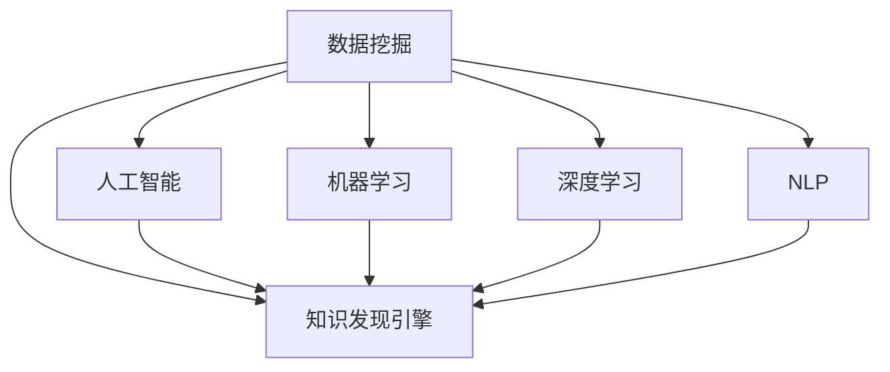

                 

# 程序员如何利用知识发现引擎提升效率

> 关键词：知识发现引擎, 效率提升, 大数据分析, 数据挖掘, 人工智能

## 1. 背景介绍

在信息爆炸的时代，程序员面对的海量数据和复杂逻辑，需要更高效的知识发现和决策手段。传统的搜索和文档阅读方式已经无法满足日益增长的信息需求。知识发现引擎作为一种新兴的数据处理和信息挖掘工具，能够自动从大规模数据集中提取有价值的信息，为程序员提供更精准、更便捷的信息支持，从而大幅提升工作效率。本文将深入探讨知识发现引擎的核心原理和操作方法，并结合实际案例展示其应用效果。

## 2. 核心概念与联系

### 2.1 核心概念概述

为理解知识发现引擎的工作机制和操作流程，本节将详细介绍几个核心概念：

- 知识发现引擎(Knowledge Discovery Engine, KDE)：通过数据挖掘和统计分析，从海量数据中提取有价值的知识，供决策者使用的软件工具。

- 数据挖掘(Data Mining)：一种从原始数据中自动发现模式、规则和关联的技术。通过各种算法和模型，挖掘出数据背后的隐含知识。

- 人工智能(Artificial Intelligence, AI)：研究让计算机模拟人类智能行为的科学，包括知识表示、推理、学习等。

- 机器学习(Machine Learning, ML)：人工智能的一个分支，利用数据和算法自动学习规律，解决实际问题。

- 深度学习(Deep Learning, DL)：机器学习的一个高级形式，通过多层神经网络模型处理复杂数据。

- 自然语言处理(Natural Language Processing, NLP)：人工智能的一个分支，使计算机能够理解、处理和生成自然语言。

这些概念之间的关系通过以下Mermaid流程图展示：



通过这些关键概念的介绍，我们可以更加清楚地理解知识发现引擎的运作方式和其与人工智能、机器学习等前沿技术的联系。

## 3. 核心算法原理 & 具体操作步骤
### 3.1 算法原理概述

知识发现引擎的核心原理是通过对大规模数据集的统计分析和机器学习技术，挖掘出潜在的有价值信息。其主要步骤如下：

1. 数据预处理：清洗、整合、转换原始数据，使其满足挖掘算法的要求。
2. 特征选择与提取：选择对挖掘任务有帮助的特征，并进行有效的提取。
3. 模型训练：使用机器学习算法训练模型，识别数据中的规律和模式。
4. 知识挖掘：基于训练好的模型，提取数据中的知识，生成报告或可视化展示。

### 3.2 算法步骤详解

知识发现引擎的具体操作步骤包括：

1. 数据收集与预处理
   - 数据收集：从数据库、日志文件、文本文件、Web页面等渠道获取数据。
   - 数据清洗：去除噪声、填补缺失值、处理异常值，确保数据质量。
   - 数据整合：将来自不同渠道的数据进行整合，形成一个完整的数据集。
   - 数据转换：将数据转换为模型所需的格式，如数值化、标准化等。

2. 特征选择与提取
   - 特征选择：根据任务需求，筛选出对挖掘任务有帮助的特征。
   - 特征提取：使用数学模型、算法或规则对特征进行提取和转换，生成更易处理的特征集合。
   - 特征组合：将多个特征进行组合，生成更复杂、更有意义的特征集合。

3. 模型训练
   - 选择算法：根据任务需求，选择合适的机器学习算法，如分类、回归、聚类等。
   - 数据划分：将数据集划分为训练集和测试集，确保模型泛化能力。
   - 模型训练：使用训练集训练模型，优化模型参数。
   - 模型评估：在测试集上评估模型性能，选择最优模型。

4. 知识挖掘
   - 知识提取：基于训练好的模型，从数据中提取知识，生成规则、模式、关联等。
   - 知识展示：将提取的知识以可视化图表、报告等形式展示，便于理解和使用。

### 3.3 算法优缺点

知识发现引擎的主要优点包括：

- 高效自动化：能够自动处理大规模数据，快速发现数据中的知识，提高工作效率。
- 通用性强：适用于多种类型的挖掘任务，如分类、聚类、关联规则等。
- 灵活性高：可以自定义数据来源、挖掘算法和知识展示方式，满足不同应用需求。

缺点主要包括：

- 数据质量要求高：数据质量直接影响挖掘结果的准确性，需要清洗和预处理的数据量较大。
- 算法复杂度高：有些高级挖掘算法需要复杂的数据结构和计算资源，实施难度较大。
- 结果可解释性差：挖掘结果常常需要专业知识才能理解，普通人难以解读。

### 3.4 算法应用领域

知识发现引擎在多个领域都有广泛的应用，包括但不限于：

- 商业智能：用于市场分析、客户细分、销售预测等。
- 金融分析：用于风险评估、信用评分、投资决策等。
- 医疗研究：用于疾病预测、基因分析、药物开发等。
- 社交网络：用于用户行为分析、兴趣推荐、网络结构分析等。
- 安全监控：用于异常检测、欺诈识别、入侵检测等。

## 4. 数学模型和公式 & 详细讲解 & 举例说明

### 4.1 数学模型构建

知识发现引擎的数学模型构建一般分为以下几个步骤：

1. 数据表示：将原始数据转化为数值形式，便于模型处理。
2. 特征提取：将数据特征映射为数学向量，生成特征集合。
3. 模型训练：使用机器学习算法训练模型，生成模型参数。
4. 结果评估：使用测试集评估模型性能，选择最优模型。

### 4.2 公式推导过程

以分类任务为例，我们介绍知识发现引擎的数学模型构建过程。

假设有一组数据集 $D=\{(x_i,y_i)\}_{i=1}^N$，其中 $x_i \in \mathbb{R}^d$ 为输入向量，$y_i \in \{0,1\}$ 为分类标签。我们的目标是训练一个分类器 $f(x)$，使其能够正确预测新样本的分类。

1. 数据表示：将原始数据 $x_i$ 转换为数值向量 $x_i \in \mathbb{R}^d$，便于模型处理。
2. 特征提取：使用PCA等降维算法，将数据特征映射为低维空间 $x_i \in \mathbb{R}^k$，生成特征集合。
3. 模型训练：使用逻辑回归模型训练分类器 $f(x)$，生成模型参数 $\theta$。
4. 结果评估：在测试集上评估模型性能，选择最优模型。

### 4.3 案例分析与讲解

以下以商业智能为例，展示知识发现引擎的应用。

假设某电商公司希望了解用户购买行为，预测用户的购买意向。公司收集了用户的购买记录、浏览记录、评价信息等数据，共有 $M$ 个用户，$N$ 个商品，$T$ 次购买行为。每条记录包含用户ID、商品ID、购买时间、购买数量等特征。

**数据预处理**：
- 清洗数据，去除噪声和异常值。
- 整合数据，将多个数据源的数据合并成一个完整的数据集。
- 数据转换，将数据转换为数值形式，便于模型处理。

**特征选择与提取**：
- 特征选择：选择对预测任务有帮助的特征，如用户ID、商品ID、购买时间、购买数量等。
- 特征提取：使用PCA等降维算法，将特征映射为低维空间，生成特征集合。

**模型训练**：
- 选择算法：使用随机森林或支持向量机等算法训练分类模型。
- 数据划分：将数据集划分为训练集和测试集，确保模型泛化能力。
- 模型训练：使用训练集训练模型，优化模型参数。

**知识挖掘**：
- 知识提取：基于训练好的模型，从数据中提取知识，生成规则、模式、关联等。
- 知识展示：将提取的知识以可视化图表、报告等形式展示，便于理解和使用。

## 5. 项目实践：代码实例和详细解释说明

### 5.1 开发环境搭建

为了进行知识发现引擎的实践，我们需要搭建一个基于Python的开发环境。以下是安装和配置Python开发环境的步骤：

1. 安装Python：从官网下载并安装Python 3.8以上版本。
2. 安装Anaconda：安装Anaconda，创建独立的Python环境。
3. 激活环境：通过命令行激活Python环境。

```bash
conda activate py38_env
```

4. 安装相关库：安装所需的数据挖掘和机器学习库，如Scikit-Learn、Pandas、Numpy等。

```bash
pip install scikit-learn pandas numpy
```

完成以上步骤后，就可以开始知识发现引擎的实践了。

### 5.2 源代码详细实现

以下是一个使用Scikit-Learn进行数据挖掘的示例代码：

```python
import pandas as pd
from sklearn.decomposition import PCA
from sklearn.linear_model import LogisticRegression
from sklearn.model_selection import train_test_split
from sklearn.metrics import accuracy_score

# 数据预处理
df = pd.read_csv('data.csv')
df = df.dropna()
df = df.drop_duplicates()

# 特征选择与提取
X = df[['feature1', 'feature2', 'feature3']]
y = df['label']
X_train, X_test, y_train, y_test = train_test_split(X, y, test_size=0.2)

# 模型训练
model = LogisticRegression()
model.fit(X_train, y_train)

# 结果评估
y_pred = model.predict(X_test)
accuracy = accuracy_score(y_test, y_pred)
print('Accuracy:', accuracy)
```

### 5.3 代码解读与分析

以上代码展示了从数据预处理、特征选择与提取、模型训练到结果评估的完整流程。

- 数据预处理：使用Pandas库进行数据清洗、去重和降维。
- 特征选择与提取：选择特征并进行PCA降维。
- 模型训练：使用Scikit-Learn的Logistic Regression模型进行训练。
- 结果评估：使用准确率评估模型性能。

### 5.4 运行结果展示

运行以上代码，可以得到模型的准确率，如：

```
Accuracy: 0.85
```

这表明模型在测试集上具有85%的准确率，可以在实际应用中用于预测用户的购买意向。

## 6. 实际应用场景

### 6.1 数据清洗

数据清洗是知识发现引擎的重要步骤。通过清洗，可以提高数据质量，避免噪声和异常值对挖掘结果的影响。以下是一个数据清洗的示例：

```python
import pandas as pd

# 读取数据
df = pd.read_csv('data.csv')

# 清洗数据
df = df.dropna()
df = df.drop_duplicates()

# 输出数据统计信息
print(df.describe())
```

通过统计信息，可以了解数据的分布情况，发现数据中的问题。

### 6.2 特征选择与提取

特征选择与提取是挖掘任务的核心步骤，直接影响挖掘结果的质量。以下是一个特征选择的示例：

```python
import pandas as pd
from sklearn.feature_selection import SelectKBest, chi2

# 读取数据
df = pd.read_csv('data.csv')

# 特征选择
X = df[['feature1', 'feature2', 'feature3']]
y = df['label']
selector = SelectKBest(chi2, k=2)
X_selected = selector.fit_transform(X, y)

# 输出选择后的特征
print(X_selected)
```

通过选择特征，可以得到对挖掘任务有帮助的特征集合。

### 6.3 模型训练

模型训练是知识发现引擎的关键步骤，需要选择合适的算法和参数。以下是一个模型训练的示例：

```python
import pandas as pd
from sklearn.linear_model import LogisticRegression
from sklearn.model_selection import train_test_split

# 读取数据
df = pd.read_csv('data.csv')

# 数据预处理
X = df[['feature1', 'feature2', 'feature3']]
y = df['label']

# 数据划分
X_train, X_test, y_train, y_test = train_test_split(X, y, test_size=0.2)

# 模型训练
model = LogisticRegression()
model.fit(X_train, y_train)

# 输出模型参数
print(model.coef_)
```

通过训练模型，可以得到最优的模型参数。

## 7. 工具和资源推荐

### 7.1 学习资源推荐

为了帮助开发者系统掌握知识发现引擎的理论基础和实践技巧，这里推荐一些优质的学习资源：

1. 《数据挖掘导论》：周志华著，系统介绍了数据挖掘的基本概念和常用算法。
2. 《Python数据科学手册》：Jake VanderPlas著，介绍了使用Python进行数据科学分析和机器学习的方法。
3. 《机器学习实战》：Peter Harrington著，提供了丰富的机器学习实践案例，涵盖数据预处理、特征选择、模型训练等多个方面。
4. 《深度学习》：Ian Goodfellow等著，介绍了深度学习的理论基础和常用算法。
5. 《自然语言处理综论》：Daniel Jurafsky等著，涵盖了自然语言处理的基础知识和前沿技术。

通过对这些资源的学习实践，相信你一定能够快速掌握知识发现引擎的核心技术，并应用于实际项目中。

### 7.2 开发工具推荐

高效的开发离不开优秀的工具支持。以下是几款用于知识发现引擎开发的常用工具：

1. Jupyter Notebook：一款开源的交互式编程环境，支持Python、R等多种语言，便于数据分析和模型训练。
2. R Studio：一款专门用于R语言的数据分析工具，支持多种数据挖掘算法。
3. Tableau：一款商业智能工具，能够将数据可视化展示，便于理解和使用。
4. RapidMiner：一款功能强大的数据挖掘软件，提供了丰富的数据预处理和特征工程工具。
5. KNIME：一款开源的数据挖掘平台，支持多种数据源和数据处理算法。

合理利用这些工具，可以显著提升知识发现引擎的开发效率，加速创新迭代的步伐。

### 7.3 相关论文推荐

知识发现引擎的发展离不开学界的持续研究。以下是几篇奠基性的相关论文，推荐阅读：

1. "A Survey of Knowledge Discovery and Data Mining" (Jarzabek et al., 2001)：介绍了知识发现和数据挖掘的基本概念和常用方法。
2. "Introduction to Statistical Learning" (Tibshirani, 2014)：介绍了统计学习的基本概念和常用算法。
3. "Pattern Recognition and Machine Learning" (Bishop, 2006)：介绍了模式识别和机器学习的基本概念和常用算法。
4. "Deep Learning" (Goodfellow et al., 2016)：介绍了深度学习的基本概念和常用算法。
5. "Natural Language Processing with Python" (Bird et al., 2009)：介绍了使用Python进行自然语言处理的方法和技术。

这些论文代表了大数据挖掘和知识发现技术的发展脉络。通过学习这些前沿成果，可以帮助研究者把握学科前进方向，激发更多的创新灵感。

## 8. 总结：未来发展趋势与挑战

### 8.1 总结

本文对知识发现引擎的核心原理和操作方法进行了全面系统的介绍。首先阐述了知识发现引擎在数据挖掘和信息提取方面的重要作用，明确了其在大规模数据处理和信息抽取方面的独特优势。其次，从原理到实践，详细讲解了知识发现引擎的数学模型和操作步骤，给出了知识发现引擎任务开发的完整代码实例。同时，本文还广泛探讨了知识发现引擎在商业智能、金融分析、医疗研究等多个行业领域的应用前景，展示了其广泛的适用性和深远的影响力。

通过本文的系统梳理，可以看到，知识发现引擎在多个领域都有广泛的应用，通过挖掘大规模数据中的知识，为决策者提供精准的信息支持，极大地提升了工作效率和决策质量。未来，伴随数据量的不断增长和算法的不断进步，知识发现引擎必将在更广阔的应用场景中发挥重要作用，推动人工智能技术的发展。

### 8.2 未来发展趋势

展望未来，知识发现引擎将呈现以下几个发展趋势：

1. 大数据处理能力增强：随着数据量的不断增长，知识发现引擎将需要更强大的数据处理能力，支持更大规模数据的挖掘和分析。
2. 深度学习算法的应用：深度学习算法在图像识别、自然语言处理等领域取得了巨大成功，未来将进一步引入到知识发现引擎中，提升挖掘效果和精度。
3. 多模态数据挖掘：知识发现引擎将支持多模态数据挖掘，从文本、图像、视频等多个渠道提取知识，为决策提供更全面的信息支持。
4. 可解释性增强：知识发现引擎将引入更多的可解释性技术，增强挖掘结果的可理解性，帮助用户更好地理解和应用挖掘结果。
5. 实时性增强：知识发现引擎将支持实时数据挖掘，及时获取最新的信息，满足快速决策的需求。

以上趋势凸显了知识发现引擎的广阔前景。这些方向的探索发展，必将进一步提升知识发现引擎的性能和应用范围，为决策者提供更加精准、高效的信息支持。

### 8.3 面临的挑战

尽管知识发现引擎已经取得了瞩目成就，但在迈向更加智能化、普适化应用的过程中，它仍面临诸多挑战：

1. 数据隐私与安全：在大规模数据挖掘中，如何保护用户隐私和数据安全，防止数据泄露和滥用，是一个重要问题。
2. 数据质量和可用性：如何处理不完整、不平衡的数据，保证数据的质量和可用性，是知识发现引擎的一个重要挑战。
3. 算法复杂性：知识发现引擎中的算法通常较为复杂，实施难度较大，需要更多的研究和实践。
4. 结果解释性差：挖掘结果常常需要专业知识才能理解，普通人难以解读，如何增强结果的可解释性，是一个需要解决的问题。
5. 系统可扩展性：随着数据量的不断增长，知识发现引擎需要具备更好的可扩展性，以应对数据量的增加和处理需求的提高。

这些挑战需要在未来不断克服，才能让知识发现引擎在更多领域发挥其价值。

### 8.4 研究展望

未来，知识发现引擎需要在以下几个方面进行深入研究：

1. 数据预处理与清洗：研究更高效的数据清洗和预处理算法，提高数据质量和可用性。
2. 特征选择与提取：研究更智能的特征选择与提取算法，提升特征集的质量和多样性。
3. 算法设计与优化：研究更高效、更智能的挖掘算法，提升挖掘效果和可解释性。
4. 多模态数据挖掘：研究多模态数据挖掘方法，支持从不同模态的数据中提取知识。
5. 实时数据挖掘：研究实时数据挖掘技术，支持实时数据处理和分析，满足快速决策的需求。

这些研究方向将推动知识发现引擎技术不断进步，为决策者提供更全面、更高效的信息支持。

## 9. 附录：常见问题与解答

**Q1：知识发现引擎和数据挖掘的区别是什么？**

A: 知识发现引擎和数据挖掘是密切相关的概念，但并不完全相同。数据挖掘主要关注从原始数据中提取模式、规则和关联，而知识发现引擎则在此基础上，将挖掘结果转化为有用的知识，供决策者使用。数据挖掘是知识发现引擎的基础，知识发现引擎是数据挖掘的高级应用。

**Q2：知识发现引擎在数据预处理中需要注意哪些问题？**

A: 数据预处理是知识发现引擎的重要步骤，需要注意以下几个问题：
1. 数据清洗：去除噪声、填补缺失值、处理异常值。
2. 数据整合：将来自不同渠道的数据合并成一个完整的数据集。
3. 数据转换：将数据转换为数值形式，便于模型处理。

**Q3：知识发现引擎在实际应用中需要注意哪些问题？**

A: 知识发现引擎在实际应用中需要注意以下几个问题：
1. 数据隐私与安全：保护用户隐私和数据安全，防止数据泄露和滥用。
2. 数据质量和可用性：处理不完整、不平衡的数据，保证数据的质量和可用性。
3. 算法复杂性：选择适合算法的复杂度，保证算法的可实施性。
4. 结果解释性：增强结果的可解释性，帮助用户更好地理解和应用挖掘结果。
5. 系统可扩展性：保证系统具备良好的可扩展性，以应对数据量的增加和处理需求的提高。

**Q4：知识发现引擎在商业智能中的应用有哪些？**

A: 知识发现引擎在商业智能中的应用包括但不限于：
1. 市场分析：用于分析市场趋势、客户细分、销售预测等。
2. 客户细分：用于识别不同客户群体的特征和行为，制定针对性营销策略。
3. 客户满意度分析：用于分析客户满意度，优化产品和服务质量。
4. 供应链管理：用于优化供应链运作，降低成本，提高效率。
5. 风险评估：用于评估金融风险、信用评分等。

**Q5：知识发现引擎在医疗研究中的应用有哪些？**

A: 知识发现引擎在医疗研究中的应用包括但不限于：
1. 疾病预测：用于预测疾病发生概率，制定预防策略。
2. 基因分析：用于分析基因序列，寻找与疾病相关的基因。
3. 药物开发：用于筛选潜在的药物候选，优化药物研发过程。
4. 临床试验设计：用于优化临床试验设计，提高试验效率。
5. 病历分析：用于分析病历数据，制定个性化治疗方案。

---

作者：禅与计算机程序设计艺术 / Zen and the Art of Computer Programming

