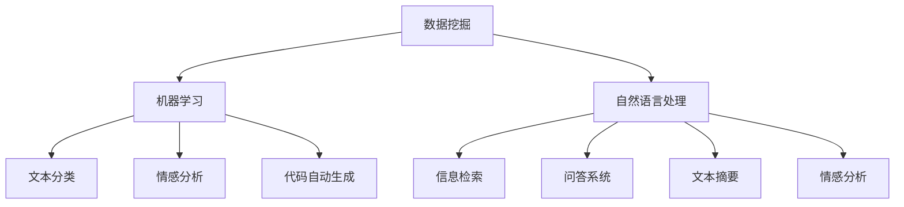

                 

# 程序员如何利用知识发现引擎提高工作效率

> 关键词：知识发现引擎, 数据挖掘, 自然语言处理, 机器学习, 信息检索, 推荐系统, 统计学习, 优化算法

## 1. 背景介绍

在当今信息化爆炸的时代，程序员们面临着前所未有的挑战。如何从海量数据中快速发现知识、提高工作效率，成为每个程序员都必须面对的问题。特别是对于那些需要在复杂业务系统中工作的人，传统的手动搜索和筛选方式已经远远不能满足需求。这时，知识发现引擎(Knowledge Discovery Engine, KDE)开始发挥作用。它通过数据挖掘、机器学习和自然语言处理(NLP)等技术，从大量文本、代码和业务数据中自动发现有用信息，辅助程序员快速找到所需知识，提高工作效率。

### 1.1 问题由来

现代软件系统的复杂性已经超出了人类手工处理的极限。一个大型系统可能包含数百万行代码，涉及多个模块、数据库和接口。开发人员在编码、测试、调试过程中，常常需要翻阅大量的文档、代码和邮件，导致效率低下、错误率高。如何高效地利用已有知识和经验，是程序员们亟需解决的问题。

### 1.2 问题核心关键点

为了更有效地利用知识发现引擎，我们必须理解其核心原理和应用场景。知识发现引擎结合了数据挖掘、机器学习和自然语言处理等技术，从大数据中自动发现有用的模式和关系，辅助程序员快速获取知识。

其核心概念包括：

- **数据挖掘**：从数据中自动发现模式和知识。
- **机器学习**：通过训练模型，预测数据未来行为。
- **自然语言处理**：理解、分析和生成人类语言。

这些技术使得知识发现引擎能够自动处理大量的文本数据、代码库和业务信息，提取关键知识，生成摘要、推荐系统、智能搜索等辅助工具，提升程序员的工作效率。

## 2. 核心概念与联系

### 2.1 核心概念概述

为了更好地理解知识发现引擎，我们将介绍几个关键概念及其相互关系：

- **数据挖掘**：
  - 定义：从数据中自动发现模式和知识。
  - 应用场景：在文本、代码和业务数据中发现规则、关系、趋势等。
  - 主要算法：聚类、分类、关联规则挖掘、序列模式挖掘等。

- **机器学习**：
  - 定义：通过数据训练模型，预测未来行为。
  - 应用场景：文本分类、情感分析、代码自动生成、性能预测等。
  - 主要算法：回归、分类、聚类、深度学习等。

- **自然语言处理**：
  - 定义：理解、分析和生成人类语言。
  - 应用场景：信息检索、问答系统、文本摘要、情感分析等。
  - 主要算法：分词、词性标注、句法分析、语义理解等。

### 2.2 核心概念原理和架构的 Mermaid 流程图



这个流程图展示了知识发现引擎的基本架构和应用场景：

- 数据挖掘从大量数据中自动发现模式和关系。
- 机器学习使用这些发现构建模型，预测未来行为。
- 自然语言处理使机器能够理解和生成人类语言，进而进行信息检索、问答、文本摘要等任务。

## 3. 核心算法原理 & 具体操作步骤

### 3.1 算法原理概述

知识发现引擎的核心算法包括数据挖掘、机器学习和自然语言处理。这些算法相互结合，从大量数据中发现知识，辅助程序员提高工作效率。

### 3.2 算法步骤详解

知识发现引擎的运行过程主要分为以下几个步骤：

1. **数据准备**：收集和清洗需要处理的原始数据，包括文本、代码和业务数据。
2. **特征提取**：从清洗后的数据中提取有用的特征，如关键词、函数调用次数、接口访问频率等。
3. **模型训练**：使用提取的特征训练机器学习模型，如分类、聚类、回归等。
4. **知识发现**：通过训练好的模型自动发现数据中的模式和关系。
5. **知识应用**：将发现的知识应用于实际问题中，如代码自动生成、性能预测、错误检测等。

### 3.3 算法优缺点

知识发现引擎具有以下优点：

- **高效性**：自动化处理大量数据，提取有用信息。
- **准确性**：基于机器学习模型进行预测，准确率高。
- **灵活性**：适应不同类型的数据和问题。

同时，也存在一些局限：

- **数据依赖**：依赖数据质量，存在数据偏差风险。
- **算法复杂**：涉及多种复杂算法，需要一定的技术背景。
- **资源消耗**：需要高性能计算资源，运行成本高。

### 3.4 算法应用领域

知识发现引擎在多个领域都有广泛应用：

- **软件工程**：代码质量检测、缺陷预测、代码自动生成等。
- **数据分析**：趋势预测、异常检测、数据清洗等。
- **自然语言处理**：信息检索、问答系统、文本摘要等。
- **商业智能**：客户细分、销售预测、市场分析等。

## 4. 数学模型和公式 & 详细讲解 & 举例说明

### 4.1 数学模型构建

知识发现引擎的数学模型主要基于机器学习和自然语言处理技术。以文本分类为例，常用的数学模型包括朴素贝叶斯、支持向量机、深度学习等。

假设有一篇文本 $d$，其特征向量为 $f(d)=[f_1, f_2, ..., f_n]$，其中 $f_i$ 表示文本中第 $i$ 个特征的值。分类模型 $M$ 将文本分类为 $k$ 个类别，其中 $k$ 为类别数。

定义损失函数 $\mathcal{L}$，表示模型预测错误次数，则分类模型的目标是最小化损失函数：

$$
\mathcal{L}(M) = \sum_{i=1}^N \mathbf{1}_{\{y_i \neq M(f(x_i))\}}
$$

其中，$N$ 表示训练样本数，$\mathbf{1}$ 表示指示函数，当 $y_i \neq M(f(x_i))$ 时取值为 1，否则为 0。

### 4.2 公式推导过程

以朴素贝叶斯分类器为例，推导其分类公式：

假设训练样本 $D=\{(x_1, y_1), (x_2, y_2), ..., (x_N, y_N)\}$，其中 $x_i$ 表示第 $i$ 个文本，$y_i$ 表示其对应的类别标签。

朴素贝叶斯分类器假设特征之间相互独立，即 $P(f_1, f_2, ..., f_n | C_k) = \prod_{i=1}^n P(f_i | C_k)$，其中 $C_k$ 表示第 $k$ 个类别。

分类器的目标是最小化先验概率和后验概率的乘积，即：

$$
\mathcal{L}(M) = \sum_{i=1}^N - \sum_{k=1}^k y_i \log P(C_k | x_i)
$$

其中 $P(C_k | x_i)$ 为条件概率，表示给定文本 $x_i$，属于类别 $C_k$ 的概率。

根据贝叶斯定理，条件概率可以表示为：

$$
P(C_k | x_i) = \frac{P(x_i | C_k)P(C_k)}{P(x_i)}
$$

其中 $P(x_i)$ 为文本 $x_i$ 的先验概率，可以通过训练集中的文本频率估计。

最终，分类器的输出为：

$$
\hat{y} = \mathop{\arg\min}_{k} P(C_k | d)
$$

### 4.3 案例分析与讲解

以GitHub的代码质量检测系统为例，分析知识发现引擎的应用。

GitHub 的代码质量检测系统使用机器学习算法，自动分析代码质量。系统首先收集代码文件和注释中的文本数据，进行特征提取，如函数调用次数、变量命名规范等。然后，使用训练好的分类器对代码进行分类，判断是否符合编码规范、代码风格等标准。

通过这种自动化方式，系统能够及时发现代码中的问题，如不规范的命名、冗余代码等，显著提高代码质量，减少开发时间。

## 5. 项目实践：代码实例和详细解释说明

### 5.1 开发环境搭建

要构建知识发现引擎，需要以下开发环境：

1. Python：主流的编程语言，支持机器学习、自然语言处理等库。
2. PyTorch：深度学习框架，支持多种深度学习模型。
3. NLTK：自然语言处理工具库，支持分词、词性标注等。
4. Scikit-learn：机器学习库，支持多种机器学习算法。

安装以上依赖：

```bash
pip install torch torchtext nltk scikit-learn
```

### 5.2 源代码详细实现

下面是一个简单的代码实例，用于文本分类任务。

```python
import torch
from torchtext.legacy import data
from torchtext.legacy.data import Field, LabelField, TabularDataset
from sklearn.feature_extraction.text import TfidfVectorizer
from sklearn.model_selection import train_test_split
from sklearn.naive_bayes import MultinomialNB
from sklearn.metrics import accuracy_score

# 定义特征提取器
tokenizer = lambda x: x.split()
TEXT = Field(tokenize=tokenizer, lower=True)
LABEL = LabelField(use_vocab=False)

# 加载数据集
train_data, test_data = TabularDataset.splits(
    path='./data/train.csv', 
    train='train.csv', test='test.csv', 
    format='tsv', fields=[('text', TEXT), ('label', LABEL)]
)

# 构建数据批处理管道
TEXT.build_vocab(train_data, max_size=10000)
LABEL.build_vocab(train_data)
train_iterator, test_iterator = data.BucketIterator.splits(
    (train_data, test_data), 
    batch_size=64, 
    device='cuda' if torch.cuda.is_available() else 'cpu',
)

# 提取文本特征
vectorizer = TfidfVectorizer(stop_words='english')
X_train = vectorizer.fit_transform([item[0] for item in train_data])
y_train = [item[1] for item in train_data]
X_test = vectorizer.transform([item[0] for item in test_data])
y_test = [item[1] for item in test_data]

# 训练朴素贝叶斯分类器
classifier = MultinomialNB()
classifier.fit(X_train, y_train)

# 预测测试集
y_pred = classifier.predict(X_test)

# 计算准确率
acc = accuracy_score(y_test, y_pred)
print(f'Accuracy: {acc:.3f}')
```

### 5.3 代码解读与分析

以上代码实现了基于朴素贝叶斯的文本分类任务。其中：

1. 使用 PyTorch 和 NLTK 库进行数据预处理和特征提取。
2. 使用 TfidfVectorizer 对文本进行向量化，提取关键词频率信息。
3. 使用 Scikit-learn 的朴素贝叶斯分类器进行模型训练和预测。
4. 计算模型在测试集上的准确率。

这个简单的实例展示了知识发现引擎的基本流程：数据预处理、特征提取、模型训练、预测和评估。

## 6. 实际应用场景

### 6.1 代码质量检测

在软件开发过程中，代码质量检测是不可或缺的一环。通过知识发现引擎，可以快速识别代码中的常见问题，如不规范的命名、冗余代码等，帮助开发者提高代码质量。

### 6.2 异常检测

异常检测是数据挖掘中的一个重要应用。通过对历史数据的分析，知识发现引擎可以自动识别异常行为，如系统崩溃、网络攻击等，及时预警，保障系统安全。

### 6.3 客户细分

在商业智能中，客户细分是关键任务之一。知识发现引擎可以通过分析客户行为数据，自动发现不同的客户群体，帮助企业制定更精准的营销策略。

### 6.4 未来应用展望

未来，知识发现引擎将在更多领域得到应用，为人类生产生活带来更多便利。

- **智能医疗**：自动分析病历数据，提取诊断信息，辅助医生进行决策。
- **智能家居**：通过分析家庭设备使用数据，优化家居环境，提升居住体验。
- **智慧城市**：实时分析城市运行数据，优化交通、环境、公共服务等方面的管理。

## 7. 工具和资源推荐

### 7.1 学习资源推荐

为了快速掌握知识发现引擎的技术，推荐以下学习资源：

1. 《数据挖掘导论》（Introduction to Data Mining）：经典的教材，介绍了数据挖掘的基本概念和常用算法。
2. 《机器学习》（Machine Learning Yearning）：Andrew Ng 撰写的实战指南，涵盖机器学习在各个领域的应用。
3. 《Python 自然语言处理》（Natural Language Processing with Python）： practical book，介绍 Python 在 NLP 中的应用。
4. 《Deep Learning》：Ian Goodfellow 的深度学习教材，涵盖深度学习的基础和高级算法。

### 7.2 开发工具推荐

以下是一些常用的开发工具：

1. Jupyter Notebook：交互式 Python 编程环境，支持数据可视化、模型调试等功能。
2. Visual Studio Code：轻量级代码编辑器，支持代码高亮、自动补全等功能。
3. Git 和 GitHub：版本控制工具，方便协作开发和代码管理。

### 7.3 相关论文推荐

以下是一些关于知识发现引擎的重要论文：

1. QuDT 2010：KDD 2010年的年度论文，综述了数据挖掘和知识发现的最新进展。
2. 《A Survey of Text Mining and Statistical Learning》：2016 年的综述论文，介绍了文本挖掘和统计学习的基础和应用。
3. 《Machine Learning for Software Evolution》：2018 年的综述论文，介绍了机器学习在软件工程中的应用。

## 8. 总结：未来发展趋势与挑战

### 8.1 研究成果总结

知识发现引擎已经在多个领域取得了显著进展，帮助程序员提高工作效率，提升数据分析的准确性和效率。未来，随着深度学习和大数据技术的发展，知识发现引擎将在更多场景中发挥作用。

### 8.2 未来发展趋势

未来，知识发现引擎的发展趋势包括：

1. **自动化程度提升**：通过自动化处理更多数据，提高发现知识的效率。
2. **模型优化**：开发更高效、更准确的机器学习模型，提升分类、聚类、预测等任务的性能。
3. **跨领域应用**：在更多领域中推广知识发现引擎，提升各行业的自动化水平。

### 8.3 面临的挑战

尽管知识发现引擎发展迅速，但仍面临一些挑战：

1. **数据质量**：数据的质量直接影响知识发现的效果，数据清洗和预处理需要投入大量精力。
2. **算法复杂性**：知识发现引擎涉及多种算法，算法复杂度高，实现难度大。
3. **资源消耗**：高性能计算资源需求大，运行成本高。

### 8.4 研究展望

未来，知识发现引擎的研究方向包括：

1. **自动化数据处理**：开发更多自动化数据预处理工具，减少人工干预。
2. **模型融合**：将多种算法融合，提升知识发现的效果。
3. **跨模态学习**：将知识发现引擎扩展到多模态数据，提高模型的普适性。

## 9. 附录：常见问题与解答

**Q1：知识发现引擎需要多少标注数据？**

A: 知识发现引擎通常需要较少的标注数据，如朴素贝叶斯分类器只需要标签信息，不需要具体的训练样本。但在某些复杂任务中，如情感分析、命名实体识别等，可能需要一定数量的标注数据。

**Q2：知识发现引擎如何提高准确性？**

A: 提高知识发现引擎的准确性需要多方面的改进：
1. **数据预处理**：通过数据清洗、特征提取等方法，提高数据质量。
2. **模型选择**：选择适合的机器学习模型，如朴素贝叶斯、支持向量机、深度学习等。
3. **算法优化**：优化算法的参数和超参数，提升模型性能。

**Q3：知识发现引擎如何处理多类别问题？**

A: 处理多类别问题可以使用多分类算法，如决策树、支持向量机、深度神经网络等。同时，可以使用 One-vs-All 或 One-vs-One 策略，将多分类问题转换为多个二分类问题进行训练。

**Q4：知识发现引擎在深度学习中的应用？**

A: 深度学习在知识发现引擎中的应用主要包括：
1. **特征提取**：使用卷积神经网络、循环神经网络等提取文本特征。
2. **文本分类**：使用深度学习模型进行文本分类，如卷积神经网络、长短时记忆网络等。
3. **异常检测**：使用深度学习模型检测异常行为，如生成对抗网络、自编码器等。

---

作者：禅与计算机程序设计艺术 / Zen and the Art of Computer Programming

