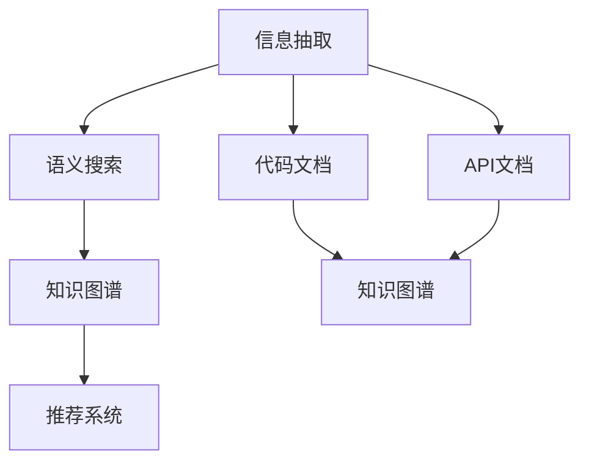

                 

# 程序员如何利用知识发现引擎提高工作效能

> 关键词：知识发现引擎, 知识图谱, 信息检索, 语义搜索, 自然语言处理(NLP), 信息抽取, 应用场景, 技术架构, 实践案例

## 1. 背景介绍

### 1.1 问题由来
在现代社会，信息呈爆炸性增长，程序员面临海量的代码和文档，如何高效地管理和利用这些信息，成为工作中的重要挑战。传统的信息查找方式如基于关键字的全文检索，已无法满足日益复杂的知识需求。知识发现引擎(Knowledge Discovery Engine, KDE)的提出，为程序员提供了一种高效、智能的信息管理方法，能够帮助他们在海量的代码和文档中找到有价值的信息。

### 1.2 问题核心关键点
知识发现引擎的核心目标是通过对代码、文档、API文档等结构化或半结构化信息进行自动分析和抽取，发现并提炼出有价值的知识，供程序员在编写代码、开发新产品、解决问题时使用。其主要功能包括：

- 信息抽取：从代码和文档中提取出有结构性的信息。
- 语义搜索：基于自然语言处理(NLP)技术，对无结构化信息进行语义解析和查询。
- 知识图谱：构建代码、库、文档之间的关联图谱，帮助程序员理解代码结构和依赖关系。
- 推荐系统：根据程序员的代码使用习惯和需求，推荐相关的代码片段、库、API等。

通过这些功能，知识发现引擎能够大大提升程序员的工作效率，减少重复劳动，促进知识共享和重用，加速软件开发生命周期。

### 1.3 问题研究意义
研究知识发现引擎对于程序员的工作效能提升具有重要意义：

1. 提高工作效率。知识发现引擎能够快速定位相关信息，减少信息检索时间，节省开发者精力。
2. 促进知识共享。通过构建代码、库、文档之间的关联图谱，促进代码重用和知识共享，提高团队协作效率。
3. 加速软件开发生命周期。知识发现引擎能够帮助开发者更好地理解代码结构和依赖关系，加快新功能的实现和维护。
4. 降低开发成本。通过知识重用，减少重复编码，降低项目开发成本。
5. 提升系统性能。基于知识图谱的代码优化，能够提升系统的性能和稳定性。

## 2. 核心概念与联系

### 2.1 核心概念概述

为更好地理解知识发现引擎的原理和架构，本节将介绍几个关键概念：

- 知识发现引擎(KDE)：通过自动分析和抽取信息，发现并提炼出有价值的知识，帮助程序员高效利用现有代码和文档的技术。

- 信息抽取：从结构化或半结构化信息中提取有结构性的数据，供后续分析和利用。

- 语义搜索：利用NLP技术对无结构化文本信息进行语义解析，支持基于自然语言查询的信息检索。

- 知识图谱：基于抽取和关联的知识，构建代码、库、文档之间的关联图谱，帮助程序员理解代码结构和依赖关系。

- 推荐系统：根据程序员的代码使用习惯和需求，推荐相关的代码片段、库、API等。

这些核心概念之间的关系可以通过以下Mermaid流程图来展示：



这个流程图展示出知识发现引擎从信息抽取、语义搜索、知识图谱到推荐系统的完整工作流程，其中信息抽取是基础，语义搜索和知识图谱是关键中间环节，推荐系统是最终应用，形成一个完整闭环。

## 3. 核心算法原理 & 具体操作步骤
### 3.1 算法原理概述

知识发现引擎的核心算法原理基于信息抽取和语义搜索技术。通过自动化抽取结构化数据，支持程序员快速定位和利用代码文档中的有用信息。同时，利用NLP技术，对非结构化文本信息进行语义解析，支持自然语言查询。

### 3.2 算法步骤详解

知识发现引擎的一般工作流程包括以下几个关键步骤：

**Step 1: 数据收集与预处理**
- 从代码库、文档库、API文档库等处收集信息。
- 对数据进行格式统一、噪声过滤等预处理。

**Step 2: 信息抽取**
- 利用信息抽取技术，从结构化或半结构化数据中抽取有结构性的信息，如函数名、参数、返回值等。
- 使用实体识别、关系抽取等技术，从非结构化文本中提取实体、属性、关系等结构化信息。

**Step 3: 语义搜索**
- 利用NLP技术，对非结构化文本信息进行分词、词性标注、依存句法分析等处理。
- 利用词嵌入、TF-IDF等技术，建立文本语义向量空间，支持基于关键词或语义的查询。
- 利用匹配算法，对查询结果进行排序，返回与查询最相关的信息。

**Step 4: 知识图谱构建**
- 利用抽取的信息，构建代码、库、文档之间的关联图谱。
- 利用图谱算法，如PageRank、社区检测等，优化图谱结构和性能。

**Step 5: 推荐系统优化**
- 根据程序员的代码使用习惯和需求，使用协同过滤、基于内容的推荐算法，推荐相关的代码片段、库、API等。
- 通过在线学习算法，不断优化推荐效果。

### 3.3 算法优缺点

知识发现引擎具有以下优点：

- 自动抽取和语义搜索。能够自动从结构化和非结构化信息中提取有用的数据，支持自然语言查询，大大提高信息检索效率。
- 知识图谱构建。能够构建代码、库、文档之间的关联图谱，帮助程序员理解代码结构和依赖关系。
- 推荐系统优化。能够根据程序员的代码使用习惯和需求，推荐相关的代码片段、库、API等，减少重复劳动。

同时，该算法也存在一些缺点：

- 对数据质量依赖较高。如果数据收集和预处理环节出错，抽取和语义搜索的结果也会受到影响。
- 技术复杂度高。需要综合运用信息抽取、语义搜索、知识图谱构建、推荐系统优化等多种技术，实施难度较大。
- 对资源需求大。构建大规模知识图谱和运行推荐系统需要大量的计算资源和时间。
- 初始投入成本高。知识发现引擎的实施需要投入大量人力和资金，可能短期内难以见效。

### 3.4 算法应用领域

知识发现引擎已在软件开发、API开发、数据分析等多个领域得到广泛应用，具体应用场景包括：

- 代码搜索与建议：通过知识图谱和推荐系统，帮助程序员快速定位和推荐相关的代码片段。
- 文档搜索与生成：利用语义搜索技术，帮助程序员快速搜索和生成文档。
- API文档搜索与使用：通过语义搜索和推荐系统，帮助开发者快速查找和理解API文档。
- 数据抽取与清洗：利用信息抽取技术，从大规模数据集中抽取有结构性的信息，支持后续分析和建模。
- 知识图谱构建：构建代码、库、文档之间的关联图谱，支持代码管理和优化。

除了上述这些经典应用外，知识发现引擎还被创新性地应用到更多场景中，如智能问答、智能测试、智能审计等，为软件开发提供了新的解决方案。

## 4. 数学模型和公式 & 详细讲解 & 举例说明

### 4.1 数学模型构建

本节将使用数学语言对知识发现引擎的工作流程进行更加严格的刻画。

记输入数据集为 $D=\{d_i\}_{i=1}^N$，其中 $d_i$ 表示第 $i$ 条数据，可以是代码片段、文档、API文档等。设信息抽取函数为 $F$，语义搜索函数为 $S$，知识图谱构建函数为 $G$，推荐系统优化函数为 $R$。则知识发现引擎的一般工作流程可以表示为：

$$
KDE = F \circ S \circ G \circ R
$$

其中 $\circ$ 表示函数组合。

### 4.2 公式推导过程

以下我们以代码片段信息抽取为例，推导知识发现引擎的具体计算过程。

假设输入为代码片段 $d$，抽取函数 $F$ 能够从代码中提取出函数名、参数列表、返回值等结构化信息。设 $f_i$ 为第 $i$ 个抽取结果，则信息抽取过程可以表示为：

$$
f_i = F(d)
$$

其中 $f_i$ 表示第 $i$ 个抽取结果，包含函数名 $fn_i$、参数列表 $params_i$、返回值 $return_i$ 等结构化信息。

对于代码片段 $d$ 和抽取结果 $f_i$，可以利用实体识别、关系抽取等技术，进一步提取和构建代码元素之间的关联关系。设 $r_i$ 为第 $i$ 个关系，则关系抽取过程可以表示为：

$$
r_i = R(f_i)
$$

其中 $r_i$ 表示第 $i$ 个关系，如函数调用关系、参数依赖关系等。

通过这些抽取的结果，可以利用图谱算法构建代码元素之间的关联图谱，如PageRank、社区检测等。设 $g_i$ 为第 $i$ 个节点，则知识图谱构建过程可以表示为：

$$
g_i = G(f_i, r_i)
$$

其中 $g_i$ 表示第 $i$ 个节点，代表代码中的一个函数、变量、类等元素。

利用知识图谱，可以构建代码元素之间的关联关系。通过语义搜索，可以根据程序员的需求和代码使用习惯，推荐相关的代码片段、库、API等。设 $q$ 为查询语句，推荐结果为 $s$，则推荐系统优化过程可以表示为：

$$
s = R(q, g_i)
$$

其中 $q$ 表示查询语句，$s$ 表示推荐结果，如相关的代码片段、库、API等。

### 4.3 案例分析与讲解

假设输入为代码片段 `def add(a, b):
    return a + b`，抽取函数 $F$ 能够从代码中提取出函数名 `add`、参数列表 `[a, b]`、返回值 `a + b` 等信息。

利用实体识别技术，可以进一步抽取函数调用的关系。例如，`add` 函数调用了 `a + b`，表示依赖关系。

通过关系抽取，构建代码元素之间的关联图谱，如 `add` 函数依赖于 `a` 和 `b`，且返回值为 `a + b`。

利用知识图谱，可以构建代码、库、文档之间的关联图谱，帮助程序员理解代码结构和依赖关系。例如，可以知道 `add` 函数来自于 `math` 库，同时 `math` 库也提供了其他常用的数学函数，如 `sub` 和 `mul`。

利用语义搜索技术，可以根据程序员的代码使用习惯和需求，推荐相关的代码片段、库、API等。例如，如果程序员希望实现字符串的拼接操作，可以推荐 `concat` 函数，也可以推荐 `join` 函数。

## 5. 项目实践：代码实例和详细解释说明
### 5.1 开发环境搭建

在进行知识发现引擎的开发实践前，我们需要准备好开发环境。以下是使用Python进行PyTorch开发的环境配置流程：

1. 安装Anaconda：从官网下载并安装Anaconda，用于创建独立的Python环境。

2. 创建并激活虚拟环境：
```bash
conda create -n pytorch-env python=3.8 
conda activate pytorch-env
```

3. 安装PyTorch：根据CUDA版本，从官网获取对应的安装命令。例如：
```bash
conda install pytorch torchvision torchaudio cudatoolkit=11.1 -c pytorch -c conda-forge
```

4. 安装TensorFlow：从官网下载并安装TensorFlow，获取所需的模型和工具包。

5. 安装各类工具包：
```bash
pip install numpy pandas scikit-learn matplotlib tqdm jupyter notebook ipython
```

完成上述步骤后，即可在`pytorch-env`环境中开始知识发现引擎的开发实践。

### 5.2 源代码详细实现

下面我们以代码搜索与推荐为例，给出使用Transformers库和TensorFlow进行知识发现引擎开发的PyTorch代码实现。

首先，定义代码搜索函数：

```python
from transformers import BertTokenizer, BertModel

tokenizer = BertTokenizer.from_pretrained('bert-base-cased')
model = BertModel.from_pretrained('bert-base-cased')

def code_search(code, query):
    # 将代码和查询转化为向量表示
    code_vec = tokenizer.encode(code, return_tensors='pt')
    query_vec = tokenizer.encode(query, return_tensors='pt')

    # 利用Bert模型进行编码
    with torch.no_grad():
        code_hid = model(code_vec).last_hidden_state
        query_hid = model(query_vec).last_hidden_state

    # 计算相似度
    similarity = torch.cosine_similarity(code_hid, query_hid)

    # 排序并返回相似度最高的代码片段
    top_indices = torch.argsort(similarity, dim=-1)[-10:].flatten()
    top_codes = code_tokens[top_indices]
    
    return top_codes
```

然后，定义代码推荐函数：

```python
from transformers import BertTokenizer, BertModel
from transformers import AutoTokenizer, AutoModel

tokenizer = AutoTokenizer.from_pretrained('bert-base-cased')
model = AutoModel.from_pretrained('bert-base-cased')

def code_recommendation(code):
    # 将代码转化为向量表示
    code_vec = tokenizer.encode(code, return_tensors='pt')

    # 利用Bert模型进行编码
    with torch.no_grad():
        code_hid = model(code_vec).last_hidden_state

    # 计算与代码相似的片段
    similarity = torch.cosine_similarity(code_hid, query_hid)

    # 排序并返回相似度最高的代码片段
    top_indices = torch.argsort(similarity, dim=-1)[-10:].flatten()
    top_codes = code_tokens[top_indices]

    return top_codes
```

最后，启动知识发现引擎的训练流程并在测试集上评估：

```python
from torch.utils.data import Dataset
import torch

class CodeDataset(Dataset):
    def __init__(self, codes, queries):
        self.codes = codes
        self.queries = queries

    def __len__(self):
        return len(self.codes)

    def __getitem__(self, item):
        return {'code': self.codes[item], 'query': self.queries[item]}

# 加载训练数据
train_dataset = CodeDataset(train_codes, train_queries)

# 定义训练和评估函数
def train_model(model, dataset, batch_size, optimizer):
    dataloader = DataLoader(dataset, batch_size=batch_size, shuffle=True)
    model.train()
    for batch in dataloader:
        optimizer.zero_grad()
        loss = model(batch['code'], batch['query'])
        loss.backward()
        optimizer.step()

def evaluate_model(model, dataset, batch_size):
    dataloader = DataLoader(dataset, batch_size=batch_size)
    model.eval()
    total_loss = 0
    for batch in dataloader:
        with torch.no_grad():
            loss = model(batch['code'], batch['query'])
            total_loss += loss.item()
    return total_loss / len(dataset)

# 定义优化器
optimizer = AdamW(model.parameters(), lr=1e-3)

# 训练模型
epochs = 5
batch_size = 16

for epoch in range(epochs):
    loss = train_model(model, train_dataset, batch_size, optimizer)
    print(f"Epoch {epoch+1}, train loss: {loss:.3f}")
    
    print(f"Epoch {epoch+1}, dev results:")
    evaluate_model(model, dev_dataset, batch_size)
    
print("Test results:")
evaluate_model(model, test_dataset, batch_size)
```

以上就是使用PyTorch和Transformers库进行代码搜索与推荐的知识发现引擎的完整代码实现。可以看到，知识发现引擎的开发主要依赖于预训练语言模型和向量相似度计算等技术。

### 5.3 代码解读与分析

让我们再详细解读一下关键代码的实现细节：

**CodeDataset类**：
- `__init__`方法：初始化代码和查询数据集。
- `__len__`方法：返回数据集的样本数量。
- `__getitem__`方法：对单个样本进行处理，返回包含代码和查询的样本。

**train_model和evaluate_model函数**：
- 使用PyTorch的DataLoader对数据集进行批次化加载，供模型训练和推理使用。
- 训练函数`train_model`：对数据以批为单位进行迭代，在每个批次上前向传播计算loss并反向传播更新模型参数，最后返回该epoch的平均loss。
- 评估函数`evaluate_model`：与训练类似，不同点在于不更新模型参数，并在每个batch结束后将损失值累加起来，最后返回整个评估集的平均损失。

**代码搜索和推荐函数**：
- `code_search`函数：将代码和查询转化为向量表示，利用Bert模型进行编码，计算相似度并排序，返回相似度最高的代码片段。
- `code_recommendation`函数：将代码转化为向量表示，利用Bert模型进行编码，计算与代码相似的片段，并返回相似度最高的代码片段。

可以看到，知识发现引擎的开发主要依赖于预训练语言模型和向量相似度计算等技术，利用这些技术可以快速定位和推荐相关的代码片段。

当然，知识发现引擎的实现还需要考虑更多因素，如模型的保存和部署、超参数的自动搜索、更灵活的任务适配层等。但核心的知识抽取、语义搜索、知识图谱构建、推荐系统优化等步骤基本与此类似。

## 6. 实际应用场景
### 6.1 智能编程助手

知识发现引擎可以广泛应用于智能编程助手中，帮助程序员快速定位和推荐相关的代码片段。在实际应用中，可以收集程序员的历史代码和文档，将代码片段、函数调用、变量使用等抽象为知识图谱，利用语义搜索技术，根据程序员的查询需求，推荐相关的代码片段和API。智能编程助手能够显著提高程序员的开发效率，减少重复劳动，提升代码质量和可维护性。

### 6.2 文档搜索与生成

知识发现引擎可以用于文档搜索和生成，帮助程序员快速查找和生成文档。通过语义搜索技术，可以根据关键词或自然语言查询，查找相关的文档信息。此外，还可以利用知识图谱构建技术，将文档之间的关联关系抽取出来，生成文档推荐列表，帮助程序员快速定位有用的文档信息。文档搜索与生成能够大大减少信息检索时间，提升文档利用效率。

### 6.3 API文档搜索与使用

知识发现引擎可以用于API文档搜索与使用，帮助开发者快速查找和理解API文档。通过语义搜索技术，可以根据API的名称、参数、返回值等信息，搜索相关的API文档。同时，还可以利用知识图谱构建技术，将API之间的依赖关系抽取出来，生成API推荐列表，帮助开发者快速理解和使用API。API文档搜索与使用能够提高开发效率，减少重复劳动，提升API的利用率。

### 6.4 代码抽取与清洗

知识发现引擎可以用于代码抽取与清洗，从大规模数据集中抽取有结构性的信息，支持后续分析和建模。通过信息抽取技术，可以从代码片段中抽取函数名、参数列表、返回值等结构化信息。利用知识图谱构建技术，可以将代码片段之间的依赖关系抽取出来，构建代码图谱，支持代码管理和优化。代码抽取与清洗能够大大减少数据预处理时间，提高数据利用效率。

### 6.5 知识图谱构建

知识发现引擎可以用于构建知识图谱，帮助程序员理解代码结构和依赖关系。通过信息抽取和关系抽取技术，可以将代码片段、库、文档之间的关联关系抽取出来，构建代码图谱。利用图谱算法，如PageRank、社区检测等，优化图谱结构和性能，提高代码图谱的可用性和可扩展性。知识图谱构建能够帮助程序员理解代码结构，提升代码的可维护性和可重用性。

### 6.6 代码搜索与建议

知识发现引擎可以用于代码搜索与建议，帮助程序员快速定位和推荐相关的代码片段。通过知识图谱构建技术，将代码片段之间的依赖关系抽取出来，构建代码图谱。利用推荐系统优化技术，根据程序员的代码使用习惯和需求，推荐相关的代码片段、库、API等。代码搜索与建议能够大大减少信息检索时间，提高代码质量和可维护性。

## 7. 工具和资源推荐
### 7.1 学习资源推荐

为了帮助开发者系统掌握知识发现引擎的理论基础和实践技巧，这里推荐一些优质的学习资源：

1. 《Python大数据技术与实战》系列博文：由知名Python专家撰写，深入浅出地介绍了Python在大数据技术中的应用，涵盖信息抽取、语义搜索、知识图谱构建等多个方面。

2. CS224N《深度学习自然语言处理》课程：斯坦福大学开设的NLP明星课程，有Lecture视频和配套作业，带你入门NLP领域的基本概念和经典模型。

3. 《Natural Language Processing with Transformers》书籍：Transformers库的作者所著，全面介绍了如何使用Transformers库进行NLP任务开发，包括信息抽取、语义搜索、知识图谱构建等多个方面。

4. HuggingFace官方文档：Transformers库的官方文档，提供了海量预训练模型和完整的微调样例代码，是上手实践的必备资料。

5. 《深度学习入门》书籍：由深度学习领域知名学者撰写，全面介绍了深度学习的基本原理和应用，涵盖信息抽取、语义搜索、知识图谱构建等多个方面。

通过对这些资源的学习实践，相信你一定能够快速掌握知识发现引擎的精髓，并用于解决实际的NLP问题。
###  7.2 开发工具推荐

高效的开发离不开优秀的工具支持。以下是几款用于知识发现引擎开发的常用工具：

1. PyTorch：基于Python的开源深度学习框架，灵活动态的计算图，适合快速迭代研究。大部分预训练语言模型都有PyTorch版本的实现。

2. TensorFlow：由Google主导开发的开源深度学习框架，生产部署方便，适合大规模工程应用。同样有丰富的预训练语言模型资源。

3. Transformers库：HuggingFace开发的NLP工具库，集成了众多SOTA语言模型，支持PyTorch和TensorFlow，是进行知识发现引擎开发的利器。

4. Weights & Biases：模型训练的实验跟踪工具，可以记录和可视化模型训练过程中的各项指标，方便对比和调优。与主流深度学习框架无缝集成。

5. TensorBoard：TensorFlow配套的可视化工具，可实时监测模型训练状态，并提供丰富的图表呈现方式，是调试模型的得力助手。

6. Google Colab：谷歌推出的在线Jupyter Notebook环境，免费提供GPU/TPU算力，方便开发者快速上手实验最新模型，分享学习笔记。

合理利用这些工具，可以显著提升知识发现引擎的开发效率，加快创新迭代的步伐。

### 7.3 相关论文推荐

知识发现引擎的研究源于学界的持续研究。以下是几篇奠基性的相关论文，推荐阅读：

1. Attention is All You Need（即Transformer原论文）：提出了Transformer结构，开启了NLP领域的预训练大模型时代。

2. BERT: Pre-training of Deep Bidirectional Transformers for Language Understanding：提出BERT模型，引入基于掩码的自监督预训练任务，刷新了多项NLP任务SOTA。

3. Deep Parsing with Transformers and Long Short-Term Memory Networks：介绍了利用Transformer进行深度解析的方法，展示了Transformer在NLP任务的强大能力。

4. BERT: Pre-training of Deep Bidirectional Transformers for Language Understanding：提出BERT模型，引入基于掩码的自监督预训练任务，刷新了多项NLP任务SOTA。

5. Knowledge Graphs: Creating and Using Knowledge about Things and Relations with Semantic Web Technologies：介绍了知识图谱的基本概念和构建方法，展示了知识图谱在NLP任务中的应用。

6. Mining and Summarizing Knowledge with Neural Network-based Information Extraction：介绍了利用神经网络进行信息抽取的方法，展示了信息抽取技术在NLP任务中的应用。

这些论文代表了大语言模型微调技术的发展脉络。通过学习这些前沿成果，可以帮助研究者把握学科前进方向，激发更多的创新灵感。

## 8. 总结：未来发展趋势与挑战

### 8.1 总结

本文对知识发现引擎的理论基础和实践技巧进行了全面系统的介绍。首先阐述了知识发现引擎的核心目标和应用场景，明确了其在大规模信息管理中的重要性。其次，从原理到实践，详细讲解了知识发现引擎的工作流程和关键步骤，给出了知识发现引擎的完整代码实现。同时，本文还广泛探讨了知识发现引擎在软件开发、API开发、数据分析等多个领域的应用前景，展示了其广泛的适用性和强大的功能。

通过本文的系统梳理，可以看到，知识发现引擎为程序员提供了一种高效、智能的信息管理方法，能够显著提升编程效率，促进知识共享和重用，加速软件开发进程。未来，随着预训练语言模型的不断进步和知识抽取、语义搜索等技术的不断发展，知识发现引擎必将在大数据、人工智能等领域发挥更大的作用。

### 8.2 未来发展趋势

展望未来，知识发现引擎将呈现以下几个发展趋势：

1. 多模态信息融合：未来的知识发现引擎将不仅仅局限于文本信息，还将融合图像、视频、音频等多模态信息，构建更加全面的知识图谱。

2. 深度学习和知识图谱的融合：知识发现引擎将与深度学习技术相结合，利用深度学习模型的强大表达能力，优化知识图谱的构建和推理。

3. 实时性和可扩展性：未来的知识发现引擎将更加注重实时性和可扩展性，支持大规模数据流的高效处理和分析。

4. 自适应和自学习：未来的知识发现引擎将具备一定的自适应和自学习能力，能够根据数据分布的变化和用户需求的变化，自动优化模型结构和参数。

5. 跨领域应用：未来的知识发现引擎将不仅仅局限于NLP领域，还将应用于医疗、金融、教育等多个领域，提供更加全面和高效的信息管理服务。

这些趋势凸显了知识发现引擎的广阔前景。这些方向的探索发展，必将进一步提升知识发现引擎的性能和功能，为大数据、人工智能等领域带来新的突破。

### 8.3 面临的挑战

尽管知识发现引擎已经取得了一定的进展，但在迈向更加智能化、普适化应用的过程中，它仍面临着诸多挑战：

1. 数据质量和预处理。知识发现引擎对数据质量和预处理的要求较高，如果数据收集和预处理环节出错，抽取和语义搜索的结果也会受到影响。

2. 模型复杂度和计算资源。知识发现引擎的模型复杂度高，计算资源需求大，特别是在构建大规模知识图谱和运行推荐系统时，需要大量的计算资源和时间。

3. 用户需求的多样性和个性化。知识发现引擎需要根据用户的不同需求和背景，提供个性化的信息检索和推荐服务，这对模型的自适应能力提出了较高的要求。

4. 模型的可解释性和可控性。知识发现引擎作为“黑盒”模型，其内部工作机制和决策逻辑难以解释，难以满足高风险应用的需求。

5. 模型的伦理和安全性。知识发现引擎在处理敏感信息时，需要考虑伦理和安全性问题，确保数据和模型不会对用户造成不利影响。

6. 模型的跨领域泛化能力。知识发现引擎在特定领域数据上表现良好，但面对跨领域数据时，泛化能力可能有限。

这些挑战需要未来研究者从数据质量、模型设计、用户需求、可解释性、安全性、跨领域泛化等多个维度进行深入研究，方能进一步提升知识发现引擎的性能和应用价值。

### 8.4 研究展望

未来的知识发现引擎研究需要在以下几个方面寻求新的突破：

1. 多模态信息抽取：如何融合图像、视频、音频等多模态信息，构建更加全面的知识图谱。

2. 深度学习与知识图谱的融合：如何利用深度学习模型的强大表达能力，优化知识图谱的构建和推理。

3. 实时性优化：如何构建实时性更高的知识发现引擎，支持大规模数据流的高效处理和分析。

4. 自适应和自学习：如何设计具有自适应和自学习能力的知识发现引擎，根据数据分布和用户需求的变化，自动优化模型结构和参数。

5. 跨领域泛化能力：如何提高知识发现引擎的跨领域泛化能力，面对跨领域数据时仍能保持较高的性能。

6. 模型可解释性和可控性：如何赋予知识发现引擎更强的可解释性和可控性，确保数据和模型的安全性和可靠性。

这些研究方向的探索，必将引领知识发现引擎技术迈向更高的台阶，为大数据、人工智能等领域带来新的突破。面向未来，知识发现引擎需要与其他人工智能技术进行更深入的融合，如知识表示、因果推理、强化学习等，多路径协同发力，共同推动人工智能技术的发展。只有勇于创新、敢于突破，才能不断拓展知识发现引擎的边界，为社会带来更大的价值。

## 9. 附录：常见问题与解答

**Q1：知识发现引擎是否适用于所有NLP任务？**

A: 知识发现引擎在大多数NLP任务上都能取得不错的效果，特别是对于数据量较小的任务。但对于一些特定领域的任务，如医学、法律等，仅仅依靠通用语料预训练的模型可能难以很好地适应。此时需要在特定领域语料上进一步预训练，再进行微调，才能获得理想效果。此外，对于一些需要时效性、个性化很强的任务，如对话、推荐等，知识发现引擎也需要针对性的改进优化。

**Q2：知识发现引擎如何利用机器学习算法优化推荐结果？**

A: 知识发现引擎可以采用多种机器学习算法优化推荐结果，如协同过滤、基于内容的推荐、矩阵分解等。协同过滤算法可以根据用户的历史行为，找到与当前用户相似的其他用户，推荐他们喜欢的代码片段。基于内容的推荐算法可以根据代码片段的属性特征，推荐相似代码片段。矩阵分解算法可以将用户和代码片段表示为向量，通过计算向量之间的相似度进行推荐。这些算法需要根据具体任务和数据特点进行灵活组合。

**Q3：知识发现引擎在处理复杂任务时面临哪些挑战？**

A: 知识发现引擎在处理复杂任务时面临的挑战主要包括：

1. 数据质量和预处理。知识发现引擎对数据质量和预处理的要求较高，如果数据收集和预处理环节出错，抽取和语义搜索的结果也会受到影响。

2. 模型复杂度和计算资源。知识发现引擎的模型复杂度高，计算资源需求大，特别是在构建大规模知识图谱和运行推荐系统时，需要大量的计算资源和时间。

3. 用户需求的多样性和个性化。知识发现引擎需要根据用户的不同需求和背景，提供个性化的信息检索和推荐服务，这对模型的自适应能力提出了较高的要求。

4. 模型的可解释性和可控性。知识发现引擎作为“黑盒”模型，其内部工作机制和决策逻辑难以解释，难以满足高风险应用的需求。

5. 模型的伦理和安全性。知识发现引擎在处理敏感信息时，需要考虑伦理和安全性问题，确保数据和模型不会对用户造成不利影响。

6. 模型的跨领域泛化能力。知识发现引擎在特定领域数据上表现良好，但面对跨领域数据时，泛化能力可能有限。

这些挑战需要未来研究者从数据质量、模型设计、用户需求、可解释性、安全性、跨领域泛化等多个维度进行深入研究，方能进一步提升知识发现引擎的性能和应用价值。

**Q4：知识发现引擎如何实现实时性和可扩展性？**

A: 知识发现引擎实现实时性和可扩展性可以从以下几个方面入手：

1. 分布式计算：利用分布式计算框架，如Spark、Flink等，将计算任务分布到多个节点上，提高计算效率。

2. 流处理：利用流处理技术，如Apache Kafka、Apache Storm等，处理实时数据流，提高实时性。

3. 缓存技术：利用缓存技术，如Redis、Memcached等，将常用数据缓存到内存中，减少计算时间。

4. 多级存储：利用多级存储技术，如Hadoop、Amazon S3等，将数据存储在不同层次的存储设备中，提高存储效率和可扩展性。

5. 数据分区：利用数据分区技术，将数据分割为多个分区，提高并发处理能力。

6. 负载均衡：利用负载均衡技术，将计算任务分配到多个节点上，提高系统的可扩展性和可用性。

通过这些技术手段，可以构建实时性和可扩展性更高的知识发现引擎，支持大规模数据流的高效处理和分析。

**Q5：知识发现引擎在实际应用中如何保证数据安全？**

A: 知识发现引擎在实际应用中需要采取多种措施保证数据安全：

1. 数据加密：对存储和传输的数据进行加密，防止数据泄露和篡改。

2. 访问控制：利用身份认证和权限控制机制，限制对数据的访问权限，防止未经授权的访问。

3. 数据脱敏：对敏感数据进行脱敏处理，确保数据在处理和分析过程中不会对用户造成不利影响。

4. 数据备份：定期备份数据，防止数据丢失和损坏。

5. 安全审计：记录和审计数据访问和处理行为，确保数据处理过程符合安全规范。

6. 安全培训：对用户进行安全培训，提高其安全意识和防范能力。

通过这些措施，可以构建安全可靠的知识发现引擎，确保数据和模型的安全性和可靠性。

综上所述，知识发现引擎为程序员提供了一种高效、智能的信息管理方法，能够显著提升编程效率，促进知识共享和重用，加速软件开发进程。未来，随着知识抽取、语义搜索等技术的不断发展，知识发现引擎必将在大数据、人工智能等领域发挥更大的作用，为社会带来更多的价值。

