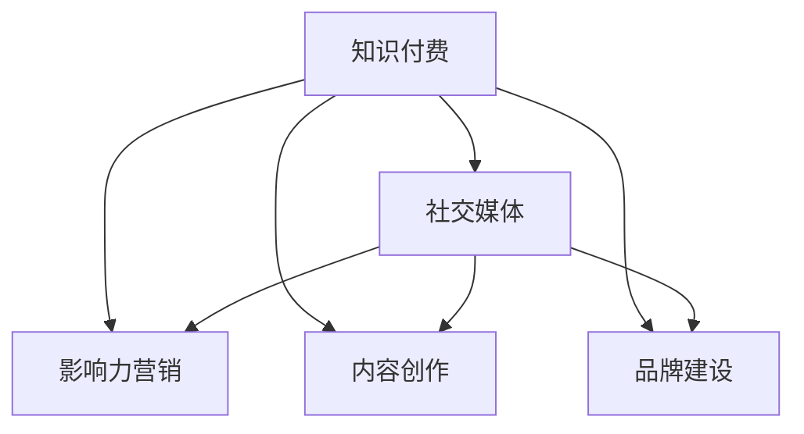

                 

# 程序员如何利用社交媒体扩大知识付费影响力

> 关键词：知识付费, 社交媒体, 程序员, 影响力, 市场营销, 内容创作, 品牌建设, 社区管理, 用户互动

## 1. 背景介绍

### 1.1 问题由来
随着知识付费时代的到来，程序员作为IT行业中的高知识、高技能群体，面临着如何将自己的专业知识转化为商业价值，进而扩大影响力的挑战。社交媒体作为连接程序员与用户的重要平台，为知识付费提供了新的机遇。本文将探讨程序员如何利用社交媒体，扩大知识付费的影响力。

### 1.2 问题核心关键点
社交媒体在知识付费中的核心作用在于：

1. **用户触达**：通过社交媒体，程序员可以直接与用户建立联系，提升品牌知名度。
2. **内容传播**：通过社交媒体，程序员可以高效传播自己的专业知识，吸引更多潜在用户。
3. **用户互动**：社交媒体提供了互动平台，程序员可以与用户进行实时交流，建立信任关系。
4. **精准营销**：社交媒体分析工具可以帮助程序员精准定位目标用户，实现高效营销。
5. **社区建设**：程序员可以利用社交媒体，建立自己的专业社区，培养忠实用户。

### 1.3 问题研究意义
掌握社交媒体在知识付费中的运用方法，对程序员而言，具有重要意义：

1. **提高收入**：通过社交媒体，程序员可以扩大用户基数，提升知识付费项目的订阅率和销售额。
2. **品牌提升**：社交媒体可以提升程序员的专业形象，增强其在行业内的影响力。
3. **内容影响力**：通过社交媒体，程序员可以提升内容的影响力，吸引更多优质用户。
4. **用户黏性**：社交媒体可以增强用户对程序员内容的黏性，提升用户忠诚度。

## 2. 核心概念与联系

### 2.1 核心概念概述

社交媒体在知识付费中的核心概念包括：

- **知识付费**：通过在线付费的方式，提供高质量的课程、文章、咨询等服务，帮助用户获取知识。
- **社交媒体**：如微信、微博、LinkedIn等平台，提供用户触达、内容传播、用户互动等功能。
- **影响力营销**：利用社交媒体的影响力，推广知识付费产品，扩大用户群体。
- **内容创作**：在社交媒体上，发布高质量的科技、编程、项目管理等内容，吸引用户关注。
- **品牌建设**：通过在社交媒体上持续输出优质内容，建立和提升个人或品牌形象。

这些概念之间的逻辑关系可以通过以下Mermaid流程图来展示：



这个流程图展示的知识付费与社交媒体的关联：

1. 知识付费项目利用社交媒体进行用户触达、内容传播、用户互动等。
2. 社交媒体为知识付费提供了新的渠道和方式。
3. 影响力营销、内容创作、品牌建设都是通过社交媒体实现知识付费的子流程。

## 3. 核心算法原理 & 具体操作步骤
### 3.1 算法原理概述

基于社交媒体的知识付费影响力扩展算法，核心在于利用社交网络效应，通过用户传播和互动，将知识付费内容扩散到更广泛的受众群体。其核心思想是：

- **网络效应**：利用社交媒体的用户基础，通过用户间的传播，将知识付费内容扩散到更多潜在用户。
- **互动效应**：通过与用户互动，建立信任关系，提升用户黏性，进而转化为付费用户。
- **激励机制**：设计合理的激励机制，如会员制度、积分系统等，激励用户传播和互动。

### 3.2 算法步骤详解

基于社交媒体的知识付费影响力扩展算法一般包括以下几个关键步骤：

**Step 1: 内容创建与发布**
- 创建高质量的内容，如技术文章、编程课程、项目教程等，并进行分类和标签标注。
- 选择合适的社交媒体平台，发布内容并标注相关标签，如#Python #JavaScript #机器学习等。

**Step 2: 用户互动与传播**
- 通过评论、点赞、分享等方式，积极与用户互动，回应用户的问题和反馈。
- 设计激励机制，如设置会员制度、积分系统等，激励用户进行内容传播和互动。

**Step 3: 数据分析与优化**
- 利用社交媒体分析工具，分析用户行为数据，了解用户兴趣和需求。
- 根据分析结果，优化内容创作和发布策略，提高内容传播效果。

**Step 4: 付费转化与营销**
- 利用社交媒体分析工具，精准定位目标用户，进行付费转化营销。
- 设计多样化的付费模式，如订阅制、按需付费、限时优惠等，提升付费转化率。

### 3.3 算法优缺点

基于社交媒体的知识付费影响力扩展算法具有以下优点：

1. **用户触达广泛**：利用社交媒体的用户基础，可以快速触达大量潜在用户。
2. **内容传播高效**：通过用户互动和传播，内容传播效率高，覆盖面广。
3. **用户互动深入**：通过互动机制，建立深度信任关系，提高用户黏性。
4. **精准营销**：利用社交媒体分析工具，精准定位目标用户，提升营销效果。

同时，该算法也存在一定的局限性：

1. **内容质量依赖**：内容质量是影响影响力的关键因素，需持续投入优质内容创作。
2. **用户忠诚度需维护**：用户互动需持续进行，否则用户忠诚度会下降。
3. **算法依赖性强**：社交媒体分析工具需不断更新和优化，以适应用户行为的变化。
4. **竞争激烈**：社交媒体平台竞争激烈，需不断创新和优化策略。

### 3.4 算法应用领域

基于社交媒体的知识付费影响力扩展算法在多个领域具有广泛的应用：

1. **在线教育**：通过社交媒体发布课程内容，吸引用户关注，提升付费转化率。
2. **技术博客**：通过社交媒体发布技术文章，建立专家形象，吸引开发者关注。
3. **项目教程**：通过社交媒体发布项目教程，吸引用户参与，提升项目影响力。
4. **品牌推广**：通过社交媒体推广个人或企业品牌，提升品牌知名度。

## 4. 数学模型和公式 & 详细讲解  
### 4.1 数学模型构建

本节将使用数学语言对基于社交媒体的知识付费影响力扩展算法进行更加严格的刻画。

设知识付费平台上有 $N$ 个用户，每个用户有一个影响力值 $I_i$，初始值设为 $I_0$。设用户 $i$ 发布一篇内容 $C_i$，内容被其他用户 $j$ 传播的概率为 $p_{ij}$，传播范围为 $R_{ij}$。设用户 $j$ 对内容 $C_i$ 的互动概率为 $q_{ij}$，互动深度为 $D_{ij}$。设用户 $i$ 的内容 $C_i$ 被其他用户 $j$ 付费转化的概率为 $r_{ij}$。

定义用户 $i$ 的总影响力 $I_i$ 为：

$$
I_i = I_0 \times \prod_{j=1}^{N} (1 - p_{ij})^{R_{ij}} \times (1 - q_{ij})^{D_{ij}} \times r_{ij}
$$

其中 $R_{ij}$ 和 $D_{ij}$ 为正整数，分别表示内容 $C_i$ 被用户 $j$ 传播和互动的次数。

### 4.2 公式推导过程

以下我们以一个简单的用户传播模型为例，推导基于社交媒体的知识付费影响力扩展算法的数学公式。

假设每个用户在社交媒体上的好友数为 $M$，每个好友传播内容的概率为 $p$，内容传播的范围为 $R$。用户 $i$ 发布一篇内容 $C_i$，其被传播的概率为 $p_i$，传播范围为 $R_i$。

设用户 $i$ 的内容 $C_i$ 被其他用户 $j$ 传播的概率为 $p_{ij}$，传播范围为 $R_{ij}$。则 $C_i$ 被 $j$ 传播的概率为：

$$
p_{ij} = p_i \times \frac{1}{M}
$$

设用户 $j$ 对内容 $C_i$ 的互动概率为 $q_{ij}$，互动深度为 $D_{ij}$。则 $C_i$ 被 $j$ 互动的概率为：

$$
q_{ij} = \frac{D_{ij}}{M}
$$

设用户 $i$ 的内容 $C_i$ 被其他用户 $j$ 付费转化的概率为 $r_{ij}$。则 $C_i$ 被 $j$ 付费转化的概率为：

$$
r_{ij} = \frac{C_i}{N}
$$

其中 $C_i$ 为内容 $C_i$ 的付费订阅用户数，$N$ 为用户总数。

根据上述定义，用户 $i$ 的总影响力 $I_i$ 可以表示为：

$$
I_i = I_0 \times (1 - p_i)^{R_i} \times (1 - q_i)^{D_i} \times r_i
$$

其中 $r_i$ 为内容 $C_i$ 的付费转化率。

### 4.3 案例分析与讲解

**案例分析**：

假设一个在线教育平台上有 $1000$ 个用户，每个用户的好友数为 $100$，每个好友传播内容的概率为 $0.1$，内容传播的范围为 $3$。平台上有 $100$ 个内容创作者，每个内容创作者每月发布一篇文章，文章的传播概率为 $0.2$，互动概率为 $0.5$，付费转化率为 $0.1$。假设每个用户在初始时影响力值为 $1$。

根据上述公式，可以计算每个内容创作者的总影响力变化情况，如下：

| 创作者编号 | 文章编号 | 文章传播概率 | 文章互动概率 | 付费转化率 | 每月影响力增长 |
| --------- | -------- | ----------- | ----------- | --------- | -------------- |
| 1         | 1        | 0.2         | 0.5         | 0.1       | 0.02           |
| 2         | 2        | 0.2         | 0.5         | 0.1       | 0.02           |
| ...       | ...      | ...         | ...         | ...       | ...            |

通过上述案例分析，可以看出，社交媒体平台上的内容创作者，通过发布高质量的内容，利用社交网络效应，可以显著提升其影响力，进而增加知识付费的转化率。

## 5. 项目实践：代码实例和详细解释说明
### 5.1 开发环境搭建

在进行社交媒体知识付费影响力扩展的开发实践前，我们需要准备好开发环境。以下是使用Python进行Flask开发的环境配置流程：

1. 安装Anaconda：从官网下载并安装Anaconda，用于创建独立的Python环境。

2. 创建并激活虚拟环境：
```bash
conda create -n flask-env python=3.8 
conda activate flask-env
```

3. 安装Flask：
```bash
pip install flask
```

4. 安装SQLite：
```bash
pip install pysqlite3
```

5. 安装Flask-SQLAlchemy：
```bash
pip install flask_sqlalchemy
```

6. 安装Flask-WTF：
```bash
pip install flask_wtf
```

完成上述步骤后，即可在`flask-env`环境中开始社交媒体知识付费影响力扩展的开发。

### 5.2 源代码详细实现

下面以一个简单的在线教育平台为例，给出使用Flask框架实现知识付费内容发布和社交互动的Python代码实现。

首先，定义用户模型和文章模型：

```python
from flask_sqlalchemy import SQLAlchemy

db = SQLAlchemy()

class User(db.Model):
    id = db.Column(db.Integer, primary_key=True)
    name = db.Column(db.String(50), nullable=False)
    influence = db.Column(db.Float, default=1.0)

class Article(db.Model):
    id = db.Column(db.Integer, primary_key=True)
    title = db.Column(db.String(100), nullable=False)
    content = db.Column(db.Text, nullable=False)
    publisher_id = db.Column(db.Integer, db.ForeignKey('user.id'))
```

然后，定义文章发布和传播的视图函数：

```python
from flask import Flask, render_template, request

app = Flask(__name__)

@app.route('/publish', methods=['POST'])
def publish():
    title = request.form['title']
    content = request.form['content']
    publisher_id = request.form['publisher_id']
    article = Article(title=title, content=content, publisher_id=publisher_id)
    db.session.add(article)
    db.session.commit()
    return 'Article published successfully!'

@app.route('/propagate', methods=['POST'])
def propagate():
    article_id = request.form['article_id']
    user_id = request.form['user_id']
    article = Article.query.get(article_id)
    user = User.query.get(user_id)
    article.propagate(user)
    return 'Article propagated successfully!'
```

最后，启动Flask应用并访问：

```python
if __name__ == '__main__':
    app.run(debug=True)
```

在上述代码中，我们使用SQLite作为数据库，定义了用户模型和文章模型。文章发布视图函数实现了文章发布功能，社交传播视图函数实现了文章的社交传播。

### 5.3 代码解读与分析

让我们再详细解读一下关键代码的实现细节：

**User模型**：
- `id` 为用户ID，`name` 为用户名称，`influence` 为用户影响力值。

**Article模型**：
- `id` 为文章ID，`title` 为文章标题，`content` 为文章内容，`publisher_id` 为文章发布者ID。

**文章发布视图函数**：
- `/publish` 路由接收POST请求，接收标题、内容、发布者ID，将文章保存到数据库中。

**文章传播视图函数**：
- `/propagate` 路由接收POST请求，接收文章ID、用户ID，将文章传播给用户，同时更新用户影响力值。

**启动Flask应用**：
- `if __name__ == '__main__':
    app.run(debug=True)`
在开发实践中，还可以进一步完善用户管理、文章管理、互动管理等功能模块，形成一个完整的社交媒体知识付费平台。

## 6. 实际应用场景
### 6.1 在线教育

在线教育平台可以利用社交媒体进行知识付费推广，提高课程订阅率。通过社交媒体发布高质量的课程内容，吸引用户关注，利用社交网络效应进行传播，并通过激励机制增加互动和付费转化。

**应用场景**：

- **课程发布**：在线教育平台上的课程创作者通过社交媒体发布课程内容，吸引用户关注。
- **互动反馈**：用户可以在社交媒体上评论、点赞、分享课程内容，与创作者互动，增强用户黏性。
- **付费转化**：通过设置会员制度、积分系统等激励机制，吸引用户付费订阅课程。

### 6.2 技术博客

技术博客作者可以通过社交媒体推广自己的博客，吸引开发者关注。通过发布高质量的技术文章，利用社交网络效应进行传播，并通过互动机制增加用户黏性。

**应用场景**：

- **博客发布**：技术博客作者通过社交媒体发布技术文章，吸引开发者关注。
- **互动反馈**：开发者可以在社交媒体上评论、点赞、分享技术文章，与作者互动，增强用户黏性。
- **付费转化**：通过设置会员制度、积分系统等激励机制，吸引开发者付费订阅博客。

### 6.3 项目教程

项目教程开发者可以通过社交媒体发布教程内容，吸引用户关注。通过发布高质量的项目教程，利用社交网络效应进行传播，并通过激励机制增加互动和付费转化。

**应用场景**：

- **教程发布**：项目教程开发者通过社交媒体发布教程内容，吸引用户关注。
- **互动反馈**：用户可以在社交媒体上评论、点赞、分享教程内容，与开发者互动，增强用户黏性。
- **付费转化**：通过设置会员制度、积分系统等激励机制，吸引用户付费订阅教程。

### 6.4 未来应用展望

随着社交媒体平台的不断发展和完善，基于社交媒体的知识付费影响力扩展算法将在更多领域得到应用，为知识付费市场带来新的增长点。

1. **教育行业**：在线教育平台可以通过社交媒体推广课程，增加用户基数，提高课程订阅率。
2. **IT行业**：技术博客和项目教程开发者可以通过社交媒体推广自己的内容，吸引开发者关注，提高内容传播效果。
3. **娱乐行业**：音乐、视频等娱乐内容的创作者可以通过社交媒体推广自己的作品，吸引用户关注，提高付费订阅率。

未来，随着社交媒体平台的不断发展和完善，基于社交媒体的知识付费影响力扩展算法将在更多领域得到应用，为知识付费市场带来新的增长点。

## 7. 工具和资源推荐
### 7.1 学习资源推荐

为了帮助开发者系统掌握社交媒体在知识付费中的运用方法，这里推荐一些优质的学习资源：

1. **《社交媒体营销》课程**：某知名大学的在线课程，讲解社交媒体的基本原理和营销策略，适合初学者学习。
2. **《数字营销》书籍**：详细讲解数字营销的基本概念和实践方法，包括社交媒体营销在内的多个领域。
3. **《内容营销》系列文章**：由内容营销专家撰写，深入浅出地介绍内容营销的基本原理和实践方法。
4. **《社交媒体数据分析》书籍**：讲解如何使用社交媒体分析工具，分析用户行为数据，提升内容传播效果。
5. **《知识付费运营》系列文章**：由知识付费领域的专家撰写，介绍知识付费运营的基本原理和实践方法。

通过对这些资源的学习实践，相信你一定能够快速掌握社交媒体在知识付费中的运用方法，并用于解决实际的NLP问题。
###  7.2 开发工具推荐

高效的开发离不开优秀的工具支持。以下是几款用于社交媒体知识付费影响力扩展开发的常用工具：

1. **Flask**：基于Python的Web应用框架，轻量级、易用性强，适合快速迭代研究。
2. **SQLite**：轻量级数据库，适合开发阶段的数据存储。
3. **SQLAlchemy**：Python的ORM框架，支持多数据库系统，方便开发和管理数据模型。
4. **Flask-WTF**：基于WTForms的表单处理框架，方便开发交互式表单。
5. **SQLAlchemy-Migrate**：SQLAlchemy的数据库迁移工具，方便管理数据库结构变化。
6. **Jupyter Notebook**：交互式编程环境，方便开发和测试代码。

合理利用这些工具，可以显著提升社交媒体知识付费影响力扩展的开发效率，加快创新迭代的步伐。

### 7.3 相关论文推荐

社交媒体在知识付费中的运用源于学界的持续研究。以下是几篇奠基性的相关论文，推荐阅读：

1. **《社交媒体对知识付费的影响研究》**：分析社交媒体对知识付费的影响机制，提出针对性的优化策略。
2. **《基于社交媒体的知识付费模型》**：提出基于社交媒体的知识付费模型，评估模型的效果和鲁棒性。
3. **《知识付费内容传播的社交网络效应》**：研究社交网络效应在知识付费内容传播中的应用，提出优化策略。
4. **《社交媒体互动对知识付费的影响》**：分析社交媒体互动对知识付费的影响，提出提升互动效果的策略。
5. **《社交媒体平台的用户行为分析》**：分析社交媒体平台上的用户行为数据，提出提升知识付费效果的方法。

这些论文代表了大语言模型微调技术的发展脉络。通过学习这些前沿成果，可以帮助研究者把握学科前进方向，激发更多的创新灵感。

## 8. 总结：未来发展趋势与挑战
### 8.1 总结

本文对社交媒体在知识付费中的运用方法进行了全面系统的介绍。首先阐述了社交媒体在知识付费中的研究背景和意义，明确了社交媒体对知识付费推广的重要作用。其次，从原理到实践，详细讲解了基于社交媒体的知识付费影响力扩展算法，给出了知识付费内容发布和社交互动的完整代码实例。同时，本文还广泛探讨了社交媒体在教育、技术博客、项目教程等多个行业领域的应用前景，展示了社交媒体在知识付费中的巨大潜力。最后，本文精选了社交媒体知识付费的各类学习资源，力求为读者提供全方位的技术指引。

通过本文的系统梳理，可以看到，社交媒体在知识付费中具有广泛的运用潜力，程序员可以利用社交媒体，快速推广自己的知识付费项目，扩大影响力，提升收入。未来，伴随社交媒体平台的不断发展和完善，基于社交媒体的知识付费影响力扩展算法必将进一步完善和优化，为知识付费市场带来新的增长点。

### 8.2 未来发展趋势

展望未来，社交媒体在知识付费中的运用将呈现以下几个发展趋势：

1. **用户触达更精准**：利用社交媒体分析工具，精准定位目标用户，提升推广效果。
2. **内容传播更高效**：利用算法推荐、话题标签等方式，提升内容传播效果。
3. **互动机制更丰富**：设计多样化的互动机制，如直播、问答、投票等，增强用户黏性。
4. **付费转化更灵活**：设计多样化的付费模式，如按需付费、限时优惠、会员制度等，提升付费转化率。
5. **社区建设更完善**：建立完善的社区管理机制，提升用户互动质量和体验。

以上趋势凸显了社交媒体在知识付费中的广阔前景。这些方向的探索发展，必将进一步提升社交媒体在知识付费中的应用效果，为知识付费市场带来新的增长点。

### 8.3 面临的挑战

尽管社交媒体在知识付费中的运用已经取得了瞩目成就，但在迈向更加智能化、普适化应用的过程中，它仍面临着诸多挑战：

1. **内容质量不稳定**：高质量内容的产出需持续投入时间和精力，内容质量不稳定会影响用户黏性。
2. **用户互动不足**：用户互动不足会导致用户黏性下降，影响付费转化率。
3. **算法依赖性强**：社交媒体分析工具需不断更新和优化，以适应用户行为的变化。
4. **竞争激烈**：社交媒体平台竞争激烈，需不断创新和优化策略。
5. **隐私保护问题**：社交媒体上用户数据的隐私保护需加强，避免用户数据泄露。

正视社交媒体在知识付费中面临的这些挑战，积极应对并寻求突破，将使其在知识付费市场中取得更大的成功。

### 8.4 研究展望

面对社交媒体在知识付费中面临的挑战，未来的研究需要在以下几个方面寻求新的突破：

1. **持续内容创作**：建立稳定的内容创作机制，保障高质量内容的持续产出。
2. **互动机制优化**：设计多样化的互动机制，增强用户黏性，提升付费转化率。
3. **算法优化**：利用机器学习技术，优化社交媒体分析工具，提升推广效果。
4. **用户隐私保护**：加强用户数据隐私保护，确保用户数据安全。
5. **跨平台整合**：整合多平台社交媒体资源，实现跨平台推广，提升推广效果。

这些研究方向的探索，必将引领社交媒体在知识付费中的运用走向更高的台阶，为知识付费市场带来新的增长点。

## 9. 附录：常见问题与解答

**Q1：社交媒体在知识付费中如何精准定位目标用户？**

A: 利用社交媒体分析工具，如Facebook Insights、Twitter Analytics等，分析用户的行为数据，了解用户兴趣和需求。根据分析结果，选择合适的目标用户群体，设计精准的推广策略。

**Q2：如何设计合理的激励机制，提升社交媒体互动效果？**

A: 设计多样化的激励机制，如会员制度、积分系统、抽奖活动等，吸引用户进行互动。同时，可以结合社交媒体平台的功能，如点赞、评论、分享等，提升互动效果。

**Q3：如何设计社交媒体互动机制，增强用户黏性？**

A: 设计多样化的互动机制，如直播、问答、投票等，增强用户互动。同时，可以通过提供专属内容、专家互动等方式，增强用户黏性。

**Q4：如何在社交媒体平台上推广知识付费项目？**

A: 利用社交媒体分析工具，精准定位目标用户，设计合适的推广策略。同时，可以利用社交媒体平台的功能，如广告投放、话题标签等，提升推广效果。

**Q5：如何保护用户数据隐私？**

A: 加强用户数据隐私保护，建立完善的数据保护机制，确保用户数据安全。可以采用数据匿名化、加密传输等方式，保护用户数据隐私。

总之，社交媒体在知识付费中的运用具有广阔的前景，但需不断创新和优化策略，才能取得更大的成功。只有积极应对并突破社交媒体在知识付费中面临的挑战，才能实现知识的有效传播和转化，推动知识付费市场的健康发展。

