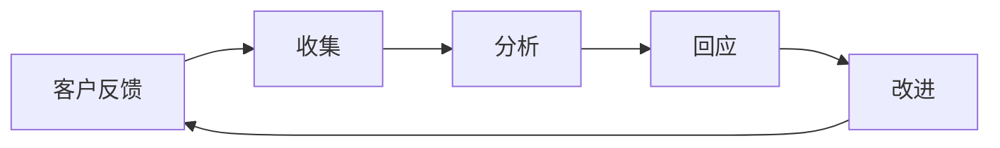

                 

## 1. 背景介绍

在数字化时代，知识付费成为了一种快速获取高质量内容的方式。程序员作为知识付费平台的主要用户群体，如何高效、有效地处理客户反馈，确保平台的可持续发展，是一个重要的议题。本文将探讨程序员如何处理知识付费的客户反馈，通过分析客户反馈的不同类型、处理流程以及优化建议，帮助知识付费平台提升用户体验，增加用户黏性，实现可持续发展。

## 2. 核心概念与联系

### 2.1 核心概念概述

在讨论如何处理客户反馈之前，我们先了解几个核心概念：

- **知识付费平台**：基于互联网的商业模型，用户为获取特定知识和技能而支付费用的服务。
- **客户反馈**：用户在使用知识付费平台时，对其服务、产品、内容等提供的意见和建议。
- **反馈处理流程**：收集、分析、回应和改进的整个过程。
- **客户满意度**：用户对知识付费平台提供的价值和使用体验的综合评价。

这些概念相互关联，共同构成了知识付费平台与用户之间的互动过程。

### 2.2 核心概念原理和架构的 Mermaid 流程图



这个流程图展示了客户反馈的处理流程：从客户提出反馈开始，到平台根据反馈进行改进并回应用户，形成闭环。

## 3. 核心算法原理 & 具体操作步骤

### 3.1 算法原理概述

客户反馈处理的核心算法原理可以概括为以下几个步骤：

1. **数据收集**：通过多种渠道收集客户反馈，包括在线评论、问卷调查、社交媒体等。
2. **数据清洗与分析**：去除噪音数据，提取有价值的信息，进行情感分析、主题分类等处理。
3. **反馈分类**：根据反馈类型进行分类，如产品功能问题、内容质量、服务体验等。
4. **优先级排序**：根据问题的严重性和影响范围，对反馈进行优先级排序。
5. **回应与改进**：对反馈进行及时回应，并根据反馈进行产品改进。
6. **结果评估**：评估改进措施的效果，收集用户后续反馈。

### 3.2 算法步骤详解

以下将详细介绍每个步骤的具体操作：

#### 3.2.1 数据收集

**方法与工具**：

- **API接口**：通过API接口自动抓取在线评论、评分、回复等数据。
- **爬虫技术**：使用Python爬虫技术，从社交媒体、论坛等平台抓取反馈数据。
- **问卷调查**：设计和推送问卷，收集用户对特定产品或服务的评价。

**数据格式**：

- **结构化数据**：如SQL数据库中的表格，方便后续分析。
- **非结构化数据**：如文本、图片、音频等，需进行预处理和转换。

**注意事项**：

- 确保数据收集过程合法合规，尊重用户隐私。
- 合理控制数据收集量，避免对平台造成过度负担。

#### 3.2.2 数据清洗与分析

**数据清洗**：

- **去重与规范化**：去除重复数据，统一数据格式。
- **文本预处理**：如分词、去除停用词、词干提取等，减少噪音数据。
- **情感分析**：使用自然语言处理技术，分析反馈的情感倾向。

**工具与技术**：

- **Python**：使用NLTK、spaCy等库进行文本处理。
- **机器学习**：使用LSTM、BERT等模型进行情感分析。

**分析结果**：

- **情感分布**：正面、负面、中性情感的分布情况。
- **主题聚类**：反馈中的高频词汇和短语，形成主题聚类。

#### 3.2.3 反馈分类

**分类标准**：

- **问题类型**：功能问题、性能问题、内容质量等。
- **严重程度**：轻微、中等、严重。
- **影响范围**：全局影响、局部影响。

**工具与技术**：

- **分类算法**：如朴素贝叶斯、支持向量机等。
- **聚类算法**：如K-means、层次聚类等。

**分类结果**：

- **反馈清单**：清晰列出各类反馈的数量和占比。
- **问题树状图**：展示各类问题的层次结构和分布情况。

#### 3.2.4 优先级排序

**排序因素**：

- **影响范围**：影响用户数量和范围。
- **问题严重性**：对平台稳定性和用户体验的破坏程度。
- **用户反馈频率**：相同问题的反馈数量和频率。

**工具与技术**：

- **优先级模型**：如AHP（层次分析法）、MCDM（多准则决策分析）等。
- **优先级指标**：如修复难度、修复成本等。

**排序结果**：

- **优先级列表**：根据排序结果，制定改进计划。
- **问题优先级**：标明各问题的优先级，指导资源分配。

#### 3.2.5 回应与改进

**回应策略**：

- **及时回应**：对每个反馈及时回应，确保用户感到被重视。
- **公开透明**：在平台公开反馈处理进度和结果。
- **改进措施**：根据反馈进行产品改进，优化用户体验。

**工具与技术**：

- **项目管理工具**：如JIRA、Trello等，管理改进任务。
- **版本控制**：如Git，记录改进的代码变化。

**回应流程**：

- **自动回复**：使用模板自动回复常见问题。
- **人工审核**：对复杂问题进行人工审核和处理。
- **跟进与反馈**：处理完毕后，跟进用户反馈，确认问题是否解决。

#### 3.2.6 结果评估

**评估方法**：

- **用户满意度调查**：通过问卷调查评估改进效果。
- **用户行为分析**：使用分析工具跟踪用户行为变化。
- **问题解决率**：统计改进后问题解决的比例。

**工具与技术**：

- **用户行为分析工具**：如Google Analytics、Mixpanel等。
- **调查问卷工具**：如SurveyMonkey、Google Forms等。

**评估结果**：

- **改进效果**：评估改进措施对用户满意度的提升。
- **改进成本**：评估改进措施的资源消耗和成本。
- **改进周期**：评估从反馈收集到问题解决的时间周期。

## 4. 数学模型和公式 & 详细讲解 & 举例说明

### 4.1 数学模型构建

**反馈处理模型**：

- **输入**：收集到的客户反馈数据。
- **输出**：优先级排序后的改进措施和预期效果。

**模型架构**：

- **输入层**：收集和预处理反馈数据。
- **中间层**：分类、情感分析、主题聚类等处理过程。
- **输出层**：优先级排序和改进措施。

### 4.2 公式推导过程

**情感分析公式**：

假设客户反馈数据为 $D = \{x_1, x_2, ..., x_n\}$，其中每个数据 $x_i = (y_i, t_i)$，$y_i$ 为文本内容，$t_i$ 为标签（正面、负面、中性）。使用LSTM模型进行情感分析，输出情感概率分布 $p(y_i|x_i)$。

**公式**：

$$
p(y_i|x_i) = softmax(W^T tanh(W_x x_i + b_x) + b_y)
$$

其中 $W, b$ 为模型参数。

**优先级排序公式**：

假设每个反馈 $f_i$ 的影响范围为 $R_i$，问题严重性为 $S_i$，用户反馈频率为 $F_i$。使用AHP方法计算优先级 $P_i$。

**公式**：

$$
P_i = \sum_j a_{ij} \times \max(P_j, 1)
$$

其中 $a_{ij}$ 为判断矩阵，$P_j$ 为子问题的优先级。

### 4.3 案例分析与讲解

**案例背景**：某知识付费平台收集到大量用户反馈，主要集中在课程内容质量和功能问题上。

**数据收集**：

- **课程评分**：从平台评分系统中抓取所有课程评分数据。
- **用户评论**：使用爬虫技术从用户评论中提取反馈信息。

**数据清洗与分析**：

- **情感分析**：使用LSTM模型进行情感分析，发现用户对课程内容质量的负面反馈居多。
- **主题聚类**：对课程评分和用户评论进行主题聚类，识别出功能问题和内容质量问题。

**反馈分类**：

- **功能问题**：课程加载慢、界面不友好等。
- **内容质量**：课程内容不深入、讲师讲解不清晰等。

**优先级排序**：

- **影响范围**：功能问题影响所有用户，内容质量问题影响部分用户。
- **问题严重性**：功能问题严重影响用户体验，内容质量问题影响用户满意度和课程完成率。
- **用户反馈频率**：功能问题频繁出现，内容质量问题相对较少。

**回应与改进**：

- **功能问题**：优先处理课程加载慢和界面不友好问题，提升用户体验。
- **内容质量**：通过增加课程内容和改进讲师讲解，提高用户满意度。

**结果评估**：

- **用户满意度调查**：通过问卷调查发现，功能问题显著改善，课程满意度提升。
- **用户行为分析**：课程完成率提高，用户平均评分上升。

## 5. 项目实践：代码实例和详细解释说明

### 5.1 开发环境搭建

**环境配置**：

- **Python**：安装Python 3.7及以上版本。
- **NLP库**：安装NLTK、spaCy、TensorFlow等。
- **项目管理工具**：安装JIRA、Trello等。
- **分析工具**：安装Google Analytics、Mixpanel等。

**环境搭建**：

- **虚拟环境**：使用virtualenv或conda创建虚拟环境，避免依赖冲突。
- **数据管理**：使用MySQL或PostgreSQL数据库，存储反馈数据。
- **项目管理**：使用JIRA或Trello等项目管理工具，分配任务和跟踪进度。

### 5.2 源代码详细实现

**代码示例**：

```python
import pandas as pd
from transformers import pipeline
from sklearn.feature_extraction.text import TfidfVectorizer
from sklearn.cluster import KMeans

# 读取反馈数据
data = pd.read_csv('feedback.csv')

# 数据清洗
data = data.drop_duplicates()
data = data.dropna()

# 情感分析
sentiment_analysis = pipeline('sentiment-analysis')
sentiment = sentiment_analysis(data['text'])

# 主题聚类
tfidf = TfidfVectorizer()
X = tfidf.fit_transform(data['text'])
kmeans = KMeans(n_clusters=3, random_state=42)
clusters = kmeans.fit_predict(X)

# 优先级排序
def compute_priority(feedback):
    # 计算影响范围
    range_score = get_impact_range(feedback['type'])
    # 计算问题严重性
    severity_score = get_severity(feedback['type'])
    # 计算用户反馈频率
    frequency_score = get_feedback_frequency(feedback['type'])
    # 计算优先级
    priority = (range_score * severity_score * frequency_score)
    return priority

# 回应用户反馈
def respond_feedback(feedback):
    if feedback['type'] == 'function':
        # 自动回复模板
        response = "我们已收到您的反馈，正在处理功能问题..."
    elif feedback['type'] == 'content':
        # 自动回复模板
        response = "我们正在改进课程内容，感谢您的建议..."
    # 发送自动回复
    send_feedback_response(feedback['id'], response)
    # 分配改进任务
    assign_improvement_task(feedback['id'])

# 改进任务管理
def assign_improvement_task(feedback_id):
    # 创建改进任务
    create_improvement_task(feedback_id, compute_priority(feedback_id))

# 评估改进效果
def evaluate_improvement():
    # 用户满意度调查
    satisfaction_survey = conduct_survey('user_satisfaction')
    # 用户行为分析
    user_behavior_analysis = get_user_behavior_analysis()
    # 统计改进效果
    statistics = evaluate_improvement_statistics(satisfaction_survey, user_behavior_analysis)
    return statistics
```

### 5.3 代码解读与分析

**代码分析**：

- **数据清洗与处理**：使用Pandas和NLP库进行数据预处理，包括去重、删除缺失值、情感分析等。
- **主题聚类**：使用TF-IDF和KMeans进行主题聚类，识别反馈中的高频词汇和短语。
- **优先级排序**：定义函数计算反馈的优先级，根据问题类型、影响范围、严重性和用户反馈频率进行排序。
- **自动回复**：使用Python模板技术生成自动回复，并发送到用户。
- **改进任务管理**：使用JIRA等项目管理工具创建和分配改进任务，跟踪任务进度。
- **改进效果评估**：通过用户满意度调查和用户行为分析，评估改进措施的效果。

**注意事项**：

- **数据隐私**：在数据收集和处理过程中，确保数据隐私和安全。
- **系统响应**：确保系统能够及时处理和回应用户反馈。
- **持续优化**：定期回顾改进效果，根据反馈进行持续优化。

### 5.4 运行结果展示

**结果展示**：

- **反馈清单**：列出所有反馈类型及其数量、占比。
- **优先级列表**：展示每个反馈的优先级排序。
- **改进措施**：展示每个改进任务的进展情况。
- **效果评估**：展示改进后的用户满意度和行为变化。

**结果分析**：

- **反馈处理效率**：评估从反馈收集到问题解决的平均时间。
- **改进措施效果**：评估改进措施对用户满意度和行为的影响。
- **资源消耗**：评估改进措施的资源消耗，包括时间、人力、资金等。

## 6. 实际应用场景

### 6.1 智能客服系统

**应用场景**：

- **反馈收集**：智能客服系统通过自然语言处理技术，收集用户反馈。
- **自动分类**：使用机器学习算法对反馈进行自动分类，如服务质量、功能问题等。
- **优先级排序**：根据反馈问题的严重性和影响范围，排序并优先处理。
- **自动回复**：使用模板自动回复用户反馈，提升用户体验。

**实现工具**：

- **自然语言处理库**：如NLTK、spaCy等。
- **机器学习库**：如Scikit-learn、TensorFlow等。
- **项目管理工具**：如JIRA、Trello等。

**优势**：

- **提高效率**：自动化处理反馈，提升客服响应速度。
- **提升体验**：自动回复用户反馈，增强用户满意度。

### 6.2 教育培训平台

**应用场景**：

- **反馈收集**：通过问卷调查、在线课程评分等方式，收集学生和教师的反馈。
- **主题聚类**：对反馈进行主题聚类，识别常见问题。
- **优先级排序**：根据问题的严重性和影响范围，优先处理。
- **改进措施**：根据反馈进行课程内容改进和教师培训。

**实现工具**：

- **问卷调查工具**：如SurveyMonkey、Google Forms等。
- **数据分析工具**：如Python、R等。
- **项目管理工具**：如Trello、Asana等。

**优势**：

- **改进教学**：通过反馈优化课程内容和教学方法，提升教学效果。
- **增强体验**：及时回应学生和教师反馈，提升平台满意度。

### 6.3 医疗健康平台

**应用场景**：

- **反馈收集**：通过在线咨询、评价系统等方式，收集患者和医生的反馈。
- **情感分析**：对反馈进行情感分析，识别负面反馈。
- **主题聚类**：对反馈进行主题聚类，识别常见问题。
- **优先级排序**：根据问题的严重性和影响范围，优先处理。
- **改进措施**：根据反馈进行医疗服务改进和医生培训。

**实现工具**：

- **情感分析工具**：如NLTK、TextBlob等。
- **数据分析工具**：如Python、R等。
- **项目管理工具**：如JIRA、Asana等。

**优势**：

- **提升服务**：通过反馈优化医疗服务，提升患者体验。
- **加强沟通**：及时回应患者和医生反馈，增强医患关系。

## 7. 工具和资源推荐

### 7.1 学习资源推荐

**资源列表**：

- **自然语言处理课程**：如CS224N《深度学习自然语言处理》课程，斯坦福大学开设的NLP明星课程。
- **Python学习资源**：如《Python编程：从入门到实践》一书，全面介绍Python基础和应用。
- **数据分析工具**：如《Python数据分析实战》一书，详细介绍Python数据分析工具和方法。

### 7.2 开发工具推荐

**工具列表**：

- **Python**：Python 3.7及以上版本，最常用的编程语言之一。
- **NLP库**：如NLTK、spaCy、TextBlob等，用于自然语言处理。
- **数据分析库**：如Pandas、NumPy、Scikit-learn等，用于数据处理和分析。
- **项目管理工具**：如JIRA、Trello、Asana等，用于任务分配和进度跟踪。

### 7.3 相关论文推荐

**论文列表**：

- **情感分析**：《A Survey on Sentiment Analysis》，情感分析领域综述，介绍常见技术和方法。
- **主题聚类**：《A Review of Topic Modeling Techniques for Information Retrieval》，主题聚类领域综述，介绍常见算法和应用。
- **机器学习优先级排序**：《A Survey of Preference Ranking Methods》，机器学习优先级排序综述，介绍常见算法和应用场景。

## 8. 总结：未来发展趋势与挑战

### 8.1 研究成果总结

本文从核心概念、算法原理、操作步骤、实际应用场景等方面，详细介绍了程序员如何处理知识付费的客户反馈。通过数据收集、情感分析、主题聚类、优先级排序、自动回复等技术手段，提升了知识付费平台的用户体验和运营效率。

### 8.2 未来发展趋势

未来，随着AI和机器学习技术的不断进步，客户反馈处理将更加智能化和自动化。

**趋势一**：

- **自动化程度提升**：更多的自动化工具和算法将应用于反馈处理，提高效率和准确性。
- **实时处理能力**：通过实时数据分析和处理，及时响应用户反馈，提升用户体验。

**趋势二**：

- **多模态反馈处理**：结合文字、语音、图片等多模态数据，进行综合分析和处理。
- **情感计算**：引入情感计算技术，更准确地理解和分析用户情感。

**趋势三**：

- **上下文理解**：通过上下文理解技术，更好地理解用户反馈，提升问题诊断和处理能力。
- **知识图谱融合**：结合知识图谱和专家知识，提高问题解决和改进建议的科学性。

### 8.3 面临的挑战

尽管客户反馈处理技术不断进步，但仍面临一些挑战：

**挑战一**：

- **数据质量**：高质量数据是反馈处理的基础，如何获取和处理高质量数据，仍是难题。
- **数据隐私**：在数据收集和处理过程中，确保用户隐私和数据安全，仍需加强技术和管理措施。

**挑战二**：

- **算法复杂性**：复杂的算法和模型需要较高的计算资源和时间，如何在资源有限的情况下，保证处理效率和效果，仍需进一步优化。
- **模型可解释性**：机器学习模型通常是“黑盒”，如何提高模型的可解释性，增强用户信任，仍需探索和研究。

### 8.4 研究展望

未来，客户反馈处理技术需要从以下几个方面进行深入研究：

**研究一**：

- **无监督学习**：探索无监督学习技术，在缺乏标注数据的情况下，仍能高效处理反馈数据。
- **跨领域迁移**：探索跨领域迁移学习技术，提高模型在不同任务上的泛化能力。

**研究二**：

- **自适应算法**：开发自适应反馈处理算法，根据反馈数据的变化，自动调整处理策略。
- **混合模型**：探索混合模型结构，结合深度学习和传统算法，提升反馈处理效果。

**研究三**：

- **伦理和安全性**：引入伦理和安全性约束，确保反馈处理过程符合伦理道德要求，避免有害信息的传播。

通过以上研究，客户反馈处理技术将更加智能化、高效化和安全化，为知识付费平台的可持续发展提供有力支持。

## 9. 附录：常见问题与解答

### 9.1 问题一：如何处理大规模反馈数据？

**解答**：

- **分布式处理**：使用分布式计算框架，如Hadoop、Spark等，处理大规模数据。
- **增量处理**：采用增量数据处理技术，减少系统负载。

### 9.2 问题二：如何确保反馈处理系统的稳定性和可靠性？

**解答**：

- **负载均衡**：使用负载均衡技术，确保系统在高并发情况下稳定运行。
- **容错机制**：引入容错机制，确保系统出现故障时自动恢复。

### 9.3 问题三：如何提高反馈处理的自动化程度？

**解答**：

- **自动化工具**：使用自动化工具和脚本，减少人工干预。
- **智能推荐**：通过智能推荐算法，自动推荐优先级高的反馈，提高处理效率。

### 9.4 问题四：如何保障数据隐私和安全？

**解答**：

- **数据加密**：使用数据加密技术，确保数据传输和存储的安全性。
- **权限控制**：设置严格的权限控制，防止未经授权的访问。

### 9.5 问题五：如何优化反馈处理效率？

**解答**：

- **算法优化**：优化算法模型，提高处理效率。
- **硬件加速**：使用GPU或TPU等硬件加速设备，提升处理速度。

---

作者：禅与计算机程序设计艺术 / Zen and the Art of Computer Programming

