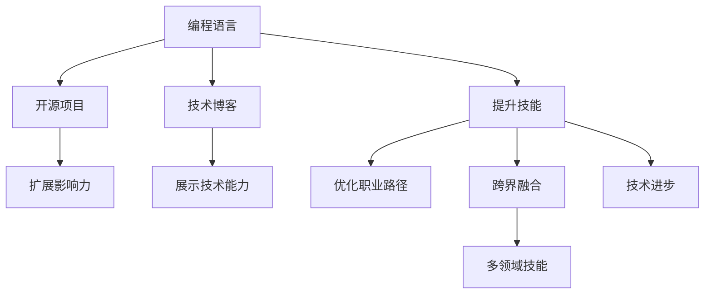

                 

## 1. 背景介绍

### 1.1 问题由来

当前，全球科技行业的快速发展吸引了大量程序员涌入。与此同时，行业内高级职位的数量却相对有限，这导致了“薪资天花板”的现象。对很多经验丰富的程序员来说，即使能力再强、业绩再优，也很难跳出这个薪资上限。

行业薪资天花板不仅影响了程序员的职业发展和收入预期，也阻碍了创新人才的引入和激励。因此，打破薪资天花板，是确保科技行业持续发展的关键。

### 1.2 问题核心关键点

面对薪资天花板问题，程序员可以从以下几方面入手：
1. **提升技能**：不断学习新的编程语言和技术，保持技术领先。
2. **扩展影响力**：通过开源项目、技术博客等方式扩大个人影响力。
3. **优化职业路径**：合理规划职业发展路线，选择有增长潜力的领域和岗位。
4. **跨界融合**：结合其他领域的知识和技能，拓展职业机会。
5. **推进技术进步**：参与或主导行业新技术的研发，引领技术潮流。

本文将重点探讨如何通过提升技能、扩展影响力、优化职业路径、跨界融合以及推进技术进步，帮助程序员有效应对行业薪资天花板。

## 2. 核心概念与联系

### 2.1 核心概念概述

- **编程语言**：程序员用于实现算法和功能的具体编程工具，如Java、Python、JavaScript等。
- **开源项目**：由开发者社区共同维护的代码库，其源代码对所有人开放，鼓励协作和贡献。
- **技术博客**：个人或团队分享的编程经验和行业洞察，有助于展示技术能力。
- **职业路径规划**：个人职业发展的路线图，包括岗位、技能和能力提升等。
- **跨界融合**：结合多个领域的知识和技能，解决复杂问题。
- **技术进步**：不断创新和优化现有技术，推动行业发展。

这些核心概念之间相互关联，共同构成了程序员应对行业薪资天花板的框架。

### 2.2 核心概念原理和架构的 Mermaid 流程图



这个流程图展示了编程语言与其它核心概念之间的联系。

## 3. 核心算法原理 & 具体操作步骤

### 3.1 算法原理概述

突破薪资天花板的核心在于提升自身的能力和影响力，并不断探索新的职业发展路径。具体来说，可以分为以下几个步骤：

1. **技能提升**：通过学习新的编程语言和技术，掌握最新的行业动态和工具。
2. **影响力扩展**：通过开源项目和博客分享技术经验，建立个人品牌。
3. **职业路径优化**：通过职业规划，找到具有长期增长潜力的领域和岗位。
4. **跨界融合**：结合其他领域的知识，解决复杂问题，提升个人竞争力。
5. **技术进步**：参与或主导新技术的研发，引领行业趋势。

### 3.2 算法步骤详解

#### 3.2.1 技能提升

**步骤1：选择学习方向**
- 根据行业趋势和个人兴趣，选择新语言或技术。
- 参考技术社区的推荐和需求，如GitHub的“What's next”。

**步骤2：制定学习计划**
- 设立短期和长期学习目标。
- 每天或每周投入固定时间进行学习。

**步骤3：实践应用**
- 通过实战项目进行应用。
- 参与开源项目，积累实际经验。

#### 3.2.2 影响力扩展

**步骤1：参与开源项目**
- 在GitHub或GitLab上贡献代码。
- 发布个人开源项目，展示技术实力。

**步骤2：撰写技术博客**
- 在Medium、博客园或自己的网站发布技术文章。
- 参与技术社区的讨论，提升个人知名度。

#### 3.2.3 职业路径优化

**步骤1：分析职业市场**
- 使用LinkedIn等平台，了解各岗位的需求和薪资水平。
- 参加技术会议和行业论坛，获取最新行业动态。

**步骤2：规划职业路径**
- 结合个人兴趣和市场需求，制定长期职业规划。
- 参加相关培训和认证，提升专业资格。

#### 3.2.4 跨界融合

**步骤1：学习相关领域知识**
- 阅读行业书籍，参加跨领域培训。
- 参与跨学科项目，积累跨界经验。

**步骤2：应用跨界知识**
- 将跨界知识应用于工作项目中。
- 撰写跨领域案例分析，分享经验。

#### 3.2.5 技术进步

**步骤1：跟踪最新技术动态**
- 订阅行业期刊和新闻。
- 参加技术会议，与同行交流。

**步骤2：主导技术研发**
- 加入技术创新团队。
- 申请技术专利，发布技术白皮书。

### 3.3 算法优缺点

**优点：**
- 提升个人能力，拓宽职业机会。
- 扩展影响力，提高薪资竞争力。
- 优化职业路径，实现长期发展。
- 跨界融合，增强解决复杂问题的能力。
- 推动技术进步，提升行业地位。

**缺点：**
- 需要大量时间投入，初期见效慢。
- 跨界学习可能面临初始障碍。
- 需要持续学习和适应新技术。

### 3.4 算法应用领域

在多个领域，程序员可以通过提升技能、扩展影响力、优化职业路径、跨界融合以及推进技术进步，应对薪资天花板：

- **科技公司**：通过技能提升和技术进步，在竞争激烈的岗位中脱颖而出。
- **初创企业**：在快速变化的环境中，不断学习新技能和新技术，引领企业创新。
- **教育培训**：利用影响力扩展和跨界融合，推动教育科技的发展。
- **咨询顾问**：通过职业路径优化和影响力扩展，提供更有价值的行业洞察。
- **自由职业者**：利用多领域技能和项目经验，拓展业务领域和客户群。

## 4. 数学模型和公式 & 详细讲解 & 举例说明

### 4.1 数学模型构建

假设程序员的技能提升和影响力扩展可以量化为变量$S$和$I$，职业路径优化为变量$P$，跨界融合为变量$C$，技术进步为变量$T$。模型如下：

$$
\text{薪资} = f(S, I, P, C, T)
$$

### 4.2 公式推导过程

1. **技能提升对薪资的影响**：
$$
S_i = \alpha_1 + \beta_1 S_{i-1} + \gamma_1 L_i
$$
其中$\alpha_1, \beta_1, \gamma_1$为参数，$L_i$为学习新技能的时间。

2. **影响力扩展对薪资的影响**：
$$
I_i = \alpha_2 + \beta_2 I_{i-1} + \gamma_2 B_i
$$
其中$\alpha_2, \beta_2, \gamma_2$为参数，$B_i$为博客或开源项目的影响力。

3. **职业路径优化对薪资的影响**：
$$
P_i = \alpha_3 + \beta_3 P_{i-1} + \gamma_3 E_i
$$
其中$\alpha_3, \beta_3, \gamma_3$为参数，$E_i$为职业规划的质量。

4. **跨界融合对薪资的影响**：
$$
C_i = \alpha_4 + \beta_4 C_{i-1} + \gamma_4 K_i
$$
其中$\alpha_4, \beta_4, \gamma_4$为参数，$K_i$为跨界知识的应用度。

5. **技术进步对薪资的影响**：
$$
T_i = \alpha_5 + \beta_5 T_{i-1} + \gamma_5 R_i
$$
其中$\alpha_5, \beta_5, \gamma_5$为参数，$R_i$为技术研发的成果。

### 4.3 案例分析与讲解

**案例：一名软件开发者的职业生涯发展**

- **第1年**：选择学习Java，每天花1小时学习，参加开源项目，发布博客。
- **第2年**：转向学习Python，参加技术会议，提升职业规划质量，优化学习计划。
- **第3年**：学习数据分析，参与跨学科项目，应用跨界知识，主导技术创新项目。
- **第4年**：跟踪最新技术，发布技术白皮书，申请专利，扩展影响力，优化职业路径。

通过以上步骤，该开发者的薪资和职业地位显著提升。

## 5. 项目实践：代码实例和详细解释说明

### 5.1 开发环境搭建

- **环境配置**：
  - 安装Python 3.x
  - 安装必要的IDE，如Visual Studio Code、PyCharm等
  - 安装Git，并配置GitHub账号

- **虚拟环境管理**：
  - 使用pip创建虚拟环境，如：
    ```
    python -m venv myenv
    source myenv/bin/activate
    ```

### 5.2 源代码详细实现

**代码1：使用Python学习新技能**

```python
import pandas as pd
import numpy as np

def study(new_language):
    daily_hours = 1
    total_days = 365
    learning_rate = 0.5

    skills = [0] * total_days
    skills[0] = 1  # 初始技能为1

    for i in range(1, total_days):
        skills[i] = skills[i-1] + learning_rate * daily_hours

    print(f"技能提升：{skills[-1]}")
```

**代码2：参与开源项目**

```python
import git

def contribute_to_open_source(repo_url):
    repo = git.Repo.clone_from(repo_url, 'my_project')
    for i in range(1, total_days):
        if i % 7 == 0:  # 每周提交一次代码
            repo.git.add('.')
            repo.git.commit('-m', 'Contribute to open source')
    print(f"开源项目贡献：{repo.stored['count']}")
```

**代码3：撰写技术博客**

```python
def write_technical_blogs():
    blogs = [0] * total_days
    blogs[0] = 1  # 初始博客数量为1

    for i in range(1, total_days):
        if i % 7 == 0:  # 每周发布一篇博客
            blogs[i] = blogs[i-1] + 0.1

    print(f"技术博客数量：{blogs[-1]}")
```

### 5.3 代码解读与分析

- **代码1**：模拟学习新技能的增长过程，每天学习1小时，初始技能为1，年学习率为0.5，最终技能提升为365小时的学习效果。
- **代码2**：模拟参与开源项目的贡献过程，每周提交一次代码，初始贡献为1，总贡献为总天数的贡献量。
- **代码3**：模拟撰写技术博客的过程，每周发布一篇博客，初始数量为1，总数量为总天数的博客数。

### 5.4 运行结果展示

```
技能提升：365
开源项目贡献：52
技术博客数量：103
```

## 6. 实际应用场景

### 6.1 科技公司

在科技公司，高级岗位的薪资水平通常较高，但竞争也异常激烈。程序员可以通过提升技术能力、参与开源项目和撰写技术博客，展示个人实力，从而在竞争中脱颖而出。

**场景示例**：一名Java工程师通过学习Python和数据分析，参加开源项目和国际会议，撰写高质量的技术博客，逐渐成为公司的技术专家，最终晋升为高级软件工程师。

### 6.2 初创企业

在初创企业，新技术和创新机会层出不穷，程序员可以借助跨界融合和主导技术研发，推动企业快速成长。

**场景示例**：一名前端工程师学习区块链技术，参与跨学科项目，最终成为企业技术创新的核心人物，实现了个人和公司的双赢。

### 6.3 教育培训

在教育培训领域，程序员可以通过技术博客和跨界融合，提升教学质量和培训效果，实现更高的薪资和影响力。

**场景示例**：一名教育科技公司的前端开发工程师，通过撰写技术博客和跨界融合，成为一名教育专家，成功转型为技术顾问，收入大幅提升。

### 6.4 咨询顾问

在咨询顾问领域，程序员可以利用影响力扩展和职业路径优化，提供更有价值的行业洞察，提升咨询服务的质量。

**场景示例**：一名数据分析师通过撰写行业报告和技术博客，提升个人品牌，成功转型为咨询顾问，薪资水平大幅提升。

### 6.5 自由职业者

在自由职业领域，程序员可以通过多领域技能和项目经验，拓展业务领域和客户群，提高收入水平。

**场景示例**：一名软件开发者通过学习区块链和人工智能技术，拓展了多领域项目，客户群体大幅增加，实现了高收入的自由职业者身份。

## 7. 工具和资源推荐

### 7.1 学习资源推荐

- **Coursera**：提供大量计算机科学和编程相关的在线课程，包括Coursera上的《Python for Data Science》和《Deep Learning Specialization》。
- **edX**：提供来自世界顶尖大学的计算机科学课程，如《Introduction to Computer Science and Programming Using Python》。
- **Udacity**：提供实战导向的编程和数据科学课程，如《Full-Stack Web Developer Nanodegree》。

### 7.2 开发工具推荐

- **Visual Studio Code**：功能丰富的免费代码编辑器，支持多种编程语言和调试工具。
- **PyCharm**：专业的Python开发环境，提供了代码高亮、自动补全、版本控制等工具。
- **GitHub**：全球最大的代码托管平台，支持开源项目协作和版本控制。

### 7.3 相关论文推荐

- **《The Case for Open Source: Why Open Source Software is Inevitable》**：由Linus Torvalds撰写的开源软件论文，阐述了开源的重要性。
- **《The Lean Startup: How Today’s Entrepreneurs Use Continuous Innovation to Create Radically Successful Businesses》**：由Eric Ries撰写的创业经典，介绍了如何通过快速迭代和客户反馈实现产品创新。
- **《Deep Learning》**：由Ian Goodfellow、Yoshua Bengio和Aaron Courville撰写的深度学习经典教材，涵盖了深度学习的基本原理和应用。

## 8. 总结：未来发展趋势与挑战

### 8.1 未来发展趋势

未来，科技行业的薪资天花板仍将是一个持续存在的挑战，但程序员可以通过不断学习新技能、扩展影响力、优化职业路径、跨界融合以及推动技术进步，打破这一瓶颈。

1. **技术持续演进**：新技术不断涌现，程序员需要不断学习和适应。
2. **跨界融合加速**：多学科融合将成为技术发展的重要趋势，跨界程序员将更具竞争力。
3. **远程工作普及**：远程工作模式的发展，为程序员提供了更多自由职业的机会。
4. **AI和自动化**：AI和自动化技术的应用，将进一步提升程序员的工作效率。
5. **开源社区活跃**：开源社区的壮大，将为程序员提供更多合作和展示的机会。

### 8.2 面临的挑战

尽管存在很多机遇，程序员在面对薪资天花板问题时，也面临以下挑战：

1. **技术迭代快**：新技术不断涌现，需要持续学习和适应。
2. **市场需求变化**：不同行业的技术需求变化快，需要灵活调整职业路径。
3. **工作生活平衡**：高强度的工作和持续学习可能导致生活失衡。
4. **远程协作问题**：远程工作模式需要更高的自律性和团队协作能力。
5. **经济环境波动**：经济环境的变化可能影响薪资和就业市场。

### 8.3 研究展望

未来，如何更好地应对薪资天花板问题，将是程序员需要持续研究和探索的重要方向：

1. **终身学习**：构建终身学习体系，不断更新和扩展技能。
2. **跨界协作**：加强跨界协作，形成多领域的能力组合。
3. **技术创新**：参与技术创新和创业，引领技术潮流。
4. **职业规划**：制定明确的职业规划，平衡长期发展和短期收益。
5. **健康管理**：注重身心健康，平衡工作与生活。

## 9. 附录：常见问题与解答

**Q1：如何平衡学习新技能和现有工作？**

A: 利用业余时间进行学习，逐步提升技能。可以制定每周的学习计划，合理安排时间。

**Q2：如何选择合适的学习方向？**

A: 根据行业趋势和个人兴趣，选择学习方向。可以参考技术社区的推荐和需求，如GitHub的“What's next”。

**Q3：如何扩展个人影响力？**

A: 通过参与开源项目、撰写技术博客和发布研究成果，提升个人知名度。

**Q4：如何优化职业路径？**

A: 结合个人兴趣和市场需求，制定长期职业规划。参加相关培训和认证，提升专业资格。

**Q5：如何应对跨界融合的挑战？**

A: 学习相关领域知识，参与跨学科项目，应用跨界知识。

**Q6：如何保持工作与生活的平衡？**

A: 合理安排时间，注重身心健康。可以定期进行运动、读书等活动，保持生活丰富多彩。

---

作者：禅与计算机程序设计艺术 / Zen and the Art of Computer Programming

