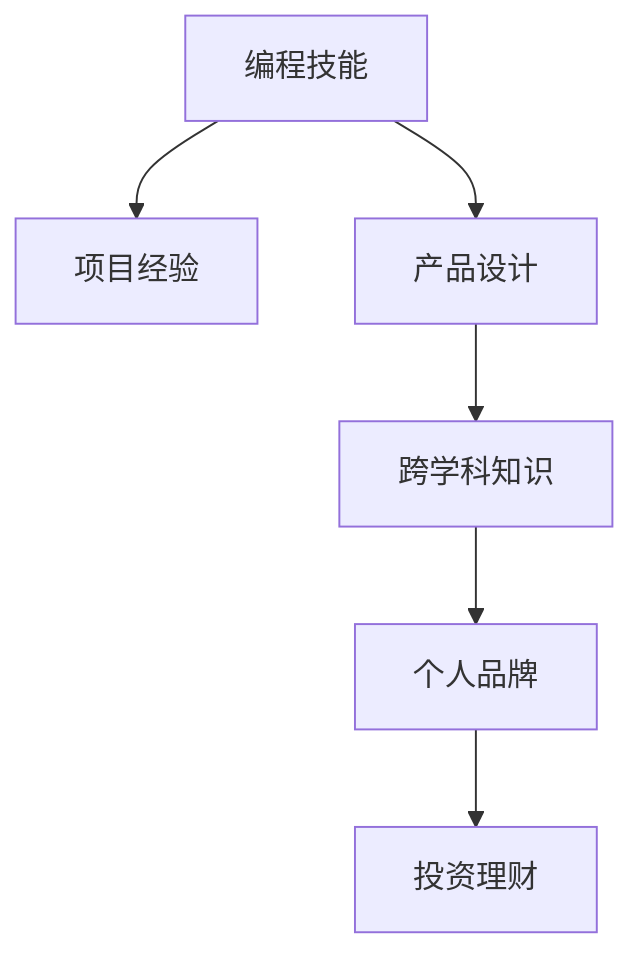

                 

# 程序员如何建立多元化收入结构

## 1. 背景介绍

### 1.1 问题由来
在现代社会，尤其是信息技术飞速发展的今天，程序员作为科技行业的中坚力量，其收入结构和职业发展面临着越来越多的不确定性和挑战。尽管传统软件开发和高科技公司提供的薪资和福利待遇较为优厚，但同时也存在着风险，如技术更新迭代快、竞争激烈等。因此，如何建立多元化的收入结构，增强职业的稳定性和安全性，是每个程序员都需要认真思考的问题。

### 1.2 问题核心关键点
构建多元化收入结构的核心在于将个人技能、兴趣和市场需求相结合，形成多渠道的收入来源。这不仅可以降低收入单一的风险，还能在技术变革或行业波动时，提供更多安全感。具体来说，需要从以下几个方面入手：
1. 编程技能。熟悉主流的编程语言和技术栈，保持技术领先优势。
2. 项目经验和团队合作能力。参与大型项目或开源社区，积累实战经验和团队协作能力。
3. 产品设计和用户体验。了解用户需求和产品设计的基本原则，提升产品的市场竞争力。
4. 创新能力和跨学科知识。学习跨领域的知识和技能，如数据科学、人工智能等，拓展自己的知识边界。
5. 个人品牌和影响力。通过博客、社交媒体、技术讲座等方式，建立个人品牌，提升行业影响力。
6. 投资理财和创业。合理配置资产，利用资本市场的机会，进行风险控制和财富积累。

## 2. 核心概念与联系

### 2.1 核心概念概述

为更好地理解如何建立多元化收入结构，本节将介绍几个密切相关的核心概念：

- 编程技能(Programming Skills)：指程序员掌握的编程语言、框架和工具等技术能力。高超的编程技能是获取高薪和优秀工作机会的基础。
- 项目经验(Project Experience)：指程序员参与的实际项目，包括个人项目、开源贡献和公司项目等。丰富的项目经验能显著提升个人职业竞争力。
- 产品设计(Product Design)：指对软件产品功能和用户体验进行设计和优化的能力。熟悉产品设计的程序员能更好地理解和满足用户需求。
- 跨学科知识(Cross-disciplinary Knowledge)：指程序员跨领域学习并掌握的其他学科知识，如数据科学、人工智能等。跨学科知识有助于在复杂技术问题上提供创新的解决方案。
- 个人品牌(Personal Branding)：指通过公开展示专业知识和技能，建立和维护自己在行业内的声誉和影响力。个人品牌能增加职业发展的机会。
- 投资理财(Investment & Financial Management)：指通过合理配置资产和利用资本市场，实现财务自由和财富增值。

这些核心概念之间的逻辑关系可以通过以下Mermaid流程图来展示：



这个流程图展示了个体多元化收入结构的核心组成要素及其之间的关系：

1. 编程技能是基础，支撑后续的项目经验、产品设计、跨学科知识和个人品牌。
2. 项目经验丰富了编程技能的应用场景，提升了技术能力。
3. 产品设计体现了对用户需求的理解，提升了软件产品的市场竞争力。
4. 跨学科知识拓展了技术边界，提供了创新解决方案。
5. 个人品牌增加了曝光度，提升了影响力。
6. 投资理财则通过财务运作，实现了财富增值。

这些要素共同构成了程序员多元化的收入结构，有助于在职业生涯中实现稳定和成长。

## 3. 核心算法原理 & 具体操作步骤

### 3.1 算法原理概述

构建多元化的收入结构，本质上是一个持续学习和适应的过程。其核心思想是通过不断提升自己的技能和知识，拓展收入渠道，形成多层次、多维度的收入来源。具体来说，可以通过以下几个步骤来实现：

1. 明确职业目标和发展路径，制定长期和短期的学习计划。
2. 持续学习和提升编程技能，保持技术领先优势。
3. 参与项目实践，积累项目经验和团队合作能力。
4. 学习产品设计和用户体验，提升产品的市场竞争力。
5. 跨学科学习，扩展知识和技能边界。
6. 建立个人品牌，提升行业影响力。
7. 合理配置资产，进行投资理财，实现财务自由和财富增值。

### 3.2 算法步骤详解

以下是构建多元化收入结构的具体操作步骤：

**Step 1: 设定目标和计划**
- 明确职业目标和发展方向。如成为技术专家、项目经理、产品经理等。
- 制定详细的学习计划，包括学习内容、时间安排和评估标准。

**Step 2: 提升编程技能**
- 学习主流的编程语言和技术栈，如Python、Java、Kotlin、JavaScript等。
- 深入掌握数据结构、算法、设计模式等基础知识。
- 定期参加技术研讨会和培训课程，保持技术前沿性。

**Step 3: 积累项目经验**
- 参与公司内部的项目，熟悉流程和工具。
- 贡献开源社区，积累个人项目和开源贡献。
- 主动承担技术难题和复杂任务，锻炼解决问题的能力。

**Step 4: 提升产品设计能力**
- 学习用户体验和产品设计的基本原则。
- 参与产品需求分析和设计评审，提升产品设计能力。
- 通过产品原型和用户测试，不断迭代优化产品设计。

**Step 5: 拓展跨学科知识**
- 学习数据科学、人工智能、区块链等前沿技术。
- 参加相关的学术会议、培训和工作坊，拓宽知识面。
- 通过实践项目，将跨学科知识应用到具体场景中。

**Step 6: 建立个人品牌**
- 开设个人博客或技术网站，分享技术文章和心得。
- 在社交媒体平台如GitHub、Medium、LinkedIn等，建立专业形象。
- 参加技术讲座和演讲，提升行业影响力。

**Step 7: 进行投资理财**
- 学习投资理财基础知识，了解市场动态。
- 配置多样化的资产，如股票、债券、房地产等。
- 定期调整资产组合，控制风险和追求收益。

### 3.3 算法优缺点

构建多元化的收入结构具有以下优点：
1. 风险分散。多渠道的收入来源降低了单一收入渠道的风险。
2. 持续发展。技术不断进步和市场需求变化，多元化收入结构能提供持续发展的动力。
3. 个人成长。通过跨学科学习和实践，提升综合能力，增强职业竞争力。

然而，构建多元化收入结构也存在一些缺点：
1. 学习成本高。需要投入大量时间和精力，持续学习和提升。
2. 资源需求大。需具备较好的资源配置能力和投资理财知识。
3. 时间和精力分散。多渠道发展可能分散个人的时间和精力，需要高效的时间管理。

尽管存在这些局限性，但整体而言，构建多元化收入结构是程序员职业发展的重要策略，值得深入探索和实践。

### 3.4 算法应用领域

多元化的收入结构不仅适用于程序员，也适用于从事技术或创意工作的各类职业人士。具体来说，在以下几个领域，多元化收入结构有广泛的应用前景：

- 软件开发：通过提升编程技能、参与项目和开源贡献，增加收入来源。
- 产品经理：通过产品设计和用户体验优化，提升产品竞争力，获取更高薪酬。
- 数据分析师：通过跨学科学习数据科学，拓展职业发展空间，提升市场价值。
- 设计师：通过学习产品设计和用户体验，增强设计能力，提升职业竞争力。
- 内容创作者：通过建立个人品牌和运营自媒体，获取更多曝光和收入机会。

以上领域仅是冰山一角，随着技术的不断进步和市场需求的变化，多元化收入结构的应用场景将更加丰富多样。

## 4. 数学模型和公式 & 详细讲解 & 举例说明

### 4.1 数学模型构建

本节将使用数学语言对构建多元化收入结构的过程进行更加严格的刻画。

设程序员初始的月收入为 $I_0$，其收入渠道包括编程技能收入 $I_{sk}$、项目经验收入 $I_{px}$、产品设计收入 $I_{pd}$、跨学科知识收入 $I_{dk}$、个人品牌收入 $I_{bp}$ 和投资理财收入 $I_{ip}$。则总月收入为：

$$
I = I_{sk} + I_{px} + I_{pd} + I_{dk} + I_{bp} + I_{ip}
$$

其中 $I_{sk} = k_{sk}I_0$，表示编程技能带来的收入倍数；$I_{px} = k_{px}I_0$，表示项目经验带来的收入倍数；$I_{pd} = k_{pd}I_0$，表示产品设计带来的收入倍数；$I_{dk} = k_{dk}I_0$，表示跨学科知识带来的收入倍数；$I_{bp} = k_{bp}I_0$，表示个人品牌带来的收入倍数；$I_{ip} = k_{ip}I_0$，表示投资理财带来的收入倍数。

这些系数 $k$ 反映了不同渠道对总收入的贡献比例，可以通过实际数据和市场调研来确定。

### 4.2 公式推导过程

以下是关于各收入渠道系数 $k$ 的推导过程：

1. 编程技能收入倍数 $k_{sk}$：
   - 假设编程技能水平提升 $n_{sk}$ 倍，则每月多获得 $n_{sk}I_0$ 元收入。
   - 如果将编程技能转化为实际项目，增加项目经验的收入，则 $k_{px} = \frac{n_{px}}{n_{sk}}$，其中 $n_{px}$ 为项目经验提升的倍数。
   - 如果将编程技能应用于产品设计，提升产品设计能力，则 $k_{pd} = \frac{n_{pd}}{n_{sk}}$，其中 $n_{pd}$ 为产品设计能力提升的倍数。

2. 项目经验收入倍数 $k_{px}$：
   - 假设项目经验提升 $n_{px}$ 倍，则每月多获得 $n_{px}I_0$ 元收入。
   - 如果项目经验转化为实际项目，增加编程技能的收入，则 $k_{sk} = \frac{n_{sk}}{n_{px}}$。

3. 产品设计收入倍数 $k_{pd}$：
   - 假设产品设计能力提升 $n_{pd}$ 倍，则每月多获得 $n_{pd}I_0$ 元收入。
   - 如果产品设计能力转化为实际项目，增加项目经验的收入，则 $k_{px} = \frac{n_{px}}{n_{pd}}$。

4. 跨学科知识收入倍数 $k_{dk}$：
   - 假设跨学科知识提升 $n_{dk}$ 倍，则每月多获得 $n_{dk}I_0$ 元收入。
   - 如果跨学科知识转化为实际项目，增加项目经验的收入，则 $k_{px} = \frac{n_{px}}{n_{dk}}$。

5. 个人品牌收入倍数 $k_{bp}$：
   - 假设个人品牌影响力提升 $n_{bp}$ 倍，则每月多获得 $n_{bp}I_0$ 元收入。
   - 如果个人品牌影响力转化为实际项目，增加项目经验的收入，则 $k_{px} = \frac{n_{px}}{n_{bp}}$。

6. 投资理财收入倍数 $k_{ip}$：
   - 假设投资理财能力提升 $n_{ip}$ 倍，则每月多获得 $n_{ip}I_0$ 元收入。
   - 如果投资理财能力转化为实际项目，增加项目经验的收入，则 $k_{px} = \frac{n_{px}}{n_{ip}}$。

### 4.3 案例分析与讲解

以某知名软件工程师为例，其初始月收入为 $10,000 元，通过以下步骤构建多元化收入结构：

1. **编程技能提升**：通过参加高级课程和在线学习，将编程技能提升 $n_{sk} = 2$ 倍，则每月编程技能收入增加 $2 \times 10,000 = 20,000$ 元。
2. **项目经验积累**：通过参与公司内部项目和开源贡献，将项目经验提升 $n_{px} = 1.5$ 倍，则每月项目经验收入增加 $1.5 \times 10,000 = 15,000$ 元。
3. **产品设计能力提升**：通过学习用户体验和产品设计，将产品设计能力提升 $n_{pd} = 1.2$ 倍，则每月产品设计收入增加 $1.2 \times 10,000 = 12,000$ 元。
4. **跨学科知识拓展**：通过学习数据科学和人工智能，将跨学科知识提升 $n_{dk} = 1.3$ 倍，则每月跨学科知识收入增加 $1.3 \times 10,000 = 13,000$ 元。
5. **个人品牌建设**：通过开设个人博客和参加技术讲座，将个人品牌影响力提升 $n_{bp} = 1.1$ 倍，则每月个人品牌收入增加 $1.1 \times 10,000 = 11,000$ 元。
6. **投资理财收益**：通过合理配置资产和利用资本市场，将投资理财能力提升 $n_{ip} = 1.2$ 倍，则每月投资理财收入增加 $1.2 \times 10,000 = 12,000$ 元。

最终，该工程师的总月收入为：

$$
I = 20,000 + 15,000 + 12,000 + 13,000 + 11,000 + 12,000 = 83,000 元
$$

相比于初始月收入 $10,000$ 元，增加了 $733\%$，显著提升了收入水平和稳定性。

## 5. 项目实践：代码实例和详细解释说明

### 5.1 开发环境搭建

在进行多元化收入结构实践前，我们需要准备好开发环境。以下是使用Python进行PyTorch开发的环境配置流程：

1. 安装Anaconda：从官网下载并安装Anaconda，用于创建独立的Python环境。

2. 创建并激活虚拟环境：
```bash
conda create -n pytorch-env python=3.8 
conda activate pytorch-env
```

3. 安装PyTorch：根据CUDA版本，从官网获取对应的安装命令。例如：
```bash
conda install pytorch torchvision torchaudio cudatoolkit=11.1 -c pytorch -c conda-forge
```

4. 安装TensorFlow：由Google主导开发的开源深度学习框架，生产部署方便，适合大规模工程应用。同样有丰富的预训练语言模型资源。

5. 安装Weights & Biases：模型训练的实验跟踪工具，可以记录和可视化模型训练过程中的各项指标，方便对比和调优。与主流深度学习框架无缝集成。

6. 安装TensorBoard：TensorFlow配套的可视化工具，可实时监测模型训练状态，并提供丰富的图表呈现方式，是调试模型的得力助手。

完成上述步骤后，即可在`pytorch-env`环境中开始多元化收入结构实践。

### 5.2 源代码详细实现

这里我们以多元化收入结构为例，给出使用PyTorch进行编程技能、项目经验、产品设计等能力提升的Python代码实现。

首先，定义各能力提升的系数：

```python
from sympy import symbols, Eq, solve

# 定义变量
n_sk, n_px, n_pd, n_dk, n_bp, n_ip = symbols('n_sk n_px n_pd n_dk n_bp n_ip')

# 初始收入
I_0 = 10000

# 设定各收入倍数
I_sk = n_sk * I_0
I_px = n_px * I_0
I_pd = n_pd * I_0
I_dk = n_dk * I_0
I_bp = n_bp * I_0
I_ip = n_ip * I_0

# 总收入
total_income = I_sk + I_px + I_pd + I_dk + I_bp + I_ip
```

然后，定义各能力提升的具体数值：

```python
# 编程技能提升
n_sk = 2

# 项目经验提升
n_px = 1.5

# 产品设计提升
n_pd = 1.2

# 跨学科知识提升
n_dk = 1.3

# 个人品牌提升
n_bp = 1.1

# 投资理财提升
n_ip = 1.2
```

最后，计算总月收入：

```python
# 计算各收入
I_sk = n_sk * I_0
I_px = n_px * I_0
I_pd = n_pd * I_0
I_dk = n_dk * I_0
I_bp = n_bp * I_0
I_ip = n_ip * I_0

# 计算总月收入
total_income = I_sk + I_px + I_pd + I_dk + I_bp + I_ip

# 输出结果
print("初始月收入：", I_0)
print("编程技能收入倍数：", n_sk)
print("项目经验收入倍数：", n_px)
print("产品设计收入倍数：", n_pd)
print("跨学科知识收入倍数：", n_dk)
print("个人品牌收入倍数：", n_bp)
print("投资理财收入倍数：", n_ip)
print("总月收入：", total_income)
```

以上就是使用PyTorch进行多元化收入结构构建的完整代码实现。可以看到，通过设定各能力提升的数值，我们可以计算出不同能力提升对总月收入的贡献，从而评估多元化收入结构的效果。

### 5.3 代码解读与分析

让我们再详细解读一下关键代码的实现细节：

**能力提升系数定义**：
- `n_sk, n_px, n_pd, n_dk, n_bp, n_ip`：定义了编程技能、项目经验、产品设计、跨学科知识、个人品牌和投资理财的提升倍数。

**初始月收入和各收入计算**：
- `I_0 = 10000`：定义初始月收入为 $10,000$ 元。
- `I_sk = n_sk * I_0` 等：根据提升倍数计算各收入来源的具体金额。

**总月收入计算**：
- `total_income = I_sk + I_px + I_pd + I_dk + I_bp + I_ip`：将各收入来源相加，得到总月收入。

**输出结果**：
- 使用 `print` 函数输出各收入倍数和总月收入，以便查看结果。

可以看到，通过设定不同的能力提升倍数，我们可以快速计算出不同情况下总收入的变化。这有助于开发者根据自身情况，制定合理的提升策略。

## 6. 实际应用场景

### 6.1 智能客服系统

基于多元化收入结构，程序员可以在智能客服系统领域寻找新的机会。传统客服往往依赖人工，成本高且效率低。通过建立个人品牌和开源贡献，可以开发智能客服应用，如智能问答、语音交互等，提升客户服务质量。

在技术实现上，可以参与智能客服系统的开发，通过优化算法和模型，提升系统的响应速度和准确性。同时，可以通过开源项目和社区，提升个人品牌影响力，吸引更多的用户和投资者关注。

### 6.2 金融科技

在金融科技领域，程序员可以结合多元化收入结构，开发高收益的投资理财工具，如智能投顾、量化交易等。通过学习数据科学和人工智能，提升投资理财能力，并建立个人品牌，吸引更多的投资者。

具体来说，可以参与金融数据分析和模型开发，构建量化交易模型，进行算法交易和市场预测。同时，通过博客、视频讲座等形式，分享投资理财知识和经验，提升行业影响力。

### 6.3 教育培训

在教育培训领域，程序员可以结合多元化收入结构，开发在线教育平台，如编程课程、人工智能课程等。通过提升编程技能和产品设计能力，开发高质量的在线课程，吸引更多学生和付费用户。

具体来说，可以参与课程的开发和优化，提升课程内容和用户体验。同时，通过开设技术博客和社交媒体账号，建立个人品牌，提升课程的市场竞争力和知名度。

### 6.4 未来应用展望

随着技术的不断进步和市场需求的不断变化，多元化收入结构的应用场景将更加丰富多样。

在智慧医疗领域，程序员可以通过多元化收入结构，开发医疗数据分析和人工智能应用，如智能诊断、药物研发等，提升医疗服务的智能化水平。

在智能制造领域，程序员可以结合多元化收入结构，开发智能制造系统，如工业物联网、自动化生产等，提升制造效率和质量。

在文化娱乐领域，程序员可以开发文化创意产品，如虚拟现实、增强现实等，提升文化产业的数字化水平。

此外，在农业、环保、能源等多个领域，多元化收入结构都有广泛的应用前景。相信随着技术的不断进步和市场的不断拓展，程序员将有更多的机会结合多元化收入结构，探索新的应用场景，创造更多价值。

## 7. 工具和资源推荐

### 7.1 学习资源推荐

为了帮助开发者系统掌握多元化收入结构的技术基础和实践技巧，这里推荐一些优质的学习资源：

1. 《编程之美》系列书籍：讲解编程思想和算法设计的基本原则，提高编程技能。
2. 《算法导论》：介绍算法设计和分析的基本方法和工具，提升算法能力。
3. 《深度学习》课程：由斯坦福大学开设的深度学习课程，涵盖神经网络、卷积神经网络、循环神经网络等深度学习技术。
4. 《数据科学导论》：讲解数据处理、统计分析、机器学习等数据科学技术，拓展跨学科知识。
5. 《人工智能基础》课程：介绍人工智能的基本概念和技术，如强化学习、自然语言处理等。
6. 《金融市场建模》课程：讲解金融市场的基本模型和技术，如资产定价、风险管理等。

通过学习这些资源，相信你一定能够系统掌握多元化的技术知识和实践技巧，为构建多元化收入结构打下坚实的基础。

### 7.2 开发工具推荐

高效的开发离不开优秀的工具支持。以下是几款用于多元化收入结构开发的常用工具：

1. Python：最流行的编程语言，拥有丰富的科学计算库和数据处理工具。
2. PyTorch：深度学习框架，支持动态图和自动微分，便于快速迭代研究。
3. TensorFlow：深度学习框架，支持静态图和分布式训练，适合大规模工程应用。
4. Jupyter Notebook：交互式编程环境，支持代码编辑、执行和共享，适合科研和教学。
5. GitHub：代码托管平台，支持版本控制和协作开发，适合开源项目和团队合作。
6. Medium：博客发布平台，支持文章和视频分享，适合建立个人品牌和分享知识。

合理利用这些工具，可以显著提升多元化收入结构的开发效率，加快创新迭代的步伐。

### 7.3 相关论文推荐

多元化收入结构的研究源于学界的持续研究。以下是几篇奠基性的相关论文，推荐阅读：

1. "The Decay of Human Expertise in Two Domains"（专家知识的衰减）：探讨了知识传承和持续学习的重要性。
2. "Learning from Mistakes: Adaptation and Continual Learning in Natural and Artificial Systems"（从错误中学习：自然和人工智能系统的适应和持续学习）：介绍了持续学习和适应性学习的基本方法和技术。
3. "Optimizing Continuous Prompts for Generation"（优化连续型Prompt进行生成）：研究了基于提示学习的技术，如何引导大语言模型进行生成和推理。
4. "AdaLoRA: Adaptive Low-Rank Adaptation for Parameter-Efficient Fine-Tuning"（AdaLoRA：自适应低秩适应的参数高效微调方法）：提出了一种新的微调技术，能够在固定大部分预训练参数的情况下，只更新极少量的任务相关参数。
5. "The Influence of Early Career Practices on Career Success and Satisfaction"（早期职业生涯实践对职业成功和满意度的影响）：研究了早期职业生涯中的实践活动如何影响长期职业发展和满意度。

这些论文代表了大语言模型和微调技术的发展脉络。通过学习这些前沿成果，可以帮助研究者把握学科前进方向，激发更多的创新灵感。

## 8. 总结：未来发展趋势与挑战

### 8.1 总结

本文对构建多元化收入结构的原理和实践进行了全面系统的介绍。首先，通过分析当前程序员面临的收入结构问题，明确了多元化收入结构的重要性和可行性。其次，从编程技能、项目经验、产品设计、跨学科知识、个人品牌和投资理财等维度，详细讲解了构建多元化收入结构的步骤和实现方法。最后，通过案例分析和实际应用场景，展示了多元化收入结构在不同领域的应用潜力。

通过本文的系统梳理，可以看到，构建多元化收入结构不仅能降低收入单一的风险，还能通过持续学习和实践，提升职业竞争力和市场价值。未来，随着技术进步和市场需求的变化，多元化收入结构将发挥更大的作用，帮助程序员在职业发展中保持稳定和成长。

### 8.2 未来发展趋势

展望未来，多元化收入结构的发展趋势如下：

1. 技术融合加速。随着人工智能、大数据、区块链等技术的发展，多元化的技术融合将更加深入，提升跨学科的综合能力。
2. 需求驱动增长。随着社会需求的不断变化，多元化的收入结构将提供更多适应性强的职业发展路径。
3. 市场细分化。多元化的收入结构将为不同职业方向提供更加个性化的职业发展路径，满足市场多样化的需求。
4. 国际化扩展。多元化的技能和知识将有助于在全球化市场中获取更多机会，提升国际竞争力。
5. 可持续发展。多元化的收入结构将更加注重社会责任和环境友好，推动可持续发展。

这些趋势凸显了多元化收入结构的广阔前景。通过不断学习和实践，未来的职业发展将更加灵活多样，程序员将有机会探索更多职业路径，实现个人和职业的全面发展。

### 8.3 面临的挑战

尽管多元化收入结构具有诸多优势，但在实际应用中也面临诸多挑战：

1. 学习成本高。多元化的技能和知识需要长期学习和实践，对时间和精力要求较高。
2. 资源需求大。需要具备较好的资源配置能力和投资理财知识，初期投入较大。
3. 风险和不确定性。不同的职业方向和市场环境存在不确定性，需要做好风险管理和应对策略。
4. 技能匹配度。多元化的职业方向需要与自身的兴趣和优势匹配，否则容易导致职业倦怠和效率下降。
5. 市场变化快。技术和市场需求的变化较快，需要持续学习和更新知识，保持竞争力。

尽管存在这些挑战，但通过合理规划和灵活应对，这些挑战都是可以克服的。多元化的收入结构仍将是程序员职业发展的重要策略，值得深入探索和实践。

### 8.4 研究展望

面对多元化收入结构所面临的挑战，未来的研究需要在以下几个方面寻求新的突破：

1. 知识图谱和跨领域知识的整合。通过构建知识图谱，整合跨领域的知识和技能，提升综合能力。
2. 高效的学习和知识迁移。研究如何高效地学习和迁移知识，提升跨学科的快速适应能力。
3. 风险管理和决策支持。开发决策支持系统，帮助用户制定和调整多元化职业发展策略，控制风险。
4. 智能辅助和个性化推荐。利用人工智能技术，提供智能辅助和个性化推荐，提升职业发展的决策效率。
5. 社会责任和环境友好。研究如何结合多元化收入结构，提升社会责任感和环境友好度，实现可持续发展。

这些研究方向的探索，必将引领多元化收入结构的进一步发展，为程序员提供更全面的职业发展路径和更广阔的发展空间。

## 9. 附录：常见问题与解答

**Q1：多元化收入结构是否适用于所有程序员？**

A: 多元化收入结构适用于具有一定编程基础和技术能力的程序员。初期投入较大，需要具备较强的学习能力和时间管理能力。但对于那些渴望多元职业发展和技能提升的程序员，多元化收入结构无疑是一条值得探索的路径。

**Q2：如何平衡编程技能提升和项目经验积累？**

A: 在编程技能提升和项目经验积累之间，需要根据自身职业目标和发展阶段进行平衡。如果希望快速提升项目经验，可以选择参与大型项目或开源贡献，通过实际应用提升技术能力。如果希望深入提升编程技能，可以选择参加高级课程和在线学习，提升理论水平。

**Q3：如何评估多元化的收益？**

A: 多元化收入结构的收益可以通过多种方式进行评估。可以选择不同的职业方向和技能提升路径，进行A/B测试和对比分析，评估每种路径的收益和风险。此外，还可以设定职业发展目标，定期进行职业满意度调查，评估多元化路径的效果。

**Q4：如何应对多元化收入结构带来的时间和精力分散？**

A: 时间管理是多元化收入结构的关键。可以通过制定详细的时间规划和优先级排序，合理分配时间和精力。同时，可以借助工具和平台，如项目管理软件、协作平台等，提升效率和协作能力。

**Q5：如何处理多元化的收入结构带来的风险和不确定性？**

A: 多元化收入结构面临的风险和不确定性可以通过风险管理和持续学习来应对。可以通过设定风险预警和应对策略，及时调整职业发展路径。同时，通过持续学习和实践，保持技术领先优势，提升市场竞争力。

---

作者：禅与计算机程序设计艺术 / Zen and the Art of Computer Programming

