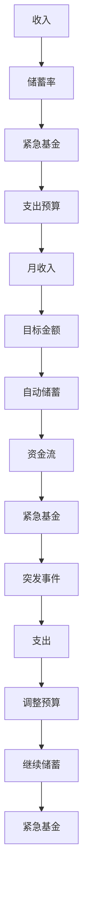

                 

# 程序员如何建立紧急基金

## 1. 背景介绍

在当今瞬息万变的技术世界里，程序员的工作充满不确定性。市场需求的快速变化、技术的快速迭代、项目的紧急截止日期等，都可能导致收入不稳定、工作环境变化等不可预见的情况。面对这些风险，建立一个紧急基金变得至关重要。紧急基金可以提供一份财务缓冲，帮助程序员在遇到突发事件时，保持生活的稳定性和连续性，减轻经济压力。

### 1.1 为什么建立紧急基金重要

1. **收入波动**：技术行业的工作往往带有一定的不稳定性。项目可能会因为市场需求变化、技术升级等而被砍掉，从而导致收入骤降。紧急基金可以提供一段时期内的收入保障，确保生活不受重大影响。
2. **健康问题**：健康问题如意外受伤、慢性病发作等可能导致收入中断。紧急基金可以支付医疗费用，减轻经济负担。
3. **生活突发事件**：如家庭紧急情况（如家庭成员重病、交通事故等）需要额外资金支持。紧急基金可以提供必要的财务支援。
4. **职业转换**：因职业发展、转行等原因需要过渡期。紧急基金可以支持这段时间的财务需求。

### 1.2 紧急基金目标

- **安全网**：建立足够的紧急基金，确保在收入中断或重大支出时，家庭能够维持基本生活水平。
- **心理安慰**：知道有足够的紧急基金作为财务缓冲，可以减轻因未来不确定性带来的心理压力。
- **灵活性**：提供财务灵活性，可以在突发事件出现时迅速调整家庭预算。

## 2. 核心概念与联系

### 2.1 核心概念概述

- **紧急基金**：用于应对突发事件、收入中断等财务不确定性的储蓄基金。
- **自动储蓄**：通过设置自动转账或定期储蓄计划，确保资金定期流入紧急基金。
- **目标金额**：紧急基金的目标金额应覆盖3至6个月的家庭生活开支。
- **储蓄率**：每月的储蓄额与月收入之比。
- **月收入**：稳定收入加上任何变动的奖金、投资收益等。
- **支出预算**：家庭基本生活开支，包括房租、水电、食品等。

这些核心概念相互关联，共同构成紧急基金建立的基础框架。理解这些概念的含义及其相互关系，有助于制定合理的紧急基金建立策略。

### 2.2 核心概念原理和架构的 Mermaid 流程图



## 3. 核心算法原理 & 具体操作步骤

### 3.1 算法原理概述

建立紧急基金的过程涉及自动储蓄和目标金额设定，以确保在需要时能够提供足够的资金支持。算法原理基于简单的储蓄和支出管理，核心在于持续储蓄和合理预算。

### 3.2 算法步骤详解

1. **计算目标金额**：根据家庭基本生活开支，计算出紧急基金的目标金额。一般建议目标金额覆盖3至6个月的家庭生活开支。
2. **设定储蓄率**：计算每月应储蓄的比例。例如，如果目标金额为6个月的家庭开支，假设月开支为X，则储蓄率应为6X/（月收入-月开支）。
3. **自动储蓄**：设置自动转账或定期储蓄计划，确保每月的储蓄金额按时转入紧急基金账户。
4. **预算调整**：定期检查紧急基金的金额，确保其保持在目标水平。如发现金额不足，应调整储蓄率或增加储蓄金额。
5. **应急支出**：在遇到突发事件时，优先使用紧急基金支付支出，避免动用其他账户资金。

### 3.3 算法优缺点

#### 优点

- **自动化**：通过自动储蓄计划，确保储蓄行为持续进行，减少了手动管理的复杂性。
- **灵活性**：设定目标金额和储蓄率，灵活应对家庭支出的变化。
- **心理安定**：知道有紧急基金作为财务缓冲，可以减少对未来不确定性的焦虑。

#### 缺点

- **初始成本高**：需要一定的初始储蓄来建立紧急基金，对一些家庭来说可能是一笔不小的开销。
- **机会成本**：紧急基金资金被固定，可能会错过一些高收益的投资机会。

### 3.4 算法应用领域

紧急基金建立的方法适用于各种职业和收入水平的家庭，特别是那些工作不稳定、生活开支较高的职业，如程序员、自由职业者等。

## 4. 数学模型和公式 & 详细讲解 & 举例说明

### 4.1 数学模型构建

设每月家庭基本生活开支为X，月收入为Y，紧急基金目标金额为F，每月储蓄率为S。则数学模型为：

$$ F = S \times (Y - X) \times \text{月数} $$

其中，月数为3至6个月。

### 4.2 公式推导过程

1. **计算月储蓄**：每月应储蓄金额为储蓄率S与月收入Y的差额乘以月数，即 $S \times (Y - X)$。
2. **目标金额**：紧急基金目标金额为每月储蓄金额乘以月数，即 $F = S \times (Y - X) \times \text{月数}$。

### 4.3 案例分析与讲解

假设小李的月收入为10000元，月开支为5000元，紧急基金目标金额为6个月的家庭开支，即30000元。储蓄率为20%，则每月应储蓄金额为：

$$ S \times (Y - X) = 0.2 \times (10000 - 5000) = 2000 \text{元} $$

根据公式计算，紧急基金目标金额为：

$$ F = 2000 \times 6 = 12000 \text{元} $$

这意味着小李需要储蓄24个月（2年），每月储蓄2000元，才能建立起足够的紧急基金。

## 5. 项目实践：代码实例和详细解释说明

### 5.1 开发环境搭建

1. **设置自动储蓄账户**：选择一个可靠、低费用的储蓄账户，绑定银行账户或信用卡。
2. **设定自动转账规则**：在银行应用程序中设定自动转账规则，每月固定金额转入紧急基金账户。
3. **使用预算管理工具**：使用如Mint、You Need A Budget等预算管理工具，帮助跟踪家庭支出和储蓄。

### 5.2 源代码详细实现

由于紧急基金建立涉及银行账户管理和自动转账设置，大部分操作都是通过银行应用程序和预算管理工具完成的，不涉及编程。但为了自动化计算紧急基金目标金额，可以使用Python编写简短的脚本，实现自动计算和提醒功能。以下是一个简化的Python代码示例：

```python
def calculate_emergency_fund(target_months, monthly_income, monthly_expenses, savings_rate):
    target_amount = savings_rate * (monthly_income - monthly_expenses) * target_months
    return target_amount

# 示例计算
target_amount = calculate_emergency_fund(6, 10000, 5000, 0.2)
print(f"紧急基金目标金额：{target_amount}")
```

### 5.3 代码解读与分析

该代码定义了一个`calculate_emergency_fund`函数，用于计算紧急基金的目标金额。函数接受目标月数、月收入、月开支和储蓄率四个参数，返回紧急基金的目标金额。通过调用该函数，可以快速计算出紧急基金的目标金额，并提供清晰的输出。

### 5.4 运行结果展示

假设小李每月收入10000元，月开支5000元，储蓄率为20%，紧急基金目标为6个月的家庭开支，则运行上述代码，输出为：

```
紧急基金目标金额：12000.0
```

这意味着小李需要储蓄24个月（2年），每月储蓄2000元，才能建立起足够的紧急基金。

## 6. 实际应用场景

### 6.1 职业不稳定

小张是一名自由职业者，项目收入不稳定，有时几个月没有收入。为了应对这种不确定性，小张设置了自动储蓄计划，每月将收入的20%自动转入紧急基金账户。通过坚持储蓄和预算管理，小张在紧急基金上积累了足够的资金，确保了生活的稳定。

### 6.2 健康问题

小李的妻子突然得了重病，需要高额的医疗费用。小李通过紧急基金支付了部分医疗费用，避免了动用其他账户的资金，减轻了经济压力。紧急基金的建立确保了小李在突发事件中能够迅速应对，减少了对家庭其他资金的依赖。

### 6.3 职业转换

小王因职业发展需要转行，转行期间收入中断。小王利用紧急基金维持了6个月的生活开支，顺利完成了转行，并在新工作中迅速恢复收入，生活不受影响。

### 6.4 未来应用展望

未来，随着技术的进步和金融科技的发展，紧急基金的建立和管理将更加便捷。区块链技术、智能合约等新兴技术有望在紧急基金管理中得到应用，提高资金管理和使用的透明度和效率。同时，自动化和智能化的财务规划工具将进一步简化紧急基金的建立和管理过程。

## 7. 工具和资源推荐

### 7.1 学习资源推荐

1. **《应急基金建设：财务自由的实用指南》**：该书详细介绍了如何建立和维护紧急基金，包括目标金额设定、储蓄策略、预算管理等。
2. **《家庭财务规划：从零开始》**：提供实用的家庭财务管理建议，帮助读者掌握家庭财务管理的核心技能。
3. **《财务管理：投资和储蓄的智慧》**：讲解财务管理的各种工具和策略，包括预算管理、储蓄计划、紧急基金建立等。

### 7.2 开发工具推荐

1. **Mint**：一个流行的预算管理工具，帮助用户跟踪支出、储蓄和管理紧急基金。
2. **You Need A Budget (YNAB)**：通过精确的预算管理，帮助用户实现财务自由。
3. **Personal Capital**：一个综合的个人财务管理工具，包括预算管理、投资规划、紧急基金建立等功能。

### 7.3 相关论文推荐

1. **《财务自由之路：从0到100万》**：介绍如何通过储蓄和投资实现财务自由。
2. **《投资智慧：实现财务独立》**：提供投资和储蓄的实用策略，帮助读者实现财务目标。
3. **《应急基金建设与财务管理》**：深入分析紧急基金的建立和管理，为读者提供全面的财务规划建议。

## 8. 总结：未来发展趋势与挑战

### 8.1 研究成果总结

本文从建立紧急基金的重要性、核心概念、算法原理、具体操作步骤等方面，详细介绍了程序员如何建立和管理紧急基金。通过系统化的方法和实际案例，帮助读者理解紧急基金的重要性，掌握建立和管理紧急基金的关键步骤。

### 8.2 未来发展趋势

1. **自动化管理**：随着技术的发展，紧急基金的建立和管理将更加自动化和智能化。智能合约、区块链等新兴技术有望提供更高效的资金管理和使用方案。
2. **个性化建议**：基于大数据和人工智能技术，提供个性化的紧急基金建立和管理建议，帮助用户实现更高效的财务规划。
3. **跨平台整合**：将紧急基金管理与多个金融平台整合，实现更便捷的资金管理和使用。

### 8.3 面临的挑战

1. **技术依赖**：自动化和智能化的紧急基金管理依赖于技术和金融工具的支持，可能存在技术故障和系统漏洞。
2. **隐私保护**：在使用技术工具进行紧急基金管理时，需要保护个人隐私和数据安全。
3. **用户习惯**：用户需要适应新的管理工具和流程，可能需要一段时间来建立新的财务管理习惯。

### 8.4 研究展望

未来，紧急基金的建立和管理将更加依赖于技术手段，但技术的进步需要用户习惯的改变和信任的建立。如何平衡技术优势与用户习惯，提供易于使用、安全可靠的紧急基金管理方案，将是研究的一个重要方向。

## 9. 附录：常见问题与解答

**Q1：我应该如何选择紧急基金的目标金额？**

A: 紧急基金的目标金额应覆盖3至6个月的家庭生活开支。如果家庭生活开支变化较大，可以适当调整目标金额。例如，如果家庭每月生活开支为5000元，可以选择建立30000元至60000元的紧急基金。

**Q2：如何确保紧急基金能够按时储蓄？**

A: 可以通过银行应用程序设置自动转账规则，每月固定金额转入紧急基金账户。同时，利用预算管理工具跟踪储蓄进度，确保储蓄计划按时执行。

**Q3：紧急基金是否应该投资？**

A: 紧急基金应保持流动性，以应对突发事件。一般来说，紧急基金不应投资于高风险、高收益的投资产品，以确保资金的安全性。

**Q4：建立紧急基金是否需要立即完成？**

A: 紧急基金的建立需要时间和耐心。建议逐步储蓄，每月固定金额转入紧急基金账户，直至达到目标金额。过快建立紧急基金可能导致财务紧张，影响生活水平。

**Q5：紧急基金是否需要定期检查？**

A: 是的。家庭生活开支和收入可能会发生变化，建议每季度或每年检查紧急基金的金额，确保其保持在目标水平。必要时，调整储蓄率和目标金额。

---

作者：禅与计算机程序设计艺术 / Zen and the Art of Computer Programming

