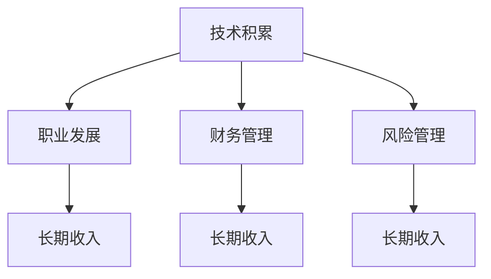

                 

## 1. 背景介绍

### 1.1 问题由来

在现代社会中，程序员的收入水平和稳定性已经成为社会关注的热点。尽管编程行业提供了较高的薪酬和良好的职业发展前景，但高强度的工作压力、快节奏的行业变化、技术更新的快速迭代，使得程序员面临的不确定性因素也随之增加。如何建立长期稳定的收入来源，成为了程序员们亟需解决的问题。

### 1.2 问题核心关键点

建立一个长期稳定的收入来源，需要考虑多方面的因素，包括但不限于：职业规划、技能提升、投资理财、风险管理等。本文将从技术、职业发展和财务管理等多个角度出发，探讨程序员如何通过多维度的努力，实现收入来源的稳定和多元化。

### 1.3 问题研究意义

对于程序员来说，建立一个长期稳定的收入来源不仅能够缓解经济压力，还能提供心理上的安全感，使其在快速变化的技术环境中更加从容应对挑战。本文的研究有助于程序员们更好地理解如何平衡技术积累、职业发展与财务规划，为实现职业生涯的长远目标提供指导。

## 2. 核心概念与联系

### 2.1 核心概念概述

为更好地理解如何建立长期稳定的收入来源，我们需要明确几个核心概念：

- **技术积累**：指通过持续学习和实践，掌握新技术、新工具、新方法的过程，是程序员提升竞争力的基础。
- **职业发展**：包括但不限于职位晋升、转岗、创业等，旨在提升职业地位和收入水平。
- **财务管理**：通过合理的收入分配、预算控制、投资理财等手段，保障收入的稳定性和增长性。
- **风险管理**：识别、评估和应对职业和财务风险，确保在面对不确定性时能够保持收入来源的稳定性。

这些概念之间的逻辑关系可以通过以下Mermaid流程图来展示：



这个流程图展示了好几个核心概念及其之间的关系：

1. 技术积累是提升职业竞争力和收入水平的基础。
2. 职业发展提供收入增长的机会，但也需要通过技术积累来实现。
3. 财务管理能够保障收入的稳定性和增长性，是实现长期收入的关键。
4. 风险管理可以帮助识别和应对潜在的风险，保证收入来源的稳定。

## 3. 核心算法原理 & 具体操作步骤

### 3.1 算法原理概述

建立长期稳定的收入来源，本质上是一个复杂的多目标优化问题。其核心思想是通过多方面的努力，实现职业竞争力的提升、收入的增长和风险的控制，最终达到收入来源的稳定和多元化。

形式化地，假设程序员的目标为最大化长期收入 $L$，可以通过以下数学模型来表达：

$$
\max_{x_1, x_2, x_3} L = f(x_1, x_2, x_3) 
$$

其中 $x_1$ 表示技术积累的程度，$x_2$ 表示职业发展的路径，$x_3$ 表示财务管理的策略。目标函数 $f$ 综合了技术积累、职业发展和财务管理的效果。

### 3.2 算法步骤详解

基于上述模型，建立长期稳定的收入来源可以按照以下步骤进行：

**Step 1: 技术积累**

- **持续学习**：通过在线课程、技术博客、专业书籍等渠道，持续学习新技术和新知识，保持技术领先。
- **实践项目**：参与开源项目、企业项目等实际编程工作，积累项目经验，提升编程技能。
- **技术社区**：活跃在技术社区，如GitHub、Stack Overflow等，交流学习，分享经验，结识同行。

**Step 2: 职业发展**

- **技能提升**：根据市场需求和自身兴趣，有针对性地提升某类技能，如全栈开发、数据科学、机器学习等。
- **职位晋升**：通过在当前岗位上做出突出贡献，争取晋升机会或转向更高薪酬的岗位。
- **创业探索**：利用技术积累和职业经验，尝试创业，开发新产品或服务，实现收入来源多元化。

**Step 3: 财务管理**

- **收入分配**：合理安排个人收入，留出一部分用于投资理财，保障财务安全。
- **预算控制**：制定月度或年度预算，控制非必要开支，避免财务风险。
- **投资理财**：通过股票、基金、房产等形式进行投资，增加收入来源，分散风险。

**Step 4: 风险管理**

- **识别风险**：定期评估自身职业和财务状态，识别潜在风险，如职业变动风险、投资市场波动等。
- **风险评估**：对识别出的风险进行量化评估，确定其对收入的影响程度。
- **风险应对**：制定应对策略，如多元化投资、保持现金流、购买保险等，以缓解风险。

### 3.3 算法优缺点

建立一个长期稳定的收入来源的算法，具有以下优点：

1. **综合性强**：通过多方面的努力，实现了职业和财务的全面提升。
2. **风险控制**：通过风险管理，降低了收入来源的不确定性，保障了收入的稳定性。
3. **可持续发展**：通过技术积累和持续学习，使得收入来源具备持续增长潜力。

同时，该方法也存在一定的局限性：

1. **需要大量投入**：技术积累、职业发展和财务管理需要时间和资源投入，短期内可能见效有限。
2. **灵活性不足**：一旦选定职业方向或投资策略，改变路径可能需要较高的成本。
3. **风险不可控**：尽管有风险管理机制，但外部环境变化和不可预见事件仍可能对收入来源造成影响。

尽管存在这些局限性，但通过合理的规划和管理，该算法仍然能够帮助程序员建立长期稳定的收入来源。

### 3.4 算法应用领域

基于上述算法，程序员可以将其应用于多个领域，如软件开发、数据科学、技术创业等，具体如下：

- **软件开发**：通过技术积累和持续学习，提高编程技能，争取晋升机会，参与企业项目，获得更高的薪酬。
- **数据科学**：掌握数据分析和机器学习技能，进入数据驱动型岗位，如数据科学家、AI工程师等，获取高收入和高职位。
- **技术创业**：利用技术积累和职业经验，开发新技术或新产品，创业成功实现收入来源多元化。

此外，该算法还适用于多种规模的企业和机构，如大型科技公司、初创企业、公共部门等，为员工提供职业发展和管理建议，帮助其建立长期稳定的收入来源。

## 4. 数学模型和公式 & 详细讲解 & 举例说明

### 4.1 数学模型构建

建立一个长期稳定的收入来源，可以通过以下数学模型进行建模：

$$
\max_{x_1, x_2, x_3} L = f(x_1, x_2, x_3)
$$

其中，$x_1$ 表示技术积累的程度，$x_2$ 表示职业发展的路径，$x_3$ 表示财务管理的策略。目标函数 $f$ 是一个综合函数，反映了技术积累、职业发展和财务管理对长期收入的影响。

### 4.2 公式推导过程

以技术积累、职业发展和财务管理为例，我们可以分别建立模型，然后综合考虑其对长期收入的影响。

**技术积累模型**：假设学习时间和投入资金为 $x_1$，则学习效果 $E_1$ 可以表示为：

$$
E_1 = \alpha_1 \times x_1
$$

其中 $\alpha_1$ 为学习效果系数，与学习时间和投入资金相关。

**职业发展模型**：假设职业发展路径为 $x_2$，职业晋升带来的收入增长为 $E_2$，则职业发展效果 $E_2$ 可以表示为：

$$
E_2 = \alpha_2 \times x_2
$$

其中 $\alpha_2$ 为职业发展效果系数，与职业晋升路径和晋升机会相关。

**财务管理模型**：假设财务管理策略为 $x_3$，财务收益为 $E_3$，则财务管理效果 $E_3$ 可以表示为：

$$
E_3 = \alpha_3 \times x_3
$$

其中 $\alpha_3$ 为财务管理效果系数，与投资策略、理财水平和市场条件相关。

综合以上模型，我们可以得到长期收入的模型：

$$
L = f(x_1, x_2, x_3) = E_1 + E_2 + E_3
$$

### 4.3 案例分析与讲解

假设一名程序员 $P$ 的初始状态为 $(x_1^0, x_2^0, x_3^0)$，其目标为最大化长期收入 $L$。在经过一定时间的努力后，$P$ 的技术积累、职业发展和财务管理分别达到了 $(x_1^t, x_2^t, x_3^t)$，此时长期收入 $L$ 可以表示为：

$$
L(t) = f(x_1^t, x_2^t, x_3^t)
$$

通过对比 $L(t)$ 和 $L(t-1)$，可以评估 $P$ 的进步和收入变化。

## 5. 项目实践：代码实例和详细解释说明

### 5.1 开发环境搭建

在建立长期稳定的收入来源的过程中，开发环境的搭建至关重要。以下是使用Python进行财务管理的开发环境配置流程：

1. 安装Anaconda：从官网下载并安装Anaconda，用于创建独立的Python环境。

2. 创建并激活虚拟环境：
```bash
conda create -n finance-env python=3.8 
conda activate finance-env
```

3. 安装必要的Python库：
```bash
conda install pandas numpy matplotlib scikit-learn jupyter notebook ipython
```

4. 安装财务软件包：
```bash
pip install financepy
```

完成上述步骤后，即可在`finance-env`环境中进行财务管理实践。

### 5.2 源代码详细实现

下面以股票投资为例，给出使用Pandas库进行财务管理的PyTorch代码实现。

```python
import pandas as pd
import numpy as np
import matplotlib.pyplot as plt

# 假设股票价格数据
prices = pd.DataFrame({'Date': pd.date_range(start='2023-01-01', end='2023-12-31', freq='D'),
                      'Price': np.random.uniform(100, 120, size=365)})

# 计算年化收益率
def calculate_annual_return(price):
    return ((price[-1] / price[0]) ** (365 / len(price)) - 1) * 100

# 计算年化收益率
annual_return = calculate_annual_return(prices['Price'])
print(f'年化收益率为: {annual_return:.2f}%')

# 绘制股票价格走势图
plt.plot(prices['Date'], prices['Price'])
plt.title('股票价格走势图')
plt.xlabel('日期')
plt.ylabel('价格')
plt.show()
```

### 5.3 代码解读与分析

让我们再详细解读一下关键代码的实现细节：

**Pandas库**：
- `pd.DataFrame`：用于创建二维表格数据结构。
- `pd.date_range`：生成日期序列。
- `np.random.uniform`：生成随机价格数据。

**计算年化收益率**：
- `calculate_annual_return`函数：计算股票价格的时间加权收益率。

**绘制股票价格走势图**：
- `plt.plot`：绘制折线图。
- `plt.title`：设置图表标题。
- `plt.xlabel`和`plt.ylabel`：设置X轴和Y轴标签。

以上代码展示了如何使用Pandas库进行基本的股票价格分析，通过统计年化收益率，评估投资收益，并通过可视化图表展示股票价格走势。

## 6. 实际应用场景

### 6.1 职业发展与收入提升

在职业发展的过程中，程序员可以通过不断提升技术积累和争取职业晋升机会，实现收入的提升。例如：

- **技术积累**：参加在线课程、技术会议、开源项目等，不断学习新技术和新知识。
- **职业晋升**：通过在现有岗位上表现出色，争取更多的项目负责、团队领导等职责，获得更高的薪酬和福利。
- **职位转岗**：根据市场需求和个人兴趣，尝试转岗到高薪酬或高成长性的岗位，如数据科学家、AI工程师等。

### 6.2 多元化收入来源

为了减少单一收入来源的风险，程序员需要探索多元化的收入途径。例如：

- **编程兼职**：利用业余时间从事软件开发、技术咨询等兼职工作，增加收入来源。
- **写作投稿**：通过技术博客、技术书籍等形式，分享经验和技术见解，获取稿费和读者资助。
- **投资理财**：进行股票、基金、房产等投资，通过多元化投资分散风险，增加收入来源。

### 6.3 风险管理

在职业和财务规划过程中，风险管理同样重要。例如：

- **职业规划**：定期评估自身职业状态，识别职业变动的风险，制定应对策略。
- **财务规划**：建立应急基金，购买保险，分散财务风险。
- **市场分析**：关注市场趋势和政策变化，及时调整投资策略，避免市场波动对财务造成重大影响。

## 7. 工具和资源推荐

### 7.1 学习资源推荐

为了帮助程序员掌握建立长期稳定收入来源的技能，以下是一些优质的学习资源：

1. Coursera《金融市场分析》课程：由耶鲁大学等名校开设，系统讲解金融市场的基本概念和分析方法。
2. Udacity《Python金融编程》课程：深入介绍Python在金融分析中的应用，涵盖股票、债券、衍生品等。
3. 《Python投资理财实战》书籍：系统讲解如何使用Python进行股票、基金等投资理财，涵盖技术分析和量化投资。
4. 《程序员如何理财》系列博客：提供实用的财务规划和管理建议，适合技术出身的读者。
5. Weights & Biases：模型训练的实验跟踪工具，记录和可视化投资理财过程中的各项指标。

通过这些资源的学习，程序员可以系统掌握财务管理和风险控制的技巧，为建立长期稳定的收入来源奠定坚实基础。

### 7.2 开发工具推荐

高效的开发离不开优秀的工具支持。以下是几款用于财务管理的常用工具：

1. Python：适合金融数据分析和编程，功能强大且易于上手。
2. Excel：强大的电子表格工具，适用于财务报表和投资分析。
3. Stock Analysis：Python股票分析库，提供丰富的技术分析和基本面分析工具。
4. QuantConnect：一个平台，用于进行量化交易和投资策略的开发和测试。
5. GitHub：托管代码和分享经验，方便协作和知识共享。

合理利用这些工具，可以显著提升财务管理和投资理财的效率，加速收入来源的建立和优化。

### 7.3 相关论文推荐

程序员建立长期稳定收入来源的研究源于学界的持续研究。以下是几篇奠基性的相关论文，推荐阅读：

1. 《金融市场分析》：介绍了金融市场的基本原理和分析方法，是金融学习者的必备教材。
2. 《Python金融编程》：讲解了如何使用Python进行金融数据分析，涵盖了股票、债券、衍生品等。
3. 《Python投资理财实战》：提供了系统的投资理财技巧和实战案例，适合技术出身的读者。
4. 《程序员如何理财》：从技术角度出发，讲解如何高效管理和规划个人财务。

这些论文代表了财务管理和投资理财的前沿进展，程序员可以通过学习这些前沿成果，掌握最新的财务规划和投资理财技巧。

## 8. 总结：未来发展趋势与挑战

### 8.1 总结

本文对程序员如何建立长期稳定的收入来源进行了全面系统的介绍。首先，从技术积累、职业发展和财务管理等多个角度，探讨了建立长期稳定收入来源的综合性策略。其次，通过数学建模和具体案例，详细讲解了每个步骤的实现方法。最后，结合实际应用场景和工具推荐，为程序员提供了系统化的指导。

通过本文的系统梳理，可以看到，建立长期稳定的收入来源需要程序员在技术、职业和财务等多个方面进行全面规划和努力。只有通过持续学习和技能提升，积极探索职业和财务的多元化，才能在快速变化的技术环境中保持收入的稳定和增长。

### 8.2 未来发展趋势

展望未来，建立长期稳定的收入来源将呈现以下几个发展趋势：

1. **技术积累的重要性**：技术是职业发展和财务规划的基础，持续学习和实践新技术，将使程序员在职场上具备更强的竞争力。
2. **职业路径的多元化**：随着职业市场的多元化，程序员可以选择更多的职业路径，如技术创业、项目管理、产品开发等，实现收入来源的多元化。
3. **财务管理的智能化**：利用人工智能和大数据分析，进行更精准的财务管理和投资决策，提升理财效率和收益。
4. **风险管理的数字化**：通过数字化手段，实时监控和评估职业和财务风险，及时调整策略，增强收入来源的稳定性。

这些趋势将推动程序员在技术、职业和财务规划方面不断创新，实现收入来源的长期稳定和可持续增长。

### 8.3 面临的挑战

尽管建立长期稳定的收入来源的策略相对成熟，但在实施过程中仍面临诸多挑战：

1. **时间和精力投入**：技术积累、职业发展和财务管理都需要大量的时间和精力投入，短期内可能见效有限。
2. **市场不确定性**：职业市场和投资市场存在不确定性，需要程序员具备较强的风险意识和应变能力。
3. **知识和技能更新**：技术更新速度快，需要程序员不断学习新知识，保持技术领先。
4. **职业转型的难度**：职业转型可能面临技能不足、人脉缺失等问题，需要程序员有较强的适应能力和学习能力。

尽管存在这些挑战，但通过合理的规划和管理，程序员仍可以通过不断的学习和实践，克服困难，实现收入来源的长期稳定。

### 8.4 研究展望

面向未来，建立长期稳定的收入来源的研究需要在以下几个方面进行深入探索：

1. **职业发展路径优化**：通过大数据分析，识别高薪、高成长性职业路径，提供更有针对性的职业发展建议。
2. **投资理财智能化**：结合人工智能和大数据分析，进行更精准的投资理财决策，提升理财效率和收益。
3. **风险管理数字化**：开发智能化的风险管理工具，实时监控和评估职业和财务风险，及时调整策略。
4. **技术积累自动化**：利用自动化工具和AI辅助技术，加速技术学习和实践，提高技术积累的效率。

这些研究方向的探索，将进一步推动程序员建立长期稳定的收入来源，为技术行业的发展注入新的动力。

## 9. 附录：常见问题与解答

**Q1: 如何平衡技术积累和职业发展？**

A: 技术积累和职业发展并不矛盾，而是相辅相成的。在职业发展过程中，不断学习新技术和新知识，提升自身技术能力，有助于争取更高薪酬和职业晋升机会。同时，职业晋升和岗位变化也能提供更多的实践机会，促进技术积累。建议程序员制定平衡的职业规划，在兼顾技术提升和职业发展的同时，实现收入的提升。

**Q2: 如何选择适合自己的投资理财方式？**

A: 投资理财方式的选择需要考虑个人风险承受能力、财务状况和市场环境。一般来说，可以先进行财务规划，确定紧急基金和应急基金，再根据自身风险偏好选择合适的投资品种。例如，保守型投资者可以选择债券、货币基金等低风险投资，而进取型投资者则可以选择股票、期权等高风险高收益的投资。建议结合自身情况，咨询专业理财顾问，选择适合自己的投资理财方式。

**Q3: 如何应对职业变动的风险？**

A: 职业变动的风险可以通过以下方法应对：
1. 多元化技能：通过持续学习和实践，掌握多种技术技能，提升自身竞争力，减少对单一职业的依赖。
2. 职业规划：定期评估职业状态，识别职业变动的风险，制定应对策略，如寻找备选职业路径、建立人脉资源等。
3. 风险准备：建立应急基金，购买保险，分散财务风险，保障职业变动期间的收入来源。

**Q4: 如何提高投资理财的效率和收益？**

A: 提高投资理财效率和收益的方法包括：
1. 学习金融知识：通过阅读书籍、参加课程等方式，掌握基本的金融分析和投资技巧。
2. 利用工具：使用金融软件和平台，如Excel、Stock Analysis、QuantConnect等，进行投资理财和市场分析。
3. 分散投资：通过多元化投资，分散风险，提高收益。
4. 长期持有：长期持有股票和基金，享受复利效应，降低交易成本。

这些方法能够帮助程序员在投资理财中取得更好的效果，实现收入来源的稳定和增长。

---

作者：禅与计算机程序设计艺术 / Zen and the Art of Computer Programming

