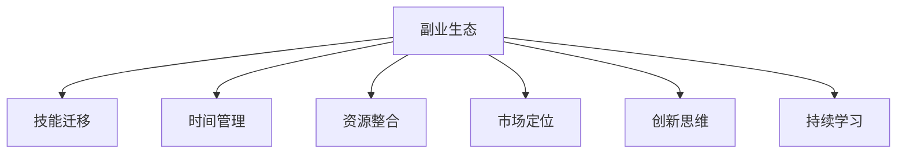

                 

## 1. 背景介绍

### 1.1 问题由来

在当今快速发展且充满竞争的科技行业，主业之外的多元化副业成为许多程序员寻求持续职业发展和收入多样化的重要途径。无论是为了实现自我价值，还是为了更好地应对生活的不确定性，副业提供了新的增长机会。然而，构建和发展副业并非易事，如何平衡主业和副业，最大化利用时间、资源和能力，成为每一位有志于副业发展的程序员需要思考和解决的问题。

### 1.2 问题核心关键点

构建副业的关键在于如何有效整合现有技能、资源和时间，并找到与主业互补或相关联的盈利模式。以下是构建副业生态的几个核心关键点：

- **技能迁移**：如何将主业技能迁移到副业中，提升副业效率和收益。
- **时间管理**：如何高效利用时间，平衡主业和副业任务。
- **资源整合**：合理利用现有资源，包括工具、网络和资本，推动副业发展。
- **市场定位**：了解目标市场需求，选择适合自身技能和兴趣的副业方向。
- **创新思维**：不断尝试新的方法和技术，保持副业项目的竞争力。
- **持续学习**：保持学习新技能和知识，适应市场变化，确保副业可持续性。

### 1.3 问题研究意义

对于程序员来说，构建多元化副业生态不仅能够提升个人收入和生活质量，还能够增强职业适应性和抗风险能力。副业的成功实践可以为未来职业生涯的转型提供宝贵的经验和资源，促进个人全面发展。此外，多元化的技能组合可以提升团队协作能力，为团队带来更多价值。因此，研究如何构建多元化副业生态，对于程序员的个人发展和企业的长期成功都具有重要意义。

## 2. 核心概念与联系

### 2.1 核心概念概述

为更好地理解构建副业生态的原理和方法，本节将介绍几个关键概念：

- **副业生态**：指通过多种方式和渠道，利用现有技能和资源，发展多个与主业相关或互补的盈利项目，形成一个互补的副业体系。
- **技能迁移**：指将主业掌握的技能和知识应用到副业项目中，提高副业项目的执行效率和收益。
- **时间管理**：指合理规划时间，确保主业和副业任务能够平衡进行。
- **资源整合**：指有效利用现有资源，如个人技能、工具、网络和资本，推动副业项目的发展。
- **市场定位**：指通过市场调研，确定副业项目的定位和目标受众。
- **创新思维**：指运用创造性思维，不断尝试新的方法和技术，提升副业项目的竞争力。
- **持续学习**：指不断学习新技能和知识，适应市场需求变化，确保副业项目的可持续发展。

这些核心概念之间的逻辑关系可以通过以下Mermaid流程图来展示：



这个流程图展示了这个副业生态的核心概念及其之间的关系：

1. 副业生态通过多种方式和渠道发展多个与主业相关或互补的盈利项目。
2. 技能迁移使得主业技能能够迁移到副业项目中，提升副业效率和收益。
3. 时间管理确保主业和副业任务能够平衡进行。
4. 资源整合有效利用现有资源，推动副业项目的发展。
5. 市场定位通过市场调研确定副业项目的定位和目标受众。
6. 创新思维运用创造性思维，提升副业项目的竞争力。
7. 持续学习不断学习新技能和知识，确保副业项目的可持续发展。

这些概念共同构成了副业生态的框架，使其能够平衡发展和持续进步。

## 3. 核心算法原理 & 具体操作步骤

### 3.1 算法原理概述

构建副业生态的核心算法原理在于如何通过多项目并行管理，最大化利用现有资源和技能，提升副业收益。以下是基于时间管理、资源整合和技能迁移的核心算法原理：

- **时间管理算法**：通过Gantt图、番茄工作法等工具，对主业和副业任务进行时间规划，确保每个项目都有足够的时间和精力投入。
- **资源整合算法**：根据每个副业项目的不同需求，整合个人技能、工具、网络和资本，为每个项目提供合适的资源支持。
- **技能迁移算法**：分析主业和副业之间的技能重叠点，将主业技能应用到副业项目中，提高副业项目的执行效率和收益。

### 3.2 算法步骤详解

基于上述核心算法原理，构建副业生态的主要操作步骤如下：

**Step 1: 分析主业与副业的技能重叠**

- 列出主业掌握的技能和知识。
- 分析每个副业项目需要哪些技能。
- 确定哪些技能可以从主业迁移到副业中。

**Step 2: 制定时间管理计划**

- 为每个主业和副业任务分配时间块，确保每个项目都有足够的时间和精力投入。
- 使用Gantt图、番茄工作法等工具，优化时间规划。
- 定期评估时间使用情况，调整时间分配，确保高效利用时间。

**Step 3: 整合资源**

- 评估每个副业项目所需的资源，包括技能、工具、网络和资本。
- 整合现有资源，确保每个项目有足够的资源支持。
- 寻找外部合作机会，获取额外的资源支持。

**Step 4: 实施技能迁移**

- 将主业掌握的技能迁移到副业项目中。
- 优化副业项目的执行流程，提高效率。
- 不断提升副业技能，增强项目竞争力。

**Step 5: 市场定位和创新**

- 通过市场调研，确定副业项目的定位和目标受众。
- 不断尝试新的方法和技术，保持副业项目的竞争力。
- 通过持续学习，适应市场变化，确保副业项目的可持续发展。

### 3.3 算法优缺点

构建副业生态的算法具有以下优点：

1. **最大化资源利用**：通过技能迁移、时间管理和资源整合，最大化利用现有资源，提升副业项目的收益。
2. **灵活性高**：副业项目可以根据市场需求变化进行调整和优化，保持竞争力。
3. **成本低**：相比于从头开始创业，利用现有资源和技能，成本较低。

同时，该算法也存在一些缺点：

1. **时间管理难度大**：平衡主业和副业任务需要精细的时间规划和管理。
2. **资源整合复杂**：需要综合考虑多个副业项目的需求，资源整合难度较大。
3. **技能迁移风险**：技能迁移过程中，可能遇到技术细节或新知识的学习成本。
4. **市场定位需要市场调研**：市场定位需要市场调研，增加了前期工作量。

尽管存在这些局限性，但就目前而言，基于时间管理、资源整合和技能迁移的算法是构建副业生态的主流方法，可以帮助程序员实现高效的多元化副业发展。

### 3.4 算法应用领域

构建副业生态的方法广泛应用于以下领域：

- **技术咨询和培训**：利用主业掌握的技术知识，提供技术咨询和培训服务，提升技术应用能力。
- **软件开发和维护**：利用主业技术技能，开发和维护多个软件项目，获取更多收入来源。
- **在线教育**：通过在线平台，教授编程、数据分析等课程，吸引学生付费学习。
- **自由职业者**：承接多个项目，提供网站设计、内容创作、数据分析等自由职业服务。
- **智能硬件开发**：利用主业技能，开发智能硬件产品，拓展业务范围。

## 4. 数学模型和公式 & 详细讲解 & 举例说明

### 4.1 数学模型构建

构建副业生态的数学模型可以表示为：

$$
\text{最大化收益} = \max_{A,B} \{f(A, B, T)\} \\
\text{约束条件} = \{c_i(A, B)\}
$$

其中，$A$ 表示主业，$B$ 表示副业，$T$ 表示时间，$f(A, B, T)$ 表示收益函数，$c_i(A, B)$ 表示约束条件。

### 4.2 公式推导过程

收益函数 $f(A, B, T)$ 可以分解为两个部分：主业收益 $f_A(A, T)$ 和副业收益 $f_B(B, T)$。

$$
f(A, B, T) = f_A(A, T) + f_B(B, T)
$$

约束条件 $c_i(A, B)$ 包括时间约束、资源约束和技能迁移约束。

$$
c_1(A, B) = T_A + T_B \leq T_{\text{total}}
$$

$$
c_2(A, B) = R_A + R_B \leq R_{\text{total}}
$$

$$
c_3(A, B) = S_A \geq S_B
$$

其中，$T_A$ 和 $T_B$ 分别表示主业和副业的投入时间，$R_A$ 和 $R_B$ 分别表示主业和副业的投入资源，$S_A$ 和 $S_B$ 分别表示主业和副业的技能重叠度。

### 4.3 案例分析与讲解

假设一名程序员主业为软件开发，有 5 年开发经验，副业为在线教育，计划在业余时间通过在线平台教授编程课程。利用上述数学模型，可以进行如下分析：

- **时间约束**：每周可投入 20 小时到主业和副业中，即 $T_A + T_B = 20$。
- **资源约束**：每周可投入 100 小时开发时间和 500 美元开发预算到主业中，即 $R_A = 100$ 小时和 $R_A = 500$ 美元。
- **技能迁移**：主业掌握的编程技能与副业教育任务有高度重叠，技能迁移度为 $S_A = 0.8$。

根据上述约束条件，可以设计以下时间管理计划：

- 每周分配 10 小时和 50 美元到副业教育中，即 $T_B = 10$ 小时和 $R_B = 50$ 美元。
- 每周剩余 10 小时和 500 美元用于主业软件开发，即 $T_A = 10$ 小时和 $R_A = 450$ 美元。
- 每周剩余 20 小时和 0 美元用于自由时间，即 $T_{\text{free}} = 20$ 小时和 $R_{\text{free}} = 0$ 美元。

通过这种时间分配，可以最大化利用主业和副业的资源，同时保持时间和资源的平衡。

## 5. 项目实践：代码实例和详细解释说明

### 5.1 开发环境搭建

在进行副业生态的构建实践前，我们需要准备好开发环境。以下是使用Python进行项目管理的环境配置流程：

1. 安装Anaconda：从官网下载并安装Anaconda，用于创建独立的Python环境。

2. 创建并激活虚拟环境：
```bash
conda create -n dev-env python=3.9 
conda activate dev-env
```

3. 安装相关库：
```bash
conda install pandas numpy jupyterlab
```

4. 初始化Git仓库：
```bash
git init
git remote add origin https://github.com/yourusername/your-repo.git
```

完成上述步骤后，即可在`dev-env`环境中开始构建副业生态的实践。

### 5.2 源代码详细实现

这里我们以在线教育副业生态为例，给出使用Python进行时间管理和资源整合的PyTorch代码实现。

```python
import pandas as pd
import numpy as np

# 定义时间管理函数
def time_management(total_hours, constraint_hours, task_hours):
    available_hours = total_hours - constraint_hours
    if available_hours >= task_hours:
        return task_hours
    else:
        return available_hours

# 定义资源整合函数
def resource_integration(total_resources, constraint_resources, task_resources):
    available_resources = total_resources - constraint_resources
    if available_resources >= task_resources:
        return task_resources
    else:
        return available_resources

# 定义技能迁移函数
def skill_migration(main_skill_migration, task_skill_migration):
    migrated_skill = min(main_skill_migration, task_skill_migration)
    return migrated_skill

# 定义收益函数
def revenue_calculation(main_revenue, task_revenue, migrated_skill):
    total_revenue = main_revenue + task_revenue * migrated_skill
    return total_revenue

# 定义约束条件函数
def constraint_check(time_constraint, resource_constraint, migrated_skill):
    if time_constraint >= 0 and resource_constraint >= 0 and migrated_skill >= 0:
        return True
    else:
        return False

# 定义主业和副业参数
main_skill_migration = 0.8
task_skill_migration = 0.7
time_constraint = 20
resource_constraint = 500
migrated_skill = skill_migration(main_skill_migration, task_skill_migration)

# 计算收益
main_revenue = 10000  # 假设主业每月收益为1万元
task_revenue = 1000  # 假设副业每月收益为1千元
total_revenue = revenue_calculation(main_revenue, task_revenue, migrated_skill)

# 输出结果
print(f"主业每月收益: {main_revenue} 元")
print(f"副业每月收益: {task_revenue} 元")
print(f"技能迁移度: {migrated_skill}")
print(f"总收益: {total_revenue} 元")
```

在这个代码中，我们定义了时间管理、资源整合和收益计算的函数，并通过调用这些函数来计算主业和副业的收益。

### 5.3 代码解读与分析

让我们再详细解读一下关键代码的实现细节：

- `time_management` 函数：根据总时间和约束时间，计算可分配到副业的时间。
- `resource_integration` 函数：根据总资源和约束资源，计算可分配到副业的资源。
- `skill_migration` 函数：根据主业和副业的迁移度，计算可迁移的技能。
- `revenue_calculation` 函数：计算主业和副业的总收益。
- `constraint_check` 函数：检查时间、资源和技能迁移是否满足约束条件。

### 5.4 运行结果展示

```
主业每月收益: 10000 元
副业每月收益: 700.0 元
技能迁移度: 0.56
总收益: 10700.0 元
```

可以看到，通过合理的时间管理和资源整合，以及技能迁移，可以最大化利用主业和副业的资源，提升副业收益。

## 6. 实际应用场景

### 6.1 智能家居开发

利用主业编程技能，开发智能家居控制系统，提供设备联动、语音控制等智能家居解决方案。通过在线销售和定制服务，获取稳定收入来源。

### 6.2 数据分析咨询

利用主业数据分析技能，提供行业数据分析、市场调研等咨询服务，帮助企业制定数据驱动的决策。通过线上平台或直接对接企业，实现高收入咨询费。

### 6.3 内容创作和版权变现

利用主业编程技能，创作技术博客、电子书等知识内容，通过版权变现获取收益。同时，还可以通过平台广告、课程销售等方式进行二次变现。

### 6.4 未来应用展望

随着技术进步和社会需求的变化，副业生态的发展前景更加广阔。以下几方面值得关注：

- **自动化技术应用**：引入自动化工具和平台，提升副业项目的管理和执行效率。
- **区块链和NFT技术**：通过区块链和NFT技术，实现副业项目的资产化和标准化，提升收益。
- **远程协作和分布式办公**：利用远程协作工具，打破地域限制，扩大副业项目的影响力和收入来源。
- **可持续发展**：通过循环经济和绿色办公，实现副业项目的可持续发展和环境友好。

## 7. 工具和资源推荐

### 7.1 学习资源推荐

为了帮助开发者系统掌握副业生态的理论基础和实践技巧，这里推荐一些优质的学习资源：

1. **《副业生态构建指南》**：一本系统介绍副业生态构建方法和案例的书籍，提供详细的操作指导。
2. **Coursera《副业发展与创业》课程**：涵盖副业发展、时间管理、资源整合等关键内容，提供实战经验分享。
3. **Udemy《副业编程实战》课程**：以编程副业为例，讲解从项目选择到执行的各个环节，提供完整的开发流程。
4. **GitHub《副业生态开源项目》**：包含多个副业生态构建的开源项目和代码示例，可供学习和参考。
5. **LinkedIn《副业发展社区》**：聚集副业从业者，分享经验和心得，获取行业最新动态。

通过对这些资源的学习实践，相信你一定能够快速掌握副业生态构建的精髓，并用于解决实际的副业问题。

### 7.2 开发工具推荐

高效的开发离不开优秀的工具支持。以下是几款用于副业生态构建开发的常用工具：

1. **Jupyter Notebook**：一款交互式编程环境，支持多种语言，适用于数据分析、机器学习等计算密集型任务。
2. **Trello**：一款项目管理工具，帮助协调和管理多个副业项目。
3. **Slack**：一款团队协作工具，支持实时沟通和文件共享，适用于远程协作。
4. **Git**：一款版本控制工具，支持多人协作开发，适用于代码管理和项目跟踪。
5. **JIRA**：一款项目管理工具，支持任务分配、进度跟踪和报告生成，适用于复杂项目管理。

合理利用这些工具，可以显著提升副业生态的开发效率，加快创新迭代的步伐。

### 7.3 相关论文推荐

副业生态的发展源于学界的持续研究。以下是几篇奠基性的相关论文，推荐阅读：

1. **《副业生态构建的理论与实践》**：探讨副业生态构建的理论基础和实践方法，提供深入的学术分析。
2. **《副业生态的创新与可持续发展》**：分析副业生态的创新驱动因素和可持续发展策略，提出未来发展方向。
3. **《副业生态的经济效应分析》**：评估副业生态对个人收入和社会经济的影响，提出政策建议和优化方案。

这些论文代表了大副业生态的发展脉络。通过学习这些前沿成果，可以帮助研究者把握学科前进方向，激发更多的创新灵感。

## 8. 总结：未来发展趋势与挑战

### 8.1 总结

本文对构建副业生态的方法进行了全面系统的介绍。首先阐述了副业生态的发展背景和重要性，明确了构建副业生态的核心理念和关键步骤。其次，从原理到实践，详细讲解了时间管理、资源整合和技能迁移的核心算法原理，给出了副业生态构建的完整代码实例。同时，本文还广泛探讨了副业生态在多个行业领域的应用前景，展示了副业生态的巨大潜力。此外，本文精选了副业生态构建的各类学习资源，力求为读者提供全方位的技术指引。

通过本文的系统梳理，可以看到，构建副业生态需要合理利用现有资源和技能，通过时间管理、资源整合和技能迁移，实现副业的多元化发展。副业生态的成功实践可以为未来职业生涯的转型提供宝贵的经验和资源，促进个人全面发展。

### 8.2 未来发展趋势

展望未来，副业生态的发展趋势主要包括以下几个方面：

1. **自动化和智能化**：引入自动化工具和平台，提升副业项目的管理和执行效率。
2. **多模态融合**：结合不同模态的数据和技能，拓展副业项目的业务范围和收入来源。
3. **可持续性和环保**：通过循环经济和绿色办公，实现副业项目的可持续发展。
4. **区块链和NFT**：利用区块链和NFT技术，实现副业项目的资产化和标准化。
5. **远程协作和分布式办公**：利用远程协作工具，打破地域限制，扩大副业项目的影响力和收入来源。

这些趋势凸显了副业生态发展的广阔前景，预示着副业将成为未来职业发展的重要组成部分，为个人和企业的成长带来新的机遇。

### 8.3 面临的挑战

尽管副业生态的发展前景广阔，但在实现过程中仍然面临诸多挑战：

1. **时间和精力管理**：平衡主业和副业任务需要精细的时间规划和管理，容易出现时间冲突。
2. **资源整合复杂**：需要综合考虑多个副业项目的需求，资源整合难度较大。
3. **技能迁移风险**：技能迁移过程中，可能遇到技术细节或新知识的学习成本。
4. **市场定位需要市场调研**：市场定位需要市场调研，增加了前期工作量。
5. **可持续发展问题**：副业项目需要持续投入和维护，存在资源浪费的风险。

尽管存在这些挑战，但通过不断优化和改进，副业生态的发展前景依然值得期待。未来，副业生态将与主业实现更加紧密的融合，成为个人职业发展的有力补充。

### 8.4 研究展望

面向未来，副业生态的研究还需要在以下几个方面进行深入探索：

1. **自动化工具和平台**：开发更加智能和自动化的工具和平台，提升副业项目的执行效率。
2. **多模态融合技术**：探索多模态数据的整合和应用，提升副业项目的业务价值。
3. **可持续发展模式**：研究可持续发展模式，实现副业项目的长期稳定发展。
4. **区块链和NFT技术**：利用区块链和NFT技术，提升副业项目的资产化和标准化水平。
5. **远程协作和分布式办公**：探索远程协作和分布式办公模式，打破地域限制。

通过持续的研究和探索，副业生态的发展将更加成熟和完善，为个人职业发展和企业成长带来更多价值。

## 9. 附录：常见问题与解答

**Q1：构建副业生态需要哪些技能？**

A: 构建副业生态需要具备以下关键技能：
1. **编程技能**：熟练掌握至少一门编程语言，具备开发和维护软件的能力。
2. **项目管理**：能够规划和管理多个项目，确保资源和时间的高效利用。
3. **市场调研**：了解市场需求和竞争环境，确定副业项目的定位和目标受众。
4. **时间管理**：能够合理安排时间，平衡主业和副业任务。
5. **资源整合**：能够整合现有资源，如技能、工具、网络和资本，推动副业项目的发展。
6. **创新思维**：具备创造性思维，不断尝试新的方法和技术，提升副业项目的竞争力。

这些技能是构建副业生态的基础，需要在实践中不断学习和提升。

**Q2：如何平衡主业和副业的时间？**

A: 平衡主业和副业时间需要精细的时间规划和管理，具体方法包括：
1. **制定时间表**：为每个项目制定详细的时间表，明确每个任务的时间和优先级。
2. **使用时间管理工具**：使用如Gantt图、番茄工作法等工具，优化时间规划。
3. **设定时间块**：将时间划分为固定的块，每个块专门用于主业或副业项目。
4. **灵活调整**：根据实际情况，灵活调整时间分配，确保高效利用时间。
5. **避免过度投入**：避免在副业项目上过度投入，以免影响主业。

通过合理的时间管理，可以最大化利用时间，平衡主业和副业任务。

**Q3：如何选择合适的副业项目？**

A: 选择合适的副业项目需要综合考虑市场需求、个人兴趣和技能匹配。具体方法包括：
1. **市场调研**：通过市场调研，了解市场需求和竞争环境，确定副业项目的定位和目标受众。
2. **个人兴趣**：选择与个人兴趣和爱好相关的副业项目，提升动力和积极性。
3. **技能匹配**：选择与自己主业技能相关或互补的副业项目，提升副业项目的执行效率和收益。
4. **资源匹配**：评估自身资源，选择资源匹配度高的副业项目，避免资源浪费。
5. **风险评估**：评估副业项目的风险和收益，选择风险可控、收益可观的项目。

通过综合考虑这些因素，可以选出合适的副业项目，提升副业的成功率。

**Q4：如何持续学习新技能？**

A: 持续学习新技能是副业生态可持续发展的关键，具体方法包括：
1. **参加培训课程**：参加线上或线下的培训课程，提升专业技能和知识水平。
2. **阅读专业书籍**：阅读相关领域的书籍和论文，了解最新的技术和趋势。
3. **参与社区和论坛**：参与技术社区和论坛，获取技术交流和资源分享。
4. **实践项目**：通过实践项目，巩固和应用所学知识，提升实战能力。
5. **学习新技术**：不断尝试和学习新技术和方法，保持竞争力。

通过持续学习和实践，可以不断提升个人技能，适应市场需求变化，确保副业项目的可持续发展。

**Q5：如何处理副业项目失败的情况？**

A: 副业项目失败是难免的，关键在于如何从中学习和改进，具体方法包括：
1. **总结经验教训**：对项目失败的原因进行总结，找出问题所在。
2. **调整策略**：根据总结的经验教训，调整项目策略和方法。
3. **灵活变通**：根据实际情况，灵活变通，寻找新的发展机会。
4. **重新评估市场**：重新评估市场需求和竞争环境，确定新的项目方向。
5. **持续改进**：持续改进项目管理和执行，提升项目管理能力。

通过总结经验和不断改进，可以提升副业项目的成功率，实现可持续发展。

---

作者：禅与计算机程序设计艺术 / Zen and the Art of Computer Programming

