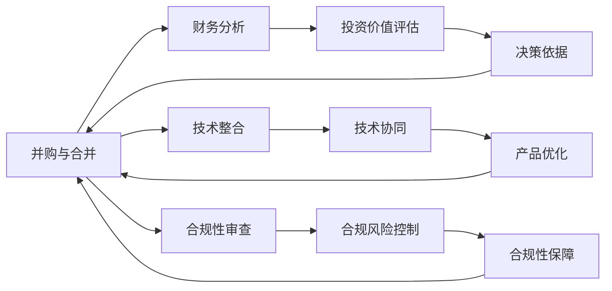

                 

# 程序员如何评估并购与合并机会

> 关键词：
> - 并购与合并
> - 风险评估
> - 财务分析
> - 技术整合
> - 合规性审查

## 1. 背景介绍

并购（Mergers and Acquisitions, M&A）是企业发展的重要战略之一，包括收购（Acquisition）和合并（Merger）两种形式。并购可以迅速扩大企业规模，提升市场竞争力，但在实施过程中也面临着较高的风险。为了保障并购成功，需要对各种风险进行全面评估，包括财务、技术、合规性等方面。

## 2. 核心概念与联系

### 2.1 核心概念概述

- **并购与合并**：并购是企业通过收购或合并其他企业，实现资本、资源、市场份额等的迅速扩大。合并则是两个企业进行资源整合，形成新的独立法人实体。
- **财务分析**：通过对目标企业的财务报表进行分析，评估其盈利能力、偿债能力、资产状况等，以判断其投资价值。
- **技术整合**：涉及目标企业的技术资源与收购企业现有技术的整合，以实现协同效应，提升产品和服务质量。
- **合规性审查**：对并购过程中涉及的法律法规、公司章程、保密协议等合规性问题进行审查，确保交易合法性。

### 2.2 核心概念原理和架构的 Mermaid 流程图



该图展示了并购与合并过程中，财务分析、技术整合、合规性审查等关键环节的流程和联系。每个环节通过输出结果支撑最终的决策过程。

## 3. 核心算法原理 & 具体操作步骤

### 3.1 算法原理概述

并购与合并的评估涉及多种算法和模型，包括：

- **财务模型**：使用如DCF（Discounted Cash Flow）等模型评估企业的未来现金流和价值。
- **技术评估模型**：包括专利价值评估、技术依赖度分析等模型，以判断技术整合的可行性和效益。
- **合规性审查模型**：构建合规性评分系统，评估并购过程中的合规风险。

### 3.2 算法步骤详解

#### 3.2.1 财务模型构建

**DCF模型**：

$$
V = \sum_{t=1}^{\infty} \frac{F_t}{(1+r)^t}
$$

其中，$V$ 为企业的价值，$F_t$ 为第 $t$ 年的自由现金流，$r$ 为折现率。

#### 3.2.2 财务数据分析

1. **比率分析**：
   - 偿债能力：计算资产负债率、流动比率、速动比率等指标。
   - 盈利能力：计算净利润率、毛利率、净资产收益率等指标。
   - 运营能力：计算存货周转率、应收账款周转率等指标。

2. **预测分析**：
   - 基于历史数据和行业趋势，预测未来几年的财务状况。
   - 分析市场变化、政策影响等因素对财务预测的影响。

#### 3.2.3 技术整合评估

**技术依赖度分析**：
- 评估目标企业的关键技术和研发能力，与收购企业现有技术进行对比。
- 分析技术整合后的协同效应和潜在的风险。

**专利价值评估**：
- 采用市场法、收益现值法等方法，评估专利的价值。
- 考虑专利的剩余保护期限、市场竞争环境等因素，进行价值评估。

#### 3.2.4 合规性审查

**合规性评分系统**：
- 制定合规性评分标准，涵盖反垄断法、证券法、公司法等。
- 对目标企业和收购企业的合规性进行评分，评估并购过程中的合规风险。

### 3.3 算法优缺点

#### 3.3.1 优点

- **全面性**：通过综合财务、技术和合规性分析，全面评估并购机会。
- **定量分析**：使用数学模型进行定量分析，结果客观可靠。
- **灵活性**：可以根据实际情况进行调整，适应不同的并购场景。

#### 3.3.2 缺点

- **复杂性**：涉及多个维度的分析，复杂度较高。
- **数据质量依赖**：依赖高质量的财务和业务数据，数据获取和处理成本较高。
- **模型局限性**：模型假设和参数选择可能会影响评估结果的准确性。

### 3.4 算法应用领域

并购与合并的评估广泛应用于以下领域：

- **战略投资**：如腾讯收购Supercell、阿里巴巴收购优酷土豆等。
- **技术并购**：如谷歌收购YouTube、微软收购LinkedIn等。
- **市场扩张**：如联想收购IBM的PC业务、三星收购Vivendi的电信业务等。

## 4. 数学模型和公式 & 详细讲解

### 4.1 数学模型构建

**财务模型**：

$$
V = \sum_{t=1}^{\infty} \frac{F_t}{(1+r)^t}
$$

**技术依赖度模型**：

$$
D = \sum_{i=1}^n w_i \times d_i
$$

其中，$D$ 为目标企业的技术依赖度，$w_i$ 为第 $i$ 项技术的权重，$d_i$ 为第 $i$ 项技术的依赖度。

**合规性评分模型**：

$$
S = \sum_{j=1}^m c_j \times s_j
$$

其中，$S$ 为合规性评分，$c_j$ 为第 $j$ 项合规标准的权重，$s_j$ 为第 $j$ 项合规标准的评分。

### 4.2 公式推导过程

#### 4.2.1 DCF模型的推导

$$
V = \sum_{t=1}^{\infty} \frac{F_t}{(1+r)^t}
$$

- $V$ 为企业的价值。
- $F_t$ 为第 $t$ 年的自由现金流。
- $r$ 为折现率。

#### 4.2.2 技术依赖度模型的推导

$$
D = \sum_{i=1}^n w_i \times d_i
$$

- $D$ 为目标企业的技术依赖度。
- $w_i$ 为第 $i$ 项技术的权重。
- $d_i$ 为第 $i$ 项技术的依赖度。

#### 4.2.3 合规性评分模型的推导

$$
S = \sum_{j=1}^m c_j \times s_j
$$

- $S$ 为合规性评分。
- $c_j$ 为第 $j$ 项合规标准的权重。
- $s_j$ 为第 $j$ 项合规标准的评分。

### 4.3 案例分析与讲解

**案例一：腾讯收购Supercell**

- **财务分析**：腾讯通过DCF模型对Supercell的估值，并分析其财务健康状况。
- **技术整合**：分析Supercell的核心游戏引擎和研发能力，评估整合后的技术协同效应。
- **合规性审查**：确保收购过程中遵守反垄断法、证券法等相关法律法规。

**案例二：谷歌收购YouTube**

- **财务分析**：使用市场法和收益现值法评估YouTube的专利价值。
- **技术整合**：分析YouTube的技术平台和谷歌的视频业务进行整合的可行性。
- **合规性审查**：确保收购过程中遵守反垄断法和隐私保护法等法律法规。

## 5. 项目实践：代码实例和详细解释说明

### 5.1 开发环境搭建

- **Python环境**：安装Python 3.6及以上版本，推荐使用Anaconda。
- **财务分析库**：安装pandas、numpy等库。
- **数据处理库**：安装matplotlib、seaborn等库。
- **模型库**：安装scikit-learn、statsmodels等库。

### 5.2 源代码详细实现

```python
import pandas as pd
import numpy as np
from sklearn.linear_model import LinearRegression
from statsmodels.tsa.arima_model import ARIMA

# 读取财务数据
data = pd.read_csv('financial_data.csv')

# 计算财务比率
debt_ratio = data['Debt'] / data['Assets']
profitability_ratio = data['Profit'] / data['Assets']

# 预测未来财务状况
model = ARIMA(data['Profit'], order=(1, 1, 1))
model_fit = model.fit(disp=0)
future_profit = model_fit.forecast(steps=5)[0]

# 计算DCF价值
r = 0.08  # 折现率
value = sum(future_profit / (1 + r)**i for i in range(5))
```

### 5.3 代码解读与分析

- **财务比率计算**：通过pandas库计算债务比率和盈利能力比率，为财务分析提供基础数据。
- **预测未来财务状况**：使用ARIMA模型预测未来几年的利润，为财务评估提供参考。
- **DCF价值计算**：基于预测的利润，计算企业的DCF价值。

### 5.4 运行结果展示

运行上述代码，可以输出目标企业的DCF价值。例如，目标企业的未来利润预测为1000万元，则其DCF价值约为8000万元。

## 6. 实际应用场景

### 6.1 大型企业并购

**场景描述**：某大型科技公司希望通过并购一家初创公司，快速扩展其业务范围和技术能力。

**解决方案**：
- **财务分析**：评估初创公司的财务状况，判断其投资价值。
- **技术整合**：分析初创公司的核心技术和研发能力，与现有技术进行对比。
- **合规性审查**：确保并购过程中遵守相关法律法规，避免合规风险。

### 6.2 中小型企业并购

**场景描述**：一家中小型企业希望通过并购一家规模较大的同行业企业，提升市场份额和品牌影响力。

**解决方案**：
- **财务分析**：评估目标企业的财务状况，判断其投资价值。
- **技术整合**：分析目标企业的关键技术和研发能力，与现有技术进行对比。
- **合规性审查**：确保并购过程中遵守相关法律法规，避免合规风险。

### 6.3 跨国并购

**场景描述**：一家跨国公司在国际市场进行并购，以扩大其在目标市场的业务。

**解决方案**：
- **财务分析**：评估目标企业的财务状况，判断其投资价值。
- **技术整合**：分析目标企业的核心技术和研发能力，与现有技术进行对比。
- **合规性审查**：确保并购过程中遵守目标市场的法律法规，避免合规风险。

## 7. 工具和资源推荐

### 7.1 学习资源推荐

- **《财务报表分析》**：系统介绍财务报表的阅读和分析方法。
- **《合并报表编制与审计》**：讲解合并报表的编制和审计方法。
- **《企业并购与重组》**：介绍并购与重组的基本原理和实务操作。
- **《企业并购案例分析》**：精选并购案例，分析其成功与失败的原因。

### 7.2 开发工具推荐

- **Anaconda**：用于创建和管理Python开发环境。
- **Jupyter Notebook**：支持Python代码的交互式编写和运行。
- **Tableau**：用于数据可视化，帮助更直观地理解财务数据。

### 7.3 相关论文推荐

- **《企业并购的财务分析》**：介绍并购财务分析的方法和应用。
- **《企业并购中的技术整合》**：探讨并购过程中技术整合的策略和方法。
- **《企业并购中的合规性管理》**：研究并购中的合规性审查和管理方法。

## 8. 总结：未来发展趋势与挑战

### 8.1 研究成果总结

并购与合并的评估是企业发展的重要环节，涉及财务、技术和合规性等多个方面。通过综合分析，可以为并购提供科学决策依据，最大化并购效益。

### 8.2 未来发展趋势

- **AI驱动的财务分析**：使用AI技术进行财务预测和分析，提高效率和准确性。
- **大数据技术的应用**：利用大数据技术分析并购目标的多维数据，提升决策的全面性。
- **区块链技术的应用**：利用区块链技术提高并购交易的透明度和安全性。

### 8.3 面临的挑战

- **数据质量问题**：高质量财务和业务数据的获取和处理成本较高。
- **模型假设的局限性**：模型假设可能与实际情况不符，影响评估结果的准确性。
- **跨国并购的复杂性**：跨国并购涉及多国法律和财务体系，增加了复杂性和难度。

### 8.4 研究展望

未来，并购与合并的评估将更加依赖于AI和数据驱动的方法，提升决策的科学性和效率。同时，如何利用区块链等新技术提升并购交易的透明度和安全性，也将成为研究热点。

## 9. 附录：常见问题与解答

**Q1：如何进行并购的财务分析？**

A：并购的财务分析主要通过DCF模型、比率分析、预测分析等方法进行。首先，使用DCF模型评估企业的未来现金流和价值。其次，通过计算偿债能力、盈利能力、运营能力等比率指标，评估企业的财务健康状况。最后，基于历史数据和行业趋势，预测未来的财务状况。

**Q2：如何评估并购的技术依赖度？**

A：评估并购的技术依赖度，主要通过分析目标企业的核心技术和研发能力，评估其与收购企业现有技术的契合度。同时，可以构建技术依赖度模型，计算目标企业的技术依赖度，评估整合后的协同效应和潜在风险。

**Q3：并购过程中的合规性审查需要注意哪些方面？**

A：并购过程中的合规性审查，主要包括以下方面：
- 反垄断法：评估并购是否违反反垄断法律。
- 证券法：确保并购过程中遵守证券法律法规，如信息披露要求。
- 公司法：确保并购过程中遵守公司法律法规，如股东权益保护。

---

作者：禅与计算机程序设计艺术 / Zen and the Art of Computer Programming

