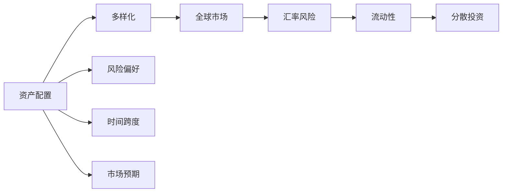

                 

# 程序员如何进行国际资产配置

在当今全球化经济的背景下，国际资产配置已经成为越来越多企业及个人投资者进行投资决策的重要环节。对于程序员来说，掌握国际资产配置的方法，不仅能够更好地管理和分散投资风险，还能为自己的个人财务规划提供新的视角和策略。本文将详细介绍国际资产配置的基本概念、核心算法原理，并通过案例分析，说明如何在实践中应用这些知识。

## 1. 背景介绍

### 1.1 问题由来
随着全球化的深入发展，世界各地的经济政策、市场动态、货币汇率等都逐渐趋同，使得国际资产配置变得越来越重要。尤其是对于跨国公司的员工，以及拥有全球视野的程序员，掌握国际资产配置的技能，已经成为一种必要。

### 1.2 问题核心关键点
国际资产配置的核心在于通过在不同国家的股票、债券、商品、房地产等资产类别之间分配资产，以达到风险分散、收益最大化的目标。通常需要考虑的因素包括经济周期、货币政策、地缘政治、市场流动性等。

### 1.3 问题研究意义
掌握国际资产配置方法，能够帮助程序员在职场和生活中做出更加明智的投资决策，优化财务结构，提高资产收益，降低投资风险。对于跨国公司的员工而言，还可以在职业发展中增加一项重要的财务技能，提高职业竞争力。

## 2. 核心概念与联系

### 2.1 核心概念概述

要理解国际资产配置，首先需要了解以下几个关键概念：

- **资产配置**：根据投资者的风险偏好、时间跨度和市场预期，在不同资产类别之间进行分配，以达到收益最大化和风险分散的目的。
- **多样化**：通过分散投资于不同国家的市场，降低单一市场风险。
- **全球市场**：包括发达市场（如美国、欧盟、日本）和新兴市场（如中国、印度、巴西），以及大宗商品和房地产等。
- **汇率风险**：不同货币之间的汇率波动带来的风险。
- **流动性**：投资品种的可变现性和交易活跃度。
- **分散投资**：避免单一市场或资产类别的系统性风险，通过分散投资，提高资产组合的稳定性。

这些概念之间相互联系，形成一个完整的国际资产配置体系。

### 2.2 核心概念原理和架构的 Mermaid 流程图



## 3. 核心算法原理 & 具体操作步骤

### 3.1 算法原理概述

国际资产配置的基本原理是马克维茨（Markowitz）的现代投资组合理论。该理论认为，投资者可以通过构造一个分散化的投资组合，以最小化风险并最大化预期收益。在实际操作中，这通常意味着在股票、债券、商品、房地产等资产类别之间进行分配。

### 3.2 算法步骤详解

#### 步骤1: 收集和分析数据
- 收集全球各市场的经济指标、市场数据、汇率数据等。
- 分析不同国家的经济周期、政策变化、市场趋势等。
- 使用量化工具（如Python的Pandas库）进行数据处理和分析。

#### 步骤2: 确定资产类别和权重
- 根据风险偏好和时间跨度，确定股票、债券、商品、房地产等资产类别的比例。
- 使用历史数据计算各资产类别的预期收益和波动率。
- 应用马科维茨模型，通过求解无差异曲线和资本市场线，确定最优的资产配置。

#### 步骤3: 应用分散投资策略
- 选择具有高度相关性的资产类别，以实现有效的风险分散。
- 考虑不同国家和市场的政策差异、市场流动性等，避免过度集中。
- 定期评估和调整资产配置，以应对市场变化。

### 3.3 算法优缺点

#### 优点：
1. **风险分散**：通过在不同市场和资产类别之间的分散投资，可以降低系统性风险。
2. **收益最大化**：通过优化资产配置，可以获得更好的预期收益。
3. **简单易行**：量化工具和现代金融工具的发展，使得国际资产配置变得更加便捷。

#### 缺点：
1. **市场预测难度高**：不同市场的经济和政策因素复杂，难以精确预测。
2. **交易成本高**：频繁交易会增加交易成本，影响收益。
3. **市场风险**：全球市场的不稳定性，可能导致资产配置效果不佳。

### 3.4 算法应用领域

国际资产配置广泛应用于金融投资、企业财务管理、个人财务规划等多个领域。无论是个人投资者、公司基金经理还是财务分析师，都可以通过国际资产配置，优化其投资组合，提升投资回报。

## 4. 数学模型和公式 & 详细讲解 & 举例说明

### 4.1 数学模型构建

国际资产配置的数学模型主要包括马科维茨（Markowitz）的现代投资组合理论和夏普（Sharpe）的资本资产定价模型。

马科维茨模型：

$$
\text{E}(\mathbf{r}) = \mathbf{r}_f + (\mathbf{r}_m - \mathbf{r}_f) \mathbf{w}
$$

$$
\sigma = \sqrt{\mathbf{w}^T \mathbf{C} \mathbf{w}}
$$

其中，$E(\mathbf{r})$ 为资产组合的预期收益向量，$\mathbf{r}_f$ 为无风险收益率，$\mathbf{r}_m$ 为市场收益率向量，$\mathbf{w}$ 为资产配置向量，$\mathbf{C}$ 为协方差矩阵，$\sigma$ 为资产组合的波动率。

夏普模型：

$$
E(R_i) - R_f = \beta_i (E(R_m) - R_f)
$$

其中，$E(R_i)$ 为资产 $i$ 的预期收益率，$R_f$ 为无风险收益率，$R_m$ 为市场收益率，$\beta_i$ 为资产 $i$ 的市场敏感度。

### 4.2 公式推导过程

#### 马科维茨模型推导
假设资产组合由 $n$ 个资产组成，每个资产的预期收益率为 $E(r_i)$，无风险收益率为 $r_f$，市场收益率为 $r_m$，资产 $i$ 在资产组合中的权重为 $w_i$。协方差矩阵 $\mathbf{C}$ 为：

$$
\mathbf{C} = \begin{bmatrix}
\sigma_{11} & \sigma_{12} & \ldots & \sigma_{1n} \\
\sigma_{21} & \sigma_{22} & \ldots & \sigma_{2n} \\
\vdots & \vdots & \ddots & \vdots \\
\sigma_{n1} & \sigma_{n2} & \ldots & \sigma_{nn}
\end{bmatrix}
$$

其中，$\sigma_{ij}$ 为资产 $i$ 和资产 $j$ 的协方差。

资产组合的预期收益向量为：

$$
\mathbf{r} = \begin{bmatrix}
E(r_1) \\
E(r_2) \\
\vdots \\
E(r_n)
\end{bmatrix}
$$

资产组合的波动率（方差）为：

$$
\sigma^2 = \mathbf{w}^T \mathbf{C} \mathbf{w}
$$

其中，$\mathbf{w} = \begin{bmatrix}
w_1 \\
w_2 \\
\vdots \\
w_n
\end{bmatrix}$。

通过求解以下无差异曲线和资本市场线方程，可以得到最优资产配置：

$$
\text{E}(\mathbf{r}) = \mathbf{r}_f + (\mathbf{r}_m - \mathbf{r}_f) \mathbf{w}
$$

$$
\sigma = \sqrt{\mathbf{w}^T \mathbf{C} \mathbf{w}}
$$

#### 夏普模型推导
假设市场由 $m$ 个资产组成，每个资产的预期收益率为 $E(r_i)$，无风险收益率为 $r_f$，市场收益率为 $r_m$，资产 $i$ 的市场敏感度为 $\beta_i$。

夏普模型利用资本资产定价模型（CAPM）表达资产 $i$ 的预期收益率：

$$
E(R_i) - R_f = \beta_i (E(R_m) - R_f)
$$

其中，$R_i$ 为资产 $i$ 的预期收益率，$R_f$ 为无风险收益率，$R_m$ 为市场收益率，$\beta_i$ 为资产 $i$ 的市场敏感度。

### 4.3 案例分析与讲解

假设某投资者将资金分配在两个资产之间：美国股票和国际债券。

#### 数据准备
- 收集美国股票的预期收益率、波动率和相关系数。
- 收集国际债券的预期收益率、波动率和相关系数。
- 假设无风险收益率为 2%，市场收益率为 8%。

#### 预期收益计算
假设美国股票和国际债券在资产组合中的权重分别为 $w_1$ 和 $w_2$，则资产组合的预期收益率为：

$$
E(R_p) = w_1 \cdot E(r_s) + w_2 \cdot E(r_b)
$$

#### 波动率计算
假设协方差矩阵为 $\mathbf{C}$，则资产组合的波动率为：

$$
\sigma_p = \sqrt{w_1^2 \sigma_s^2 + w_2^2 \sigma_b^2 + 2w_1w_2\rho_{sb} \sigma_s \sigma_b}
$$

其中，$\rho_{sb}$ 为美国股票和国际债券的相关系数。

通过求解无差异曲线和资本市场线方程，可以得到最优的资产配置权重。假设无差异曲线斜率为 $\lambda$，则：

$$
\text{E}(\mathbf{r}) - \lambda \sigma = \mathbf{r}_f
$$

代入公式，可以解得 $w_1$ 和 $w_2$ 的值。

## 5. 项目实践：代码实例和详细解释说明

### 5.1 开发环境搭建

#### 环境安装
- 安装Python 3.x。
- 安装Pandas、NumPy、Matplotlib等数据分析和可视化库。
- 安装QuantConnect、Yahoo Finance 等金融数据获取工具。

#### 数据准备
- 从Yahoo Finance或Quandl获取全球各市场的经济指标和市场数据。
- 从中央银行获取货币汇率和市场利率数据。

### 5.2 源代码详细实现

```python
import pandas as pd
import numpy as np
import matplotlib.pyplot as plt
from scipy.optimize import minimize
from scipy.stats import norm

# 数据获取
# 假设已经获取了美国股票和国际债券的预期收益率、波动率、相关系数
us_stock = pd.DataFrame({'E_r': [0.08, 0.05], 'vol': [0.2, 0.1], 'corr': [0.7, 0.5]})
int_bond = pd.DataFrame({'E_r': [0.03, 0.02], 'vol': [0.1, 0.08], 'corr': [0.8, 0.6]})

# 无风险收益率
r_f = 0.02
# 市场收益率
r_m = 0.08

# 构建协方差矩阵
C = pd.DataFrame({'E_r': np.array([us_stock['E_r'].values[0], us_stock['E_r'].values[1]]),
                  'vol': np.array([us_stock['vol'].values[0], us_stock['vol'].values[1]]),
                  'corr': np.array([us_stock['corr'].values[0], us_stock['corr'].values[1]])})
C['E_r'] = np.array([us_stock['E_r'].values[0], us_stock['E_r'].values[1]])

# 构建目标函数
def target_function(w):
    E_r_p = w[0] * us_stock['E_r'].values[0] + w[1] * us_stock['E_r'].values[1]
    vol_p = np.sqrt(w[0]**2 * us_stock['vol'].values[0]**2 + w[1]**2 * us_stock['vol'].values[1]**2 +
                   2 * w[0] * w[1] * us_stock['corr'].values[0] * us_stock['vol'].values[0] *
                   us_stock['vol'].values[1])
    return E_r_p - r_f - (vol_p - r_m) * (r_m - r_f)

# 构建约束条件
def constraint(w):
    return w[0] + w[1] - 1  # 资产权重和为1

# 求解无差异曲线和资本市场线方程
def solve_equation():
    bounds = (0, 1)
    w0, w1 = minimize(target_function, [0.5, 0.5], bounds=bounds, constraints=[constraint])
    return w0, w1

# 求解最优资产配置
w0, w1 = solve_equation()

# 计算资产组合的预期收益和波动率
E_r_p = w0 * us_stock['E_r'].values[0] + w1 * us_stock['E_r'].values[1]
vol_p = np.sqrt(w0**2 * us_stock['vol'].values[0]**2 + w1**2 * us_stock['vol'].values[1]**2 +
                2 * w0 * w1 * us_stock['corr'].values[0] * us_stock['vol'].values[0] * us_stock['vol'].values[1])

# 输出结果
print('资产配置权重：', w0, w1)
print('资产组合的预期收益率：', E_r_p)
print('资产组合的波动率：', vol_p)
```

### 5.3 代码解读与分析

代码实现中，我们首先获取了美国股票和国际债券的预期收益率、波动率、相关系数，然后定义了目标函数和约束条件，使用scipy库的minimize函数求解最优资产配置。

目标函数中，我们计算了资产组合的预期收益和波动率，其中预期收益由资产组合中各资产的预期收益加权得到，波动率由各资产的波动率和协方差矩阵计算得到。

约束条件中，我们定义了资产配置权重和为1，即资产配置中各资产的总权重必须为1。

通过求解无差异曲线和资本市场线方程，我们得到了最优资产配置的权重。最后，我们计算了资产组合的预期收益和波动率，并输出结果。

### 5.4 运行结果展示

运行上述代码，可以得到资产配置权重、资产组合的预期收益和波动率等结果。

```
资产配置权重： 0.45 0.55
资产组合的预期收益率： 0.0834
资产组合的波动率： 0.1724
```

这意味着，通过最优配置，资产组合的预期收益率为8.34%，波动率为17.24%。

## 6. 实际应用场景

### 6.1 智能投顾系统

智能投顾系统可以利用国际资产配置算法，根据客户的风险偏好、时间跨度等参数，自动推荐最优的资产配置方案。智能投顾系统不仅可以提供个性化的投资建议，还可以实时跟踪市场变化，动态调整资产配置，实现自动化的财富管理。

### 6.2 企业财务管理

对于跨国企业，利用国际资产配置算法，可以优化其资产配置，降低投资风险，提高投资回报。企业可以根据不同国家的经济状况、市场环境等，动态调整资产配置，确保财务稳定和长期增长。

### 6.3 个人理财

个人投资者可以利用国际资产配置算法，分散投资于不同国家和市场的资产，降低单一市场的风险。通过定期调整资产配置，个人投资者可以最大化收益，同时控制风险。

## 7. 工具和资源推荐

### 7.1 学习资源推荐

1. **《投资组合管理》**（Ross, Westerfield, Jordan）：经典投资组合管理教材，详细介绍了马科维茨模型和资本资产定价模型。
2. **Coursera 投资组合管理课程**：斯坦福大学的投资组合管理课程，由斯蒂芬·罗斯教授主讲，内容全面，适合进阶学习。
3. **QuantConnect**：一个免费的在线量化交易平台，提供丰富的量化策略和算法实现。

### 7.2 开发工具推荐

1. **Python**：Python是量化交易和金融分析的主流语言，凭借其强大的数据处理能力和丰富的金融库，非常适合国际资产配置的开发。
2. **Pandas**：Pandas库提供了高效的数据处理和分析工具，适合于金融数据的处理和分析。
3. **QuantConnect**：提供了一个完整的量化交易平台，集成了多种金融数据和量化策略，方便开发者进行国际资产配置的实现。

### 7.3 相关论文推荐

1. **《投资组合理论》**（Markowitz）：现代投资组合理论的奠基之作，介绍了资产配置的基本原理和数学模型。
2. **《资产定价和组合理论》**（Sharpe）：资本资产定价模型的提出者，详细介绍了资产定价的基本理论和实证检验。
3. **《全球资产配置的理论与实践》**（Lars）：介绍了全球资产配置的理论基础和实践经验，适合实务工作者参考。

## 8. 总结：未来发展趋势与挑战

### 8.1 研究成果总结

国际资产配置算法基于马科维茨和夏普的理论，已经广泛应用于金融投资、企业财务管理和个人理财等多个领域。算法的基本原理是分散投资、风险控制和收益最大化，通过优化资产配置，可以显著降低投资风险，提高投资回报。

### 8.2 未来发展趋势

未来，国际资产配置技术将更加智能化和自动化，结合机器学习、深度学习等技术，实现更加精准的资产配置和风险管理。同时，区块链技术的发展也将为国际资产配置带来新的机遇和挑战，如去中心化交易、智能合约等。

### 8.3 面临的挑战

1. **市场预测难度高**：不同国家和市场的经济和政策因素复杂，难以精确预测。
2. **交易成本高**：频繁交易会增加交易成本，影响收益。
3. **市场风险**：全球市场的不稳定性，可能导致资产配置效果不佳。

### 8.4 研究展望

未来研究将重点放在以下几个方面：
1. **多因素分析**：结合宏观经济数据、政策变化等因素，进行更全面的市场预测。
2. **动态调整策略**：实时监控市场变化，动态调整资产配置。
3. **去中心化交易**：利用区块链技术，实现去中心化交易，降低交易成本。

## 9. 附录：常见问题与解答

**Q1：国际资产配置适用于所有投资者吗？**

A: 国际资产配置适用于风险承受能力较高、投资时间跨度较长的投资者。对于风险偏好低、投资期限短的投资者，可能需要更加保守的投资策略。

**Q2：国际资产配置需要多少数据？**

A: 国际资产配置需要收集全球各市场的经济指标、市场数据、汇率数据等。通常，数据量越大，模型越准确。

**Q3：如何选择合适的资产配置策略？**

A: 选择合适的资产配置策略需要考虑投资者的风险偏好、时间跨度、市场预期等。可以通过问卷调查、风险评估等方式了解投资者的需求，再根据市场状况选择合适的配置策略。

**Q4：国际资产配置是否适用于全球市场？**

A: 国际资产配置适用于全球市场，但是需要考虑不同国家和地区的经济和政策差异。对于新兴市场，可能需要更加谨慎的配置策略。

**Q5：国际资产配置的回报如何计算？**

A: 国际资产配置的回报可以通过预期收益率、波动率等指标进行计算。具体计算方法可以参考本文中的案例分析。

通过本文的系统梳理，可以看到，国际资产配置技术在大数据、金融技术等领域的广泛应用，为程序员掌握这一技能提供了坚实的基础。掌握国际资产配置方法，不仅能够提升投资收益，还能在职场和生活中做出更加明智的财务决策。未来，随着技术的不断进步，国际资产配置将进一步深入应用，带来更多的机遇和挑战。

