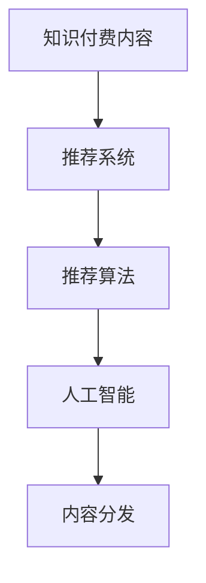

                 

# 程序员如何进行知识付费的内容分发

> 关键词：知识付费,内容分发,人工智能,推荐系统,推荐算法,内容生成

## 1. 背景介绍

在数字化时代，知识付费日益成为互联网行业的新趋势。程序员作为技术创新的主力军，如何高效、精准地分发知识付费内容，让更多人获得价值，成为了一个重要课题。本博客将从程序员的角度出发，系统梳理知识付费的内容分发策略，探讨如何利用人工智能技术和推荐算法，实现高效的内容推荐与分发。

## 2. 核心概念与联系

### 2.1 核心概念概述

在深入分析之前，我们先明确几个核心概念及其相互关系：

- **知识付费**：用户为获取有价值的知识内容而支付费用。内容形式多样，包括文章、视频、在线课程、技术讲座等。
- **内容分发**：将知识内容从创作者传递给用户的全过程，包括获取、传输、展示和反馈等环节。
- **推荐系统**：利用算法分析用户行为和偏好，为每个用户推荐个性化的内容。推荐系统是知识付费内容分发的核心。
- **推荐算法**：算法是推荐系统的核心，包括协同过滤、基于内容的推荐、深度学习推荐等。
- **人工智能**：推荐系统中的核心技术，包括自然语言处理(NLP)、图像处理、序列模型等。

这些概念之间存在紧密的联系：内容分发依赖于推荐系统，推荐系统依赖于推荐算法，推荐算法依赖于人工智能技术。因此，了解这些概念及其相互关系，有助于我们构建高效的内容分发机制。

### 2.2 核心概念原理和架构的 Mermaid 流程图



以上流程图示意图明了地展示了知识付费内容分发各个环节之间的关系。

## 3. 核心算法原理 & 具体操作步骤
### 3.1 算法原理概述

推荐系统的工作原理可以概括为以下几步：

1. **数据收集**：收集用户行为数据，如点击、浏览、购买等。
2. **特征工程**：将用户行为数据转化为模型可以处理的特征。
3. **模型训练**：利用推荐算法训练模型，预测用户对每个内容的评分或点击概率。
4. **内容推荐**：根据预测结果，推荐用户最可能感兴趣的内容。

其中，数据收集和特征工程是基础，模型训练和内容推荐是核心。推荐算法的选择直接影响到分发的效果。

### 3.2 算法步骤详解

**Step 1: 数据收集**

- **点击数据**：记录用户在网站或应用上的点击行为。
- **浏览数据**：记录用户的浏览记录，包括页面停留时间、滚动深度等。
- **购买数据**：记录用户的购买记录，包括购买的课程、文章、视频等。
- **评分数据**：记录用户对内容的评分，用于反馈模型。

**Step 2: 特征工程**

- **用户特征**：用户ID、历史行为、活跃度等。
- **内容特征**：标题、标签、摘要、时长等。
- **上下文特征**：时间、设备、地理位置等。

**Step 3: 模型训练**

- **协同过滤**：利用用户-物品交互矩阵，找到相似用户或物品。
- **基于内容的推荐**：根据内容的特征相似度进行推荐。
- **深度学习推荐**：使用神经网络模型，如CNN、RNN、Transformer等，学习用户和内容的深层次关系。

**Step 4: 内容推荐**

- **排序**：根据预测结果对内容进行排序。
- **分页**：将推荐结果分页展示。
- **个性化**：根据用户画像进行个性化推荐。

### 3.3 算法优缺点

**优点**：
- **高效率**：推荐系统可以自动化地进行内容分发，提高分发效率。
- **精准性**：通过算法分析，可以实现更精准的内容推荐。
- **可扩展性**：推荐系统可以处理大规模数据，具有较好的可扩展性。

**缺点**：
- **冷启动问题**：新用户或新内容缺乏足够数据，难以准确推荐。
- **数据隐私**：推荐系统需要收集大量用户数据，存在隐私风险。
- **算法公平性**：推荐算法可能存在偏见，影响推荐公平性。

### 3.4 算法应用领域

推荐系统已经被广泛应用于电子商务、社交网络、视频平台等多个领域。在知识付费领域，推荐系统同样有着广泛的应用：

- **课程推荐**：根据用户历史学习记录推荐相关课程。
- **文章推荐**：根据用户浏览历史推荐相关文章。
- **视频推荐**：根据用户观看历史推荐相关视频。

推荐系统在知识付费内容分发中起着至关重要的作用，通过精准推荐，可以显著提升用户满意度和平台收益。

## 4. 数学模型和公式 & 详细讲解 & 举例说明

### 4.1 数学模型构建

推荐系统通常基于以下模型：

**协同过滤模型**：
- 用户-物品评分矩阵：$R_{ui}$
- 用户-物品相似度矩阵：$P_{ui}$

协同过滤模型的目标是最小化均方误差：
$$
\min_{P} \frac{1}{n_{u}n_{i}} \sum_{u,i} (R_{ui} - P_{ui}^T \hat{R}_{ui})^2
$$

其中 $n_{u}, n_{i}$ 分别表示用户和物品的数量，$\hat{R}_{ui}$ 表示用户对物品的真实评分。

**基于内容的推荐模型**：
- 物品特征向量：$F_i$
- 用户特征向量：$U_u$
- 用户-物品交互矩阵：$R_{ui}$

基于内容的推荐模型通过余弦相似度计算用户和物品的相似度：
$$
\text{similarity}(u,i) = \cos(U_u^T F_i)
$$

**深度学习推荐模型**：
- 用户嵌入向量：$u_u$
- 物品嵌入向量：$v_i$
- 预测评分：$y_{ui} = u_u^T v_i$

深度学习推荐模型通过神经网络学习用户和物品的嵌入向量，并进行内积预测：
$$
y_{ui} = \sum_k w_{ik} (u_{uk}^T v_{ik}) + b
$$

### 4.2 公式推导过程

**协同过滤模型**：
- **数据准备**：假设用户对物品的评分矩阵为 $R$，其中 $R_{ui}$ 表示用户 $u$ 对物品 $i$ 的评分。
- **矩阵分解**：使用奇异值分解(SVD)将 $R$ 分解为 $P, \hat{R}$，其中 $P$ 为用户-物品相似度矩阵。
- **优化目标**：最小化均方误差，即 $\min_{P} \frac{1}{n_{u}n_{i}} \sum_{u,i} (R_{ui} - P_{ui}^T \hat{R}_{ui})^2$。

**基于内容的推荐模型**：
- **特征表示**：假设物品 $i$ 的特征向量为 $F_i$，用户 $u$ 的特征向量为 $U_u$。
- **相似度计算**：计算用户 $u$ 和物品 $i$ 的相似度，即 $\text{similarity}(u,i) = \cos(U_u^T F_i)$。
- **推荐计算**：根据相似度计算用户对物品的评分，即 $y_{ui} = \text{similarity}(u,i) \cdot F_i$。

**深度学习推荐模型**：
- **神经网络结构**：假设使用一个单层神经网络，输入为用户嵌入向量 $u_u$ 和物品嵌入向量 $v_i$，输出为预测评分 $y_{ui} = \sum_k w_{ik} (u_{uk}^T v_{ik}) + b$。
- **模型训练**：利用交叉熵损失函数，最小化预测评分和真实评分之间的差距，即 $\min_{w,b} \frac{1}{n_{u}n_{i}} \sum_{u,i} (R_{ui} - y_{ui})^2$。

### 4.3 案例分析与讲解

**协同过滤案例**：
- **数据集**：假设有一个用户-物品评分矩阵 $R = \begin{bmatrix} 4 & 3 \\ 5 & 5 \\ 3 & 4 \end{bmatrix}$。
- **矩阵分解**：使用奇异值分解，得到 $P = \begin{bmatrix} 0.8 & -0.4 \\ -0.4 & 0.8 \end{bmatrix}$。
- **相似度计算**：计算用户 $u_1$ 和物品 $i_1$ 的相似度，即 $\text{similarity}(1,1) = 0.8$。

**基于内容的推荐案例**：
- **特征表示**：假设物品 $i_1$ 的特征向量为 $F_{i_1} = [1, 0, 1]$，用户 $u_1$ 的特征向量为 $U_{u_1} = [0.8, 0.4]$。
- **相似度计算**：计算用户 $u_1$ 和物品 $i_1$ 的相似度，即 $\text{similarity}(1,1) = 0.96$。
- **推荐计算**：根据相似度计算用户对物品的评分，即 $y_{1,1} = 0.96 \times [1, 0, 1] = [0.96, 0, 0.96]$。

**深度学习推荐案例**：
- **神经网络结构**：假设使用一个单层神经网络，输入为用户嵌入向量 $u_u = [0.8, 0.4]$ 和物品嵌入向量 $v_i = [1, 0, 1]$，输出为预测评分 $y_{ui} = 0.96$。
- **模型训练**：使用交叉熵损失函数，最小化预测评分和真实评分之间的差距。

## 5. 项目实践：代码实例和详细解释说明

### 5.1 开发环境搭建

在进行知识付费内容分发的开发实践中，我们首先需要搭建开发环境。以下是使用Python进行开发的流程：

1. 安装Anaconda：从官网下载并安装Anaconda，用于创建独立的Python环境。

2. 创建并激活虚拟环境：
```bash
conda create -n knowledge-env python=3.8 
conda activate knowledge-env
```

3. 安装必要的库：
```bash
pip install tensorflow numpy pandas sklearn
```

4. 安装推荐系统库：
```bash
pip install Surprise scikit-learn
```

完成上述步骤后，即可在`knowledge-env`环境中开始推荐系统的开发。

### 5.2 源代码详细实现

以下是使用Surprise库实现协同过滤推荐系统的代码实现：

```python
from surprise import Dataset, Reader, SVD
from surprise.model_selection import train_test_split

# 加载数据
reader = Reader(rating_scale=(1, 5))
data = Dataset.load_from_file('data/ratings.txt', reader=reader)
uids, items, ratings = data.raw_ratings

# 数据划分
trainset, testset = train_test_split(data, test_size=0.2, random_state=42)

# 训练模型
algo = SVD()
algo.fit(trainset)

# 预测结果
pred = algo.test(testset)
print(pred)

# 模型评估
print(algo.accuracy(testset))
```

### 5.3 代码解读与分析

**数据准备**：
- **数据格式**：推荐系统数据通常包含用户ID、物品ID和评分，如 `user, item, rating` 的形式。
- **数据来源**：推荐系统数据可以从在线平台如YouTube、Amazon等抓取，也可以从公开数据集如 MovieLens、Last.fm 获取。

**模型训练**：
- **算法选择**：协同过滤推荐系统的核心算法是矩阵分解，Surprise库提供了多种协同过滤算法，如ALS、SVD等。
- **模型训练**：利用训练集数据，训练推荐模型。Surprise库支持自动分割数据集，自动评估模型效果。

**模型评估**：
- **预测结果**：使用训练好的模型对测试集进行预测，生成预测评分和真实评分之间的差距。
- **评估指标**：使用准确率、召回率、F1值等指标评估模型效果。

**代码实现**：
- **加载数据**：使用Surprise库的`Dataset.load_from_file`方法加载数据集。
- **数据划分**：使用`train_test_split`方法划分训练集和测试集。
- **模型训练**：使用`SVD`算法训练协同过滤模型。
- **模型评估**：使用`accuracy`方法评估模型效果。

### 5.4 运行结果展示

通过上述代码，我们可以看到推荐系统对测试集的预测结果和评估指标。例如，协同过滤模型的准确率可能在0.8左右，意味着模型能够正确预测的测试样本占总样本的80%。

## 6. 实际应用场景

### 6.1 课程推荐系统

课程推荐系统是知识付费平台的核心功能之一。通过分析用户的浏览、观看和购买历史，推荐符合用户兴趣和需求的相关课程。

**实现步骤**：
- **数据收集**：收集用户对课程的浏览、观看和购买数据。
- **特征工程**：提取课程的标题、简介、评分、时长等特征。
- **模型训练**：使用协同过滤或深度学习算法训练推荐模型。
- **内容推荐**：根据用户画像和课程特征，生成个性化推荐列表。

**实际应用**：
- **Coursera**：Coursera利用推荐系统向用户推荐相关课程，根据用户的学习历史和行为数据，动态调整推荐策略。
- **Udemy**：Udemy通过推荐系统向用户推荐新课程，并根据用户评价和反馈调整课程推荐策略。

### 6.2 文章推荐系统

文章推荐系统可以帮助用户快速找到感兴趣的博客、论文和技术文章。通过分析用户的浏览和阅读行为，推荐相关内容。

**实现步骤**：
- **数据收集**：收集用户对文章的浏览和阅读数据。
- **特征工程**：提取文章的标题、摘要、作者、阅读次数等特征。
- **模型训练**：使用协同过滤或基于内容的推荐算法训练推荐模型。
- **内容推荐**：根据用户画像和文章特征，生成个性化推荐列表。

**实际应用**：
- **Medium**：Medium利用推荐系统向用户推荐相关文章，根据用户的阅读历史和行为数据，动态调整推荐策略。
- **GitHub**：GitHub通过推荐系统向用户推荐相关技术文章，并根据用户评价和反馈调整文章推荐策略。

### 6.3 视频推荐系统

视频推荐系统可以帮助用户发现感兴趣的影片和视频。通过分析用户的观看历史和行为，推荐相关内容。

**实现步骤**：
- **数据收集**：收集用户对视频的观看和评分数据。
- **特征工程**：提取视频的标题、时长、标签、评分等特征。
- **模型训练**：使用协同过滤或深度学习算法训练推荐模型。
- **内容推荐**：根据用户画像和视频特征，生成个性化推荐列表。

**实际应用**：
- **Netflix**：Netflix利用推荐系统向用户推荐相关影片，根据用户的观看历史和行为数据，动态调整推荐策略。
- **YouTube**：YouTube通过推荐系统向用户推荐相关视频，并根据用户的观看历史和行为数据，动态调整视频推荐策略。

### 6.4 未来应用展望

未来，推荐系统在知识付费领域的应用将更加广泛和深入：

- **实时推荐**：随着数据流的实时性要求提高，推荐系统将逐步实现实时推荐，提升用户体验。
- **多模态推荐**：结合文本、图像、视频等多种模态数据，进行综合推荐，提升推荐效果。
- **个性化推荐**：利用用户画像和行为数据，进行更加个性化的推荐，提高推荐精准度。
- **跨平台推荐**：跨平台推荐系统将成为未来趋势，用户可以在不同平台间共享推荐结果。

推荐系统将在知识付费内容分发中扮演越来越重要的角色，帮助用户发现更多有价值的知识内容，提升平台的用户体验和留存率。

## 7. 工具和资源推荐

### 7.1 学习资源推荐

为了帮助开发者系统掌握推荐系统的理论基础和实践技巧，这里推荐一些优质的学习资源：

1. **《推荐系统实践》**：由亚马逊推荐系统专家撰写，深入浅出地介绍了推荐系统的基本概念和实现细节。
2. **《Python推荐系统实战》**：面向Python开发者，提供了一套完整的推荐系统实战案例，包括协同过滤、深度学习等算法。
3. **Coursera《推荐系统》课程**：由斯坦福大学开设的推荐系统课程，涵盖协同过滤、深度学习等推荐算法，提供丰富的实验和案例。
4. **Kaggle推荐系统竞赛**：通过参与Kaggle的推荐系统竞赛，实战练兵，提升推荐系统开发能力。
5. **Amazon推荐系统论文**：亚马逊推荐系统的论文集，涵盖多种推荐算法和应用场景，适合深入学习。

通过对这些资源的学习实践，相信你一定能够快速掌握推荐系统的精髓，并用于解决实际的推荐问题。

### 7.2 开发工具推荐

高效的开发离不开优秀的工具支持。以下是几款用于推荐系统开发的常用工具：

1. **TensorFlow**：由Google主导开发的深度学习框架，生产部署方便，适合大规模工程应用。
2. **PyTorch**：基于Python的开源深度学习框架，灵活动态的计算图，适合快速迭代研究。
3. **Scikit-learn**：用于构建推荐系统的常用库，提供多种推荐算法和评估指标。
4. **Surprise**：推荐系统的常用库，提供多种协同过滤算法和特征工程工具。
5. **Apache Mahout**：Apache的推荐系统框架，提供多种推荐算法和分布式计算支持。

合理利用这些工具，可以显著提升推荐系统开发效率，加快创新迭代的步伐。

### 7.3 相关论文推荐

推荐系统的发展源于学界的持续研究。以下是几篇奠基性的相关论文，推荐阅读：

1. **《The BellKor@Large Recommender System》**：提出了一种基于协同过滤的推荐系统，采用了矩阵分解等技术，取得了较好的效果。
2. **《Factorization Machines for Recommender Systems》**：提出了一种基于因子分解的推荐算法，在实际应用中表现出色。
3. **《Deep Collaborative Filtering》**：提出了一种基于深度学习的推荐系统，能够处理大规模数据，取得了较好的效果。
4. **《Neural Factorization Machines for Recommender Systems》**：提出了一种基于神经网络的推荐算法，能够学习更深层次的特征表示。
5. **《Attention-based Recommender Systems》**：提出了一种基于注意力机制的推荐算法，能够更准确地捕捉用户和物品之间的关系。

这些论文代表了大规模推荐系统的发展脉络。通过学习这些前沿成果，可以帮助研究者把握学科前进方向，激发更多的创新灵感。

## 8. 总结：未来发展趋势与挑战

### 8.1 总结

本文对知识付费的内容分发机制进行了全面系统的介绍。首先阐述了知识付费和推荐系统的发展背景和意义，明确了推荐系统在知识付费内容分发中的核心作用。其次，从原理到实践，详细讲解了推荐系统的数学模型和推荐算法，提供了完整的代码实现。同时，本文还探讨了推荐系统在知识付费中的实际应用场景，展示了推荐系统的巨大潜力。最后，本文精选了推荐系统的各类学习资源和工具，力求为读者提供全方位的技术指引。

通过本文的系统梳理，可以看到，推荐系统作为知识付费内容分发的核心技术，将在数字经济时代发挥越来越重要的作用。通过利用人工智能技术和推荐算法，我们可以实现高效、精准的内容推荐与分发，提升用户满意度和平台收益。未来，随着推荐系统的不断演进，其应用将更加广泛和深入，为知识付费产业带来更多的创新和价值。

### 8.2 未来发展趋势

展望未来，推荐系统将在知识付费领域呈现以下几个发展趋势：

1. **实时推荐系统**：随着数据流的实时性要求提高，推荐系统将逐步实现实时推荐，提升用户体验。
2. **多模态推荐系统**：结合文本、图像、视频等多种模态数据，进行综合推荐，提升推荐效果。
3. **个性化推荐系统**：利用用户画像和行为数据，进行更加个性化的推荐，提高推荐精准度。
4. **跨平台推荐系统**：跨平台推荐系统将成为未来趋势，用户可以在不同平台间共享推荐结果。
5. **推荐系统的公平性**：随着推荐系统的广泛应用，公平性问题将愈加重要，研究推荐系统的公平性是未来的重要方向。
6. **推荐系统的可解释性**：推荐系统的可解释性问题也将越来越受到重视，研究推荐系统的决策过程和逻辑是未来的重要方向。

这些趋势凸显了推荐系统在知识付费领域的重要作用，也为推荐系统的不断优化和改进提供了新的方向。

### 8.3 面临的挑战

尽管推荐系统在知识付费领域取得了显著进展，但在迈向更加智能化、普适化应用的过程中，它仍面临着诸多挑战：

1. **数据隐私**：推荐系统需要收集大量用户数据，存在隐私风险。如何在保护隐私的同时，实现推荐效果，是一个重要挑战。
2. **冷启动问题**：新用户或新内容缺乏足够数据，难以准确推荐。如何缓解冷启动问题，提高推荐系统的普适性，是另一个重要挑战。
3. **算法公平性**：推荐算法可能存在偏见，影响推荐公平性。如何设计公平、无偏的推荐算法，是未来的一个重要研究方向。
4. **模型可解释性**：推荐系统的可解释性问题也将越来越受到重视，如何设计可解释的推荐模型，是一个重要挑战。

### 8.4 研究展望

面对推荐系统所面临的种种挑战，未来的研究需要在以下几个方面寻求新的突破：

1. **推荐系统的公平性**：研究推荐系统的公平性问题，设计公平、无偏的推荐算法。
2. **推荐系统的可解释性**：研究推荐系统的可解释性问题，设计可解释的推荐模型。
3. **推荐系统的实时性**：研究推荐系统的实时性问题，实现实时推荐系统。
4. **推荐系统的多模态**：研究推荐系统的多模态问题，结合文本、图像、视频等多种模态数据，进行综合推荐。
5. **推荐系统的个性化**：研究推荐系统的个性化问题，利用用户画像和行为数据，进行更加个性化的推荐。
6. **推荐系统的跨平台**：研究推荐系统的跨平台问题，实现跨平台推荐系统。

这些研究方向的探索，必将引领推荐系统迈向更高的台阶，为知识付费产业带来更多的创新和价值。

## 9. 附录：常见问题与解答

**Q1：推荐系统如何缓解冷启动问题？**

A: 推荐系统可以通过以下方法缓解冷启动问题：
1. **基线推荐**：基于用户的兴趣点或物品的受欢迎程度，进行初步推荐。
2. **用户反馈**：通过用户对推荐结果的反馈，逐步调整推荐策略，提高推荐精度。
3. **数据扩充**：在初期收集用户行为数据时，加入更多标签和特征，增加推荐信息量。
4. **多模态数据**：结合用户画像和多种模态数据，进行综合推荐。

**Q2：推荐系统如何保证用户隐私？**

A: 推荐系统可以通过以下方法保证用户隐私：
1. **数据匿名化**：在数据收集和存储过程中，对用户数据进行匿名化处理，避免隐私泄露。
2. **差分隐私**：在推荐模型训练过程中，加入差分隐私技术，确保用户数据不被滥用。
3. **数据访问控制**：限制对用户数据的访问权限，只有授权用户才能查看和使用用户数据。
4. **透明度**：在推荐模型使用过程中，向用户透明展示推荐决策过程，让用户了解推荐依据。

**Q3：推荐系统如何提高推荐精度？**

A: 推荐系统可以通过以下方法提高推荐精度：
1. **特征工程**：提取更多有意义的特征，减少特征之间的相关性。
2. **模型选择**：选择适合当前数据和场景的推荐算法，如协同过滤、深度学习等。
3. **模型优化**：使用优化算法，如梯度下降、随机梯度下降等，提高模型训练效果。
4. **数据预处理**：对数据进行预处理，如归一化、标准化等，提高模型的稳定性。
5. **多模型融合**：结合多个推荐模型，综合不同模型的推荐结果，提高推荐精度。

**Q4：推荐系统如何提高推荐公平性？**

A: 推荐系统可以通过以下方法提高推荐公平性：
1. **数据平衡**：在数据收集过程中，确保不同用户和物品之间的数据平衡。
2. **算法设计**：在推荐算法设计中，引入公平性约束，确保不同用户和物品之间的推荐公平性。
3. **多样性约束**：在推荐结果中，增加多样性约束，避免推荐结果过于集中。
4. **用户反馈**：通过用户反馈，调整推荐策略，确保不同用户之间的推荐公平性。

**Q5：推荐系统如何提高推荐可解释性？**

A: 推荐系统可以通过以下方法提高推荐可解释性：
1. **特征可视化**：对推荐模型中的特征进行可视化，展示模型的决策依据。
2. **规则引入**：在推荐模型中引入规则，增加模型的可解释性。
3. **模型解释**：使用可解释的推荐模型，如线性模型、决策树等，提高模型的可解释性。
4. **用户反馈**：通过用户反馈，调整推荐策略，增加模型的可解释性。

总之，推荐系统需要在保证推荐效果的同时，注重数据隐私、冷启动、公平性、可解释性等方面的优化。只有在这些方面不断改进，才能实现推荐系统的长期可持续发展。

---

作者：禅与计算机程序设计艺术 / Zen and the Art of Computer Programming

