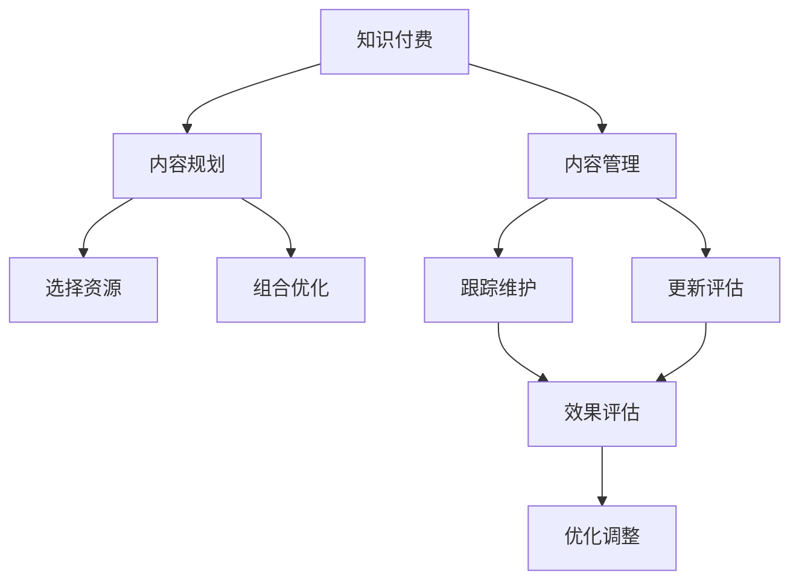

                 

## 1. 背景介绍

在互联网快速发展的时代，知识付费已成为人们获取知识的重要方式。对于程序员而言，如何高效地进行知识付费的内容规划与管理，最大化其价值，成为他们必须面对的重要课题。本文将探讨知识付费的核心概念、方法论，以及具体的操作步骤，帮助程序员有效管理其知识付费投入，提升学习效果。

## 2. 核心概念与联系

### 2.1 核心概念概述

- **知识付费**：指通过付费获取知识、技能和信息的服务。知识付费的形式多种多样，包括在线课程、电子书、咨询问答、技能培训等。
- **内容规划**：指根据个人或组织的目标需求，选择、组合、优化相关知识资源的过程。内容规划有助于提高知识付费的效果和效率。
- **内容管理**：指对知识资源进行跟踪、维护、更新和评估的活动。良好的内容管理能够保障知识资源的有效利用和持续改进。
- **学习效率**：指通过学习知识付费内容，掌握新技能或解决问题所需的时间与效果。提高学习效率是知识付费的最终目的。

### 2.2 核心概念原理和架构的 Mermaid 流程图(Mermaid 流程节点中不要有括号、逗号等特殊字符)



该图展示了知识付费的流程架构，其中内容规划和内容管理是两大核心环节，与知识付费的效果密切相关。

## 3. 核心算法原理 & 具体操作步骤

### 3.1 算法原理概述

知识付费的内容规划与管理，本质上是基于数据驱动、目标导向的决策过程。通过对学习目标、内容资源、学习效果等数据的综合分析，选择合适的知识付费内容，并对其进行有效的管理和跟踪，以达到最佳的学习效果。

### 3.2 算法步骤详解

**Step 1: 确定学习目标**

- 明确个人或组织的学习目标，包括技能提升、项目需求、职业发展等。
- 将目标细化为具体的知识需求，如Python编程、数据分析、机器学习等。

**Step 2: 选择内容资源**

- 根据学习目标，筛选出与之匹配的知识付费资源。
- 考虑内容的质量、口碑、性价比等因素，选择优质课程、书籍或培训项目。

**Step 3: 组合优化内容**

- 根据学习进度和需求，将选择的内容资源进行合理的组合。
- 优化组合顺序和结构，确保学习路径的科学性和系统性。

**Step 4: 跟踪管理内容**

- 使用项目管理工具（如Trello、Asana）对学习进度进行跟踪。
- 设置里程碑和时间节点，及时调整学习计划。

**Step 5: 更新评估效果**

- 定期评估学习效果，使用在线测试、项目实践等方式进行检验。
- 根据评估结果，优化学习路径和方法，提高学习效率。

### 3.3 算法优缺点

**优点**：
- 目标导向，确保知识付费内容与个人或组织需求匹配，提高学习效率。
- 科学规划，通过数据分析优化学习路径，提升整体效果。
- 系统管理，使用工具跟踪学习进度，保障学习计划的持续性和稳定性。

**缺点**：
- 对时间、资金投入较高，可能影响日常工作和生活。
- 内容选择需谨慎，劣质资源可能导致学习效果不佳。
- 学习效果与个人自律性密切相关，需有较强的自我管理能力。

### 3.4 算法应用领域

知识付费的内容规划与管理方法，不仅适用于个人学习，也广泛应用于企业培训、高校教育等领域。尤其在软件开发、数据科学、人工智能等技术密集型行业，知识付费的效率和效果尤为重要。

## 4. 数学模型和公式 & 详细讲解 & 举例说明

### 4.1 数学模型构建

设 $T$ 为学习目标，$R$ 为可选知识资源集，$C$ 为内容组合方式，$E$ 为学习效果评估指标。知识付费的内容规划与管理过程可以建模为：

$$
\max_{C} \sum_{i=1}^{N} E_i
$$

其中 $N$ 为学习阶段数，$E_i$ 为第 $i$ 阶段的学习效果。

### 4.2 公式推导过程

通过构建上述数学模型，我们可以推导出知识付费内容规划的优化策略。

1. **目标定义**：
   - $T$ 明确，$E_i$ 需具体量化。如：掌握Python，$E_i$ 可量化为完成的项目数量或通过的编程测试分数。

2. **资源选择**：
   - $R$ 中筛选出与 $T$ 匹配的资源。假设资源数量为 $M$，则 $C$ 的选择方式为 $2^M$ 种。

3. **组合优化**：
   - 使用启发式算法（如遗传算法、蚁群优化等）求解最优组合 $C^*$。

4. **跟踪评估**：
   - 在每个学习阶段 $i$ 评估学习效果 $E_i$，调整组合 $C$。

### 4.3 案例分析与讲解

假设目标是学习机器学习，可选资源为在线课程 $A$、书籍 $B$、线下培训班 $C$。

- **初始化**：明确学习目标 $T$ = 掌握机器学习。
- **选择资源**：筛选出与目标匹配的资源 $R$ = $\{A, B, C\}$。
- **组合优化**：
  - 初始组合为 $C$ = $\{A, B\}$。
  - 根据评估结果，逐步调整组合。
- **跟踪管理**：使用项目管理工具记录学习进度。
- **更新评估**：定期测试学习效果，调整学习路径。

## 5. 项目实践：代码实例和详细解释说明

### 5.1 开发环境搭建

在开发知识付费内容规划与管理的项目前，需要搭建开发环境。

1. **安装Python**：
   ```bash
   sudo apt-get install python3 python-pip
   ```

2. **安装项目依赖**：
   ```bash
   pip install requests beautifulsoup4 pandas matplotlib
   ```

3. **开发环境配置**：
   - 使用虚拟环境 `venv`。
   ```bash
   python3 -m venv myenv
   source myenv/bin/activate
   ```

### 5.2 源代码详细实现

**需求分析**：
- 学习目标：掌握Python编程。
- 可选资源：在线课程、书籍、培训课程。

**内容选择**：
- 在线课程 $A$：Udemy的Python基础课程。
- 书籍 $B$：《Python编程：从入门到实践》。
- 培训课程 $C$：本地编程培训班。

**内容组合**：
- 初始组合 $C$ = $\{A, B\}$。
- 根据学习效果调整组合。

**跟踪管理**：
- 使用项目管理工具（如Trello）记录学习进度。
- 设置学习计划和里程碑。

**更新评估**：
- 定期测试学习效果，调整学习路径。

### 5.3 代码解读与分析

**需求分析模块**：
```python
def analyze_learning_goals():
    learning_goals = {
        "target": "掌握Python编程",
        "expected_outcome": "完成Python编程项目"
    }
    return learning_goals
```

**内容选择模块**：
```python
def select_resources():
    resources = {
        "A": "Udemy的Python基础课程",
        "B": "《Python编程：从入门到实践》",
        "C": "本地编程培训班"
    }
    return resources
```

**内容组合模块**：
```python
def optimize_content_combination():
    resources = select_resources()
    initial_combination = {k: v for k, v in resources.items()}
    # 初始组合
    combination = initial_combination.copy()
    # 根据学习效果调整组合
    while True:
        # 获取学习效果评估
        evaluation = get_learning效果的()
        # 根据评估结果调整组合
        if evaluation == " satisfactory":
            break
        # 调整组合
        combination = modify_combination(combination)
    return combination
```

**跟踪管理模块**：
```python
def track_content_management():
    project_management = Trello()
    project_management.create_board("Python学习计划")
    project_management.create_list("待学习内容")
    project_management.create_list("进行中")
    project_management.create_list("已完成")
    # 更新任务进度
    update_task_progress()
```

**更新评估模块**：
```python
def evaluate_learning_effect():
    # 定期测试
    test_cases = ["Python编程项目", "编程测试"]
    for test_case in test_cases:
        if test_case_completed(test_case):
            print(f"{test_case}完成，学习效果满意。")
        else:
            print(f"{test_case}未完成，需要调整学习路径。")
```

### 5.4 运行结果展示

```python
learning_goals = analyze_learning_goals()
resources = select_resources()
combination = optimize_content_combination()
track_content_management()
evaluate_learning_effect()
```

运行结果展示了学习目标、资源选择、内容组合、跟踪管理和评估效果的过程。

## 6. 实际应用场景

### 6.1 软件开发

在软件开发中，知识付费的内容规划与管理方法能够帮助开发者快速掌握新技术、新框架。例如，针对Python 3.10的开发，可以通过知识付费学习新特性，阅读相关书籍，参加在线课程培训，最终在项目中应用所学知识。

### 6.2 数据科学

数据科学领域，知识付费帮助数据科学家学习数据清洗、数据可视化、机器学习等技能。例如，通过学习Python数据科学库（如Pandas、NumPy、Scikit-learn），掌握数据预处理和模型训练的方法，提升数据分析能力。

### 6.3 人工智能

人工智能领域，知识付费内容规划与管理尤其重要。例如，学习深度学习、自然语言处理、计算机视觉等技术，通过在线课程、书籍、培训班等形式，构建完整的学习路径，提升项目开发效率。

## 7. 工具和资源推荐

### 7.1 学习资源推荐

1. **Coursera、Udacity、edX**：提供大量高质量的在线课程，涵盖计算机科学、数据科学、人工智能等领域。
2. **O'Reilly**：提供丰富的电子书、在线课程、培训项目，涵盖技术书籍、编程语言、工具框架等。
3. **GitHub**：提供开源项目、代码示例、学习资源，帮助程序员学习新技术。

### 7.2 开发工具推荐

1. **Jupyter Notebook**：支持Python、R等语言，可以交互式编程、数据可视化。
2. **Git**：版本控制系统，方便代码管理和协作。
3. **Trello、Asana**：项目管理工具，支持任务跟踪、进度管理。

### 7.3 相关论文推荐

1. **《Knowledge Mining and Utilization》**：探讨知识获取、管理与利用的方法，适用于知识付费内容规划。
2. **《Learning Path Planning in Continuous Learning》**：研究如何通过持续学习构建学习路径，优化学习效果。

## 8. 总结：未来发展趋势与挑战

### 8.1 研究成果总结

本文探讨了知识付费的内容规划与管理方法，帮助程序员有效利用知识资源，提升学习效果。该方法通过目标导向、科学规划、系统管理，提高了学习效率。

### 8.2 未来发展趋势

1. **个性化学习**：根据学习者的行为和反馈，动态调整学习路径和内容，提升个性化学习效果。
2. **智能推荐**：使用推荐算法，推荐最适合的学习资源和内容组合，提高学习效率。
3. **社会化学习**：通过社交网络、学习社区等平台，进行知识共享和协作学习，提升学习体验。
4. **混合学习**：结合在线和线下学习方式，利用混合学习提升学习效果。

### 8.3 面临的挑战

1. **时间管理**：知识付费需要大量时间和精力，可能影响日常生活和工作。
2. **质量筛选**：知识付费资源丰富，但质量参差不齐，如何筛选优质资源是挑战。
3. **学习效果评估**：如何量化学习效果，及时调整学习路径。

### 8.4 研究展望

未来的知识付费内容规划与管理方法将更加智能化、个性化和多样化。通过人工智能和大数据分析技术，进一步优化学习路径，提升学习效果。同时，研究如何实现社会化、混合学习，提供更加灵活和高效的学习模式。

## 9. 附录：常见问题与解答

**Q1: 如何确定学习目标？**

A: 确定学习目标时，需明确具体技能和能力需求，如掌握Python编程、学习深度学习等。

**Q2: 如何选择优质的知识付费资源？**

A: 选择资源时，需考虑内容质量、用户评价、课程内容、教师背景等因素，尽量选择权威、实用、系统的课程。

**Q3: 如何调整学习路径？**

A: 根据学习效果评估，及时调整学习路径和内容组合。例如，如果在线课程学习效果不佳，可以尝试阅读相关书籍或参加培训课程。

**Q4: 如何管理学习进度？**

A: 使用项目管理工具（如Trello、Asana）记录学习进度，设置里程碑和任务，定期检查进度。

**Q5: 如何评估学习效果？**

A: 定期测试学习效果，如编程项目、在线测试等，根据测试结果调整学习路径。

---

作者：禅与计算机程序设计艺术 / Zen and the Art of Computer Programming

