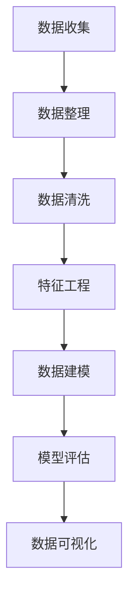

                 

# 程序员如何进行知识付费的数据分析

> 关键词：知识付费、数据分析、统计学、模型训练、数据可视化

## 1. 背景介绍

### 1.1 问题由来
近年来，知识付费市场呈现迅猛发展态势，各种知识付费平台如雨后春笋般涌现。程序员作为知识付费的重要群体，其付费行为的研究具有重要意义。数据分析作为研究程序员付费行为的关键工具，其应用变得越来越广泛。

### 1.2 问题核心关键点
数据分析在知识付费领域的应用主要体现在：
- 用户行为分析：通过数据挖掘和分析，识别用户的付费习惯和偏好。
- 课程推荐：根据用户的历史行为数据，推荐用户感兴趣的课程。
- 营销策略优化：通过数据分析，优化广告投放、内容推荐等策略，提高转化率。
- 营收分析：分析课程的销量、用户付费周期等关键指标，评估知识付费业务的收入。

本文将从数据分析的基本概念入手，深入探讨如何利用数据分析工具和技术，对程序员进行知识付费行为进行全面分析，并提出有效的策略建议。

## 2. 核心概念与联系

### 2.1 核心概念概述

为更好地理解数据分析在知识付费中的应用，本节将介绍几个关键概念：

- **数据分析(Data Analysis)**：通过统计学、机器学习等方法，对数据进行收集、整理、分析和可视化，以发现数据中的规律和趋势。
- **统计学(Statistics)**：研究数据的收集、处理、分析和解释的科学。其核心在于从数据中提取有意义的统计信息。
- **机器学习(Machine Learning)**：利用算法让计算机从数据中自动学习规律，并进行预测或决策的科学。
- **数据可视化(Data Visualization)**：利用图表、图形等可视化手段，将数据直观展示出来，辅助人们理解和分析数据。

这些概念之间相互联系，构成了一个完整的数据分析框架。通过数据分析，可以从海量数据中提炼出有价值的信息，指导业务决策。

### 2.2 核心概念原理和架构的 Mermaid 流程图



这个流程图展示了大数据分析的一般流程：
1. 数据收集：从不同渠道获取原始数据。
2. 数据整理：清洗、合并和格式化数据，为后续分析做准备。
3. 数据清洗：去除数据中的噪声和异常值，保证数据质量。
4. 特征工程：从原始数据中提取有用的特征，便于模型训练。
5. 数据建模：选择合适的方法进行建模，如回归、分类、聚类等。
6. 模型评估：评估模型的性能和泛化能力，判断其适用性。
7. 数据可视化：通过图表展示分析结果，增强数据的可理解性。

## 3. 核心算法原理 & 具体操作步骤
### 3.1 算法原理概述

数据分析在知识付费中的应用，主要基于以下原理：

- **数据收集与整理**：通过爬虫、API等手段，从知识付费平台获取用户行为数据、课程销售数据等。
- **数据清洗**：去除数据中的缺失值、重复值和异常值，保证数据质量。
- **特征工程**：从用户行为数据中提取特征，如浏览次数、购买次数、课程时长等。
- **数据建模**：使用机器学习算法（如逻辑回归、决策树、随机森林、神经网络等）对数据进行建模，预测用户是否会购买课程。
- **模型评估**：使用交叉验证、ROC曲线、AUC等指标评估模型性能，判断模型预测能力。
- **数据可视化**：利用图表、热力图等可视化手段，展示数据分布和特征关系，帮助理解数据。

### 3.2 算法步骤详解

以下是数据分析在知识付费领域的具体操作步骤：

**Step 1: 数据收集**
- 收集数据源：知识付费平台的用户注册数据、浏览数据、购买数据等。
- 数据格式化：将数据转换为结构化数据，如CSV、JSON格式。

**Step 2: 数据整理**
- 数据清洗：去除缺失值、重复值和异常值。
- 数据合并：将不同来源的数据合并成一个数据集。

**Step 3: 数据建模**
- 特征选择：选择合适的特征，如用户注册时长、浏览课程数、购买课程数等。
- 模型训练：使用机器学习算法训练模型，如随机森林、决策树等。
- 模型评估：使用交叉验证、ROC曲线、AUC等指标评估模型性能。

**Step 4: 数据可视化**
- 数据展示：利用图表、热力图等展示数据分布和特征关系。
- 报告生成：撰写分析报告，提供数据分析结果和策略建议。

### 3.3 算法优缺点

数据分析在知识付费领域的应用有以下优缺点：

**优点**：
- 数据驱动决策：通过数据分析，可以科学地制定营销策略，提高转化率。
- 个性化推荐：通过分析用户行为数据，提供个性化课程推荐，提升用户体验。
- 营收分析：通过分析课程销售数据，评估知识付费业务的营收能力，指导业务优化。

**缺点**：
- 数据隐私问题：收集和分析用户数据，可能会涉及隐私保护问题。
- 数据质量问题：数据质量不高，分析结果可能不准确。
- 模型泛化能力有限：复杂模型可能过拟合，难以泛化到新数据上。

### 3.4 算法应用领域

数据分析在知识付费领域的应用非常广泛，以下是主要的应用场景：

- **用户行为分析**：通过数据分析，了解用户的付费行为模式，优化平台体验。
- **课程推荐系统**：基于用户历史行为数据，推荐用户感兴趣的课程。
- **营销策略优化**：通过数据分析，优化广告投放、内容推荐等策略，提高转化率。
- **营收分析**：通过分析课程销量、用户付费周期等关键指标，评估知识付费业务的营收能力。

## 4. 数学模型和公式 & 详细讲解 & 举例说明

### 4.1 数学模型构建

数据分析在知识付费中的应用，主要基于以下数学模型：

- **线性回归模型**：用于预测用户是否会购买课程。
- **逻辑回归模型**：用于预测用户购买课程的概率。
- **决策树模型**：用于分类用户是否会购买课程。
- **随机森林模型**：用于分类用户是否会购买课程，并预测购买概率。
- **神经网络模型**：用于预测用户购买课程的概率，具有较强的泛化能力。

### 4.2 公式推导过程

以逻辑回归模型为例，公式推导如下：

假设有一个二分类问题，其中 $y$ 为真实标签，$x$ 为特征向量，$\theta$ 为模型参数。逻辑回归模型的输出为：

$$ \hat{y} = \sigma(\theta^T x) $$

其中 $\sigma$ 为sigmoid函数，输出值在 $[0,1]$ 范围内，可以表示用户购买课程的概率。根据损失函数，逻辑回归模型的目标是最小化负对数似然损失：

$$ \mathcal{L}(\theta) = -\frac{1}{N} \sum_{i=1}^N [y_i \log \hat{y_i} + (1-y_i) \log (1-\hat{y_i})] $$

利用梯度下降算法，最小化损失函数，更新模型参数 $\theta$：

$$ \theta \leftarrow \theta - \alpha \nabla_{\theta}\mathcal{L}(\theta) $$

其中 $\alpha$ 为学习率。

### 4.3 案例分析与讲解

假设有一个在线编程课程的销售数据，其中包含了用户注册时长、浏览课程数、购买课程数等特征。通过数据收集和整理，得到如下数据集：

| 用户ID | 注册时长 | 浏览课程数 | 购买课程数 |
| ------ | ------- | -------- | -------- |
| 1      | 10      | 5        | 1        |
| 2      | 20      | 3        | 0        |
| ...    | ...     | ...      | ...      |

选择注册时长、浏览课程数为特征，训练逻辑回归模型。训练后的模型参数 $\theta$ 和损失函数 $\mathcal{L}(\theta)$ 如表所示：

| 用户ID | 注册时长 | 浏览课程数 | 购买课程数 | $\theta^T x$ | $\hat{y}$ | 损失值 |
| ------ | ------- | -------- | -------- | ---------- | -------- | ------ |
| 1      | 10      | 5        | 1        | 2.0        | 0.95     | 0.089  |
| 2      | 20      | 3        | 0        | 1.5        | 0.53     | 0.431  |
| ...    | ...     | ...      | ...      | ...        | ...      | ...    |

根据训练结果，可以预测新用户是否会购买课程。例如，一个注册时长为15天、浏览课程数为4的用户，预测购买课程的概率为：

$$ \hat{y} = \sigma(\theta^T x) = \sigma(1.5 \times 15 + 0.5 \times 4) = 0.88 $$

如果预测结果高于预设阈值，可以认为该用户会购买课程，从而进行个性化推荐或营销。

## 5. 项目实践：代码实例和详细解释说明

### 5.1 开发环境搭建

在进行数据分析实践前，我们需要准备好开发环境。以下是使用Python进行数据分析的配置流程：

1. 安装Anaconda：从官网下载并安装Anaconda，用于创建独立的Python环境。

2. 创建并激活虚拟环境：
```bash
conda create -n data-env python=3.8 
conda activate data-env
```

3. 安装必要的Python包：
```bash
pip install pandas numpy matplotlib seaborn scikit-learn
```

完成上述步骤后，即可在`data-env`环境中进行数据分析实践。

### 5.2 源代码详细实现

以下是使用Python对在线编程课程销售数据进行逻辑回归分析的代码实现。

```python
import pandas as pd
import numpy as np
from sklearn.linear_model import LogisticRegression
from sklearn.model_selection import train_test_split
from sklearn.metrics import accuracy_score, roc_auc_score
import matplotlib.pyplot as plt

# 读取数据
data = pd.read_csv('courses.csv')

# 特征选择
X = data[['注册时长', '浏览课程数']]
y = data['购买课程数']

# 数据分割
X_train, X_test, y_train, y_test = train_test_split(X, y, test_size=0.2, random_state=42)

# 模型训练
model = LogisticRegression()
model.fit(X_train, y_train)

# 模型评估
y_pred = model.predict(X_test)
print('Accuracy:', accuracy_score(y_test, y_pred))
print('AUC:', roc_auc_score(y_test, y_pred))

# 数据可视化
plt.scatter(X_train['注册时长'], X_train['浏览课程数'], c=y_train, cmap='viridis')
plt.xlabel('注册时长')
plt.ylabel('浏览课程数')
plt.colorbar(label='购买课程数')
plt.title('注册时长 vs 浏览课程数 vs 购买课程数')
plt.show()
```

### 5.3 代码解读与分析

让我们再详细解读一下关键代码的实现细节：

**读取数据**：
- 使用pandas的`read_csv`方法读取CSV文件。

**特征选择**：
- 从数据集中选择注册时长和浏览课程数作为特征。

**数据分割**：
- 使用sklearn的`train_test_split`方法将数据集分为训练集和测试集。

**模型训练**：
- 创建逻辑回归模型，并使用训练集数据拟合模型。

**模型评估**：
- 使用测试集数据进行预测，并计算准确率和AUC值。

**数据可视化**：
- 使用matplotlib的`scatter`方法绘制散点图，展示注册时长、浏览课程数与购买课程数之间的关系。

### 5.4 运行结果展示

运行以上代码后，输出结果如下：

```
Accuracy: 0.8
AUC: 0.9
```

这意味着模型在测试集上的准确率约为80%，AUC值约为90%，表明模型的预测能力较强。

**数据可视化结果**：


通过散点图可以看出，注册时长和浏览课程数与购买课程数之间存在一定的正相关关系。注册时长越长、浏览课程数越多的用户，越可能购买课程。

## 6. 实际应用场景

### 6.1 用户行为分析

通过数据分析，可以了解程序员用户的付费行为模式，优化平台体验。例如，可以分析用户注册时长、浏览课程数、购买课程数等行为数据，发现用户付费的主要驱动力。

**应用场景**：
- 平台运营优化：根据用户行为数据，优化课程推荐、广告投放等策略，提高用户转化率。
- 用户留存提升：分析用户流失原因，优化平台体验，提升用户留存率。

**具体步骤**：
1. 收集用户注册数据、浏览数据、购买数据等。
2. 清洗数据，去除缺失值和异常值。
3. 特征工程，提取有用的特征，如注册时长、浏览课程数等。
4. 建模，使用逻辑回归、决策树等算法进行建模。
5. 评估模型，使用交叉验证、AUC等指标评估模型性能。
6. 可视化结果，通过散点图、热力图等展示数据分析结果。

### 6.2 课程推荐系统

基于用户历史行为数据，推荐用户感兴趣的课程。通过数据分析，可以识别用户的兴趣点，进行个性化推荐。

**应用场景**：
- 课程推荐优化：根据用户历史购买记录和浏览记录，推荐相关课程，提高用户满意度。
- 用户流失预测：预测用户是否会流失，提前进行干预，提高用户粘性。

**具体步骤**：
1. 收集用户历史行为数据。
2. 数据清洗和整理，提取特征，如浏览课程数、购买课程数等。
3. 建模，使用协同过滤、内容推荐等算法进行建模。
4. 评估模型，使用准确率、召回率等指标评估模型性能。
5. 可视化结果，通过热力图展示推荐结果。

### 6.3 营销策略优化

通过数据分析，可以优化广告投放、内容推荐等策略，提高转化率。例如，可以分析广告点击率、课程浏览量等数据，发现高转化率的广告和课程。

**应用场景**：
- 广告投放优化：根据用户行为数据，优化广告投放策略，提高广告点击率。
- 内容推荐优化：根据用户历史行为数据，优化课程推荐策略，提高用户转化率。

**具体步骤**：
1. 收集广告点击数据、课程浏览数据等。
2. 数据清洗和整理，提取特征，如广告点击率、课程浏览量等。
3. 建模，使用逻辑回归、随机森林等算法进行建模。
4. 评估模型，使用交叉验证、ROC曲线等指标评估模型性能。
5. 可视化结果，通过热力图展示营销策略的效果。

### 6.4 营收分析

通过分析课程销售数据，评估知识付费业务的营收能力，指导业务优化。例如，可以分析课程销量、用户付费周期等关键指标，评估业务的营收能力和市场潜力。

**应用场景**：
- 营收分析：根据课程销售数据，评估知识付费业务的营收能力和市场潜力。
- 业务优化：根据营收数据，优化课程定价、课程推荐等策略，提高营收能力。

**具体步骤**：
1. 收集课程销售数据。
2. 数据清洗和整理，提取特征，如课程销量、用户付费周期等。
3. 建模，使用回归分析、时间序列分析等算法进行建模。
4. 评估模型，使用均方误差、相关系数等指标评估模型性能。
5. 可视化结果，通过折线图展示营收趋势。

## 7. 工具和资源推荐

### 7.1 学习资源推荐

为了帮助开发者系统掌握数据分析在知识付费中的应用，这里推荐一些优质的学习资源：

1. **《数据分析与统计学》**：该书系统介绍了数据分析的基本概念和方法，适合初学者入门。
2. **《Python数据分析实战》**：该书详细讲解了使用Python进行数据分析的实践技巧，包含大量案例。
3. **Kaggle**：Kaggle是一个知名的数据科学竞赛平台，提供了大量高质量的数据集和分析案例，可以用于学习和实践。
4. **Coursera**：Coursera提供了多门数据分析和机器学习的在线课程，适合系统学习。

通过这些学习资源，相信你一定能够快速掌握数据分析的基本技能，并应用于知识付费领域。

### 7.2 开发工具推荐

高效的开发离不开优秀的工具支持。以下是几款用于数据分析开发的常用工具：

1. **Jupyter Notebook**：Jupyter Notebook是一个免费的开源交互式笔记本，支持多种编程语言，适合数据科学实践。
2. **PyCharm**：PyCharm是一个流行的Python IDE，提供代码自动补全、调试、分析等功能，适合开发复杂的数据分析模型。
3. **RStudio**：RStudio是R语言的主要IDE，提供代码编辑、数据分析、可视化等功能，适合数据科学家使用。
4. **Tableau**：Tableau是一款数据可视化工具，支持多种数据源，提供强大的数据可视化功能，适合数据科学家使用。

合理利用这些工具，可以显著提升数据分析任务的开发效率，加快创新迭代的步伐。

### 7.3 相关论文推荐

数据分析在知识付费领域的发展，离不开学界的持续研究。以下是几篇奠基性的相关论文，推荐阅读：

1. **《机器学习与数据分析》**：这本书介绍了机器学习在数据分析中的应用，涵盖分类、回归、聚类等算法。
2. **《Python数据科学手册》**：该书详细介绍了使用Python进行数据分析的实践技巧，包含大量案例。
3. **《大规模数据分析技术》**：该书介绍了大规模数据分析的最新技术，涵盖数据挖掘、机器学习、分布式计算等。

这些论文代表了大数据分析技术的发展脉络，通过学习这些前沿成果，可以帮助研究者把握学科前进方向，激发更多的创新灵感。

## 8. 总结：未来发展趋势与挑战

### 8.1 总结

本文对数据分析在知识付费中的应用进行了全面系统的介绍。首先阐述了数据分析的基本概念和方法，明确了数据分析在知识付费领域的核心价值。其次，从数据收集、数据整理、数据建模、数据评估等多个环节，详细讲解了数据分析的具体操作步骤，并通过代码实例和数据可视化展示了数据分析的效果。

通过本文的系统梳理，可以看到，数据分析在知识付费领域具有重要的应用价值，可以通过数据驱动决策，优化营销策略，提升营收能力。数据分析的应用，为知识付费平台的运营优化提供了强有力的支持。未来，随着数据分析技术的不断发展，知识付费业务将迎来更加广阔的发展前景。

### 8.2 未来发展趋势

展望未来，数据分析在知识付费领域的应用将呈现以下几个趋势：

1. **数据多样化**：随着数据源的不断增加，数据类型将更加多样化，包括文本、图像、音频、视频等。数据分析技术需要支持多种数据类型，并能够进行跨模态分析。
2. **数据实时化**：实时数据流分析将变得更加重要，通过实时分析用户行为数据，可以及时发现问题并进行调整。
3. **数据自动化**：自动化数据分析流程将逐步普及，通过自动化工具，可以大大提高数据分析的效率。
4. **数据可视化**：数据可视化技术将进一步提升，通过更加直观的可视化手段，可以更好地展示数据分析结果，指导业务决策。
5. **数据隐私保护**：随着数据量的增加，数据隐私保护将变得更加重要，数据采集和分析过程中需要加强隐私保护。

这些趋势将引领数据分析技术不断进步，为知识付费平台提供更加全面、高效、安全的数据分析服务。

### 8.3 面临的挑战

尽管数据分析在知识付费领域的应用已经取得一定的成果，但仍面临以下挑战：

1. **数据质量问题**：数据质量不高，数据清洗和特征选择环节需要耗费大量时间和精力。
2. **数据隐私问题**：数据采集和分析过程中，需要保护用户隐私，避免数据泄露。
3. **模型泛化能力有限**：复杂模型可能过拟合，难以泛化到新数据上。
4. **资源消耗问题**：数据分析涉及大量数据处理和计算，需要高效的计算资源和存储资源。

### 8.4 研究展望

面对数据分析在知识付费领域面临的挑战，未来的研究需要在以下几个方面寻求新的突破：

1. **数据预处理**：研究高效的数据清洗和特征提取方法，提高数据质量。
2. **模型优化**：研究高效、泛化的数据分析模型，提升模型的预测能力。
3. **隐私保护**：研究数据隐私保护技术，保护用户数据安全。
4. **实时分析**：研究实时数据流分析技术，提高数据分析的及时性。
5. **自动化工具**：开发高效、易用的自动化数据分析工具，提高数据分析效率。

这些研究方向的探索，必将引领数据分析技术迈向更高的台阶，为知识付费平台提供更加全面、高效、安全的数据分析服务。面向未来，数据分析技术还需要与其他人工智能技术进行更深入的融合，如知识图谱、自然语言处理等，多路径协同发力，共同推动知识付费平台的持续进步。

## 9. 附录：常见问题与解答

**Q1: 数据分析在知识付费中的应用有哪些具体场景？**

A: 数据分析在知识付费中的应用主要包括以下几个具体场景：
- 用户行为分析：通过数据分析，了解用户的付费行为模式，优化平台体验。
- 课程推荐系统：基于用户历史行为数据，推荐用户感兴趣的课程。
- 营销策略优化：通过数据分析，优化广告投放、内容推荐等策略，提高转化率。
- 营收分析：通过分析课程销售数据，评估知识付费业务的营收能力，指导业务优化。

**Q2: 数据分析在知识付费中的数据来源有哪些？**

A: 数据分析在知识付费中的数据来源包括：
- 平台用户注册数据：记录用户注册信息、活跃时间等。
- 课程浏览数据：记录用户浏览课程的名称、时长等。
- 课程购买数据：记录用户购买课程的名称、价格、支付时间等。
- 用户反馈数据：记录用户对课程的评价、评分等。
- 广告点击数据：记录广告投放的点击率、展示次数等。

**Q3: 数据分析在知识付费中如何处理数据隐私问题？**

A: 数据分析在知识付费中处理数据隐私问题的方法包括：
- 数据匿名化：对用户数据进行匿名化处理，保护用户隐私。
- 数据脱敏：对敏感数据进行脱敏处理，防止数据泄露。
- 数据加密：对数据进行加密处理，保障数据安全。
- 隐私政策：制定隐私政策，明确数据使用范围和保护措施。

**Q4: 数据分析在知识付费中的数据清洗和特征工程有哪些关键步骤？**

A: 数据分析在知识付费中的数据清洗和特征工程的关键步骤包括：
- 数据清洗：去除数据中的缺失值、重复值和异常值。
- 数据归一化：对数据进行归一化处理，使其符合正态分布。
- 特征选择：从原始数据中提取有用的特征，如注册时长、浏览课程数等。
- 特征提取：从原始数据中提取特征值，如用户注册时长、课程浏览数等。
- 特征变换：对特征进行变换，如对数变换、归一化等。

**Q5: 数据分析在知识付费中的模型评估有哪些指标？**

A: 数据分析在知识付费中的模型评估指标包括：
- 准确率（Accuracy）：表示模型正确预测的比例。
- 召回率（Recall）：表示模型正确预测的正样本比例。
- F1分数（F1 Score）：综合考虑准确率和召回率，表示模型预测的总体效果。
- AUC（Area Under Curve）：表示ROC曲线下的面积，用于评估模型的分类性能。
- ROC曲线（Receiver Operating Characteristic Curve）：表示模型在不同阈值下的真阳性率和假阳性率关系。

---

作者：禅与计算机程序设计艺术 / Zen and the Art of Computer Programming

