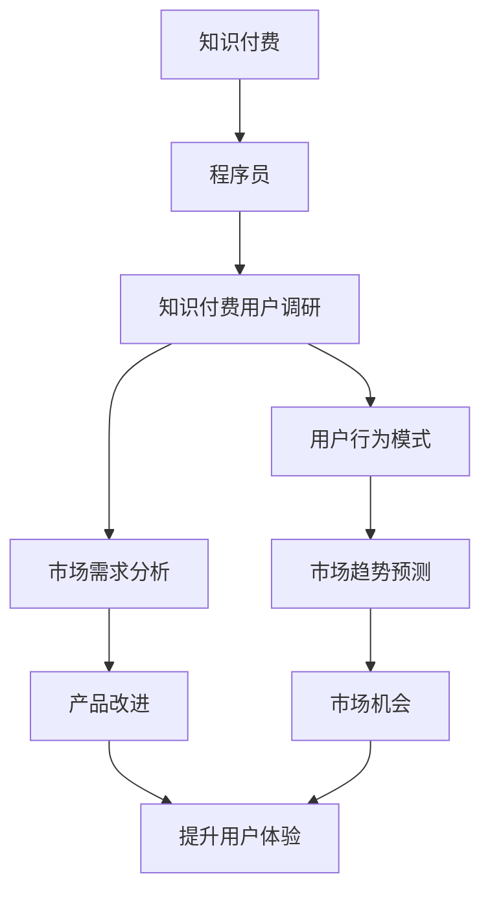

                 

# 程序员如何进行知识付费的用户调研

## 1. 背景介绍

在当今快速发展的科技时代，知识付费已成为一个重要的商业模式。程序员作为这个时代的技术骨干，其学习和成长需求日益增长，知识付费因此成为了程序员获取高质量学习资源的有效途径。然而，这个领域仍存在许多尚未被充分探索的问题，比如用户行为模式、市场趋势、定价策略等。因此，对程序员的知识付费行为进行深入的用户调研是必要的，可以帮助企业制定更加精准的市场策略和产品定位。

### 1.1 问题由来

随着互联网的普及和技术的进步，知识付费市场逐步兴起，越来越多的技术社群、平台和课程开发者加入了这个领域。程序员作为知识付费市场的重要用户群体，其需求和行为对市场的健康发展至关重要。因此，了解程序员的知识付费习惯、支付意愿、付费意愿等，对于服务提供商和平台开发者来说，显得尤为关键。

### 1.2 问题核心关键点

在进行知识付费用户调研时，需要关注以下核心问题：

- 程序员的知识付费需求有哪些？
- 程序员的知识付费渠道主要有哪些？
- 程序员在知识付费中的支付意愿如何？
- 知识付费平台如何提升用户体验，促进购买？
- 知识付费市场的未来发展趋势如何？

### 1.3 问题研究意义

深入了解程序员的知识付费行为，不仅有助于企业制定针对性的市场策略，优化产品和服务，提升用户满意度，还能为未来的市场发展提供参考。具体而言：

- 帮助企业精准定位目标用户，制定差异化策略。
- 优化知识付费产品的设计，提升用户体验和满意度。
- 挖掘市场潜力，抓住市场机会，引导产品和服务创新。

## 2. 核心概念与联系

### 2.1 核心概念概述

在本文中，将探讨以下核心概念及其关联：

- **知识付费**：指用户为获取有价值的信息或知识而支付费用的行为，涵盖书籍、课程、技术文章、视频等多种形式。
- **程序员**：指从事软件开发、维护、测试等技术相关工作的人员，是知识付费市场的重要用户群体。
- **知识付费用户调研**：通过调查问卷、访谈、数据分析等手段，收集程序员对知识付费的认知、需求、行为和支付意愿等相关信息。
- **用户行为模式**：指用户在使用知识付费产品或服务时的行为规律，包括购买频率、付费金额、购买时间等。
- **市场需求分析**：通过调研用户需求，了解市场上缺失的内容或功能，为产品改进提供依据。
- **市场趋势预测**：根据当前和历史数据，预测知识付费市场的未来发展方向。

这些核心概念的联系可以通过以下Mermaid流程图表示：



这个流程图展示了知识付费、程序员、知识付费用户调研、用户行为模式、市场需求分析、市场趋势预测、产品改进和市场机会之间的逻辑联系。

## 3. 核心算法原理 & 具体操作步骤

### 3.1 算法原理概述

知识付费用户调研的算法原理主要基于统计学和心理学原理，结合数据分析和用户体验研究方法。通过问卷调查、访谈、观察等多种方式收集数据，分析程序员在知识付费行为中的行为模式和心理动机，从而揭示市场需求和行为规律。

### 3.2 算法步骤详解

知识付费用户调研的一般步骤如下：

1. **确定调研目标**：明确调研的目的，比如了解程序员的知识付费需求、支付意愿、购买行为等。
2. **设计调研方案**：选择合适的调研方法（问卷调查、访谈、焦点小组等）和工具（如SurveyMonkey、Google Forms、Zoom等）。
3. **选择调研对象**：根据目标用户群体的特点，如技术栈、工作年限、职位等，确定调研样本。
4. **数据收集**：通过问卷调查、访谈等方式收集数据，确保样本的代表性和多样性。
5. **数据分析**：使用统计分析、文本分析等方法对收集到的数据进行处理和分析，提取有价值的信息。
6. **报告撰写**：根据数据分析结果，撰写调研报告，提出有针对性的建议和解决方案。

### 3.3 算法优缺点

知识付费用户调研的算法具有以下优点：

- 能够系统地收集和分析用户数据，发现潜在市场需求和行为规律。
- 通过多渠道、多方式的数据收集，确保调研结果的全面性和可靠性。
- 能够提供数据驱动的决策支持，帮助企业制定更具竞争力的市场策略。

其缺点主要包括：

- 调研过程可能耗费较长的时间和资源，特别是在数据收集和分析阶段。
- 调研结果可能受到调研对象的主观因素影响，存在一定的偏差。
- 数据分析需要专业的技能，对调研人员的要求较高。

### 3.4 算法应用领域

知识付费用户调研不仅在知识付费市场具有广泛的应用，还适用于以下领域：

- 教育行业：了解学生的学习需求和付费意愿，提升教学质量和效果。
- 人力资源：分析员工的职业发展需求，制定培训和晋升策略。
- 软件开发：识别开发人员的技能缺口，制定有针对性的培训计划。
- 金融行业：评估客户的金融知识和需求，开发更符合客户需求的金融产品。

## 4. 数学模型和公式 & 详细讲解 & 举例说明

### 4.1 数学模型构建

在知识付费用户调研中，常用的数学模型包括：

- **回归模型**：用于分析程序员支付意愿与需求之间的线性或非线性关系。
- **聚类分析**：将程序员分为不同群体，了解不同群体的付费行为和需求特点。
- **因子分析**：识别影响程序员知识付费决策的关键因素。

### 4.2 公式推导过程

以线性回归模型为例，假设程序员支付意愿$y$与需求$x$之间的关系可以用线性方程表示为：

$$ y = \beta_0 + \beta_1 x + \epsilon $$

其中：
- $y$：程序员支付意愿。
- $\beta_0$：截距。
- $\beta_1$：需求对支付意愿的影响系数。
- $\epsilon$：误差项。

通过最小二乘法求解$\beta_0$和$\beta_1$，可以得到回归方程的参数估计值：

$$ \hat{\beta_0} = \frac{\sum_{i=1}^{n} (y_i - \bar{y})(x_i - \bar{x})}{\sum_{i=1}^{n} (x_i - \bar{x})^2} $$
$$ \hat{\beta_1} = \frac{\sum_{i=1}^{n} (x_i - \bar{x})(y_i - \bar{y})}{\sum_{i=1}^{n} (x_i - \bar{x})^2} $$

### 4.3 案例分析与讲解

假设我们通过调研收集到以下数据：

| 支付意愿(y) | 需求(x) |
| --- | --- |
| 50 | 4 |
| 100 | 5 |
| 150 | 6 |
| 200 | 7 |
| 300 | 8 |

使用线性回归模型进行分析：

- 计算需求和支付意愿的均值：
  - $\bar{x} = \frac{4+5+6+7+8}{5} = 6$
  - $\bar{y} = \frac{50+100+150+200+300}{5} = 180$
- 计算回归方程的系数：
  - $\hat{\beta_1} = \frac{(4-6)(50-180)+(5-6)(100-180)+(6-6)(150-180)+(7-6)(200-180)+(8-6)(300-180)}{(4-6)^2+(5-6)^2+(6-6)^2+(7-6)^2+(8-6)^2} = 3.5$
  - $\hat{\beta_0} = 180 - 3.5 \times 6 = 114$

因此，回归方程为：

$$ \hat{y} = 114 + 3.5x $$

## 5. 项目实践：代码实例和详细解释说明

### 5.1 开发环境搭建

为了进行知识付费用户调研，需要搭建相应的开发环境。以下是Python环境配置的具体步骤：

1. 安装Python和Pandas库：
   ```bash
   sudo apt-get install python3-pip
   pip install pandas
   ```

2. 安装数据处理和可视化工具：
   ```bash
   pip install matplotlib seaborn
   ```

3. 安装调查问卷工具：
   ```bash
   pip install survey
   ```

4. 安装数据分析工具：
   ```bash
   pip install statsmodels
   ```

### 5.2 源代码详细实现

以下是一个简单的Python代码示例，用于收集和分析程序员的知识付费数据：

```python
import pandas as pd
from statsmodels.formula.api import ols

# 定义调研问卷
questionnaire = [
    {
        'question': '您的技术栈是什么？',
        'options': ['Python', 'Java', 'C++', 'JavaScript', '其他']
    },
    {
        'question': '您的职位是什么？',
        'options': ['初级开发', '中级开发', '高级工程师', '架构师', '其他']
    },
    {
        'question': '您是否愿意为学习新技术或知识付费？',
        'options': ['非常愿意', '比较愿意', '不太愿意', '非常不愿意']
    },
    {
        'question': '您通常通过什么渠道获取知识？',
        'options': ['在线课程', '书籍', '技术博客', '开源社区', '社交媒体', '培训课程']
    },
    {
        'question': '您平均每月为知识付费的花费是多少？',
        'options': ['0-100', '101-200', '201-500', '501-1000', '1001以上']
    }
]

# 生成调研问卷
def generate_questionnaire():
    # 数据录入示例
    data = {
        '技术栈': ['Python', 'Java', 'C++', 'JavaScript', '其他'],
        '职位': ['初级开发', '中级开发', '高级工程师', '架构师', '其他'],
        '支付意愿': ['非常愿意', '比较愿意', '不太愿意', '非常不愿意'],
        '获取渠道': ['在线课程', '书籍', '技术博客', '开源社区', '社交媒体', '培训课程'],
        '月花费': ['0-100', '101-200', '201-500', '501-1000', '1001以上']
    }
    
    # 将数据转换为DataFrame格式
    df = pd.DataFrame(data)
    
    # 使用ols进行回归分析
    model = ols('支付意愿 ~ 技术栈 + 职位 + 获取渠道 + 月花费', data=df)
    results = model.fit()
    
    # 打印回归结果
    print(results.summary())
    
generate_questionnaire()
```

### 5.3 代码解读与分析

上述代码示例中，我们使用了Pandas库进行数据处理和分析，以及statsmodels库进行线性回归分析。

- `generate_questionnaire`函数用于生成调研问卷数据，并将其转换为Pandas DataFrame格式。
- 使用ols函数进行线性回归分析，分析支付意愿与技术栈、职位、获取渠道、月花费之间的关系。
- 最终打印回归结果，包括系数估计、p值、R方等统计量。

## 6. 实际应用场景

### 6.1 智能招聘

通过调研程序员的知识付费行为，招聘平台可以更精准地了解候选人的学习习惯和技能需求，为其推荐更合适的岗位，同时为雇主推荐最匹配的人才。例如，根据程序员对在线课程的偏好，招聘平台可以推荐相应的培训课程，提高员工的职业技能和市场竞争力。

### 6.2 教育培训

教育机构可以利用调研数据，优化课程设计和教学方法。比如，针对程序员对编程技能和最新技术的需求，教育机构可以设计更具针对性的课程内容，提升学习效果和就业率。

### 6.3 在线学习平台

在线学习平台可以根据程序员的付费行为和需求，优化课程推荐算法。比如，根据程序员的学习进度和支付意愿，平台可以推荐不同难度的课程，并根据其学习效果调整课程难度和推荐算法。

### 6.4 未来应用展望

随着知识付费市场的不断发展，未来的应用场景将更加多样化和广泛化。以下是一些可能的未来应用方向：

- 开发AI辅助的调研工具，自动收集和分析数据，提高调研效率。
- 利用自然语言处理技术，自动分析用户评论和反馈，发现潜在问题和改进方向。
- 结合大数据分析，进行市场细分和个性化推荐，提升用户体验和满意度。
- 开发预测模型，预测知识付费市场的发展趋势，为企业的战略规划提供依据。

## 7. 工具和资源推荐

### 7.1 学习资源推荐

为了深入了解知识付费用户调研，以下是一些推荐的学习资源：

- 《用户调研与用户体验设计》：该书系统介绍了用户调研的基本方法和技术，适合初学者入门。
- 《数据科学实战》：该书介绍了数据处理和分析的基本技能，适合对数据科学感兴趣的读者。
- 《Python数据分析实战》：该书使用Python进行数据处理和分析，适合Python用户学习。
- 《用户研究方法与实践》：该书介绍了用户研究的理论和方法，适合研究人员和产品经理学习。

### 7.2 开发工具推荐

以下是一些常用的开发工具，可以帮助进行知识付费用户调研：

- SurveyMonkey：在线问卷调查工具，支持多种题型和数据分析功能。
- Google Forms：免费的在线问卷调查工具，支持多种语言和主题。
- Zoom：视频会议工具，可以进行远程访谈和焦点小组讨论。
- Jupyter Notebook：支持Python代码的开发和分析，方便进行数据处理和可视化。
- Python IDEs：如PyCharm、Spyder等，支持Python开发和数据分析。

### 7.3 相关论文推荐

以下是一些知识付费领域的重要论文，推荐阅读：

- 《知识付费市场现状及发展趋势分析》：介绍了知识付费市场的现状和发展趋势，适合市场分析师和产品经理参考。
- 《程序员知识付费需求分析》：通过对程序员的知识付费行为进行调研，提出了针对程序员的学习平台改进建议。
- 《知识付费平台的商业模式研究》：分析了知识付费平台的商业模式，适合创业者和技术专家参考。
- 《知识付费用户行为分析》：通过对知识付费用户的行为数据进行分析，提出了提升用户满意度的策略。

## 8. 总结：未来发展趋势与挑战

### 8.1 研究成果总结

知识付费用户调研是了解程序员学习需求和行为的有效手段，有助于优化产品设计和提升用户体验。通过对程序员的知识付费行为进行深入分析，可以揭示市场需求、支付意愿和行为规律，为企业制定更具竞争力的市场策略提供依据。

### 8.2 未来发展趋势

随着技术的进步和市场的发展，知识付费用户调研将呈现以下趋势：

- 自动化工具和AI技术的引入，将大幅提升调研效率和数据分析的准确性。
- 数据采集和分析方法的不断优化，将使调研结果更加全面和可靠。
- 调研结果的应用将更加广泛，涵盖教育、招聘、培训等多个领域。
- 调研方法将更加多样化，结合文本分析、行为跟踪等多种技术手段。

### 8.3 面临的挑战

尽管知识付费用户调研具有广阔的应用前景，但仍面临一些挑战：

- 调研成本较高，需要大量人力和时间投入。
- 数据隐私和安全问题，需要制定严格的隐私保护措施。
- 数据真实性和准确性问题，需要多渠道多方法的数据验证。
- 调研结果的解释和应用，需要结合业务场景进行全面分析。

### 8.4 研究展望

未来的研究应重点关注以下方向：

- 开发更加高效和可靠的用户调研工具，降低调研成本和时间。
- 引入AI和机器学习技术，提升数据分析的准确性和效率。
- 加强数据隐私保护，确保用户数据的安全性和隐私性。
- 结合多模态数据和实时数据，进行更全面的用户行为分析。

## 9. 附录：常见问题与解答

### Q1: 如何进行知识付费用户调研？

A: 进行知识付费用户调研一般包括以下步骤：
1. 确定调研目标和问题。
2. 设计调研问卷和调研方案。
3. 选择合适的调研对象和数据收集方法。
4. 收集和分析调研数据。
5. 撰写调研报告并提出改进建议。

### Q2: 知识付费用户调研有哪些方法？

A: 常见的知识付费用户调研方法包括问卷调查、访谈、焦点小组等。问卷调查适合大规模数据收集，访谈和焦点小组适合深度了解用户需求和行为。

### Q3: 知识付费用户调研有哪些工具？

A: 常用的知识付费用户调研工具包括SurveyMonkey、Google Forms、Zoom等。这些工具可以帮助自动化调研过程，提高数据收集和分析的效率。

### Q4: 知识付费用户调研的数据如何处理和分析？

A: 知识付费用户调研的数据处理和分析通常包括数据清洗、统计分析、可视化等步骤。使用Python的Pandas、NumPy和Matplotlib等库，可以高效处理和分析数据，生成图表和报告。

### Q5: 知识付费用户调研的调研结果如何应用？

A: 知识付费用户调研的调研结果可以应用于产品改进、市场策略制定、用户体验提升等多个方面。通过对调研结果进行深入分析，可以发现潜在问题和改进方向，优化产品设计和用户体验。

---

作者：禅与计算机程序设计艺术 / Zen and the Art of Computer Programming

