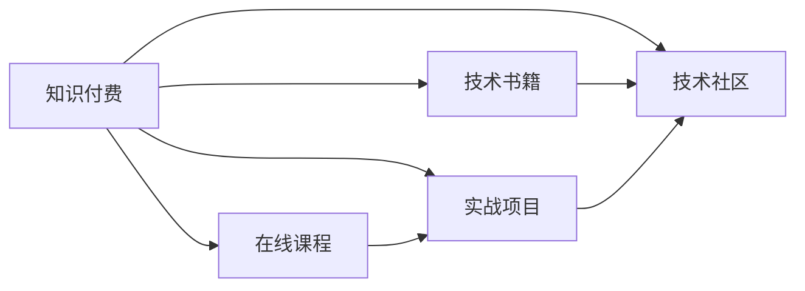

                 

# 程序员如何选择知识付费的切入点

> 关键词：知识付费, 程序员, 技术学习, 职业发展, 在线课程, 实战项目, 技术社区

## 1. 背景介绍

随着互联网的迅猛发展，信息技术已经渗透到各行各业，对程序员的需求和期望也在不断提升。程序员作为技术领域的关键力量，需要不断学习和进步，才能在竞争激烈的职场中保持领先。然而，知识的更新换代速度极快，单靠自学难以跟上最新趋势。知识付费模式应运而生，成为程序员获取前沿技术和实践经验的有效途径。

本文将深入探讨程序员如何选择知识付费的切入点，帮助他们充分利用在线资源，提升自身竞争力。

## 2. 核心概念与联系

### 2.1 核心概念概述

为更好理解知识付费在程序员职业发展中的应用，首先介绍几个关键概念：

- **知识付费**：指通过付费方式获取知识和技能服务的模式，包括在线课程、技术书籍、实战项目、技术社区等。
- **职业发展**：指个人职业技能的提升、职业路径规划、技能评估与验证等。
- **技术学习**：指通过学习新的技术、编程语言、工具和框架，提升技术能力。
- **实战项目**：指通过参与真实项目，将理论知识应用于实际问题解决，提升实践能力。
- **技术社区**：指技术爱好者和专业人士的在线交流平台，提供技术讨论、资源分享等。

这些概念相互联系，共同构成程序员职业发展的知识获取与实践环境。通过选择合适的知识付费切入点，程序员可以实现技术学习与职业发展的有机结合。

### 2.2 核心概念原理和架构的 Mermaid 流程图(Mermaid 流程节点中不要有括号、逗号等特殊字符)



这个流程图展示了知识付费与程序员职业发展的联系。知识付费通过多种形式满足不同需求，提升编程能力和职业竞争力。

## 3. 核心算法原理 & 具体操作步骤

### 3.1 算法原理概述

知识付费的核心在于通过付费获取高效、系统的学习资源。算法的原理是通过匹配学习者的需求和资源提供者的知识，实现知识的有效传递和吸收。算法可以基于学习者的技术水平、学习目标、时间预算等进行个性化推荐，确保学习效果最大化。

### 3.2 算法步骤详解

知识付费的算法步骤通常包括以下几个关键环节：

1. **需求分析**：学习者填写个人资料，描述自己的技术背景、学习目标、可用时间等。
2. **资源推荐**：基于学习者的需求，推荐合适的学习资源，如课程、书籍、实战项目、技术社区等。
3. **学习路径规划**：根据学习目标，设计合理的学习路径，包括课程安排、书籍阅读计划等。
4. **学习效果评估**：通过测试、作业、实战项目等手段，评估学习效果，反馈学习者。
5. **反馈优化**：根据学习者的反馈，不断优化推荐算法，提升资源匹配精准度。

### 3.3 算法优缺点

知识付费算法的优点在于：
- 个性化推荐：根据学习者需求，推荐最适合的学习资源。
- 高效学习：通过结构化学习路径和评估机制，提升学习效率。
- 反馈机制：通过评估和反馈，及时调整学习策略。

缺点在于：
- 成本较高：部分高价值内容可能需要较高付费，对经济条件有限的学习者构成挑战。
- 资源多样性：内容质量和适用性不一，需花费时间和精力筛选。
- 内容更新：部分资源可能过时，需持续关注更新情况。

### 3.4 算法应用领域

知识付费的算法应用广泛，包括在线教育、技术社区、实战项目等多个领域。以下以在线教育为例，说明算法的应用：

1. **在线课程推荐**：根据学习者的技术水平和兴趣，推荐适合的在线课程。
2. **课程内容定制**：根据学习者的进度，动态调整课程内容，提供个性化学习路径。
3. **课程评价系统**：通过学习者的反馈，优化课程内容，提升课程质量。

## 4. 数学模型和公式 & 详细讲解 & 举例说明（备注：数学公式请使用latex格式，latex嵌入文中独立段落使用 $$，段落内使用 $)
### 4.1 数学模型构建

知识付费的数学模型通常涉及以下要素：

- $U$：学习者的用户画像，包括技术背景、兴趣、可用时间等。
- $R$：推荐资源的集合，如课程、书籍、实战项目等。
- $P$：资源推荐策略，如协同过滤、基于内容的推荐等。
- $I$：学习者的互动数据，如评价、反馈等。
- $L$：学习者的学习效果，如考试成绩、项目完成度等。

### 4.2 公式推导过程

假设学习者的需求向量为 $u$，资源推荐策略为 $p$，资源集合为 $r$。推荐系统算法可以形式化为：

$$
r_u = \arg\max_{r \in R} \left(u^T \cdot p(r)\right)
$$

其中 $u^T$ 为学习者需求向量转置，$p(r)$ 为资源推荐策略函数。

以协同过滤算法为例，假设学习者 $u$ 对资源 $r_1, r_2, \ldots, r_n$ 的评分分别为 $i_1, i_2, \ldots, i_n$，资源 $r$ 的评分向量为 $j$，协同过滤算法可以表示为：

$$
i_r = \sum_{i=1}^{n} a_{ri} \cdot i_u
$$

其中 $a_{ri}$ 为资源 $r$ 与资源 $i$ 的相似度系数。

### 4.3 案例分析与讲解

以Coursera平台为例，分析其如何通过知识付费算法推荐课程。

Coursera使用协同过滤和内容过滤相结合的推荐算法，对学习者进行个性化推荐。具体流程如下：

1. **需求分析**：学习者在注册时填写个人资料，如技术背景、学习兴趣等。
2. **资源推荐**：根据学习者需求，推荐适合的课程。使用协同过滤算法，计算资源间的相似度，结合内容特征，推荐最匹配的课程。
3. **学习路径规划**：Coursera提供学习路径建议，帮助学习者设计合理的学习计划。
4. **学习效果评估**：通过作业、测验等手段，评估学习效果，反馈学习者。
5. **反馈优化**：根据学习者反馈，不断优化推荐算法，提升推荐精准度。

Coursera的成功在于其个性化推荐和动态优化，使得学习者能够快速找到合适的学习资源，提升学习效果。

## 5. 项目实践：代码实例和详细解释说明

### 5.1 开发环境搭建

要进行知识付费平台的开发，需要安装以下软件和库：

1. Python：用于编写推荐算法和后端逻辑。
2. Flask：搭建Web应用，提供前端页面。
3. SQL：用于存储用户和资源信息。
4. Redis：用于缓存推荐结果，提高响应速度。
5. TensorFlow：用于机器学习算法模型训练。

安装命令如下：

```bash
pip install flask
pip install sqlalchemy
pip install redis
pip install tensorflow
```

### 5.2 源代码详细实现

以下是一个简单的知识付费推荐系统的代码实现：

```python
from flask import Flask, render_template
from sqlalchemy import create_engine, Column, Integer, String
from sqlalchemy.orm import sessionmaker
from sqlalchemy.ext.declarative import declarative_base
from redis import Redis

# 创建Flask应用
app = Flask(__name__)

# 创建SQL数据库连接
engine = create_engine('sqlite:///learning_platform.db')
Base = declarative_base()
Session = sessionmaker(bind=engine)

# 定义学习者表
class User(Base):
    __tablename__ = 'users'
    id = Column(Integer, primary_key=True)
    name = Column(String)
    tech_stack = Column(String)

# 定义资源表
class Resource(Base):
    __tablename__ = 'resources'
    id = Column(Integer, primary_key=True)
    name = Column(String)
    description = Column(String)

# 推荐算法
def recommend_resources(user, resources):
    user_id = user.id
    resource_ids = [resource.id for resource in resources]
    user_rated_resources = session.query(Resource).filter(Resource.id.in_(resource_ids)).all()
    user_rated_scores = [(user_rated_resource.id, user_rated_resource.score) for user_rated_resource in user_rated_resources]
    similarity_scores = []
    for resource in resources:
        similarity_scores.append(calculate_similarity(resource, user_rated_resources))
    return sorted(similarity_scores, key=lambda x: x[1], reverse=True)

# 计算相似度
def calculate_similarity(resource, user_rated_resources):
    user_score = sum([resource_score * user_rated_score for resource_score, user_rated_score in user_rated_scores if resource.id == resource_score[0]])
    return user_score / sum([resource_score for resource_score in user_rated_scores])

# 主函数
@app.route('/')
def index():
    user = User.query.first()
    resources = Resource.query.all()
    recommended_resources = recommend_resources(user, resources)
    return render_template('index.html', resources=resources, recommended_resources=recommended_resources)

if __name__ == '__main__':
    app.run(debug=True)
```

### 5.3 代码解读与分析

这段代码实现了一个简单的推荐系统，主要逻辑如下：

1. **用户信息存储**：通过SQLite数据库存储学习者的信息，包括姓名和所使用的技术栈。
2. **资源信息存储**：通过SQLite数据库存储资源信息，包括资源名称和描述。
3. **推荐算法**：根据学习者的评分，计算资源间的相似度，推荐最匹配的资源。
4. **Web应用**：使用Flask框架搭建Web应用，提供前端页面。

实际应用中，可能需要使用更复杂的推荐算法，如协同过滤、内容过滤、深度学习等，并进行优化和扩展。

### 5.4 运行结果展示

运行上述代码后，可以得到一个简单的推荐系统页面，展示学习者的推荐资源列表。

## 6. 实际应用场景

### 6.1 在线教育

在线教育平台如Coursera、Udemy、edX等，通过知识付费模式提供丰富的课程资源。学习者可以根据自己的兴趣和需求，选择合适的课程进行学习。平台通过推荐算法，不断优化资源匹配，提升学习效果。

### 6.2 技术社区

技术社区如Stack Overflow、GitHub等，通过知识付费模式提供问答、代码分享、资源下载等服务。学习者可以在社区中提问、回答、分享技术文章，积累技术知识和经验。

### 6.3 实战项目

实战项目平台如LeetCode、Codeforces等，通过知识付费模式提供编程题目和项目实战。学习者通过解决实际问题，提升编程能力和实战经验。平台通过推荐算法，推荐适合的题目和项目，帮助学习者制定学习计划。

### 6.4 未来应用展望

未来知识付费的发展趋势如下：

1. **个性化推荐**：推荐算法将更加精准，能够根据学习者的个性化需求，提供定制化的学习资源。
2. **多渠道融合**：知识付费将与视频、音频、直播等多种形式相结合，提供更丰富、多维度的学习体验。
3. **跨平台协作**：知识付费平台将与其他在线工具和服务集成，提供完整的学习和开发环境。
4. **实时反馈和评估**：通过实时反馈和评估机制，不断优化学习效果，提升学习者的体验和成效。

## 7. 工具和资源推荐

### 7.1 学习资源推荐

- **Coursera**：提供来自全球顶尖大学和机构的在线课程，涵盖计算机科学、数据科学、人工智能等多个领域。
- **edX**：提供来自MIT、Harvard等知名高校的课程，覆盖广泛的学科领域。
- **Udacity**：提供高品质的纳米学位课程，涵盖人工智能、机器学习、计算机视觉等领域。
- **LeetCode**：提供编程题目的在线题库，帮助学习者提升编程能力。
- **Codeforces**：提供编程比赛的在线平台，帮助学习者提升编程技巧和竞赛能力。

### 7.2 开发工具推荐

- **Flask**：轻量级Web框架，适合搭建知识付费平台的前端应用。
- **SQLite**：轻量级数据库，适合存储用户和资源信息。
- **Redis**：高并发、高性能的内存数据库，适合缓存推荐结果。
- **TensorFlow**：深度学习框架，适合开发机器学习推荐算法。

### 7.3 相关论文推荐

- **《推荐系统中的协同过滤算法研究》**：介绍了协同过滤算法的原理和应用，包括基于用户的协同过滤和基于物品的协同过滤。
- **《深度学习在推荐系统中的应用》**：探讨了深度学习在推荐系统中的应用，包括协同过滤、内容过滤、混合推荐等。
- **《个性化推荐系统综述》**：总结了个性化推荐系统的研究进展，涵盖协同过滤、矩阵分解、深度学习等多个方向。

## 8. 总结：未来发展趋势与挑战

### 8.1 研究成果总结

本文介绍了程序员如何选择知识付费的切入点，探讨了知识付费算法的原理和操作步骤。通过实际项目实践，展示了知识付费在在线教育、技术社区、实战项目等场景中的应用。推荐了一些优质的学习资源和开发工具，为程序员提供了系统的技术指引。

### 8.2 未来发展趋势

未来知识付费的发展趋势如下：

1. **智能化推荐**：通过机器学习和大数据技术，实现更智能、更精准的推荐算法。
2. **跨领域融合**：知识付费平台将与更多领域的服务融合，提供更全面的学习体验。
3. **多渠道协作**：知识付费平台将与其他在线工具和服务集成，提供完整的学习和开发环境。
4. **个性化定制**：根据学习者的个性化需求，提供定制化的学习资源。

### 8.3 面临的挑战

知识付费面临的挑战包括：

1. **资源质量**：部分平台提供的内容质量不高，可能误导学习者。
2. **费用问题**：部分高价值内容可能需要较高付费，对经济条件有限的学习者构成挑战。
3. **隐私保护**：平台需严格保护用户隐私，避免数据泄露。
4. **技术更新**：需不断更新技术栈，保持平台竞争力。

### 8.4 研究展望

未来的研究展望如下：

1. **深度学习**：通过深度学习算法，提升推荐算法的精准度。
2. **跨领域融合**：探索知识付费与其他领域的融合，提升应用场景的多样性。
3. **个性化定制**：开发更智能的个性化推荐系统，提供更灵活的学习体验。
4. **多渠道协作**：探索知识付费与其他在线工具和服务的集成，提供完整的学习环境。

通过不断突破技术瓶颈，优化用户体验，知识付费将为程序员提供更高效、更丰富的学习资源，推动其职业发展和技术进步。

## 9. 附录：常见问题与解答

**Q1: 知识付费平台如何保证推荐算法的准确性？**

A: 知识付费平台通常使用多种算法相结合，如协同过滤、基于内容的推荐、深度学习等，保证推荐算法的准确性。平台还需要不断优化算法，结合用户反馈，提升推荐效果。

**Q2: 如何选择合适的知识付费平台？**

A: 选择合适的知识付费平台需要考虑平台的资源丰富度、推荐算法精准度、用户体验等因素。可以参考平台的课程评价、学习者的评价和推荐算法的效果，进行综合评估。

**Q3: 知识付费平台的费用如何分配？**

A: 知识付费平台的费用分配一般基于资源的丰富度和质量。高质量的课程和资源通常需要较高的付费，但能提供更优质、更全面的学习体验。

**Q4: 学习者在知识付费平台上学习时，如何保证学习效果？**

A: 学习者可以通过测试、作业、实战项目等手段，评估学习效果，反馈学习者。平台通过推荐算法，不断优化学习路径和资源，提升学习效果。

**Q5: 学习者在知识付费平台上学习时，如何保证隐私安全？**

A: 学习者应选择正规、可信的平台，确保平台严格保护用户隐私。平台应采用加密、匿名等措施，保障用户数据安全。

通过本文的系统梳理，程序员可以更好地选择知识付费的切入点，利用在线资源提升技术能力，促进职业发展。

---

作者：禅与计算机程序设计艺术 / Zen and the Art of Computer Programming

