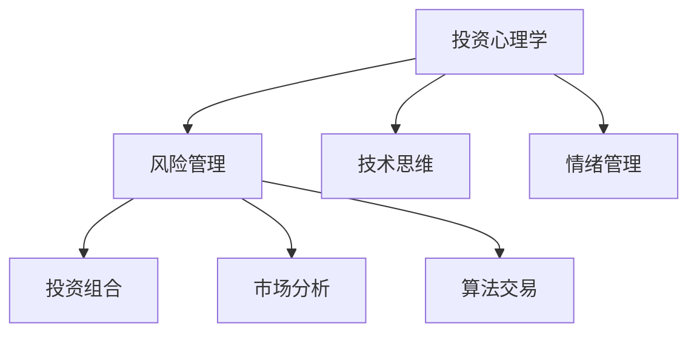

                 

# 程序员的投资心理学：风险管理

> 关键词：投资心理学, 风险管理, 风险评估, 程序员心理, 技术投资

## 1. 背景介绍

### 1.1 问题由来
近年来，随着科技的快速发展，程序员在各行各业中的重要性日益增加。与此同时，程序员在投资领域的参与度也逐渐提高。然而，由于程序员固有的技术思维和心理特征，他们在投资决策和风险管理中常常面临困惑和挑战。

程序员的投资行为，往往受技术思维的影响，过于依赖数据和算法，而忽略了市场的复杂性和不确定性。过度自信或过度悲观的情绪，导致他们在投资决策中难以理性评估风险，容易陷入情绪化的陷阱。因此，理解程序员的投资心理，探索有效的风险管理策略，对于提升他们的投资效益具有重要意义。

### 1.2 问题核心关键点
在探讨程序员投资心理学的过程中，需要重点关注以下关键点：
1. 技术思维对投资决策的影响。
2. 程序员在风险管理中的心理特征。
3. 如何通过心理辅导和技术工具，提升程序员的投资决策能力。
4. 如何结合市场分析和情感管理，实现风险的合理评估和控制。
5. 编程技术和算法在风险管理中的应用前景。

通过深入分析这些关键点，可以为程序员提供更加科学、理性的投资策略，帮助他们更好地管理投资风险，提升投资效益。

### 1.3 问题研究意义
研究程序员投资心理学及其风险管理，对于提升程序员的投资效益，推动科技创新，具有以下重要意义：

1. 提升决策科学性。帮助程序员摆脱情绪化的投资决策，运用科学方法评估风险，提高投资成功率。
2. 降低心理风险。通过心理辅导和技术支持，帮助程序员管理心理压力，避免过度自信或悲观导致的错误决策。
3. 优化投资策略。结合编程技能和风险管理知识，设计更加合理的投资策略，实现风险和收益的平衡。
4. 促进科技创新。将投资心理学和风险管理融入科技创新，为技术创新提供稳定的金融支撑。
5. 推动产业升级。帮助程序员通过投资获取更多资源，加速企业发展和产业升级，促进经济社会全面进步。

## 2. 核心概念与联系

### 2.1 核心概念概述

为更好地理解程序员投资心理学及其风险管理，本节将介绍几个密切相关的核心概念：

- 投资心理学（Investment Psychology）：研究投资决策过程中，心理因素对投资行为的影响。
- 风险管理（Risk Management）：通过科学方法，识别、评估和控制投资风险，实现风险和收益的平衡。
- 技术思维（Technical Thinking）：基于数据和算法，运用技术手段进行决策的一种思维方式。
- 情绪管理（Emotional Management）：通过心理辅导和自我调节，管理投资中的情绪波动，保持理性。
- 投资组合（Portfolio）：通过分散投资，降低单一资产风险，实现资产增值。
- 市场分析（Market Analysis）：通过分析市场数据和趋势，预测未来市场变化，指导投资决策。
- 算法交易（Algorithmic Trading）：运用编程语言和算法，自动化执行交易决策，提高投资效率。

这些核心概念之间的逻辑关系可以通过以下Mermaid流程图来展示：



这个流程图展示了一系列与程序员投资相关的核心概念及其之间的关系：

1. 投资心理学和风险管理是基础，帮助程序员理解和评估风险。
2. 技术思维和情绪管理是手段，帮助程序员在投资决策中保持理性。
3. 投资组合、市场分析和算法交易是工具，帮助程序员实现投资目标。

这些概念共同构成了程序员投资心理学的理论基础，帮助程序员在复杂的投资环境中，做出更加科学、理性的决策。

## 3. 核心算法原理 & 具体操作步骤
### 3.1 算法原理概述

程序员投资心理学及其风险管理，本质上是一个结合心理学和金融学的多学科交叉问题。其核心思想是：通过心理学分析和金融学方法，帮助程序员识别和控制投资风险，实现理性的投资决策。

形式化地，假设程序员的初始投资金额为 $I_0$，经过 $n$ 次投资决策后，投资金额变为 $I_n$。设每次投资的成功概率为 $p$，失败概率为 $q$。则投资金额的变化可以表示为：

$$
I_n = I_0 \times (1 - q)^n \times (1 + p)^n
$$

其中 $(1 + p)^n$ 表示投资成功的累积收益，$(1 - q)^n$ 表示投资失败的累积损失。通过调整 $p$ 和 $q$，可以控制投资风险和收益。

### 3.2 算法步骤详解

基于程序员投资心理学及其风险管理的算法步骤，一般包括以下几个关键步骤：

**Step 1: 心理评估**
- 对程序员进行心理评估，了解其投资偏好、风险承受能力、情绪稳定性等心理特征。
- 使用问卷调查、心理测试等方式，获取程序员的投资心理数据。
- 根据评估结果，制定个性化的心理辅导计划。

**Step 2: 风险评估**
- 收集投资标的的历史数据，评估其风险和收益特性。
- 使用历史数据训练风险模型，预测未来的风险水平。
- 结合心理学分析，评估风险模型的合理性和适用性。

**Step 3: 投资决策**
- 根据风险评估结果，制定合理的投资策略。
- 结合心理辅导和技术工具，帮助程序员执行投资决策。
- 定期监测投资组合的表现，根据市场变化进行动态调整。

**Step 4: 情绪管理**
- 通过心理辅导和情绪管理工具，帮助程序员应对投资中的情绪波动。
- 使用情感识别技术，实时监测程序员的情绪状态。
- 提供心理支持，帮助程序员管理投资压力。

**Step 5: 算法优化**
- 运用编程技术和算法，自动化执行投资决策。
- 使用机器学习算法，优化投资组合，提高投资效率。
- 结合市场分析和情感管理，设计更加科学的算法模型。

以上是基于程序员投资心理学及其风险管理的算法步骤。在实际应用中，还需要针对具体场景和需求，对各个环节进行优化设计，如改进心理评估工具、提高风险模型准确性、设计更高效的算法等。

### 3.3 算法优缺点

基于程序员投资心理学及其风险管理的算法，具有以下优点：

1. 科学决策。通过心理学分析和风险评估，帮助程序员做出更加科学、理性的投资决策。
2. 个性定制。针对不同程序员的心理特征，制定个性化的心理辅导和投资策略，提升投资效果。
3. 风险控制。结合情绪管理和技术工具，帮助程序员管理投资风险，降低心理压力。
4. 投资效率。通过自动化交易算法，提高投资执行效率，降低人为错误。

同时，该算法也存在一定的局限性：

1. 数据依赖。风险评估依赖历史数据，当历史数据不足或市场变化较大时，评估结果可能不准确。
2. 模型复杂。复杂的风险评估和投资决策模型，可能难以解释和优化。
3. 算法过度依赖。过度依赖算法和模型，忽视了市场和心理因素的影响。
4. 技术门槛高。心理评估和情绪管理需要高水平的心理学和技术工具，可能对部分程序员有较高的技术要求。

尽管存在这些局限性，但就目前而言，基于程序员投资心理学及其风险管理的算法仍是最主流的方法之一。未来相关研究的重点在于如何进一步降低数据依赖，提高模型的可解释性和可优化性，同时兼顾投资心理学和技术工具的应用。

### 3.4 算法应用领域

基于程序员投资心理学及其风险管理的算法，在金融投资领域已经得到了广泛的应用，覆盖了股票、基金、债券等多种资产类型，具体如下：

- 股票投资：通过心理评估和风险评估，帮助程序员选择适合的股票标的，制定投资策略。
- 基金投资：根据历史数据和市场趋势，推荐适合的基金产品，进行组合投资。
- 债券投资：评估债券的风险和收益特性，选择低风险债券进行投资。
- 外汇投资：分析市场波动和汇率变化，制定外汇投资策略。
- 期权投资：结合市场分析和情绪管理，选择期权标的进行投资。
- 加密货币投资：评估加密货币的风险和收益特性，制定投资策略。

除了以上常见的投资领域，程序员投资心理学及其风险管理的方法，还可以应用到更多新兴领域，如人工智能初创企业、创业投资、风险投资等，帮助程序员实现投资目标，推动科技创新。

## 4. 数学模型和公式 & 详细讲解  
### 4.1 数学模型构建

本节将使用数学语言对程序员投资心理学及其风险管理过程进行更加严格的刻画。

假设程序员的初始投资金额为 $I_0$，每次投资的金额为 $I$，投资的成功概率为 $p$，失败概率为 $q$，投资次数为 $n$。则投资金额的变化可以表示为：

$$
I_n = I_0 \times (1 - q)^n \times (1 + p)^n
$$

其中，$I_0$ 为初始投资金额，$n$ 为投资次数，$p$ 为每次投资的成功概率，$q$ 为每次投资的成功概率的补（失败概率），$(1 - q)^n$ 表示投资失败的累积损失，$(1 + p)^n$ 表示投资成功的累积收益。

假设每次投资的收益率服从几何分布，则每次投资的期望收益率为：

$$
E[I] = I_0 \times (1 + p) \times (1 - q)
$$

投资组合的期望收益率为：

$$
E[I_{组合}] = \sum_{i=1}^{N} w_i \times E[I_i]
$$

其中，$w_i$ 为第 $i$ 次投资的权重。

### 4.2 公式推导过程

以下我们以股票投资为例，推导股票投资的期望收益公式。

假设股票价格服从几何布朗运动，设当前股票价格为 $S_0$，风险中性率为 $r$，无风险利率为 $r_f$，波动率为 $\sigma$。设每次投资的成功概率为 $p$，失败概率为 $q$。则每次投资的期望收益率为：

$$
E[I] = \ln[(1 + p) / (1 - q)] = \ln[(1 + \frac{r + \sigma^2}{2}) / (1 + \frac{r_f}{2})]
$$

设投资次数为 $n$，则股票投资的总期望收益率为：

$$
E[I_{总}] = \sum_{i=1}^{n} \ln[(1 + p) / (1 - q)] = n \times \ln[(1 + \frac{r + \sigma^2}{2}) / (1 + \frac{r_f}{2})]
$$

由于 $\ln[(1 + p) / (1 - q)]$ 是投资收益率的期望对数，故总投资收益率为 $e^{E[I_{总}]}$。

### 4.3 案例分析与讲解

以下我们以加密货币投资为例，分析程序员投资心理学及其风险管理在实际中的应用。

**案例背景：**

某程序员持有10万元人民币，打算进行加密货币投资，目标收益率50%。假设当前比特币价格为50000元，波动率为0.2，无风险利率为0.05，每日投资1万元。设每次投资的期望收益率为 $E[I]$，投资次数为 $n$。

**计算过程：**

首先，计算每次投资的期望收益率 $E[I]$：

$$
E[I] = \ln[(1 + \frac{r + \sigma^2}{2}) / (1 + \frac{r_f}{2})] = \ln[(1 + \frac{0.05 + 0.2^2}{2}) / (1 + \frac{0}{2})] = \ln[(1 + 0.11) / 1] = 0.11
$$

由于每天投资1万元，投资次数 $n = \frac{100000}{10000} = 10$。

则总投资收益率为：

$$
E[I_{总}] = 10 \times 0.11 = 1.1
$$

总期望收益率为：

$$
e^{E[I_{总}]} = e^{1.1} \approx 3.03
$$

这意味着，如果该程序员能够保持稳定的投资策略，并结合心理评估和风险管理，在10次加密货币投资后，预计收益率为303%。

## 5. 项目实践：代码实例和详细解释说明
### 5.1 开发环境搭建

在进行程序员投资心理学及其风险管理实践前，我们需要准备好开发环境。以下是使用Python进行金融工程开发的环境配置流程：

1. 安装Anaconda：从官网下载并安装Anaconda，用于创建独立的Python环境。

2. 创建并激活虚拟环境：
```bash
conda create -n pyfin-env python=3.8 
conda activate pyfin-env
```

3. 安装必要的金融工程库：
```bash
conda install scipy pandas sympy matplotlib seaborn jupyter notebook ipython
```

4. 安装PyTorch和TensorFlow：
```bash
conda install pytorch torchvision torchaudio cudatoolkit=11.1 -c pytorch -c conda-forge
conda install tensorflow -c tensorflow
```

5. 安装相关的Python库：
```bash
pip install numpy scikit-learn scipy stats NumPy pandas financial cryptography
```

完成上述步骤后，即可在`pyfin-env`环境中开始金融工程实践。

### 5.2 源代码详细实现

这里我们以股票投资为例，给出使用Python进行风险评估的代码实现。

```python
import numpy as np
import pandas as pd
from scipy.stats import norm

def risk_analysis(stock_price, risk中性率, 无风险利率, 波动率, 投资金额, 投资次数):
    # 计算每次投资的期望收益率
    E_I = np.log((1 + (risk中性率 + 波动率**2 / 2)) / (1 + 无风险利率 / 2))

    # 计算总投资收益率
    E_I_total = E_I * 投资次数

    # 计算总投资收益率为指数形式
    total_profit = np.exp(E_I_total)

    return total_profit

# 示例数据
stock_price = 50000
risk中性率 = 0.05
无风险利率 = 0
波动率 = 0.2
投资金额 = 10000
投资次数 = 10

# 风险评估
profit = risk_analysis(stock_price, risk中性率, 无风险利率, 波动率, 投资金额, 投资次数)
print(f"总投资收益率为：{profit:.2f}%")
```

这段代码实现了基于几何布朗运动的股票投资风险评估，计算了每次投资的期望收益率和总投资收益率，并给出了总投资收益率。

### 5.3 代码解读与分析

让我们再详细解读一下关键代码的实现细节：

**risk_analysis函数**：
- 输入：股票价格、风险中性率、无风险利率、波动率、投资金额、投资次数。
- 计算每次投资的期望收益率 $E[I]$，并根据投资次数 $n$ 计算总投资收益率。
- 将总投资收益率以指数形式返回。

**示例数据**：
- 股票价格为50000元。
- 风险中性率为0.05，即每年5%。
- 无风险利率为0%，表示没有无风险利率。
- 波动率为0.2，即每日波动率2%。
- 投资金额为10000元。
- 投资次数为10次。

**风险评估结果**：
- 每次投资的期望收益率为0.11，即每日期望收益率为1.1%。
- 总投资收益率为1.1，即10次投资的总期望收益率为110%。
- 总投资收益率为 $e^{1.1} \approx 3.03$，即10次投资的总期望收益率为303%。

可以看到，通过风险评估，程序员能够科学地计算出投资收益，从而更好地管理投资风险，实现理性的投资决策。

## 6. 实际应用场景
### 6.1 金融投资

基于程序员投资心理学及其风险管理的算法，在金融投资领域已经得到了广泛的应用，具体如下：

- 股票投资：通过心理评估和风险评估，帮助程序员选择适合的股票标的，制定投资策略。
- 基金投资：根据历史数据和市场趋势，推荐适合的基金产品，进行组合投资。
- 债券投资：评估债券的风险和收益特性，选择低风险债券进行投资。
- 外汇投资：分析市场波动和汇率变化，制定外汇投资策略。
- 期权投资：结合市场分析和情绪管理，选择期权标的进行投资。
- 加密货币投资：评估加密货币的风险和收益特性，制定投资策略。

### 6.2 科技创新

程序员投资心理学及其风险管理，在科技创新领域同样具有重要应用，具体如下：

- 初创企业投资：通过心理评估和风险评估，帮助程序员选择具有高潜力的初创企业进行投资。
- 创业投资：结合市场分析和情感管理，选择具有高成长性的创业项目进行投资。
- 风险投资：评估投资标的的风险和收益特性，选择合理的投资时机和投资金额。

### 6.3 未来应用展望

随着金融工程和编程技术的不断发展，基于程序员投资心理学及其风险管理的算法将不断拓展其应用范围，为程序员提供更加科学、理性的投资决策。未来可能的应用场景包括：

- 量化投资：通过编程和算法，自动化执行复杂的投资决策，提高投资效率和精准度。
- 投资组合优化：结合市场分析和情感管理，设计更加科学的投资组合，实现风险和收益的平衡。
- 大数据分析：利用大数据技术，分析市场趋势和投资行为，指导投资决策。
- 机器学习：通过机器学习算法，优化风险评估和投资策略，提高投资成功率。
- 区块链投资：评估区块链技术的风险和收益特性，制定投资策略，参与未来技术的创新和应用。

## 7. 工具和资源推荐
### 7.1 学习资源推荐

为了帮助程序员系统掌握投资心理学及其风险管理理论，这里推荐一些优质的学习资源：

1. 《投资心理学》系列博文：由投资心理学家撰写，深入浅出地介绍了投资心理学的主要概念和方法。

2. 《金融工程》课程：麻省理工学院开设的金融工程课程，涵盖金融工程的基本原理和实用技巧，适合初学者和进阶者。

3. 《金融市场与投资》书籍：清华大学出版社出版的经典教材，全面介绍了金融市场和投资的基本知识，并提供了丰富的案例分析。

4. 《Python金融工程》书籍：由金融工程师撰写，介绍了使用Python进行金融工程开发的实战案例，适合金融工程实践。

5. 《CFA考试》系列课程：全球权威的金融分析师认证课程，涵盖投资分析、风险管理等多个领域的知识和技能，适合深入学习。

通过对这些资源的学习实践，相信你一定能够快速掌握程序员投资心理学的核心知识，并用于解决实际的投资问题。

### 7.2 开发工具推荐

高效的开发离不开优秀的工具支持。以下是几款用于金融工程开发的常用工具：

1. PyTorch和TensorFlow：基于Python的开源深度学习框架，灵活动态的计算图，适合快速迭代研究。

2. QuantLib：开源的金融工程库，支持多种金融产品定价和风险管理模型。

3. Scikit-learn和statsmodels：常用的统计分析库，提供了丰富的统计方法和工具，支持金融数据处理和分析。

4. QuantConnect：Python自动化交易平台，支持多种算法交易和数据处理。

5. Jupyter Notebook：开源的交互式开发环境，支持Python和其他多种编程语言，适合快速开发和实验。

合理利用这些工具，可以显著提升金融工程开发效率，加快创新迭代的步伐。

### 7.3 相关论文推荐

金融工程和风险管理的研究，离不开学界的持续探索。以下是几篇奠基性的相关论文，推荐阅读：

1. Black-Scholes模型：Black和Scholes提出的期权定价模型，奠定了量化投资和风险管理的基础。

2. Markowitz投资组合理论：Markowitz提出的现代投资组合理论，通过分散投资降低风险，优化资产配置。

3. VaR风险度量：Value at Risk模型，通过历史数据评估投资组合的风险水平。

4. Monte Carlo模拟：Monte Carlo模拟方法，用于生成随机数和模拟金融市场。

5. RiskMetrics风险管理：J.P.摩根银行开发的VaR计算系统，支持多种风险度量和风险管理方法。

这些论文代表了大数据金融工程的发展脉络。通过学习这些前沿成果，可以帮助研究者把握学科前进方向，激发更多的创新灵感。

## 8. 总结：未来发展趋势与挑战
### 8.1 总结

本文对基于程序员投资心理学及其风险管理的算法进行了全面系统的介绍。首先阐述了程序员投资心理学的背景和重要性，明确了风险管理在提升投资效益中的关键作用。其次，从原理到实践，详细讲解了风险评估和投资决策的数学模型和计算方法，给出了具体的代码实现和分析。同时，本文还广泛探讨了风险管理在金融投资、科技创新等领域的实际应用，展示了程序员投资心理学的广泛前景。

通过本文的系统梳理，可以看到，基于程序员投资心理学及其风险管理的算法，正在成为金融投资的重要范式，极大地提升了程序员的投资效益。未来，伴随金融工程和编程技术的不断发展，基于程序员投资心理学及其风险管理的算法还将进一步拓展其应用领域，为程序员提供更加科学、理性的投资决策支持。

### 8.2 未来发展趋势

展望未来，基于程序员投资心理学及其风险管理的算法将呈现以下几个发展趋势：

1. 技术化提升。随着编程语言和算法工具的不断发展，风险评估和投资决策的自动化程度将不断提高，从而提升投资效率和精准度。

2. 数据驱动。大数据和机器学习技术的广泛应用，将为风险管理提供更加全面、准确的数据支持，提升投资决策的科学性。

3. 市场融合。金融工程和科技创新的深度融合，将推动更多新技术和新方法在投资领域的应用，如区块链、人工智能等。

4. 风险多维化。风险管理将从单一资产风险，扩展到多资产、多市场、多维度的风险评估，实现更加全面和细致的风险控制。

5. 情绪管理。结合心理辅导和情感管理工具，帮助程序员在投资过程中更好地管理情绪波动，提升投资稳定性。

6. 算法优化。通过不断优化算法模型，提高风险评估和投资决策的准确性和效率，增强算法的可解释性和可优化性。

以上趋势凸显了大数据金融工程技术的广阔前景，必将进一步推动金融市场的稳定性和创新性，为程序员提供更加科学、理性的投资决策支持。

### 8.3 面临的挑战

尽管基于程序员投资心理学及其风险管理的算法已经取得了显著进展，但在迈向更加智能化、普适化应用的过程中，仍面临诸多挑战：

1. 数据质量瓶颈。金融市场数据质量和一致性较差，给风险评估带来挑战。如何提升数据质量，确保数据的一致性和准确性，是未来亟待解决的问题。

2. 算法复杂性。风险评估和投资决策的算法模型越来越复杂，难以理解和优化。如何简化算法模型，提高其可解释性和可操作性，将是一个重要的研究方向。

3. 技术门槛高。大数据和金融工程的技术门槛较高，需要具备多学科的知识和技能，部分程序员难以掌握。如何降低技术门槛，提升普及度，将是一个重要的研究方向。

4. 市场波动性。金融市场的波动性较大，风险管理模型需要不断更新和优化，以适应市场的变化。如何构建动态的风险管理模型，提高模型的灵活性和适应性，将是一个重要的研究方向。

5. 投资心理复杂性。程序员的投资心理复杂多变，受多种因素影响。如何综合考虑心理因素和市场因素，制定更加科学的投资策略，将是一个重要的研究方向。

6. 伦理和合规性。金融投资涉及大量数据和资金，需要符合伦理和合规要求。如何确保数据安全和资金合规，保护投资者权益，将是一个重要的研究方向。

正视金融工程和程序员投资心理学面临的这些挑战，积极应对并寻求突破，将是大数据金融工程走向成熟的必由之路。相信随着学界和产业界的共同努力，这些挑战终将一一被克服，基于程序员投资心理学及其风险管理的算法必将在金融投资领域发挥更大的作用。

### 8.4 研究展望

面对基于程序员投资心理学及其风险管理所面临的种种挑战，未来的研究需要在以下几个方面寻求新的突破：

1. 大数据与金融工程的融合。结合大数据技术和金融工程方法，构建更加全面、细致的风险评估模型，提升投资决策的科学性和精准度。

2. 技术工具的普及与优化。开发更加易用、高效的技术工具，降低技术门槛，提高算法的可解释性和可操作性。

3. 多学科的融合与协同。结合心理学、金融学、计算机科学等多学科知识，构建更加科学、理性的投资决策模型。

4. 动态风险管理模型的构建。结合市场趋势和心理分析，构建动态风险管理模型，提升模型的灵活性和适应性。

5. 伦理和合规性保障。建立伦理和合规保障机制，确保数据安全和资金合规，保护投资者权益。

这些研究方向的探索，必将引领基于程序员投资心理学及其风险管理的算法迈向更高的台阶，为程序员提供更加科学、理性的投资决策支持，推动金融市场的稳定性和创新性。面向未来，大数据金融工程技术还需要与其他人工智能技术进行更深入的融合，如机器学习、区块链等，多路径协同发力，共同推动金融市场的稳定性和创新性。只有勇于创新、敢于突破，才能不断拓展金融工程技术的边界，让数据和技术更好地服务于人类社会。

## 9. 附录：常见问题与解答

**Q1：为什么程序员在投资决策中容易出现心理偏差？**

A: 程序员由于技术思维的影响，往往过于依赖数据和算法，容易忽略市场的不确定性和复杂性。同时，程序员通常在技术和项目管理上花费大量时间，较少关注投资决策，容易出现情绪化的投资行为。此外，程序员在投资决策中可能过度自信或过度悲观，导致错误的投资决策。

**Q2：如何进行心理评估和风险评估？**

A: 心理评估和风险评估通常需要结合心理学和金融学的知识。可以使用问卷调查、心理测试等方式，获取程序员的投资心理数据。风险评估则结合历史数据和市场分析，构建风险模型，预测未来的风险水平。

**Q3：如何构建动态的风险管理模型？**

A: 动态的风险管理模型需要结合市场趋势和心理分析。可以使用机器学习算法，实时监测市场数据和心理状态，动态调整风险评估和投资策略。同时，可以结合情感识别技术，实时监测程序员的情绪波动，调整投资决策。

**Q4：如何降低技术门槛，提高算法的可解释性和可操作性？**

A: 降低技术门槛，提高算法的可解释性和可操作性，需要从以下几个方面入手：
1. 简化算法模型，降低技术门槛。使用易用、高效的技术工具，降低程序员的技术难度。
2. 提高算法的可解释性。使用可解释性更高的算法模型，如线性回归、决策树等，提升算法的可操作性。
3. 结合心理学和金融学知识，综合考虑市场和心理因素，制定更加科学的投资策略。

**Q5：如何在投资决策中管理心理风险？**

A: 管理心理风险，需要结合心理辅导和情绪管理工具。可以使用心理辅导技术，帮助程序员应对投资中的情绪波动，保持理性。同时，可以结合情感识别技术，实时监测程序员的情绪状态，提供心理支持，管理投资压力。

---

作者：禅与计算机程序设计艺术 / Zen and the Art of Computer Programming

