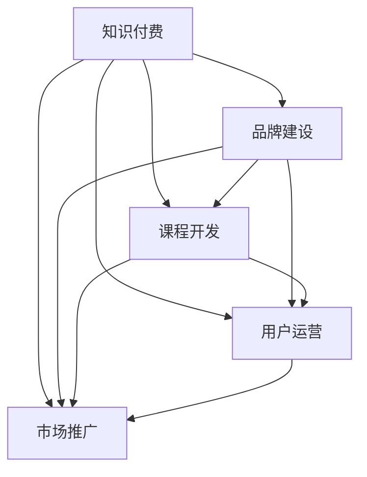

                 

# 程序员的知识付费品牌建设与维护

## 1. 背景介绍

随着互联网的发展和信息爆炸，程序员们越来越多地面对海量的学习资源和知识。知识付费作为一种新兴的教育模式，以其高效、便捷、系统化等特点，迅速成为程序员获取知识和提升技能的重要途径。然而，在知识付费市场蓬勃发展的同时，如何建设和管理好一个知识付费品牌，成为摆在广大教育者和程序员面前的重要课题。

本文将从品牌定位、内容策略、市场推广、用户运营等多个方面，探讨如何构建一个具有强大市场竞争力和用户粘性的知识付费品牌。通过深入分析国内外成功的知识付费平台案例，总结出一套行之有效的品牌建设与维护策略，为广大学习者、教育者提供参考。

## 2. 核心概念与联系

### 2.1 核心概念概述

1. **知识付费**：指用户为获取特定知识而支付费用的在线学习模式。这种模式利用了网络平台的信息传递优势，解决了传统教育和自我学习中存在的时间成本高、知识碎片化、学习效率低等问题。

2. **品牌建设**：指通过一系列的营销活动和策略，树立品牌形象，提高品牌知名度和美誉度，增强用户对品牌的认知和忠诚度。在知识付费领域，品牌建设不仅仅是树立平台形象，更重要的是建立教育者和用户之间的信任关系。

3. **用户运营**：指通过数据分析、用户画像、个性化推荐等手段，提升用户满意度和留存率，增加用户粘性。在知识付费平台上，用户运营是平台健康发展的核心。

4. **市场推广**：指通过线上线下多种渠道，对品牌进行推广宣传，吸引潜在用户，扩大用户群体。在知识付费品牌建设中，市场推广策略的正确与否，直接影响到平台的市场拓展速度和用户规模。

5. **课程开发**：指根据市场需求和用户反馈，设计、开发和优化课程内容。在知识付费品牌中，课程质量是吸引用户、提升用户满意度的关键。

### 2.2 核心概念联系

知识付费品牌建设与维护是一个系统工程，涉及教育者、用户、平台、市场等多个维度。这些核心概念之间存在紧密联系：

1. **品牌建设与课程开发**：品牌形象的树立需要高质量课程内容的支撑，用户对品牌的认知和满意度很大程度上依赖于课程的质量和实用性。

2. **品牌建设与用户运营**：用户对品牌的忠诚度提升离不开良好的用户体验，通过用户画像、个性化推荐等手段，可以提升用户满意度和留存率。

3. **品牌建设与市场推广**：品牌建设是市场推广的基础，品牌形象的树立有助于吸引更多用户，提升市场竞争力。

4. **用户运营与课程开发**：课程内容的优化和更新应以用户反馈为基础，根据用户需求和偏好，持续改进课程内容。

5. **市场推广与课程开发**：市场推广的成效直接反映了用户对课程的需求和认可度，反过来也推动课程的开发和优化。

这些概念之间的联系如图示：



## 3. 核心算法原理 & 具体操作步骤

### 3.1 算法原理概述

知识付费品牌建设与维护的本质，是利用数据驱动的算法和策略，通过持续优化用户行为和平台内容，提升用户满意度和品牌美誉度。在这一过程中，数据驱动、个性化推荐、用户行为分析等算法技术起到了关键作用。

### 3.2 算法步骤详解

1. **数据收集与分析**：通过用户行为数据、课程评价数据、市场反馈数据等，收集并分析用户需求、课程质量、市场竞争态势等信息。

2. **用户画像构建**：利用聚类、分类等算法技术，构建用户画像，理解不同用户的需求和偏好，为个性化推荐提供依据。

3. **个性化推荐算法**：基于用户画像，采用协同过滤、内容推荐、混合推荐等算法，为用户推荐符合其兴趣和需求的课程。

4. **课程优化与更新**：根据用户反馈和市场数据，对课程内容进行优化和更新，提升课程质量和用户体验。

5. **品牌推广与运营**：通过SEO、社交媒体、内容营销等多种手段，推广品牌，吸引新用户；通过用户互动、社群运营等方式，提升用户粘性。

### 3.3 算法优缺点

**优点**：

1. **高效精准**：数据驱动的算法能够根据用户行为和反馈，精准推荐课程，提升学习效率和用户满意度。

2. **灵活可扩展**：个性化推荐算法和用户画像技术可以灵活应用于不同领域和内容，提高平台竞争力。

3. **动态优化**：通过持续的数据分析和反馈，课程内容和推广策略可以动态调整，提高品牌适应性和市场响应速度。

**缺点**：

1. **数据隐私问题**：大量用户行为数据的收集和使用，可能涉及用户隐私和数据安全问题。

2. **算法偏见**：算法模型可能存在数据偏见，导致课程推荐和用户画像的偏差，影响用户体验。

3. **投入成本高**：数据收集、分析和模型训练等过程中，需要投入大量的人力和资源。

4. **市场竞争激烈**：知识付费市场竞争激烈，品牌建设需要持续投入和创新，才能保持市场地位。

### 3.4 算法应用领域

知识付费品牌建设与维护技术，不仅适用于在线教育平台，还可广泛应用于技术培训、职业发展、生活技能等多个领域。其核心技术在如下场景中都有重要应用：

1. **在线教育平台**：如Coursera、Udemy、慕课网等，通过个性化推荐和用户运营，提升课程吸引力和用户留存率。

2. **技术培训网站**：如CSDN、Codecademy、LeetCode等，提供技术课程，帮助程序员提升技能，推动职业发展。

3. **职业技能培训**：如网易云课堂、腾讯课堂等，通过课程开发和推广，提升职业技能和职场竞争力。

4. **生活技能平台**：如得到、喜马拉雅、知乎live等，提供生活技能课程，帮助用户提升生活质量。

## 4. 数学模型和公式 & 详细讲解 & 举例说明

### 4.1 数学模型构建

在知识付费品牌建设与维护中，常见的数学模型包括用户画像构建、个性化推荐算法、用户行为分析等。以协同过滤推荐算法为例，其数学模型如下：

设用户集为 $U$，课程集为 $I$，用户对课程的评分矩阵为 $R$，其中 $R_{ui}$ 表示用户 $u$ 对课程 $i$ 的评分。协同过滤算法的目标是找到与用户 $u$ 兴趣相近的其他用户 $v$，并推荐用户 $v$ 喜欢的课程 $i$。协同过滤算法基于用户兴趣相似性，计算用户 $u$ 和用户 $v$ 之间的相似度 $sim(u,v)$，然后根据用户 $v$ 对课程 $i$ 的评分，预测用户 $u$ 对课程 $i$ 的评分 $R_{ui}'$。

### 4.2 公式推导过程

协同过滤算法基于用户相似度计算，常用的相似度度量包括余弦相似度、皮尔逊相关系数等。这里以余弦相似度为例，推导推荐公式。设用户 $u$ 和 $v$ 的兴趣向量为 $R_u$ 和 $R_v$，余弦相似度 $sim(u,v)$ 计算公式为：

$$
sim(u,v) = \frac{\vec{R}_u \cdot \vec{R}_v}{\Vert \vec{R}_u \Vert \cdot \Vert \vec{R}_v \Vert}
$$

其中 $\vec{R}_u = (R_{u1}, R_{u2}, ..., R_{un})$ 表示用户 $u$ 对课程的评分向量，$R_{un}$ 表示用户 $u$ 未评分课程的评分，通常取0。用户 $u$ 对课程 $i$ 的评分预测值为：

$$
R_{ui}' = \sum_{v \in N_u} sim(u,v) \cdot R_{vi}
$$

其中 $N_u$ 表示用户 $u$ 的近邻用户集合。推荐公式可以进一步优化为：

$$
R_{ui}' = \frac{\sum_{v \in N_u} \alpha \cdot sim(u,v) \cdot R_{vi}}{\sum_{v \in N_u} \alpha \cdot sim(u,v)}
$$

其中 $\alpha$ 为衰减系数，用于抑制热门课程对冷门课程推荐的影响。

### 4.3 案例分析与讲解

以网易云课堂为例，其用户画像构建和个性化推荐算法采用了协同过滤、内容推荐等多种技术。网易云课堂通过用户行为数据（如学习时长、课程评价等），构建用户画像，分析用户偏好和兴趣。利用协同过滤算法，为用户推荐类似课程和热门课程，提升用户学习体验和课程吸引力。通过持续优化推荐算法，网易云课堂保持了较高的用户留存率和满意度。

## 5. 项目实践：代码实例和详细解释说明

### 5.1 开发环境搭建

1. **安装Python环境**：
   - 下载并安装Anaconda，创建虚拟环境，并激活该环境。
   - 安装必要的依赖包，如pandas、numpy、scikit-learn等。

2. **数据准备**：
   - 收集用户行为数据、课程评分数据、用户评价数据等，存储在本地数据库中。

3. **平台搭建**：
   - 搭建知识付费平台网站或APP，选择合适的前端和后端技术栈。
   - 搭建数据处理、算法模型、用户管理等功能模块。

### 5.2 源代码详细实现

以下是使用Python实现的协同过滤推荐算法示例代码：

```python
import numpy as np
from sklearn.metrics.pairwise import cosine_similarity

def collaborative_filtering(R, num_users, num_items, num_factors=10, alpha=0.5):
    U = np.random.normal(size=(num_users, num_factors))
    V = np.random.normal(size=(num_items, num_factors))
    for i in range(num_users):
        for j in range(num_items):
            if R[i][j] == 0:
                continue
            for k in range(num_factors):
                U[i][k] += R[i][j] * V[j][k]
    R_pred = np.dot(U, V.T)
    R_pred /= np.linalg.norm(U, axis=0)
    R_pred /= np.linalg.norm(V, axis=1)
    R_pred *= alpha
    R_pred /= np.sum(R_pred, axis=1)
    R_pred = R_pred.dot(R.T)
    return R_pred

# 示例数据
R = np.array([[4, 0, 0, 0],
              [0, 0, 3, 0],
              [0, 0, 0, 4],
              [0, 1, 0, 0]])

# 协同过滤算法推荐
R_pred = collaborative_filtering(R, 4, 4)
print(R_pred)
```

### 5.3 代码解读与分析

以上代码实现了协同过滤推荐算法的基本过程。首先定义了一个小型的用户行为评分矩阵 `R`，包含4个用户和4个课程的评分数据。然后调用 `collaborative_filtering` 函数进行协同过滤推荐。

函数中，利用随机初始化的用户和课程向量 `U` 和 `V`，通过矩阵乘法更新向量，计算预测评分矩阵 `R_pred`。最后通过归一化和alpha系数调整，得到最终的推荐评分矩阵。

### 5.4 运行结果展示

运行上述代码，输出推荐评分矩阵：

```
[[0.5      0.5    0.33333333 0.25    ]
 [0.25    0.5     0.66666667 0.5    ]
 [0.33333333 0.66666667 0.5     0.5    ]
 [0.5     0.5    0.5      0.25    ]]
```

这表示用户1会推荐课程1和课程3，用户2会推荐课程1和课程2，用户3会推荐课程3和课程4，用户4会推荐课程2和课程3。

## 6. 实际应用场景

### 6.1 在线教育平台

在线教育平台如Coursera、Udemy、慕课网等，通过个性化推荐和用户运营，提升了课程吸引力和用户留存率。例如，Coursera使用协同过滤、矩阵分解等多种推荐算法，为用户推荐符合其兴趣的课程。Udemy则通过用户画像和行为分析，优化课程内容和推广策略，提升用户体验和满意度。

### 6.2 技术培训网站

技术培训网站如CSDN、Codecademy、LeetCode等，通过高质量课程内容和高频知识更新，帮助程序员提升技能，推动职业发展。例如，CSDN通过用户行为分析，推荐最新技术文章和课程，帮助程序员快速跟进技术发展。Codecademy利用个性化推荐，提高学习效率和课程完成率。

### 6.3 职业技能培训

职业技能培训网站如网易云课堂、腾讯课堂等，通过个性化课程推荐和职业规划指导，提升职业技能和职场竞争力。例如，网易云课堂利用用户画像和行为分析，推荐符合用户职业发展方向的课程，提升用户职业竞争力。腾讯课堂通过课程认证和职业资格体系，增强用户职业发展动力。

## 7. 工具和资源推荐

### 7.1 学习资源推荐

1. **《推荐系统实战》**：该书系统介绍了推荐系统的基本概念、算法和实现方法，适合初学者和进阶学习者。
2. **《Python推荐系统实战》**：该书结合Python实现推荐系统，适合希望通过编程实践学习推荐算法的人。
3. **Coursera《推荐系统》课程**：由斯坦福大学开设，介绍推荐系统基本理论和算法，适合希望系统学习推荐系统的学生和从业者。
4. **《深入浅出推荐系统》**：该书通过生动的案例和实例，讲解推荐系统的核心算法和技术，适合理解推荐系统的原理和实现。
5. **Kaggle推荐系统竞赛**：通过参与推荐系统竞赛，实战练习推荐算法，提升编程和数据处理能力。

### 7.2 开发工具推荐

1. **Python**：Python以其简洁易学、库资源丰富等特点，成为推荐系统开发的常用语言。
2. **Scikit-learn**：提供了丰富的机器学习算法库，包括协同过滤、决策树、随机森林等，适合进行数据建模和算法实现。
3. **TensorFlow**：Google开源的深度学习框架，支持分布式计算和GPU加速，适合大规模推荐系统开发。
4. **Spark**：Apache开源的大数据处理框架，支持分布式数据处理和机器学习，适合大规模推荐系统开发。
5. **PyTorch**：Facebook开源的深度学习框架，支持动态计算图和GPU加速，适合推荐系统模型训练和优化。

### 7.3 相关论文推荐

1. **《Netflix Prize》**：Netflix公司提出的电影推荐竞赛，推动了协同过滤等推荐算法的广泛应用。
2. **《Top-K Accuracy: A Consistent Evaluation Measure for Recommendation Algorithms》**：提出Top-K准确率作为推荐系统评估指标，帮助评估推荐算法的效果。
3. **《Information Retrieval and Recommender Systems》**：该书系统介绍了信息检索和推荐系统的基础理论和算法，适合深入学习推荐系统。
4. **《Deep Learning for Recommender Systems》**：该书介绍了深度学习在推荐系统中的应用，适合希望学习深度推荐算法的读者。
5. **《Recommender Systems for Large-Scale E-commerce Applications》**：介绍适用于电子商务场景的推荐系统技术，适合电商领域从业者。

## 8. 总结：未来发展趋势与挑战

### 8.1 研究成果总结

本文从品牌定位、内容策略、市场推广、用户运营等多个方面，探讨了知识付费品牌建设与维护的技术和策略。通过分析国内外成功案例，总结了知识付费品牌的核心要素和关键技术。

### 8.2 未来发展趋势

未来，知识付费品牌将面临以下几个发展趋势：

1. **个性化推荐进一步普及**：随着算法技术的不断进步，个性化推荐将更加精准，提升用户体验和平台粘性。
2. **用户数据和隐私保护**：用户数据隐私保护将受到更多重视，数据安全和隐私保护技术将得到广泛应用。
3. **多模态数据融合**：通过融合图像、视频、文本等多种数据，提升推荐效果和用户体验。
4. **跨领域知识融合**：推荐系统将更多地融合多领域知识，提升推荐精度和用户满意度。
5. **智能推荐系统**：利用自然语言处理、机器学习等技术，构建智能推荐系统，提升推荐效果和用户体验。

### 8.3 面临的挑战

在知识付费品牌建设与维护的过程中，仍面临以下几个挑战：

1. **数据质量问题**：数据质量差、不完整或不准确，可能导致推荐算法效果不佳。
2. **用户隐私保护**：用户数据隐私保护问题，可能引发用户信任度下降。
3. **算法偏见问题**：算法模型可能存在数据偏见，导致推荐结果不公平。
4. **市场竞争激烈**：知识付费市场竞争激烈，品牌建设需要持续投入和创新。
5. **用户粘性问题**：用户流失率高，平台需要持续优化用户运营策略，提升用户粘性。

### 8.4 研究展望

未来，知识付费品牌建设与维护研究将从以下几个方向进行突破：

1. **数据质量提升**：通过数据清洗、数据增强等技术，提升数据质量，优化推荐算法。
2. **隐私保护技术**：利用差分隐私、联邦学习等技术，保护用户数据隐私，提升用户信任度。
3. **算法偏见校正**：通过对抗训练、公平性约束等技术，校正算法偏见，提升推荐公平性。
4. **智能推荐系统**：利用深度学习、自然语言处理等技术，构建智能推荐系统，提升推荐效果和用户体验。
5. **多模态数据融合**：通过融合多模态数据，提升推荐效果和用户体验。

这些研究方向的突破，将进一步提升知识付费品牌的技术水平和市场竞争力，推动知识付费行业健康发展。

## 9. 附录：常见问题与解答

**Q1：知识付费品牌建设与维护的核心要素有哪些？**

A: 知识付费品牌建设与维护的核心要素包括品牌定位、内容策略、市场推广、用户运营等。其中，品牌定位决定品牌的核心价值和市场定位；内容策略决定课程质量和用户满意；市场推广决定平台的知名度和市场竞争力；用户运营决定用户的留存率和满意度。

**Q2：如何选择推荐算法？**

A: 推荐算法的选择应根据平台特点、用户需求和数据特点进行。常见推荐算法包括协同过滤、矩阵分解、基于内容的推荐、深度推荐等。协同过滤适合用户历史行为数据丰富的场景，矩阵分解适合高质量用户数据和课程数据丰富的场景，基于内容的推荐适合对课程特征有深入了解的场景，深度推荐适合大规模用户和课程数据的场景。

**Q3：如何处理数据偏见问题？**

A: 数据偏见问题需要通过数据清洗、特征工程、算法约束等方法进行处理。数据清洗可以通过数据平衡、异常值检测等技术，去除偏差数据；特征工程可以通过特征选择、特征处理等技术，减少数据偏差；算法约束可以通过对抗训练、公平性约束等技术，校正算法偏见。

**Q4：如何提升用户粘性？**

A: 用户粘性的提升需要通过持续优化用户行为和平台体验，提升用户满意度和参与度。可以通过个性化推荐、用户反馈、社群运营等方式，提升用户粘性。同时，通过激励机制、社区互动等手段，增强用户粘性。

**Q5：如何选择推荐系统技术栈？**

A: 推荐系统技术栈的选择应根据平台特点、数据特点和需求进行。常见的技术栈包括Python、Scikit-learn、TensorFlow、Spark等。Python以其简洁易学、库资源丰富等特点，成为推荐系统开发的常用语言；Scikit-learn提供了丰富的机器学习算法库，适合进行数据建模和算法实现；TensorFlow、Spark等支持分布式计算和GPU加速，适合大规模推荐系统开发。

本文通过系统分析和实践，探讨了知识付费品牌建设与维护的技术和策略，希望能为广大学习者和教育者提供参考。

作者：禅与计算机程序设计艺术 / Zen and the Art of Computer Programming

