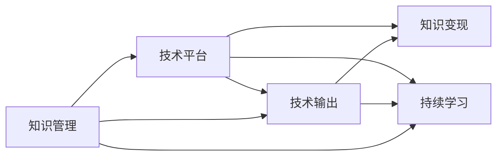

                 

# 程序员的知识管理与变现策略

## 1. 背景介绍

### 1.1 问题由来
在快速迭代和持续学习的IT行业，程序员每天面临大量技术更新和知识迭代。如何有效管理知识、及时更新技能，并将其转化为变现能力，成为每位程序员的职业难题。传统的知识管理方式依赖个人手工整理和记录，效率低下、难以系统化。而知识变现则主要依赖技术输出，但高质量输出内容难以持续，难以规模化。

### 1.2 问题核心关键点
本文将探讨以下核心问题：

- 如何通过技术手段，实现知识的系统化管理。
- 如何通过工具和平台，将知识高效转化为技术输出。
- 如何将技术输出与市场需求对接，实现知识变现。
- 如何维护持续的知识更新和技能提升，确保技术输出的可持续性。

### 1.3 问题研究意义
本问题的研究意义在于：

- 提高个人和团队的技术输出质量和效率，提升知识变现能力。
- 促进IT技术的发展和普及，推动行业标准化和规范化。
- 实现技术输出与市场需求的对接，推动IT行业的人才培养和市场繁荣。
- 促进IT从业者的职业发展和技能提升，提升行业整体的竞争力。

## 2. 核心概念与联系

### 2.1 核心概念概述

本节将介绍几个关键概念及其相互联系，以便更好地理解后续内容：

- **知识管理(Knowledge Management)**：系统化地收集、整理、存储和分享各类知识资源，以促进个人和团队的学习和知识共享。
- **技术输出(Technical Output)**：将知识通过编程、技术博客、开源项目等形式，转化为具体可用的技术内容。
- **知识变现(Knowledge Monetization)**：通过技术输出获取实际收益，如薪资提升、项目合作、技术咨询等。
- **持续学习(Continuous Learning)**：不断更新知识和技能，保持技术输出的前沿性和时效性。
- **技术平台(Technical Platforms)**：提供技术交流、知识分享、项目管理等功能的平台工具，如GitHub、Stack Overflow、Medium等。

这些概念之间的关系可以通过以下Mermaid流程图来展示：



该图展示了知识管理、技术输出、知识变现、持续学习和技术平台之间的逻辑关系：

- 知识管理是技术输出的基础，持续学习是保持技术输出前沿性的关键。
- 技术平台是知识管理、技术输出和知识变现的载体，提供了必要的工具和平台支持。
- 知识变现是知识管理、技术输出和持续学习的最终目标，推动知识管理的改进和技术输出的持续。

## 3. 核心算法原理 & 具体操作步骤
### 3.1 算法原理概述

技术输出的核心在于将知识转化为可用的技术内容。而知识管理的核心在于系统化地存储和组织各类知识资源。知识变现的核心在于将技术输出与市场需求对接。持续学习的核心在于不断更新知识和技能，保持技术输出的前沿性和时效性。

结合这些核心目标，可以抽象出知识管理的算法原理和技术输出的操作步骤。

### 3.2 算法步骤详解

#### 3.2.1 知识管理算法

知识管理的算法步骤主要包括：

1. **收集知识**：通过书籍、论文、在线课程、博客等渠道，收集相关的知识内容。

2. **整理知识**：将收集到的知识内容按照主题、领域、难度等维度进行分类和整理，建立知识库。

3. **存储知识**：将整理好的知识内容存储到数据库、文档库或知识管理平台上，方便后续检索和使用。

4. **分享知识**：通过技术平台或社交网络，将知识内容分享给同行业或感兴趣的群体。

5. **更新知识**：定期更新知识库，添加新的知识点或修正已有知识点的错误。

#### 3.2.2 技术输出算法

技术输出的算法步骤主要包括：

1. **选题**：根据市场需求和个人兴趣，选择合适的技术主题或项目。

2. **策划**：制定详细的技术输出计划，包括输出形式、目标受众、内容结构等。

3. **编写**：根据策划方案，撰写代码、文档、博客等内容，进行技术实现和内容创作。

4. **发布**：将技术内容发布到技术平台、博客、论坛等渠道，吸引受众关注。

5. **迭代**：根据受众反馈和实际效果，不断迭代改进技术输出内容，提升质量。

### 3.3 算法优缺点

知识管理技术的优点在于：

1. **系统化管理**：通过系统化的方法管理知识资源，提高知识利用的效率和效果。
2. **易于检索**：建立知识库后，可以快速检索到所需知识，减少搜索时间。
3. **便于分享**：通过技术平台或社交网络分享知识，方便与同行业者交流和合作。

知识管理技术的缺点在于：

1. **初期投入大**：建立知识库需要大量的时间和精力，初期投入较高。
2. **维护成本高**：知识库需要定期更新和维护，工作量较大。
3. **依赖平台**：依赖特定的知识管理平台，平台兼容性较差。

技术输出的优点在于：

1. **实用性强**：技术输出直接面向实际问题，解决具体问题，实用性强。
2. **认可度高**：高质量的技术输出能够获得行业内外的认可和推荐。
3. **变现潜力大**：技术输出通过项目合作、技术咨询等方式，可以转化为实际的收益。

技术输出的缺点在于：

1. **持续性差**：技术输出需要持续投入时间和精力，难以长期维持。
2. **市场风险**：市场需求变化快，技术输出可能面临市场需求不足的风险。
3. **输出质量不一**：技术输出的质量取决于个人能力，难以保证输出的一致性和高质量。

### 3.4 算法应用领域

知识管理和技术输出在多个领域都有广泛应用，例如：

- **软件开发**：通过知识管理平台如JIRA、Confluence，系统化管理项目文档和技术资料。
- **数据科学**：通过技术平台如Kaggle、Medium，分享数据科学项目和研究结果。
- **产品设计**：通过知识管理平台如Trello、Notion，系统化管理产品需求和技术文档。
- **教育培训**：通过技术平台如Coursera、Udacity，提供系统化的技术培训课程。

## 4. 数学模型和公式 & 详细讲解  
### 4.1 数学模型构建

为更好地理解技术输出的数学模型，本节将使用数学语言进行严格刻画。

假设技术输出内容为 $T$，包含代码、文档、博客等多种形式。技术受众为 $U$，通过阅读、使用等形式参与技术内容互动。技术平台为 $P$，提供技术内容发布和互动的渠道。

技术输出的目标为最大化受众互动，即最大化受众阅读、评论、分享等行为的次数，用数学公式表示为：

$$
\max_{T} \sum_{i \in U} \sum_{j \in P} f(i,j) \cdot I(T_i \text{在平台} j \text{中发布}) \cdot I(i \text{阅读/使用} T_i)
$$

其中，$f(i,j)$ 表示受众在平台 $j$ 上与内容 $T_i$ 互动的频率，$I(\cdot)$ 为指示函数，表示是否满足某条件。

### 4.2 公式推导过程

为了最大化受众互动，我们需要优化内容 $T$ 的发布策略。首先，通过A/B测试等方法，估计不同受众对不同内容的偏好：

$$
\begin{aligned}
&\max_{T} \sum_{i \in U} \sum_{j \in P} f(i,j) \cdot I(T_i \text{在平台} j \text{中发布}) \cdot I(i \text{阅读/使用} T_i) \\
&= \max_{T} \sum_{i \in U} \sum_{j \in P} f(i,j) \cdot I(T_i \text{在平台} j \text{中发布}) \cdot (1 - \epsilon_i) \cdot I(i \text{阅读} T_i) + \epsilon_i \cdot I(i \text{使用} T_i) \\
&= \max_{T} \sum_{i \in U} \sum_{j \in P} f(i,j) \cdot I(T_i \text{在平台} j \text{中发布}) \cdot I(i \text{阅读} T_i) + \epsilon_i \cdot \sum_{j \in P} f(i,j) \cdot I(T_i \text{在平台} j \text{中发布}) \cdot I(i \text{使用} T_i)
\end{aligned}
$$

其中，$\epsilon_i$ 表示受众 $i$ 是否使用技术内容的概率。

为了简化计算，我们假设受众 $i$ 阅读 $T_i$ 的概率 $p_i$ 远小于使用 $T_i$ 的概率 $q_i$，则有：

$$
\epsilon_i \approx q_i
$$

因此，目标函数变为：

$$
\max_{T} \sum_{i \in U} \sum_{j \in P} f(i,j) \cdot I(T_i \text{在平台} j \text{中发布}) \cdot I(i \text{阅读} T_i) + \epsilon_i \cdot \sum_{j \in P} f(i,j) \cdot I(T_i \text{在平台} j \text{中发布}) \cdot I(i \text{使用} T_i)
$$

为了最大化受众互动，我们需要优化技术内容的发布策略。具体来说，我们可以通过以下步骤实现：

1. **受众分析**：分析受众的阅读习惯和行为偏好，确定不同受众对不同内容的敏感度。
2. **内容定位**：根据受众分析结果，定位适合受众的内容形式和发布平台。
3. **平台优化**：优化技术平台的用户体验和互动机制，提高受众的参与度和粘性。
4. **内容迭代**：根据受众反馈和互动数据，不断迭代改进技术内容，提升质量。

### 4.3 案例分析与讲解

假设有一名软件开发工程师，希望通过技术输出提升知识变现能力。他选择撰写博客和开源项目相结合的方式，优化技术输出的策略如下：

1. **受众分析**：通过阅读分析工具如PageRank、Google Analytics，确定目标受众为高级开发者和技术管理人员。

2. **内容定位**：选择GitHub和Medium作为技术内容的发布平台，撰写高质量的代码示例和详细的技术博客。

3. **平台优化**：在GitHub上使用项目管理系统如JIRA，记录项目进度和问题，定期更新代码和文档。在Medium上使用Markdown格式，提高文章的可读性和互动性。

4. **内容迭代**：根据读者的评论和反馈，不断更新博客内容，添加代码示例和实际应用场景，提升博客的实用性和吸引力。

## 5. 项目实践：代码实例和详细解释说明
### 5.1 开发环境搭建

在进行技术输出实践前，我们需要准备好开发环境。以下是使用Python进行技术输出开发的环境配置流程：

1. 安装Python：从官网下载并安装Python，选择适合自己系统的版本。
2. 安装相关工具：安装PyCharm、Visual Studio Code等开发工具。
3. 安装Git：从官网下载并安装Git，用于版本控制和远程协作。
4. 创建Git仓库：在本地创建一个Git仓库，用于存储技术输出内容。
5. 设置Git远程仓库：将本地仓库与远程仓库（如GitHub）连接，进行远程推送和拉取。
6. 配置开发环境：根据开发需求，安装相关库和依赖，如TensorFlow、Scikit-learn、Jupyter Notebook等。

完成上述步骤后，即可在本地环境中进行技术输出的开发。

### 5.2 源代码详细实现

这里以GitHub和Medium为例，给出技术输出的完整代码实现：

1. **GitHub代码仓库**：
```python
# 在GitHub上创建仓库，用于存储技术输出内容
# 使用Markdown格式编写技术博客
# 使用Git命令进行版本控制和远程推送
```

2. **Medium博客平台**：
```python
# 在Medium上注册账号，创建博客
# 使用Markdown格式编写博客内容
# 使用Medium平台提供的API进行文章发布和更新
```

### 5.3 代码解读与分析

让我们再详细解读一下关键代码的实现细节：

1. **GitHub代码仓库**：
- 使用Git命令行工具创建和管理仓库。
- 编写技术博客，使用Markdown格式进行结构化和格式化。
- 使用Git命令进行版本控制和远程推送，确保代码的同步和备份。

2. **Medium博客平台**：
- 注册Medium账号，创建技术博客。
- 使用Medium平台提供的API进行文章发布和更新，确保博客的可见性和互动性。
- 使用Markdown格式编写博客内容，支持标题、列表、代码块等多种格式，提高文章的易读性和专业性。

## 6. 实际应用场景
### 6.1 软件开发

软件开发工程师通过技术输出提升知识变现能力，主要体现在以下几个方面：

1. **项目分享**：通过GitHub分享开源项目，吸引开发者关注和合作。
2. **技术博客**：在Medium、CSDN等技术博客平台上发布技术文章，展示技术水平和思维方式。
3. **技术咨询**：通过技术博客和技术输出建立行业影响力，获得技术咨询和项目合作机会。

### 6.2 数据科学

数据科学家通过技术输出提升知识变现能力，主要体现在以下几个方面：

1. **数据分析项目**：在Kaggle、Medium等平台分享数据分析项目和研究结果，展示数据分析能力。
2. **技术讲座**：通过Medium、Coursera等平台分享技术讲座和培训课程，提高个人和团队的知名度。
3. **开源工具**：开发和分享开源数据分析工具和库，如Pandas、Scikit-learn等，获得社区认可和支持。

### 6.3 产品设计

产品经理通过技术输出提升知识变现能力，主要体现在以下几个方面：

1. **产品文档**：在Notion、GitHub等平台分享产品文档和技术规范，确保产品开发的准确性和一致性。
2. **用户体验报告**：在Medium、Udacity等平台分享用户体验报告和技术分析，提升产品设计的合理性和科学性。
3. **设计案例**：通过Medium、Dribbble等平台分享设计案例和最佳实践，展示设计能力和创新思维。

## 7. 工具和资源推荐
### 7.1 学习资源推荐

为了帮助开发者系统掌握技术输出的理论基础和实践技巧，这里推荐一些优质的学习资源：

1. **技术博客平台**：Medium、CSDN、博客园等，提供丰富的技术文章和博客，便于学习交流。
2. **开源项目平台**：GitHub、Bitbucket等，提供大量的开源项目和代码仓库，便于学习和借鉴。
3. **学习网站**：Coursera、Udacity、edX等，提供系统化的在线课程和技术培训，便于系统学习。
4. **技术社区**：Stack Overflow、Reddit、Gitter等，提供丰富的技术讨论和技术交流，便于获取帮助和资源。
5. **技术期刊**：IEEE Xplore、ACM Digital Library等，提供大量的技术论文和研究报告，便于深入了解技术前沿。

通过对这些资源的学习实践，相信你一定能够快速掌握技术输出的精髓，并用于解决实际的开发问题。

### 7.2 开发工具推荐

高效的开发离不开优秀的工具支持。以下是几款用于技术输出开发的常用工具：

1. **开发工具**：PyCharm、Visual Studio Code等，提供强大的代码编辑和调试功能，适合各种编程语言和框架。
2. **版本控制工具**：Git、SVN等，提供版本控制和远程协作功能，便于团队合作和版本管理。
3. **文档管理工具**：Confluence、Notion等，提供系统化的文档管理和协作功能，便于技术文档的整理和共享。
4. **项目管理工具**：JIRA、Trello等，提供项目管理和任务跟踪功能，便于团队协作和进度控制。
5. **开源项目管理工具**：Github、Bitbucket等，提供开源项目的托管和协作功能，便于开源项目的管理和维护。

合理利用这些工具，可以显著提升技术输出的开发效率，加快创新迭代的步伐。

### 7.3 相关论文推荐

技术输出的发展源于学界的持续研究。以下是几篇奠基性的相关论文，推荐阅读：

1. **《技术输出与社会网络分析》**：探讨技术输出在社交网络中的传播机制和影响因素。
2. **《开源项目的演化与社区参与》**：分析开源项目的演化过程和社区参与的驱动因素。
3. **《博客技术输出与影响力研究》**：探讨技术博客的内容质量和技术影响力之间的关系。
4. **《技术输出与知识共享》**：探讨技术输出在知识共享中的作用和机制。
5. **《技术输出的影响因素分析》**：分析技术输出的质量、发布平台、受众特点等因素对输出的影响。

这些论文代表了大语言模型微调技术的发展脉络。通过学习这些前沿成果，可以帮助研究者把握学科前进方向，激发更多的创新灵感。

## 8. 总结：未来发展趋势与挑战
### 8.1 研究成果总结

本文对技术输出和知识管理的理论和实践进行了全面系统的介绍。首先阐述了技术输出的重要性和实际应用，明确了技术输出在个人职业发展和团队协作中的核心价值。其次，从原理到实践，详细讲解了技术输出的数学模型和操作步骤，给出了技术输出的完整代码实现。同时，本文还探讨了技术输出在软件开发、数据科学、产品设计等多个领域的应用前景，展示了技术输出的广泛应用潜力。

### 8.2 未来发展趋势

展望未来，技术输出和知识管理将呈现以下几个发展趋势：

1. **系统化与自动化**：随着AI和大数据分析技术的进步，技术输出的系统化和自动化水平将不断提高，减少人工操作，提高效率。
2. **多样化与跨领域**：技术输出的形式和领域将更加多样化，跨领域的知识整合和应用将成为新趋势。
3. **个性化与智能化**：基于大数据和机器学习，技术输出的个性化和智能化水平将不断提升，满足不同受众的需求。
4. **平台化与社区化**：技术输出平台和社区的建设将更加完善，提供一站式的技术交流和知识共享服务。
5. **国际化与全球化**：技术输出和知识管理的国际化水平将不断提高，适应全球化的技术交流和合作需求。

### 8.3 面临的挑战

尽管技术输出和知识管理在多个领域取得了显著进展，但在迈向更加智能化、普适化应用的过程中，仍面临以下挑战：

1. **技术壁垒高**：技术输出的高质量产出需要深厚的技术积累和创新能力，难以大规模普及。
2. **平台兼容性差**：不同技术平台的兼容性较差，难以形成统一的输出标准和规范。
3. **知识更新快**：技术领域的知识更新速度快，技术输出需要持续投入时间和精力，难以长期维持。
4. **市场风险大**：技术输出的市场需求变化快，难以稳定预测和把握。
5. **内容质量不一**：技术输出的质量取决于个人能力，难以保证输出的一致性和高质量。

### 8.4 研究展望

面对技术输出和知识管理所面临的挑战，未来的研究需要在以下几个方面寻求新的突破：

1. **自动化与智能化**：开发更加智能化的技术输出工具，减少人工操作，提高输出效率和质量。
2. **标准化与规范化**：制定统一的技术输出标准和规范，提升技术输出的一致性和标准化程度。
3. **持续化与迭代化**：采用持续学习和迭代改进的方法，确保技术输出的持续性和时效性。
4. **跨领域与跨平台**：探索跨领域的技术输出方法，利用跨平台的技术协作工具，提升知识共享和应用效果。
5. **数据驱动与智能推荐**：利用大数据和机器学习技术，实现技术输出的智能推荐和内容优化。

这些研究方向将推动技术输出和知识管理技术的不断进步，为IT行业带来更多的创新和突破。

## 9. 附录：常见问题与解答

**Q1：如何通过技术输出提升知识变现能力？**

A: 技术输出的关键在于产出高质量、实用性强的内容，通过多种渠道进行传播和分享，从而获得受众的认可和反馈。具体步骤包括：

1. **选题与策划**：根据市场需求和个人兴趣，选择合适的技术主题和输出形式。
2. **内容创作**：通过编程、写作、绘图等多种形式，创造高质量的技术内容。
3. **平台发布**：选择适合的发布平台，如博客、开源项目、技术社区等，进行技术输出。
4. **互动与反馈**：积极与受众互动，获取反馈和建议，不断改进输出内容。
5. **商业变现**：通过技术咨询、项目合作、开源项目等形式，将技术输出转化为实际收益。

**Q2：技术输出和知识管理工具有哪些？**

A: 常用的技术输出和知识管理工具包括：

1. **代码托管平台**：GitHub、Bitbucket等，提供代码管理和版本控制功能。
2. **博客平台**：Medium、CSDN、博客园等，提供技术文章和博客发布功能。
3. **技术社区**：Stack Overflow、Reddit、Gitter等，提供技术讨论和交流功能。
4. **项目管理工具**：JIRA、Trello等，提供项目管理和任务跟踪功能。
5. **文档管理工具**：Confluence、Notion等，提供系统化的文档管理和协作功能。

**Q3：技术输出和知识管理面临的主要挑战是什么？**

A: 技术输出和知识管理面临的主要挑战包括：

1. **技术壁垒高**：高质量技术输出的产出需要深厚的技术积累和创新能力，难以大规模普及。
2. **平台兼容性差**：不同技术平台的兼容性较差，难以形成统一的输出标准和规范。
3. **知识更新快**：技术领域的知识更新速度快，技术输出需要持续投入时间和精力，难以长期维持。
4. **市场风险大**：技术输出的市场需求变化快，难以稳定预测和把握。
5. **内容质量不一**：技术输出的质量取决于个人能力，难以保证输出的一致性和高质量。

**Q4：如何通过技术平台优化技术输出的效果？**

A: 技术平台是技术输出的重要载体，通过优化平台的用户体验和互动机制，可以显著提升技术输出的效果。具体措施包括：

1. **平台优化**：优化技术平台的用户界面和功能，提升用户体验和互动效率。
2. **内容推荐**：利用推荐算法，为用户推荐高质量的技术内容，提高内容的曝光率。
3. **用户互动**：增加用户评论、点赞、分享等互动功能，促进内容传播和交流。
4. **数据统计**：通过数据统计和分析，了解用户行为和需求，优化输出策略。

**Q5：技术输出和知识管理在实际应用中有哪些典型案例？**

A: 技术输出和知识管理在实际应用中有很多典型案例，以下是几个代表性的例子：

1. **开源项目**：如TensorFlow、Pandas等，通过开源项目分享技术成果，获得全球社区的支持和贡献。
2. **技术博客**：如Medium、博客园等，通过技术博客分享技术见解，建立个人和团队的影响力。
3. **技术讲座**：如Coursera、Udacity等，通过技术讲座和课程分享知识，提升教育培训效果。
4. **技术社区**：如Stack Overflow、Reddit等，通过技术社区进行技术交流和问题解答，构建知识共享网络。
5. **产品文档**：如Notion、Confluence等，通过产品文档进行技术记录和管理，提升团队协作效率。

通过这些典型案例，可以更好地理解技术输出和知识管理的实际应用，从而提升自身的能力和效率。

---

作者：禅与计算机程序设计艺术 / Zen and the Art of Computer Programming

