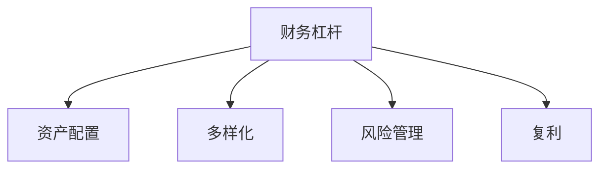

                 

# 程序员的财务杠杆使用策略

## 1. 背景介绍

### 1.1 问题由来
在现代经济社会中，程序员作为信息技术产业的核心人才，其收入水平一直以来都是备受关注的话题。近年来，随着互联网科技的发展和人工智能、大数据等新技术的崛起，程序员的薪酬水平显著提升。然而，随之而来的财务压力也逐渐显现。如何在保持高收入的同时，合理使用财务杠杆，进行资产增值和风险控制，成为了程序员们普遍关心的问题。

### 1.2 问题核心关键点
财务杠杆，本质上是一种利用借贷等金融手段，放大投资收益和风险的工具。程序员在进行财务决策时，面临着收入波动性、不确定性较大等挑战。如何在收入稳定的前提下，通过财务杠杆优化资产配置，提升财务效益，是本文探讨的重点。

### 1.3 问题研究意义
掌握财务杠杆的使用策略，对于程序员而言，不仅有助于优化资产配置，提升财务效益，还能够帮助其有效应对未来经济波动和收入变化，实现财务稳健。此外，通过合理使用财务杠杆，程序员还可以在短时期内快速积累财富，提升生活质量，为未来的职业发展和人生规划打下坚实基础。

## 2. 核心概念与联系

### 2.1 核心概念概述

为更好地理解程序员的财务杠杆使用策略，本节将介绍几个关键概念：

- **财务杠杆(Leverage)**：通过借款或借贷等金融手段，放大资产收益和风险的工具。
- **资产配置(Asset Allocation)**：根据个人财务目标和风险承受能力，将资金分配到不同资产类别中的过程。
- **多样化(Diversification)**：通过投资不同类型资产，分散风险，提升整体投资回报。
- **风险管理(Risk Management)**：识别、评估和控制投资风险的过程，以保障财务稳定。
- **复利(Compound Interest)**：投资收益再投资，使得本金和收益产生的收益也能产生收益，实现财务增长。

这些概念之间的逻辑关系可以通过以下Mermaid流程图来展示：



这个流程图展示了一体化的财务杠杆使用策略：

1. 财务杠杆通过放大投资收益和风险，为资产配置和多样化提供工具。
2. 资产配置和多样化分别通过合理的资产选择和分散风险，提升投资回报。
3. 风险管理和复利则通过控制和提升投资收益，保障财务安全。

这些核心概念共同构成了程序员财务杠杆使用策略的理论基础，帮助其在使用杠杆时更加科学和稳健。

## 3. 核心算法原理 & 具体操作步骤
### 3.1 算法原理概述

程序员的财务杠杆使用策略，本质上是一个优化问题。其核心思想是：通过合理的资产配置和多样化策略，利用财务杠杆放大收益，同时控制风险，从而实现财务的最大化增长。

形式化地，假设程序员的初始资金为 $P$，年利率为 $r$，期望收益率为 $\mu$，风险为 $\sigma$。则在不考虑杠杆情况下，一年后的资金为：

$$
P(1 + \mu)
$$

引入杠杆 $k$ 后，资金总额变为 $kP$，则一年后的资金为：

$$
kP(1 + \mu)
$$

期望收益率为：

$$
\text{期望收益率} = k\mu - k\sigma^2
$$

目标是最大化期望收益率，同时控制风险。通过调整杠杆比例，可以实现最优的财务增长。

### 3.2 算法步骤详解

程序员的财务杠杆使用策略一般包括以下几个关键步骤：

**Step 1: 财务目标设定**
- 根据个人的财务需求和职业规划，设定短期和长期的财务目标，如购房、教育、退休金等。
- 确定具体的财务需求，包括所需资金量、时间点等。

**Step 2: 风险评估**
- 评估个人的风险承受能力，确定能够承受的最大风险水平。
- 考虑收入的波动性和不确定性，如项目的成功率、市场变化等因素。

**Step 3: 资产选择**
- 根据财务目标和风险承受能力，选择适合的资产类别，如股票、债券、房地产等。
- 结合市场分析，选择具有较高成长性和稳定性的投资标的。

**Step 4: 杠杆比例确定**
- 根据投资标的的风险水平和期望收益率，确定最优的杠杆比例。
- 使用公式计算杠杆比例，确保风险和收益的平衡。

**Step 5: 投资组合构建**
- 按照资产配置原则，构建投资组合，分散风险。
- 定期监控投资组合表现，根据市场变化调整投资策略。

**Step 6: 风险管理**
- 引入保险、对冲等金融工具，降低投资组合的风险。
- 设立止损和止盈点，控制投资风险。

**Step 7: 复利应用**
- 将投资收益用于再投资，实现复利效应。
- 选择适合复利计算的金融产品，如定期存款、基金定投等。

**Step 8: 定期评估与调整**
- 定期评估财务状况和投资组合表现，确保目标达成。
- 根据个人情况和市场变化，及时调整投资策略。

以上是程序员财务杠杆使用策略的一般流程。在实际应用中，还需要针对具体情况进行优化设计，如选择适合的财务工具、动态调整投资组合等。

### 3.3 算法优缺点

程序员的财务杠杆使用策略具有以下优点：
1. 最大化财务效益。通过合理的杠杆比例，放大投资收益，实现财务增长。
2. 分散投资风险。通过多样化策略，分散单一资产的风险，降低整体投资组合的风险。
3. 复利效应显著。通过再投资，使得投资收益产生收益，实现财务快速增长。

同时，该策略也存在一定的局限性：
1. 依赖市场环境。财务杠杆放大风险，市场波动较大时可能造成较大损失。
2. 高杠杆成本。财务杠杆的使用需要支付利息，高杠杆可能导致利息支出增加。
3. 高风险承受。财务杠杆增加了投资的风险，需要承受更大的财务压力。
4. 风险管理难度。需要具备较强的风险管理能力，才能有效控制风险。

尽管存在这些局限性，但就目前而言，财务杠杆仍是程序员实现财务稳健和快速增长的重要手段。未来相关研究的重点在于如何进一步降低杠杆成本，提高风险管理能力，同时兼顾财务效益。

### 3.4 算法应用领域

程序员的财务杠杆使用策略不仅适用于个人财务管理，还广泛应用于企业融资、房地产投资等领域。其基本思想在于通过杠杆放大财务效益，同时控制风险，是金融投资的核心策略之一。

1. **个人财务管理**：程序员可以利用财务杠杆进行资产配置，如购买房产、教育基金等，实现财务目标。
2. **企业融资**：企业可以通过财务杠杆进行融资，扩大业务规模，提升市场竞争力。
3. **房地产投资**：通过杠杆投资房地产，放大投资回报，实现资产增值。

## 4. 数学模型和公式 & 详细讲解 & 举例说明
### 4.1 数学模型构建

本节将使用数学语言对程序员的财务杠杆使用策略进行更加严格的刻画。

假设程序员的初始资金为 $P$，年利率为 $r$，期望收益率为 $\mu$，风险为 $\sigma$，杠杆比例为 $k$。则一年后的资金为：

$$
kP(1 + \mu)
$$

期望收益率为：

$$
\text{期望收益率} = k\mu - k\sigma^2
$$

目标是最小化风险，最大化期望收益率。可以使用风险调整贴现率(Risk-Adjusted Return)作为评估指标：

$$
\text{RAROC} = \frac{k\mu}{k\sigma}
$$

其中 $\sigma$ 为标准差，表示投资的波动性。

### 4.2 公式推导过程

以下我们以投资股票为例，推导期望收益率和风险调整贴现率的计算公式。

假设程序员初始资金为 $P$，投资 $kP$ 于股票市场，期望年收益率为 $R$，则一年后的资金为：

$$
kP(1 + R)
$$

期望收益率为：

$$
\text{期望收益率} = kR
$$

风险为：

$$
\text{风险} = k\sigma
$$

其中 $\sigma$ 为股票市场的波动率。

将期望收益率和风险代入风险调整贴现率公式，得：

$$
\text{RAROC} = \frac{kR}{k\sigma} = \frac{R}{\sigma}
$$

为了最大化 RAROC，需要进行资产选择和杠杆比例的优化。使用历史数据和金融分析工具，可以计算不同投资标的的风险和收益，从而确定最优的资产配置和杠杆比例。

### 4.3 案例分析与讲解

假设程序员 A 初始资金为 $100,000$，期望年收益率为 $8\%$，风险为 $20\%$，风险承受能力为 $50\%$。则：

1. 在无杠杆情况下，一年后的资金为：
   $$
   100,000(1 + 8\%) = 108,000
   $$
2. 在杠杆比例为 $2$ 的情况下，一年后的资金为：
   $$
   2 \times 100,000(1 + 8\%) = 216,000
   $$
3. 在无杠杆情况下，期望收益率为 $8\%$，风险为 $20\%$，RAROC 为：
   $$
   \frac{8\%}{20\%} = 0.4
   $$
4. 在杠杆比例为 $2$ 的情况下，期望收益率为 $16\%$，风险为 $40\%$，RAROC 为：
   $$
   \frac{16\%}{40\%} = 0.4
   $$

可以看到，尽管杠杆放大了收益，但风险也相应增加。程序员 A 应根据自身的风险承受能力，选择合适的杠杆比例，以实现最优的财务效益和风险平衡。

## 5. 项目实践：代码实例和详细解释说明
### 5.1 开发环境搭建

在进行财务杠杆使用策略的实践前，我们需要准备好开发环境。以下是使用Python进行金融计算的环境配置流程：

1. 安装Anaconda：从官网下载并安装Anaconda，用于创建独立的Python环境。

2. 创建并激活虚拟环境：
```bash
conda create -n finance-env python=3.8 
conda activate finance-env
```

3. 安装必要的Python库：
```bash
conda install pandas numpy scipy sympy
```

4. 安装金融库：
```bash
pip install QuantLib yfinance
```

完成上述步骤后，即可在`finance-env`环境中开始财务杠杆使用策略的实践。

### 5.2 源代码详细实现

这里我们以投资股票为例，给出使用Python进行财务杠杆使用策略的完整代码实现。

```python
import pandas as pd
import numpy as np
from sympy import symbols, solve

# 定义变量
P = symbols('P', positive=True)
r = 0.1  # 年利率
mu = 0.08  # 期望收益率
sigma = 0.2  # 风险

# 计算无杠杆情况下的资金
V_unlevered = P * (1 + mu)

# 计算杠杆比例为2情况下的资金
k = 2
V_levered = k * P * (1 + mu)

# 计算无杠杆情况下的期望收益率
R_unlevered = mu

# 计算杠杆比例为2情况下的期望收益率
R_levered = k * mu

# 计算无杠杆情况下的风险调整贴现率
RAROC_unlevered = mu / sigma

# 计算杠杆比例为2情况下的风险调整贴现率
RAROC_levered = k * mu / (k * sigma)

# 输出结果
print(f"无杠杆情况下的资金：{V_unlevered}")
print(f"杠杆比例为2情况下的资金：{V_levered}")
print(f"无杠杆情况下的期望收益率：{R_unlevered}")
print(f"杠杆比例为2情况下的期望收益率：{R_levered}")
print(f"无杠杆情况下的风险调整贴现率：{RAROC_unlevered}")
print(f"杠杆比例为2情况下的风险调整贴现率：{RAROC_levered}")
```

### 5.3 代码解读与分析

让我们再详细解读一下关键代码的实现细节：

- 首先定义了初始资金 $P$、年利率 $r$、期望收益率 $\mu$ 和风险 $\sigma$ 等变量。
- 使用符号计算库 Sympy，计算无杠杆和杠杆比例为 $2$ 情况下的资金、期望收益率和风险调整贴现率。
- 输出计算结果，展示杠杆放大的收益和风险调整贴现率。

可以看到，通过Sympy库，我们可以方便地进行符号计算，帮助程序员更好地理解财务杠杆使用策略的数学原理和计算过程。

## 6. 实际应用场景
### 6.1 企业融资

程序员利用财务杠杆进行企业融资，可以扩大业务规模，提升市场竞争力。具体而言，通过向银行或投资者借贷，投资于关键业务和技术创新，提升企业价值。

在技术实现上，可以构建财务模型，计算不同融资方案下的财务杠杆比例，选择最优的融资方案。同时，使用金融工具如期权、期货等，对冲融资风险。

### 6.2 房地产投资

房地产是程序员常见的投资标的，通过财务杠杆进行房地产投资，可以显著提升投资回报。具体而言，通过借贷进行房地产开发和投资，放大投资收益，实现资产增值。

在实践中，可以计算不同杠杆比例下的投资回报率，选择最优的杠杆比例。同时，利用保险、房地产基金等金融工具，分散投资风险。

### 6.3 股票投资

股票市场是程序员常见的投资领域，通过财务杠杆进行股票投资，可以放大投资收益，提升财务效益。具体而言，通过借贷或融资融券等金融工具，增加投资资金，进行股票交易。

在实践中，可以计算不同杠杆比例下的股票收益和风险，选择最优的杠杆比例。同时，利用对冲基金、股票期权等金融工具，分散投资风险。

### 6.4 未来应用展望

随着金融科技的不断发展，财务杠杆的使用策略也在不断演进。未来，财务杠杆将更多地结合人工智能和大数据技术，实现智能化、精准化的风险管理。

1. **智能财务顾问**：基于AI的财务顾问系统，根据程序员的个人财务状况和市场环境，推荐最优的财务杠杆使用策略。
2. **量化交易**：利用大数据和机器学习技术，进行股票、基金等资产的量化交易，实现高精度、低风险的投资收益。
3. **区块链融资**：利用区块链技术的去中心化特性，降低融资成本，提升融资效率。
4. **智能合约**：利用智能合约技术，自动执行财务杠杆使用策略，提升操作效率和风险控制能力。

## 7. 工具和资源推荐
### 7.1 学习资源推荐

为了帮助程序员系统掌握财务杠杆使用策略的理论基础和实践技巧，这里推荐一些优质的学习资源：

1. **《金融工程学》系列教材**：介绍了金融衍生品、量化投资、风险管理等核心概念和应用。适合程序员系统学习金融知识。
2. **《量化投资策略》系列课程**：由量化投资专家讲授，涵盖量化交易、策略设计、风险管理等前沿话题。
3. **CFA（特许金融分析师）培训**：CFA认证是金融行业公认的高水平认证，通过系统培训，掌握金融理论和技术。
4. **Khan Academy金融课程**：提供了丰富的金融知识课程，包括投资、财务报表、金融工具等。
5. **Coursera金融课程**：提供了大量的金融学和量化投资课程，涵盖各种金融工具和策略。

通过对这些资源的学习实践，相信程序员可以全面掌握财务杠杆使用策略，更好地进行财务管理和投资决策。

### 7.2 开发工具推荐

高效的开发离不开优秀的工具支持。以下是几款用于财务杠杆使用策略开发的常用工具：

1. **Excel**：经典的财务计算工具，简单易用，适合进行财务模型和报表的快速制作。
2. **Python**：功能强大的编程语言，具备丰富的金融库和数据分析工具，适合进行复杂的财务计算和分析。
3. **Tableau**：强大的数据可视化工具，可以直观展示财务数据和趋势，辅助决策。
4. **QuantConnect**：基于Python的量化交易平台，提供丰富的金融工具和策略，支持程序化交易。
5. **Bloomberg Terminal**：专业金融信息平台，提供实时的市场数据和金融新闻，支持复杂财务计算。

合理利用这些工具，可以显著提升财务杠杆使用策略的开发效率，加快创新迭代的步伐。

### 7.3 相关论文推荐

财务杠杆使用策略的研究源于学界的持续研究。以下是几篇奠基性的相关论文，推荐阅读：

1. **《资本结构理论》**：介绍了资本结构优化的核心思想和应用方法，对程序员进行财务决策具有重要指导意义。
2. **《财务风险管理》**：详细讲解了财务风险的识别、评估和控制方法，为程序员提供了风险管理的工具和策略。
3. **《杠杆效应在金融市场中的应用》**：深入探讨了杠杆效应的原理和应用，展示了其对金融投资的影响。
4. **《金融工程学》**：全面介绍了金融工程学的基本概念和应用，涵盖金融衍生品、量化投资、风险管理等方向。

这些论文代表了大语言模型微调技术的发展脉络。通过学习这些前沿成果，可以帮助程序员把握学科前进方向，激发更多的创新灵感。

## 8. 总结：未来发展趋势与挑战
### 8.1 总结

本文对程序员的财务杠杆使用策略进行了全面系统的介绍。首先阐述了财务杠杆使用策略的研究背景和意义，明确了杠杆放大收益和风险的核心思想。其次，从原理到实践，详细讲解了财务杠杆使用策略的数学原理和关键步骤，给出了具体的代码实现和案例分析。同时，本文还探讨了财务杠杆在企业融资、房地产投资、股票投资等诸多领域的实际应用，展示了其巨大的应用价值。最后，本文精选了财务杠杆使用的各类学习资源，力求为程序员提供全方位的技术指引。

通过本文的系统梳理，可以看到，财务杠杆使用策略对于程序员而言，不仅是一种财务工具，更是一种优化资产配置、提升财务效益的策略。掌握这一策略，能够帮助程序员在财务管理和投资决策中更加科学和稳健，实现财务稳健和快速增长。

### 8.2 未来发展趋势

展望未来，财务杠杆使用策略将呈现以下几个发展趋势：

1. **智能化和自动化**：随着AI和大数据技术的普及，财务顾问系统和量化交易平台将逐步智能化，帮助程序员进行更精准、高效的财务决策。
2. **区块链技术**：利用区块链技术的去中心化特性，降低融资成本，提升融资效率，带来新的财务创新。
3. **风险控制优化**：引入更加先进的风险控制方法，如机器学习、大数据分析等，提升风险管理能力。
4. **跨领域融合**：结合金融工程、量化投资、人工智能等领域，推动财务杠杆使用策略的不断演进和创新。
5. **全球化应用**：财务杠杆使用策略将逐步扩展到全球市场，服务于全球化的商业和金融活动。

以上趋势凸显了财务杠杆使用策略的广阔前景，预示着程序员在财务管理和投资决策中将迎来更加智能、高效、低风险的财务新纪元。

### 8.3 面临的挑战

尽管财务杠杆使用策略在实现财务稳健和快速增长方面具有显著优势，但在应用过程中，也面临着诸多挑战：

1. **市场波动风险**：财务杠杆放大收益的同时也放大了市场风险，程序员需要在市场波动时保持警觉，适时调整杠杆比例。
2. **利息成本**：财务杠杆的使用需要支付利息，高杠杆可能增加利息成本，导致财务负担加重。
3. **复杂度增加**：财务杠杆涉及多类资产和多种金融工具，需要具备较强的财务管理和分析能力。
4. **监管合规**：金融市场的监管要求不断变化，程序员需要时刻关注政策法规的变化，确保合规操作。

尽管存在这些挑战，但通过合理使用财务杠杆，程序员可以显著提升财务效益，优化资产配置，实现财务稳健。未来的研究需要在降低杠杆成本、提高风险管理能力等方面进行更多的探索和突破。

### 8.4 研究展望

面向未来，财务杠杆使用策略的研究需要在以下几个方面寻求新的突破：

1. **智能化算法**：开发更加智能化的财务决策算法，结合AI和大数据技术，实现更加精准和高效的财务管理。
2. **低成本融资**：研究新的低成本融资手段，如区块链融资、众筹等，降低财务杠杆成本。
3. **全球化资产配置**：构建全球化资产配置模型，优化资产配置，降低地域风险。
4. **跨领域应用**：结合金融工程、量化投资、人工智能等领域，推动财务杠杆使用策略的跨领域应用和创新。
5. **风险管理创新**：引入新的风险管理工具和策略，如AI辅助的风险识别、大数据分析等，提升风险管理能力。

这些研究方向的探索，必将引领财务杠杆使用策略迈向更高的台阶，为程序员在财务管理和投资决策中提供更智能、更高效、更安全的解决方案。

## 9. 附录：常见问题与解答

**Q1：财务杠杆是否适合所有程序员？**

A: 财务杠杆适合有一定财务基础知识和风险承受能力的程序员。一般来说，收入较稳定、财务状况良好的程序员可以考虑使用财务杠杆。然而，对于初入职场、财务状况较差的程序员，建议谨慎使用财务杠杆，以免财务压力过大。

**Q2：如何选择合适的财务杠杆比例？**

A: 选择财务杠杆比例时，需要综合考虑个人财务目标、风险承受能力、市场环境和投资标的等因素。一般建议从低杠杆比例开始，逐步调整，观察市场反应，确保财务稳定。同时，定期评估财务状况，及时调整杠杆比例。

**Q3：财务杠杆是否会导致过度投资？**

A: 合理使用财务杠杆，可以放大投资收益，但过度杠杆可能导致投资风险过大，甚至导致财务崩溃。程序员需要具备较强的风险控制能力，根据市场环境和个人财务状况，合理使用财务杠杆，避免过度投资。

**Q4：财务杠杆在企业融资中的作用是什么？**

A: 财务杠杆在企业融资中发挥着放大财务效益和提升市场竞争力的作用。通过向银行或投资者借贷，扩大业务规模，投资于关键技术和创新项目，提升企业价值。然而，财务杠杆也带来了财务压力和风险，需要合理使用和管理。

**Q5：财务杠杆在房地产投资中的应用场景有哪些？**

A: 财务杠杆在房地产投资中主要应用于以下场景：
1. 房地产开发项目融资：通过杠杆投资，扩大资金规模，提升项目收益。
2. 房地产投资信托基金(REITs)：利用杠杆投资，提升基金收益，降低风险。
3. 房地产按揭贷款：通过杠杆投资，扩大购房资金，提升投资回报。

通过合理使用财务杠杆，程序员可以在房地产投资中实现财务稳健和快速增长。然而，需要注意市场波动和风险控制，避免过度杠杆。

