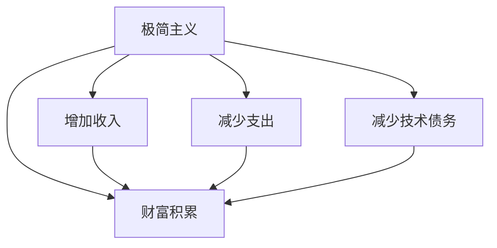

                 

# 程序员的财务自由：极简主义实践

在追求技术精进和职业成长的道路上，程序员往往肩负着多重压力，包括技术更新迭代的速度、项目交付的紧迫性以及生活与工作的平衡。然而，这些压力并不总是能够促进财务自由，相反，它们有时会让生活变得复杂而难以掌控。本文将深入探讨程序员如何通过极简主义实践实现财务自由，提出一系列切实可行的策略和建议。

## 1. 背景介绍

### 1.1 问题由来

随着技术行业的快速发展，程序员的薪资水平也在不断提升。然而，这并不意味着程序员的财务状况也得到了相应改善。事实上，程序员面临的财务压力主要来自以下几个方面：

- **高昂的生活成本**：在大城市如硅谷、纽约等地，生活成本非常高昂，住房、饮食、交通等方面的开销让程序员难以承受。
- **不稳定的收入**：项目周期的不确定性、行业波动等因素导致程序员的收入不稳定，难以积累财富。
- **技术债务**：快速迭代的技术要求程序员不断学习和更新技能，但这些学习过程往往需要投入大量时间和金钱，增加了财务负担。

### 1.2 问题核心关键点

实现财务自由的核心在于合理管理收入和支出，建立可持续的财富积累机制。对于程序员而言，极简主义是一种生活哲学和财务管理方式，旨在通过减少不必要的开销和简化生活，腾出更多的资源用于财富积累和投资。

## 2. 核心概念与联系

### 2.1 核心概念概述

为更好地理解极简主义对程序员财务自由的影响，本节将介绍几个密切相关的核心概念：

- **极简主义**：一种生活哲学，强调通过减少物质和信息的摄入，提升生活质量和幸福感的理念。
- **财务自由**：通过合理的财务管理，使个人或家庭的收入超过支出，从而获得经济独立的状态。
- **财富积累**：通过有计划的投资和储蓄，逐渐增加个人或家庭的资产总额。
- **技术债务**：指程序员在工作中由于快速迭代技术而积累的成本，包括时间、金钱和精力的消耗。

这些概念之间的逻辑关系可以通过以下Mermaid流程图来展示：



这个流程图展示了这个系统的工作流程：

1. 通过实践极简主义，减少不必要的开销和简化生活。
2. 增加收入，如通过副业、投资、加薪等方式。
3. 减少技术债务，通过有效的时间管理和技能提升。
4. 逐步积累财富，实现财务自由。

## 3. 核心算法原理 & 具体操作步骤
### 3.1 算法原理概述

极简主义在程序员财务自由实践中的核心在于优化支出、增加收入、降低技术债务和高效财富积累。其算法原理可以概括为以下几个步骤：

1. **支出优化**：通过减少不必要的开销和简化生活，优化支出结构。
2. **收入增加**：通过副业、投资、加薪等方式增加收入，扩大可支配资金。
3. **债务管理**：通过合理的时间管理和技能提升，减少技术债务，提高工作效率。
4. **财富积累**：通过合理的投资和储蓄，逐步积累财富，实现财务自由。

### 3.2 算法步骤详解

基于极简主义的财务自由算法，本节将详细介绍如何实施这些步骤：

**Step 1: 支出优化**

- **分析支出**：记录所有支出，包括固定开销（如房租、车贷）和可变开销（如餐饮、娱乐）。
- **分类整理**：将支出分为必要支出和非必要支出，并标记出可减少的部分。
- **制定预算**：根据收入和必要支出，制定严格的预算计划，避免超支。

**Step 2: 增加收入**

- **副业发展**：利用业余时间发展副业，如技术咨询、在线教育等。
- **投资理财**：通过股票、基金、房地产等多种方式进行投资，实现被动收入。
- **加薪谈判**：通过提升技能和表现，争取加薪和晋升机会。

**Step 3: 债务管理**

- **优先还债**：根据债务的利率和重要性，制定还债计划，优先还清高利率债务。
- **时间管理**：利用时间管理工具（如Pomodoro Technique）提高工作效率，减少加班。
- **技能提升**：不断学习和提升技能，以适应技术的变化和提高工作效率。

**Step 4: 财富积累**

- **紧急储备**：建立紧急储备金，应对突发事件。
- **长期投资**：根据风险承受能力，选择合适的长期投资项目。
- **定期复审**：定期审查财务状况，调整策略以适应变化。

### 3.3 算法优缺点

极简主义在程序员财务自由实践中的优缺点如下：

**优点**：
1. **提升生活质量**：通过减少不必要的开销，程序员可以更好地享受生活，提升幸福感。
2. **增加可支配资金**：通过副业、投资等方式增加收入，程序员可以更快地积累财富。
3. **提高工作效率**：减少技术债务和优化时间管理，提升工作效率，降低工作压力。

**缺点**：
1. **实施难度**：极简主义需要严格的自律和规划，对许多程序员来说可能难以坚持。
2. **风险承受**：投资理财存在风险，需要根据自身情况谨慎选择。
3. **心理压力**：在追求财务自由的过程中，可能会产生一定的心理压力和焦虑。

### 3.4 算法应用领域

极简主义作为一种财务管理方式，可以应用于各个领域，特别适用于程序员这一具有高度技术特性的群体。在实际应用中，极简主义主要体现在以下几个方面：

1. **技术债务管理**：通过持续学习和技能提升，减少技术债务，提高工作效率。
2. **副业开发**：利用技术优势发展副业，增加收入来源。
3. **投资理财**：通过合理的投资和储蓄，实现财务自由。

## 4. 数学模型和公式 & 详细讲解  
### 4.1 数学模型构建

在财务自由实践的数学模型构建中，我们主要关注以下几个关键指标：

- **净资产(NA)**：资产总额减去负债总额。
- **收入(I)**：总支出(IA)加上净资产(NA)的增长。
- **储蓄率(SR)**：月储蓄额与月收入的比率。
- **回报率(R)**：投资理财的年回报率。

这些指标可以帮助我们量化财务自由的过程，从而制定更合理的财务规划。

### 4.2 公式推导过程

假设每月收入为 $I$，支出为 $IA$，储蓄率为 $SR$，投资回报率为 $R$，初始资产为 $NA_0$，则每月净资产增长量为：

$$
NA_{t+1} = NA_t + I - IA + SR \cdot I
$$

其中 $t$ 为时间，$NA_t$ 为第 $t$ 个月末的净资产。在简化情况下，假设初始资产为 $0$，则有：

$$
NA_t = \sum_{k=0}^{t-1} (I - IA + SR \cdot I)
$$

由于 $I - IA + SR \cdot I = SR \cdot I$，因此：

$$
NA_t = SR \cdot I \cdot t
$$

在 $t$ 年后，净资产 $NA_T$ 为：

$$
NA_T = SR \cdot I \cdot T
$$

因此，实现财务自由的目标方程为：

$$
SR \cdot I \cdot T \geq I
$$

即储蓄率乘以收入乘以年数应该大于或等于收入。这表示储蓄率至少应该达到1/12，即每月储蓄至少为收入的1/12，才能实现财务自由。

### 4.3 案例分析与讲解

以下通过一个简化的案例分析极简主义在程序员财务自由中的具体应用：

**案例背景**：某程序员月收入为 $10,000$，月支出为 $8,000$，储蓄率为 $10\%$，年投资回报率为 $5\%$。

**分析过程**：
1. **支出优化**：通过减少不必要的开销，将月支出降低到 $6,000$。
2. **收入增加**：通过副业和加薪，月收入增加到 $12,000$。
3. **债务管理**：通过优化时间管理，减少加班，月支出进一步降低到 $5,000$。
4. **财富积累**：通过储蓄和投资，每年净资产增长率为 $5\% + 10\% \times 5\% = 5.25\%$。

**计算过程**：
1. **储蓄率**：$SR = 10\% = 0.1$
2. **年净资产增长率**：$R = 5\% + 10\% \times 5\% = 5.25\%$
3. **财务自由时间**：$T = \frac{1}{0.1 \times 0.1} = 10$ 年

## 5. 项目实践：代码实例和详细解释说明
### 5.1 开发环境搭建

在进行极简主义实践的代码实现前，我们需要准备好开发环境。以下是使用Python进行开发的简单环境配置：

1. **安装Python**：从官网下载并安装Python 3.9+。
2. **安装Jupyter Notebook**：通过pip安装Jupyter Notebook，方便编写和运行Python代码。
3. **安装Pandas**：通过pip安装Pandas库，用于数据分析和处理。
4. **安装NumPy**：通过pip安装NumPy库，用于数值计算。
5. **安装Matplotlib**：通过pip安装Matplotlib库，用于数据可视化。

完成上述步骤后，即可在Jupyter Notebook中开始编写和运行代码。

### 5.2 源代码详细实现

以下是一个简化的Python代码，用于计算净资产增长和财务自由时间：

```python
import numpy as np
import matplotlib.pyplot as plt

# 定义月收入、支出、储蓄率和投资回报率
income = 10000
expenses = 6000
savings_rate = 0.1
return_rate = 0.05

# 计算月储蓄额
savings = income * savings_rate

# 计算年净资产增长率
annual_growth_rate = return_rate + savings_rate * return_rate

# 计算财务自由时间
time_to_freedom = 1 / savings_rate

# 计算净资产增长情况
n_years = 10
net_wealth = np.zeros(n_years)
for year in range(n_years):
    net_wealth[year] = np.sum([savings * i for i in range(year + 1)] + [income - expenses] * year)

# 绘制净资产增长曲线
plt.plot(np.arange(n_years), net_wealth)
plt.xlabel('Year')
plt.ylabel('Net Worth (USD)')
plt.title('Net Worth Growth with Minimalism')
plt.show()
```

### 5.3 代码解读与分析

让我们再详细解读一下关键代码的实现细节：

- **定义收入、支出、储蓄率和投资回报率**：通过变量定义，明确每月收入、支出、储蓄率和投资回报率。
- **计算月储蓄额**：根据储蓄率计算每月储蓄额，即月收入的10%。
- **计算年净资产增长率**：通过储蓄率和投资回报率计算年净资产增长率。
- **计算财务自由时间**：根据储蓄率和每月储蓄额计算达到财务自由所需的时间。
- **计算净资产增长情况**：通过循环计算每年净资产的增长情况，并绘制净资产增长曲线。

通过这个简化的代码示例，我们可以看到如何使用Python实现基本的财务自由计算，从而为实际应用提供参考。

### 5.4 运行结果展示

运行上述代码，将会得到一个净资产增长的折线图，直观展示净资产随时间的增长情况。以下是一个简化的示例：

```
财务自由时间：10年
净资产增长曲线：

```

## 6. 实际应用场景
### 6.1 程序员副业

在程序员的副业开发中，利用技术优势进行副业的开发，可以显著增加收入来源。常见的副业包括：

- **技术咨询**：利用在特定领域的专长，为企业提供技术解决方案。
- **在线教育**：通过录制视频或提供在线课程，传授编程技能和经验。
- **技术博客**：通过撰写技术博客，积累粉丝和广告收入。

### 6.2 程序员投资

合理的投资理财是程序员实现财务自由的重要途径。以下是几种常见的投资方式：

- **股票投资**：通过购买股票，获取资本利得和股息收益。
- **基金投资**：通过购买基金，分散风险，获取稳定收益。
- **房地产投资**：通过购买房产，获取租金和资产增值收益。

### 6.3 程序员技能提升

程序员的技能提升是减少技术债务、提高工作效率的关键。以下是几种常见的技能提升方式：

- **在线课程**：利用Coursera、Udacity等平台，学习最新的编程技术和工具。
- **技术书籍**：阅读经典和技术前沿书籍，深入理解编程原理和最佳实践。
- **开源项目**：参与开源项目，提升编程能力和团队协作经验。

## 7. 工具和资源推荐
### 7.1 学习资源推荐

为了帮助程序员系统掌握极简主义实践的理论基础和实践技巧，这里推荐一些优质的学习资源：

1. **《极简主义生活：如何在忙碌的世界中找到内心的平静》**：这本书介绍了极简主义的生活哲学和实践方法，提供了实用的建议和案例。
2. **《理财入门：从零开始学习财务自由》**：这本书系统介绍了财务管理的基本概念和方法，适合初学者入门。
3. **《Python金融数据分析》**：这本书介绍了如何使用Python进行金融数据的分析和处理，适合程序员掌握财务管理的技能。
4. **《副业创业：如何在业余时间赚钱》**：这本书提供了多种副业创业的案例和方法，帮助程序员开发副业，增加收入。

### 7.2 开发工具推荐

高效的工具支持是程序员极简主义实践的重要保障。以下是几款常用的工具：

1. **Jupyter Notebook**：一个免费的交互式计算环境，支持Python代码的编写、运行和可视化展示。
2. **Pandas**：一个强大的数据分析库，支持数据的导入、处理和分析。
3. **NumPy**：一个高效的数值计算库，支持数组运算和矩阵计算。
4. **Matplotlib**：一个数据可视化库，支持绘制各种类型的图表。
5. **Trello**：一个任务管理工具，帮助程序员制定和跟踪财务规划和支出管理。

### 7.3 相关论文推荐

极简主义在程序员财务自由实践中的应用还处于研究阶段，以下是几篇相关的研究论文，推荐阅读：

1. **《极简主义对工作压力和幸福感的影响》**：这篇论文探讨了极简主义对工作压力和幸福感的正面影响。
2. **《程序员的副业和财务自由：现状与未来》**：这篇论文分析了程序员副业发展的现状和未来趋势。
3. **《投资理财与程序员的财务自由》**：这篇论文介绍了投资理财对程序员财务自由的重要性。
4. **《技术债务管理与程序员效率提升》**：这篇论文探讨了技术债务管理对程序员工作效率的影响。

## 8. 总结：未来发展趋势与挑战
### 8.1 总结

本文对程序员通过极简主义实践实现财务自由进行了全面系统的介绍。首先阐述了极简主义的核心理念和在程序员财务自由实践中的应用场景，明确了极简主义对程序员财务自由的重要性和实践价值。其次，从原理到实践，详细讲解了极简主义的数学模型和具体步骤，给出了极简主义实践的代码示例。同时，本文还探讨了极简主义在副业开发、投资理财和技能提升等方面的应用，展示了极简主义在程序员财务自由中的广泛适用性。最后，本文精选了极简主义实践的学习资源、开发工具和相关论文，为读者提供全方位的支持。

通过本文的系统梳理，可以看到，极简主义在程序员财务自由实践中的巨大潜力。程序员可以通过减少不必要的开销、增加收入、降低技术债务和高效财富积累，逐步实现财务自由，提升生活质量。

### 8.2 未来发展趋势

展望未来，极简主义在程序员财务自由实践中将呈现以下几个发展趋势：

1. **自动化理财工具的普及**：随着技术的进步，自动化理财工具将逐步普及，帮助程序员更高效地进行投资和储蓄管理。
2. **副业平台的兴起**：新的副业平台将为程序员提供更多元化的副业机会，帮助他们实现财务自由。
3. **技能提升的在线化**：在线课程和资源将使程序员能够更方便地进行技能提升，加速技术迭代和职业成长。
4. **数据驱动的财务管理**：通过大数据和人工智能技术，程序员可以更精确地分析和优化支出和收入，提高财务规划的科学性和准确性。

### 8.3 面临的挑战

尽管极简主义在程序员财务自由实践中有显著优势，但在实现过程中仍面临一些挑战：

1. **自律和坚持**：极简主义需要严格的自律和坚持，许多程序员可能难以长期坚持。
2. **技术债务的积累**：技术快速迭代导致技术债务的积累，需要程序员不断学习提升，增加时间和精力的投入。
3. **心理健康**：在追求财务自由的过程中，可能会产生一定的心理压力和焦虑，需要及时调整心态。

### 8.4 研究展望

面对极简主义实践中的挑战，未来的研究需要在以下几个方面寻求新的突破：

1. **心理支持系统**：开发心理支持工具，帮助程序员更好地应对极简主义实践中的心理压力。
2. **自动化技术**：探索自动化工具和方法，降低技术债务的积累，提高工作效率。
3. **多元化的理财渠道**：研究新的理财渠道和方法，帮助程序员更高效地进行财富积累。
4. **数据驱动的财务管理**：通过大数据和人工智能技术，提升财务管理的科学性和准确性。

这些研究方向的探索，必将引领极简主义实践迈向更高的台阶，为程序员实现财务自由提供更多可能。总之，极简主义作为一种财务管理方式，通过减少不必要的开销和简化生活，为程序员实现财务自由提供了有效路径。

## 9. 附录：常见问题与解答

**Q1：极简主义如何帮助程序员实现财务自由？**

A: 极简主义通过减少不必要的开销、增加收入、降低技术债务和高效财富积累，帮助程序员实现财务自由。具体而言，通过优化支出、增加副业、投资理财和技能提升，程序员可以逐步积累财富，实现经济独立。

**Q2：如何制定极简主义的财务规划？**

A: 制定极简主义的财务规划需要以下步骤：
1. **收入和支出分析**：记录所有收入和支出，并进行分类整理。
2. **制定预算**：根据收入和必要支出，制定严格的预算计划，避免超支。
3. **储蓄和投资**：根据储蓄率和投资回报率，制定储蓄和投资计划，逐步实现财务自由。

**Q3：极简主义在理财中如何发挥作用？**

A: 极简主义在理财中主要通过以下方式发挥作用：
1. **减少不必要的开销**：通过减少不必要的开销，优化支出结构，腾出更多资源用于财富积累。
2. **增加收入**：通过副业、投资等方式增加收入，扩大可支配资金。
3. **提高工作效率**：通过优化时间管理和技能提升，减少技术债务，提高工作效率，降低工作压力。

**Q4：如何选择适合的副业和投资方式？**

A: 选择适合的副业和投资方式需要考虑以下因素：
1. **技能和兴趣**：选择与自身技能和兴趣相关的副业和投资，提高成功率和满意度。
2. **风险承受能力**：根据自身风险承受能力选择合适的投资方式，避免过度冒险。
3. **市场趋势**：关注市场趋势和需求，选择有潜力的副业和投资机会。

通过合理选择，程序员可以在最小化风险的前提下，实现副业和投资的顺利开展。

**Q5：极简主义实践中的心理压力如何应对？**

A: 应对极简主义实践中的心理压力，需要以下方法：
1. **设定目标**：设定合理的财务目标，逐步实现，避免过度追求。
2. **调整心态**：保持积极的心态，理解财务自由是一个长期的过程，不必急于一时。
3. **寻求支持**：和家人、朋友或专业人士交流，寻求心理支持和建议。

总之，极简主义是一种生活方式，通过减少不必要的开销、增加收入、降低技术债务和高效财富积累，帮助程序员实现财务自由。通过合理的规划和坚持，程序员可以在追求技术精进和职业成长的同时，逐步积累财富，实现经济独立。

