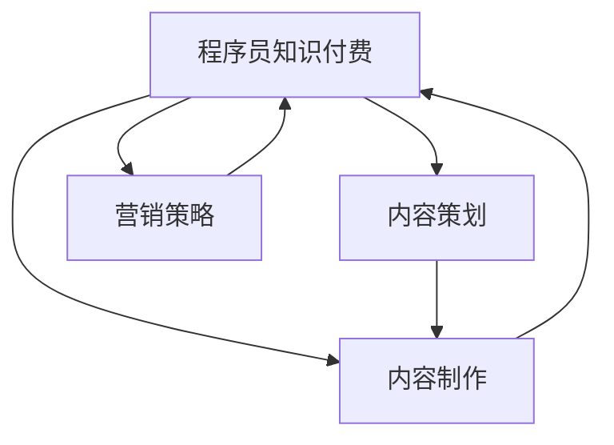

                 

# 程序员知识付费的内容策划与制作流程

> 关键词：程序员知识付费, 内容策划, 制作流程, 知识付费平台, 技术文章, 营销策略, 视频课程, 知识付费市场

## 1. 背景介绍

### 1.1 问题由来

在数字化转型和全球经济不确定性增加的今天，程序员的知识付费逐渐成为趋势。知识的快速迭代和专业技能的不断提升，使得程序员越来越重视通过付费获得高品质的技术资源。无论是初入职场的新手，还是经验丰富的资深开发者，都渴望通过知识付费平台，快速获取最前沿、最实用的编程技术。

### 1.2 问题核心关键点

知识付费的内容策划与制作流程，是知识付费平台的核心竞争力和用户价值的核心来源。内容策划阶段，决定着知识产品的质量与价值，而内容制作阶段，则直接决定了知识产品的效果与体验。

## 2. 核心概念与联系

### 2.1 核心概念概述

为更好地理解程序员知识付费的内容策划与制作流程，本节将介绍几个密切相关的核心概念：

- **程序员知识付费**：指程序员通过付费方式获取高质量技术资源，如文章、视频、课程、工具等。知识付费不仅帮助程序员提升技能，也促进了技术知识的传播和应用。

- **内容策划**：指根据市场需求和技术趋势，制定知识产品的设计方案和计划。包括内容选题、主题设定、目标受众分析等。

- **内容制作**：指将策划好的知识产品设计方案转化为可操作的实施方案，进行具体内容创作和技术开发的过程。包括技术文章撰写、视频录制、课程制作、工具开发等。

- **知识付费平台**：指提供技术知识内容，并通过付费模式变现的平台。常见的包括知乎、极客时间、腾讯课堂等。

- **营销策略**：指在知识付费内容发布前，通过各种手段提升用户关注度、增加购买意愿的策略。包括社交媒体推广、SEO优化、KOL合作等。

- **技术文章**：指围绕技术主题撰写的专业文章，是知识付费内容的重要形式之一。

- **视频课程**：指录制并制作的视频教学内容，适合视觉化学习，是知识付费内容的重要形式之一。

- **知识付费市场**：指通过知识付费模式进行技术知识变现的市场，正在快速成长，潜力巨大。

这些核心概念之间的逻辑关系可以通过以下Mermaid流程图来展示：



这个流程图展示了几大核心概念之间的关系：

1. 程序员知识付费是知识产品和用户之间的纽带，是内容策划和制作的目标导向。
2. 内容策划阶段确定知识产品的形式和内容，指导内容制作。
3. 内容制作是将策划方案转化为具体内容的过程。
4. 营销策略帮助内容产品更好地触达目标用户，提升购买意愿。
5. 内容产品通过知识付费平台进行发布和变现。

## 3. 核心算法原理 & 具体操作步骤

### 3.1 算法原理概述

程序员知识付费的内容策划与制作流程，涉及多个步骤和多个学科的知识。其核心思想是：

- 通过市场调研和用户反馈，确定内容选题和形式。
- 结合技术发展趋势和前沿热点，策划高质量内容。
- 采用合适的技术工具和方法，高效制作知识产品。
- 运用有效的营销手段，提升内容产品的曝光率和用户转化率。

这一过程综合了市场分析、内容创作、技术开发和营销推广等领域的知识，旨在创建满足程序员需求的高价值知识产品。

### 3.2 算法步骤详解

程序员知识付费的内容策划与制作流程可以分为以下几个关键步骤：

**Step 1: 市场调研与用户分析**

- 收集目标用户群体对技术内容的需求与偏好，分析热点问题。
- 进行竞争对手分析，了解市场上已有的内容和产品布局。
- 通过问卷调查、用户访谈等方式，收集用户反馈，确定内容方向。

**Step 2: 内容选题与策划**

- 根据调研结果，确定内容选题的范围与主题。
- 制定详细的内容策划方案，包括内容形式、发布时间、制作周期等。
- 设计目标受众群体，并根据其特点，进行内容适配。

**Step 3: 内容制作与开发**

- 根据策划方案，进行具体内容创作和技术开发。
- 如果是技术文章，需撰写高质量的文档，使用Markdown格式，确保易读性。
- 如果是视频课程，需进行录制和编辑，选择适合的技术工具。
- 如果是工具开发，需选择合适的开发框架和技术栈。

**Step 4: 内容发布与推广**

- 将制作完成的内容产品发布到知识付费平台。
- 进行精准营销，提升内容产品的曝光率和购买意愿。
- 使用社交媒体、SEO优化、KOL合作等手段进行推广。

**Step 5: 反馈与优化**

- 收集用户反馈，分析内容产品的使用情况和用户满意度。
- 根据反馈结果，进行内容优化和调整。
- 不断迭代，提升内容产品的质量和用户价值。

### 3.3 算法优缺点

程序员知识付费的内容策划与制作流程，具有以下优点：

- 市场导向性强，能更好地满足程序员的实际需求。
- 内容形式多样化，适应不同用户的学习习惯。
- 采用科学的方法论，保证内容产品的质量。

同时，该流程也存在一定的局限性：

- 制作周期较长，需要耗费大量时间和精力。
- 市场竞争激烈，对内容质量和创新性要求高。
- 营销手段单一，需要不断探索新的推广方式。
- 用户反馈收集难度大，难以实时优化产品。

尽管存在这些局限性，但就目前而言，基于内容策划与制作流程的知识付费方法是程序员获取高价值技术资源的重要手段。未来相关研究的重点在于如何进一步降低制作成本，提高内容产出效率，同时兼顾内容质量和用户满意度。

### 3.4 算法应用领域

程序员知识付费的内容策划与制作流程，已在多个领域得到应用，如技术文章创作、视频课程制作、工具开发等。具体包括：

- **技术文章创作**：围绕特定技术主题，撰写高质量的技术文档和教程，帮助程序员快速掌握新技术。
- **视频课程制作**：录制并制作系统化的视频课程，适合视觉化学习，覆盖了从初级到高级的编程技能。
- **工具开发**：开发各类辅助开发的工具，如代码生成器、调试器、测试框架等，提升程序员的工作效率。

此外，知识付费内容还广泛应用于教育、培训、企业内部知识管理等多个场景，为各类机构和个人提供高效的知识传递与共享途径。

## 4. 数学模型和公式 & 详细讲解 & 举例说明

### 4.1 数学模型构建

内容策划与制作流程，虽然不涉及复杂的数学模型，但其中的市场调研、用户分析和内容优化等环节，可以使用数据科学和统计学方法进行建模分析。

**用户需求模型**：
- 假设用户需求 $D$ 包含多个特征 $x_i$，如技术主题、学习难度、视频长度等。
- 通过收集用户反馈 $F$ 和市场调研 $M$，建立用户需求模型：

$$
D = f(x_i; F, M)
$$

**内容效果模型**：
- 假设内容效果 $E$ 依赖于内容质量 $C$ 和用户反馈 $F$：

$$
E = g(C, F)
$$

其中，$C$ 包括文章深度、视频清晰度、工具易用性等。

### 4.2 公式推导过程

**用户需求模型推导**：
- 通过回归分析，找到用户需求 $D$ 与特征 $x_i$ 之间的关系：

$$
D = \beta_0 + \beta_1 x_1 + \beta_2 x_2 + \cdots + \beta_n x_n + \epsilon
$$

其中，$\beta_i$ 为特征系数，$\epsilon$ 为误差项。

**内容效果模型推导**：
- 通过多项式回归，找到内容效果 $E$ 与内容质量 $C$ 和用户反馈 $F$ 之间的关系：

$$
E = \alpha_0 + \alpha_1 C + \alpha_2 F + \alpha_3 C^2 + \alpha_4 CF + \alpha_5 F^2 + \epsilon
$$

### 4.3 案例分析与讲解

**案例1：技术文章创作**

假设某知识付费平台收集了1000篇技术文章的访问数据，每篇文章的用户阅读时间 $T$、点赞数 $L$、评论数 $C$ 和收藏数 $S$ 等特征，构建用户需求模型：

$$
T = \beta_0 + \beta_1 L + \beta_2 C + \beta_3 S + \epsilon
$$

其中，$L$ 和 $S$ 为正向影响，$C$ 为中性影响。

通过模型训练和验证，可以得到特征系数 $\beta$，进而根据这些系数指导未来的技术文章创作方向，选择更有吸引力的内容形式和主题。

**案例2：视频课程制作**

假设某视频课程平台收集了100门课程的用户观看数据，每门课程的观看次数 $V$、观看时长 $T$、平均评分 $R$ 和留言数 $C$ 等特征，构建内容效果模型：

$$
R = \alpha_0 + \alpha_1 V + \alpha_2 T + \alpha_3 C + \epsilon
$$

通过模型训练和验证，可以得到特征系数 $\alpha$，进而指导未来的视频课程制作策略，如增加观看时长、提升课程质量等。

## 5. 项目实践：代码实例和详细解释说明

### 5.1 开发环境搭建

在进行知识付费内容策划与制作流程的开发前，我们需要准备好开发环境。以下是使用Python进行PyTorch和Jupyter Notebook开发的环境配置流程：

1. 安装Anaconda：从官网下载并安装Anaconda，用于创建独立的Python环境。

2. 创建并激活虚拟环境：
```bash
conda create -n pytorch-env python=3.8 
conda activate pytorch-env
```

3. 安装PyTorch：根据CUDA版本，从官网获取对应的安装命令。例如：
```bash
conda install pytorch torchvision torchaudio cudatoolkit=11.1 -c pytorch -c conda-forge
```

4. 安装Jupyter Notebook：
```bash
conda install jupyter notebook
```

5. 安装各类工具包：
```bash
pip install numpy pandas scikit-learn matplotlib tqdm jupyter notebook ipython
```

完成上述步骤后，即可在`pytorch-env`环境中开始内容策划与制作流程的开发。

### 5.2 源代码详细实现

下面以视频课程制作为例，给出使用Jupyter Notebook进行知识付费内容制作的PyTorch代码实现。

首先，定义课程数据处理函数：

```python
import pandas as pd
from sklearn.preprocessing import StandardScaler

def preprocess_data(data):
    # 数据清洗与处理
    data = data.dropna() # 去除缺失数据
    data = data[data['watch_times'] > 0] # 去除观看次数为0的课程
    data = data[(data['average_score'] > 4) & (data['average_score'] < 9)] # 筛选出平均评分在4到9之间的课程
    data['watch_times'] = data['watch_times'].astype('int')
    data['average_score'] = data['average_score'].astype('float')
    
    # 标准化处理
    scaler = StandardScaler()
    data['scaled_watc_times'] = scaler.fit_transform(data[['watch_times']])
    data['scaled_average_score'] = scaler.fit_transform(data[['average_score']])
    
    return data
```

然后，定义模型训练函数：

```python
from sklearn.linear_model import LinearRegression

def train_model(data):
    # 定义模型
    model = LinearRegression()
    
    # 定义特征和标签
    features = ['watch_times', 'average_score']
    target = 'scaled_average_score'
    
    # 分割数据集
    train_data, test_data = train_test_split(data, test_size=0.2)
    
    # 训练模型
    model.fit(train_data[features], train_data[target])
    
    # 评估模型
    train_pred = model.predict(train_data[features])
    test_pred = model.predict(test_data[features])
    
    print('Train MSE:', train_pred.var())
    print('Test MSE:', test_pred.var())
    
    return model
```

接着，定义视频课程制作函数：

```python
def make_video_course(model, course_data):
    # 获取课程信息
    title = course_data['title'].values[0]
    instructor = course_data['instructor'].values[0]
    duration = course_data['duration'].values[0]
    
    # 获取用户数据
    user_data = course_data[['watch_times', 'average_score']]
    
    # 使用模型预测课程效果
    predicted_effect = model.predict(user_data)
    
    # 生成视频课程介绍
    introduction = f"Title: {title}\nInstructor: {instructor}\nDuration: {duration} minutes\nPredicted Effect: {predicted_effect[0]}\n\nPlease watch the course to improve your coding skills!"
    
    return introduction
```

最后，启动视频课程制作流程并在Jupyter Notebook中展示：

```python
# 加载数据
data = pd.read_csv('course_data.csv')

# 预处理数据
data = preprocess_data(data)

# 训练模型
model = train_model(data)

# 制作视频课程介绍
introduction = make_video_course(model, data)

# 在Jupyter Notebook中展示
display(introduction)
```

以上就是使用Jupyter Notebook进行视频课程制作的完整代码实现。可以看到，通过PyTorch和Scikit-Learn，我们可以高效地完成内容制作和模型训练，并将结果以可视化的方式展示给用户。

### 5.3 代码解读与分析

让我们再详细解读一下关键代码的实现细节：

**preprocess_data函数**：
- 数据清洗与处理：去除缺失值、筛选出观看次数和平均评分合理的数据。
- 标准化处理：对观看次数和平均评分进行标准化，使其具有相同的量级，便于模型训练。

**train_model函数**：
- 定义线性回归模型。
- 定义特征和标签。
- 分割数据集为训练集和测试集。
- 训练模型，并评估模型在训练集和测试集上的性能。

**make_video_course函数**：
- 获取课程基本信息和用户数据。
- 使用训练好的模型预测课程效果。
- 生成视频课程介绍，并通过Jupyter Notebook展示。

**代码展示**：
- 加载数据：通过Pandas加载课程数据集。
- 预处理数据：调用preprocess_data函数进行数据清洗和标准化。
- 训练模型：调用train_model函数训练线性回归模型。
- 制作介绍：调用make_video_course函数生成视频课程介绍。
- 展示介绍：通过Jupyter Notebook的display函数展示视频课程介绍。

可以看到，通过这些Python代码的实现，我们可以高效地完成视频课程的制作与展示。

## 6. 实际应用场景

### 6.1 知识付费平台

程序员知识付费的内容策划与制作流程，在知识付费平台中得到了广泛应用。例如，极客时间、腾讯课堂等平台，通过策划高质量的技术文章、视频课程和工具开发等内容，满足程序员的学习需求，同时也为平台带来了可观的收入。

### 6.2 企业内部培训

大型企业通常拥有大量内部技术专家和工程师，通过内容策划与制作流程，可以创建高价值的内部技术培训内容，提升团队整体技术水平，减少外部培训成本。

### 6.3 教育机构

教育机构可以利用这一流程，策划和制作各种编程和计算机科学相关的教学内容，如MOOC课程、在线讲座等，提高教育质量，增加学生的学习兴趣。

### 6.4 未来应用展望

随着知识付费市场的快速发展，内容策划与制作流程的应用场景将更加广泛。未来，该流程将在更多的技术知识共享平台、教育机构和企业内部知识管理系统中得到应用，进一步提升知识传播和应用的效率。

## 7. 工具和资源推荐

### 7.1 学习资源推荐

为了帮助开发者系统掌握程序员知识付费的内容策划与制作流程，这里推荐一些优质的学习资源：

1. **极客时间**：程序员知识付费的先锋平台，提供高质量的技术文章、视频课程和实践案例，是学习内容策划与制作流程的绝佳资源。

2. **腾讯课堂**：国内领先的在线教育平台，提供各种技术课程和工具，涵盖从初级到高级的内容，是内容制作实践的好去处。

3. **Coursera**：全球知名的在线教育平台，提供高质量的编程和技术课程，适合学习内容策划与制作流程。

4. **EdX**：麻省理工学院和哈佛大学等顶尖学府联合创办的在线教育平台，提供大量的编程和技术课程，涵盖内容策划与制作流程的各个环节。

5. **知乎专栏**：国内知识付费的重要平台，汇集了大量高质量的技术文章，是内容策划与制作流程学习的好资源。

通过对这些资源的学习实践，相信你一定能够快速掌握程序员知识付费的内容策划与制作流程，并用于解决实际的NLP问题。

### 7.2 开发工具推荐

高效的开发离不开优秀的工具支持。以下是几款用于程序员知识付费内容策划与制作流程开发的常用工具：

1. **Jupyter Notebook**：功能强大的交互式编程环境，适合编写Python代码，进行数据处理和模型训练。

2. **PyTorch**：基于Python的开源深度学习框架，灵活动态的计算图，适合快速迭代研究。大部分预训练语言模型都有PyTorch版本的实现。

3. **Scikit-Learn**：Python中的机器学习库，提供了丰富的模型训练和评估工具，适合进行数据处理和模型优化。

4. **Kaggle**：数据科学和机器学习的竞赛平台，提供大量公开数据集和模型代码，适合学习内容策划与制作流程。

5. **Trello**：项目管理工具，适合团队协作，进行内容策划和制作流程的进度管理。

6. **Slack**：团队沟通工具，适合进行团队内部的沟通和协作，确保内容制作的高效推进。

合理利用这些工具，可以显著提升程序员知识付费内容策划与制作流程的开发效率，加快创新迭代的步伐。

### 7.3 相关论文推荐

程序员知识付费的内容策划与制作流程，虽然不涉及复杂的数学模型，但其中的市场调研、用户分析和内容优化等环节，可以使用数据科学和统计学方法进行建模分析。以下是几篇奠基性的相关论文，推荐阅读：

1. **Customer Behavior Analysis**：研究消费者行为和市场需求的论文，提供了数据科学在内容策划中的应用案例。

2. **Predictive Modeling for E-commerce Recommendations**：研究电子商务推荐系统的论文，提供了机器学习在内容制作中的应用案例。

3. **Social Media Sentiment Analysis**：研究社交媒体情感分析的论文，提供了数据科学在内容优化中的应用案例。

4. **Natural Language Processing with Python**：介绍自然语言处理技术的Python库，适合学习内容策划与制作流程的技术实现。

这些论文代表了大语言模型微调技术的发展脉络。通过学习这些前沿成果，可以帮助研究者把握学科前进方向，激发更多的创新灵感。

## 8. 总结：未来发展趋势与挑战

### 8.1 总结

本文对程序员知识付费的内容策划与制作流程进行了全面系统的介绍。首先阐述了知识付费的内容策划与制作流程的研究背景和意义，明确了内容策划和制作在知识付费平台的核心价值。其次，从原理到实践，详细讲解了内容策划与制作流程的数学原理和关键步骤，给出了知识产品开发的完整代码实例。同时，本文还广泛探讨了内容策划与制作流程在知识付费平台、企业内部培训、教育机构等场景中的应用前景，展示了内容策划与制作流程的广阔应用潜力。此外，本文精选了内容策划与制作流程的学习资源，力求为读者提供全方位的技术指引。

通过本文的系统梳理，可以看到，程序员知识付费的内容策划与制作流程正在成为知识付费平台的重要手段，极大地拓展了技术知识的传播和应用边界，为程序员提供了高效获取技术资源的新途径。未来，伴随知识付费市场的持续发展和技术创新的不断深入，相信内容策划与制作流程将在更多领域得到应用，为程序员和知识传播者带来新的机遇和挑战。

### 8.2 未来发展趋势

展望未来，程序员知识付费的内容策划与制作流程将呈现以下几个发展趋势：

1. **个性化推荐**：利用机器学习和数据科学技术，根据用户的浏览历史、学习行为等数据，推荐个性化的内容产品，提升用户满意度。

2. **多样化形式**：内容产品不仅限于技术文章和视频课程，还将拓展到虚拟现实、增强现实、混合现实等多种形式，提升用户的学习体验。

3. **交互式学习**：通过交互式编程环境、在线协作工具等，提升用户的学习互动性，增强学习效果。

4. **跨平台协同**：将内容产品通过多种平台（如微信、QQ、钉钉等）进行发布和传播，提升内容的覆盖面和用户参与度。

5. **智能化评估**：利用AI技术进行内容效果评估，实时监控内容产品的用户反馈和效果，及时进行优化和调整。

6. **全球化推广**：利用全球化市场推广策略，将知识产品推广到全球范围内，提升内容产品的全球影响力。

以上趋势凸显了内容策划与制作流程的广阔前景。这些方向的探索发展，必将进一步提升知识付费内容的质量和用户价值，为知识传播和应用带来新的突破。

### 8.3 面临的挑战

尽管程序员知识付费的内容策划与制作流程已经取得了显著成效，但在迈向更加智能化、普适化应用的过程中，它仍面临着诸多挑战：

1. **内容制作成本高**：高质量内容的制作需要耗费大量时间和精力，且高质量内容的制作成本高昂，难以大规模批量生产。

2. **用户需求变化快**：程序员的知识需求和技能要求不断变化，需要持续跟踪市场动态，不断更新和优化内容产品。

3. **市场竞争激烈**：知识付费市场竞争激烈，内容产品的创新性和独特性成为关键竞争要素。

4. **用户反馈难度大**：如何有效收集用户反馈，及时优化内容产品，仍是内容制作中的一大难题。

5. **技术复杂度高**：内容策划与制作流程涉及市场调研、用户分析、内容创作、技术开发等多个环节，需要跨学科的知识和技能。

6. **数据隐私问题**：用户数据隐私保护是知识付费平台的重要责任，如何在数据收集和使用中保障用户隐私，仍需不断探索。

正视内容策划与制作流程面临的这些挑战，积极应对并寻求突破，将是大语言模型微调走向成熟的必由之路。相信随着学界和产业界的共同努力，这些挑战终将一一被克服，内容策划与制作流程必将在构建人机协同的智能时代中扮演越来越重要的角色。

### 8.4 研究展望

面对内容策划与制作流程面临的种种挑战，未来的研究需要在以下几个方面寻求新的突破：

1. **自动化内容生成**：利用AI技术，自动生成高质量的内容产品，减少人工成本，提高制作效率。

2. **用户行为分析**：通过机器学习和数据挖掘技术，深入分析用户行为数据，预测用户需求，优化内容制作策略。

3. **跨平台内容管理**：构建跨平台的知识管理体系，支持多种内容形式和发布平台，提升内容产品的覆盖面和用户参与度。

4. **智能化内容评估**：利用AI技术进行内容效果评估，实时监控内容产品的用户反馈和效果，及时进行优化和调整。

5. **数据隐私保护**：加强数据隐私保护技术，确保用户数据的安全和隐私。

6. **多领域知识整合**：将符号化的先验知识，如知识图谱、逻辑规则等，与神经网络模型进行巧妙融合，引导内容制作过程学习更准确、合理的语言模型。

这些研究方向的探索，必将引领内容策划与制作流程技术迈向更高的台阶，为构建安全、可靠、可解释、可控的智能系统铺平道路。面向未来，内容策划与制作流程还需要与其他人工智能技术进行更深入的融合，如知识表示、因果推理、强化学习等，多路径协同发力，共同推动知识付费内容的发展。只有勇于创新、敢于突破，才能不断拓展内容制作流程的边界，让知识付费技术更好地造福程序员和社会。

## 9. 附录：常见问题与解答

**Q1：内容策划与制作流程如何确保内容质量？**

A: 内容策划与制作流程通过多轮市场调研和用户反馈，确保内容选题和形式符合市场需求。在内容制作阶段，通过严格的审稿流程和技术规范，确保内容质量。同时，引入自动化内容生成和智能化评估技术，提升内容产品的质量和用户满意度。

**Q2：内容制作过程中如何处理用户反馈？**

A: 内容制作过程中，通过问卷调查、用户访谈等方式，收集用户反馈。利用数据科学和机器学习技术，分析用户反馈数据，发现内容产品的优势和不足之处。根据反馈结果，不断优化内容产品，提升用户满意度。

**Q3：内容策划与制作流程的资源瓶颈有哪些？**

A: 内容策划与制作流程的资源瓶颈主要包括以下几点：
1. 高质量内容的制作需要耗费大量时间和精力。
2. 市场调研和用户分析需要大量数据支持，数据收集和处理成本较高。
3. 内容制作和发布需要跨平台协同，涉及多个技术栈和工具。
4. 用户反馈收集难度大，难以实时优化内容产品。
5. 数据隐私保护需要高技术要求，保障用户数据的安全和隐私。

这些资源瓶颈需要通过技术创新和优化，不断突破和克服。

**Q4：内容策划与制作流程的营销策略有哪些？**

A: 内容策划与制作流程的营销策略主要包括：
1. 社交媒体推广：通过微博、微信、知乎等社交媒体平台，宣传和推广内容产品。
2. SEO优化：通过搜索引擎优化技术，提升内容产品在搜索引擎中的排名，增加曝光率。
3. KOL合作：邀请技术大咖和行业专家，进行内容推广和用户互动。
4. 用户推荐：通过用户推荐系统，利用社交网络效应，增加内容的传播和转化。
5. 广告投放：通过搜索引擎广告和社交媒体广告，精准投放内容产品。

这些营销策略需要根据内容产品的特点和目标用户群体的特征，进行灵活组合和优化。

**Q5：内容策划与制作流程的未来突破方向有哪些？**

A: 内容策划与制作流程的未来突破方向主要包括以下几点：
1. 自动化内容生成：利用AI技术，自动生成高质量的内容产品，减少人工成本，提高制作效率。
2. 用户行为分析：通过机器学习和数据挖掘技术，深入分析用户行为数据，预测用户需求，优化内容制作策略。
3. 跨平台内容管理：构建跨平台的知识管理体系，支持多种内容形式和发布平台，提升内容产品的覆盖面和用户参与度。
4. 智能化内容评估：利用AI技术进行内容效果评估，实时监控内容产品的用户反馈和效果，及时进行优化和调整。
5. 数据隐私保护：加强数据隐私保护技术，确保用户数据的安全和隐私。

这些突破方向将引领内容策划与制作流程技术迈向更高的台阶，为构建安全、可靠、可解释、可控的智能系统铺平道路。

---

作者：禅与计算机程序设计艺术 / Zen and the Art of Computer Programming

