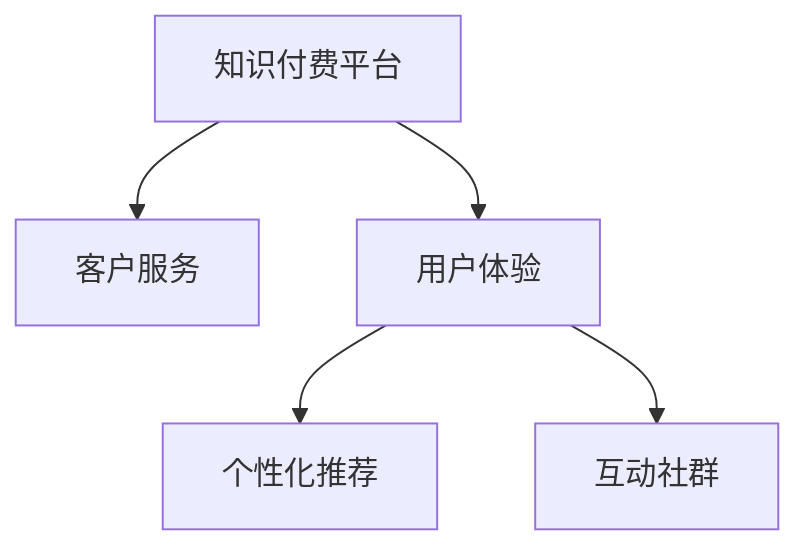

                 

# 程序员知识付费的客户服务与用户体验

## 1. 背景介绍

### 1.1 问题由来

随着互联网技术的发展和普及，越来越多的程序员开始通过在线平台进行知识付费。无论是初级开发者还是资深专家，都希望能通过知识分享，实现个人价值增长和职业发展。然而，随着知识付费市场的逐渐成熟，用户对于服务质量、体验和价值的要求也在不断提升。如何提供高品质的客户服务，增强用户体验，成为在线知识平台面临的一项重大挑战。

### 1.2 问题核心关键点

客户服务的核心在于提供精准、高效、个性化的解决方案，以满足用户的多样化需求。在知识付费领域，客户服务主要体现在以下几个方面：

- **内容质量**：课程内容的深度、广度和实用性。
- **技术支持**：技术疑难解答和问题解决。
- **学习体验**：互动交流和社群支持。
- **用户满意度**：最终学习效果和价值反馈。

本文将聚焦于知识付费平台的客户服务和用户体验优化，从核心概念、算法原理、具体操作步骤到实际应用场景，全面探讨如何构建一个高效、可靠的程序员知识付费生态系统。

## 2. 核心概念与联系

### 2.1 核心概念概述

为更好地理解程序员知识付费的客户服务与用户体验优化，本节将介绍几个密切相关的核心概念：

- **知识付费平台**：基于互联网的付费知识分享平台，提供各类编程、技术、工具等领域的课程和资料。
- **客户服务**：平台对用户的咨询、反馈和投诉进行响应、处理和跟进，以提升用户满意度和平台黏性。
- **用户体验**：用户在平台上的使用体验，包括界面设计、交互流畅性、学习效果等。
- **个性化推荐**：通过数据分析和机器学习技术，为用户推荐感兴趣的课程和学习内容。
- **互动社群**：用户之间的交流互动，通过讨论、答疑、项目协作等方式形成社区氛围。

这些核心概念之间的逻辑关系可以通过以下Mermaid流程图来展示：



这个流程图展示了这个生态系统的核心组成及其相互关系：

1. 知识付费平台是服务提供者，负责内容和服务的供给。
2. 客户服务是连接平台与用户的桥梁，负责解决用户问题和提升满意度。
3. 用户体验是用户与平台交互的直接感受，直接影响用户的留存和口碑。
4. 个性化推荐和互动社群则是提升用户体验的重要手段。

## 3. 核心算法原理 & 具体操作步骤
### 3.1 算法原理概述

程序员知识付费平台的客户服务和用户体验优化，本质上是一个基于用户行为数据的推荐系统构建过程。其核心思想是：通过分析用户的交互数据和行为模式，构建个性化的用户画像，使用机器学习算法对课程进行推荐，同时通过客服机器人等技术手段提供即时响应和问题解决。

形式化地，假设知识付费平台有用户集合 $U$，课程集合 $C$，互动行为集合 $B$，通过收集用户在平台上的交互数据 $D$，定义推荐模型 $M$，目标是在用户选择课程 $C$ 的过程中，最小化用户流失率 $\eta$，即：

$$
\min_{M} \eta = P(\text{流失})
$$

其中 $P(\text{流失})$ 表示用户在某个时刻流失的概率。

### 3.2 算法步骤详解

基于用户行为数据的推荐系统一般包括以下几个关键步骤：

**Step 1: 数据收集与预处理**

- 收集平台用户的行为数据，包括但不限于访问记录、购买行为、课程评分等。
- 对数据进行清洗和归一化，去除噪音和异常值，生成用户行为特征向量。

**Step 2: 用户画像构建**

- 使用机器学习算法（如协同过滤、矩阵分解等）构建用户兴趣向量。
- 对用户画像进行实时更新和维护，以便更好地反映用户最新兴趣。

**Step 3: 课程内容表示**

- 对课程进行特征抽取，生成课程特征向量。
- 使用相似度计算方法（如余弦相似度、Jaccard系数等）计算课程向量间的相似度。

**Step 4: 推荐算法设计**

- 基于用户画像和课程特征向量，设计推荐算法。
- 可以使用基于排序的推荐算法（如Top-N推荐、矩阵分解等），也可以使用基于学习的推荐算法（如协同过滤、深度学习等）。

**Step 5: 个性化推荐**

- 根据用户画像和课程特征向量，通过推荐算法生成个性化推荐列表。
- 实时更新推荐结果，以适应用户兴趣的变化。

**Step 6: 客户服务响应**

- 使用自然语言处理技术，开发客服机器人。
- 通过智能路由将用户咨询路由至合适的客服人员或自助解答。
- 对用户反馈进行记录和分析，不断优化客服流程和质量。

**Step 7: 用户满意度评估**

- 收集用户对课程和服务的满意度反馈。
- 定期进行用户体验调查，评估推荐系统的效果。
- 根据用户反馈调整和优化推荐算法。

以上是基于用户行为数据的推荐系统的一般流程。在实际应用中，还需要针对具体平台的特点，对推荐过程的各个环节进行优化设计，如改进数据采集和用户画像模型，引入更多的用户行为特征，搜索最优的推荐算法组合等，以进一步提升推荐效果。

### 3.3 算法优缺点

基于用户行为数据的推荐系统具有以下优点：

1. 个性化推荐。通过分析用户行为数据，能够实现精准的个性化推荐，提升用户满意度。
2. 实时响应。利用机器学习算法，推荐系统可以实时更新推荐结果，快速响应用户需求变化。
3. 用户留存率高。个性化推荐和即时客服能够显著提升用户体验，提高用户留存率。

同时，该方法也存在一定的局限性：

1. 数据隐私问题。用户行为数据的收集和使用可能涉及隐私问题，需要严格遵守数据保护法规。
2. 数据噪声。平台上的数据可能存在噪声和异常值，影响推荐精度。
3. 冷启动问题。对于新用户和新课程，推荐效果可能不佳，需要更多的用户行为数据。
4. 算法复杂性。推荐算法的设计和实现较为复杂，需要专业的数据科学和算法背景。

尽管存在这些局限性，但就目前而言，基于用户行为数据的推荐方法仍然是知识付费平台客户服务和用户体验优化的主流范式。未来相关研究的重点在于如何进一步降低数据收集的成本和复杂度，提高推荐算法的准确性和效率，同时兼顾用户隐私和数据安全等因素。

### 3.4 算法应用领域

基于用户行为数据的推荐系统在知识付费平台的应用广泛，覆盖了几乎所有常见场景，例如：

- 课程推荐：根据用户浏览历史、课程评分等数据，推荐用户感兴趣的课程。
- 问题解答：利用自然语言处理技术，提供课程相关的技术答疑和疑难解答。
- 项目协作：通过社区论坛或协作工具，促进用户之间的项目协作和学习交流。
- 课程定制：根据用户需求和偏好，定制个性化的学习计划和课程组合。
- 内容聚合：聚合用户对课程和资料的评价反馈，形成课程排行榜和推荐列表。

除了上述这些经典应用外，基于用户行为数据的推荐系统还被创新性地应用到更多场景中，如直播课程互动、学习进度追踪、个性化学习路径等，为知识付费平台的运营提供了新的思路和工具。

## 4. 数学模型和公式 & 详细讲解 & 举例说明
### 4.1 数学模型构建

本节将使用数学语言对基于用户行为数据的推荐系统进行更加严格的刻画。

假设知识付费平台有用户集合 $U=\{u_1,u_2,\dots,u_N\}$，课程集合 $C=\{c_1,c_2,\dots,c_M\}$，互动行为集合 $B=\{b_{ij}\}_{i,j=1}^{N,M}$，其中 $b_{ij}$ 表示用户 $u_i$ 对课程 $c_j$ 的评分或互动行为。

定义用户行为向量 $x_u \in \mathbb{R}^M$，课程内容向量 $x_c \in \mathbb{R}^M$，则用户对课程 $c_j$ 的评分可以表示为：

$$
\hat{y}_{uj} = \begin{cases} 
0 & b_{uj} = \text{未评分} \\
x_u^T x_c & b_{uj} = \text{已评分} 
\end{cases}
$$

推荐模型的目标是最小化预测评分与实际评分的差距，即：

$$
\min_{\theta} \sum_{i=1}^N \sum_{j=1}^M \ell(\hat{y}_{uj}, y_{uj})
$$

其中 $\theta$ 为推荐模型的参数，$\ell$ 为评分预测的损失函数，通常使用均方误差或对数损失。

### 4.2 公式推导过程

以下我们以Top-N推荐算法为例，推导推荐模型的评分预测公式。

假设知识付费平台对每个用户 $u_i$ 维护一个Top-N推荐列表，推荐列表中的课程顺序由预测评分 $\hat{y}_{uj}$ 决定。推荐模型 $M$ 的评分预测函数可以表示为：

$$
\hat{y}_{uj} = \mathbb{E}[M(x_u, x_c, \theta)]
$$

其中 $M(x_u, x_c, \theta)$ 为基于用户和课程的特征表示的评分预测函数。

在得到评分预测函数后，可以通过评分预测函数和实际评分之间的误差，定义推荐模型的损失函数：

$$
\mathcal{L}(\theta) = \frac{1}{N}\sum_{i=1}^N \frac{1}{M}\sum_{j=1}^M \ell(\hat{y}_{uj}, y_{uj})
$$

通过最小化损失函数，可以更新推荐模型的参数 $\theta$，从而不断优化推荐效果。

### 4.3 案例分析与讲解

以一个实际案例来说明基于用户行为数据的推荐系统如何在知识付费平台上应用。

假设某知识付费平台有5000名用户，每个用户会根据自己的兴趣和需求，在平台上浏览、评分、购买或参与讨论多个课程。通过对这些行为数据进行分析，平台可以构建每个用户的兴趣向量，并生成各课程的特征向量。

通过协同过滤算法，平台可以根据用户兴趣向量和课程特征向量，计算各课程的预测评分，并按照评分从高到低排序，生成每个用户的Top-5推荐课程列表。

例如，用户 $u_1$ 对课程 $c_1$、$c_2$、$c_3$ 分别给出4分、5分、3分的高评分，而对课程 $c_4$ 和 $c_5$ 未评分。假设协同过滤模型将课程 $c_1$ 预测为用户 $u_1$ 喜欢的课程，则 $u_1$ 的Top-5推荐列表为 $c_1$、$c_2$、$c_3$、$c_4$、$c_5$。

此外，平台还可以通过自然语言处理技术，开发客服机器人，为用户提供课程相关的技术答疑和疑难解答。例如，用户 $u_1$ 在课程 $c_1$ 的评论区留言：“请问如何理解函数指针？”，客服机器人会分析问题并给出回答：“函数指针是一个指向函数的指针，可以用于实现函数调用、回调等操作。”

## 5. 项目实践：代码实例和详细解释说明
### 5.1 开发环境搭建

在进行推荐系统实践前，我们需要准备好开发环境。以下是使用Python进行Scikit-learn和TensorFlow开发的推荐系统环境配置流程：

1. 安装Anaconda：从官网下载并安装Anaconda，用于创建独立的Python环境。

2. 创建并激活虚拟环境：
```bash
conda create -n recsys-env python=3.8 
conda activate recsys-env
```

3. 安装必要的依赖库：
```bash
pip install scikit-learn tensorflow pandas
```

4. 安装推荐系统工具包：
```bash
pip install recsys
```

完成上述步骤后，即可在`recsys-env`环境中开始推荐系统实践。

### 5.2 源代码详细实现

这里我们以协同过滤算法为例，给出使用Scikit-learn和TensorFlow对推荐系统进行开发的Python代码实现。

首先，定义协同过滤算法和推荐模型：

```python
from sklearn.metrics.pairwise import cosine_similarity
from sklearn.decomposition import TruncatedSVD
from tensorflow.keras.layers import Input, Embedding, Dot, Dense, Model
from tensorflow.keras.models import Model

def build_cf_model(user_idx, item_idx, user_vector, item_vector, similarity):
    user_vector = Embedding(user_idx + 1, 100, input_length=1)(user_vector)
    item_vector = Embedding(item_idx + 1, 100, input_length=1)(item_vector)
    dot_product = Dot(axes=(2,2), normalize=True)([user_vector, item_vector])
    dot_product = Dense(1)(dot_product)
    model = Model(inputs=[user_vector, item_vector], outputs=dot_product)
    return model

# 协同过滤模型
def train_cf_model(train_user, train_item, train_score, user_idx, item_idx, rank):
    user_vector = train_user.toarray()
    item_vector = train_item.toarray()
    similarity = cosine_similarity(user_vector, item_vector)
    svd = TruncatedSVD(rank, random_state=42)
    svd.fit(similarity)
    user_vector = svd.transform(user_vector)
    item_vector = svd.transform(item_vector)
    model = build_cf_model(user_idx, item_idx, user_vector, item_vector, similarity)
    model.compile(optimizer='adam', loss='mse')
    model.fit([train_user, train_item], train_score, epochs=20, batch_size=64)
    return model
```

然后，定义数据加载和处理函数：

```python
from scipy.sparse import load_npz
import numpy as np
import pandas as pd

# 定义数据加载函数
def load_data(path):
    user_idx = load_npz(path + '_u_idx.npz')['arr_0']
    item_idx = load_npz(path + '_i_idx.npz')['arr_0']
    user_vector = load_npz(path + '_u_vector.npz')['arr_0']
    item_vector = load_npz(path + '_i_vector.npz')['arr_0']
    user_vector = np.reshape(user_vector, (len(user_vector), 1))
    item_vector = np.reshape(item_vector, (len(item_vector), 1))
    return user_idx, item_idx, user_vector, item_vector

# 定义数据处理函数
def process_data(data_path):
    user_idx, item_idx, user_vector, item_vector = load_data(data_path)
    # 对稀疏矩阵进行二值化处理
    train_user = user_idx[np.where(data['train'] == 1)].toarray()
    train_item = item_idx[np.where(data['train'] == 1)].toarray()
    train_score = data['train'].toarray()
    test_user = user_idx[np.where(data['test'] == 1)].toarray()
    test_item = item_idx[np.where(data['test'] == 1)].toarray()
    test_score = data['test'].toarray()
    return train_user, train_item, train_score, test_user, test_item, test_score
```

最后，启动训练流程并在测试集上评估：

```python
# 加载数据集
train_user, train_item, train_score, test_user, test_item, test_score = process_data('data_path')

# 定义模型参数
rank = 50

# 训练协同过滤模型
model = train_cf_model(train_user, train_item, train_score, len(user_idx), len(item_idx), rank)

# 测试模型效果
test_score_pred = model.predict([test_user, test_item])
print('测试集RMSE:', np.sqrt(np.mean(((test_score - test_score_pred)**2)))
```

以上就是使用Scikit-learn和TensorFlow对推荐系统进行开发的完整代码实现。可以看到，Scikit-learn和TensorFlow的结合使得推荐系统的开发变得简洁高效，开发者可以将更多精力放在数据处理和模型优化上。

### 5.3 代码解读与分析

让我们再详细解读一下关键代码的实现细节：

**load_data函数**：
- 加载训练集和测试集的稀疏矩阵和向量。

**process_data函数**：
- 对稀疏矩阵进行二值化处理，生成训练集和测试集的矩阵和向量。
- 将训练集和测试集划分为用户和课程向量，以及评分矩阵。

**train_cf_model函数**：
- 使用TruncatedSVD对用户和课程的相似度矩阵进行降维，生成用户和课程的稀疏表示。
- 构建协同过滤模型，使用训练集数据拟合模型参数。

**代码解读与分析**：
- 协同过滤算法是一种基于用户和物品相似性的推荐方法，能够有效捕捉用户和物品间的隐式关联，适用于数据量较小的推荐系统。
- 在实际应用中，协同过滤算法需要定期更新用户和物品的相似度矩阵，保持模型的时效性。
- 协同过滤算法的计算复杂度较高，对于大规模数据集可能面临计算瓶颈，需要考虑分布式计算等优化方法。

## 6. 实际应用场景
### 6.1 智能课程推荐

知识付费平台的核心功能之一是智能课程推荐。通过分析用户的历史行为和评分数据，推荐平台能够为用户推荐最感兴趣的课程。例如，一个Java程序员用户浏览了多个Java相关课程，平台会根据他的浏览历史和评分，推荐相关的高级课程和框架课程。

在技术实现上，可以使用协同过滤、深度学习等算法对用户行为数据进行建模，并实时生成推荐列表。推荐结果的展示也需要精心设计，如通过轮播图、滚动条等方式呈现，提升用户体验。

### 6.2 智能客服系统

知识付费平台需要提供快速、准确的客户服务，以应对用户的咨询和问题。智能客服系统利用自然语言处理技术，通过客服机器人为用户提供24/7的服务。

在技术实现上，可以通过预训练的对话模型，结合用户的历史互动记录和当前输入，生成最合适的回复。例如，用户咨询“如何安装Python”，客服机器人会根据用户的历史提问记录和预训练的Python知识库，生成详细的安装步骤和注意事项。

### 6.3 课程内容评估

用户对课程的评价和反馈是知识付费平台的重要数据来源，可以用于课程内容的优化和推荐系统的调整。平台可以根据用户评分和评论内容，生成课程的平均评分和质量评估，为课程的选择和推广提供参考。

在技术实现上，可以使用自然语言处理技术对用户评论进行情感分析，并结合课程评分生成综合评价。例如，一个课程的平均评分为4.8分，用户评论普遍称赞课程内容深入浅出、实例丰富，则该课程被视为高质量课程，平台可以给予优先推荐。

### 6.4 未来应用展望

随着推荐系统技术的不断发展，基于用户行为数据的推荐方法将在知识付费平台中得到更广泛的应用。未来，推荐系统将不仅仅局限于课程推荐，还将扩展到内容推送、社区互动、活动策划等多个场景。

在智能课程推荐方面，未来的推荐系统将更加注重个性化和时效性，通过实时更新的推荐结果，满足用户多样化的学习需求。例如，平台可以根据用户的学习进度和反馈，动态调整推荐策略，提供更有针对性的学习路径。

在智能客服系统方面，未来的客服机器人将更加智能和人性化，能够理解复杂的用户需求，提供更贴近实际的问题解决方案。例如，通过多轮对话理解和上下文分析，客服机器人可以更准确地理解用户问题，并给出更准确的回答。

在课程内容评估方面，未来的课程评估系统将更加全面和细致，通过情感分析、内容分析等技术手段，深度挖掘用户反馈中的有用信息。例如，平台可以通过分析用户评论中的关键短语和情感倾向，识别课程的优势和不足之处，指导课程的改进和优化。

总之，基于用户行为数据的推荐系统将在知识付费平台中扮演越来越重要的角色，为平台提供高效的个性化推荐和智能客服服务，提升用户体验和满意度。

## 7. 工具和资源推荐
### 7.1 学习资源推荐

为了帮助开发者系统掌握推荐系统的理论基础和实践技巧，这里推荐一些优质的学习资源：

1. 《推荐系统实战》书籍：该书系统介绍了推荐系统的理论基础、算法实现和工程实践，适合有一定编程基础的读者。

2. 《Python推荐系统实战》课程：Coursera开设的推荐系统在线课程，由业界专家授课，内容覆盖推荐系统的基础算法和实际应用。

3. 《机器学习实战》书籍：该书介绍了机器学习的基本原理和算法实现，适合初学者和进阶读者。

4. Kaggle推荐系统竞赛：Kaggle上提供的推荐系统竞赛，通过实践锻炼推荐系统开发能力，积累项目经验。

5. RecSys社区：RecSys社区提供了丰富的推荐系统研究论文和开源代码，是学习推荐系统技术的重要资源。

通过对这些资源的学习实践，相信你一定能够快速掌握推荐系统的精髓，并用于解决实际的推荐问题。

### 7.2 开发工具推荐

高效的开发离不开优秀的工具支持。以下是几款用于推荐系统开发的常用工具：

1. Scikit-learn：基于Python的机器学习库，提供了丰富的推荐算法和评估指标，适合进行推荐系统的算法实现和评估。

2. TensorFlow：由Google主导开发的深度学习框架，生产部署方便，适合构建大规模推荐系统。

3. PyTorch：基于Python的深度学习框架，灵活动态，适合研究和实验性质的推荐系统开发。

4. Redis：高性能内存数据库，用于存储推荐系统的用户行为数据和评分数据，支持分布式计算。

5. Elasticsearch：分布式搜索引擎，用于存储和查询推荐系统的用户行为数据和课程数据，支持高并发的数据查询。

6. NLP库：如NLTK、spaCy等，用于处理和分析用户评论和课程内容。

合理利用这些工具，可以显著提升推荐系统的开发效率，加快创新迭代的步伐。

### 7.3 相关论文推荐

推荐系统领域的研究不断推陈出新，以下是几篇奠基性的相关论文，推荐阅读：

1. "Collaborative Filtering for Implicit Feedback Datasets"（2006）：提出了基于矩阵分解的协同过滤算法，是推荐系统领域的经典之作。

2. "Wisdom of the Crowds for Collaborative Filtering"（2002）：提出了基于用户和物品评分的信息池化方法，提高了推荐系统的准确性和稳定性。

3. "Different Lenses for Implicit Feedback"（2006）：研究了不同类型隐式反馈数据对推荐算法的影响，提出了多项改进方法。

4. "Beyond Recommendation: Towards Smart Recommendation"（2014）：探讨了推荐系统未来的发展方向，强调了机器学习和自然语言处理技术在推荐系统中的应用。

5. "Deep Neural Networks for Large-Scale Recommender Systems: A Review and Outlook"（2016）：综述了深度学习在推荐系统中的应用，提供了深入的理论和算法分析。

这些论文代表了这个领域的核心进展，通过学习这些前沿成果，可以帮助研究者把握推荐系统的发展脉络，激发更多的创新灵感。

## 8. 总结：未来发展趋势与挑战

### 8.1 总结

本文对基于用户行为数据的推荐系统进行了全面系统的介绍。首先阐述了推荐系统在知识付费平台中的重要性和应用场景，明确了推荐系统优化客户服务和用户体验的关键点。其次，从核心概念、算法原理、具体操作步骤到实际应用场景，详细讲解了推荐系统构建的基本流程和关键技术。

通过本文的系统梳理，可以看到，基于用户行为数据的推荐系统正在成为知识付费平台客户服务和用户体验优化的重要手段。利用推荐算法，平台可以精准预测用户需求，快速响应用户咨询，提升用户满意度和留存率。未来的推荐系统将在个性化、实时性和智能化等方面不断进步，为知识付费平台的运营提供更多支持和价值。

### 8.2 未来发展趋势

展望未来，推荐系统将在知识付费平台中呈现出以下几个发展趋势：

1. 实时个性化推荐。基于用户的实时行为数据，动态调整推荐策略，提供更加精准和个性化的推荐结果。

2. 多模态融合。结合文本、图像、视频等多模态数据，增强推荐系统的理解和表达能力，提升推荐效果。

3. 模型融合与集成。利用多个推荐模型的优势，通过模型融合和集成技术，提高推荐系统的准确性和鲁棒性。

4. 社交网络增强。利用社交网络信息，引入社会关系因素，增强推荐系统的泛化能力和推荐效果。

5. 跨域推荐。突破知识付费平台的限制，将推荐系统应用于更广泛的领域，如社交网络、电商等，实现跨领域推荐。

6. 用户参与设计。让用户参与推荐算法的训练和优化，通过A/B测试等方法，不断迭代推荐系统的效果。

以上趋势凸显了推荐系统技术的广阔前景。这些方向的探索发展，必将进一步提升推荐系统的精准度和用户满意度，为知识付费平台带来更多的用户价值。

### 8.3 面临的挑战

尽管推荐系统技术已经取得了显著进展，但在迈向更加智能化、个性化应用的过程中，它仍面临着诸多挑战：

1. 数据质量和完整性。推荐系统依赖大量数据，数据缺失或不完整会影响推荐效果。如何获取高质量、完整的数据，是推荐系统的重要挑战。

2. 数据隐私和安全。用户行为数据的收集和使用涉及隐私问题，如何保护用户数据安全，防止数据泄露和滥用，是推荐系统需要解决的重大问题。

3. 冷启动问题。对于新用户和新课程，推荐系统可能缺乏足够的数据，导致推荐效果不佳。如何快速适应新用户和新课程，是推荐系统面临的难题。

4. 算法复杂性。推荐系统的算法设计和实现较为复杂，需要专业的数据科学和算法背景。如何简化算法流程，提高开发效率，是推荐系统需要不断优化的方向。

5. 系统可扩展性。推荐系统需要处理大规模数据和实时数据流，如何设计高效可扩展的系统架构，是推荐系统面临的重要挑战。

6. 用户多样性和个性化。不同用户具有不同的需求和偏好，如何设计多样化的推荐策略，满足用户的多样化需求，是推荐系统需要不断优化的方向。

这些挑战需要在技术、数据、应用等多个层面进行综合考虑和解决，方能构建高效、可靠、智能化的推荐系统。

### 8.4 研究展望

面对推荐系统面临的挑战，未来的研究需要在以下几个方面寻求新的突破：

1. 无监督和半监督推荐方法。摆脱对大规模标注数据的依赖，利用无监督或半监督学习范式，最大化数据利用率。

2. 知识图谱和跨模态融合。将知识图谱、跨模态数据等外部的先验知识，与推荐系统进行结合，增强系统的推理和泛化能力。

3. 个性化推荐与多样性平衡。在追求个性化推荐的同时，避免数据偏见，引入多样性平衡机制，保障推荐结果的多样性和公正性。

4. 分布式计算与存储优化。针对大规模数据集和实时数据流，设计高效分布式计算和存储方案，保证推荐系统的高效性和稳定性。

5. 推荐系统与个性化定制。将推荐系统与个性化定制服务相结合，提供更加多样化的推荐和个性化的服务，提升用户满意度和黏性。

6. 推荐系统的伦理道德。在推荐系统设计中引入伦理导向的指标和约束，确保推荐结果的公正性和合理性，避免误导性推荐。

这些研究方向的探索，必将引领推荐系统技术迈向更高的台阶，为知识付费平台的运营提供更多支持和价值。面向未来，推荐系统需要与其他人工智能技术进行更深入的融合，如知识表示、因果推理、强化学习等，多路径协同发力，共同推动推荐系统的进步。只有勇于创新、敢于突破，才能不断拓展推荐系统的边界，让知识付费平台更好地服务于用户。

## 9. 附录：常见问题与解答

**Q1: 推荐系统在知识付费平台中的应用有哪些？**

A: 推荐系统在知识付费平台中的应用非常广泛，主要包括：

1. 课程推荐：根据用户的历史行为和评分数据，推荐用户感兴趣的课程。
2. 智能客服：通过自然语言处理技术，提供24/7的智能客服服务，解决用户咨询和问题。
3. 课程内容评估：通过用户评分和评论，生成课程的平均评分和质量评估，指导课程的改进和优化。
4. 个性化学习路径：根据用户的学习进度和反馈，动态调整推荐策略，提供更有针对性的学习路径。
5. 内容聚合：聚合用户对课程和资料的评价反馈，形成课程排行榜和推荐列表，帮助用户选择和学习。

**Q2: 推荐算法有哪些类型？**

A: 推荐算法主要分为两大类：基于内容的推荐和基于协同过滤的推荐。

1. 基于内容的推荐：通过分析用户历史行为和兴趣，推荐符合用户兴趣的内容。
2. 基于协同过滤的推荐：通过分析用户行为数据，推荐与用户兴趣相似的其他用户感兴趣的内容。

其中，基于协同过滤的推荐算法又可以分为基于用户的协同过滤和基于物品的协同过滤。基于用户的协同过滤是利用用户对物品的评分，相似度计算出用户之间的相似性，推荐相似用户喜欢的物品。基于物品的协同过滤是利用物品间的相似度，推荐与用户喜欢的物品相似的其他物品。

**Q3: 推荐系统的实时推荐机制是怎样的？**

A: 推荐系统的实时推荐机制主要包括以下几个步骤：

1. 数据收集：通过API接口、日志记录等方式收集用户的行为数据。
2. 数据处理：对收集到的数据进行清洗、归一化、去噪等处理，生成用户行为特征向量。
3. 模型预测：根据用户行为特征向量，使用推荐模型生成推荐结果。
4. 结果排序：对推荐结果进行排序，选择Top-N个推荐结果返回给用户。
5. 反馈收集：收集用户对推荐结果的反馈数据，用于训练和优化推荐模型。

**Q4: 推荐系统如何应对冷启动问题？**

A: 冷启动问题是指对于新用户或新物品，推荐系统缺乏足够的数据，难以准确推荐。应对冷启动问题的方法主要有：

1. 利用用户相似性推荐：对于新用户，利用已有用户的数据，推荐与新用户相似的用户喜欢的物品。
2. 利用物品相似性推荐：对于新物品，利用已有物品的数据，推荐与新物品相似的其他物品。
3. 利用用户画像推荐：通过用户兴趣和行为的建模，预测新用户的兴趣，推荐符合其兴趣的物品。
4. 利用稀疏矩阵分解：使用稀疏矩阵分解算法，对用户行为数据进行降维和特征提取，生成用户兴趣向量，用于推荐。

**Q5: 推荐系统如何保护用户隐私？**

A: 推荐系统在数据收集和处理过程中，需要注意保护用户隐私，避免数据泄露和滥用。主要方法包括：

1. 数据匿名化：对用户行为数据进行匿名化处理，去除敏感信息，保护用户隐私。
2. 数据加密：使用加密技术，保护数据在传输和存储过程中的安全。
3. 数据访问控制：设置严格的权限控制，确保只有授权人员可以访问和处理数据。
4. 数据共享协议：与第三方合作时，签订数据共享协议，明确数据使用范围和责任。
5. 数据删除机制：在用户请求删除数据时，及时删除相关数据，保护用户隐私。

以上是关于程序员知识付费的客户服务与用户体验的详细分析和实践指导。通过系统性地理解和应用这些技术和方法，知识付费平台可以提升用户体验和满意度，实现商业价值和用户价值的双赢。

