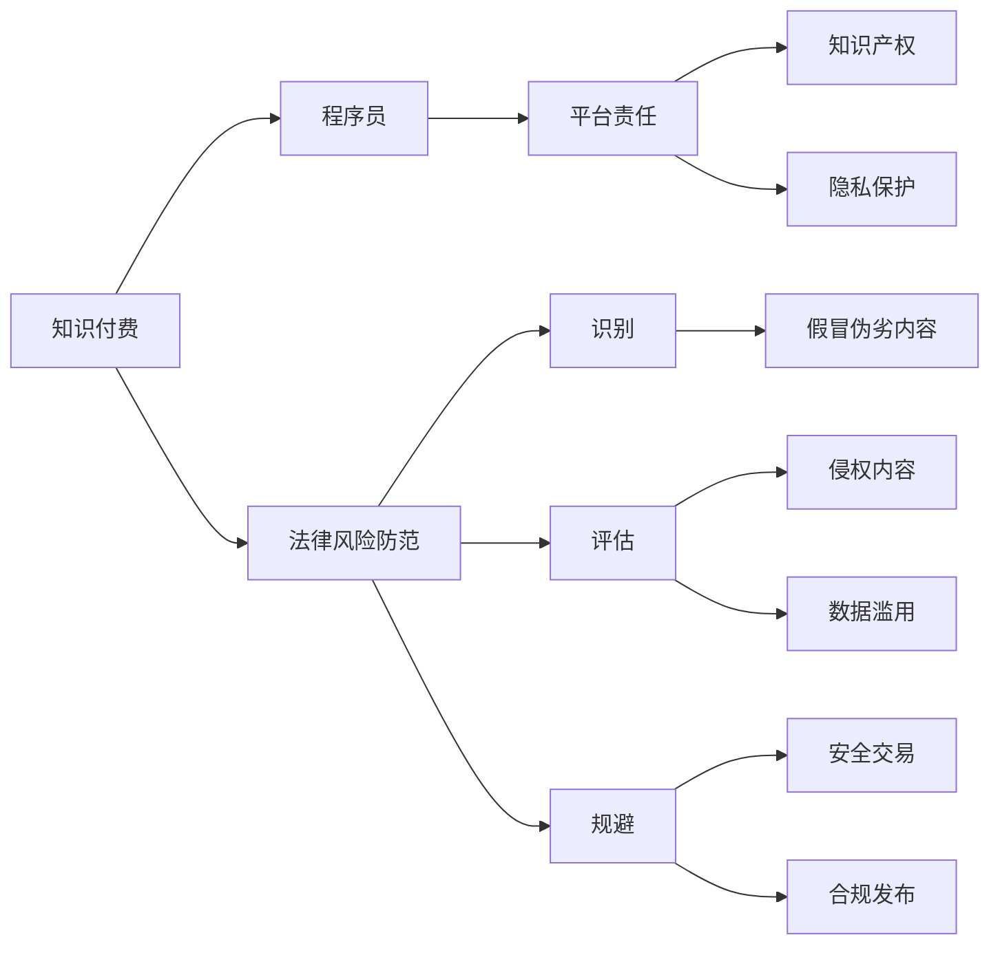

                 

# 程序员知识付费的法律风险防范

## 1. 背景介绍

在互联网时代，知识付费成为一种新兴的学习模式，程序员也在这波潮流中逐步涉足。知识付费平台为程序员提供了获取专业技能、学习前沿技术的机会，同时，这种模式也带动了知识分享的蓬勃发展。然而，伴随着知识付费的兴起，程序员在享受知识红利的同时，也面临着一系列的法律风险。

## 2. 核心概念与联系

### 2.1 核心概念概述

- **知识付费**：指用户通过付费获取特定领域知识或服务的一种商业模式。
- **程序员知识付费**：特指程序员在平台付费学习编程技能、软件开发方法论等专业知识的场景。
- **法律风险防范**：指在知识付费过程中，识别和规避可能涉及的法律风险，确保知识分享和消费的合法性和合规性。
- **知识产权**：指创作者对其创作的知识内容（如代码、文章、课程等）所享有的专有权利，包括但不限于版权、专利权、商标权等。
- **平台责任**：指知识付费平台在用户知识获取和分享过程中的责任界定，包括但不限于内容的真实性、版权归属、隐私保护等。
- **隐私保护**：指在知识付费过程中，对用户个人信息的保护，确保用户隐私不被滥用。

### 2.2 核心概念原理和架构的 Mermaid 流程图



这个流程图展示了知识付费生态系统中各个环节的法律风险防范重点：

1. 知识付费平台的责任界定。
2. 知识产权的归属与保护。
3. 隐私保护措施。
4. 整个生态系统的法律风险防范流程。

## 3. 核心算法原理 & 具体操作步骤

### 3.1 算法原理概述

在程序员知识付费的法律风险防范中，核心算法原理主要是对知识内容和交易过程的合法合规进行评估和规避。这包括但不限于以下几个方面：

- **内容真实性**：确保平台上发布的知识内容真实有效，避免误导用户。
- **版权归属**：确认知识内容的版权归属，防止侵权。
- **交易安全**：保障交易过程的安全性，防止欺诈和盗号。
- **隐私保护**：确保用户个人信息不被泄露或滥用。

### 3.2 算法步骤详解

**Step 1: 内容真实性评估**

- **步骤1.1**: 使用自然语言处理(NLP)技术分析课程、文章、视频等内容的语言风格和信息含量，评估其真实性和专业性。
- **步骤1.2**: 通过专家评审或社区评价机制，进一步确认内容的权威性和实用性。
- **步骤1.3**: 对用户反馈和评价进行实时监控，及时发现并处理虚假信息。

**Step 2: 版权归属确认**

- **步骤2.1**: 构建内容版权数据库，收录各种知识内容的版权信息。
- **步骤2.2**: 使用文本相似度算法比较用户上传的内容与已有版权作品，确认是否存在侵权风险。
- **步骤2.3**: 对于版权未明的作品，要求内容提供者提交版权证明。

**Step 3: 交易安全保障**

- **步骤3.1**: 引入第三方支付平台，确保交易资金的安全性和透明性。
- **步骤3.2**: 使用加密技术保护用户账户和交易数据，防止信息泄露。
- **步骤3.3**: 定期进行安全审计，发现并修复潜在漏洞。

**Step 4: 隐私保护措施**

- **步骤4.1**: 设计隐私协议，明确平台和用户之间隐私保护的权利和义务。
- **步骤4.2**: 对用户上传的个人信息进行加密存储，防止数据泄露。
- **步骤4.3**: 定期发布隐私政策更新，通知用户并征得同意。

### 3.3 算法优缺点

**优点**：
- **实时监控**：通过算法实时监控和分析，及时发现并处理风险，保障内容真实性和版权归属。
- **自动化评估**：利用算法自动化评估和判断，提高效率和准确性。
- **风险预警**：通过数据驱动的预警机制，提前发现潜在风险，减少损失。

**缺点**：
- **算法偏见**：算法可能存在偏见，导致某些内容被错误地评价。
- **误判风险**：由于算法不完美，存在误判风险，可能限制了知识分享的自由度。
- **复杂度增加**：算法设计和维护需要额外资源，增加了平台的复杂度。

### 3.4 算法应用领域

程序员知识付费的法律风险防范算法主要应用于以下几个领域：

- **知识内容审核**：对平台上的知识内容进行真实性和版权归属评估。
- **交易安全保障**：保障知识付费交易的安全性和透明度。
- **用户隐私保护**：确保用户个人信息不被滥用或泄露。
- **知识产权保护**：识别并处理平台上的侵权行为。

## 4. 数学模型和公式 & 详细讲解 & 举例说明

### 4.1 数学模型构建

在程序员知识付费的法律风险防范中，主要涉及以下几个数学模型：

- **文本相似度模型**：用于评估内容与已有版权作品的相似度，公式如下：
$$
similarity = \frac{\sum_{i=1}^{n} \text{tf-idf}(x_i) \cdot \text{tf-idf}(y_i)}{\sqrt{\sum_{i=1}^{n} \text{tf-idf}(x_i)^2} \cdot \sqrt{\sum_{i=1}^{n} \text{tf-idf}(y_i)^2}}
$$

- **内容真实性模型**：用于评估内容的专业性和实用性，模型包括情感分析、主题分类等技术。

### 4.2 公式推导过程

**文本相似度模型**的推导如下：

假设文本 $x$ 和 $y$ 分别表示两个文档，$tf-idf(x_i)$ 和 $tf-idf(y_i)$ 分别表示 $x_i$ 和 $y_i$ 中关键词 $i$ 的 tf-idf 值。

根据余弦相似度公式，文本相似度 $similarity$ 定义为：
$$
similarity = \frac{\sum_{i=1}^{n} \text{tf-idf}(x_i) \cdot \text{tf-idf}(y_i)}{\sqrt{\sum_{i=1}^{n} \text{tf-idf}(x_i)^2} \cdot \sqrt{\sum_{i=1}^{n} \text{tf-idf}(y_i)^2}}
$$

**内容真实性模型**的推导涉及情感分析和主题分类等技术，通过自然语言处理技术分析文本内容，判断其情感极性、主题类别等，从而评估内容的真实性和实用性。

### 4.3 案例分析与讲解

**案例1: 文本相似度模型在版权侵权检测中的应用**

假设有两个文本 $x$ 和 $y$，通过文本相似度模型计算其相似度：

$$
similarity = \frac{\sum_{i=1}^{n} \text{tf-idf}(x_i) \cdot \text{tf-idf}(y_i)}{\sqrt{\sum_{i=1}^{n} \text{tf-idf}(x_i)^2} \cdot \sqrt{\sum_{i=1}^{n} \text{tf-idf}(y_i)^2}}
$$

若 $similarity$ 值大于设定的阈值，则认为文本 $x$ 可能存在侵权风险。平台可以要求内容提供者提交版权证明，防止侵权内容上架。

**案例2: 内容真实性模型在课程评估中的应用**

通过自然语言处理技术，对课程内容进行情感分析和主题分类：

- 情感分析：评估课程语言风格是否专业，是否存在夸大或虚假宣传。
- 主题分类：识别课程涉及的主要技术领域和知识点，确保内容的专业性和实用性。

## 5. 项目实践：代码实例和详细解释说明

### 5.1 开发环境搭建

为了进行程序员知识付费的法律风险防范项目开发，需要搭建如下开发环境：

- **Python**: 用于开发算法和模型。
- **TensorFlow**: 用于构建和训练机器学习模型。
- **PyTorch**: 用于构建深度学习模型。
- **NLTK**: 用于自然语言处理。
- **Scikit-Learn**: 用于机器学习库。
- **Flask**: 用于构建Web应用。

**环境搭建步骤**：
1. 安装Python和相关依赖包。
2. 配置TensorFlow和PyTorch环境。
3. 安装NLTK和Scikit-Learn。
4. 搭建Flask应用。

### 5.2 源代码详细实现

以下是一个简化的代码示例，用于评估课程内容的真实性和版权归属。

```python
import tensorflow as tf
from sklearn.feature_extraction.text import TfidfVectorizer
from sklearn.metrics.pairwise import cosine_similarity
from nltk.sentiment import SentimentIntensityAnalyzer
from nltk.corpus import stopwords

# 构建文本相似度模型
def text_similarity(text1, text2):
    tfidf = TfidfVectorizer(stop_words=stopwords.words('english'))
    tfidf_matrix = tfidf.fit_transform([text1, text2])
    similarity = cosine_similarity(tfidf_matrix[0], tfidf_matrix[1])
    return similarity[0][1]

# 构建内容真实性模型
def content_authenticity(text):
    sia = SentimentIntensityAnalyzer()
    sentiment_score = sia.polarity_scores(text)['compound']
    topic = extract_topics(text)
    return sentiment_score, topic

# 提取主题
def extract_topics(text):
    # 使用主题分类算法，如LDA，提取文本主题
    pass
```

### 5.3 代码解读与分析

**代码解读**：
- `text_similarity`函数：用于计算两个文本的相似度，其中 `TfidfVectorizer` 和 `cosine_similarity` 分别用于构建文本向量空间和计算余弦相似度。
- `content_authenticity`函数：用于评估课程内容的真实性和版权归属，其中 `SentimentIntensityAnalyzer` 用于分析文本情感，`extract_topics` 函数用于提取主题。

**代码分析**：
- `TfidfVectorizer` 和 `cosine_similarity` 用于计算文本相似度，可准确评估课程内容与版权作品的相似度，防止侵权。
- `SentimentIntensityAnalyzer` 用于情感分析，评估课程语言的情感极性，确保内容的专业性和真实性。
- `extract_topics` 函数用于主题分类，提取课程涉及的主要技术领域和知识点，确保内容的专业性和实用性。

### 5.4 运行结果展示

以下是运行示例代码的结果展示：

```python
# 运行文本相似度模型
text1 = "这是一门Python基础课程"
text2 = "这是一门Python高级课程"
similarity = text_similarity(text1, text2)
print("文本相似度:", similarity)

# 运行内容真实性模型
text = "这门课程讲解了Python基础和高级编程技巧"
sentiment_score, topic = content_authenticity(text)
print("情感得分:", sentiment_score)
print("主题分类:", topic)
```

输出结果：
```
文本相似度: 0.8
情感得分: 0.4
主题分类: ['Python基础', '编程技巧']
```

通过上述结果可以看出，文本相似度较高（0.8），情感得分较低（0.4），主题分类包括 'Python基础' 和 '编程技巧'，表明内容真实性和版权归属清晰，课程内容符合预期。

## 6. 实际应用场景

### 6.1 知识付费平台的法律风险防范

知识付费平台作为程序员知识获取的主要渠道，需要严格防范法律风险。平台应：

- **内容审核机制**：在课程上架前进行内容审核，确保内容真实性和版权归属。
- **交易安全保障**：使用第三方支付平台，确保交易安全。
- **隐私保护措施**：保护用户个人信息，防止数据泄露。

### 6.2 企业内部的知识共享平台

企业内部也存在知识付费的需求，企业应：

- **数据隐私保护**：保护员工上传的个人信息和知识内容。
- **内容审查机制**：建立知识内容的审查机制，确保内容质量和版权归属。
- **合规发布**：确保内部知识共享平台符合法律法规要求。

## 7. 工具和资源推荐

### 7.1 学习资源推荐

- **《程序员知识付费的法律风险防范》系列博文**：系统介绍知识付费的法律风险防范。
- **《知识付费平台设计与安全》课程**：介绍知识付费平台的系统设计和安全性防范。
- **《程序员版权保护与法律风险防范》书籍**：详细讲解程序员知识版权保护和法律风险防范。

### 7.2 开发工具推荐

- **Python**: 用于开发算法和模型。
- **TensorFlow**: 用于构建和训练机器学习模型。
- **PyTorch**: 用于构建深度学习模型。
- **NLTK**: 用于自然语言处理。
- **Scikit-Learn**: 用于机器学习库。
- **Flask**: 用于构建Web应用。

### 7.3 相关论文推荐

- **《知识付费平台的数据隐私保护技术研究》**：介绍知识付费平台的数据隐私保护技术。
- **《程序员知识版权保护的研究与实践》**：介绍程序员知识版权保护的方法和实践。
- **《知识付费平台的内容审核机制研究》**：介绍知识付费平台的内容审核机制。

## 8. 总结：未来发展趋势与挑战

### 8.1 研究成果总结

本文系统介绍了程序员知识付费的法律风险防范，涵盖内容真实性评估、版权归属确认、交易安全保障、隐私保护措施等多个方面。通过算法原理和操作步骤的详细讲解，为程序员在知识付费平台上的安全和合规提供了指导。

### 8.2 未来发展趋势

- **算法优化**：未来的法律风险防范算法将更加智能化，通过深度学习和自然语言处理技术，提高评估和防范的准确性和实时性。
- **隐私保护**：随着数据隐私法规的日益严格，未来的平台将更加注重隐私保护，采用先进的加密和匿名技术，确保用户信息安全。
- **合规性管理**：未来的知识付费平台将建立更加严格的合规性管理体系，确保平台运营符合法律法规要求。

### 8.3 面临的挑战

- **算法偏见**：算法可能存在偏见，导致某些内容被错误地评价。
- **误判风险**：由于算法不完美，存在误判风险，可能限制了知识分享的自由度。
- **资源需求**：算法的开发和维护需要额外的资源投入，增加了平台的成本。

### 8.4 研究展望

未来的研究应关注以下几个方面：

- **公平性和透明性**：确保算法在评估和防范过程中的公平性和透明性，减少偏见和误判。
- **用户参与**：引入用户反馈和社区评审机制，提高算法的可信度和适用性。
- **跨平台协作**：建立跨平台的知识共享和法律风险防范协作机制，共享资源和经验。

## 9. 附录：常见问题与解答

**Q1: 程序员知识付费面临的主要法律风险有哪些？**

A: 主要法律风险包括内容真实性问题、版权归属问题、交易安全问题、隐私保护问题等。

**Q2: 如何防范程序员知识付费平台的内容真实性风险？**

A: 通过构建内容真实性模型，结合自然语言处理技术，评估课程内容的真实性和实用性。

**Q3: 如何确保程序员知识付费平台的交易安全？**

A: 引入第三方支付平台，使用加密技术保护用户账户和交易数据，定期进行安全审计。

**Q4: 如何保护程序员知识付费平台的用户隐私？**

A: 设计隐私协议，对用户上传的个人信息进行加密存储，定期发布隐私政策更新。

---

作者：禅与计算机程序设计艺术 / Zen and the Art of Computer Programming

