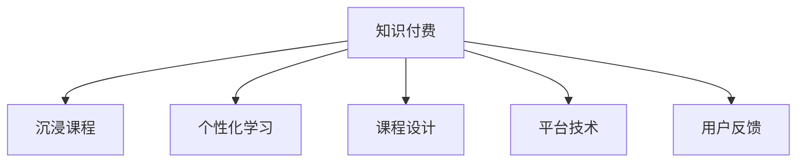

                 

# 程序员知识付费：打造沉浸课程

## 1. 背景介绍

### 1.1 问题由来

随着互联网和移动设备的普及，在线教育成为了人们学习新知识的重要途径。对于程序员这一特殊群体，他们在学习新知识、提升技能时，往往需要借助多种渠道和平台。传统的编程书籍、在线课程、视频教程等资源，无法满足他们快速学习、高效实践的需求。而知识付费的兴起，为程序员提供了更加直接、深入的学习方式。

### 1.2 问题核心关键点

知识付费通过将知识内容封装成视频课程、图文教程、代码实例等形式，向用户提供系统、全面的学习材料。这种形式的优势在于：

1. 系统性：相较于零散的知识碎片，知识付费的内容更具有系统性，帮助用户构建完整的知识体系。
2. 实时性：知识付费的课程更新速度快，能及时反映技术前沿的变化。
3. 实践性：知识付费的课程往往包含大量实战案例和代码练习，帮助用户通过实践掌握新技能。
4. 互动性：知识付费的平台通常提供社区交流功能，用户可以通过讨论、问答等方式获取个性化辅导。

然而，知识付费也面临着一些挑战：

1. 质量参差不齐：市场上有大量的知识付费产品，但质量和效果各异，用户难以辨识。
2. 高昂费用：高质量的知识付费产品往往价格不菲，给用户带来经济负担。
3. 学习效率低：知识付费的课程设计通常基于线性时间顺序，忽略了用户的学习节奏和个性化需求。

针对这些问题，本文将探讨如何通过技术手段，打造沉浸式、个性化、高效的知识付费课程，提升用户的学习体验和效果。

## 2. 核心概念与联系

### 2.1 核心概念概述

为更好地理解知识付费课程的构建，本节将介绍几个关键概念及其之间的关系：

1. **知识付费**：通过收费方式提供系统化、深入浅出的知识内容，帮助用户掌握新技能。包括视频课程、图文教程、代码实例等多种形式。

2. **沉浸课程**：一种旨在通过模拟真实场景，让用户深度参与、沉浸其中的学习方式。常见形式包括虚拟现实(VR)、增强现实(AR)、模拟训练等。

3. **个性化学习**：根据用户的学习进度、兴趣、偏好等个性化信息，量身定制学习路径和内容，提升学习效率和效果。

4. **课程设计**：知识付费课程的规划、制作和呈现过程。需要考虑课程结构、内容深度、互动方式等多方面因素。

5. **平台技术**：支持知识付费课程开发和运营的技术体系。包括在线学习平台、互动工具、大数据分析等。

6. **用户反馈**：通过用户行为数据、满意度调查等方式，收集用户对课程的反馈，不断优化课程内容和教学方式。

这些核心概念之间的逻辑关系可以通过以下Mermaid流程图来展示：



这个流程图展示了几大核心概念及其之间的关系：

1. 知识付费课程通过沉浸课程和个性化学习的方式，提升用户的学习体验和效果。
2. 课程设计决定了知识付费课程的内容和形式。
3. 平台技术支持课程的开发和运营。
4. 用户反馈用于指导课程的持续优化。

## 3. 核心算法原理 & 具体操作步骤

### 3.1 算法原理概述

沉浸式知识付费课程的构建，涉及以下几个关键步骤：

1. **内容设计**：根据目标受众的需求和特点，设计课程内容和结构。
2. **平台搭建**：开发或选用支持沉浸式互动的在线学习平台。
3. **数据收集**：通过用户行为数据和调查问卷等手段，收集用户的学习习惯和偏好。
4. **个性化推荐**：根据用户的学习数据，推荐适合的课程和学习路径。
5. **互动设计**：设计互动环节，如讨论、问答、测试等，提升用户参与度。
6. **反馈收集**：收集用户对课程的反馈，持续优化课程内容。

### 3.2 算法步骤详解

以下将详细讲解沉浸式知识付费课程的构建步骤：

#### 3.2.1 内容设计

内容设计是知识付费课程构建的第一步，决定了课程的价值和用户体验。

1. **目标受众分析**：根据用户群体特点（如入门、进阶、专家等），设计不同层次的课程内容。
2. **课程结构规划**：将课程内容划分为若干模块，每个模块包含若干章节。每个章节应明确学习目标、知识点和实践任务。
3. **内容制作**：根据课程结构和知识点，制作视频、图文、代码实例等多种形式的内容。
4. **交互设计**：在视频、文章中加入互动元素，如提问、测试、练习等，增强用户参与感。

#### 3.2.2 平台搭建

平台搭建是知识付费课程开发的基础，决定了课程的呈现方式和用户互动体验。

1. **技术选型**：选择适合的在线学习平台，如LMS（学习管理系统）、MOOC（大规模开放在线课程）等。
2. **功能实现**：实现用户注册、登录、课程浏览、互动交流等功能。
3. **数据存储**：设计数据库和存储方案，保存用户数据和课程内容。
4. **接口开发**：开发API接口，支持第三方应用和插件集成。

#### 3.2.3 数据收集

数据收集是实现个性化推荐和课程优化关键的一环。

1. **行为数据**：收集用户在学习平台上的操作数据，如观看视频时长、点击文章次数、提交作业成绩等。
2. **反馈数据**：通过问卷调查、用户评价等方式，收集用户对课程的直接反馈。
3. **社交数据**：利用社交网络分析用户之间的互动关系，如讨论频率、点赞次数等。

#### 3.2.4 个性化推荐

个性化推荐是知识付费课程的核心功能，帮助用户发现和选择适合自己的课程内容。

1. **用户画像构建**：根据用户的行为数据、社交数据等，构建用户画像。
2. **推荐模型设计**：选择合适的推荐算法，如协同过滤、内容推荐等。
3. **推荐算法优化**：不断迭代优化推荐算法，提高推荐的准确性和多样性。

#### 3.2.5 互动设计

互动设计是提升用户参与度的关键手段。

1. **讨论区**：设计课程讨论区，允许用户交流问题和观点。
2. **问答环节**：在课程视频或文章中加入问答环节，引导用户思考和讨论。
3. **测试和练习**：通过测试和练习环节，检验用户的学习效果，并给予反馈。

#### 3.2.6 反馈收集

反馈收集是持续改进课程的关键步骤。

1. **用户反馈调查**：设计调查问卷，定期收集用户对课程的满意度、建议等。
2. **用户行为分析**：通过数据挖掘技术，分析用户的学习行为，发现问题点。
3. **课程优化**：根据反馈结果，优化课程内容和教学方法，提升用户学习体验。

### 3.3 算法优缺点

沉浸式知识付费课程具有以下优点：

1. **个性化学习**：根据用户的学习进度和兴趣，提供定制化的学习路径和内容，提高学习效率。
2. **高效互动**：通过讨论、问答、测试等互动环节，增强用户参与感和学习效果。
3. **系统性设计**：课程结构明确，知识点覆盖全面，帮助用户系统掌握新技能。
4. **技术支持**：利用现代技术手段，如VR、AR、大数据等，提升课程的沉浸感和用户体验。

但同时也存在一些缺点：

1. **费用较高**：高质量的沉浸式课程往往价格不菲，对部分用户可能存在经济负担。
2. **内容制作成本高**：制作高水平的视频、图文、代码实例等课程内容，需要较高的技术水平和制作成本。
3. **技术门槛高**：搭建和维护沉浸式课程平台，需要具备较高的技术水平。
4. **用户依存度高**：沉浸式课程的效果依赖于平台的稳定性和互动质量，用户对平台的依存度高。

## 4. 数学模型和公式 & 详细讲解 & 举例说明

### 4.1 数学模型构建

知识付费课程的构建，涉及多个数学模型，如用户画像构建、推荐系统、互动设计等。以下将详细介绍几个关键模型的构建和应用。

#### 4.1.1 用户画像构建

用户画像构建是个性化推荐的基础，通过收集用户的行为数据、社交数据等，构建用户兴趣、能力等属性标签。

设用户 $u$ 的行为数据为 $D_u$，社交数据为 $S_u$，则用户画像 $P_u$ 可以表示为：

$$
P_u = f(D_u, S_u)
$$

其中 $f$ 为用户画像构建函数。

#### 4.1.2 推荐系统

推荐系统是知识付费课程的核心功能，通过用户画像和课程数据，推荐适合用户的学习路径。

设课程集合为 $C$，用户画像为 $P_u$，推荐模型为 $M$，则推荐函数 $R(u, C)$ 可以表示为：

$$
R(u, C) = M(P_u, C)
$$

其中 $M$ 为推荐模型，可以是协同过滤、内容推荐、混合推荐等多种算法。

#### 4.1.3 互动设计

互动设计是提升用户参与度的关键手段，通过设计讨论区、问答环节、测试等互动环节，增强用户的学习体验。

设课程视频为 $V$，讨论区为 $D$，问答环节为 $Q$，测试环节为 $T$，则互动设计函数 $I(V, D, Q, T)$ 可以表示为：

$$
I(V, D, Q, T) = f(V, D, Q, T)
$$

其中 $f$ 为互动设计函数。

### 4.2 公式推导过程

以下将详细推导用户画像构建和推荐系统的核心公式。

#### 4.2.1 用户画像构建

设用户 $u$ 的行为数据为 $D_u = \{x_1, x_2, ..., x_n\}$，社交数据为 $S_u = \{y_1, y_2, ..., y_m\}$。假设行为数据和社交数据的权重分别为 $\alpha$ 和 $\beta$，则用户画像 $P_u$ 可以表示为：

$$
P_u = (\alpha D_u + \beta S_u) / (\alpha + \beta)
$$

#### 4.2.2 推荐系统

设课程集合为 $C = \{c_1, c_2, ..., c_k\}$，课程 $c_i$ 的权重为 $w_i$，用户画像为 $P_u$。假设推荐模型为协同过滤模型，则推荐函数 $R(u, C)$ 可以表示为：

$$
R(u, C) = \sum_{c_i \in C} w_i \cdot \text{similarity}(P_u, c_i)
$$

其中 $\text{similarity}$ 为相似度函数，可以使用余弦相似度、欧式距离等。

### 4.3 案例分析与讲解

以下以一个虚拟的知识付费平台为例，进行具体的案例分析。

#### 4.3.1 平台搭建

假设有一个名为 "CodeAcademy" 的知识付费平台，提供编程课程的视频教学和互动环节。平台通过LMS技术搭建，具备用户注册、登录、课程浏览、互动交流等功能。平台数据存储在云数据库中，支持API接口，方便第三方应用集成。

#### 4.3.2 内容设计

平台提供初级、中级和高级三个层次的编程课程，每个课程包含若干章节。每个章节包含视频讲解、代码实例、互动练习等形式的内容。视频讲解由专业教师录制，代码实例由平台专家编写，互动练习由用户互动生成。

#### 4.3.3 数据收集

平台通过行为数据、反馈数据、社交数据等手段，收集用户的学习信息。行为数据包括用户观看视频的时长、提交作业的成绩等，反馈数据包括用户对课程的评价、建议等，社交数据包括用户之间的讨论、点赞等。

#### 4.3.4 个性化推荐

平台使用协同过滤算法，根据用户的行为数据和社交数据，推荐适合用户的编程课程。同时，平台还引入内容推荐算法，根据课程内容特征，推荐相关的课程和资料。

#### 4.3.5 互动设计

平台设计课程讨论区、问答环节和测试环节，增强用户参与感。课程讨论区允许用户交流问题和观点，问答环节在视频和文章中加入问答环节，引导用户思考和讨论，测试环节通过在线测试检验用户的学习效果，并给予反馈。

#### 4.3.6 反馈收集

平台通过问卷调查和行为分析，收集用户对课程的反馈。根据反馈结果，优化课程内容和教学方法，提升用户学习体验。

## 5. 项目实践：代码实例和详细解释说明

### 5.1 开发环境搭建

在进行知识付费课程开发前，我们需要准备好开发环境。以下是使用Python进行Flask框架开发的环境配置流程：

1. 安装Anaconda：从官网下载并安装Anaconda，用于创建独立的Python环境。

2. 创建并激活虚拟环境：
```bash
conda create -n flask-env python=3.8 
conda activate flask-env
```

3. 安装Flask和相关依赖：
```bash
pip install flask
pip install flask-restful flask-cors
```

4. 安装数据库和服务器：
```bash
pip install flask-sqlalchemy flask-migrate
pip install gunicorn
```

完成上述步骤后，即可在`flask-env`环境中开始开发。

### 5.2 源代码详细实现

下面我们以一个虚拟的知识付费平台为例，给出使用Flask框架对课程内容管理系统进行开发的Python代码实现。

首先，定义用户和课程的模型：

```python
from flask_sqlalchemy import SQLAlchemy
from flask_migrate import Migrate

db = SQLAlchemy()
migrate = Migrate()

class User(db.Model):
    id = db.Column(db.Integer, primary_key=True)
    username = db.Column(db.String(80), unique=True, nullable=False)
    email = db.Column(db.String(120), unique=True, nullable=False)
    password = db.Column(db.String(120), nullable=False)
    courses = db.relationship('Course', backref='users', lazy='dynamic')

class Course(db.Model):
    id = db.Column(db.Integer, primary_key=True)
    name = db.Column(db.String(120), nullable=False)
    description = db.Column(db.Text, nullable=False)
    videos = db.Column(db.Text, nullable=False)
    discussions = db.Column(db.Text, nullable=False)
    interactions = db.Column(db.Integer, nullable=False, default=0)
```

然后，定义API接口：

```python
from flask import Flask, request, jsonify
from flask_restful import Resource, Api

app = Flask(__name__)
api = Api(app)

@app.route('/users', methods=['POST'])
def create_user():
    data = request.get_json()
    user = User(username=data['username'], email=data['email'], password=data['password'])
    db.session.add(user)
    db.session.commit()
    return jsonify(user.to_json()), 201

@app.route('/courses', methods=['POST'])
def create_course():
    data = request.get_json()
    course = Course(name=data['name'], description=data['description'], videos=data['videos'], discussions=data['discussions'])
    db.session.add(course)
    db.session.commit()
    return jsonify(course.to_json()), 201

class UserCourses(Resource):
    def get(self, user_id):
        user = User.query.get(user_id)
        courses = user.courses.all()
        return jsonify([course.to_json() for course in courses])

class CoursesList(Resource):
    def get(self):
        courses = Course.query.all()
        return jsonify([course.to_json() for course in courses])

api.add_resource(UserCourses, '/users/<int:user_id>/courses')
api.add_resource(CoursesList, '/courses')
```

最后，启动Flask应用：

```python
if __name__ == '__main__':
    app.run(debug=True)
```

以上就是使用Flask框架对知识付费平台进行开发的完整代码实现。可以看到，通过Flask框架，我们可以快速搭建一个具备基本功能的知识付费平台，实现用户管理和课程内容的增删改查。

### 5.3 代码解读与分析

让我们再详细解读一下关键代码的实现细节：

**User和Course模型**：
- 使用Flask-SQLAlchemy框架定义了User和Course模型，其中包含id、username、email、password等属性，以及与用户课程的关联关系。

**API接口**：
- 定义了创建用户和课程的接口，使用Flask-RESTful框架实现RESTful API。
- 定义了获取用户课程和课程列表的接口，支持GET方法。

**运行Flask应用**：
- 使用Gunicorn作为后台服务启动Flask应用，支持调试模式。

以上代码实现是知识付费平台开发的典型流程，通过Flask框架，可以快速迭代出功能完备、易于扩展的系统。开发者可以根据实际需求，继续添加更多功能和模块，如视频播放、互动环节、反馈收集等。

## 6. 实际应用场景

### 6.1 智能教育

知识付费平台在智能教育领域有着广泛的应用。传统的教育资源往往难以满足个性化和实时化的需求，知识付费平台通过沉浸式课程和个性化推荐，帮助学生系统地掌握新知识。

例如，针对编程学习，平台可以提供面向不同层次的编程课程，通过视频讲解、代码实例、互动练习等形式，让学生深入理解编程概念和技能。同时，平台还可以通过行为数据和反馈数据，对学生的学习进度和效果进行实时监控和优化。

### 6.2 职业培训

知识付费平台在职业培训领域也有着广阔的应用前景。企业可以通过平台提供定制化的职业培训课程，帮助员工快速提升技能，适应岗位需求。

例如，IT企业可以通过平台提供面向不同岗位的编程、数据分析、人工智能等课程，帮助员工掌握最新的技术技能。同时，平台还可以通过行为数据和反馈数据，对培训效果进行评估和改进。

### 6.3 个人提升

知识付费平台还可以用于个人技能的提升和学习。知识付费平台的课程种类丰富、更新快速，可以帮助用户系统地学习新知识，提升自身素质和竞争力。

例如，程序员可以通过平台学习最新的编程语言和框架，提升编程技能。医生可以通过平台学习最新的医学知识和技能，提升医疗水平。

## 7. 工具和资源推荐

### 7.1 学习资源推荐

为了帮助开发者系统掌握知识付费课程的构建技术，这里推荐一些优质的学习资源：

1. **Flask官方文档**：Flask官方文档提供了详细的框架介绍和API使用指南，是入门Flask开发的最佳资源。
2. **Python Web开发实战**：这是一本实战型的Web开发书籍，涵盖Flask、Django等框架的使用和案例分析。
3. **知识付费市场调研报告**：一些第三方研究机构发布的知识付费市场调研报告，可以了解市场趋势和用户需求。
4. **用户体验设计（UED）指南**：一本涵盖用户界面设计、用户体验分析等内容的书籍，帮助开发者设计更优质的课程界面。
5. **数据科学基础**：一些数据科学基础知识的在线课程，帮助开发者掌握数据分析和推荐算法。

通过对这些资源的学习实践，相信你一定能够快速掌握知识付费课程的构建技术，并用于解决实际的课程开发问题。

### 7.2 开发工具推荐

高效的开发离不开优秀的工具支持。以下是几款用于知识付费课程开发的工具：

1. **Jupyter Notebook**：一个开源的Web应用，支持Python代码的编写、运行和共享。
2. **VS Code**：一个轻量级的代码编辑器，支持多种编程语言和扩展插件。
3. **Git**：一个版本控制系统，支持多人协作开发和代码管理。
4. **Postman**：一个API测试工具，支持HTTP请求的模拟和测试。
5. **Heroku**：一个PaaS平台，支持Web应用的快速部署和运行。

合理利用这些工具，可以显著提升知识付费课程的开发效率，加快创新迭代的步伐。

### 7.3 相关论文推荐

知识付费课程的开发涉及多方面的技术，包括Web开发、数据科学、推荐系统等。以下是几篇奠基性的相关论文，推荐阅读：

1. **《Flask Web Development》**：一本Flask框架的入门书籍，详细介绍了Flask的开发流程和最佳实践。
2. **《Python for Data Analysis》**：一本Python数据科学的入门书籍，涵盖数据清洗、数据分析、可视化等技术。
3. **《Recommender Systems: Algorithms and Applications》**：一本推荐系统的经典书籍，介绍了协同过滤、内容推荐等算法原理和应用。
4. **《User-Centered Interaction Design》**：一本用户体验设计的入门书籍，涵盖用户界面设计、交互设计等技术。

这些论文代表了大语言模型微调技术的发展脉络。通过学习这些前沿成果，可以帮助研究者把握学科前进方向，激发更多的创新灵感。

## 8. 总结：未来发展趋势与挑战

### 8.1 总结

本文对知识付费课程的构建方法进行了全面系统的介绍。首先阐述了知识付费课程在程序员学习中的重要价值，明确了沉浸式课程和个性化学习的关键优势。其次，从原理到实践，详细讲解了知识付费课程的构建流程，包括内容设计、平台搭建、数据收集、个性化推荐、互动设计、反馈收集等步骤，给出了知识付费平台开发的完整代码实例。同时，本文还广泛探讨了知识付费课程在教育培训、职业培训、个人提升等场景中的应用，展示了知识付费平台的广阔前景。

通过本文的系统梳理，可以看到，知识付费课程正在成为程序员学习的重要途径，极大地提升了用户的知识获取效率和学习体验。未来，伴随技术的发展和教育的革新，知识付费平台必将成为普及普及知识、提升技能的重要工具。

### 8.2 未来发展趋势

展望未来，知识付费课程将呈现以下几个发展趋势：

1. **技术迭代加速**：随着AI、VR、AR等技术的发展，知识付费课程将不断引入新技术，提升学习体验。例如，VR/AR技术可以模拟真实场景，增强学习沉浸感；AI技术可以个性化推荐课程内容，提高学习效率。
2. **内容多样化**：知识付费课程的内容将更加丰富多样，涵盖编程、医学、法律等多个领域。同时，内容形式也将更加多样，如视频、图文、代码实例、互动练习等。
3. **智能推荐提升**：推荐算法将不断优化，提高推荐的准确性和多样性，更好地匹配用户需求。同时，推荐系统将引入多模态数据融合，提升推荐效果。
4. **社区互动增强**：知识付费平台将引入社区功能，增强用户之间的互动交流，构建知识共享、协同学习的网络。

这些趋势表明，知识付费课程正在向更加智能、多样、互动的方向发展，为用户提供更优质的学习体验和效果。

### 8.3 面临的挑战

尽管知识付费课程带来了诸多便利和优势，但在推广和应用过程中，仍面临一些挑战：

1. **高昂费用**：高质量的知识付费课程往往价格不菲，可能存在一定的经济门槛。如何降低课程成本，实现公平和普惠，还需要更多的探索和努力。
2. **内容质量参差不齐**：知识付费市场上有大量的课程内容，但质量和效果各异，用户难以辨识。如何确保课程内容的科学性和实用性，提升用户信任度，是亟待解决的问题。
3. **平台生态建设**：知识付费平台需要不断引入新的内容和技术，构建健康、活跃的生态系统。如何吸引优质的内容创作者和用户，提升平台的用户粘性和活跃度，是平台发展的关键。
4. **用户依赖度高**：知识付费平台的成功依赖于用户的高粘性和活跃度，如何提升用户体验，降低用户流失，是平台运营的难点。

面对这些挑战，需要技术开发者、内容创作者和平台运营者共同努力，不断优化课程内容和技术手段，提升知识付费平台的价值和效果。

### 8.4 研究展望

面对知识付费平台所面临的挑战，未来的研究需要在以下几个方面寻求新的突破：

1. **降低课程成本**：通过引入开源课程、自动化生成课程等方式，降低高质量课程的开发成本，实现知识普惠。
2. **提高课程质量**：引入质量评估和认证机制，确保课程内容的科学性和实用性，提升用户信任度。
3. **优化平台生态**：构建开放、透明的平台生态系统，吸引更多的内容创作者和用户参与，提升平台的用户粘性和活跃度。
4. **提升用户体验**：通过技术手段和内容创新，提升用户的沉浸感和互动体验，降低用户流失率。

这些研究方向的探索，必将引领知识付费课程技术的发展，为程序员学习提供更优质、高效、公平的学习途径。面向未来，知识付费平台还需要与其他教育技术进行更深入的融合，如人工智能、VR/AR、大数据等，多路径协同发力，共同推动知识付费平台的进步。

## 9. 附录：常见问题与解答

**Q1：知识付费课程是否适用于所有用户？**

A: 知识付费课程适用于大多数用户，特别是那些需要系统学习新知识和技能的人群。对于初学者、进阶者和专家，都能找到适合自己的课程内容。但对于一些需要灵活、个性化学习方式的用户，如自由职业者、研究者等，可能还需要结合其他学习途径，如在线论坛、公开课程等。

**Q2：如何选择合适的课程？**

A: 选择合适的课程需要考虑多个因素，如用户的学习目标、已有知识基础、学习时间等。可以通过以下步骤进行选择：
1. 明确学习目标：根据用户的职业需求、兴趣爱好等，明确学习目标。
2. 评估已有知识：根据用户的已有知识水平，选择合适的课程难度和内容。
3. 了解课程评价：查看其他用户的评价和反馈，了解课程的质量和效果。
4. 试用课程体验：部分课程提供试用功能，用户可以先体验课程内容，再决定是否购买。

**Q3：如何优化知识付费平台的用户体验？**

A: 优化知识付费平台的用户体验，可以从以下几个方面入手：
1. 提升内容质量：引入高质量的课程内容，确保课程的科学性和实用性。
2. 增强互动性：设计讨论区、问答环节、测试等互动环节，增强用户参与感。
3. 个性化推荐：根据用户的学习数据，推荐适合的课程和学习路径。
4. 优化平台功能：提升平台的稳定性、易用性和响应速度，提升用户体验。

**Q4：如何应对知识付费平台的高昂费用？**

A: 应对知识付费平台的高昂费用，可以采取以下措施：
1. 利用免费课程：部分知识付费平台提供免费课程，用户可以先通过免费课程掌握基础知识，再考虑购买付费课程。
2. 选择性价比高的课程：在购买课程时，可以对比不同课程的价格和内容，选择性价比高的课程。
3. 利用订阅模式：部分知识付费平台支持订阅模式，用户可以通过月度或年度订阅，获得更优惠的价格。
4. 参与社区交流：通过社区交流，用户可以获得更多的学习资源和支持，提升学习效果。

**Q5：如何应对知识付费平台的内容质量参差不齐？**

A: 应对知识付费平台的内容质量参差不齐，可以采取以下措施：
1. 选择权威平台：选择知名度高、用户评价好的知识付费平台，降低课程质量风险。
2. 多平台对比：通过对比多个平台的课程内容，选择质量较好的课程。
3. 查阅用户评价：通过用户评价和反馈，了解课程的实际效果和问题点。
4. 试用课程体验：部分课程提供试用功能，用户可以先体验课程内容，再决定是否购买。

这些措施可以帮助用户在选择知识付费课程时，避免陷入内容质量参差不齐的困境，提升学习效果和用户体验。

---

作者：禅与计算机程序设计艺术 / Zen and the Art of Computer Programming

