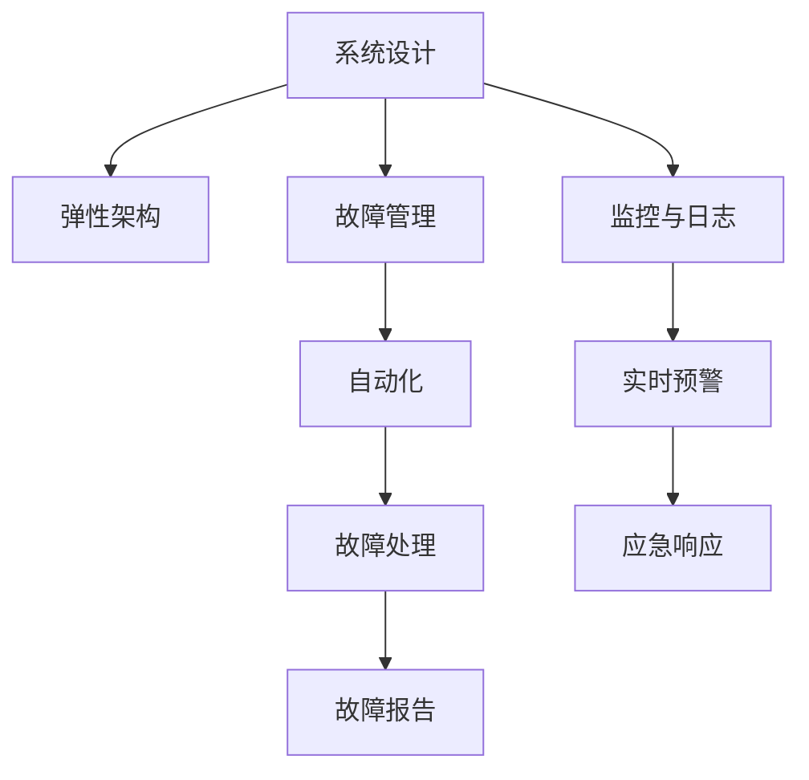

                 

# 站点可靠性工程（SRE）实践：保持系统可靠

> 关键词：站点可靠性,系统设计,故障管理,监控,自动化

## 1. 背景介绍

### 1.1 问题由来

随着互联网应用的快速增长，站点可靠性成为企业IT系统面临的最大挑战之一。无论是电商网站、社交平台，还是云服务提供商，都依赖IT系统提供7x24小时的服务。一旦系统出现故障，将导致业务中断、用户流失、声誉受损，甚至引发严重的经济损失。因此，如何构建可靠的系统，减少故障发生，快速恢复故障，是每个IT从业者必须面对的课题。

### 1.2 问题核心关键点

保持站点可靠的核心在于通过系统设计、故障管理、监控与自动化等技术手段，最大程度地降低系统故障，并在故障发生时快速恢复服务。这包括：

- **系统设计**：在初期设计阶段就考虑系统的可靠性和扩展性，通过架构优化和代码审查等手段，消除潜在风险。
- **故障管理**：在系统运行过程中，通过故障监控和响应机制，及时发现并处理系统故障，保障服务稳定。
- **自动化**：通过自动化工具和流程，降低人为操作风险，提高故障处理的效率和准确性。

这些关键点共同构成站点可靠性的全链路保障体系，使系统能够在面对各种异常情况时保持稳定的运行状态。

## 2. 核心概念与联系

### 2.1 核心概念概述

为更好地理解站点可靠性工程（Site Reliability Engineering, SRE）的实践，本节将介绍几个密切相关的核心概念：

- **站点可靠性**：指系统在各种异常情况下，如宕机、网络延迟、数据库故障等，仍能正常提供服务的能力。
- **故障管理**：指在系统运行过程中，通过监控、报警、应急响应等手段，及时发现并处理故障，保障服务连续性。
- **自动化**：指通过脚本、工具和流程，自动化系统维护和管理，减少人为错误和操作风险，提高效率。
- **监控与日志**：通过系统监控和日志记录，实时跟踪系统状态，提前预警潜在的故障，辅助故障处理。
- **弹性架构**：指系统架构设计上具备高可用性和弹性，能够快速扩展和缩容，应对负载变化。

这些核心概念之间的逻辑关系可以通过以下Mermaid流程图来展示：



这个流程图展示了一个典型的SRE实践流程：

1. 在系统设计阶段，通过弹性架构和自动化设计，构建可靠的系统。
2. 在系统运行过程中，实时监控和记录系统状态，提前预警潜在故障。
3. 一旦发现故障，通过故障管理机制，快速响应和处理。
4. 故障处理完成后，进行自动化故障报告，总结经验教训。

这些概念共同构成了SRE的全流程，确保系统能够在各种异常情况下保持可靠。

## 3. 核心算法原理 & 具体操作步骤
### 3.1 算法原理概述

站点可靠性的核心算法原理基于系统的全链路管理和自动化执行。其核心思想是：在系统设计的每个环节，都考虑可靠性因素，并通过自动化手段持续监控和优化系统，在故障发生时，能够快速响应和恢复。

系统可靠性的保障方法包括：

- **冗余设计**：通过负载均衡、数据备份、故障转移等机制，保证系统的单点故障不会导致系统崩溃。
- **自动化执行**：通过脚本和工具自动化执行故障处理流程，减少人为干预，提高处理效率和准确性。
- **实时监控**：通过日志记录和监控工具，实时跟踪系统状态，提前预警潜在故障。
- **应急预案**：通过预定义的应急预案，快速定位和解决故障，最小化故障影响。

### 3.2 算法步骤详解

SRE的实践步骤一般包括以下几个关键环节：

**Step 1: 系统设计**

- **架构优化**：选择合适的技术栈和架构模式，如微服务、事件驱动架构等，设计高可用的系统结构。
- **弹性设计**：通过自动扩展、负载均衡、故障转移等机制，保证系统在高并发和负载变化时仍能稳定运行。
- **自动化设计**：设计自动化流程，如自动化部署、自动化测试等，减少人为操作风险。

**Step 2: 故障管理**

- **监控和日志**：配置监控和日志系统，实时跟踪系统状态和性能指标，发现潜在故障。
- **报警机制**：配置告警规则，在异常情况下及时通知运维团队，避免服务中断。
- **应急响应**：制定应急预案，训练应急响应团队，快速定位和解决故障。

**Step 3: 自动化**

- **自动化执行**：编写自动化脚本和工具，如Ansible、Puppet、Jenkins等，自动化系统配置、部署、测试等流程。
- **自动化监控**：使用监控工具如Prometheus、Grafana等，自动化监控系统状态和性能指标。
- **自动化故障处理**：通过脚本和工具，自动化执行故障处理流程，如重启服务、数据恢复等。

**Step 4: 故障处理**

- **定位故障**：通过日志和监控数据，快速定位故障点。
- **恢复服务**：根据预定义的应急预案，自动或手动执行故障恢复操作。
- **故障分析**：记录故障处理过程，总结经验教训，优化系统设计。

### 3.3 算法优缺点

SRE实践的优点包括：

1. **提升系统稳定性**：通过系统设计优化和自动化执行，系统能够更好地应对各种异常情况，提升整体稳定性。
2. **减少人为干预**：通过自动化流程，减少人为操作风险，提高故障处理效率和准确性。
3. **优化资源利用**：通过弹性架构和自动化扩展，优化资源利用率，降低运行成本。
4. **快速恢复故障**：通过预定义的应急预案和自动化执行，快速定位和解决故障，减少故障影响。

同时，该方法也存在一定的局限性：

1. **设计复杂度增加**：系统设计的复杂度增加，需要更多的架构设计和自动化实施工作。
2. **开发成本提升**：自动化流程的开发和维护需要额外的人力和时间投入。
3. **预案需要持续更新**：系统环境和需求变化，需要不断更新应急预案，确保其有效性。

尽管存在这些局限性，但SRE实践在提升系统稳定性和自动化程度方面具有显著的优势，是构建高可靠性IT系统的必备方法。

### 3.4 算法应用领域

SRE实践在多个领域都有广泛的应用，包括但不限于：

- **电商系统**：如淘宝、京东等，通过弹性架构和自动化执行，保障购物系统的高可用性和稳定运行。
- **社交平台**：如微信、微博等，通过监控和故障管理，应对高频并发和用户数据激增的情况。
- **云服务提供商**：如AWS、阿里云等，通过冗余设计和自动化执行，保障云服务的高可靠性和可用性。
- **金融系统**：如银行、证券公司等，通过高可用设计和故障管理，保障金融服务的稳定和安全性。

SRE实践已经成为构建高可用IT系统的重要方法，在各行各业得到广泛应用。

## 4. 数学模型和公式 & 详细讲解  
### 4.1 数学模型构建

SRE实践中的数学模型通常涉及系统状态和性能指标的监控和计算。这里通过一个简单的例子来说明：

**监控指标**：假设有一个电商网站，其平均响应时间为$t_{avg}$，当前系统的平均响应时间为$t_{cur}$，系统负载为$L$。我们希望通过监控和计算，及时发现响应时间增加的情况，避免服务中断。

**公式推导过程**：定义响应时间阈值$\tau$，当$t_{cur} > t_{avg} + \tau$时，说明系统响应时间增加，可能存在故障。具体推导过程如下：

1. 计算当前系统负载$L$：
$$
L = \frac{N}{t_{avg}}
$$
其中$N$为系统在单位时间内处理的请求数。

2. 计算当前系统响应时间阈值$\tau$：
$$
\tau = \alpha \cdot t_{avg}
$$
其中$\alpha$为响应时间异常比例，通常取0.05-0.1。

3. 计算当前系统响应时间$t_{cur}$：
$$
t_{cur} = \frac{N}{L}
$$

4. 判断系统是否出现响应时间异常：
$$
t_{cur} > t_{avg} + \tau
$$

通过上述公式，可以在监控系统中实时计算响应时间阈值，一旦发现响应时间超过阈值，及时触发告警。

### 4.2 案例分析与讲解

以电商平台为例，分析如何通过监控和告警系统保障系统可靠性：

**场景**：电商网站在一个促销活动中，由于订单量激增，系统响应时间显著增加。

**监控过程**：
1. 配置监控系统，实时采集电商网站响应时间和请求数数据。
2. 设置响应时间阈值$\tau$，通常根据历史数据和业务需求设定。
3. 当响应时间超过阈值时，触发告警，通知运维团队。

**故障处理过程**：
1. 运维团队收到告警后，立即登录系统，检查当前状态和日志。
2. 定位故障点，如数据库连接超时、缓存满等问题。
3. 根据预定义的应急预案，执行快速恢复操作，如重启服务、扩容资源等。
4. 故障处理完成后，记录故障信息，总结经验教训。

通过监控和告警系统，可以及时发现和处理故障，保障系统可靠性和服务连续性。

## 5. 项目实践：代码实例和详细解释说明
### 5.1 开发环境搭建

在进行SRE实践前，我们需要准备好开发环境。以下是使用Python进行监控和告警系统开发的环境配置流程：

1. 安装Anaconda：从官网下载并安装Anaconda，用于创建独立的Python环境。

2. 创建并激活虚拟环境：
```bash
conda create -n monitoring-env python=3.8 
conda activate monitoring-env
```

3. 安装必要的Python包：
```bash
pip install pandas numpy plotly jupyter notebook flask psutil
```

4. 安装必要的监控工具：
```bash
pip install prometheus-client-exporter[python] prometheus-client[python]
```

完成上述步骤后，即可在`monitoring-env`环境中开始SRE实践的开发。

### 5.2 源代码详细实现

下面我们以监控系统为例，给出使用Flask框架实现监控和告警的PyTorch代码实现。

首先，定义监控系统的类：

```python
from prometheus_client import Gauge

class MonitorSystem:
    def __init__(self, gauge_name, gauge_type, gauge_help):
        self.gauge_name = gauge_name
        self.gauge_type = gauge_type
        self.gauge_help = gauge_help
        
        self.gauge = Gauge(self.gauge_name, self.gauge_type, self.gauge_help)
    
    def set_gauge(self, gauge_value):
        self.gauge.set(gauge_value)
```

然后，定义监控指标：

```python
monitor_system = MonitorSystem('avg_response_time', 'gauge', 'Average response time')
```

接着，定义监控和告警函数：

```python
from flask import Flask, jsonify, request
import psutil
import time

app = Flask(__name__)

@app.route('/monitor')
def monitor():
    response_time = psutil.Process().cpu_percent(interval=1)  # 获取平均响应时间
    monitor_system.set_gauge(response_time)
    
    if response_time > 3:
        # 触发告警
        return jsonify({'message': '系统响应时间过高，请检查并恢复'})
    else:
        return jsonify({'message': '系统运行正常'})
```

最后，启动监控系统：

```python
if __name__ == '__main__':
    app.run(host='0.0.0.0', port=5000)
```

在另一台机器上，安装Prometheus和Grafana，配置监控系统，通过浏览器访问Grafana，即可实时查看系统响应时间，并根据阈值设置告警。

### 5.3 代码解读与分析

让我们再详细解读一下关键代码的实现细节：

**MonitorSystem类**：
- `__init__`方法：初始化监控系统的名称、类型和帮助信息，创建Gauge对象。
- `set_gauge`方法：设置Gauge对象的值，并更新监控指标。

**监控指标**：
- `monitor_system`对象：定义一个监控系统，名称为'avg_response_time'，类型为'gauge'，帮助信息为'Average response time'。

**监控和告警函数**：
- `monitor`方法：通过Flask框架，定义监控系统的路由，获取当前系统的平均响应时间，并更新监控指标。
- 若响应时间超过阈值3，返回告警信息；否则返回正常信息。

**启动监控系统**：
- 在另一台机器上安装Prometheus和Grafana，配置监控系统，通过浏览器访问Grafana，即可实时查看系统响应时间，并根据阈值设置告警。

可以看到，使用Flask框架结合Prometheus和Grafana，可以方便地实现系统的监控和告警功能。开发者可以根据实际需求，灵活调整监控指标和告警策略，实现高效的故障管理。

当然，工业级的系统实现还需考虑更多因素，如数据采集、异常处理、报警机制等。但核心的监控和告警思路基本与此类似。

## 6. 实际应用场景
### 6.1 电商系统

电商系统面临高并发和订单激增的情况，系统可靠性至关重要。通过SRE实践，电商系统可以保障24小时稳定运行，快速响应用户请求。

在技术实现上，可以部署监控和告警系统，实时跟踪系统状态和响应时间，一旦发现异常，及时触发告警。运维团队可以快速定位和处理故障，保障用户购物体验。

### 6.2 社交平台

社交平台如微信、微博等，需要应对高频并发和用户数据激增的情况。通过SRE实践，社交平台可以实现高可用性，保障用户数据安全。

在技术实现上，可以部署弹性架构和自动化执行系统，通过负载均衡、自动扩展等机制，应对高并发负载。同时，配置监控和告警系统，及时发现和处理异常，保障平台稳定运行。

### 6.3 云服务提供商

云服务提供商如AWS、阿里云等，通过SRE实践，保障云服务的可靠性和稳定性，提升用户满意度和信任度。

在技术实现上，可以设计高可用性和弹性架构，通过自动扩展、故障转移等机制，应对各种异常情况。同时，配置自动化执行系统和监控告警系统，保障服务连续性，快速处理故障。

### 6.4 未来应用展望

随着SRE实践的深入，未来将在更多领域得到应用，为IT系统带来更高效、稳定的服务体验。

在智慧医疗领域，通过SRE实践，医疗系统可以保障24小时不间断运行，快速响应患者需求，提升医疗服务质量。

在智能制造领域，通过SRE实践，生产线系统可以实现高可用性和快速恢复，保障生产效率和产品质量。

在智能交通领域，通过SRE实践，交通监控系统可以实现实时监控和故障快速处理，提升交通管理水平。

总之，SRE实践将为各行各业提供更可靠、稳定的IT系统支持，推动业务发展的智能化和自动化进程。

## 7. 工具和资源推荐
### 7.1 学习资源推荐

为了帮助开发者系统掌握SRE的理论基础和实践技巧，这里推荐一些优质的学习资源：

1. 《Site Reliability Engineering》书籍：Holger Lübchen和Jordan A. Wilkins合著，系统介绍了SRE的原理和实践，是SRE领域的经典之作。

2. 《Real-Time Reliability: Capturing Web Apps, Big Data, and Services in the Race to 0 Downtime》课程：Coursera平台上由George Jones主讲的SRE课程，涵盖SRE的理论和实践，适合入门学习。

3. SRE Conferences：SRE领域的主要会议和活动，如SRE Conference、SRE Asia等，定期分享最新的SRE实践和研究成果。

4. SRE Podcasts：SRE领域的专业播客，如SRE pod、The SRE Podcast等，定期讨论SRE实践中的挑战和解决方案。

5. SRE Blogs：SRE领域的专业博客，如SRE Chrome、Amazon SRE Blog等，定期分享SRE实践中的经验和教训。

通过对这些资源的学习实践，相信你一定能够快速掌握SRE的精髓，并用于解决实际的IT系统问题。

### 7.2 开发工具推荐

高效的开发离不开优秀的工具支持。以下是几款用于SRE开发的常用工具：

1. Flask：轻量级的Web框架，支持快速开发和部署监控系统。

2. Prometheus：开源的监控系统，支持实时数据采集和报警，配合Grafana使用，实现可视化监控。

3. Grafana：开源的监控仪表盘，支持多数据源集成，实现灵活的监控可视化。

4. Jupyter Notebook：交互式笔记本，支持Python、R等多种语言，方便快速开发和测试。

5. Jenkins：开源的持续集成工具，支持自动化执行流程，如部署、测试等。

合理利用这些工具，可以显著提升SRE任务的开发效率，加快创新迭代的步伐。

### 7.3 相关论文推荐

SRE实践源于学界的持续研究。以下是几篇奠基性的相关论文，推荐阅读：

1. "Design and Implementation of a Real-time Computing System for Online Stock Trading"：J. A. Wilkins等人，介绍了SRE在在线股票交易系统中的应用。

2. "Site Reliability Engineering at Netflix"：C. Bensler等人，分享了Netflix在SRE实践中的经验和教训。

3. "A Holistic Framework for Site Reliability Engineering"：S. Zhao等人，提出了SRE的整体框架，涵盖设计、运维、监控等方面。

4. "Site Reliability Engineering Practices at Facebook"：S. Narain等人，分享了Facebook在SRE实践中的具体措施和效果。

5. "Site Reliability Engineering at Google"：T. Betsios等人，介绍了Google在SRE实践中的策略和方法。

这些论文代表了大规模系统可靠性管理的最新研究成果，通过学习这些前沿成果，可以帮助研究者把握学科前进方向，激发更多的创新灵感。

## 8. 总结：未来发展趋势与挑战
### 8.1 总结

本文对站点可靠性工程（SRE）的实践进行了全面系统的介绍。首先阐述了SRE的研究背景和意义，明确了SRE在构建可靠系统、提升系统稳定性方面的重要价值。其次，从原理到实践，详细讲解了SRE的核心算法原理和具体操作步骤，给出了SRE任务开发的完整代码实例。同时，本文还广泛探讨了SRE方法在电商、社交平台、云服务等多个行业领域的应用前景，展示了SRE范式的广泛应用潜力。此外，本文精选了SRE技术的各类学习资源，力求为读者提供全方位的技术指引。

通过本文的系统梳理，可以看到，SRE实践已经深入到IT系统的各个环节，为构建高可靠性系统提供了全面的保障。SRE不仅是一种技术实践，更是一种系统性思考和设计方法，值得每个IT从业者深入学习和掌握。

### 8.2 未来发展趋势

展望未来，SRE实践将呈现以下几个发展趋势：

1. **智能化故障处理**：通过机器学习和大数据分析，提高故障处理的智能化程度，实现自动化的故障诊断和修复。

2. **自适应系统设计**：通过自适应算法和实时监控数据，自动调整系统设计参数，提升系统的动态适应性和鲁棒性。

3. **多云环境下的SRE**：在多云环境下，通过统一监控和自动化执行，实现跨云环境的故障管理和系统优化。

4. **SRE与其他技术的融合**：SRE将与DevOps、AI、区块链等技术进行深度融合，形成一体化、智能化的系统管理模式。

5. **全局视角下的SRE**：从全链路、全生命周期的视角，重新审视和设计SRE流程，提升系统的整体可靠性和效率。

这些趋势凸显了SRE实践的广阔前景，预示着SRE将从局部实践转变为全局策略，成为构建可靠IT系统的核心方法。

### 8.3 面临的挑战

尽管SRE实践已经取得了显著成效，但在迈向更加智能化、自动化应用的过程中，仍面临诸多挑战：

1. **技术栈复杂度增加**：随着系统规模的扩大和复杂度的增加，SRE实践的技术栈变得更加复杂，需要更多的技术积累和实践经验。

2. **数据采集和处理难度加大**：系统的数据量和多样性增加，数据采集和处理变得更加复杂，需要更高效的数据管理和分析工具。

3. **自动化流程的复杂性**：自动化流程的复杂性增加，需要更多的技术设计和开发工作，确保流程的可维护性和可扩展性。

4. **故障处理的复杂性**：随着系统规模的扩大，故障处理的复杂性增加，需要更精细化的故障分析和定位机制。

5. **安全和隐私保护**：在SRE实践中，系统的安全和隐私保护变得越来越重要，需要更严格的安全策略和合规措施。

6. **成本控制和资源优化**：在高可用性和高性能需求的双重压力下，需要更精细化的资源管理和成本控制策略。

这些挑战需要SRE从业者不断探索和创新，才能在复杂的IT环境中保持系统的稳定性和可靠性。

### 8.4 研究展望

面对SRE面临的这些挑战，未来的研究需要在以下几个方面寻求新的突破：

1. **自动化和智能化**：开发更智能化的故障处理系统，通过机器学习和大数据分析，提高故障处理的自动化和智能化水平。

2. **自适应和自优化**：设计自适应系统，通过实时监控和动态调整，优化系统的性能和可靠性。

3. **跨云和跨平台**：研究多云环境下的SRE实践，实现跨云和跨平台的系统优化和管理。

4. **安全和隐私保护**：加强系统安全和隐私保护，通过加密、匿名化等措施，保障系统的数据安全和用户隐私。

5. **资源管理和成本控制**：优化资源管理和成本控制，通过精细化的资源配置和自动化流程，降低运营成本。

这些研究方向将推动SRE实践的不断演进，为构建高可靠性、高性能、安全稳定的IT系统提供有力支撑。

## 9. 附录：常见问题与解答

**Q1：什么是SRE？**

A: SRE，即站点可靠性工程（Site Reliability Engineering），是一种系统工程方法，旨在通过设计、自动化和监控等手段，保障IT系统的可靠性和稳定性。

**Q2：SRE的核心是什么？**

A: SRE的核心在于通过系统设计优化、自动化执行和监控告警等手段，最大程度地降低系统故障，并在故障发生时快速恢复服务。其核心思想是"失败是选项"，即在系统设计和运维过程中，提前考虑故障处理和应急响应，保障系统可靠。

**Q3：如何评估一个系统的可靠性？**

A: 评估系统的可靠性主要通过以下几个指标：
1. 可用性（Availability）：系统在规定时间内可用的比例。
2. 性能（Performance）：系统的响应时间、吞吐量等性能指标。
3. 安全性（Security）：系统在数据安全、隐私保护等方面的表现。
4. 稳定性和可扩展性（Stability and Scalability）：系统在负载变化和扩展时仍能稳定运行的能力。

通过综合评估这些指标，可以全面了解系统的可靠性水平。

**Q4：SRE和DevOps有什么区别？**

A: SRE和DevOps都是构建可靠IT系统的工程实践，但两者侧重点不同。DevOps主要关注软件开发和交付的效率和质量，通过自动化和持续集成等方式，提升软件交付的速度和稳定性。而SRE则主要关注系统可靠性和故障管理，通过系统设计优化和自动化执行，保障系统在各种异常情况下的稳定运行。两者可以相互补充，共同构建高可靠、高性能的IT系统。

**Q5：SRE对开发团队有什么要求？**

A: SRE对开发团队的要求包括：
1. 系统设计能力：能够设计高可用性和弹性架构，优化系统设计和代码审查。
2. 自动化能力：能够编写自动化脚本和工具，自动化执行系统维护和管理流程。
3. 故障处理能力：能够快速定位和处理系统故障，保障服务连续性。
4. 持续学习和改进：能够持续跟踪最新的技术发展和实践经验，不断优化系统设计和管理流程。

这些要求需要开发团队具备全面而深入的技术能力，才能在SRE实践中发挥出最佳效果。

---

作者：禅与计算机程序设计艺术 / Zen and the Art of Computer Programming

