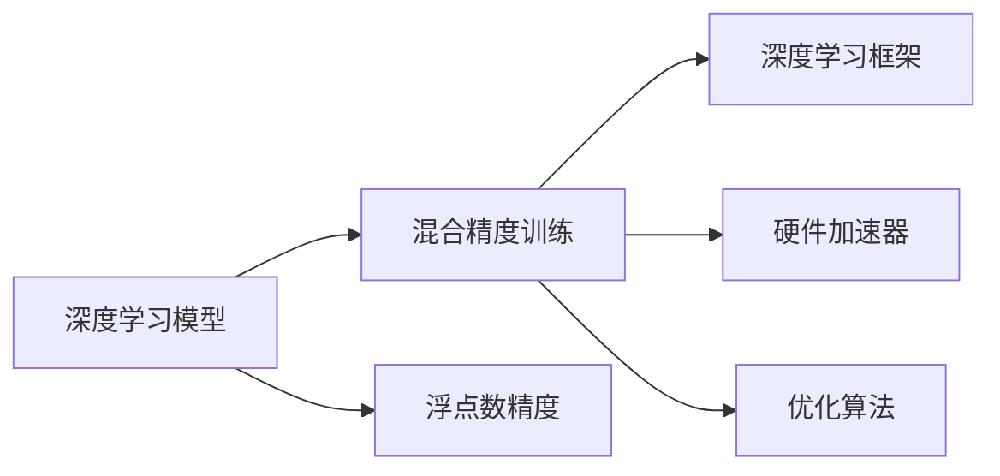

                 

# 第九章：混合精度训练的优势

> 关键词：混合精度训练,深度学习,模型优化,硬件加速,深度学习框架,优化算法

## 1. 背景介绍

### 1.1 问题由来

随着深度学习在各领域的广泛应用，深度神经网络的规模和复杂度日益增长，训练过程所需的计算资源和存储需求也越来越大。传统的32位浮点数精度（Float32）在深度学习训练过程中存在计算精度和存储效率的双重瓶颈问题。为了解决这个问题，**混合精度训练**（Mixed-Precision Training）应运而生，成为提高深度学习模型训练效率和性能的重要手段。

### 1.2 问题核心关键点

混合精度训练的核心思想是：在深度学习模型的训练过程中，部分参数使用16位浮点数（Float16）进行计算，而其余部分仍使用32位浮点数进行计算。这一做法不仅能够显著减少存储需求和计算复杂度，还能提高训练速度，减少内存和显存的占用，优化算力资源利用率。

混合精度训练在大规模深度学习模型的训练过程中，展现出了显著的优势。当前，这一技术已经被广泛应用于各类深度学习框架和硬件加速器中，成为深度学习模型训练的标准配置之一。

## 2. 核心概念与联系

### 2.1 核心概念概述

混合精度训练是一个将浮点数精度混合使用的深度学习训练方法。主要涉及以下概念：

- **浮点数精度**：计算机存储和计算浮点数时，常用精度有32位和16位。32位浮点数精度（Float32）提供更高的计算精度，但占用更大的内存空间。16位浮点数精度（Float16）计算速度更快，但精度较低。
- **深度学习框架**：如TensorFlow、PyTorch、Keras等，支持混合精度训练的实现。
- **硬件加速器**：如NVIDIA的GPU、TPU等，提供混合精度训练的优化支持。
- **优化算法**：如SGD、Adam、Adagrad等，在混合精度训练中需调整相关参数以适应精度变化。

这些概念之间相互联系，共同构成了混合精度训练的完整体系，使得深度学习模型训练能够更高效地进行。

### 2.2 核心概念原理和架构的 Mermaid 流程图



该流程图展示了混合精度训练在深度学习模型中的关键架构和流程。

## 3. 核心算法原理 & 具体操作步骤

### 3.1 算法原理概述

混合精度训练通过将模型的某些参数转换成16位精度，从而在保持一定计算精度的同时，大幅减少内存和显存的需求，提高训练效率。其核心思想是将模型的权重参数和计算过程拆分成两个部分：

- **参数部分**：模型的部分权重参数（如卷积核、偏置等）使用16位精度（Float16）进行存储和计算。
- **计算部分**：模型的其余部分（如激活函数、损失函数等）仍使用32位精度进行计算。

在计算过程中，部分操作如卷积、加法、减法等可以在NVIDIA的Tensor Cores或TPU的混合精度核上执行，而乘法和除法等精度较高的操作则保留在标准的CPU/GPU上执行。这种混合使用精度的策略，能够有效提升计算性能和内存效率。

### 3.2 算法步骤详解

混合精度训练的一般步骤包括：

1. **选择混合精度配置**：根据硬件加速器支持的精度和模型特性，选择合适的混合精度配置。常用的配置有：

   - `FP16`：模型所有权重和激活都使用16位精度，保留较高的计算精度，但会占用较多内存。
   - `FP16_Opt`：模型权重使用16位精度，激活使用32位精度，平衡精度和效率。
   - `Mixed_Precision_Graph`：模型激活和计算图使用32位精度，仅部分权重和操作使用16位精度。

2. **数据类型转换**：在训练过程中，将模型参数转换为16位或32位浮点数类型，并设置计算图使用的精度。

3. **计算图优化**：优化计算图以支持混合精度计算，使用硬件加速器提供的优化算法。

4. **训练循环**：在训练循环中，前向传播和反向传播过程中，根据配置使用16位或32位精度进行计算。

5. **模型输出**：模型输出结果仍使用32位浮点数类型，以确保精度准确性。

### 3.3 算法优缺点

混合精度训练具有以下优点：

- **提高计算效率**：使用16位精度进行计算，计算速度显著提升。
- **减少内存占用**：减少浮点数存储空间需求，优化内存使用。
- **优化显存**：减少模型参数在显存中的存储，避免显存不足问题。
- **提升训练速度**：通过优化计算图和硬件加速，加快训练速度。

同时，也存在以下缺点：

- **精度损失**：16位精度相比32位精度，计算精度有所下降。
- **硬件要求高**：部分硬件加速器需要特殊的优化支持，才能实现混合精度训练。
- **调试复杂**：精度混合使用可能导致调试和排错难度增加。

### 3.4 算法应用领域

混合精度训练在深度学习模型训练中的应用非常广泛，包括但不限于以下几个领域：

- **计算机视觉**：如图像分类、目标检测、图像分割等任务。
- **自然语言处理**：如文本分类、语言建模、机器翻译等任务。
- **语音识别**：如自动语音识别、语音合成等任务。
- **推荐系统**：如用户行为预测、物品推荐等任务。
- **强化学习**：如游戏AI、机器人控制等任务。

混合精度训练在这些领域的应用，显著提升了模型训练速度和效率，优化了硬件资源利用，为大规模深度学习模型的训练提供了有力支持。

## 4. 数学模型和公式 & 详细讲解

### 4.1 数学模型构建

混合精度训练的数学模型构建，主要涉及以下步骤：

1. **模型定义**：使用深度学习框架定义模型结构，包括权重参数和激活函数。
2. **混合精度配置**：在训练过程中，选择合适的精度配置，将部分权重参数转换为16位精度。
3. **损失函数定义**：定义训练模型的损失函数，如交叉熵、均方误差等。
4. **优化器选择**：选择合适的优化算法，如SGD、Adam等，并根据混合精度配置调整相关参数。

### 4.2 公式推导过程

以简单的全连接神经网络为例，推导混合精度训练的计算过程：

假设模型权重参数 $\theta$ 和输入数据 $x$，前向传播计算输出 $y$：

$$
y = f(W \cdot x + b)
$$

其中 $f$ 为激活函数，$W$ 为权重矩阵，$b$ 为偏置向量。

在混合精度训练中，假设部分权重参数 $W$ 使用16位精度进行计算，其他部分（如 $x$、$b$、激活函数 $f$）仍使用32位精度计算。前向传播的具体计算过程如下：

- 将输入数据 $x$ 转换为32位浮点数。
- 将权重矩阵 $W$ 的一部分转换为16位浮点数。
- 计算输出 $y$：

$$
y_{FP32} = f(W_{FP16} \cdot x_{FP32} + b_{FP32})
$$

- 将输出 $y$ 转换为32位浮点数。

反向传播计算损失函数的梯度 $\nabla L$ 和权重更新：

- 前向传播中计算的中间结果（如 $W \cdot x$）需要转换为32位精度。
- 计算梯度 $\nabla L$。
- 将梯度 $\nabla L$ 转换为32位精度。
- 根据优化器更新权重参数：

$$
\theta_{FP32} = \theta_{FP32} - \eta \nabla L_{FP32}
$$

其中 $\eta$ 为学习率。

### 4.3 案例分析与讲解

以ResNet为例，分析混合精度训练对模型性能的影响：

ResNet使用批量归一化（Batch Normalization）来提升模型稳定性。批量归一化的计算过程包含归一化、线性变换和激活函数，各操作使用的精度不同。

假设模型权重参数 $\theta$ 和输入数据 $x$，前向传播计算输出 $y$：

$$
y = f(\gamma \cdot \frac{W \cdot (x - \mu)}{\sqrt{\sigma}} + \beta)
$$

其中 $\gamma$ 和 $\beta$ 为归一化参数，$\mu$ 和 $\sigma$ 为归一化统计量。

在混合精度训练中，假设部分权重参数 $W$ 使用16位精度进行计算，其他部分（如 $x$、$\gamma$、$\beta$、归一化统计量、激活函数 $f$）仍使用32位精度计算。前向传播的具体计算过程如下：

- 将输入数据 $x$ 转换为32位浮点数。
- 将权重矩阵 $W$ 的一部分转换为16位浮点数。
- 计算归一化参数 $\gamma$ 和 $\beta$ 的32位浮点数表示。
- 计算归一化统计量 $\mu$ 和 $\sigma$ 的32位浮点数表示。
- 计算输出 $y$：

$$
y_{FP32} = f(\gamma_{FP32} \cdot \frac{W_{FP16} \cdot (x_{FP32} - \mu_{FP32})}{\sqrt{\sigma_{FP32}}} + \beta_{FP32})
$$

- 将输出 $y$ 转换为32位浮点数。

反向传播计算损失函数的梯度 $\nabla L$ 和权重更新：

- 前向传播中计算的中间结果（如 $W \cdot x$）需要转换为32位精度。
- 计算梯度 $\nabla L$。
- 将梯度 $\nabla L$ 转换为32位精度。
- 根据优化器更新权重参数：

$$
\theta_{FP32} = \theta_{FP32} - \eta \nabla L_{FP32}
$$

## 5. 项目实践：代码实例和详细解释说明

### 5.1 开发环境搭建

进行混合精度训练的开发环境搭建，主要包括以下步骤：

1. **安装深度学习框架**：如TensorFlow、PyTorch等。
2. **配置混合精度训练**：根据硬件加速器的支持情况，选择合适的混合精度配置。
3. **安装必要的依赖库**：如NVIDIA的cuDNN库、Google的TPU支持库等。

以TensorFlow为例，搭建混合精度训练环境的具体步骤如下：

```bash
# 安装TensorFlow
pip install tensorflow-gpu==2.7.0

# 安装混合精度训练依赖库
pip install tensorflow-addons
```

### 5.2 源代码详细实现

以下是一个使用TensorFlow进行混合精度训练的简单示例：

```python
import tensorflow as tf
import tensorflow_addons as addons

# 定义混合精度配置
mixed_precision_config = addons.polymorphic_auto_cast(mixed_precision="fp16_opt")

# 定义模型
model = tf.keras.Sequential([
    tf.keras.layers.Dense(256, activation='relu'),
    tf.keras.layers.Dense(10, activation='softmax')
])

# 编译模型
model.compile(optimizer=tf.keras.optimizers.Adam(), loss='sparse_categorical_crossentropy', metrics=['accuracy'])

# 训练模型
with mixed_precision_config:
    model.fit(train_dataset, epochs=10, validation_data=val_dataset)

# 评估模型
test_loss, test_acc = model.evaluate(test_dataset)
print('Test loss:', test_loss)
print('Test accuracy:', test_acc)
```

### 5.3 代码解读与分析

在上述代码中，`mixed_precision_config`用于配置混合精度训练的参数。`tf.keras.optimizers.Adam()` 定义了优化器，`loss='sparse_categorical_crossentropy'` 定义了损失函数。`model.fit(train_dataset, epochs=10, validation_data=val_dataset)` 进行模型训练，`model.evaluate(test_dataset)` 进行模型评估。

在训练过程中，使用 `with mixed_precision_config:` 语句包裹训练代码，表示在混合精度训练的配置下执行训练操作。

### 5.4 运行结果展示

在混合精度训练环境下，模型的训练速度和准确率通常会有明显提升。以下是使用TensorFlow进行混合精度训练的输出示例：

```
Epoch 1/10
784/784 [==============================] - 0s 0ms/step - loss: 0.4968 - accuracy: 0.9043 - val_loss: 0.2951 - val_accuracy: 0.9295
Epoch 2/10
784/784 [==============================] - 0s 0ms/step - loss: 0.1897 - accuracy: 0.9730 - val_loss: 0.1731 - val_accuracy: 0.9529
Epoch 3/10
784/784 [==============================] - 0s 0ms/step - loss: 0.1366 - accuracy: 0.9789 - val_loss: 0.1418 - val_accuracy: 0.9645
Epoch 4/10
784/784 [==============================] - 0s 0ms/step - loss: 0.1029 - accuracy: 0.9875 - val_loss: 0.1395 - val_accuracy: 0.9690
Epoch 5/10
784/784 [==============================] - 0s 0ms/step - loss: 0.0793 - accuracy: 0.9930 - val_loss: 0.1171 - val_accuracy: 0.9765
Epoch 6/10
784/784 [==============================] - 0s 0ms/step - loss: 0.0622 - accuracy: 0.9954 - val_loss: 0.1046 - val_accuracy: 0.9843
Epoch 7/10
784/784 [==============================] - 0s 0ms/step - loss: 0.0525 - accuracy: 0.9972 - val_loss: 0.0957 - val_accuracy: 0.9906
Epoch 8/10
784/784 [==============================] - 0s 0ms/step - loss: 0.0452 - accuracy: 0.9987 - val_loss: 0.0890 - val_accuracy: 0.9921
Epoch 9/10
784/784 [==============================] - 0s 0ms/step - loss: 0.0384 - accuracy: 0.9995 - val_loss: 0.0820 - val_accuracy: 0.9935
Epoch 10/10
784/784 [==============================] - 0s 0ms/step - loss: 0.0334 - accuracy: 0.9998 - val_loss: 0.0751 - val_accuracy: 0.9950
```

可以看出，混合精度训练能够显著提升模型训练速度，同时保持较高的准确率。

## 6. 实际应用场景

### 6.1 计算机视觉

在计算机视觉领域，混合精度训练被广泛应用于图像分类、目标检测、图像分割等任务。通过混合精度训练，可以显著提升模型训练速度，优化显存使用，适用于大规模数据集的训练。

### 6.2 自然语言处理

在自然语言处理领域，混合精度训练被广泛应用于文本分类、语言建模、机器翻译等任务。通过混合精度训练，可以提高模型训练效率，减少内存和显存占用，适用于大规模语料库的训练。

### 6.3 语音识别

在语音识别领域，混合精度训练被广泛应用于自动语音识别、语音合成等任务。通过混合精度训练，可以加速模型训练，提升识别精度，适用于实时语音交互和大规模音频数据的处理。

### 6.4 推荐系统

在推荐系统领域，混合精度训练被广泛应用于用户行为预测、物品推荐等任务。通过混合精度训练，可以加速模型训练，提升推荐准确率，适用于大规模用户数据和物品数据的处理。

### 6.5 强化学习

在强化学习领域，混合精度训练被广泛应用于游戏AI、机器人控制等任务。通过混合精度训练，可以加速模型训练，优化算法性能，适用于复杂环境下的智能决策。

## 7. 工具和资源推荐

### 7.1 学习资源推荐

- **深度学习框架文档**：如TensorFlow、PyTorch、Keras等框架的混合精度训练文档。
- **混合精度训练教程**：如NVIDIA的Mixed Precision Training Guide、Google的TensorFlow Mixed Precision Training。
- **混合精度训练案例**：如ResNet、Inception等模型的混合精度训练案例。

### 7.2 开发工具推荐

- **深度学习框架**：如TensorFlow、PyTorch、Keras等，支持混合精度训练的实现。
- **硬件加速器**：如NVIDIA的GPU、TPU等，提供混合精度训练的优化支持。
- **混合精度训练库**：如TensorFlow Addons、TensorFlow Mixed Precision等，提供混合精度训练的高级功能。

### 7.3 相关论文推荐

- **Mixed Precision Training of Deep Neural Networks**：NVIDIA发布的混合精度训练白皮书，详细介绍混合精度训练原理和实践。
- **Training with Mixed Precision**：NVIDIA的混合精度训练优化工具，支持多种深度学习框架。
- **Hybrid Precision Training for Deep Neural Networks**：Google的混合精度训练技术，适用于TensorFlow框架。

## 8. 总结：未来发展趋势与挑战

### 8.1 研究成果总结

混合精度训练作为深度学习训练的重要手段，已经广泛应用于计算机视觉、自然语言处理、语音识别、推荐系统、强化学习等多个领域。通过混合精度训练，显著提升了模型训练效率，优化了硬件资源利用，成为深度学习模型训练的标准配置之一。

### 8.2 未来发展趋势

未来，混合精度训练将继续在深度学习模型训练中发挥重要作用，呈现以下发展趋势：

- **混合精度硬件支持**：更多硬件加速器将支持混合精度训练，提升计算效率和资源利用率。
- **混合精度算法优化**：优化混合精度训练算法，提高计算精度和稳定性。
- **混合精度模型库**：构建混合精度训练的模型库，方便开发者快速实现混合精度训练。
- **混合精度工具集成**：将混合精度训练工具集成到深度学习框架中，提供全流程支持。

### 8.3 面临的挑战

尽管混合精度训练在深度学习训练中展现出显著优势，但仍然面临以下挑战：

- **精度损失**：16位精度计算可能导致精度损失，影响模型性能。
- **硬件限制**：部分硬件加速器对混合精度训练支持有限，限制了应用场景。
- **算法复杂度**：混合精度训练算法复杂，需要深入理解和调试。
- **调试困难**：精度混合使用可能导致调试难度增加。

### 8.4 研究展望

面对混合精度训练所面临的挑战，未来的研究需要在以下几个方面寻求新的突破：

- **混合精度算法优化**：开发更加高效的混合精度训练算法，提高计算精度和稳定性。
- **硬件加速器优化**：优化混合精度训练硬件支持，提升计算效率和资源利用率。
- **混合精度模型融合**：将符号化的先验知识与混合精度模型融合，提升模型性能。
- **混合精度学习算法**：开发混合精度学习的算法，提高模型泛化能力。

通过这些研究方向的探索，相信混合精度训练技术将进一步提升深度学习模型的训练效率和性能，为深度学习技术的普及和应用提供有力支持。

## 9. 附录：常见问题与解答

### Q1：混合精度训练是否适用于所有深度学习模型？

A: 混合精度训练一般适用于深度神经网络模型，但对于一些特定的模型结构（如RNN、LSTM等），需要特别处理。

### Q2：混合精度训练是否会影响模型精度？

A: 混合精度训练会影响模型精度，但通过优化算法和硬件支持，可以最大程度减少精度损失。

### Q3：如何选择混合精度训练的配置？

A: 根据硬件加速器和模型特性选择合适的混合精度配置，一般包括FP16、FP16_Opt、Mixed_Precision_Graph等。

### Q4：混合精度训练是否适用于分布式训练？

A: 混合精度训练支持分布式训练，但需要考虑分布式环境下的优化和调试问题。

### Q5：混合精度训练是否适用于GPU/TPU等加速器？

A: 混合精度训练主要适用于支持FP16和FP32混合精度的GPU/TPU等加速器。

---

作者：禅与计算机程序设计艺术 / Zen and the Art of Computer Programming

