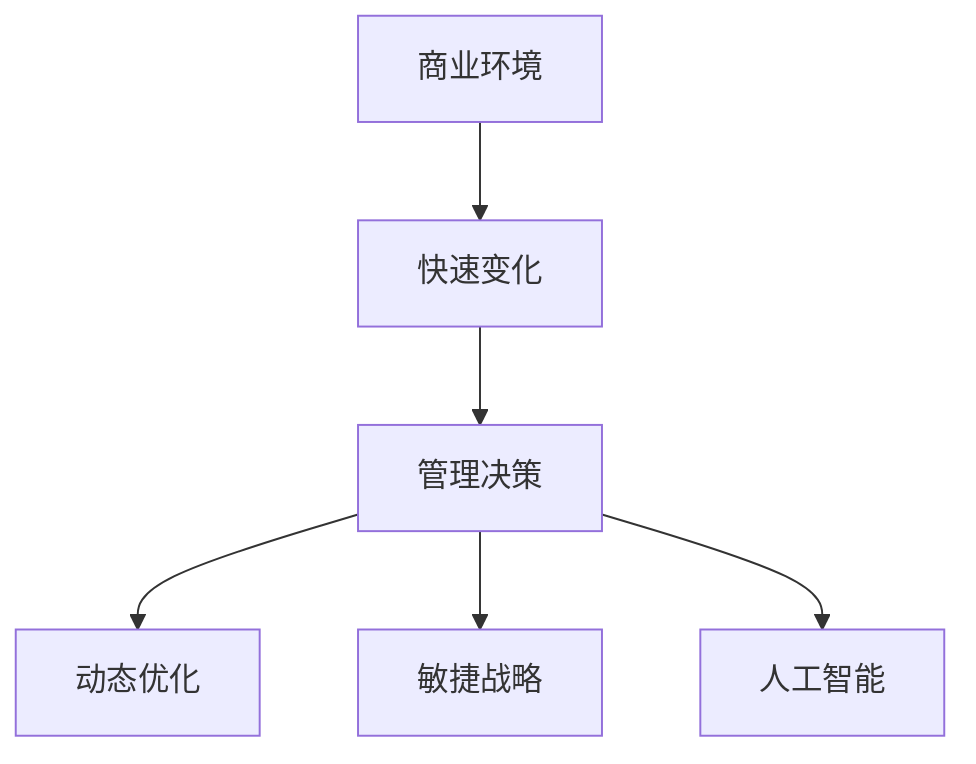

                 

# 管理者如何应对快速变化的商业环境

> 关键词：商业环境, 快速变化, 管理决策, 动态优化, 敏捷战略, 人工智能

## 1. 背景介绍

### 1.1 问题由来

在全球化和信息化的推动下，商业环境正经历前所未有的快速变化。技术创新、市场竞争、消费者需求等多重因素不断交织，对企业的运营模式和战略决策提出了新的挑战。传统的静态管理模式已难以适应日益复杂和动态的商业环境。

近年来，人工智能(AI)、大数据、云计算等技术飞速发展，为企业管理者提供了一种全新的视角和工具，帮助他们应对快速变化的商业环境。通过智能化的管理手段，管理者可以更有效地捕捉市场机会，优化资源配置，提升竞争力。

### 1.2 问题核心关键点

现代商业环境中的快速变化主要体现在以下几个方面：

- **市场需求的快速变化**：消费者的需求和偏好快速变化，市场细分越来越细，竞争日益激烈。
- **技术的飞速发展**：新技术、新工具不断涌现，对企业运营模式和业务流程提出新的要求。
- **全球化的影响**：全球市场的联动效应增强，国际贸易环境的变化对企业运营有直接影响。
- **数据驱动的决策**：数据成为企业决策的重要依据，如何高效利用数据，提取有价值的信息，成为企业管理的核心任务。

面对这些变化，企业管理者需要从传统的反应式管理转变为预测式管理，通过数据分析、智能预测、自动化决策等手段，不断优化管理策略，提升企业应对变化的灵活性和效率。

## 2. 核心概念与联系

### 2.1 核心概念概述

为更好地理解管理者如何应对快速变化的商业环境，本节将介绍几个密切相关的核心概念：

- **商业环境**：指影响企业运营和管理的宏观和微观因素，包括市场需求、技术进步、政策法规、竞争对手等。
- **快速变化**：指商业环境中的各种因素以极快的速度变化，企业需要迅速调整策略以适应。
- **管理决策**：指管理者根据环境变化，制定和实施的战略、计划和行动方案，包括预算、资源配置、运营优化等。
- **动态优化**：指管理过程和决策过程中使用动态模型和算法，持续改进和优化管理效果。
- **敏捷战略**：指通过快速响应市场变化，灵活调整战略和策略，提升企业对变化的适应能力。
- **人工智能**：指通过机器学习、深度学习等技术，提升数据处理和决策能力，为企业管理提供智能化支持。

这些核心概念之间的逻辑关系可以通过以下Mermaid流程图来展示：



这个流程图展示了几者之间的联系：商业环境的变化导致快速变化，快速变化迫使管理层进行动态优化和敏捷战略的调整，而人工智能提供了强有力的技术支持，帮助管理者实现动态优化和敏捷战略。

## 3. 核心算法原理 & 具体操作步骤
### 3.1 算法原理概述

管理者应对快速变化的商业环境，本质上是一个动态优化和敏捷战略调整的过程。其核心思想是：通过持续的数据分析和模型优化，不断调整和优化企业的运营策略和资源配置，以适应不断变化的商业环境。

具体而言，管理者可以按照以下步骤进行：

1. **数据收集与处理**：收集和整理与商业环境相关的各类数据，如市场趋势、消费者行为、竞争对手动态等。
2. **数据分析与建模**：使用统计分析和机器学习模型对数据进行分析和建模，提取有价值的信息和规律。
3. **预测与优化**：基于分析结果，进行市场预测和资源优化，制定和调整企业的战略和策略。
4. **执行与监控**：将优化策略转化为具体的行动计划，并在实施过程中进行监控和调整。

### 3.2 算法步骤详解

管理者应对快速变化的商业环境，一般包括以下几个关键步骤：

**Step 1: 数据收集与处理**
- 确定需要收集的数据类型和来源，如市场调研报告、社交媒体数据、客户反馈等。
- 使用ETL工具对数据进行清洗、去重和整合，确保数据的质量和一致性。
- 对数据进行分类和标注，便于后续分析和建模。

**Step 2: 数据分析与建模**
- 使用统计分析和机器学习算法对数据进行特征工程和建模。
- 选择合适的模型和算法，如回归分析、分类算法、聚类算法等，进行数据挖掘和预测。
- 对模型进行调参和优化，确保模型的准确性和稳定性。

**Step 3: 预测与优化**
- 基于分析结果进行市场预测和资源优化，制定和调整企业的战略和策略。
- 使用动态优化算法，如强化学习、遗传算法等，持续改进和优化管理效果。
- 根据预测结果和市场反馈，灵活调整资源配置和业务流程。

**Step 4: 执行与监控**
- 将优化策略转化为具体的行动计划，如调整营销策略、优化供应链管理、改进产品设计等。
- 在实施过程中进行实时监控和反馈，及时调整和优化策略。
- 定期评估和复盘，总结经验教训，持续改进和优化管理流程。

### 3.3 算法优缺点

管理者应对快速变化的商业环境的方法具有以下优点：
1. 数据驱动决策。通过数据分析和模型预测，使得决策过程更加科学和精准。
2. 动态优化资源配置。能够及时捕捉市场变化，灵活调整资源配置，提高效率。
3. 提升竞争力。通过敏捷战略和智能化手段，快速适应市场变化，提升企业竞争力。

同时，该方法也存在一定的局限性：
1. 数据质量问题。数据收集和处理过程中可能存在噪音和偏差，影响分析结果。
2. 模型选择和调参难度。选择合适的模型和算法，以及进行有效的调参，是技术上的挑战。
3. 解释性不足。复杂的模型和算法可能缺乏可解释性，难以理解其内部工作机制。
4. 安全性和隐私问题。数据收集和处理过程中可能涉及敏感信息，如何保护隐私和数据安全，是一大挑战。

尽管存在这些局限性，但就目前而言，基于动态优化和敏捷战略的方法是应对快速变化商业环境的最主流范式。未来相关研究的重点在于如何进一步降低数据质量问题，提高模型解释性，以及增强数据安全和隐私保护等方面。

### 3.4 算法应用领域

基于动态优化和敏捷战略的方法，在企业管理中的应用非常广泛，涵盖了多个行业领域，例如：

- **零售行业**：通过数据分析和预测，优化库存管理、供应链优化、价格策略等，提升销售效率和利润率。
- **金融行业**：利用机器学习和人工智能技术，进行市场预测、风险评估、投资决策等，提高资本运作效率。
- **制造业**：通过数据驱动的生产调度和质量控制，提升生产效率和产品品质。
- **服务行业**：使用智能客服和推荐系统，提升客户体验和满意度。
- **医疗行业**：通过数据分析和机器学习模型，辅助诊疗决策、药物研发等，提高医疗服务质量。

除了上述这些典型领域外，基于动态优化和敏捷战略的方法也被创新性地应用到更多场景中，如智能合约、智慧物流、社交媒体管理等，为企业带来全新的业务机遇。

## 4. 数学模型和公式 & 详细讲解 & 举例说明
### 4.1 数学模型构建

管理者应对快速变化的商业环境，可以构建如下数学模型：

假设商业环境中的关键因素可以表示为 $X=\{x_1, x_2, ..., x_n\}$，其对应的数值为 $y_i \in [0,1]$，表示因素 $x_i$ 对企业运营的影响程度。定义目标函数 $f(X)$ 表示企业的整体运营效率和盈利能力，其中 $f(x_1, x_2, ..., x_n)$ 是一个多变量函数。

定义 $C_i$ 为调整策略后的成本，$S_i$ 为调整策略后的收益，则优化目标可以表示为：

$$
\max_{\{x_i\}} f(x_1, x_2, ..., x_n) - C_i + S_i
$$

其中，$x_i$ 表示企业对因素 $x_i$ 的调整策略，包括预算、资源分配、市场策略等。

### 4.2 公式推导过程

以下我们以零售行业为例，推导一个简单的优化模型。

假设零售企业有 $n$ 个产品，每个产品对应的市场需求 $D_i$ 可以通过历史销售数据预测得到。设 $C_i$ 为产品 $i$ 的单位成本，$P_i$ 为产品 $i$ 的销售价格，$S_i$ 为产品 $i$ 的销售收益。企业需要最大化销售收益，最小化成本，即：

$$
\max_{\{D_i, P_i\}} \sum_{i=1}^n S_i - C_i
$$

其中，$S_i = D_i \cdot P_i$，$C_i = D_i \cdot C_i$。

为了简化问题，我们假设每个产品的需求和价格都是独立的，可以分别优化。则优化问题可以分解为：

$$
\max_{D_i} D_i \cdot P_i - D_i \cdot C_i
$$

对于单个产品 $i$，需求 $D_i$ 可以通过回归模型预测得到：

$$
D_i = f(x_i, \beta)
$$

其中，$x_i$ 表示与需求相关的各类因素，$\beta$ 为回归模型系数。

将上述模型转化为求解目标函数 $f(x_i, \beta)$ 的优化问题，使用梯度下降等优化算法，最小化损失函数 $L(\beta)$，得到最优的回归模型参数 $\beta^*$。

### 4.3 案例分析与讲解

假设某零售企业有三种产品 A、B、C，每件产品单价分别为 $P_A=10$、$P_B=20$、$P_C=30$，单位成本分别为 $C_A=5$、$C_B=10$、$C_C=15$，产品 A、B、C 的需求分别为 $D_A=1000$、$D_B=800$、$D_C=600$。

企业需要最大化销售收益，最小化成本，即：

$$
\max_{D_A, D_B, D_C} S - C
$$

其中，$S = D_A \cdot P_A + D_B \cdot P_B + D_C \cdot P_C$，$C = D_A \cdot C_A + D_B \cdot C_B + D_C \cdot C_C$。

假设产品需求 $D_A$、$D_B$、$D_C$ 可以通过历史数据预测得到，并使用线性回归模型进行建模，得到：

$$
D_A = 1000 + 0.5 \cdot x_1 + 0.2 \cdot x_2 - 0.1 \cdot x_3
$$

$$
D_B = 800 + 0.3 \cdot x_1 - 0.1 \cdot x_2 + 0.2 \cdot x_3
$$

$$
D_C = 600 + 0.2 \cdot x_1 - 0.5 \cdot x_2 + 0.3 \cdot x_3
$$

其中 $x_1$、$x_2$、$x_3$ 表示影响需求的各类因素，如季节、促销、竞争对手价格等。

通过优化算法求解，得到最优的回归模型参数 $\beta^*$，进而得到最优的需求预测值和销售收益。企业可以根据预测结果调整产品价格和库存，实现最优的销售策略。

## 5. 项目实践：代码实例和详细解释说明
### 5.1 开发环境搭建

在进行商业环境优化实践前，我们需要准备好开发环境。以下是使用Python进行PyTorch开发的环境配置流程：

1. 安装Anaconda：从官网下载并安装Anaconda，用于创建独立的Python环境。

2. 创建并激活虚拟环境：
```bash
conda create -n pytorch-env python=3.8 
conda activate pytorch-env
```

3. 安装PyTorch：根据CUDA版本，从官网获取对应的安装命令。例如：
```bash
conda install pytorch torchvision torchaudio cudatoolkit=11.1 -c pytorch -c conda-forge
```

4. 安装相关的依赖库：
```bash
pip install numpy pandas scikit-learn scipy statsmodels
```

完成上述步骤后，即可在`pytorch-env`环境中开始优化实践。

### 5.2 源代码详细实现

下面我们以零售行业为例，给出使用PyTorch进行商业环境优化的PyTorch代码实现。

首先，定义零售行业的数据处理函数：

```python
import pandas as pd
import numpy as np
from sklearn.linear_model import LinearRegression

def preprocess_data(data):
    data = data.dropna()
    features = data[['x1', 'x2', 'x3']]
    targets = data['y']
    features = np.array(features)
    targets = np.array(targets)
    return features, targets

# 读取数据
data = pd.read_csv('retail_data.csv')

# 数据预处理
features, targets = preprocess_data(data)
```

然后，定义优化目标函数和求解过程：

```python
from scipy.optimize import minimize

def objective(beta):
    features = features[:, [0, 1, 2]]
    targets = targets[:, 0]
    predictions = np.dot(features, beta)
    return np.linalg.norm(targets - predictions)

# 优化过程
initial_guess = np.random.randn(4)
result = minimize(objective, initial_guess, bounds=[(-10, 10)]*4, method='L-BFGS-B', options={'disp': True})
```

接着，计算最优的需求预测值和销售收益：

```python
features_opt = features[:, [0, 1, 2]]
targets_opt = targets[:, 0]
beta_opt = result.x
predictions_opt = np.dot(features_opt, beta_opt)
y_opt = predictions_opt + targets_opt
```

最后，输出最优的结果：

```python
print("最优预测值：", predictions_opt)
print("最优销售收益：", y_opt)
```

以上就是使用PyTorch进行零售行业商业环境优化的完整代码实现。可以看到，利用机器学习模型，企业可以更加科学地进行需求预测和销售优化。

### 5.3 代码解读与分析

让我们再详细解读一下关键代码的实现细节：

**preprocess_data函数**：
- 去除数据中的缺失值。
- 提取影响需求的相关特征。
- 将特征和目标变量转换为NumPy数组。

**objective函数**：
- 使用线性回归模型预测目标变量。
- 计算预测值与实际值之间的误差。
- 返回误差平方和作为优化目标函数。

**minimize函数**：
- 设置优化算法的初始猜测值。
- 设置优化的上下界。
- 使用L-BFGS-B算法进行优化。

**优化结果的解释**：
- 输出最优的回归模型参数 $\beta$。
- 计算最优的预测值 $y_{opt}$。
- 计算最优的销售收益 $y_{opt}$。

## 6. 实际应用场景
### 6.1 零售行业

在零售行业，基于动态优化和敏捷战略的方法可以广泛应用于库存管理、供应链优化、市场预测等环节。传统的库存管理往往依赖经验和方法论，难以适应快速变化的市场需求。

使用动态优化方法，企业可以通过实时监测和预测，及时调整库存水平，避免缺货或积压。例如，利用历史销售数据和市场趋势，构建动态库存模型，实时计算最优的库存量和补货策略。同时，企业还可以引入机器学习算法，对市场需求进行预测，提前制定生产计划和采购计划，降低库存成本。

### 6.2 金融行业

金融行业中的市场波动、汇率变化、利率调整等都是快速变化的因素，对企业的投资决策和风险管理提出挑战。利用动态优化和敏捷战略，金融企业可以更加精准地进行市场预测和风险评估，优化投资组合和资产配置。

例如，通过历史数据和实时行情，使用回归模型和机器学习算法预测股票价格和市场趋势，制定投资策略。同时，利用动态优化算法，根据市场变化和风险偏好，实时调整投资组合，最大化投资收益，最小化风险损失。

### 6.3 制造业

制造业中的生产调度和质量控制是典型的快速变化场景。市场需求、原材料价格、设备状态等诸多因素随时可能发生变化，要求企业能够快速响应和调整。

使用动态优化方法，制造企业可以实时监测生产过程，优化生产调度和资源配置。例如，通过传感器数据和机器学习算法，实时监测设备状态和生产效率，进行动态调度和预测维护。同时，企业还可以利用预测模型，对市场需求和供应链变化进行预测，提前调整生产计划和库存管理，确保供应链的稳定性和高效性。

### 6.4 服务行业

服务行业的客户需求和市场变化最为频繁，如何快速响应客户需求，提供优质服务，是企业管理的核心挑战。利用动态优化和敏捷战略，服务企业可以更加灵活地调整服务策略，提升客户满意度和忠诚度。

例如，利用社交媒体和客户反馈，使用机器学习算法进行情感分析和用户画像，制定个性化的服务策略。同时，利用动态优化算法，根据客户反馈和市场变化，实时调整服务内容和流程，提升服务质量和客户体验。

### 6.5 医疗行业

医疗行业中的疾病诊断、治疗方案和药品研发都需要快速响应和调整。患者需求、疾病流行、治疗效果等诸多因素随时可能发生变化，要求医疗企业能够快速响应和调整。

使用动态优化方法，医疗企业可以实时监测和预测，优化诊疗方案和资源配置。例如，通过电子病历和医疗影像，使用机器学习算法进行疾病诊断和预测，制定个性化的治疗方案。同时，利用动态优化算法，根据疾病流行和患者需求，实时调整治疗方案和资源配置，提升治疗效果和患者满意度。

## 7. 工具和资源推荐
### 7.1 学习资源推荐

为了帮助管理者掌握动态优化和敏捷战略的理论基础和实践技巧，这里推荐一些优质的学习资源：

1. 《动态系统与控制》系列书籍：介绍动态系统的基本理论和优化方法，是深入理解动态优化问题的必读书籍。
2. 《敏捷开发实践指南》：介绍敏捷开发的原则和方法，帮助管理者进行敏捷战略调整。
3. 《Python机器学习》：介绍机器学习和深度学习的基本概念和算法，适合快速上手数据驱动决策。
4. 《数据分析实战》：介绍数据分析的基本技术和工具，帮助管理者进行数据驱动的决策。
5. Coursera的《数据科学专项课程》：包含多门与数据科学相关的课程，涵盖数据处理、机器学习、数据可视化等多个方面。

通过对这些资源的学习实践，相信管理者可以系统掌握动态优化和敏捷战略的理论基础和实践技巧，更好地应对快速变化的商业环境。

### 7.2 开发工具推荐

高效的开发离不开优秀的工具支持。以下是几款用于商业环境优化开发的常用工具：

1. Jupyter Notebook：免费且功能强大的交互式开发环境，支持Python、R等多种编程语言，适合快速迭代和原型开发。
2. Scikit-learn：Python机器学习库，提供丰富的机器学习算法和工具，适合快速实现数据驱动的优化模型。
3. TensorFlow和PyTorch：领先的深度学习框架，支持分布式计算和高效模型训练，适合大规模数据驱动的优化项目。
4. Dask和Ray：分布式计算框架，适合处理大规模数据和任务，提升数据驱动的优化效率。
5. Tableau和Power BI：数据可视化工具，适合进行数据驱动的决策和展示。

合理利用这些工具，可以显著提升商业环境优化任务的开发效率，加快创新迭代的步伐。

### 7.3 相关论文推荐

商业环境优化技术的发展源于学界的持续研究。以下是几篇奠基性的相关论文，推荐阅读：

1. <NAME> 和 <NAME> 的《动态系统与控制》：介绍动态系统的基本理论和优化方法，是深入理解动态优化问题的经典书籍。
2. <NAME> 和 <NAME> 的《敏捷开发实践指南》：介绍敏捷开发的原则和方法，帮助管理者进行敏捷战略调整。
3. Schmidhuber 和 Hariharan 的《深度学习》：介绍深度学习的基本概念和算法，适合快速上手数据驱动的决策。
4. <NAME> 和 <NAME> 的《数据分析实战》：介绍数据分析的基本技术和工具，帮助管理者进行数据驱动的决策。
5. 《数据科学：实践与思考》：介绍数据科学的基本概念和实践，涵盖数据驱动决策和机器学习等多个方面。

这些论文代表了大商业环境优化技术的发展脉络。通过学习这些前沿成果，可以帮助管理者把握学科前进方向，激发更多的创新灵感。

## 8. 总结：未来发展趋势与挑战
### 8.1 总结

本文对管理者应对快速变化的商业环境的方法进行了全面系统的介绍。首先阐述了快速变化的商业环境对企业管理带来的挑战，明确了动态优化和敏捷战略在适应变化中的核心作用。其次，从原理到实践，详细讲解了动态优化和敏捷战略的数学模型和算法步骤，给出了商业环境优化的完整代码实例。同时，本文还广泛探讨了动态优化和敏捷战略在多个行业领域的应用前景，展示了其广阔的应用空间。此外，本文精选了动态优化和敏捷战略的学习资源，力求为管理者提供全方位的技术指引。

通过本文的系统梳理，可以看到，基于动态优化和敏捷战略的方法正在成为企业管理应对快速变化的重要手段，极大地提升了企业在动态环境中的适应能力和竞争优势。未来，伴随技术不断演进，动态优化和敏捷战略将在更多领域得到应用，为企业的持续发展提供坚实保障。

### 8.2 未来发展趋势

展望未来，商业环境优化技术将呈现以下几个发展趋势：

1. 数据驱动的决策更加普及。随着数据收集和处理技术的不断进步，企业将更加依赖数据驱动的决策，通过数据挖掘和预测，优化资源配置和业务流程。
2. 模型和算法更加智能化。利用深度学习、强化学习等先进技术，提升预测和优化算法的精度和效率。
3. 敏捷战略的普及化。敏捷方法论和工具将更加普及，帮助企业快速响应市场变化，提升决策和执行的灵活性。
4. 跨领域融合加速。动态优化和敏捷战略将与其他技术如区块链、物联网等进行更深层次的融合，推动技术创新和应用突破。
5. 技术生态系统的构建。通过构建开放的技术生态系统，促进技术交流和协作，加速技术落地和应用。

以上趋势凸显了动态优化和敏捷战略的广阔前景。这些方向的探索发展，必将进一步提升企业管理者的决策能力和适应性，推动企业在快速变化的市场环境中不断创新和突破。

### 8.3 面临的挑战

尽管动态优化和敏捷战略在企业管理中的应用已经取得了显著成果，但在迈向更加智能化、高效化的应用过程中，仍面临诸多挑战：

1. 数据质量和多样性问题。数据收集和处理过程中可能存在噪音和偏差，影响分析和预测结果。
2. 模型选择和调参难度。选择合适的模型和算法，以及进行有效的调参，是技术上的挑战。
3. 解释性和可控性问题。复杂的模型和算法可能缺乏可解释性，难以理解其内部工作机制。
4. 安全性和隐私问题。数据收集和处理过程中可能涉及敏感信息，如何保护隐私和数据安全，是一大挑战。
5. 技术集成难度。动态优化和敏捷战略需要与其他技术和系统进行深度集成，存在技术集成难度。

尽管存在这些挑战，但就目前而言，动态优化和敏捷战略是应对快速变化商业环境的最主流范式。未来相关研究的重点在于如何进一步降低数据质量问题，提高模型解释性，以及增强数据安全和隐私保护等方面。

### 8.4 研究展望

面对动态优化和敏捷战略所面临的挑战，未来的研究需要在以下几个方面寻求新的突破：

1. 探索无监督和半监督学习算法。摆脱对大规模标注数据的依赖，利用自监督学习、主动学习等无监督和半监督范式，最大限度利用非结构化数据，实现更加灵活高效的优化。
2. 研究参数高效和计算高效的优化范式。开发更加参数高效的优化方法，在固定大部分模型参数的同时，只更新极少量的任务相关参数。同时优化模型的计算图，减少前向传播和反向传播的资源消耗，实现更加轻量级、实时性的部署。
3. 融合因果和对比学习范式。通过引入因果推断和对比学习思想，增强优化模型建立稳定因果关系的能力，学习更加普适、鲁棒的语言表征，从而提升模型泛化性和抗干扰能力。
4. 引入更多先验知识。将符号化的先验知识，如知识图谱、逻辑规则等，与优化模型进行巧妙融合，引导优化过程学习更准确、合理的语言模型。同时加强不同模态数据的整合，实现视觉、语音等多模态信息与文本信息的协同建模。
5. 结合因果分析和博弈论工具。将因果分析方法引入优化模型，识别出模型决策的关键特征，增强输出解释的因果性和逻辑性。借助博弈论工具刻画人机交互过程，主动探索并规避模型的脆弱点，提高系统稳定性。
6. 纳入伦理道德约束。在优化目标中引入伦理导向的评估指标，过滤和惩罚有偏见、有害的输出倾向。同时加强人工干预和审核，建立模型行为的监管机制，确保输出符合人类价值观和伦理道德。

这些研究方向的探索，必将引领动态优化和敏捷战略技术迈向更高的台阶，为构建安全、可靠、可解释、可控的智能系统铺平道路。面向未来，动态优化和敏捷战略技术还需要与其他人工智能技术进行更深入的融合，如知识表示、因果推理、强化学习等，多路径协同发力，共同推动自然语言理解和智能交互系统的进步。只有勇于创新、敢于突破，才能不断拓展商业环境优化技术的边界，让智能技术更好地造福人类社会。

## 9. 附录：常见问题与解答

**Q1：动态优化和敏捷战略在企业管理中如何应用？**

A: 动态优化和敏捷战略在企业管理中的应用，主要体现在以下几个方面：

1. 数据驱动决策：通过数据分析和机器学习模型，提取有价值的信息和规律，优化企业决策过程。
2. 实时监控和预测：利用实时数据，构建动态模型，进行实时监控和预测，及时调整企业策略。
3. 敏捷战略调整：根据市场变化和业务需求，灵活调整战略和策略，提升企业应对变化的灵活性。
4. 资源优化配置：通过优化算法，实时调整资源配置，提高效率和效益。

**Q2：如何选择合适的优化算法和模型？**

A: 选择合适的优化算法和模型需要综合考虑多个因素：

1. 数据类型和分布：根据数据类型和分布选择适合的模型和算法，如回归、分类、聚类等。
2. 数据量和特征：对于大规模数据和复杂特征，可以选择分布式计算和深度学习算法，如TensorFlow、PyTorch等。
3. 优化目标和约束条件：根据优化目标和约束条件选择适合的算法，如最小二乘法、梯度下降法等。
4. 计算资源和效率：根据计算资源和效率选择适合的算法，如随机梯度下降、L-BFGS等。

**Q3：动态优化和敏捷战略的挑战有哪些？**

A: 动态优化和敏捷战略的挑战主要包括：

1. 数据质量和多样性问题：数据收集和处理过程中可能存在噪音和偏差，影响分析和预测结果。
2. 模型选择和调参难度：选择合适的模型和算法，以及进行有效的调参，是技术上的挑战。
3. 解释性和可控性问题：复杂的模型和算法可能缺乏可解释性，难以理解其内部工作机制。
4. 安全性和隐私问题：数据收集和处理过程中可能涉及敏感信息，如何保护隐私和数据安全，是一大挑战。
5. 技术集成难度：动态优化和敏捷战略需要与其他技术和系统进行深度集成，存在技术集成难度。

**Q4：动态优化和敏捷战略的未来发展方向是什么？**

A: 动态优化和敏捷战略的未来发展方向包括：

1. 探索无监督和半监督学习算法：摆脱对大规模标注数据的依赖，利用自监督学习、主动学习等无监督和半监督范式，最大限度利用非结构化数据，实现更加灵活高效的优化。
2. 研究参数高效和计算高效的优化范式：开发更加参数高效的优化方法，在固定大部分模型参数的同时，只更新极少量的任务相关参数。同时优化模型的计算图，减少前向传播和反向传播的资源消耗，实现更加轻量级、实时性的部署。
3. 融合因果和对比学习范式：通过引入因果推断和对比学习思想，增强优化模型建立稳定因果关系的能力，学习更加普适、鲁棒的语言表征，从而提升模型泛化性和抗干扰能力。
4. 引入更多先验知识：将符号化的先验知识，如知识图谱、逻辑规则等，与优化模型进行巧妙融合，引导优化过程学习更准确、合理的语言模型。同时加强不同模态数据的整合，实现视觉、语音等多模态信息与文本信息的协同建模。
5. 结合因果分析和博弈论工具：将因果分析方法引入优化模型，识别出模型决策的关键特征，增强输出解释的因果性和逻辑性。借助博弈论工具刻画人机交互过程，主动探索并规避模型的脆弱点，提高系统稳定性。
6. 纳入伦理道德约束：在优化目标中引入伦理导向的评估指标，过滤和惩罚有偏见、有害的输出倾向。同时加强人工干预和审核，建立模型行为的监管机制，确保输出符合人类价值观和伦理道德。

通过以上探索，相信动态优化和敏捷战略技术将不断突破现有瓶颈，为企业管理者提供更加智能化、高效化的解决方案。

**Q5：动态优化和敏捷战略在实际应用中需要注意哪些问题？**

A: 动态优化和敏捷战略在实际应用中需要注意以下几个问题：

1. 数据质量和多样性：确保数据的质量和多样性，避免因数据问题导致错误的分析和决策。
2. 模型选择和调参：根据数据和问题选择合适的模型和算法，进行有效的调参，确保模型的准确性和稳定性。
3. 解释性和可控性：确保模型的解释性和可控性，避免黑箱模型的使用，增强决策过程的透明性和可控性。
4. 安全性和隐私：确保数据和模型的安全性和隐私保护，避免敏感信息泄露和滥用。
5. 技术集成和部署：确保技术架构和系统集成的合理性和稳定性，避免因技术问题导致系统不稳定或崩溃。

通过合理处理这些问题，可以确保动态优化和敏捷战略在实际应用中的有效性，为企业带来真正的商业价值。

---

作者：禅与计算机程序设计艺术 / Zen and the Art of Computer Programming

