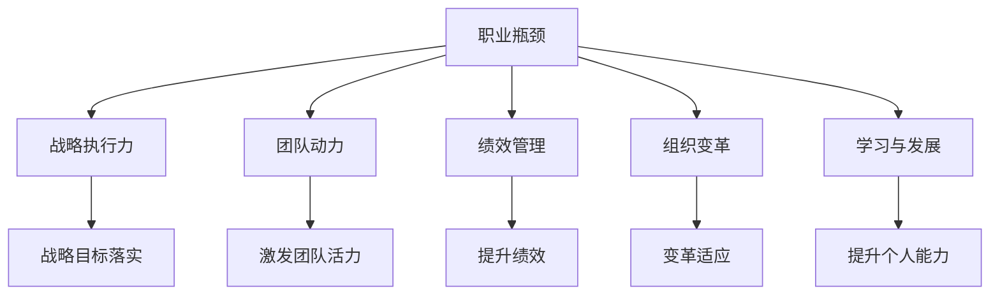

                 

# 管理者如何突破职业瓶颈

## 1. 背景介绍

管理者是企业中的核心角色，肩负着战略执行、团队建设、绩效管理等多重职责。然而，随着市场的快速变化、技术的发展和组织变革的深入，管理者常常面临各种挑战，如战略落实困难、团队动力不足、绩效管理复杂等，导致职业瓶颈的出现。本文旨在帮助管理者识别和克服这些挑战，实现职业生涯的突破。

## 2. 核心概念与联系

### 2.1 核心概念概述

为更好地理解如何突破职业瓶颈，本节将介绍几个密切相关的核心概念：

- **职业瓶颈**：指管理者在职业生涯中达到某个阶段后，发现职业发展受阻，难以进一步提升。
- **战略执行力**：指将企业战略转化为具体行动的能力，管理者需将高层战略落实到实际工作中。
- **团队动力**：指团队成员积极工作，充满活力和创造力，管理者需激发和维持这种动力。
- **绩效管理**：指通过设定目标、监控进展、反馈提升等手段，持续提高员工和团队绩效，管理者需制定合理的绩效评估体系。
- **组织变革**：指企业为适应市场变化、提升竞争力和效率，对组织结构、流程、文化等进行的根本性调整，管理者需适应并引领变革。
- **学习与发展**：指管理者不断学习新知识、新技能，适应环境变化，保持竞争优势，管理者需定期进行职业发展计划。

这些核心概念之间的逻辑关系可以通过以下Mermaid流程图来展示：



这个流程图展示了几大核心概念之间的关系：

1. 职业瓶颈影响战略执行力、团队动力、绩效管理、组织变革和学习发展。
2. 战略执行力、团队动力、绩效管理、组织变革和学习发展是突破职业瓶颈的重要手段。

## 3. 核心算法原理 & 具体操作步骤
### 3.1 算法原理概述

突破职业瓶颈的过程，本质上是一个优化决策和资源配置的过程。其核心思想是通过系统化的方法，识别和解决职业发展中的关键问题，优化管理者的行为和决策，提升整体管理效能。

形式化地，假设管理者面临的职业瓶颈为 $\textit{Bottleneck}$，其中包含多个子问题，如 $\textit{StrategyExecution, TeamMotivation, PerformanceManagement, OrganizationalChange, LearningAndDevelopment}$。设 $\textit{Optimize}$ 为优化目标函数，代表管理者需要最大化其职业发展潜力，即：

$$
\textit{Optimize} = \max \{\textit{Bottleneck}\} = \max \{\textit{StrategyExecution}, \textit{TeamMotivation}, \textit{PerformanceManagement}, \textit{OrganizationalChange}, \textit{LearningAndDevelopment}\}
$$

在实际管理中，管理者需要针对每个子问题设计具体的优化方案，并通过量化指标（如战略执行率、团队满意度、绩效提升率等）来评估效果。通过不断迭代调整，逐步提升整体管理水平。

### 3.2 算法步骤详解

管理者突破职业瓶颈的过程，一般包括以下几个关键步骤：

**Step 1: 识别职业瓶颈**

管理者需通过自我评估、员工反馈、绩效评估等方式，识别出具体的瓶颈问题。常用的方法包括360度反馈、绩效数据分析、团队满意度调查等。

**Step 2: 分析问题原因**

对于识别出的瓶颈问题，管理者需深入分析其根本原因。例如，若发现战略执行不力，需调查是战略制定不当还是执行机制不健全；若发现团队动力不足，需分析是管理风格不当还是激励机制不合理。

**Step 3: 制定解决方案**

根据问题原因，制定具体的解决方案。例如，若战略执行不力，需优化战略制定流程，强化执行机制；若团队动力不足，需优化激励机制，提升团队认同感。

**Step 4: 实施解决方案**

将制定的解决方案落实到具体行动中，例如调整组织结构、重塑团队文化、优化绩效管理制度等。

**Step 5: 监控与评估**

定期监控各项改进措施的进展和效果，根据评估结果进行调整和优化。例如，定期进行绩效评估、团队满意度调查、员工反馈收集等。

**Step 6: 持续改进**

根据评估结果和反馈信息，不断优化和改进管理策略，持续提升管理效能，逐步突破职业瓶颈。

### 3.3 算法优缺点

突破职业瓶颈的方法具有以下优点：
1. 系统性。通过全面分析问题，制定科学合理的解决方案，避免头痛医头、脚痛医脚。
2. 可量化。通过设定明确的量化指标，客观评估改进效果，提升管理决策的科学性。
3. 持续改进。通过定期监控和评估，不断调整和优化管理策略，实现持续进步。

同时，该方法也存在一定的局限性：
1. 复杂度高。识别和解决职业瓶颈涉及多个维度，需要较高的管理水平和系统思维。
2. 时间成本高。系统性分析和实施改进措施需较长时间，短期内难以看到明显效果。
3. 依赖数据。评估和改进的效果高度依赖于数据的准确性和完整性，数据质量不高将影响效果。
4. 需要高意愿。管理者需有较强的自我驱动和持续改进的意愿，才能有效实施。

尽管存在这些局限性，但就目前而言，系统性、量化的管理优化方法仍是大多数企业选择的主流手段。未来相关研究的重点在于如何进一步降低实施难度，提高管理优化效率，同时兼顾数据驱动和人文关怀等因素。

### 3.4 算法应用领域

突破职业瓶颈的方法，广泛应用于各类企业管理和人力资源管理中，具体包括：

- 战略管理：优化战略规划和执行，确保企业发展方向与市场变化同步。
- 人力资源管理：优化人才招聘、培训、激励机制，提升员工满意度和绩效。
- 团队建设：优化团队结构、角色分配、沟通机制，激发团队活力和创新能力。
- 绩效管理：优化绩效评估体系，确保绩效管理公平、合理，促进员工发展。
- 组织变革：适应市场和技术变化，优化组织结构、流程和制度，提升企业竞争力。
- 员工发展：提供职业发展路径和培训机会，帮助员工提升技能和素质。

除了上述这些经典应用外，职业瓶颈突破方法还被创新性地应用到更多场景中，如员工心理支持、工作环境改善等，为企业管理带来新的思路和突破点。

## 4. 数学模型和公式 & 详细讲解 & 举例说明

### 4.1 数学模型构建

为了更好地理解和管理者的职业瓶颈问题，本节将使用数学语言对突破职业瓶颈的方法进行严格的刻画。

设管理者面临的职业瓶颈为 $\textit{Bottleneck} = (S, T, P, O, L)$，其中 $S$ 为战略执行力，$T$ 为团队动力，$P$ 为绩效管理，$O$ 为组织变革，$L$ 为学习与发展。每个维度都有其具体的量化指标，如：

- $S = \{策略制定准确率, 执行率, 目标达成率\}$
- $T = \{团队满意度, 工作积极性, 创新能力\}$
- $P = \{绩效评估公平性, 员工满意度, 绩效提升率\}$
- $O = \{组织变革成功率, 流程优化效果, 文化变革接受度\}$
- $L = \{培训效果, 学习计划完成度, 知识共享频率\}$

通过设定优化目标函数 $\textit{Optimize} = \max \{\textit{Bottleneck}\}$，管理者可以量化不同维度对职业发展的影响，制定相应的优化方案。

### 4.2 公式推导过程

以下我们以团队动力提升为例，推导其优化公式及其计算方法。

假设管理者有 $n$ 个团队成员，团队动力记为 $T$，其中 $T = \{满意度, 积极性, 创新能力\}$。设优化目标函数为 $\textit{OptimizeT} = \max T$，则：

$$
\textit{OptimizeT} = \max_{t_i} \{\sum_{i=1}^{n} \frac{t_i}{n}\}
$$

其中 $t_i$ 为第 $i$ 个团队成员的动力评分，通常通过调查问卷或绩效评估获得。

通过设定优化目标，管理者可以计算出每个团队成员的动力平均值，进而通过提升得分低的成员动力，整体提升团队动力。具体计算方法包括：

- 定期进行满意度调查，收集团队成员的动力评分。
- 通过平均评分，识别出动力较低的成员。
- 针对低动力成员，制定个性化提升计划，如调整工作内容、提供培训、改善工作环境等。
- 定期监控动力提升效果，调整优化策略。

### 4.3 案例分析与讲解

假设某公司管理者发现团队动力不足，通过以下步骤进行优化：

1. 进行团队满意度调查，得到每位成员的动力评分。
2. 通过计算平均值，发现张三和李四的动力评分较低。
3. 制定个性化提升计划：张三负责新项目，激发其创新能力；李四参与培训课程，提升技能水平。
4. 定期监控动力提升效果，根据反馈调整策略。

通过以上步骤，该管理者成功提升了团队动力，增强了团队凝聚力和工作效率。

## 5. 项目实践：代码实例和详细解释说明
### 5.1 开发环境搭建

在进行职业瓶颈突破实践前，我们需要准备好开发环境。以下是使用Python进行相关数据分析和优化实践的环境配置流程：

1. 安装Anaconda：从官网下载并安装Anaconda，用于创建独立的Python环境。

2. 创建并激活虚拟环境：
```bash
conda create -n manager-env python=3.8 
conda activate manager-env
```

3. 安装必要的Python包：
```bash
pip install numpy pandas scipy matplotlib seaborn plotly jupyter notebook
```

4. 安装必要的Python库：
```bash
pip install requests beautifulsoup4
```

完成上述步骤后，即可在`manager-env`环境中开始职业瓶颈优化实践。

### 5.2 源代码详细实现

我们以提升团队动力为例，使用Python编写代码实现团队动力评分分析和管理优化。

首先，定义数据收集函数：

```python
import requests
from bs4 import BeautifulSoup

def get_team_satisfaction(url):
    response = requests.get(url)
    soup = BeautifulSoup(response.text, 'html.parser')
    satisfaction = []
    for row in soup.find_all('tr'):
        if '满意度' in row.text:
            satisfaction.append(float(row.find('td').text))
    return satisfaction
```

然后，定义数据分析和优化函数：

```python
import numpy as np
from scipy.stats import zscore

def optimize_team_motivation(satisfaction):
    # 计算平均分
    avg_satisfaction = np.mean(satisfaction)
    # 识别低分成员
    low_members = np.where(satisfaction < avg_satisfaction)
    # 制定个性化提升计划
    improvement_plans = {}
    for member in low_members[0]:
        if satisfaction[member] < 0.8 * avg_satisfaction:
            improvement_plans[member] = '项目挑战'
        else:
            improvement_plans[member] = '培训课程'
    # 实施改进并监控效果
    return improvement_plans
```

最后，启动团队动力优化流程：

```python
url = 'https://example.com/satisfaction_data'
satisfaction = get_team_satisfaction(url)
plans = optimize_team_motivation(satisfaction)
print(plans)
```

以上就是使用Python对团队动力进行优化分析的完整代码实现。可以看到，通过结合数据收集、分析优化和效果监控，管理者可以系统地提升团队动力。

### 5.3 代码解读与分析

让我们再详细解读一下关键代码的实现细节：

**get_team_satisfaction函数**：
- 使用requests和BeautifulSoup库从网页抓取团队满意度数据。
- 解析网页HTML，提取满意度得分，返回列表。

**optimize_team_motivation函数**：
- 计算团队满意度的平均分。
- 使用Numpy和Scipy库识别出低分成员。
- 根据平均分与低分成员的差距，制定个性化提升计划。
- 返回改进计划，管理者根据计划实施改进措施。

**启动流程**：
- 定义团队满意度数据的URL，调用数据收集函数获取数据。
- 调用优化函数，得到改进计划。
- 打印出改进计划，管理者可据此实施。

可以看到，通过Python编程，管理者可以轻松实现团队动力的量化分析和优化改进。这大大提升了管理工作的科学性和效率。

当然，在工业级的系统实现中，还需要考虑更多因素，如数据的实时更新、员工的个性化需求、改进效果的评估等。但核心的优化方法基本与此类似。

## 6. 实际应用场景
### 6.1 企业战略管理

在企业战略管理中，突破职业瓶颈尤为重要。管理者需确保企业战略规划和执行的有效性，以适应市场变化和提升竞争力。

在技术实现上，可以定期收集市场数据和内部反馈，通过数据分析和优化模型，评估战略执行效果，制定改进方案。例如，可以设定关键绩效指标(KPI)，如市场占有率、利润率、创新速度等，实时监控并调整战略方向。

### 6.2 人力资源管理

在人力资源管理中，突破职业瓶颈可有效提升人才招聘、培训和绩效管理的效果。

管理者需通过数据分析识别出员工发展的瓶颈，制定个性化培训计划和绩效评估体系。例如，可以定期进行员工满意度调查，分析其职业发展路径和瓶颈问题，制定针对性培训计划，提升员工技能和职业发展速度。

### 6.3 团队建设

在团队建设中，突破职业瓶颈可有效提升团队的凝聚力和创新能力。

管理者需通过数据分析识别出团队动力的瓶颈，制定个性化提升计划。例如，可以定期进行团队满意度调查，分析团队合作和创新动力，制定团队建设策略，如调整团队结构、优化沟通机制、提供激励措施等。

### 6.4 绩效管理

在绩效管理中，突破职业瓶颈可有效提升绩效评估的公平性和合理性，促进员工和团队的持续改进。

管理者需通过数据分析识别出绩效管理的瓶颈，制定优化方案。例如，可以定期进行绩效评估，分析其公平性和准确性，优化绩效评估体系，提升员工满意度和绩效水平。

### 6.5 组织变革

在组织变革中，突破职业瓶颈可有效提升变革的成功率和适应性。

管理者需通过数据分析识别出变革的瓶颈，制定优化方案。例如，可以定期进行组织变革的效果评估，分析其成功率和员工接受度，优化变革策略，提升组织变革的效果。

### 6.6 员工发展

在员工发展中，突破职业瓶颈可有效提升员工的技能和素质，促进其职业成长。

管理者需通过数据分析识别出员工发展的瓶颈，制定个性化发展计划。例如，可以定期进行员工学习计划完成度调查，分析其学习效果，优化培训计划，提升员工的技能水平和职业发展速度。

## 7. 工具和资源推荐
### 7.1 学习资源推荐

为了帮助管理者系统掌握突破职业瓶颈的方法，这里推荐一些优质的学习资源：

1. 《管理科学与工程原理》系列书籍：全面介绍了管理学的核心概念和理论，适合系统学习管理基础知识。
2. 《变革管理》课程：哈佛商学院的知名课程，讲授组织变革的策略和工具，有助于管理者应对组织变革挑战。
3. 《领导力与变革》课程：由Google领导力专家讲授，涵盖领导力提升和变革管理的关键方法。
4. 《绩效管理》课程：讲授绩效管理的最佳实践，提供实用的绩效评估和改进方法。
5. 《人力资源管理》课程：讲授人才招聘、培训、绩效管理等核心模块，提供系统的人力资源管理框架。
6. 《数据驱动的管理决策》书籍：介绍如何利用数据驱动管理决策，提升管理效果和效率。

通过对这些资源的学习实践，相信管理者一定能够掌握突破职业瓶颈的方法，并在实际工作中取得更好的效果。

### 7.2 开发工具推荐

高效的开发离不开优秀的工具支持。以下是几款用于职业瓶颈突破开发的常用工具：

1. Jupyter Notebook：开源的交互式计算环境，支持Python等多种编程语言，适合数据分析和可视化。
2. Excel/Google Sheets：强大的电子表格工具，适合数据分析和数据可视化。
3. Tableau：数据可视化工具，支持多种数据源，帮助管理者直观理解数据。
4. Power BI：微软推出的商业智能工具，支持大数据分析和可视化，适合企业管理。
5. Python：强大的编程语言，支持数据分析、统计和可视化，是职业瓶颈突破的重要工具。
6. R语言：数据科学和统计分析的重要工具，适合管理者进行高级数据分析和建模。

合理利用这些工具，可以显著提升职业瓶颈突破的开发效率，加速创新迭代的步伐。

### 7.3 相关论文推荐

职业瓶颈突破技术的发展源于学界的持续研究。以下是几篇奠基性的相关论文，推荐阅读：

1. "The Balanced Scorecard: Translating Strategy into Action" by Robert S. Kaplan and David P. Norton：提出平衡计分卡方法，将战略执行力与绩效管理有机结合，实现战略落地。
2. "Intrinsic and Extrinsic Motivation: The Experience-Sampling Method" by Christopher R. Peterson and Martin E. Seligman：研究内在动机和外在动机，提出动机提升的策略和方法。
3. "The Five Levels of Leadership" by John C. Maxwell：提出五级领导力模型，帮助管理者提升领导力和管理效能。
4. "The GROW Model of Coaching" by Sir John Whitmore：提出GROW模型，指导管理者进行有效的教练和辅导。
5. "The First Principles of Talent Management" by Michael Watkins：提出人才管理的五个原则，帮助管理者有效识别和培养人才。

这些论文代表了大管理瓶颈突破技术的发展脉络。通过学习这些前沿成果，可以帮助管理者把握学科前进方向，激发更多的创新灵感。

## 8. 总结：未来发展趋势与挑战
### 8.1 总结

本文对突破职业瓶颈的方法进行了全面系统的介绍。首先阐述了职业瓶颈的影响和重要性，明确了突破职业瓶颈在提升管理效能、促进职业成长方面的价值。其次，从原理到实践，详细讲解了突破职业瓶颈的数学模型和操作步骤，给出了具体的代码实现和应用示例。同时，本文还广泛探讨了突破职业瓶颈方法在企业战略管理、人力资源管理、团队建设等多个领域的应用前景，展示了其广泛适用性。此外，本文精选了突破职业瓶颈的学习资源和工具，力求为管理者提供全方位的技术指引。

通过本文的系统梳理，可以看到，突破职业瓶颈的方法不仅适用于各类管理场景，还能显著提升管理工作的科学性和效率。未来，伴随管理技术和数据的进一步发展，相信这些方法将得到更广泛的应用，助力企业管理走向科学化、现代化。

### 8.2 未来发展趋势

展望未来，突破职业瓶颈的方法将呈现以下几个发展趋势：

1. 数据驱动的管理决策。随着大数据和人工智能技术的发展，管理者将越来越多地依赖数据驱动决策，提升管理工作的精确性和科学性。
2. 系统化的人力资源管理。利用人工智能和大数据分析，实现人力资源管理的自动化和智能化，提升招聘、培训、绩效管理的效果。
3. 实时化的绩效监控。通过实时数据采集和分析，及时发现和解决管理问题，提升绩效管理的效果和效率。
4. 全面化的职业发展路径。为员工提供更加系统、个性化的职业发展路径和支持，促进员工长期发展。
5. 动态化的组织变革。利用人工智能和大数据分析，实时监控组织变革效果，动态调整变革策略，提升变革的适应性和成功率。

这些趋势凸显了突破职业瓶颈方法的广阔前景。这些方向的探索发展，必将进一步提升管理工作的科学性和效率，为企业管理带来新的突破点。

### 8.3 面临的挑战

尽管突破职业瓶颈方法已经取得了一定的成果，但在迈向更加智能化、高效化的管理过程中，仍面临诸多挑战：

1. 数据质量问题。数据的质量直接影响到管理决策的准确性和有效性，管理者需确保数据的完整性和准确性。
2. 系统复杂性。职业瓶颈突破涉及多个维度和因素，管理系统的复杂性较高，需要较高的系统思维和信息技术水平。
3. 成本投入高。系统建设和维护需要较高的成本投入，管理者需考虑投入产出比。
4. 员工抵触。变革和改进措施需要员工具备较高的接受度和配合度，管理者需做好沟通和引导工作。
5. 隐私和安全。数据采集和分析过程中涉及员工隐私和数据安全问题，需做好隐私保护和数据安全措施。

尽管存在这些挑战，但通过合理的管理和技术手段，这些难题是可以逐步解决的。只有不断优化和迭代管理方法，才能实现职业瓶颈的有效突破，推动企业管理走向更高水平。

### 8.4 研究展望

面向未来，突破职业瓶颈的研究需要更多跨学科、跨领域的融合。主要的研究方向包括：

1. 引入机器学习和人工智能技术。利用机器学习和深度学习技术，提升数据分析和决策的科学性和精度。
2. 融合组织行为学。结合组织行为学和心理学，深入理解员工行为和动机，制定更具人性化的管理策略。
3. 引入大数据技术。利用大数据技术，实现实时监控和管理，提升管理决策的及时性和精准性。
4. 引入物联网技术。利用物联网技术，实时采集和管理企业运营数据，提升管理的自动化和智能化水平。
5. 引入区块链技术。利用区块链技术，确保数据的安全性和透明性，提升管理决策的可信度。

这些研究方向的探索，必将为突破职业瓶颈方法带来新的突破，推动管理科学和技术的不断进步。总之，突破职业瓶颈需要管理者不断学习、实践和创新，只有勇于探索、敢于突破，才能实现职业生涯的持续提升，引领企业走向更高的发展水平。

## 9. 附录：常见问题与解答

**Q1：如何评估职业瓶颈突破的效果？**

A: 评估职业瓶颈突破的效果，通常需要设定明确的评估指标。例如，可以通过员工满意度调查、绩效评估结果、项目执行率等指标，评估团队动力、战略执行和绩效管理的效果。同时，定期监控这些指标的变化趋势，确保改进措施的有效性。

**Q2：如何选择突破职业瓶颈的优先级？**

A: 选择突破职业瓶颈的优先级，需要根据实际情况和资源情况进行综合评估。通常优先解决对业务影响较大的瓶颈问题，如团队动力不足、战略执行不力等。同时，考虑到改进措施的可行性和成本效益，优先选择容易实现且收益较大的问题。

**Q3：在实施改进措施时，如何应对员工的抵触情绪？**

A: 应对员工的抵触情绪，需要做好沟通和引导工作。可以通过公开透明的方式，向员工解释改进措施的目的和益处，争取员工的理解和支持。同时，可以设立激励机制，如绩效奖励、职业发展机会等，鼓励员工积极参与改进措施。

**Q4：如何平衡改进措施的短期效果和长期效益？**

A: 平衡改进措施的短期效果和长期效益，需要在实施改进措施时考虑短期和长期的优化目标。例如，可以设定短期目标（如提升团队动力、优化流程）和长期目标（如提升战略执行、提升组织适应性），逐步推进改进措施。同时，持续监控改进措施的进展和效果，及时调整策略，确保长期效益的实现。

**Q5：如何实现职业瓶颈突破的持续改进？**

A: 实现职业瓶颈突破的持续改进，需要建立持续改进的机制和流程。例如，可以定期进行绩效评估和员工满意度调查，识别出新的瓶颈问题，制定相应的改进措施。同时，建立反馈机制，及时收集员工的意见和建议，不断优化和调整改进策略。

---

作者：禅与计算机程序设计艺术 / Zen and the Art of Computer Programming

