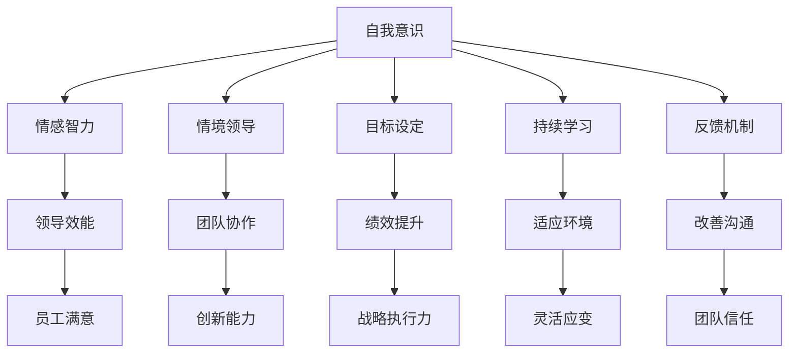

                 

# 管理者自我成长的方法论

> 关键词：管理者, 自我成长, 方法论, 领导力, 决策, 战略规划, 创新, 团队管理

## 1. 背景介绍

管理者在组织中扮演着关键角色，他们不仅负责制定战略、分配资源，还要引领团队，推动组织成长。但成为一位高效且受人尊敬的管理者，并非易事。无数研究表明，管理者的成功不仅依赖于硬技能（如财务分析、市场营销），更依赖于软技能（如沟通、情商、领导力）。然而，如何系统性地提升这些软技能，管理者往往缺乏清晰的路径和方法。

本文将深入探讨管理者的自我成长路径，提供一套基于方法论的理论框架和实操指南。通过理解并应用这些方法，管理者可以更加高效地完成工作，提高团队士气，并实现个人和组织的持续成长。

## 2. 核心概念与联系

### 2.1 核心概念概述

为了帮助管理者全面理解和掌握自我成长的方法论，本文将介绍几个核心概念：

- **自我意识**：指对自身情感、动机、能力和局限的认知。管理者通过自我反思，了解自己的长处与短处，从而有针对性地提升。

- **情感智力**：包括自我调节、同理心和社交技能。情感智力强的管理者更能理解员工需求，缓解工作压力，建立良好的工作关系。

- **情境领导**：根据员工能力和情境变化调整领导风格。情境领导理论强调领导应适应不同的员工和环境需求，以最佳方式指导团队。

- **目标设定**：明确组织和个人目标，通过SMART原则（具体、可测量、可实现、相关、时间限制）设定具体目标，并制定行动计划。

- **持续学习**：通过阅读、培训、学习新技能等方式不断提升自己，适应快速变化的管理环境。

- **反馈机制**：建立有效的反馈系统，收集和分析员工的意见，并根据反馈调整领导行为和团队策略。

### 2.2 核心概念原理和架构的 Mermaid 流程图

此流程图展示了核心概念之间的联系：通过提升自我意识、情感智力、情境领导、目标设定、持续学习和反馈机制，管理者能够提高领导效能、团队协作、绩效提升、创新能力、战略执行力、灵活应变和团队信任，最终实现员工满意度和组织绩效的提升。

## 3. 核心算法原理 & 具体操作步骤

### 3.1 算法原理概述

管理者自我成长的方法论基于系统化的理论和实操指南。其核心原理在于通过不断的自我反思、学习、实践和反馈循环，持续提升自身能力和管理水平。

1. **自我反思**：定期回顾和评估自己的行为和决策，找出提升空间。
2. **目标设定**：根据SMART原则设定具体、可实现的目标，并制定行动计划。
3. **持续学习**：通过阅读、培训等方式不断获取新知识和技能。
4. **实践应用**：将所学知识应用到实际工作中，并通过反馈调整改进。
5. **反馈循环**：建立有效的反馈系统，根据员工和团队的反馈，不断优化管理行为。

### 3.2 算法步骤详解

#### 步骤1: 自我评估
- **目标**：全面了解自己的优势和劣势。
- **方法**：
  1. 进行360度反馈评估，收集来自同事、下属和上级的反馈。
  2. 完成情感智力量表（如EQ-i）或MBTI性格测试，了解自己的性格类型和情感处理方式。
  3. 定期自我反思，记录工作中的成功和失败，分析原因和改进措施。

#### 步骤2: 设定目标
- **目标**：明确短期和长期目标，并制定具体行动计划。
- **方法**：
  1. 使用SMART原则设定目标，确保目标具体、可测量、可实现、相关、时间限制。
  2. 将大目标分解为小目标，制定详细的行动计划和时间表。
  3. 定期检查目标进展，根据情况调整计划。

#### 步骤3: 持续学习
- **目标**：提升自身能力和管理技能。
- **方法**：
  1. 定期阅读管理书籍、论文和研究报告。
  2. 参加管理培训课程、工作坊和研讨会，学习前沿理论和技术。
  3. 在线学习平台（如Coursera、Udemy）上选择相关课程，获取新技能和知识。

#### 步骤4: 实践应用
- **目标**：将所学知识应用到实际管理工作中。
- **方法**：
  1. 在团队项目中应用新的管理技巧和方法。
  2. 观察并记录效果，及时调整和优化。
  3. 持续改进，不断尝试新的管理方法。

#### 步骤5: 反馈循环
- **目标**：建立有效的反馈系统，持续优化管理行为。
- **方法**：
  1. 定期与员工和团队沟通，了解他们的需求和反馈。
  2. 建立匿名反馈渠道，鼓励员工提出建设性意见。
  3. 根据反馈调整管理策略和行为，持续改进。

### 3.3 算法优缺点

#### 优点
- **系统化**：提供了一套全面的方法和步骤，帮助管理者系统性地提升自我。
- **实践性**：每一步都强调实际应用，确保所学知识能够转化为管理实践。
- **持续性**：强调持续学习和改进，适应快速变化的管理环境。

#### 缺点
- **复杂性**：系统方法需要时间和精力投入，可能对时间紧张的管理者不太适用。
- **个体差异**：不同管理者的情况各异，通用方法可能不完全适用于所有人。

### 3.4 算法应用领域

管理者自我成长的方法论不仅适用于企业环境，也适用于非营利组织、政府机构等各类组织。其核心原则——自我反思、目标设定、持续学习、实践应用和反馈循环——对任何类型的管理者都有普遍意义。

在具体应用时，管理者可以根据自身需求和组织特点，灵活调整和优化方法。例如：
- 初创公司的管理者可能需要更多关注团队建设和战略规划。
- 大型企业的管理者可能更需要优化运营和流程管理。
- 非营利组织的管理者可能更需要关注社会责任和公益活动。

## 4. 数学模型和公式 & 详细讲解 & 举例说明

### 4.1 数学模型构建

管理者自我成长的方法论不涉及复杂的数学模型，但其核心思想可以通过简单的模型来描述。本文使用反馈循环模型来展示管理者的成长过程。

**反馈循环模型**：

- **输入**：管理者的行为、决策和环境变化。
- **处理**：自我反思、目标设定、持续学习和实践应用。
- **输出**：管理者的能力提升和团队绩效。
- **反馈**：员工的反馈、绩效数据和市场变化。

### 4.2 公式推导过程

由于管理者自我成长的方法论不涉及具体数学公式，本文重点讲解反馈循环模型的基本原理。

1. **输入**：管理者的行为和环境变化是不断变化的，模型假设管理者能够持续获取相关信息。
2. **处理**：管理者的自我反思、目标设定、持续学习和实践应用是对输入的处理过程，通过反馈不断优化。
3. **输出**：管理者的能力提升和团队绩效是处理的结果，模型假设这些结果是可测量的。
4. **反馈**：员工的反馈、绩效数据和市场变化是系统的反馈，管理者的成长过程不断调整和优化。

### 4.3 案例分析与讲解

**案例1: 情境领导**
- **背景**：某公司新任项目经理小王面临团队管理挑战。
- **方法**：小王通过自我反思，了解团队成员的能力和需求，采用情境领导理论，调整自己的领导风格。
- **结果**：团队成员的工作积极性和满意度提升，项目进展顺利。
- **反思**：小王定期进行自我反思，记录每次领导行为的改进效果，持续优化领导风格。

**案例2: 目标设定**
- **背景**：一家科技公司的产品经理小李负责一款新产品的开发。
- **方法**：小李使用SMART原则，设定短期和长期目标，并制定详细的行动计划。
- **结果**：产品在规定时间内发布，市场反馈良好。
- **反思**：小李定期检查目标进展，根据市场变化调整产品策略，持续优化开发过程。

## 5. 项目实践：代码实例和详细解释说明

由于管理者自我成长的方法论主要依赖于管理和领导技能，并不涉及具体的编程实现，本文主要通过案例和实操指南进行说明。

### 5.1 开发环境搭建

管理者自我成长的方法论不需要特定的开发环境，可以通过以下方式进行实践：
1. **阅读材料**：利用在线资源（如Coursera、Udemy、TED Talks）阅读相关书籍、观看视频和听讲座。
2. **培训课程**：参加管理培训课程和研讨会，与专家和同行交流。
3. **实践活动**：在实际工作中应用所学知识，观察效果并进行调整。

### 5.2 源代码详细实现

由于管理者自我成长主要依赖于软技能提升，本文不提供具体的代码实现。但以下是一些实践活动的示例：

**示例1: 360度反馈评估**
- **目标**：了解自身优缺点。
- **实现**：
  1. 设计问卷，收集员工、同事和上级的反馈。
  2. 分析反馈数据，找出主要问题和改进方向。

**示例2: SMART目标设定**
- **目标**：提升团队绩效。
- **实现**：
  1. 设定具体、可测量的目标，如“提升用户满意度”。
  2. 制定详细行动计划，如“每月收集10个用户反馈，并改进产品功能”。
  3. 定期检查目标进展，根据反馈调整计划。

### 5.3 代码解读与分析

由于管理者自我成长方法论不涉及编程，本文主要通过实际操作和案例分析进行说明。以下是一些实操指南：

**指南1: 自我反思**
- **目标**：定期回顾和评估自己的行为和决策。
- **实现**：
  1. 定期记录工作中的成功和失败，分析原因和改进措施。
  2. 与导师或同事进行定期讨论，获取反馈和建议。

**指南2: 目标设定**
- **目标**：明确短期和长期目标，并制定具体行动计划。
- **实现**：
  1. 使用SMART原则设定目标，确保目标具体、可测量、可实现、相关、时间限制。
  2. 将大目标分解为小目标，制定详细的行动计划和时间表。
  3. 定期检查目标进展，根据情况调整计划。

### 5.4 运行结果展示

由于管理者自我成长方法论的成效主要体现在管理能力和团队绩效上，不涉及具体的编程结果展示。但以下是一些实践效果的示例：

**示例1: 情感智力提升**
- **目标**：提升自我调节和同理心能力。
- **结果**：管理者能够更好地处理员工情绪，缓解工作压力，提高团队凝聚力。

**示例2: 目标设定改进**
- **目标**：提升团队项目执行力。
- **结果**：团队项目按时完成，产品质量提升，员工满意度提高。

## 6. 实际应用场景

管理者自我成长的方法论在多个实际应用场景中均能发挥重要作用，以下列举几个典型案例：

### 6.1 智能制造企业
- **场景**：一家智能制造企业面临生产线效率低下的问题。
- **方法**：
  1. **自我评估**：管理者进行自我反思，了解生产线管理的优缺点。
  2. **目标设定**：设定提升生产线效率的具体目标。
  3. **持续学习**：学习智能制造相关的管理知识和技术。
  4. **实践应用**：引入智能设备，优化生产流程。
  5. **反馈循环**：通过员工反馈，不断优化管理策略。

### 6.2 新兴科技公司
- **场景**：一家新兴科技公司面临快速变化的市场环境。
- **方法**：
  1. **自我评估**：管理者进行情感智力评估，提升团队士气。
  2. **目标设定**：设定市场拓展的具体目标。
  3. **持续学习**：学习前沿科技和管理理论。
  4. **实践应用**：快速响应市场变化，调整产品策略。
  5. **反馈循环**：通过市场反馈，优化产品设计和推广策略。

### 6.3 社会公益组织
- **场景**：一家社会公益组织面临资金不足的问题。
- **方法**：
  1. **自我评估**：管理者进行自我反思，找出资金管理的瓶颈。
  2. **目标设定**：设定提升资金使用效率的目标。
  3. **持续学习**：学习财务管理相关的知识。
  4. **实践应用**：优化资金使用策略，提升资金使用效率。
  5. **反馈循环**：通过员工反馈，优化财务管理流程。

## 7. 工具和资源推荐

### 7.1 学习资源推荐

为了帮助管理者系统掌握自我成长的方法论，以下是一些推荐的学习资源：

1. **《领导力挑战》**（作者：约翰·马克斯维尔）：这本书详细介绍了领导力的核心原则和实践技巧。
2. **《情商与影响力》**（作者：丹尼尔·戈尔曼）：介绍了情感智力对领导力的重要性。
3. **《管理百年》**（作者：罗莎贝斯·莫斯·坎特）：讲述了管理理论的发展和应用。
4. **《精益创业》**（作者：艾瑞克·莱斯）：介绍了精益创业的核心理念和方法。
5. **Coursera和Udemy平台**：提供了丰富的管理课程和实践指南，包括情感智力、领导力、创新管理等。

### 7.2 开发工具推荐

尽管管理者自我成长的方法论不涉及具体的编程工具，但以下是一些推荐的开发工具和平台：

1. **Trello和Asana**：项目管理工具，帮助管理者跟踪项目进展和任务分配。
2. **Slack和Microsoft Teams**：团队协作平台，方便管理者与团队成员沟通和协作。
3. **Zoom和Microsoft Teams**：视频会议工具，支持远程会议和在线培训。
4. **Google Docs和Microsoft Word**：文档协作工具，方便管理者共享和编辑文档。

### 7.3 相关论文推荐

以下是几篇推荐的管理论文，进一步拓展管理者的知识视野：

1. **《情境领导理论》**（作者：保罗·赫塞和肯·布兰查德）：详细介绍了情境领导理论的基本概念和方法。
2. **《目标设定理论》**（作者：爱德华·洛克）：介绍了SMART目标设定的原理和方法。
3. **《情感智力与领导力》**（作者：玛莎·柯根）：探讨了情感智力对领导力的影响。
4. **《精益管理》**（作者：詹姆斯·沃默·史密斯）：介绍了精益管理的核心理念和方法。

## 8. 总结：未来发展趋势与挑战

### 8.1 研究成果总结
本文系统介绍了管理者自我成长的方法论，包括自我反思、目标设定、持续学习、实践应用和反馈循环。通过这些方法，管理者可以系统性地提升自身能力和管理水平，实现个人和组织的持续成长。

### 8.2 未来发展趋势
展望未来，管理者自我成长的方法论将呈现以下几个发展趋势：
1. **数字化和智能化**：管理者将更多地利用数字化工具和智能系统，提高工作效率和管理水平。
2. **个性化和定制化**：根据不同管理者的特点和需求，提供定制化的成长路径和方法。
3. **全球化和跨文化管理**：面对全球化环境，管理者需要具备跨文化管理的能力，更好地理解和协调不同文化背景的团队。

### 8.3 面临的挑战
尽管管理者自我成长的方法论具有广泛的应用前景，但仍面临以下挑战：
1. **时间管理**：管理者往往面临时间紧张的问题，如何平衡工作和自我成长是一个难题。
2. **适应变化**：快速变化的环境要求管理者不断学习新知识和技能，保持自身的竞争力。
3. **文化差异**：在全球化和跨文化管理中，如何理解和协调不同文化背景的团队是一个挑战。

### 8.4 研究展望
为了应对这些挑战，未来的研究需要在以下几个方面寻求突破：
1. **时间管理工具**：开发更多时间管理工具和方法，帮助管理者更高效地安排时间和任务。
2. **个性化学习路径**：根据管理者的特点和需求，提供个性化的学习资源和方法。
3. **跨文化培训**：开发跨文化管理的培训课程和方法，提高管理者的跨文化适应能力。

## 9. 附录：常见问题与解答

**Q1: 管理者如何平衡工作和自我成长？**
**A1:** 管理者可以通过以下方式平衡工作和自我成长：
1. **时间管理**：使用时间管理工具（如Trello、Asana），合理分配工作和自我学习时间。
2. **高效学习**：利用碎片时间进行学习，如在通勤途中听有声书或观看视频。
3. **设置优先级**：根据工作紧急性和重要性，设定学习和工作任务的优先级。

**Q2: 管理者如何提高跨文化管理能力？**
**A2:** 管理者可以通过以下方式提高跨文化管理能力：
1. **跨文化培训**：参加跨文化管理培训课程，学习不同文化背景的员工管理技巧。
2. **文化调研**：进行文化调研，了解不同文化背景的员工需求和习惯。
3. **团队合作**：鼓励团队成员分享文化背景和习惯，促进文化融合和理解。

**Q3: 管理者如何提升情感智力？**
**A3:** 管理者可以通过以下方式提升情感智力：
1. **情感智能培训**：参加情感智力培训课程，学习情感管理技巧。
2. **自我反思**：定期进行自我反思，记录和分析情感反应和处理方式。
3. **同理心练习**：通过角色扮演和情景模拟，提升同理心和人际沟通能力。

**Q4: 管理者如何设定有效的目标？**
**A4:** 管理者可以通过以下方式设定有效的目标：
1. **SMART原则**：确保目标具体、可测量、可实现、相关、时间限制。
2. **分解目标**：将大目标分解为小目标，制定详细的行动计划和时间表。
3. **定期评估**：定期检查目标进展，根据情况调整计划，确保目标的实现。

---

作者：禅与计算机程序设计艺术 / Zen and the Art of Computer Programming

