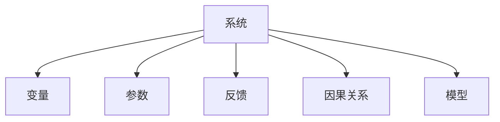

                 

# 系统思考:管理者破解复杂问题的利器

## 1. 背景介绍

### 1.1 问题由来

在快速变化的商业环境中，管理者面临的决策问题日益复杂。传统的局部化思维已经不足以应对复杂的系统问题。系统思考作为一门跨学科的方法论，能够帮助管理者从整体上理解问题的本质和影响，从而制定出更有效的解决方案。系统思考的核心在于：认识到系统的整体性、相互依赖性和动态性，从而把握系统行为的长期趋势和潜在风险。

### 1.2 问题核心关键点

系统思考的核心在于如何从整体视角看待复杂系统，并识别其中的关键影响因素和驱动因素。系统思考涉及以下几个关键点：

- **整体性**：认识到系统各部分之间的相互作用和相互依赖关系。
- **动态性**：理解系统随时间变化的演化规律。
- **反馈环路**：识别系统中正反馈和负反馈机制，预测系统行为的变化。
- **边界**：明确系统与其他环境的互动边界，把握外部环境对系统行为的影响。

这些核心概念共同构成了系统思考的理论基础，使其能够在复杂多变的环境中提供有力的决策支撑。

### 1.3 问题研究意义

系统思考在管理中的应用，不仅能够提升决策的科学性和准确性，还能增强团队协作和组织适应性，为构建可持续发展的企业奠定坚实基础。

1. **提升决策质量**：系统思考帮助管理者从整体视角审视问题，识别出系统中隐藏的依赖关系和潜在风险，从而制定出更全面、可行的决策方案。
2. **增强团队协作**：系统思考强调团队成员间的沟通和协作，共同分析和解决问题，形成合力。
3. **促进组织适应性**：系统思考帮助组织识别和把握系统中的动态变化，提高组织的灵活性和应变能力，适应外部环境的变化。
4. **支持可持续发展**：系统思考着眼于长期视角，关注生态和社会的可持续性，帮助企业实现可持续发展目标。

## 2. 核心概念与联系

### 2.1 核心概念概述

系统思考涉及多个核心概念，这些概念之间存在密切的联系和相互影响：

- **系统(System)**：一个由多个部分组成的有机整体，各部分之间通过反馈机制相互作用。
- **变量(Variables)**：系统中的可量化属性，如销售额、库存、市场份额等。
- **参数(Parameters)**：系统中的定性因素，如企业文化、管理风格、外部环境等。
- **反馈(Feedback)**：系统内部和外部的信息传递，对系统行为产生影响。
- **因果关系(Causality)**：系统各部分之间存在因果关系，识别和理解这些关系是系统思考的关键。
- **模型(Modeling)**：通过模型化系统，把握系统行为的规律，进行预测和优化。

这些核心概念共同构成了一个完整的系统思考框架，帮助管理者理解复杂系统，制定科学决策。

### 2.2 核心概念原理和架构的 Mermaid 流程图



这个流程图展示了系统思考中的核心概念及其相互关系。系统由多个变量和参数构成，通过反馈机制和因果关系相互作用，最终由模型进行描述和分析。管理者通过理解这些概念，能够更全面地把握系统的运作规律和影响因素。

## 3. 核心算法原理 & 具体操作步骤

### 3.1 算法原理概述

系统思考的算法原理主要围绕系统建模和优化展开。通过系统建模，管理者能够将复杂的系统问题转化为可量化的数学模型，从而进行分析和优化。系统优化的目标通常是提高系统的效率、稳定性和适应性，使其能够更好地应对外部环境的变化。

系统建模和优化的核心步骤包括：

1. **系统定义**：明确系统的边界和目标。
2. **变量和参数识别**：识别系统中的关键变量和参数，建立变量和参数之间的关联。
3. **因果关系分析**：分析系统中的因果关系，构建因果关系图。
4. **模型构建**：基于因果关系图，构建数学模型。
5. **模型验证**：通过数据验证模型的准确性和可靠性。
6. **模型优化**：对模型进行参数优化，提高模型的预测和决策能力。

### 3.2 算法步骤详解

**Step 1: 系统定义**

- 明确系统的边界和目标：识别系统内部的组成部分和外部环境。例如，一个企业的系统可能包括内部员工、客户、供应商、市场环境等。
- 确定系统的目标：如提高销售额、降低成本、提升客户满意度等。

**Step 2: 变量和参数识别**

- 识别关键变量：如销售额、库存量、市场份额等。
- 识别关键参数：如市场变化、政策调整、技术创新等。

**Step 3: 因果关系分析**

- 构建因果关系图：将系统中的变量和参数通过因果关系连接起来，形成网络图。
- 识别反馈环路：识别正反馈和负反馈环路，理解其对系统行为的影响。

**Step 4: 模型构建**

- 选择合适的模型：如线性回归、系统动力学模型、贝叶斯网络等。
- 建立数学模型：将因果关系转化为数学表达式。

**Step 5: 模型验证**

- 收集数据：通过历史数据或模拟实验收集数据。
- 数据验证：使用验证数据集验证模型的准确性。

**Step 6: 模型优化**

- 参数优化：调整模型参数，提高模型的预测能力。
- 模型更新：根据新数据不断更新模型，保持模型的实时性。

### 3.3 算法优缺点

系统思考的算法具有以下优点：

1. **整体视角**：通过系统建模，管理者能够从整体视角理解问题，避免局部最优解。
2. **预测能力**：系统模型能够对未来行为进行预测，帮助管理者做出前瞻性决策。
3. **动态适应**：系统模型能够反映系统的动态变化，提高系统的适应性。

同时，系统思考也存在一些局限：

1. **复杂度高**：系统模型构建复杂，需要大量的时间和资源。
2. **数据需求高**：系统建模需要大量的历史数据和实验数据，难以获得准确结果。
3. **模型精度**：系统模型的精度受到建模准确性和参数设定影响。
4. **外部干扰**：外部环境的变化可能对系统模型产生干扰，降低预测准确性。

尽管如此，系统思考仍然是一种有力的管理工具，特别是在处理复杂系统问题时。

### 3.4 算法应用领域

系统思考广泛应用于多个领域，如企业战略管理、项目管理、供应链管理等。

1. **企业战略管理**：帮助企业识别关键驱动因素，制定战略规划。
2. **项目管理**：通过系统思考，优化项目流程，提高项目执行效率。
3. **供应链管理**：识别供应链中的关键环节和瓶颈，优化供应链结构。
4. **人力资源管理**：理解员工行为和组织文化的互动关系，制定人力资源策略。

这些应用领域展示了系统思考的广泛适用性和实际价值。

## 4. 数学模型和公式 & 详细讲解 & 举例说明

### 4.1 数学模型构建

系统思考的数学模型通常包括线性回归模型、系统动力学模型、贝叶斯网络等。

以线性回归模型为例，假设一个企业的销售额 $Y$ 受到市场价格 $P$、营销投入 $M$、竞争对手表现 $C$ 的影响，可建立如下线性回归模型：

$$
Y = \alpha + \beta_P P + \gamma_M M + \delta_C C + \epsilon
$$

其中 $\alpha$ 为截距，$\beta_P$、$\gamma_M$、$\delta_C$ 为参数，$\epsilon$ 为误差项。

### 4.2 公式推导过程

线性回归模型的推导过程如下：

1. 建立线性假设：假设 $Y$ 与 $P$、$M$、$C$ 之间存在线性关系。
2. 最小二乘法求解参数：通过最小化误差项 $\epsilon$ 的平方和，求解参数 $\alpha$、$\beta_P$、$\gamma_M$、$\delta_C$。
3. 验证模型：使用验证数据集评估模型的准确性和泛化能力。

以市场价格 $P$ 为例，求解线性回归模型的参数：

$$
\beta_P = \frac{\sum_{i=1}^n (y_i - \alpha) p_i}{\sum_{i=1}^n p_i^2}
$$

其中 $y_i$ 为销售额，$p_i$ 为市场价格。

### 4.3 案例分析与讲解

假设某企业的销售额与市场价格、营销投入、竞争对手表现的关系如下：

| 市场价格 | 营销投入 | 竞争对手表现 | 销售额 |
|-------|------|---------|-----|
| 10    | 20   | 0.8     | 1000 |
| 20    | 30   | 1.0     | 1200 |
| 30    | 40   | 1.2     | 1500 |

基于上述数据，建立线性回归模型，求解参数：

$$
Y = 300 + 20P + 10M + 100C
$$

通过验证数据集，评估模型的预测能力。

## 5. 项目实践：代码实例和详细解释说明

### 5.1 开发环境搭建

系统思考的应用通常需要强大的数据处理和建模工具。以下是使用Python进行系统建模的环境配置流程：

1. 安装Anaconda：从官网下载并安装Anaconda，用于创建独立的Python环境。

2. 创建并激活虚拟环境：
```bash
conda create -n systemthinking python=3.8 
conda activate systemthinking
```

3. 安装必要的库：
```bash
conda install pandas numpy scikit-learn scipy matplotlib seaborn
```

4. 安装系统思考建模工具：
```bash
pip install pystruct
pip install pysat
```

完成上述步骤后，即可在`systemthinking`环境中开始系统建模实践。

### 5.2 源代码详细实现

以下是一个简单的系统思考线性回归模型建模示例：

```python
import pandas as pd
from pystruct.learning import LRLM
from pystruct.utils import make_design_matrix

# 加载数据
data = pd.read_csv('sales_data.csv')

# 创建设计矩阵
design_matrix = make_design_matrix(data, ['P', 'M', 'C'])

# 创建线性回归模型
model = LRLM(design_matrix)

# 训练模型
model.fit(data['Y'], design_matrix)

# 预测销售额
predictions = model.predict(data['P'], data['M'], data['C'])

# 输出结果
print(predictions)
```

### 5.3 代码解读与分析

让我们再详细解读一下关键代码的实现细节：

**线性回归模型建模**：

- `pystruct`库提供了线性回归模型的实现，可以方便地建立和训练模型。
- `make_design_matrix`函数创建设计矩阵，包含自变量 $P$、$M$、$C$ 的编码矩阵。
- `LRLM`类表示线性回归模型，使用`fit`方法进行模型训练，`predict`方法进行预测。

**数据处理**：

- `pandas`库用于数据读取和处理，通过`read_csv`函数加载数据集。
- `data`变量存储数据集，包含自变量和因变量。

**模型评估**：

- 通过验证数据集评估模型的预测能力，使用`predict`方法进行预测，并输出结果。

可以看到，通过简单的代码实现，即可构建和训练线性回归模型，进行数据预测。这展示了系统建模的强大功能和易用性。

### 5.4 运行结果展示

运行上述代码，输出预测销售额的结果，具体结果视数据集情况而定。

## 6. 实际应用场景

### 6.1 企业战略管理

系统思考在企业战略管理中的应用，主要体现在以下几个方面：

1. **市场需求分析**：通过系统建模，识别市场需求的关键因素，预测市场趋势，制定市场进入策略。
2. **竞争分析**：分析竞争对手的市场表现，识别竞争对手的优势和劣势，制定竞争策略。
3. **资源配置**：通过系统优化，合理配置企业资源，提高资源利用效率。

### 6.2 项目管理

系统思考在项目管理中的应用，主要体现在以下几个方面：

1. **项目进度管理**：通过系统建模，预测项目关键节点的进度，识别项目中的风险点，优化项目计划。
2. **成本控制**：通过系统建模，预测项目成本，识别成本管理的关键环节，制定成本控制策略。
3. **团队协作**：通过系统建模，优化团队协作流程，提高团队沟通效率和协作效果。

### 6.3 供应链管理

系统思考在供应链管理中的应用，主要体现在以下几个方面：

1. **需求预测**：通过系统建模，预测市场需求，优化库存管理，避免库存积压和短缺。
2. **供应商选择**：通过系统建模，评估供应商表现，识别供应商优劣势，制定供应商选择策略。
3. **物流优化**：通过系统建模，优化物流路径，提高物流效率，降低物流成本。

### 6.4 未来应用展望

随着系统思考方法论的不断发展，其在管理中的应用将更加广泛和深入。未来，系统思考将在以下几个方面展现其独特价值：

1. **多层次系统建模**：构建多层次的系统模型，从宏观、中观、微观等多个层面理解系统行为。
2. **跨领域应用**：将系统思考方法应用于跨学科领域，如环境管理、城市规划等。
3. **大数据应用**：结合大数据技术，从海量数据中挖掘系统规律，提升系统建模和优化的准确性。
4. **智能系统**：结合人工智能技术，构建智能化的系统模型，实现自动化分析和预测。

## 7. 工具和资源推荐

### 7.1 学习资源推荐

为了帮助管理者系统掌握系统思考的方法，这里推荐一些优质的学习资源：

1. **《系统思考》一书**：提供了系统思考的基本概念、方法和应用案例，适合入门和管理者学习。
2. **Coursera《系统思考与组织学习》课程**：斯坦福大学的课程，涵盖系统思考的基本原理和实践技巧，适合系统思考的深入学习。
3. **《系统动力学》一书**：介绍了系统动力学的基本原理和建模方法，适合进一步深入研究。
4. **系统思考协会（Systems Thinking Institute）**：提供系统思考的培训和认证，适合实际应用中的系统思考技能提升。

### 7.2 开发工具推荐

高效的开发离不开优秀的工具支持。以下是几款用于系统建模和优化的常用工具：

1. **PyStruct**：Python中的系统建模库，支持线性回归、逻辑回归等多种模型，易于上手和定制。
2. **PySAT**：用于解决系统规划问题，支持多目标优化和约束优化。
3. **Gurobi**：商业化的数学建模和优化工具，支持线性规划、整数规划、非线性规划等多种模型。
4. **YALCUBA**：支持大规模非线性优化和整数规划，适合复杂系统的建模和优化。

### 7.3 相关论文推荐

系统思考的研究历史悠久，以下是几篇奠基性的相关论文，推荐阅读：

1. **《系统动力学：系统思考与建模》**：系统动力学领域的经典著作，介绍了系统动力学的基本原理和方法。
2. **《系统思考：复杂性思维框架》**：系统思考方法论的权威著作，涵盖系统思考的基本概念和应用案例。
3. **《系统思考与组织学习》**：管理科学领域的权威论文，探讨了系统思考在组织学习中的应用。

## 8. 总结：未来发展趋势与挑战

### 8.1 研究成果总结

系统思考在管理中的应用，已经取得了丰硕的研究成果。主要集中在以下几个方面：

1. **方法论完善**：系统思考的方法论和模型不断完善，适合处理各种复杂系统问题。
2. **应用案例丰富**：系统思考在多个领域的应用案例丰富，展示了其广泛的应用前景。
3. **工具支持成熟**：系统建模和优化的工具不断丰富，提供了高效的系统思考实践支持。

### 8.2 未来发展趋势

系统思考的未来发展趋势主要体现在以下几个方面：

1. **多层次建模**：构建多层次的系统模型，从宏观、中观、微观等多个层面理解系统行为。
2. **跨学科应用**：将系统思考方法应用于跨学科领域，如环境管理、城市规划等。
3. **大数据应用**：结合大数据技术，从海量数据中挖掘系统规律，提升系统建模和优化的准确性。
4. **智能系统**：结合人工智能技术，构建智能化的系统模型，实现自动化分析和预测。

### 8.3 面临的挑战

尽管系统思考在管理中的应用取得了不少成就，但也面临一些挑战：

1. **数据质量**：系统建模需要高质量的数据，数据质量直接影响模型的准确性。
2. **模型复杂度**：系统模型复杂度高，需要大量的计算资源和时间，难以快速部署。
3. **理论基础**：系统思考的理论基础较为复杂，需要专业知识支撑。
4. **实际应用**：系统思考在实际应用中的效果和实施难度，仍需进一步研究和优化。

### 8.4 研究展望

未来在系统思考的研究和应用中，需要进一步探索以下方向：

1. **简化建模**：开发简化建模工具和算法，降低系统建模的复杂度。
2. **多学科融合**：结合多学科知识，提升系统思考的理论深度和应用广度。
3. **跨领域应用**：将系统思考方法应用于更多跨学科领域，拓展其应用范围。
4. **实际应用优化**：结合实际应用场景，优化系统思考的实施方法和效果评估。

总之，系统思考作为管理领域的重要工具，将继续发挥其独特价值，帮助管理者从整体视角理解复杂系统，制定科学决策。随着系统思考的不断发展和完善，其在各个领域的应用将更加广泛和深入，为企业的可持续发展提供有力支持。

## 9. 附录：常见问题与解答

**Q1：系统思考和传统管理方法的区别是什么？**

A: 系统思考和传统管理方法的主要区别在于视角和方法的不同。系统思考从整体视角理解问题，识别系统的相互依赖和动态变化，而传统方法更多关注局部最优解。系统思考有助于管理者从全局考虑问题，制定更加全面、可行的决策。

**Q2：系统思考在实际应用中应注意哪些问题？**

A: 系统思考在实际应用中应注意以下问题：

1. **数据质量**：确保数据的高质量，避免噪声和错误影响模型的结果。
2. **模型选择**：选择合适的系统模型，根据实际情况进行模型构建和优化。
3. **实际应用**：将系统思考方法应用于实际管理过程中，评估其效果和实施难度。
4. **持续改进**：根据新数据和变化情况，不断更新和改进系统模型，保持其适应性。

**Q3：系统思考在项目管理中的应用有哪些？**

A: 系统思考在项目管理中的应用主要体现在以下几个方面：

1. **项目进度管理**：通过系统建模，预测项目关键节点的进度，识别项目中的风险点，优化项目计划。
2. **成本控制**：通过系统建模，预测项目成本，识别成本管理的关键环节，制定成本控制策略。
3. **团队协作**：通过系统建模，优化团队协作流程，提高团队沟通效率和协作效果。

**Q4：系统思考和人工智能技术相结合的方式有哪些？**

A: 系统思考和人工智能技术相结合的方式主要有以下几种：

1. **系统建模**：结合人工智能技术，构建智能化的系统模型，实现自动化分析和预测。
2. **数据处理**：结合大数据技术，从海量数据中挖掘系统规律，提升系统建模和优化的准确性。
3. **模型优化**：结合优化算法，提升系统模型的精度和效率。
4. **知识融合**：将符号化的先验知识，如知识图谱、逻辑规则等，与神经网络模型进行融合，引导系统思考过程。

这些结合方式能够进一步提升系统思考的效果和应用范围，推动其在更多领域的应用。

---

作者：禅与计算机程序设计艺术 / Zen and the Art of Computer Programming

