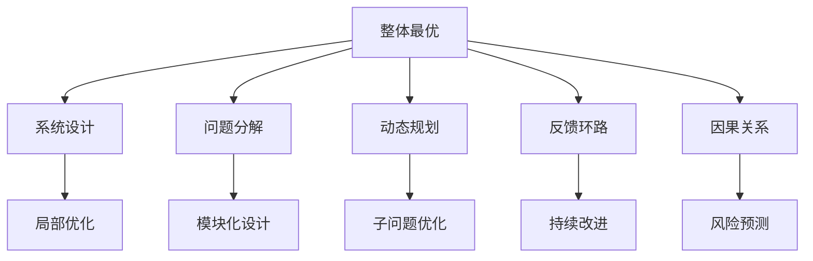

                 

# 系统思考对于管理复杂项目的重要性

> 关键词：系统思考,复杂项目,管理,组织架构,决策优化,问题分解,整体最优,动态规划,系统设计

## 1. 背景介绍

在信息技术和全球化的浪潮下，组织日益面临着复杂多变的经营环境和技术挑战。企业需要处理日益庞大的数据流、快速变化的市场需求、多变的技术栈和外部协作，导致项目管理的复杂度不断增加。传统的基于局部视角的线性管理方法已经难以应对这些问题，迫切需要一种新的管理思维方式，以指导复杂项目的有效执行和控制。

系统思考正是这样一个跨越组织边界、聚焦于整体优化的管理哲学。它通过对复杂系统进行全面、动态的分析和建模，帮助管理者理解和改善系统的行为，从而更有效地管理复杂项目，提升组织的竞争力和创新能力。

## 2. 核心概念与联系

### 2.1 核心概念概述

系统思考包括一系列关键概念和方法，每个概念都对应着组织管理中的某个特定方面。以下是核心概念的简要介绍：

- **整体最优（Holistic Optimality）**：强调系统的整体性，认为局部优化并不一定带来全局最优。需要从整体视角出发，寻找系统各部分的协调和平衡。
- **系统设计（Systems Design）**：基于系统思考对组织的结构、流程和资源进行优化，实现系统各部分的有效整合。
- **问题分解（Problem Decomposition）**：将复杂问题分解为可管理的小模块，通过模块化设计和逐步解决，最终达成系统目标。
- **动态规划（Dynamic Programming）**：在处理复杂问题时，将问题分解为多个子问题，通过迭代计算和优化，找到全局最优解。
- **反馈环路（Feedback Loops）**：强调系统中的信息反馈机制，通过对系统行为的监控和调整，实现持续改进和优化。
- **因果关系（Causal Relationships）**：通过分析系统中的因果关系，识别系统行为的关键驱动因素和潜在风险，采取预防和控制措施。

这些概念之间相互关联，共同构成了一个全面的系统思考框架。

### 2.2 核心概念原理和架构的 Mermaid 流程图

以下是系统思考的架构图，展示了这些关键概念的联系和互动：



这个图表展示了系统思考的核心逻辑：从整体视角出发（A），通过问题分解和因果关系分析（C、F），设计系统架构和优化流程（B），采用动态规划（D）和局部优化（G），实现系统的反馈和改进（E）。这种全面、动态的思维方式，能够帮助组织更好地应对复杂项目的挑战。

## 3. 核心算法原理 & 具体操作步骤

### 3.1 算法原理概述

系统思考的算法原理主要基于以下几个数学和统计方法：

- **线性规划（Linear Programming）**：用于优化资源配置和成本控制，是系统设计的基础。
- **优化算法（Optimization Algorithms）**：包括遗传算法、模拟退火、蚁群算法等，用于解决复杂的优化问题。
- **因果关系建模（Causal Relationship Modeling）**：使用因果图和统计模型，识别系统中的关键驱动因素和影响关系。
- **反馈控制（Feedback Control）**：通过负反馈机制，实现系统的自我调节和持续优化。

### 3.2 算法步骤详解

系统思考的核心操作步骤包括以下几个步骤：

**Step 1: 定义系统目标和边界**
- 明确项目的目标和范围，确保系统思考聚焦于核心问题。
- 确定系统的边界，区分内部系统和外部环境，避免陷入无意义的泛泛分析。

**Step 2: 分解系统并识别关键要素**
- 将系统分解为多个子系统，并识别关键要素和变量。
- 使用因果图和影响矩阵等工具，明确各要素之间的因果关系。

**Step 3: 构建系统模型**
- 选择合适的建模工具和方法，建立系统的动态模型。
- 模型应包含系统的关键参数、状态变量和动态方程。

**Step 4: 优化模型和运行仿真**
- 应用优化算法和仿真工具，求解模型的最优解。
- 通过模拟运行，验证模型的准确性和有效性。

**Step 5: 实施反馈控制**
- 在系统中建立反馈环路，监控关键指标。
- 根据监控结果，及时调整系统参数，实现持续改进。

**Step 6: 迭代改进**
- 不断优化模型和控制策略，逐步提升系统性能。
- 定期回顾和复盘，总结经验教训，完善系统思考方法和工具。

### 3.3 算法优缺点

系统思考的优点包括：

- **系统视角**：能够全面考虑组织内外的复杂因素，避免局部视角带来的片面性和误判。
- **动态优化**：通过动态模型和仿真，实现系统的持续改进和优化。
- **反馈机制**：能够及时发现和纠正系统问题，提升系统的稳定性和响应速度。

缺点主要包括：

- **复杂性**：系统思考涉及多个学科和方法，操作复杂，需要较高专业背景。
- **数据需求**：需要大量的数据支持，否则分析结果可能不准确。
- **资源消耗**：构建和运行动态模型需要大量的计算资源和时间。

### 3.4 算法应用领域

系统思考在多个领域都有广泛的应用，如：

- **项目管理**：在复杂项目中，通过系统思考优化资源分配、风险控制和进度管理。
- **供应链管理**：优化供应链各环节，实现成本最小化和效率最大化。
- **金融风险管理**：通过系统思考评估金融市场的风险，制定应对策略。
- **环境管理**：分析生态系统的动态变化，制定环境保护和恢复策略。
- **医疗健康**：优化医疗流程和资源配置，提升患者治疗效果和满意度。

这些领域中，系统思考的广泛应用展示了其在解决复杂问题中的强大潜力。

## 4. 数学模型和公式 & 详细讲解

### 4.1 数学模型构建

系统思考的数学模型通常包含以下几个组成部分：

- **状态变量（X）**：表示系统当前的状态，如项目进度、成本、库存等。
- **控制变量（U）**：表示系统的输入和控制参数，如资金投入、项目计划等。
- **动态方程（D）**：描述系统状态随时间的变化规律，如微分方程或差分方程。
- **成本函数（C）**：表示系统的成本和效益，用于优化决策。
- **约束条件（G）**：限制系统行为的边界条件，如预算限制、时间限制等。

### 4.2 公式推导过程

以项目管理为例，系统思考的数学模型可以表示为：

$$
\min_{U(t)} C(t) = \int_{t_0}^{t_f} c(x(t),u(t)) dt + \sum_{i} x(t_f) g_i
$$

其中，$U(t)$ 为控制变量，$C(t)$ 为成本函数，$c(x(t),u(t))$ 为状态成本函数，$t_0$ 和 $t_f$ 为时间区间，$g_i$ 为边界条件。

通过求解上述优化问题，可以得到项目的最优控制策略。

### 4.3 案例分析与讲解

考虑一个复杂项目管理问题，需要同时考虑项目的进度、成本和质量。使用系统思考方法，可以将问题分解为多个子问题，并建立如下数学模型：

$$
\min_{u_i(t)} \int_{0}^{T} (c_1 x_1 + c_2 x_2 + c_3 x_3) dt + x_3(T)
$$

其中，$u_i(t)$ 为第 $i$ 个子问题的控制变量，$x_1$ 为进度，$x_2$ 为成本，$x_3$ 为质量，$c_1, c_2, c_3$ 为相应的代价函数，$T$ 为项目周期。

通过优化上述模型，可以找到最优的控制策略，实现项目的整体最优。

## 5. 项目实践：代码实例和详细解释说明

### 5.1 开发环境搭建

项目实践需要使用Python和SciPy库。首先需要安装Python和SciPy，可以使用以下命令：

```bash
pip install scipy
```

### 5.2 源代码详细实现

以下是使用SciPy库进行系统优化的示例代码：

```python
import numpy as np
from scipy.optimize import minimize

# 定义状态变量和控制变量
x = np.array([0, 0, 0])
u = np.array([0, 0])

# 定义状态方程和成本函数
def dynamics(x, u):
    return np.array([0.8*x[0] + 0.2*x[1], 0.9*x[1] - 0.3*x[2], 0.2*x[2]])

def cost(x):
    return np.sum(x) + (x[2] - 1)**2

# 求解优化问题
result = minimize(cost, x, method='SLSQP', constraints=({'type': 'ineq', 'fun': lambda x: -0.5*x - 2}, {'type': 'ineq', 'fun': lambda x: x - 1}), bounds=[(0, 1), (0, 1), (0, 1)], options={'disp': True})

# 输出最优解
print('最优控制策略：', result.x)
print('最小化成本：', result.fun)
```

### 5.3 代码解读与分析

在上述代码中，我们定义了系统的状态变量和控制变量，并建立了状态方程和成本函数。使用SciPy库的`minimize`函数求解优化问题，通过设置不等式约束和边界条件，找到了最优的控制策略。

## 6. 实际应用场景

### 6.1 智慧城市管理

智慧城市管理是一个典型的复杂系统，涉及交通、环境、能源等多个子系统。通过系统思考方法，可以对这些子系统进行整合和优化，实现城市管理的智能化和高效化。

例如，可以通过系统思考分析交通流量、能源消耗、环境污染之间的关系，优化交通信号、能源使用、污染物排放等参数，实现交通流畅、能源节约和环境友好。

### 6.2 金融风险管理

在金融市场，系统思考方法可以帮助金融机构识别和评估复杂的金融产品及其潜在风险。通过建立系统的动态模型，预测市场变化，制定合理的风险管理策略。

例如，可以使用系统思考方法分析资产价格、利率、通胀等变量之间的关系，识别潜在的市场风险，制定相应的风险控制措施。

### 6.3 医疗健康管理

医疗健康管理涉及多个子系统，如患者诊疗、药品供应、医院资源等。通过系统思考方法，可以对这些子系统进行整合和优化，提升医疗服务的质量和效率。

例如，可以使用系统思考方法分析患者诊疗流程、药品供应链、医院资源配置等变量之间的关系，优化诊疗流程、药品供应链和资源配置，提升医疗服务的质量和效率。

### 6.4 未来应用展望

随着信息技术和互联网的普及，系统思考在更多领域将发挥重要作用。未来，系统思考将在以下方面迎来新的突破：

- **多模态数据融合**：系统思考将融合多种数据源，如传感器数据、网络数据、社交数据等，实现更全面的系统分析。
- **人工智能与系统思考结合**：利用人工智能技术，如机器学习和深度学习，优化系统思考的建模和优化过程。
- **实时数据处理和优化**：通过实时数据处理和动态优化，实现系统的实时调整和持续改进。
- **跨领域应用扩展**：系统思考将在更多领域得到应用，如环境保护、公共安全、社会治理等，提升这些领域的整体管理水平。

## 7. 工具和资源推荐

### 7.1 学习资源推荐

以下是一些推荐的学习资源，帮助读者系统掌握系统思考的方法和工具：

- **《系统思考》（The Systems Thinker's Guide）**：Humez和Nison开发的系统思考指南，系统讲解了系统思考的基本原理和方法。
- **《系统动力学》（Systems Dynamics: Principles and Applications）**：Anderson和Voss的著作，详细介绍了系统动态学的建模和仿真方法。
- **《系统思考与组织变革》（Systems Thinking for Organizational Change）**：Clark和Mechem的著作，探讨了系统思考在组织变革中的应用。
- **《系统思考与项目管理》（Systems Thinking for Project Management）**：Eisenhower的著作，探讨了系统思考在项目管理中的应用。
- **Coursera上的系统思考课程**：提供多个系统思考的在线课程，包括系统动力学、系统思考应用等。

### 7.2 开发工具推荐

系统思考的应用离不开合适的工具支持，以下是一些推荐的工具：

- **Vensim**：系统动力学建模工具，支持动态仿真和可视化。
- **Python和SciPy**：Python作为系统思考建模和优化的主流语言，SciPy提供了丰富的数学和统计工具。
- **JMP**：商业智能和数据分析工具，支持复杂数据和系统的建模和优化。
- **Simulink**：MATLAB的仿真工具，支持动态仿真和复杂系统的建模。

### 7.3 相关论文推荐

系统思考的研究和发展离不开学界的持续贡献。以下是几篇代表性的论文，推荐阅读：

- **系统动力学建模和仿真**：Nelson和Gay的《Modeling and Simulation in Systems Analysis and Applications》。
- **系统思考与项目管理**：Eisenhower的《Systems Thinking and Project Management》。
- **系统思考与组织变革**：Clark和Mechem的《Systems Thinking for Organizational Change》。
- **复杂系统优化**：Boyarsky和K incumbent的《Optimization in Dynamic Systems》。

## 8. 总结：未来发展趋势与挑战

### 8.1 研究成果总结

系统思考方法在复杂项目管理中的应用，已经取得了显著的效果。通过系统思考，可以实现整体最优、动态优化和持续改进，提升项目的成功率和质量。系统思考方法已经在多个行业得到了广泛应用，展示了其强大的生命力和潜力。

### 8.2 未来发展趋势

未来，系统思考将在以下几个方向发展：

- **多模态数据融合**：系统思考将融合多种数据源，提升系统的全面性和准确性。
- **人工智能与系统思考结合**：利用人工智能技术优化系统思考的建模和优化过程，实现更高效率和精度。
- **实时数据处理和优化**：通过实时数据处理和动态优化，实现系统的实时调整和持续改进。
- **跨领域应用扩展**：系统思考将在更多领域得到应用，提升这些领域的整体管理水平。

### 8.3 面临的挑战

尽管系统思考方法在项目管理中已经取得了显著效果，但仍面临一些挑战：

- **数据质量和数量**：需要大量高质量的数据支持，数据缺失或不准确会影响系统的分析结果。
- **复杂性管理**：系统思考涉及多个学科和方法，操作复杂，需要较高专业背景。
- **资源消耗**：构建和运行动态模型需要大量的计算资源和时间。
- **跨领域应用**：系统思考在跨领域应用时，需要考虑不同领域的特点和需求。

### 8.4 研究展望

未来，系统思考方法需要在以下几个方面进行深入研究：

- **多学科融合**：将系统思考与其他学科如计算机科学、管理科学等进行融合，提升系统的全面性和创新性。
- **开放性系统设计**：构建开放性系统设计框架，实现系统的灵活和可扩展性。
- **智能化系统管理**：利用人工智能技术提升系统管理的智能化和自动化水平。
- **可持续发展**：考虑系统的环境和社会影响，实现系统的可持续发展。

总之，系统思考方法在复杂项目管理中的应用，展示了其在提升系统管理水平和组织绩效方面的强大潜力。未来，通过不断创新和优化，系统思考必将在更多领域发挥重要作用，推动组织的持续发展和进步。

## 9. 附录：常见问题与解答

**Q1: 系统思考和传统项目管理方法有何不同？**

A: 系统思考和传统项目管理方法的主要不同在于整体视角和动态优化。传统项目管理方法往往聚焦于局部优化，忽视了整体协调和系统性。而系统思考则强调从整体视角出发，通过动态仿真和优化，实现系统的整体最优。

**Q2: 系统思考在实际应用中需要注意哪些问题？**

A: 系统思考在实际应用中需要注意以下问题：
1. **数据质量**：需要确保数据的高质量和完整性，避免数据缺失或不准确导致分析结果不准确。
2. **复杂性管理**：系统思考涉及多个学科和方法，操作复杂，需要专业知识和经验。
3. **资源消耗**：构建和运行动态模型需要大量计算资源和时间，需要合理的资源规划和优化。
4. **跨领域应用**：系统思考在不同领域的应用需要考虑不同领域的特点和需求，进行有针对性的建模和优化。

**Q3: 如何提高系统思考的准确性和可靠性？**

A: 提高系统思考的准确性和可靠性可以从以下几个方面入手：
1. **数据预处理**：对数据进行清洗、去重和归一化，确保数据质量和一致性。
2. **模型验证**：通过仿真和实验验证模型的准确性和可靠性，不断优化模型。
3. **多学科融合**：将系统思考与其他学科如计算机科学、管理科学等进行融合，提升系统的全面性和创新性。
4. **跨领域应用**：考虑不同领域的特点和需求，进行有针对性的建模和优化。

**Q4: 系统思考在项目管理中的应用有哪些优势？**

A: 系统思考在项目管理中的应用具有以下优势：
1. **整体视角**：能够全面考虑项目中多个因素之间的关系，避免局部优化带来的误判。
2. **动态优化**：通过动态仿真和优化，实现项目的持续改进和优化。
3. **反馈机制**：能够及时发现和纠正项目问题，提升项目的稳定性和响应速度。
4. **跨领域应用**：适用于多个行业和领域，提升整体管理水平。

---

作者：禅与计算机程序设计艺术 / Zen and the Art of Computer Programming

