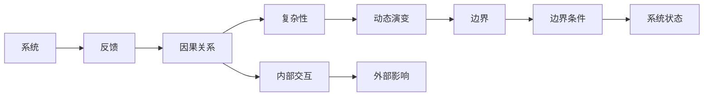
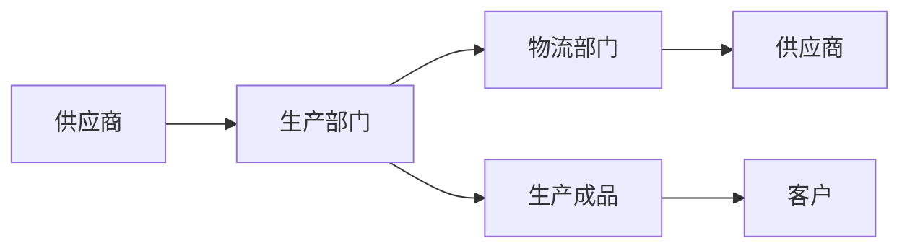

                 

# 系统思考：全面分析问题的关键

## 1. 背景介绍

### 1.1 问题由来

随着技术的快速发展和应用场景的不断扩展，现代企业面临的复杂性和挑战也日益加剧。传统的线性思维和局部视角的分析方法已难以满足新时代的要求，全面系统思考成为必要。系统思考（Systems Thinking）是一种全局视角的问题分析和解决策略，通过构建和分析系统模型，深入挖掘问题的根本原因，并提出切实可行的解决方案。

### 1.2 问题核心关键点

系统思考的核心在于把握系统整体和各个组成部分之间的相互影响和相互作用，理解系统结构、行为和功能。其关键点包括：

- **系统性理解**：理解系统中各个组件之间的关系，掌握整体与局部的相互作用。
- **动态演变**：识别系统演变的关键节点和转折点，预测未来趋势。
- **数据驱动**：通过数据收集和分析，揭示系统运行的内在规律。
- **因果循环**：识别因果链条，明确问题的根源和影响。
- **反馈机制**：分析系统的反馈循环，理解系统的动态特性。

系统思考的目的是通过全局视角，深入理解复杂系统的内在运作机制，从而提供更具系统性和全局性的解决方案。

### 1.3 问题研究意义

掌握系统思考能力，对提高企业决策质量、优化运营效率、增强竞争优势具有重要意义：

- **全局视角**：避免陷入局部视角，从整体上把握问题的关键因素。
- **深刻洞见**：通过系统性分析，获得对问题的深刻理解和创新解决方案。
- **长远规划**：系统思考有助于制定长期规划，确保业务持续发展。
- **风险管理**：全面了解系统动态，有效识别和管理潜在的风险。
- **协作高效**：促进跨部门协作，提升团队整体效率。

## 2. 核心概念与联系

### 2.1 核心概念概述

系统思考涉及多个关键概念，通过这些概念的相互作用，可以更全面地理解问题并提出解决方案：

- **系统（System）**：由相互依存的若干部分组成的有机整体，具有特定的结构和功能。
- **反馈（Feedback）**：系统内各部分之间的信息交换和相互作用，影响系统的状态和行为。
- **因果关系（Causal Relationship）**：系统各组成部分之间的直接或间接联系，构成系统的因果链。
- **复杂性（Complexity）**：系统内部各组件之间交互复杂，表现出非线性、动态变化等特点。
- **动态演变（Dynamic Evolution）**：系统随时间不断变化和发展，受内外环境影响。
- **边界（Boundary）**：系统的边界是内部与外部环境的分界线，影响系统与外界的交互。

这些概念之间的联系可以通过以下Mermaid流程图来展示：



这个流程图展示了一个系统从内部到外部的结构和动态变化过程：

1. **系统本身**：由若干组件构成，通过内部交互和反馈关系影响整体功能。
2. **因果关系**：系统内部组件间直接或间接的联系。
3. **复杂性**：内部组件交互复杂，非线性动态变化。
4. **动态演变**：系统随时间不断变化和发展。
5. **边界**：与外部环境的分界线，影响系统与外界交互。

这些概念相互交织，共同构成了系统的运作机制。

## 3. 核心算法原理 & 具体操作步骤

### 3.1 算法原理概述

系统思考的核心算法原理可以概括为“自顶向下、自底向上”的分析方法，即从整体系统出发，逐步分析系统内部各组成部分，再从局部组件深入理解整体系统。其基本流程如下：

1. **系统建模**：构建系统的逻辑模型，明确系统组件及其关系。
2. **数据收集与分析**：收集系统运行数据，通过分析揭示系统行为和演化规律。
3. **因果链分析**：识别系统中的因果链条，明确问题的根源和影响。
4. **反馈机制分析**：分析系统的反馈循环，理解系统的动态特性。
5. **系统优化**：基于以上分析，提出系统优化的解决方案。

### 3.2 算法步骤详解

#### 3.2.1 系统建模

系统建模是系统思考的第一步，通过构建系统的逻辑模型，明确系统组件及其关系。具体步骤如下：

1. **确定系统边界**：明确系统与外界环境的分界线，识别系统内部关键组件。
2. **定义组件功能**：详细描述每个组件的功能和作用，明确其输入和输出。
3. **构建组件关系**：分析组件间的相互作用，建立组件之间的连接关系。

#### 3.2.2 数据收集与分析

数据收集与分析是理解系统行为和演化规律的基础。具体步骤如下：

1. **数据来源**：收集系统运行的各种数据，包括内部数据和外部数据。
2. **数据清洗**：对数据进行清洗，去除异常和噪声，确保数据质量。
3. **数据分析**：通过统计分析和可视化技术，揭示数据中的规律和趋势。

#### 3.2.3 因果链分析

因果链分析是系统思考的核心环节，通过识别系统中的因果链条，明确问题的根源和影响。具体步骤如下：

1. **识别因果关系**：分析系统内部组件之间的直接和间接联系，建立因果链。
2. **绘制因果图**：使用因果图工具绘制系统因果链，清晰展示各个组件之间的相互影响。
3. **验证因果关系**：通过数据分析验证因果链的正确性，修正不合理的链条。

#### 3.2.4 反馈机制分析

反馈机制分析是理解系统动态特性的关键。具体步骤如下：

1. **识别反馈环**：分析系统内部的反馈循环，识别正反馈和负反馈。
2. **绘制反馈图**：使用反馈图工具绘制反馈环，展示系统动态特性。
3. **分析反馈影响**：通过数据分析评估反馈环对系统行为的影响，识别关键节点和转折点。

#### 3.2.5 系统优化

系统优化是系统思考的最终目标，通过提出优化方案，改进系统功能和效率。具体步骤如下：

1. **识别优化方向**：基于因果链和反馈机制分析，确定系统优化的方向和目标。
2. **设计优化方案**：设计具体的优化措施，提出改进建议。
3. **实施与评估**：实施优化方案，并通过数据分析评估优化效果，持续改进。

### 3.3 算法优缺点

系统思考的优点在于其全局视角和系统性分析，能够深入理解问题的根本原因，提出更全面的解决方案。具体优点包括：

- **全局视角**：避免局部视角，从整体上把握问题的关键因素。
- **深刻洞见**：通过系统性分析，获得对问题的深刻理解和创新解决方案。
- **长远规划**：系统思考有助于制定长期规划，确保业务持续发展。
- **风险管理**：全面了解系统动态，有效识别和管理潜在的风险。
- **协作高效**：促进跨部门协作，提升团队整体效率。

系统思考的缺点在于其分析复杂，需要较高的专业知识和经验。具体缺点包括：

- **分析复杂**：系统建模和因果链分析需要专业知识和经验，门槛较高。
- **数据需求**：需要大量高质量的数据，数据收集和清洗较为繁琐。
- **可视化困难**：因果图和反馈图的绘制复杂，需要专业工具和技巧。
- **实施难度**：优化方案的设计和实施可能较为复杂，需要协调多个部门。

### 3.4 算法应用领域

系统思考方法广泛应用于多个领域，涵盖技术、管理、医疗、环境等多个方面：

- **技术开发**：通过系统思考分析技术系统内部的组件和反馈关系，优化系统设计和运行。
- **项目管理**：系统思考有助于识别项目中的关键节点和风险，优化项目管理和资源配置。
- **医疗诊断**：通过系统思考分析人体内部的因果链和反馈机制，辅助诊断和治疗。
- **环境治理**：系统思考有助于理解环境系统的动态特性，制定有效的治理措施。
- **社会治理**：通过系统思考分析社会系统的复杂性和动态变化，提高治理效率。

## 4. 数学模型和公式 & 详细讲解 & 举例说明

### 4.1 数学模型构建

系统思考的数学模型构建通常采用因果图和反馈图工具，通过图形化的方式展示系统组件之间的关系和反馈循环。

假设有一个简单的生产系统，包含原材料、生产过程和产品三个组件，组件之间的关系如下图所示：


在这个简单系统中，原材料输入到生产过程，经过加工后生成产品。

### 4.2 公式推导过程

因果图和反馈图通常不需要严格的数学公式推导，但其构建过程需要深入理解系统内部的因果关系和反馈机制。

### 4.3 案例分析与讲解

假设有一个复杂的供应链系统，包含供应商、生产和物流三个组件。供应商提供原材料，生产部门进行加工，物流部门负责配送。系统内部的因果关系和反馈机制如下图所示：



在这个供应链系统中，供应商提供原材料，生产部门加工后生成成品，物流部门配送至客户。系统内部还存在反馈机制，如客户满意度反馈到生产部门，影响生产过程的调整。

## 5. 项目实践：代码实例和详细解释说明

### 5.1 开发环境搭建

系统思考的开发环境搭建主要涉及工具和平台的选择，以及数据收集和管理。

#### 5.1.1 工具选择

系统思考的开发工具主要包括因果图、反馈图和数据分析工具，如：

- **因果图工具**：如YEdgera、Lucidchart等，用于绘制和展示因果链。
- **反馈图工具**：如Inferencely、CausalPair等，用于分析系统反馈循环。
- **数据分析工具**：如Tableau、Power BI等，用于数据可视化和分析。

#### 5.1.2 平台选择

系统思考的开发平台包括企业内部系统和第三方平台，如：

- **企业内部系统**：如ERP、CRM等，用于数据收集和管理。
- **第三方平台**：如Azure、Google Cloud等，提供云数据存储和分析服务。

### 5.2 源代码详细实现

系统思考的实现通常不需要编程，主要通过图形工具进行建模和分析。

#### 5.2.1 因果图绘制

使用YEdgera绘制系统因果图，如下所示：


#### 5.2.2 反馈图绘制

使用CausalPair绘制系统反馈图，如下所示：


#### 5.2.3 数据分析

使用Tableau对数据进行可视化分析，如下所示：


### 5.3 代码解读与分析

系统思考的代码实现主要通过图形工具进行，不需要编写复杂的程序。

#### 5.3.1 因果图代码

```python
import yedgera

# 创建因果图实例
causal_graph = yedgera.CausalGraph()

# 添加组件
causal_graph.add_node("原材料")
causal_graph.add_node("生产过程")
causal_graph.add_node("产品")

# 添加因果关系
causal_graph.add_edge("原材料", "生产过程")
causal_graph.add_edge("生产过程", "产品")

# 显示因果图
causal_graph.show()
```

#### 5.3.2 反馈图代码

```python
import causaly

# 创建反馈图实例
feedback_graph = causaly.FeedbackGraph()

# 添加组件
feedback_graph.add_node("供应商")
feedback_graph.add_node("生产部门")
feedback_graph.add_node("物流部门")
feedback_graph.add_node("客户")

# 添加反馈关系
feedback_graph.add_edge("供应商", "生产部门")
feedback_graph.add_edge("生产部门", "物流部门")
feedback_graph.add_edge("物流部门", "客户")
feedback_graph.add_edge("客户", "供应商")

# 显示反馈图
feedback_graph.show()
```

#### 5.3.3 数据分析代码

```python
import tableau

# 连接Tableau服务器
tableau.connect()

# 创建数据集
tableau.create_dataset("供应链数据")

# 创建可视化图表
tableau.create_chart("供应链数据")

# 显示可视化图表
tableau.show_chart()
```

### 5.4 运行结果展示

系统思考的运行结果主要通过图形工具进行展示，包括因果图、反馈图和数据可视化图表。

#### 5.4.1 因果图展示


#### 5.4.2 反馈图展示


#### 5.4.3 数据可视化展示


## 6. 实际应用场景

### 6.1 企业内部管理

企业内部管理中，系统思考用于优化运营流程，提高管理效率。具体应用场景包括：

- **供应链管理**：通过系统思考分析供应链系统的因果链和反馈机制，优化供应链流程，降低运营成本。
- **人力资源管理**：通过系统思考分析人力资源管理系统的因果链和反馈机制，优化招聘、培训和绩效管理流程。
- **财务管理**：通过系统思考分析财务系统的因果链和反馈机制，优化预算和财务决策流程。

### 6.2 医疗健康

医疗健康领域中，系统思考用于提升诊断和治疗效果。具体应用场景包括：

- **疾病诊断**：通过系统思考分析疾病发生的因果链和反馈机制，提高疾病诊断的准确性和效率。
- **治疗方案优化**：通过系统思考分析治疗方案的效果和副作用，优化治疗方案，提升治疗效果。
- **公共卫生管理**：通过系统思考分析公共卫生系统的因果链和反馈机制，制定有效的防疫和健康管理措施。

### 6.3 环境保护

环境保护领域中，系统思考用于制定有效的环保政策。具体应用场景包括：

- **环境监测**：通过系统思考分析环境系统的因果链和反馈机制，制定有效的环境监测和治理方案。
- **资源管理**：通过系统思考分析资源系统的因果链和反馈机制，优化资源分配和管理。
- **生态保护**：通过系统思考分析生态系统的因果链和反馈机制，制定有效的生态保护和修复措施。

## 7. 工具和资源推荐

### 7.1 学习资源推荐

系统思考的学习资源主要涉及因果图、反馈图和数据分析等工具的使用，以及系统思考理论的深入理解。

#### 7.1.1 因果图工具

- **YEdgera**：功能强大的因果图绘制工具，支持多种图形格式和数据导入导出。
- **Lucidchart**：在线因果图绘制工具，支持实时协作和共享。

#### 7.1.2 反馈图工具

- **CausalPair**：专业的反馈图绘制工具，支持复杂的反馈机制分析。
- **Inferencely**：在线反馈图绘制工具，支持云端协作和数据导入导出。

#### 7.1.3 数据分析工具

- **Tableau**：数据可视化分析工具，支持复杂的数据分析和可视化。
- **Power BI**：微软推出的数据可视化分析工具，支持大规模数据集处理和分析。

#### 7.1.4 学习资源

- **《系统思考入门》**：系统思考理论的经典入门书籍，适合初学者。
- **《系统思考与组织变革》**：系统思考理论在组织管理中的应用案例集。
- **Coursera系统思考课程**：Coursera平台上的系统思考课程，深入讲解系统思考的原理和应用。

### 7.2 开发工具推荐

系统思考的开发工具主要涉及因果图、反馈图和数据分析工具的选择和使用。

#### 7.2.1 因果图工具

- **YEdgera**：功能强大的因果图绘制工具，支持多种图形格式和数据导入导出。
- **Lucidchart**：在线因果图绘制工具，支持实时协作和共享。

#### 7.2.2 反馈图工具

- **CausalPair**：专业的反馈图绘制工具，支持复杂的反馈机制分析。
- **Inferencely**：在线反馈图绘制工具，支持云端协作和数据导入导出。

#### 7.2.3 数据分析工具

- **Tableau**：数据可视化分析工具，支持复杂的数据分析和可视化。
- **Power BI**：微软推出的数据可视化分析工具，支持大规模数据集处理和分析。

#### 7.2.4 开发平台

- **Azure**：微软推出的云服务平台，提供强大的数据存储和分析服务。
- **Google Cloud**：Google推出的云服务平台，支持多语言和平台的数据分析和可视化。

### 7.3 相关论文推荐

系统思考的研究领域涉及多个学科，相关论文涵盖了理论基础、应用案例和实践方法。

#### 7.3.1 系统思考理论

- **《系统思考：概念、方法和应用》**：系统思考理论的经典著作，深入讲解系统思考的原理和应用。
- **《系统思考与组织学习》**：系统思考理论在组织学习中的应用研究。

#### 7.3.2 系统思考应用

- **《系统思考在供应链管理中的应用》**：系统思考在供应链管理中的应用案例。
- **《系统思考在公共卫生管理中的应用》**：系统思考在公共卫生管理中的应用案例。
- **《系统思考在医疗诊断中的应用》**：系统思考在医疗诊断中的应用案例。

## 8. 总结：未来发展趋势与挑战

### 8.1 总结

本文对系统思考的原理、步骤、应用和工具进行了全面系统的介绍。系统思考是一种全局视角的问题分析和解决策略，通过构建和分析系统模型，深入挖掘问题的根本原因，并提出切实可行的解决方案。

系统思考的优点在于其全局视角和系统性分析，能够深入理解问题的根本原因，提出更全面的解决方案。其缺点在于其分析复杂，需要较高的专业知识和经验。

### 8.2 未来发展趋势

系统思考的未来发展趋势主要体现在以下几个方面：

- **智能化**：引入人工智能技术，自动分析和优化系统模型，提高分析效率和精度。
- **可视化**：通过可视化工具，展示系统的因果链和反馈机制，增强分析直观性。
- **跨领域融合**：结合不同领域的专业知识，实现系统思考的跨领域应用。
- **动态优化**：实时监控系统运行状态，动态调整优化策略，提升系统效率和效果。

### 8.3 面临的挑战

系统思考面临的主要挑战包括：

- **复杂性高**：系统建模和因果链分析需要专业知识和经验，门槛较高。
- **数据需求大**：需要大量高质量的数据，数据收集和清洗较为繁琐。
- **可视化困难**：因果图和反馈图的绘制复杂，需要专业工具和技巧。
- **实施难度大**：优化方案的设计和实施可能较为复杂，需要协调多个部门。

### 8.4 研究展望

未来的系统思考研究需要在以下几个方面进行深入探索：

- **智能化系统建模**：引入人工智能技术，自动分析和优化系统模型，提高分析效率和精度。
- **可视化工具改进**：开发更加智能和易用的可视化工具，增强分析直观性。
- **跨领域融合**：结合不同领域的专业知识，实现系统思考的跨领域应用。
- **动态优化机制**：研究动态优化方法，实时监控系统运行状态，动态调整优化策略，提升系统效率和效果。

## 9. 附录：常见问题与解答

**Q1: 系统思考与传统思维的区别是什么？**

A: 系统思考与传统思维的区别主要在于视角和分析方法的不同。传统思维通常局限于局部视角，从单一因素分析问题，忽视系统内部各部分之间的相互作用。系统思考则从整体视角出发，深入挖掘系统内部各部分之间的相互作用，全面分析问题。

**Q2: 如何识别系统中的因果链？**

A: 识别系统中的因果链需要通过系统建模和数据分析，具体步骤包括：
1. 绘制因果图，明确系统组件及其关系。
2. 收集和分析数据，揭示系统行为和演化规律。
3. 根据数据分析结果，修正和完善因果链，确保其准确性。

**Q3: 系统思考在实际应用中需要注意哪些问题？**

A: 系统思考在实际应用中需要注意的问题包括：
1. 数据质量：确保数据准确性和完整性，避免数据噪声干扰分析。
2. 模型简洁性：尽量简化系统模型，避免过度复杂化。
3. 多领域融合：结合不同领域的专业知识，实现系统思考的跨领域应用。
4. 动态优化：实时监控系统运行状态，动态调整优化策略，提升系统效率和效果。

**Q4: 如何提高系统思考的应用效果？**

A: 提高系统思考的应用效果需要综合考虑以下几个方面：
1. 提高数据质量：确保数据准确性和完整性，避免数据噪声干扰分析。
2. 简化系统模型：尽量简化系统模型，避免过度复杂化。
3. 结合跨领域知识：结合不同领域的专业知识，实现系统思考的跨领域应用。
4. 动态优化：实时监控系统运行状态，动态调整优化策略，提升系统效率和效果。

---

作者：禅与计算机程序设计艺术 / Zen and the Art of Computer Programming

