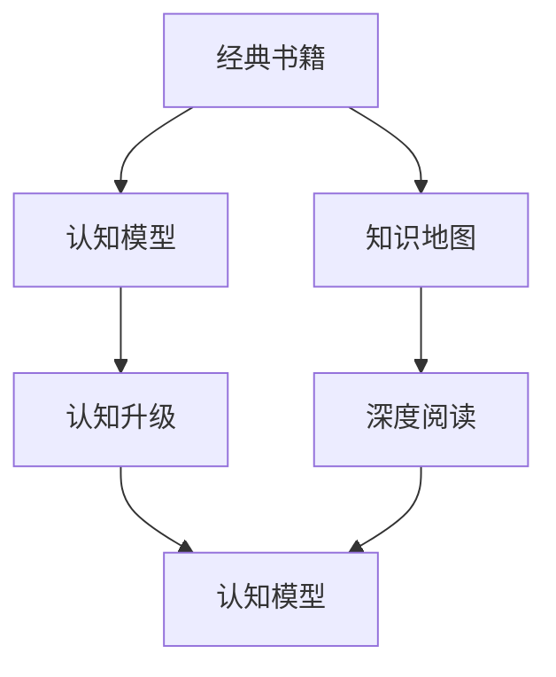

                 

# 经典书籍:夯实认知根基的宝藏

## 1. 背景介绍

### 1.1 问题由来
在这个信息爆炸的时代，我们每天都在面对海量的数据和知识。如何从这些信息中提取出真正有价值的认知，是我们每个知识工作者都面临的挑战。传统的阅读和学习方式已经不足以应对这种爆炸式增长的信息。这就需要一种更加高效、系统、深入的认知方式，而经典书籍，无疑是这一过程中不可或缺的“宝藏”。

经典书籍通常由经验丰富、知识深厚的专家撰写，包含了他们多年研究和实践的精华。这些书籍不仅内容丰富、结构严谨，而且往往能提供系统性和全面性的视角，帮助我们建立更深层次的认知模型。通过阅读经典书籍，我们可以在知识海洋中找到灯塔，引领我们走向正确的方向。

### 1.2 问题核心关键点
如何从海量信息中筛选出经典书籍，并通过阅读这些书籍来提升我们的认知水平，是当前知识工作者面临的核心问题。为了解决这一问题，我们必须明确经典书籍的特点、选择经典书籍的依据，以及如何有效阅读和吸收经典书籍中的知识。

### 1.3 问题研究意义
在信息爆炸的时代，经典书籍扮演着“巨匠之言”的角色，通过它们，我们可以更深刻地理解一个领域的核心思想、方法论和实践经验。阅读经典书籍，不仅可以提升个人的认知水平，还可以推动社会知识进步，加速技术创新和产业发展。因此，探索经典书籍的阅读方法，具有重要的理论价值和实践意义。

## 2. 核心概念与联系

### 2.1 核心概念概述

为更好地理解经典书籍在认知提升中的作用，本节将介绍几个核心概念及其之间的联系：

- **经典书籍**：由专家撰写、内容深度和广度兼备、经过时间考验的书籍。
- **认知模型**：通过学习经典书籍，建立起来的系统、深入的认知框架，用于理解和解决实际问题。
- **知识地图**：由经典书籍连接成的知识网络，帮助读者构建完整的知识体系。
- **认知升级**：通过阅读经典书籍，实现认知模型的迭代和升级。
- **深度阅读**：一种系统、深入的阅读方式，通过多次阅读和反思，深入理解经典书籍的核心思想。

这些核心概念之间的逻辑关系可以通过以下Mermaid流程图来展示：



这个流程图展示经典书籍的核心概念及其之间的关系：

1. 经典书籍通过深度阅读，帮助读者构建认知模型。
2. 认知模型通过与知识地图的关联，形成完整的知识体系。
3. 通过不断的认知升级，认知模型不断迭代和优化。

这些概念共同构成了经典书籍阅读的框架，帮助我们从阅读中获得最大的认知提升。

## 3. 核心算法原理 & 具体操作步骤
### 3.1 算法原理概述

经典书籍的阅读和认知提升，本质上是一个系统性的学习和内化过程。其核心思想是：通过深度阅读和反思，将经典书籍中的知识转化为个人的认知模型，并不断迭代优化，形成深度认知。

形式化地，假设经典书籍为 $B$，读者通过阅读获得的认知模型为 $C$，则认知提升的过程可以表示为：

$$
C = f(B, R)
$$

其中 $R$ 为读者在阅读过程中的反思和内化。$f$ 为认知提升的函数，将经典书籍 $B$ 和反思 $R$ 映射为新的认知模型 $C$。

### 3.2 算法步骤详解

经典书籍的阅读和认知提升一般包括以下几个关键步骤：

**Step 1: 选择经典书籍**
- 根据自身的兴趣和职业需求，选择适合的经典书籍。可以关注书籍的作者背景、出版时间、内容评价等。
- 选择经典书籍时，应注重其权威性和前沿性，避免选择过时或质量较差的书籍。

**Step 2: 制定阅读计划**
- 将选择好的经典书籍划分为若干部分，制定详细的阅读计划。
- 对于较为厚重的书籍，可以分阶段进行阅读，每次阅读目标明确。

**Step 3: 深度阅读与笔记**
- 每次阅读前，设定明确的阅读目标，如理解某一段落的核心思想或掌握某个概念。
- 在阅读过程中，进行积极的思考和笔记，记录下关键的观点、例子和疑问。
- 遇到不理解的内容，可以多次回读或查阅相关资料，直至完全理解。

**Step 4: 反思与内化**
- 阅读完成后，进行反思和总结，将学到的知识与已有认知进行对比，发现新旧知识的关联。
- 将反思结果记录下来，形成系统的笔记和思维导图，方便后续复习和应用。
- 通过反复阅读和反思，不断深化对经典书籍的理解。

**Step 5: 应用与实践**
- 将学到的知识应用于实际问题解决中，验证理论的正确性和适用性。
- 在应用过程中，持续记录问题和解决方法，形成动态的知识库。
- 通过不断的应用和实践，不断迭代和优化个人的认知模型。

### 3.3 算法优缺点

经典书籍的阅读和认知提升方法具有以下优点：
1. 系统性：通过阅读和反思，建立完整的认知模型，避免知识零散。
2. 深度性：通过多次阅读和反复反思，深入理解经典书籍的核心思想。
3. 实践性：将学到的知识应用到实际问题中，提升解决问题的能力。

同时，该方法也存在一定的局限性：
1. 阅读量较大：经典书籍通常内容丰富，阅读量较大，需要投入较多的时间和精力。
2. 理解难度高：经典书籍内容深奥，需要较高的理解能力和思维水平。
3. 理论应用范围有限：经典书籍往往更侧重理论，应用于具体问题时可能需要进行一定的调整和扩展。
4. 适用性不广：经典书籍的适用性受限于作者的研究方向和知识背景，不一定适用于所有读者。

尽管存在这些局限性，但经典书籍阅读仍然是提升认知的重要途径。在实际应用中，我们需要结合其他阅读方法，如快速阅读、碎片化阅读等，形成互补的阅读策略。

### 3.4 算法应用领域

经典书籍的阅读和认知提升方法，可以应用于多个领域，例如：

- 软件开发：阅读经典的软件开发书籍，学习算法、数据结构、设计模式等核心知识。
- 数据科学：阅读经典的数据科学书籍，掌握数据处理、机器学习、统计分析等技能。
- 经济学：阅读经典的经济学书籍，理解市场原理、投资策略、经济周期等概念。
- 哲学：阅读经典的哲学书籍，思考人类存在的意义、伦理道德、认识论等问题。
- 教育：阅读经典的教学方法书籍，学习如何设计和实施有效的教学活动。
- 心理学：阅读经典的心理学书籍，理解人类行为和心理机制。

除了这些领域外，经典书籍阅读还可以应用于科学研究、商业管理、艺术创作等多个领域，为人类知识进步和社会发展提供持续的智慧支撑。

## 4. 数学模型和公式 & 详细讲解 & 举例说明（备注：数学公式请使用latex格式，latex嵌入文中独立段落使用 $$，段落内使用 $)
### 4.1 数学模型构建

经典书籍的阅读和认知提升，可以通过数学模型来形式化描述。以下是一个简单的数学模型：

假设读者通过阅读经典书籍 $B$，理解了其中的 $K$ 个关键概念 $C_1, C_2, \cdots, C_K$。读者通过反思和实践，将这些概念应用到实际问题 $P$ 中，得到解决方案 $S$。则认知提升的数学模型可以表示为：

$$
S = f(C_1, C_2, \cdots, C_K)
$$

其中 $f$ 为解决问题的方法函数。读者通过不断的学习、反思和实践，不断优化 $f$，提升问题解决的能力。

### 4.2 公式推导过程

下面以软件开发为例，推导一个简单的公式：

假设读者阅读了经典的软件开发书籍《代码大全》，学习了代码编写、测试、优化等核心知识。读者将这些知识应用于解决一个代码重构问题 $P$，得到解决方案 $S$。则：

$$
S = f(C_{代码编写}, C_{测试}, C_{优化})
$$

其中 $C_{代码编写}$ 表示书中关于代码编写的关键概念，$C_{测试}$ 表示关于测试的核心知识，$C_{优化}$ 表示关于代码优化的技能。通过反复阅读和实践，读者可以不断优化 $f$，提升问题解决的能力。

### 4.3 案例分析与讲解

**案例分析**：假设读者学习了经典的数据科学书籍《数据科学导论》，掌握了数据预处理、模型训练、评估等技能。读者将这些知识应用于解决一个客户流失问题 $P$，得到解决方案 $S$。则：

$$
S = f(C_{数据预处理}, C_{模型训练}, C_{评估})
$$

其中 $C_{数据预处理}$ 表示书中关于数据预处理的方法，$C_{模型训练}$ 表示关于模型训练的核心技巧，$C_{评估}$ 表示关于模型评估的标准。通过反复阅读和实践，读者可以不断优化 $f$，提升问题解决的能力。

## 5. 项目实践：代码实例和详细解释说明
### 5.1 开发环境搭建

在进行经典书籍阅读实践前，我们需要准备好开发环境。以下是使用Python进行深度学习开发的典型环境配置流程：

1. 安装Anaconda：从官网下载并安装Anaconda，用于创建独立的Python环境。

2. 创建并激活虚拟环境：
```bash
conda create -n my_env python=3.8 
conda activate my_env
```

3. 安装必要的Python库：
```bash
pip install numpy pandas scikit-learn torch torchvision torchaudio matplotlib tqdm jupyter notebook
```

4. 安装深度学习框架：
```bash
pip install tensorflow tensorflow-gpu scikit-learn-gpu
```

5. 安装深度学习库：
```bash
pip install tensorflow-gpu keras
```

6. 安装Notebook环境：
```bash
pip install jupyter
```

完成上述步骤后，即可在`my_env`环境中开始深度学习项目开发。

### 5.2 源代码详细实现

下面以经典书籍《深度学习》为例，给出使用Python进行深度学习项目开发的完整代码实现。

首先，定义一个简单的神经网络模型：

```python
import tensorflow as tf
from tensorflow.keras import layers, models

class MyModel(models.Model):
    def __init__(self):
        super(MyModel, self).__init__()
        self.dense1 = layers.Dense(64, activation='relu')
        self.dense2 = layers.Dense(10, activation='softmax')
        
    def call(self, inputs):
        x = self.dense1(inputs)
        x = self.dense2(x)
        return x
```

然后，定义数据集和模型训练函数：

```python
from tensorflow.keras.datasets import mnist
from tensorflow.keras.utils import to_categorical

(x_train, y_train), (x_test, y_test) = mnist.load_data()
x_train, x_test = x_train / 255.0, x_test / 255.0
y_train = to_categorical(y_train, 10)
y_test = to_categorical(y_test, 10)

model = MyModel()
model.compile(optimizer='adam', loss='categorical_crossentropy', metrics=['accuracy'])
model.fit(x_train, y_train, epochs=10, batch_size=32, validation_data=(x_test, y_test))
```

最后，进行模型评估和预测：

```python
loss, accuracy = model.evaluate(x_test, y_test, verbose=0)
print(f'Test accuracy: {accuracy * 100:.2f}%')

test_image = x_test[0]
test_image = test_image.reshape(1, 28, 28, 1)
predicted_label = model.predict(test_image)
print(f'Predicted label: {predicted_label.argmax()}')
```

以上就是使用Python进行经典书籍《深度学习》项目开发的完整代码实现。可以看到，深度学习框架和库的使用，使得模型开发和训练变得简洁高效。

### 5.3 代码解读与分析

让我们再详细解读一下关键代码的实现细节：

**定义神经网络模型**：
- `MyModel`类继承自`models.Model`，定义了两个全连接层，其中第一层使用ReLU激活函数，第二层使用Softmax激活函数。
- `call`方法用于定义前向传播过程。

**数据集加载和预处理**：
- 使用`mnist.load_data()`加载MNIST手写数字数据集。
- 对数据进行归一化处理，将像素值转换为0-1之间的浮点数。
- 使用`to_categorical`将标签转换为独热编码。

**模型训练**：
- 创建`MyModel`实例，并使用`compile`方法配置优化器和损失函数。
- 使用`fit`方法进行模型训练，设置训练轮数和批量大小。
- 在验证集上进行模型评估，输出测试准确率。

**模型评估和预测**：
- 使用`evaluate`方法在测试集上评估模型性能，输出测试损失和准确率。
- 对单张测试图片进行预测，输出预测标签。

可以看到，深度学习框架提供了丰富的工具和接口，可以大大简化模型开发和训练过程。利用这些工具，我们可以更专注于算法创新和模型优化。

## 6. 实际应用场景
### 6.1 软件开发

经典书籍在软件开发中扮演着重要的角色。通过阅读经典书籍，开发者可以掌握最新的技术趋势和最佳实践，提升编码质量和代码重构能力。例如，阅读《代码大全》、《重构：改善既有代码的设计》等书籍，可以学习到代码编写、重构、测试等核心技术。

### 6.2 数据科学

数据科学是一个多学科交叉的领域，经典书籍在其中扮演着桥梁作用。通过阅读《数据科学导论》、《Python数据科学手册》等书籍，数据科学家可以掌握数据处理、机器学习、统计分析等核心技能，构建高效、可靠的数据分析系统。

### 6.3 经济学

经济学是一个复杂多变的领域，经典书籍可以为经济学研究提供坚实的基础。例如，阅读《经济学原理》、《宏观经济学》等书籍，可以理解市场原理、经济周期、投资策略等核心概念，为经济学研究和实践提供指导。

### 6.4 未来应用展望

随着经典书籍阅读方法的发展，其在知识工作者中的重要性将进一步提升。未来，经典书籍阅读将与其他学习方法（如在线课程、论文阅读等）形成互补，形成更加综合的学习体系。

在人工智能领域，经典书籍将进一步成为深度学习和知识图谱的桥梁。例如，阅读《深度学习》、《知识图谱》等书籍，可以帮助开发者掌握深度学习算法和知识图谱构建方法，提升人工智能系统的智能水平。

## 7. 工具和资源推荐
### 7.1 学习资源推荐

为了帮助读者系统掌握经典书籍的阅读方法，这里推荐一些优质的学习资源：

1. **《深度学习》（Ian Goodfellow）**：深度学习领域的经典教材，涵盖深度学习的基本概念、算法、应用等。
2. **《数据科学导论》（Peter Harrington）**：介绍数据科学的核心技术和方法，包括数据处理、机器学习、统计分析等。
3. **《经济学原理》（N. Gregory Mankiw）**：经典的经济学教材，涵盖宏观经济、微观经济、投资策略等核心概念。
4. **《Python数据科学手册》（Jake VanderPlas）**：介绍Python在数据科学中的应用，涵盖数据处理、可视化、机器学习等技术。
5. **《重构：改善既有代码的设计》（Martin Fowler）**：介绍代码重构的基本方法和最佳实践，提升代码质量和可维护性。

通过对这些资源的学习实践，相信读者可以更好地掌握经典书籍的阅读方法，并用于解决实际问题。

### 7.2 开发工具推荐

高效的开发离不开优秀的工具支持。以下是几款用于经典书籍阅读和实践的常用工具：

1. **Anaconda**：Python环境管理工具，方便创建和管理Python虚拟环境，支持多版本Python和库。
2. **Jupyter Notebook**：轻量级的Web应用，支持多种编程语言和数据可视化，适合进行项目开发和文档记录。
3. **TensorFlow**：谷歌开发的深度学习框架，支持分布式计算和GPU加速，适合进行深度学习项目开发。
4. **PyTorch**：Facebook开发的深度学习框架，支持动态计算图和GPU加速，适合进行深度学习项目开发。
5. **Scikit-Learn**：开源的Python机器学习库，支持多种机器学习算法，适合进行数据处理和建模。

合理利用这些工具，可以显著提升经典书籍阅读和实践的效率，加快创新迭代的步伐。

### 7.3 相关论文推荐

经典书籍阅读方法的研究源于学界的持续探索。以下是几篇奠基性的相关论文，推荐阅读：

1. **《机器学习：实践案例》（Peter Harrington）**：介绍机器学习算法的实现和应用，涵盖数据处理、特征工程、模型训练等技术。
2. **《编程珠玑》（Jon Bentley）**：介绍编程中的最佳实践和算法设计技巧，帮助读者提高编程能力。
3. **《算法导论》（Thomas H. Cormen）**：计算机算法领域的经典教材，涵盖算法设计和分析的基本方法。
4. **《数据科学与机器学习：实用指南》（Peter Harrington）**：介绍数据科学和机器学习的基本技术和方法，涵盖数据处理、模型训练、评估等。

这些论文代表经典书籍阅读方法的发展脉络，通过学习这些前沿成果，可以帮助读者掌握经典书籍的阅读技巧，提升自身的知识水平和实践能力。

## 8. 总结：未来发展趋势与挑战
### 8.1 研究成果总结

经典书籍阅读方法在提升认知和推动知识进步方面发挥了重要作用。其核心思想是系统性、深度性和实践性，通过反复阅读和反思，建立完整的认知模型，并不断迭代优化。这一方法不仅适用于学术研究，也适用于行业应用和知识管理。

### 8.2 未来发展趋势

展望未来，经典书籍阅读方法将呈现以下几个发展趋势：

1. **多学科融合**：经典书籍阅读将更多地结合其他学科的知识和方法，形成更加综合的认知模型。例如，结合数据科学、机器学习、知识图谱等技术，提升经典书籍阅读的深度和广度。
2. **智能化辅助**：借助人工智能技术，如自然语言处理、推荐系统等，为经典书籍阅读提供智能化的辅助工具。例如，智能书评、智能推荐、智能笔记等。
3. **知识图谱应用**：通过构建知识图谱，帮助读者构建完整的知识体系，提升认知模型的系统性和深度性。例如，利用知识图谱技术，将经典书籍中的知识进行整合和关联。
4. **在线化学习**：经典书籍阅读将更多地利用在线学习平台，如Coursera、edX等，实现随时随地、方便快捷的学习体验。例如，通过在线课程、视频讲座等形式，提升经典书籍的阅读效率和效果。

### 8.3 面临的挑战

尽管经典书籍阅读方法已经取得了显著成就，但在迈向更加智能化、系统化应用的过程中，仍面临一些挑战：

1. **阅读效率低**：经典书籍内容丰富，阅读量较大，需要投入较多的时间和精力。如何提高阅读效率，减少时间成本，是未来的一个重要研究方向。
2. **理解难度高**：经典书籍内容深奥，需要较高的理解能力和思维水平。如何降低理解难度，提高读者可读性，是未来的一个重要研究方向。
3. **应用范围有限**：经典书籍的适用性受限于作者的研究方向和知识背景，不一定适用于所有读者。如何拓展应用范围，形成更普适的阅读方法，是未来的一个重要研究方向。
4. **缺乏标准化**：经典书籍阅读方法缺乏统一的标准和规范，不同读者有不同的阅读习惯和方法。如何建立标准化阅读方法，形成科学合理的阅读框架，是未来的一个重要研究方向。

### 8.4 研究展望

未来，经典书籍阅读方法需要结合其他学习方法，如在线学习、视频学习等，形成更加综合的学习体系。借助人工智能技术和知识图谱技术，提升经典书籍阅读的深度和广度，帮助读者构建完整的知识体系，提升认知模型的系统性和深度性。

经典书籍阅读方法的研究将引领知识工作者向更加智能化、系统化迈进，为社会知识进步和经济发展提供持续的智慧支撑。只有不断创新和突破，才能实现经典书籍阅读方法的持续发展和应用。

## 9. 附录：常见问题与解答
### 9.1 Q1：如何选择适合的经典书籍？

A: 选择经典书籍时，应考虑以下几个方面：
- 书籍的权威性和前沿性。选择由专家撰写、内容深度和广度兼备的书籍。
- 书籍的适用性。根据自身的兴趣和职业需求，选择适合的书籍。
- 书籍的可读性。选择语言通俗易懂、结构严谨的书籍，避免选择晦涩难懂的书籍。

### 9.2 Q2：如何提高经典书籍阅读效率？

A: 提高经典书籍阅读效率，可以通过以下几个方面：
- 制定阅读计划。将书籍划分为若干部分，制定详细的阅读计划，每次阅读目标明确。
- 使用速读技巧。学习速读技巧，提高阅读速度和理解能力。
- 借助工具辅助。利用阅读工具，如Evernote、Anki等，记录笔记和进行复习。
- 多轮阅读。通过多次阅读和反复反思，逐步加深对书籍的理解。

### 9.3 Q3：经典书籍阅读有哪些益处？

A: 经典书籍阅读有以下几个益处：
- 提升认知水平。通过阅读经典书籍，建立完整的认知模型，提升认知能力。
- 学习先进思想。经典书籍涵盖最新的技术和方法，帮助读者掌握前沿知识。
- 解决实际问题。将学到的知识应用于实际问题，提升解决问题的能力。
- 促进创新发展。经典书籍阅读可以激发创新的灵感，推动知识进步和技术创新。

### 9.4 Q4：如何利用经典书籍构建知识图谱？

A: 利用经典书籍构建知识图谱，可以通过以下几个步骤：
- 阅读书籍，提取核心概念和知识点。
- 构建知识节点。将核心概念和知识点作为知识图谱的节点。
- 建立关联关系。根据书籍中的逻辑关系，建立节点之间的关联关系。
- 可视化展示。使用可视化工具，如Gephi、Cytoscape等，展示知识图谱的结构和关系。

### 9.5 Q5：经典书籍阅读有哪些限制？

A: 经典书籍阅读有以下几个限制：
- 阅读量较大。经典书籍内容丰富，阅读量较大，需要投入较多的时间和精力。
- 理解难度高。经典书籍内容深奥，需要较高的理解能力和思维水平。
- 应用范围有限。经典书籍的适用性受限于作者的研究方向和知识背景，不一定适用于所有读者。
- 缺乏标准化。经典书籍阅读方法缺乏统一的标准和规范，不同读者有不同的阅读习惯和方法。

---

作者：禅与计算机程序设计艺术 / Zen and the Art of Computer Programming

