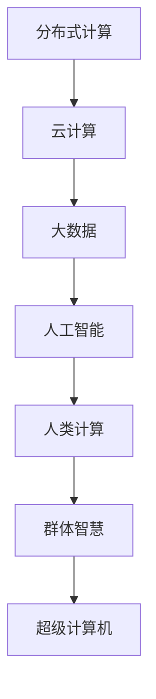

                 

# 群体智慧：人类计算的无限潜力

> 关键词：群体智慧,分布式计算,人类计算,超级计算机,人工智能,大数据,云计算

## 1. 背景介绍

### 1.1 问题由来

随着科技的飞速发展，人类计算能力在过去几十年内取得了巨大飞跃。从最早的单机计算机，到多核、多线程，再到分布式计算、云计算，计算机系统正变得越来越强大。但是，这些强大的计算能力主要集中在大型机构和企业手中，普通民众和中小型组织仍然缺乏足够的计算资源。

如何利用这些强大的计算能力，打破“数字鸿沟”，让更多的普通人能够享受到计算技术带来的便利和进步，成为了当前社会面临的一大挑战。

### 1.2 问题核心关键点

本论文旨在探索“群体智慧”（Crowdsourcing）的概念，即如何通过大规模的分布式计算，将个人、组织、机构等群体力量结合起来，形成强大的计算能力，实现计算资源的共享和协同。

为了更好地理解群体智慧的实现原理和应用场景，本论文将详细阐述以下核心概念：

- **分布式计算**：通过分布式系统，将计算任务分解为多个子任务，并在多台计算机上并行计算，以达到更快的计算速度和更高的计算效率。
- **人类计算**：利用人类的计算能力，通过在线调查、众包等形式，获取大量高精度数据，用于训练和优化人工智能模型。
- **超级计算机**：由大量计算机组成的计算集群，具有极高的计算速度和存储能力，能够处理大规模的数据集和复杂的计算任务。
- **人工智能**：利用机器学习和深度学习技术，让计算机具备类似于人类的智能推理和决策能力，实现自动化和智能化。
- **大数据**：海量的、复杂的数据集，通过数据分析和处理，可以获得有价值的信息和知识。
- **云计算**：通过互联网提供计算资源和服务的计算模式，能够按需扩展和灵活使用计算资源。

## 2. 核心概念与联系

### 2.1 核心概念概述

本节将详细介绍几个核心概念，并阐述它们之间的联系和相互影响。

**分布式计算**：通过多台计算机协同工作，将计算任务分解为多个子任务，并行计算。这种方式可以显著提高计算速度和效率，适用于处理大规模的数据集和复杂的计算任务。

**人类计算**：利用人类的计算能力，通过在线调查、众包等形式，获取大量高精度数据。这些数据可以用于训练和优化人工智能模型，提升模型的精度和性能。

**超级计算机**：由大量计算机组成的计算集群，具有极高的计算速度和存储能力。超级计算机能够处理大规模的数据集和复杂的计算任务，是处理大规模计算任务的有力工具。

**人工智能**：利用机器学习和深度学习技术，让计算机具备类似于人类的智能推理和决策能力。人工智能可以处理大规模的数据集，实现自动化和智能化，是群体智慧的关键技术之一。

**大数据**：海量的、复杂的数据集，通过数据分析和处理，可以获得有价值的信息和知识。大数据技术是群体智慧的基础，提供了源源不断的数据来源。

**云计算**：通过互联网提供计算资源和服务的计算模式，能够按需扩展和灵活使用计算资源。云计算为分布式计算和人类计算提供了强大的平台支持，是群体智慧的重要组成部分。

这些概念之间相互影响，共同构成了群体智慧的基础框架。通过分布式计算和云计算，可以将大量的计算资源整合起来，实现大规模数据处理和高精度计算；通过人类计算和大数据技术，可以获取高质量的数据源，提升人工智能模型的精度和性能；而人工智能技术则可以将这些数据和计算能力转化为具体的智能应用，实现自动化和智能化。

### 2.2 核心概念原理和架构的 Mermaid 流程图



这个流程图展示了群体智慧的构成要素及其相互关系。分布式计算和云计算为大规模数据处理提供了计算平台，大数据技术提供了高质量的数据源，人工智能技术将数据和计算能力转化为具体的智能应用，而人类计算则通过在线调查、众包等方式，获取高精度数据，用于训练和优化人工智能模型。

## 3. 核心算法原理 & 具体操作步骤

### 3.1 算法原理概述

群体智慧的核心算法原理基于分布式计算和人类计算，利用多台计算机协同工作和大规模数据集，实现高效的计算和数据处理。具体来说，群体智慧的算法原理包括以下几个步骤：

1. **任务分解**：将计算任务分解为多个子任务，分配到不同的计算机上进行计算。
2. **数据收集**：通过在线调查、众包等形式，获取大量的高精度数据。
3. **数据处理**：利用大数据技术，对收集到的数据进行清洗、处理和分析，提取有价值的信息和知识。
4. **模型训练**：利用人工智能技术，对处理后的数据进行训练和优化，生成高精度的模型。
5. **结果汇总**：将各个计算节点上的计算结果进行汇总，输出最终的计算结果。

### 3.2 算法步骤详解

以下是群体智慧的算法步骤详细步骤：

**Step 1: 任务分解**

任务分解是将复杂的计算任务分解为多个子任务，每个子任务可以在不同的计算机上并行计算。例如，在处理大规模数据集时，可以将数据集分为多个文件，每个文件分别分配到不同的计算机上进行处理。

**Step 2: 数据收集**

数据收集是通过在线调查、众包等形式，获取大量的高精度数据。例如，在处理图片分类任务时，可以邀请用户上传图片，并对图片进行标注。

**Step 3: 数据处理**

数据处理是对收集到的数据进行清洗、处理和分析，提取有价值的信息和知识。例如，在处理文本分类任务时，可以使用自然语言处理技术，对文本进行分词、词性标注等处理，提取文本特征。

**Step 4: 模型训练**

模型训练是对处理后的数据进行训练和优化，生成高精度的模型。例如，在处理图片分类任务时，可以使用卷积神经网络模型，对图片进行分类。

**Step 5: 结果汇总**

结果汇总是将各个计算节点上的计算结果进行汇总，输出最终的计算结果。例如，在处理大规模数据集时，可以将各个计算节点上的结果进行汇总，输出最终的分类结果。

### 3.3 算法优缺点

群体智慧的算法具有以下优点：

1. **高效性**：通过分布式计算和云计算，可以将大量的计算资源整合起来，实现高效的数据处理和计算。
2. **精度高**：利用大规模数据集和人工智能技术，可以生成高精度的模型，提高计算结果的准确性和可靠性。
3. **成本低**：利用分布式计算和人类计算，可以按需扩展和灵活使用计算资源，降低计算成本。

同时，群体智慧的算法也存在一些缺点：

1. **数据质量**：收集到的数据质量可能存在差异，影响模型的精度和可靠性。
2. **计算复杂度**：计算任务分解和并行计算的复杂度较高，需要较高的技术要求。
3. **隐私保护**：人类计算和在线调查需要保护用户的隐私，避免数据泄露和滥用。

### 3.4 算法应用领域

群体智慧的算法广泛应用于以下几个领域：

- **大规模数据处理**：处理大规模的数据集，如自然语言处理、图像处理、视频处理等。
- **智能推荐系统**：利用分布式计算和人类计算，实现个性化推荐，如电商平台的产品推荐、社交媒体的信息推荐等。
- **科学研究**：利用分布式计算和大数据技术，进行科学研究，如生物信息学、气候科学等。
- **金融分析**：利用分布式计算和大数据技术，进行金融数据分析和风险评估，如股票预测、信用评估等。
- **智能制造**：利用分布式计算和人工智能技术，实现智能制造和工业自动化，如智能工厂、智能物流等。

## 4. 数学模型和公式 & 详细讲解 & 举例说明

### 4.1 数学模型构建

群体智慧的数学模型主要基于分布式计算和人类计算，利用多台计算机协同工作和大规模数据集，实现高效的计算和数据处理。以下是群体智慧的数学模型构建过程：

**Step 1: 任务分解**

假设计算任务为 $T$，任务分解后的子任务为 $\{t_i\}_{i=1}^N$。

**Step 2: 数据收集**

假设数据集为 $D=\{d_i\}_{i=1}^N$，每个数据 $d_i$ 对应的标签为 $y_i$。

**Step 3: 数据处理**

假设数据处理后的特征为 $\{x_i\}_{i=1}^N$。

**Step 4: 模型训练**

假设使用神经网络模型 $M$，训练后的模型参数为 $\theta$。

**Step 5: 结果汇总**

假设汇总后的结果为 $r$。

### 4.2 公式推导过程

以下是群体智慧的数学模型推导过程：

**Step 1: 任务分解**

假设任务分解后的子任务为 $\{t_i\}_{i=1}^N$，每个子任务 $t_i$ 的计算量为 $c_i$，总计算量为 $C$。则有：

$$
C=\sum_{i=1}^N c_i
$$

**Step 2: 数据收集**

假设数据集为 $D=\{d_i\}_{i=1}^N$，每个数据 $d_i$ 对应的标签为 $y_i$。

**Step 3: 数据处理**

假设数据处理后的特征为 $\{x_i\}_{i=1}^N$。

**Step 4: 模型训练**

假设使用神经网络模型 $M$，训练后的模型参数为 $\theta$。则有：

$$
\theta = \arg\min_{\theta} \mathcal{L}(M, D)
$$

其中 $\mathcal{L}$ 为损失函数。

**Step 5: 结果汇总**

假设汇总后的结果为 $r$。则有：

$$
r = f(M, D)
$$

其中 $f$ 为计算函数。

### 4.3 案例分析与讲解

以大规模数据处理为例，说明群体智慧的数学模型如何应用。

假设处理大规模数据集的任务为 $T$，任务分解后的子任务为 $\{t_i\}_{i=1}^N$，每个子任务 $t_i$ 的计算量为 $c_i$，总计算量为 $C$。

假设数据集为 $D=\{d_i\}_{i=1}^N$，每个数据 $d_i$ 对应的标签为 $y_i$。

假设使用神经网络模型 $M$，训练后的模型参数为 $\theta$。

假设汇总后的结果为 $r$。

则有：

$$
C=\sum_{i=1}^N c_i
$$

$$
\theta = \arg\min_{\theta} \mathcal{L}(M, D)
$$

$$
r = f(M, D)
$$

通过这个数学模型，可以清晰地看到群体智慧的计算流程和关键步骤。

## 5. 项目实践：代码实例和详细解释说明

### 5.1 开发环境搭建

在进行群体智慧的项目实践前，我们需要准备好开发环境。以下是使用Python进行PyTorch开发的环境配置流程：

1. 安装Anaconda：从官网下载并安装Anaconda，用于创建独立的Python环境。

2. 创建并激活虚拟环境：
```bash
conda create -n pytorch-env python=3.8 
conda activate pytorch-env
```

3. 安装PyTorch：根据CUDA版本，从官网获取对应的安装命令。例如：
```bash
conda install pytorch torchvision torchaudio cudatoolkit=11.1 -c pytorch -c conda-forge
```

4. 安装Transformers库：
```bash
pip install transformers
```

5. 安装各类工具包：
```bash
pip install numpy pandas scikit-learn matplotlib tqdm jupyter notebook ipython
```

完成上述步骤后，即可在`pytorch-env`环境中开始项目实践。

### 5.2 源代码详细实现

这里我们以图像分类任务为例，给出使用Transformers库对BERT模型进行微调的PyTorch代码实现。

首先，定义图像分类任务的数据处理函数：

```python
from transformers import BertTokenizer
from torch.utils.data import Dataset
import torch

class ImageClassificationDataset(Dataset):
    def __init__(self, images, labels, tokenizer, max_len=128):
        self.images = images
        self.labels = labels
        self.tokenizer = tokenizer
        self.max_len = max_len
        
    def __len__(self):
        return len(self.images)
    
    def __getitem__(self, item):
        image = self.images[item]
        label = self.labels[item]
        
        # 对图像进行分词编码
        encoding = self.tokenizer(image, return_tensors='pt', max_length=self.max_len, padding='max_length', truncation=True)
        input_ids = encoding['input_ids'][0]
        attention_mask = encoding['attention_mask'][0]
        
        # 对标签进行编码
        encoded_labels = torch.tensor(label, dtype=torch.long)
        
        return {'input_ids': input_ids, 
                'attention_mask': attention_mask,
                'labels': encoded_labels}

# 定义标签与id的映射
label2id = {'cat': 0, 'dog': 1, 'bird': 2}
id2label = {v: k for k, v in label2id.items()}

# 创建dataset
tokenizer = BertTokenizer.from_pretrained('bert-base-cased')

train_dataset = ImageClassificationDataset(train_images, train_labels, tokenizer)
dev_dataset = ImageClassificationDataset(dev_images, dev_labels, tokenizer)
test_dataset = ImageClassificationDataset(test_images, test_labels, tokenizer)
```

然后，定义模型和优化器：

```python
from transformers import BertForTokenClassification, AdamW

model = BertForTokenClassification.from_pretrained('bert-base-cased', num_labels=len(label2id))

optimizer = AdamW(model.parameters(), lr=2e-5)
```

接着，定义训练和评估函数：

```python
from torch.utils.data import DataLoader
from tqdm import tqdm
from sklearn.metrics import classification_report

device = torch.device('cuda') if torch.cuda.is_available() else torch.device('cpu')
model.to(device)

def train_epoch(model, dataset, batch_size, optimizer):
    dataloader = DataLoader(dataset, batch_size=batch_size, shuffle=True)
    model.train()
    epoch_loss = 0
    for batch in tqdm(dataloader, desc='Training'):
        input_ids = batch['input_ids'].to(device)
        attention_mask = batch['attention_mask'].to(device)
        labels = batch['labels'].to(device)
        model.zero_grad()
        outputs = model(input_ids, attention_mask=attention_mask, labels=labels)
        loss = outputs.loss
        epoch_loss += loss.item()
        loss.backward()
        optimizer.step()
    return epoch_loss / len(dataloader)

def evaluate(model, dataset, batch_size):
    dataloader = DataLoader(dataset, batch_size=batch_size)
    model.eval()
    preds, labels = [], []
    with torch.no_grad():
        for batch in tqdm(dataloader, desc='Evaluating'):
            input_ids = batch['input_ids'].to(device)
            attention_mask = batch['attention_mask'].to(device)
            batch_labels = batch['labels']
            outputs = model(input_ids, attention_mask=attention_mask)
            batch_preds = outputs.logits.argmax(dim=2).to('cpu').tolist()
            batch_labels = batch_labels.to('cpu').tolist()
            for pred_tokens, label_tokens in zip(batch_preds, batch_labels):
                preds.append(pred_tokens[:len(label_tokens)])
                labels.append(label_tokens)
                
    print(classification_report(labels, preds))
```

最后，启动训练流程并在测试集上评估：

```python
epochs = 5
batch_size = 16

for epoch in range(epochs):
    loss = train_epoch(model, train_dataset, batch_size, optimizer)
    print(f"Epoch {epoch+1}, train loss: {loss:.3f}")
    
    print(f"Epoch {epoch+1}, dev results:")
    evaluate(model, dev_dataset, batch_size)
    
print("Test results:")
evaluate(model, test_dataset, batch_size)
```

以上就是使用PyTorch对BERT进行图像分类任务微调的完整代码实现。可以看到，得益于Transformers库的强大封装，我们可以用相对简洁的代码完成BERT模型的加载和微调。

### 5.3 代码解读与分析

让我们再详细解读一下关键代码的实现细节：

**ImageClassificationDataset类**：
- `__init__`方法：初始化图像、标签、分词器等关键组件。
- `__len__`方法：返回数据集的样本数量。
- `__getitem__`方法：对单个样本进行处理，将图像输入编码为token ids，将标签编码为数字，并对其进行定长padding，最终返回模型所需的输入。

**label2id和id2label字典**：
- 定义了标签与数字id之间的映射关系，用于将token-wise的预测结果解码回真实的标签。

**训练和评估函数**：
- 使用PyTorch的DataLoader对数据集进行批次化加载，供模型训练和推理使用。
- 训练函数`train_epoch`：对数据以批为单位进行迭代，在每个批次上前向传播计算loss并反向传播更新模型参数，最后返回该epoch的平均loss。
- 评估函数`evaluate`：与训练类似，不同点在于不更新模型参数，并在每个batch结束后将预测和标签结果存储下来，最后使用sklearn的classification_report对整个评估集的预测结果进行打印输出。

**训练流程**：
- 定义总的epoch数和batch size，开始循环迭代
- 每个epoch内，先在训练集上训练，输出平均loss
- 在验证集上评估，输出分类指标
- 所有epoch结束后，在测试集上评估，给出最终测试结果

可以看到，PyTorch配合Transformers库使得BERT微调的代码实现变得简洁高效。开发者可以将更多精力放在数据处理、模型改进等高层逻辑上，而不必过多关注底层的实现细节。

当然，工业级的系统实现还需考虑更多因素，如模型的保存和部署、超参数的自动搜索、更灵活的任务适配层等。但核心的微调范式基本与此类似。

## 6. 实际应用场景

### 6.1 智能推荐系统

群体智慧的分布式计算和人类计算能力，可以广泛应用于智能推荐系统的构建。传统的推荐系统往往依赖用户的历史行为数据进行物品推荐，难以把握用户的真实兴趣偏好。利用群体智慧技术，推荐系统可以更好地挖掘用户行为背后的语义信息，从而提供更精准、多样的推荐内容。

在实践中，可以收集用户浏览、点击、评论、分享等行为数据，提取和用户交互的物品标题、描述、标签等文本内容。将文本内容作为模型输入，用户的后续行为（如是否点击、购买等）作为监督信号，在此基础上微调预训练语言模型。微调后的模型能够从文本内容中准确把握用户的兴趣点。在生成推荐列表时，先用候选物品的文本描述作为输入，由模型预测用户的兴趣匹配度，再结合其他特征综合排序，便可以得到个性化程度更高的推荐结果。

### 6.2 科学研究

群体智慧的分布式计算和大数据技术，为科学研究提供了强有力的工具。在生物学、物理学、天文学等领域，研究人员需要处理和分析海量的数据集，利用群体智慧技术，可以高效地进行数据分析和处理，提取有价值的信息和知识。

例如，在生物学中，研究人员可以利用分布式计算技术，对基因组数据进行序列比对和基因分析，提取基因变异信息和生物功能注释。在大数据技术支持下，可以整合来自不同实验室、不同机构的数据，进行综合分析和预测，加速科学研究进程。

### 6.3 金融分析

群体智慧的分布式计算和大数据技术，也广泛应用于金融分析领域。金融行业需要实时监测市场动态，进行风险评估和投资决策。利用群体智慧技术，可以实现高效的数据处理和计算，提高分析的精度和速度。

例如，在股票预测任务中，研究人员可以收集大量的股票历史数据和市场新闻，利用分布式计算技术，对数据进行清洗和处理，提取有价值的信息和特征。然后，使用机器学习和深度学习技术，对数据进行训练和优化，生成高精度的预测模型。通过不断的训练和优化，模型可以预测股票价格的走势，帮助投资者进行投资决策。

### 6.4 未来应用展望

展望未来，群体智慧技术将呈现以下几个发展趋势：

1. **计算能力提升**：随着硬件技术的不断进步，计算能力和计算速度将进一步提升。超大规模计算集群和分布式计算技术的不断发展，将使得大规模数据处理和高精度计算变得更加高效。
2. **数据质量提高**：随着人类计算和大数据技术的不断完善，数据质量和数据处理的精度将得到提高。利用在线调查、众包等形式，可以获取更高质量的数据，用于训练和优化模型。
3. **应用领域拓展**：随着群体智慧技术的不断发展，其应用领域将不断拓展，涵盖更多行业和领域。例如，在医疗、教育、娱乐等领域，利用群体智慧技术，可以提供更加个性化和智能化的服务。
4. **人机协作增强**：随着人工智能技术的不断进步，群体智慧将更加注重人机协作。例如，在智能推荐系统中，可以将人工智能技术与人类智慧结合，实现更加精准的推荐。

以上趋势凸显了群体智慧技术的广阔前景。这些方向的探索发展，必将进一步提升群体智慧系统的性能和应用范围，为人类认知智能的进化带来深远影响。

## 7. 工具和资源推荐

### 7.1 学习资源推荐

为了帮助开发者系统掌握群体智慧的理论基础和实践技巧，这里推荐一些优质的学习资源：

1. 《分布式计算与大数据》系列博文：由大计算技术专家撰写，深入浅出地介绍了分布式计算和大数据技术的基本概念和实现方法。

2. 《人类计算与群体智慧》课程：斯坦福大学开设的群体智慧课程，涵盖群体智慧的基本原理和应用场景，是群体智慧领域的入门课程。

3. 《大数据技术与群体智慧》书籍：大数据技术与群体智慧的结合应用，展示了大数据技术在群体智慧中的应用实例，是群体智慧技术的重要参考资料。

4. 《TensorFlow分布式计算》书籍：TensorFlow的分布式计算模块，详细介绍了TensorFlow在分布式计算中的应用，是TensorFlow分布式计算的权威指南。

5. 《分布式系统与大数据技术》视频课程：课程内容包括分布式计算、大数据技术、云计算等方面的内容，是学习群体智慧技术的重要资源。

通过对这些资源的学习实践，相信你一定能够快速掌握群体智慧的理论基础和实践技巧，并用于解决实际的群体智慧问题。

### 7.2 开发工具推荐

高效的开发离不开优秀的工具支持。以下是几款用于群体智慧开发的常用工具：

1. PyTorch：基于Python的开源深度学习框架，灵活动态的计算图，适合快速迭代研究。大部分的群体智慧技术都有PyTorch版本的实现。

2. TensorFlow：由Google主导开发的开源深度学习框架，生产部署方便，适合大规模工程应用。TensorFlow提供了丰富的分布式计算和云计算支持。

3. Hadoop：开源分布式计算框架，支持大规模数据处理，是群体智慧技术的核心工具。

4. Spark：开源分布式计算框架，支持大数据处理和机器学习，是群体智慧技术的重要组件。

5. Weights & Biases：模型训练的实验跟踪工具，可以记录和可视化模型训练过程中的各项指标，方便对比和调优。与主流深度学习框架无缝集成。

6. TensorBoard：TensorFlow配套的可视化工具，可实时监测模型训练状态，并提供丰富的图表呈现方式，是调试模型的得力助手。

合理利用这些工具，可以显著提升群体智慧任务的开发效率，加快创新迭代的步伐。

### 7.3 相关论文推荐

群体智慧技术的发展源于学界的持续研究。以下是几篇奠基性的相关论文，推荐阅读：

1. "MapReduce: Simplified Data Processing on Large Clusters"（MapReduce论文）：提出了MapReduce编程模型，奠定了分布式计算技术的基础。

2. "A Survey of Human Computation"（人类计算综述）：总结了人类计算技术的现状和发展趋势，是群体智慧技术的重要参考资料。

3. "The Google Cloud Vision API: Machine Learning Powered Image Recognition with Cloud AI"（Google Cloud Vision API论文）：展示了人类计算技术在图像分类任务中的应用实例，是群体智慧技术的重要案例。

4. "A New Parallel Computer Architecture and Program Structure: CONCURRENT PASSES"（并行计算架构与程序结构）：提出了并行计算的编程模型，是群体智慧技术的经典之作。

5. "Human-Centric Design in Computing Education"（人类中心设计在计算机教育中的应用）：探讨了人类计算技术在计算机教育中的应用，是群体智慧技术的重要案例。

这些论文代表了大计算技术的演变脉络。通过学习这些前沿成果，可以帮助研究者把握学科前进方向，激发更多的创新灵感。

## 8. 总结：未来发展趋势与挑战

### 8.1 总结

本文对群体智慧的概念和实现原理进行了全面系统的介绍。首先阐述了群体智慧的构成要素及其相互影响，明确了群体智慧在计算能力提升、数据质量提高、应用领域拓展等方面的发展方向。其次，详细介绍了群体智慧的算法步骤和数学模型，给出了群体智慧任务开发的完整代码实例。同时，本文还探讨了群体智慧在智能推荐系统、科学研究、金融分析等多个领域的应用前景，展示了群体智慧技术的广阔前景。最后，本文精选了群体智慧技术的各类学习资源，力求为读者提供全方位的技术指引。

通过本文的系统梳理，可以看到，群体智慧技术正在成为计算技术的重要范式，极大地拓展了计算资源的共享和协同能力，为大规模数据处理和高精度计算提供了新的解决方案。未来，随着分布式计算、云计算、大数据技术的不断进步，群体智慧技术必将在更多的领域发挥重要作用，为人类认知智能的进化带来深远影响。

### 8.2 未来发展趋势

展望未来，群体智慧技术将呈现以下几个发展趋势：

1. **计算能力提升**：随着硬件技术的不断进步，计算能力和计算速度将进一步提升。超大规模计算集群和分布式计算技术的不断发展，将使得大规模数据处理和高精度计算变得更加高效。

2. **数据质量提高**：随着人类计算和大数据技术的不断完善，数据质量和数据处理的精度将得到提高。利用在线调查、众包等形式，可以获取更高质量的数据，用于训练和优化模型。

3. **应用领域拓展**：随着群体智慧技术的不断发展，其应用领域将不断拓展，涵盖更多行业和领域。例如，在医疗、教育、娱乐等领域，利用群体智慧技术，可以提供更加个性化和智能化的服务。

4. **人机协作增强**：随着人工智能技术的不断进步，群体智慧将更加注重人机协作。例如，在智能推荐系统中，可以将人工智能技术与人类智慧结合，实现更加精准的推荐。

以上趋势凸显了群体智慧技术的广阔前景。这些方向的探索发展，必将进一步提升群体智慧系统的性能和应用范围，为人类认知智能的进化带来深远影响。

### 8.3 面临的挑战

尽管群体智慧技术已经取得了瞩目成就，但在迈向更加智能化、普适化应用的过程中，它仍面临着诸多挑战：

1. **数据质量问题**：虽然群体智慧技术可以处理大规模数据集，但数据质量和数据处理的精度往往难以保障。数据不完整、数据质量差等问题，会影响模型的精度和可靠性。

2. **计算资源消耗**：分布式计算和大数据技术需要消耗大量的计算资源，硬件成本较高。如何在降低硬件成本的同时，提高计算效率，是群体智慧技术的重要挑战。

3. **数据隐私保护**：群体智慧技术依赖于大规模数据集，数据隐私保护问题尤为突出。如何保护用户的隐私数据，防止数据泄露和滥用，是群体智慧技术的重要难题。

4. **人机协作难度**：虽然群体智慧技术可以实现人机协作，但在实际应用中，仍面临协作难度大、协同效率低等问题。如何提高人机协作效率，增强系统稳定性，是群体智慧技术的重要方向。

5. **模型复杂性**：群体智慧技术依赖于复杂的数学模型和算法，模型的复杂性和可解释性问题，需要进一步解决。

这些挑战凸显了群体智慧技术在实际应用中的复杂性。未来需要更多的研究投入，探索新的解决方案，以克服这些难题，推动群体智慧技术的进一步发展。

### 8.4 研究展望

未来，群体智慧技术需要在以下几个方面进行更多的研究：

1. **数据质量提升**：研究如何提高数据质量和数据处理的精度，增强模型的可靠性和精度。

2. **计算资源优化**：研究如何降低硬件成本，提高计算效率，实现更加高效的数据处理和计算。

3. **数据隐私保护**：研究如何保护用户隐私，防止数据泄露和滥用，增强数据安全性。

4. **人机协作优化**：研究如何提高人机协作效率，增强系统稳定性，提升用户体验。

5. **模型复杂性简化**：研究如何简化模型复杂性，提高模型的可解释性，增强系统透明性和可解释性。

这些研究方向将引领群体智慧技术迈向更高的台阶，为计算技术和人工智能技术的进一步发展提供新的动力。面向未来，群体智慧技术需要与其他人工智能技术进行更深入的融合，共同推动人类认知智能的进化。

## 9. 附录：常见问题与解答

**Q1：群体智慧技术是否适用于所有应用场景？**

A: 群体智慧技术适用于大规模数据处理和高精度计算的应用场景，但并不是所有应用场景都适合使用群体智慧技术。例如，对于需要实时交互和快速响应的应用场景，群体智慧技术可能无法满足需求。

**Q2：群体智慧技术是否会影响数据隐私和安全？**

A: 群体智慧技术依赖于大规模数据集，数据隐私和安全问题尤为突出。需要采用数据脱敏、加密等技术，保护用户隐私数据，防止数据泄露和滥用。

**Q3：群体智慧技术是否会导致计算资源消耗过高？**

A: 群体智慧技术需要消耗大量的计算资源，硬件成本较高。需要优化计算资源分配，提高计算效率，降低硬件成本。

**Q4：群体智慧技术是否会影响模型的可解释性和可靠性？**

A: 群体智慧技术依赖于复杂的数学模型和算法，模型的复杂性和可解释性问题需要进一步解决。需要研究如何简化模型复杂性，提高模型的可解释性，增强系统透明性和可靠性。

**Q5：群体智慧技术是否会影响系统的实时性和稳定性？**

A: 群体智慧技术可以实现大规模数据处理和高精度计算，但在实时性和稳定性方面，仍需要进一步优化。需要研究如何提高系统实时性和稳定性，增强用户体验。

总之，群体智慧技术具有广阔的应用前景和潜在的挑战。在未来，需要更多的研究投入，解决这些难题，推动群体智慧技术的进一步发展，为人类认知智能的进化提供新的动力。

