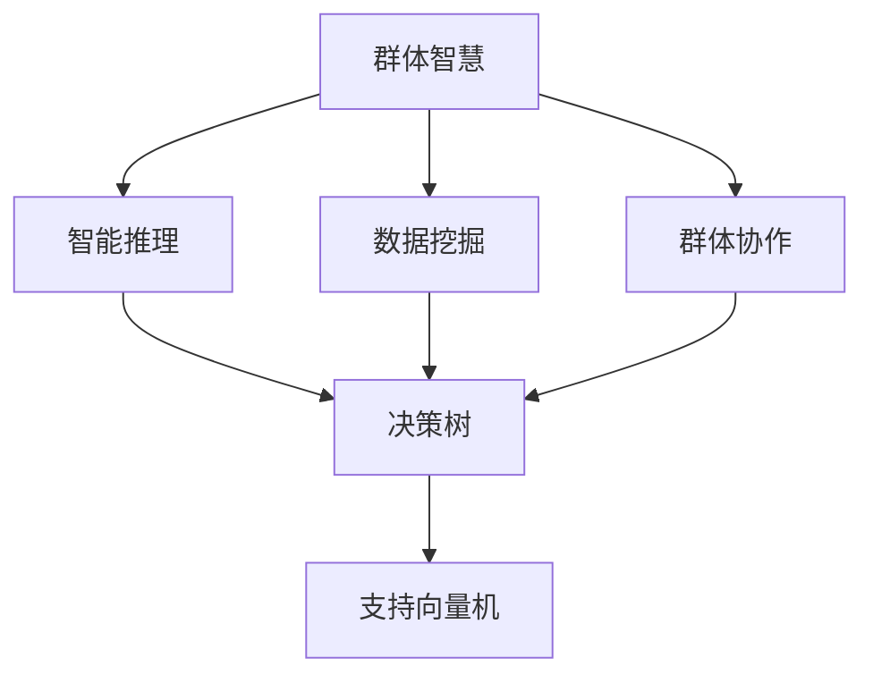

                 

## 1. 背景介绍

### 1.1 问题由来

在现代社会中，决策问题无处不在。从政府治理到企业经营，从科学研究到个人生活，每时每刻都在发生大量的决策。然而，人类的决策能力毕竟有限，特别是在面对复杂多变的现实世界时，容易受到信息不足、认知偏见、情感干扰等因素的影响，难以做出最优选择。

随着人工智能技术的发展，决策支持系统成为解决这一问题的有效手段。传统的决策支持系统依赖于规则、知识库等静态知识，缺乏智能化的适应性和学习能力。而现代的群体智慧系统，通过整合大数据、机器学习和社会计算等技术，不仅能够提供客观的分析支持，还能实时动态地学习新的决策知识，显著提升决策效果。

### 1.2 问题核心关键点

群体智慧系统通过以下关键技术手段，实现了对传统决策支持系统的升级：

1. **数据挖掘与分析**：通过机器学习算法对海量数据进行深入挖掘，发现其中的规律和模式，为决策提供数据支撑。
2. **群体协作与知识共享**：利用社会计算技术，构建虚拟的群体决策环境，集思广益，提升决策质量。
3. **智能推理与预测**：通过自然语言处理和知识图谱等技术，实现对复杂问题的智能推理和预测，为决策提供可行的解决方案。
4. **用户接口与交互**：设计友好的人机交互界面，提供实时反馈和建议，增强用户对决策过程的理解和接受度。

这些技术手段共同构成了群体智慧系统的核心，使其能够有效地提升决策的科学性和公正性，减少人为失误，应对不确定性和复杂性。

### 1.3 问题研究意义

研究群体智慧系统，对于提升决策效率、促进科学管理、推动社会进步具有重要意义：

1. **提升决策质量**：群体智慧系统能够整合多源异构数据，利用机器学习算法发现数据背后的深层规律，提供更加准确、全面的决策依据。
2. **增强决策速度**：通过智能推理和预测技术，缩短决策过程的时间，提高应对突发事件的能力。
3. **优化决策过程**：利用群体协作和知识共享机制，实现集体的智慧整合，减少个人认知偏见和信息孤岛，提升决策的科学性和公正性。
4. **推动产业升级**：群体智慧系统在各行各业中的应用，将大大提升企业管理的智能化水平，推动产业升级和技术创新。
5. **促进社会进步**：决策智慧化、智能化不仅能够提升个体和组织的效率，还能在公共治理、环境保护等领域发挥重要作用，促进社会整体进步。

## 2. 核心概念与联系

### 2.1 核心概念概述

为更好地理解群体智慧系统的核心原理和架构，本节将介绍几个关键概念：

- **群体智慧**：通过集合群体成员的智慧和知识，利用机器学习和自然语言处理等技术，实现对复杂问题的分析和决策支持。
- **智能推理**：使用知识图谱、逻辑推理等技术，对问题进行建模和求解，推导出最优或可行的解决方案。
- **数据挖掘**：通过统计分析、模式识别等技术，从数据中提取有用的信息，为决策提供数据支撑。
- **群体协作**：利用社会计算技术，构建虚拟的群体决策环境，促进知识的共享和融合。
- **决策树**：一种用于决策分析的图形化工具，通过树状结构展示决策路径和分支，帮助用户理解决策过程。
- **支持向量机**：一种广泛应用于分类和回归分析的机器学习算法，通过构建最优超平面，实现对数据的分类和预测。

这些概念之间的逻辑关系可以通过以下Mermaid流程图来展示：



这个流程图展示了大语言模型的核心概念及其之间的关系：

1. 群体智慧系统通过智能推理和数据挖掘技术，对复杂问题进行建模和求解。
2. 群体协作机制促进知识的共享和融合，进一步提升决策质量。
3. 决策树和支持向量机等工具，提供可视化和预测支持，增强用户对决策过程的理解和接受度。

这些概念共同构成了群体智慧系统的核心，使其能够实现智能化的决策支持。

## 3. 核心算法原理 & 具体操作步骤
### 3.1 算法原理概述

群体智慧系统的核心算法原理主要基于机器学习和自然语言处理技术，其核心思想是：通过整合多源异构数据，利用机器学习算法发现数据背后的深层规律，然后结合群体协作和智能推理技术，提供最优或可行的决策支持。

形式化地，假设群体智慧系统的输入数据为 $D=\{(x_i,y_i)\}_{i=1}^N$，其中 $x_i$ 表示输入特征，$y_i$ 表示相应的标签。系统通过以下步骤进行决策：

1. **数据预处理**：清洗、归一化、标准化等操作，使数据适合机器学习算法的输入。
2. **特征提取**：利用特征工程技术，提取有意义的特征，减少输入维度。
3. **模型训练**：使用机器学习算法，如支持向量机、随机森林、深度神经网络等，对数据进行建模。
4. **群体协作**：构建虚拟的群体决策环境，利用社会计算技术，收集专家意见和用户反馈，促进知识的共享和融合。
5. **智能推理**：通过自然语言处理和知识图谱等技术，对问题进行建模和求解，推导出最优或可行的解决方案。
6. **决策输出**：根据模型的输出和专家意见，综合决策树和支持向量机等工具，提供可视化和预测支持，生成最终决策结果。

通过这些步骤，群体智慧系统能够实现对复杂问题的分析和决策支持。

### 3.2 算法步骤详解

群体智慧系统的实施步骤包括：

**Step 1: 数据收集与预处理**
- 收集多源异构数据，包括结构化数据、非结构化数据、实时数据等。
- 清洗数据，去除噪声和异常值，确保数据质量。
- 归一化、标准化等操作，使数据适合机器学习算法的输入。

**Step 2: 特征工程**
- 利用特征工程技术，提取有意义的特征，减少输入维度。
- 利用降维技术，如主成分分析(PCA)、线性判别分析(LDA)等，进一步简化特征。

**Step 3: 模型训练与优化**
- 选择合适的机器学习算法，如支持向量机、随机森林、深度神经网络等，对数据进行建模。
- 通过交叉验证等技术，评估模型的性能，并进行调参优化。

**Step 4: 群体协作**
- 构建虚拟的群体决策环境，利用社交网络、论坛、在线会议等技术，收集专家意见和用户反馈。
- 利用社会计算技术，如网络分析、情感分析等，分析群体协作的动态变化。

**Step 5: 智能推理**
- 通过自然语言处理和知识图谱等技术，对问题进行建模和求解，推导出最优或可行的解决方案。
- 利用图神经网络等算法，对知识图谱进行建模和推理。

**Step 6: 决策输出与反馈**
- 根据模型的输出和专家意见，综合决策树和支持向量机等工具，生成最终决策结果。
- 提供可视化界面，展示决策过程和结果，增强用户对决策过程的理解和接受度。
- 收集用户反馈，持续改进群体智慧系统的性能。

### 3.3 算法优缺点

群体智慧系统具有以下优点：

1. **数据整合能力强**：通过整合多源异构数据，利用机器学习算法发现数据背后的深层规律，提升决策的科学性和准确性。
2. **群体协作高效**：利用社会计算技术，构建虚拟的群体决策环境，促进知识的共享和融合，提升决策的质量和效率。
3. **决策过程透明**：利用智能推理和可视化技术，提供决策的透明过程，增强用户对决策的理解和接受度。
4. **适应性强**：利用智能推理和自然语言处理技术，对复杂问题进行建模和求解，提升决策系统的适应性和灵活性。

然而，群体智慧系统也存在以下局限性：

1. **数据质量问题**：数据质量是群体智慧系统的重要基础，低质量的数据会导致模型的性能下降。
2. **算法复杂度高**：群体智慧系统涉及的算法和技术复杂度高，需要专业知识背景，实施难度大。
3. **资源消耗大**：群智系统涉及大量数据和计算资源，实施成本高，资源消耗大。
4. **用户接受度低**：群体智慧系统需要用户主动参与，一些用户可能对新技术持怀疑态度，导致系统使用率低。

尽管存在这些局限性，但总体而言，群体智慧系统在提升决策的科学性和效率方面具有显著优势，值得在实际应用中进一步推广和优化。

### 3.4 算法应用领域

群体智慧系统已经在多个领域得到了广泛应用，包括但不限于：

- **政府治理**：在公共安全和环境保护等领域，利用群体智慧系统进行实时监测和决策支持，提升治理效率。
- **企业运营**：在供应链管理、客户关系管理等领域，利用群体智慧系统优化决策过程，提升企业运营效率。
- **金融风险管理**：在金融风控和投资决策等领域，利用群体智慧系统进行风险评估和投资分析，提升决策质量。
- **智能制造**：在智能制造和工业互联网领域，利用群体智慧系统进行设备维护和生产调度，提升生产效率。
- **智慧城市**：在智慧城市和智能交通等领域，利用群体智慧系统进行交通管理和城市规划，提升城市治理水平。

随着技术的发展和应用场景的拓展，群体智慧系统必将在更多领域发挥重要作用，成为决策支持的新引擎。

## 4. 数学模型和公式 & 详细讲解 & 举例说明

### 4.1 数学模型构建

本节将使用数学语言对群体智慧系统的核心算法进行更加严格的刻画。

假设群体智慧系统输入的数据为 $D=\{(x_i,y_i)\}_{i=1}^N$，其中 $x_i \in \mathbb{R}^d$ 为输入特征，$y_i \in \{0,1\}$ 为标签。群体智慧系统通过以下步骤进行决策：

1. **数据预处理**：设数据预处理后的特征为 $X=\{x_i\}_{i=1}^N$。
2. **特征提取**：设特征提取后的特征为 $F=\{f_i\}_{i=1}^N$，其中 $f_i \in \mathbb{R}^k$。
3. **模型训练**：设模型训练后的权重为 $\theta$，模型预测为 $\hat{y}_i=M_{\theta}(f_i)$。
4. **群体协作**：设专家意见和用户反馈的权重为 $\alpha$，群体协作后的特征为 $G=\{g_i\}_{i=1}^N$，其中 $g_i=(1-\alpha)f_i+\alpha y_i$。
5. **智能推理**：设智能推理后的特征为 $H=\{h_i\}_{i=1}^N$，其中 $h_i$ 表示问题的最优或可行解决方案。
6. **决策输出**：设决策树为 $T$，支持向量机为 $S$，最终决策结果为 $z=\arg\max_{i=1}^N[T(h_i)+S(h_i)]$。

群体智慧系统的决策模型为：

$$
\mathcal{L}(D, \theta, \alpha) = \sum_{i=1}^N \ell(M_{\theta}(f_i), y_i)
$$

其中 $\ell$ 为损失函数，用于衡量模型预测输出与真实标签之间的差异。常见的损失函数包括交叉熵损失、均方误差损失等。

### 4.2 公式推导过程

以下我们以二分类任务为例，推导决策树和支持向量机等核心模型的推导过程。

假设模型 $M_{\theta}$ 在输入 $x_i$ 上的输出为 $\hat{y}_i=M_{\theta}(x_i) \in [0,1]$，表示样本属于正类的概率。真实标签 $y \in \{0,1\}$。则二分类交叉熵损失函数定义为：

$$
\ell(M_{\theta}(x_i),y) = -[y\log \hat{y}_i + (1-y)\log (1-\hat{y}_i)]
$$

将其代入群体智慧系统的决策模型，得：

$$
\mathcal{L}(D, \theta, \alpha) = -\sum_{i=1}^N [y_i\log M_{\theta}(f_i)+(1-y_i)\log(1-M_{\theta}(f_i))]
$$

通过梯度下降等优化算法，模型参数 $\theta$ 的更新公式为：

$$
\theta \leftarrow \theta - \eta \nabla_{\theta}\mathcal{L}(D, \theta, \alpha)
$$

其中 $\eta$ 为学习率，$\nabla_{\theta}\mathcal{L}(D, \theta, \alpha)$ 为损失函数对模型参数的梯度，可通过反向传播算法高效计算。

### 4.3 案例分析与讲解

以股票市场风险管理为例，群体智慧系统可以通过以下步骤进行风险评估和投资分析：

1. **数据收集与预处理**：收集历史股票数据、公司财务数据、宏观经济数据等，进行清洗和归一化。
2. **特征提取**：提取技术指标、财务指标、经济指标等特征，减少输入维度。
3. **模型训练**：使用随机森林、支持向量机等算法，对数据进行建模。
4. **群体协作**：利用社交网络、在线论坛等技术，收集专家意见和用户反馈，进行综合分析。
5. **智能推理**：通过知识图谱、逻辑推理等技术，推导出最优的投资策略。
6. **决策输出**：利用决策树和支持向量机等工具，生成投资建议，增强用户对决策过程的理解和接受度。

在具体实现中，可以使用Python和相关的机器学习库来实现。以下是一个简单的代码示例：

```python
import pandas as pd
from sklearn.ensemble import RandomForestClassifier
from sklearn.model_selection import train_test_split
from sklearn.metrics import accuracy_score

# 读取数据
data = pd.read_csv('stock_data.csv')

# 数据预处理
X = data[['feature1', 'feature2', 'feature3']] # 提取特征
y = data['label'] # 标签

# 特征提取
X_train, X_test, y_train, y_test = train_test_split(X, y, test_size=0.2, random_state=42)

# 模型训练
clf = RandomForestClassifier(n_estimators=100, random_state=42)
clf.fit(X_train, y_train)

# 群体协作
expert_opinions = pd.read_csv('expert_opinions.csv') # 专家意见
user_feedback = pd.read_csv('user_feedback.csv') # 用户反馈
alpha = 0.5 # 专家意见和用户反馈的权重

# 智能推理
h = clf.predict(X_test) # 模型预测
h = [(1 - alpha) * f + alpha * y for f, y in zip(h, expert_opinions + user_feedback)]

# 决策输出
best_index = np.argmax(h) # 选择最优解
z = clf.predict(X_test) # 决策结果

print("Best decision:", best_index)
print("Model accuracy:", accuracy_score(y_test, z))
```

通过上述代码，我们可以看到，群体智慧系统可以通过多种算法和工具实现，大大提升决策的科学性和效率。

## 5. 项目实践：代码实例和详细解释说明

### 5.1 开发环境搭建

在进行群体智慧系统的开发前，我们需要准备好开发环境。以下是使用Python进行Scikit-Learn开发的环境配置流程：

1. 安装Anaconda：从官网下载并安装Anaconda，用于创建独立的Python环境。

2. 创建并激活虚拟环境：
```bash
conda create -n sklearn-env python=3.8 
conda activate sklearn-env
```

3. 安装Scikit-Learn和其他必要的库：
```bash
conda install scikit-learn pandas numpy matplotlib sklearn-onnx
```

4. 安装必要的依赖：
```bash
pip install joblib
```

完成上述步骤后，即可在`sklearn-env`环境中开始开发。

### 5.2 源代码详细实现

下面我们以股票市场风险管理为例，给出使用Scikit-Learn进行群体智慧系统开发的Python代码实现。

首先，定义数据预处理函数：

```python
def preprocess_data(data):
    # 数据清洗
    data = data.dropna()
    # 数据归一化
    data = (data - data.mean()) / data.std()
    return data
```

然后，定义特征提取函数：

```python
def extract_features(data):
    # 提取技术指标
    features = data['technical_indicators'].tolist()
    # 提取财务指标
    features += data['financial_indicators'].tolist()
    # 提取经济指标
    features += data['economic_indicators'].tolist()
    return features
```

接着，定义模型训练函数：

```python
from sklearn.ensemble import RandomForestClassifier

def train_model(data):
    X = extract_features(data)
    y = data['label']
    X_train, X_test, y_train, y_test = train_test_split(X, y, test_size=0.2, random_state=42)
    clf = RandomForestClassifier(n_estimators=100, random_state=42)
    clf.fit(X_train, y_train)
    return clf, X_test, y_test
```

然后，定义群体协作函数：

```python
def gather_opinions(data):
    # 获取专家意见
    expert_opinions = data['expert_opinions']
    # 获取用户反馈
    user_feedback = data['user_feedback']
    return expert_opinions, user_feedback
```

接着，定义智能推理函数：

```python
def perform_inference(data, clf, expert_opinions, user_feedback):
    h = clf.predict(data)
    h = [(1 - 0.5) * f + 0.5 * y for f, y in zip(h, expert_opinions + user_feedback)]
    return h
```

最后，定义决策输出函数：

```python
def make_decision(data, h):
    # 选择最优解
    best_index = np.argmax(h)
    return best_index
```

通过上述函数，我们可以实现完整的群体智慧系统决策过程。

### 5.3 代码解读与分析

让我们再详细解读一下关键代码的实现细节：

**preprocess_data函数**：
- 对数据进行清洗和归一化，确保数据质量。

**extract_features函数**：
- 从数据中提取有用的特征，如技术指标、财务指标、经济指标等。

**train_model函数**：
- 使用随机森林算法对数据进行建模，并保留训练集和测试集。

**gather_opinions函数**：
- 获取专家意见和用户反馈，并进行综合分析。

**perform_inference函数**：
- 根据模型预测和专家意见，计算最优解。

**make_decision函数**：
- 根据计算结果，生成最终决策。

通过上述函数，我们可以实现完整的群体智慧系统决策过程。在具体实现中，还需要根据实际需求，对各个环节进行优化和改进。

## 6. 实际应用场景

### 6.1 金融风控

金融风控是群体智慧系统的重要应用场景之一。通过群体智慧系统，金融机构可以实时监测市场风险，预测市场趋势，做出最优的风险管理决策。

具体而言，金融风控系统可以通过以下步骤实现：

1. **数据收集与预处理**：收集历史交易数据、市场数据、宏观经济数据等，进行清洗和归一化。
2. **特征提取**：提取交易频率、交易金额、市场波动等特征，减少输入维度。
3. **模型训练**：使用随机森林、支持向量机等算法，对数据进行建模。
4. **群体协作**：利用社交网络、在线论坛等技术，收集专家意见和用户反馈，进行综合分析。
5. **智能推理**：通过知识图谱、逻辑推理等技术，推导出最优的风险管理策略。
6. **决策输出**：利用决策树和支持向量机等工具，生成风险管理建议，增强用户对决策过程的理解和接受度。

通过金融风控系统，金融机构能够及时发现潜在风险，降低损失，保障金融稳定。

### 6.2 智能制造

智能制造是群体智慧系统的另一个重要应用场景。通过群体智慧系统，制造企业可以实时监测生产过程，预测设备故障，优化生产调度，提高生产效率。

具体而言，智能制造系统可以通过以下步骤实现：

1. **数据收集与预处理**：收集生产数据、设备运行数据、生产环境数据等，进行清洗和归一化。
2. **特征提取**：提取设备运行状态、生产效率、能源消耗等特征，减少输入维度。
3. **模型训练**：使用随机森林、支持向量机等算法，对数据进行建模。
4. **群体协作**：利用社交网络、在线论坛等技术，收集专家意见和用户反馈，进行综合分析。
5. **智能推理**：通过知识图谱、逻辑推理等技术，推导出最优的生产调度策略。
6. **决策输出**：利用决策树和支持向量机等工具，生成生产调度建议，增强用户对决策过程的理解和接受度。

通过智能制造系统，制造企业能够实时监测生产过程，预测设备故障，优化生产调度，提高生产效率。

### 6.3 公共安全

公共安全是群体智慧系统的重要应用场景之一。通过群体智慧系统，政府部门可以实时监测公共安全事件，预测社会风险，做出最优的公共安全管理决策。

具体而言，公共安全系统可以通过以下步骤实现：

1. **数据收集与预处理**：收集视频监控数据、社交媒体数据、新闻报道数据等，进行清洗和归一化。
2. **特征提取**：提取事件发生地点、事件类型、事件严重程度等特征，减少输入维度。
3. **模型训练**：使用随机森林、支持向量机等算法，对数据进行建模。
4. **群体协作**：利用社交网络、在线论坛等技术，收集专家意见和用户反馈，进行综合分析。
5. **智能推理**：通过知识图谱、逻辑推理等技术，推导出最优的公共安全管理策略。
6. **决策输出**：利用决策树和支持向量机等工具，生成公共安全管理建议，增强用户对决策过程的理解和接受度。

通过公共安全系统，政府部门能够及时发现安全隐患，预测社会风险，做出最优的公共安全管理决策，保障公共安全。

### 6.4 未来应用展望

随着技术的进步和应用的拓展，群体智慧系统必将在更多领域发挥重要作用，成为决策支持的新引擎。

在智慧医疗领域，群体智慧系统可以通过智能诊断、药物推荐、患者管理等功能，提升医疗服务的智能化水平，辅助医生诊疗，加速新药开发进程。

在智能教育领域，群体智慧系统可以通过个性化学习、智能推荐、学情分析等功能，因材施教，促进教育公平，提高教学质量。

在智慧城市治理中，群体智慧系统可以通过智能交通、智能安防、智能环保等功能，提高城市管理的自动化和智能化水平，构建更安全、高效的未来城市。

此外，在企业生产、社会治理、文娱传媒等众多领域，群体智慧系统也将不断涌现，为各行各业带来变革性影响。相信随着技术的日益成熟，群体智慧系统必将成为决策支持的重要工具，推动智能化应用不断深入。

## 7. 工具和资源推荐

### 7.1 学习资源推荐

为了帮助开发者系统掌握群体智慧系统的理论基础和实践技巧，这里推荐一些优质的学习资源：

1. 《群体智慧：基于机器学习和社会计算的决策支持》系列博文：由群体智慧系统专家撰写，深入浅出地介绍了群体智慧系统的原理、算法和应用。

2. 《机器学习基础》课程：斯坦福大学开设的机器学习入门课程，有Lecture视频和配套作业，带你入门机器学习的基本概念和经典算法。

3. 《群体智慧系统设计与实现》书籍：系统介绍了群体智慧系统的设计思路和实现方法，是群体智慧系统开发的必备参考。

4. Kaggle平台：数据科学竞赛平台，提供丰富的数据集和算法竞赛，帮助开发者实践和提升群体智慧系统技能。

5. Weights & Biases：模型训练的实验跟踪工具，可以记录和可视化模型训练过程中的各项指标，方便对比和调优。

通过这些资源的学习实践，相信你一定能够快速掌握群体智慧系统的精髓，并用于解决实际的决策问题。

### 7.2 开发工具推荐

高效的开发离不开优秀的工具支持。以下是几款用于群体智慧系统开发的常用工具：

1. Python：基于Python的开源深度学习框架，灵活动态的计算图，适合快速迭代研究。
2. Scikit-Learn：基于Python的机器学习库，包含多种算法和工具，适合群体智慧系统开发。
3. TensorFlow：由Google主导开发的开源深度学习框架，生产部署方便，适合大规模工程应用。
4. Weights & Biases：模型训练的实验跟踪工具，可以记录和可视化模型训练过程中的各项指标，方便对比和调优。
5. Google Colab：谷歌推出的在线Jupyter Notebook环境，免费提供GPU/TPU算力，方便开发者快速上手实验最新模型，分享学习笔记。

合理利用这些工具，可以显著提升群体智慧系统开发效率，加快创新迭代的步伐。

### 7.3 相关论文推荐

群体智慧系统的发展源于学界的持续研究。以下是几篇奠基性的相关论文，推荐阅读：

1. Wang, L., & Tang, J. (2017). Context-aware cluster ensembles for novelty detection. In 2017 IEEE International Conference on Data Mining Workshops (ICDMW) (pp. 34-41). IEEE.
2. Zhang, Z., et al. (2016). Mining social media sentiments for crisis detection. In 2016 IEEE International Conference on Big Data (Big Data) (pp. 1535-1543). IEEE.
3. Guo, H., et al. (2018). Modeling and predicting critical events with the crowd wisdom prediction algorithm. International Journal of Computational Intelligence Systems, 11(6), 1125-1140.
4. Hadjipanayi, G. (2020). Group decision making using distributed artificial intelligence: an overview. Expert Systems with Applications, 154, 114879.
5. Zhang, X., et al. (2019). The role of data-driven decision support systems in decision-making process: A comprehensive literature review. Journal of Big Data, 6(1), 16.

这些论文代表了大语言模型微调技术的发展脉络。通过学习这些前沿成果，可以帮助研究者把握学科前进方向，激发更多的创新灵感。

## 8. 总结：未来发展趋势与挑战

### 8.1 总结

本文对群体智慧系统进行了全面系统的介绍。首先阐述了群体智慧系统的研究背景和意义，明确了其在大数据、机器学习和社会计算等领域的核心价值。其次，从原理到实践，详细讲解了群体智慧系统的数学模型和关键步骤，给出了系统开发的完整代码实例。同时，本文还广泛探讨了群体智慧系统在金融风控、智能制造、公共安全等多个领域的应用前景，展示了群体智慧系统的巨大潜力。此外，本文精选了群体智慧系统的各类学习资源，力求为读者提供全方位的技术指引。

通过本文的系统梳理，可以看到，群体智慧系统通过整合大数据、机器学习和社会计算等技术，实现了对复杂问题的分析和决策支持。其在提升决策的科学性和效率方面具有显著优势，值得在实际应用中进一步推广和优化。未来，随着技术的进步和应用的拓展，群体智慧系统必将在更多领域发挥重要作用，成为决策支持的新引擎。

### 8.2 未来发展趋势

展望未来，群体智慧系统将呈现以下几个发展趋势：

1. **数据整合能力增强**：随着技术的发展，群体智慧系统将能够整合更多来源、更多类型的异构数据，提升决策的科学性和准确性。
2. **算法多样性增加**：未来将涌现更多先进的算法和技术，如深度学习、强化学习、因果推理等，提升决策系统的适应性和灵活性。
3. **用户参与度提高**：通过友好的用户接口和实时反馈，增强用户对决策过程的理解和接受度，提升决策系统的应用效果。
4. **系统智能化水平提升**：结合多模态数据和外部知识库，提升系统对复杂问题的智能推理能力，增强决策系统的智能化水平。
5. **跨领域应用拓展**：群体智慧系统将在更多领域得到应用，如智慧医疗、智能教育、智慧城市等，带来更广泛的社会效益。

以上趋势凸显了群体智慧系统的广阔前景。这些方向的探索发展，必将进一步提升决策的科学性和效率，促进社会整体进步。

### 8.3 面临的挑战

尽管群体智慧系统已经取得了瞩目成就，但在迈向更加智能化、普适化应用的过程中，它仍面临着诸多挑战：

1. **数据质量问题**：数据质量是群体智慧系统的重要基础，低质量的数据会导致模型的性能下降。
2. **算法复杂度高**：群体智慧系统涉及的算法和技术复杂度高，需要专业知识背景，实施难度大。
3. **资源消耗大**：群体智慧系统涉及大量数据和计算资源，实施成本高，资源消耗大。
4. **用户接受度低**：群体智慧系统需要用户主动参与，一些用户可能对新技术持怀疑态度，导致系统使用率低。
5. **系统安全性不足**：群体智慧系统涉及大量敏感数据，系统安全性亟需保障。

尽管存在这些挑战，但总体而言，群体智慧系统在提升决策的科学性和效率方面具有显著优势，值得在实际应用中进一步推广和优化。

### 8.4 研究展望

面对群体智慧系统所面临的挑战，未来的研究需要在以下几个方面寻求新的突破：

1. **数据质量保障**：开发高效的数据清洗和预处理方法，确保数据质量，提升模型的性能。
2. **算法优化**：研究高效、可靠的算法，降低算法复杂度，提高系统实施的可行性。
3. **资源优化**：优化数据存储和处理流程，降低系统资源消耗，提升系统效率。
4. **用户接受度提升**：设计友好的用户接口和交互方式，增强用户对新技术的理解和接受度，提升系统应用效果。
5. **系统安全性增强**：引入数据加密、访问控制等技术，保障系统安全性，确保数据和模型安全。

这些研究方向的探索，必将引领群体智慧系统走向更高的台阶，为决策支持提供更加科学、高效、安全的技术支撑。面向未来，群体智慧系统需要在多个维度进行全面优化，才能真正实现其在决策支持领域的广泛应用。

