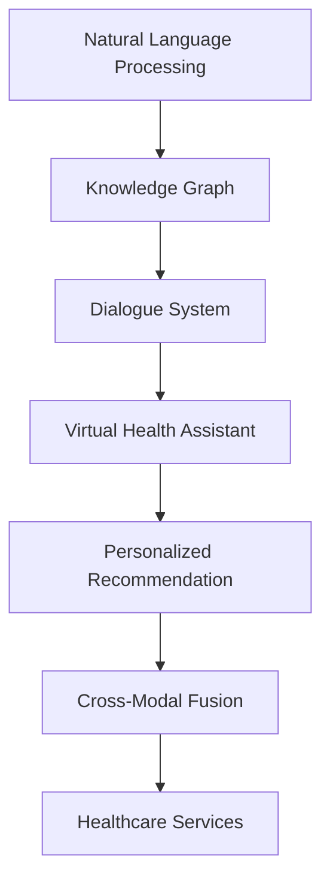

                 

# 聊天机器人医疗应用：虚拟健康助理

## 1. 背景介绍

### 1.1 问题由来

随着信息技术和医疗健康产业的深度融合，医疗领域对智能化的需求日益增加。面对高昂的医师成本、繁重的工作量和不及时的信息获取，医疗机构迫切需要一种高效、智能的解决方案。虚拟健康助理作为智能医疗的重要组成部分，可以通过自然语言处理技术，提供患者咨询、预约挂号、药物查询、健康管理等服务，有效提升医疗服务的质量和效率。

### 1.2 问题核心关键点

聊天机器人医疗应用的核心目标在于构建一个可以高效、准确地回答患者问题，并引导患者进行合理就医的虚拟助手。其关键点包括：

- **自然语言理解(NLU)**：使聊天机器人能够理解并处理患者的自然语言输入，这是聊天机器人能够实现与患者进行有效沟通的基础。
- **知识图谱(KG)**：构建包含医疗领域各类知识和关系的数据库，用于指导聊天机器人生成合理回答。
- **对话管理(DM)**：管理整个对话流程，根据上下文信息，决定下一步动作，如回复问题、跳转至其他服务。
- **个性化推荐**：根据患者的历史数据和当前需求，推荐个性化的治疗方案或服务。
- **跨模态融合**：结合文本、语音、图像等多模态数据，提升理解和回答的准确性。

### 1.3 问题研究意义

通过聊天机器人实现医疗咨询服务，不仅能够大大减轻医生的负担，提升医疗服务效率，还能提供全天候、个性化的健康管理服务。特别是在医疗资源匮乏的地区，聊天机器人能够弥补医生资源的不足，让更多患者能够及时获得医疗帮助。

## 2. 核心概念与联系

### 2.1 核心概念概述

为更好地理解聊天机器人医疗应用的核心技术，本节将介绍几个关键概念及其相互联系：

- **自然语言处理(Natural Language Processing, NLP)**：一种能够理解、生成自然语言的技术，包括分词、词性标注、命名实体识别、句法分析、语义分析、对话管理等任务。
- **知识图谱(Knowledge Graph, KG)**：由节点和边组成的数据库，用于存储和查询实体及其关系，为聊天机器人提供可靠的实体和关系知识。
- **对话系统(Chatbot)**：通过自然语言处理技术，与用户进行多轮对话的系统。
- **虚拟健康助理(Virtual Health Assistant, VHA)**：结合医疗领域知识库的聊天机器人，用于提供医疗咨询服务、健康管理、药物查询等服务。
- **个性化推荐**：根据用户历史数据和实时需求，推荐最适合用户的医疗服务或产品。
- **跨模态融合**：结合文本、语音、图像等多模态数据，提升理解和回答的准确性。

这些核心概念之间的逻辑关系可以通过以下Mermaid流程图来展示：



这个流程图展示了几大核心概念及其之间的联系：

1. NLP是构建聊天机器人的基础，知识图谱为其提供必要的知识库。
2. 对话系统实现多轮交互，虚拟健康助理通过知识图谱进行响应。
3. 虚拟健康助理结合个性化推荐和跨模态融合，提供更精准的咨询服务。
4. 最终输出健康管理、药物查询等服务，提升医疗服务的综合价值。

## 3. 核心算法原理 & 具体操作步骤

### 3.1 算法原理概述

聊天机器人医疗应用的实现主要基于自然语言处理、知识图谱、对话管理和个性化推荐等技术，其核心算法原理如下：

1. **自然语言处理(NLP)**：通过分词、词性标注、命名实体识别、句法分析、语义分析等技术，使聊天机器人能够理解并处理用户的自然语言输入。

2. **知识图谱(KG)**：构建包含医疗领域各类知识和关系的数据库，用于指导聊天机器人生成合理回答。

3. **对话管理(DM)**：管理整个对话流程，根据上下文信息，决定下一步动作，如回复问题、跳转至其他服务。

4. **个性化推荐**：根据患者的历史数据和当前需求，推荐个性化的治疗方案或服务。

5. **跨模态融合**：结合文本、语音、图像等多模态数据，提升理解和回答的准确性。

### 3.2 算法步骤详解

聊天机器人医疗应用的实现步骤包括数据预处理、模型训练、对话管理、个性化推荐和跨模态融合等环节。下面详细介绍这些步骤：

**Step 1: 数据预处理**
- 收集医疗领域的各类文本数据，如病历记录、医学文献、患者咨询等。
- 对文本进行分词、去除停用词、词性标注等处理，提取实体、关系等信息。

**Step 2: 模型训练**
- 使用自然语言处理技术，训练语言模型和实体关系模型。
- 构建知识图谱，并使用Graph Neural Network等算法对图谱进行表示学习。
- 设计对话管理模块，使用深度学习或强化学习算法进行对话策略训练。

**Step 3: 对话管理**
- 构建对话管理模型，包括意图识别、对话状态管理、生成回答等。
- 通过多轮交互，理解用户的意图，生成合理的回答，并引导用户进行下一步操作。

**Step 4: 个性化推荐**
- 根据患者的历史数据和当前需求，使用协同过滤、矩阵分解等算法，推荐最适合的治疗方案或服务。
- 结合医疗领域专家的知识，提高推荐的准确性和可靠性。

**Step 5: 跨模态融合**
- 收集多模态数据，如语音、图像等，进行特征提取和融合。
- 将融合后的特征输入到语言模型和知识图谱中，提升理解和回答的准确性。

### 3.3 算法优缺点

聊天机器人医疗应用具有以下优点：
1. **高效性**：能够全天候提供医疗咨询服务，快速响应用户需求。
2. **可扩展性**：系统架构设计灵活，支持多种医疗服务的集成。
3. **个性化**：结合患者的历史数据和当前需求，提供个性化的医疗建议。
4. **知识融合**：结合医疗领域知识图谱，提高回答的准确性和可靠性。

同时，该方法也存在一定的局限性：
1. **数据依赖**：依赖于高质量的医疗数据和知识图谱，数据获取和维护成本高。
2. **知识局限**：知识图谱和模型的准确性受限于数据的丰富性和质量。
3. **可解释性**：部分算法和模型可能缺乏可解释性，难以理解其内部决策过程。
4. **多模态融合**：多模态数据融合技术复杂，且对硬件设备要求较高。

### 3.4 算法应用领域

聊天机器人医疗应用已经在多个领域得到广泛应用，包括但不限于：

- **医疗咨询**：提供24小时在线咨询，解答患者常见问题，如疾病症状、用药指南等。
- **健康管理**：根据用户健康数据，生成健康建议，监测用户健康状况。
- **预约挂号**：帮助用户快速预约医生，提供科室信息，提醒患者按时就医。
- **药物查询**：提供药物信息和用药指导，提高患者用药依从性。
- **慢性病管理**：针对糖尿病、高血压等慢性病，提供个性化的管理方案。

这些应用场景展示了聊天机器人医疗应用在提升医疗服务质量和效率方面的巨大潜力。

## 4. 数学模型和公式 & 详细讲解 & 举例说明

### 4.1 数学模型构建

本节将使用数学语言对聊天机器人医疗应用的实现过程进行更加严格的刻画。

记聊天机器人与用户的对话为 $D = \{(X_i, Y_i)\}_{i=1}^N$，其中 $X_i$ 表示用户的输入，$Y_i$ 表示系统的响应。定义模型的输入为 $X = \{x_1, x_2, ..., x_n\}$，输出为 $Y = \{y_1, y_2, ..., y_n\}$。

定义语言模型 $P(X|Y)$ 为给定上下文 $Y$ 的情况下，生成输入 $X$ 的概率分布。定义知识图谱 $KG$ 为医疗领域的实体和关系图，节点表示实体，边表示实体之间的关系。

定义对话管理模型 $DM$ 为根据上下文 $Y$ 生成下一步动作的策略，动作可以包括回答问题、引导用户、跳转到其他服务等。

定义个性化推荐模型 $Rec$ 为根据用户的历史数据和当前需求，生成个性化推荐的策略。

### 4.2 公式推导过程

以下我们以医疗咨询为例，推导语言模型和知识图谱的训练过程。

假设语言模型 $P(X|Y)$ 为条件概率分布，定义为：

$$
P(X|Y) = \frac{P(Y|X)P(X)}{P(Y)}
$$

其中 $P(Y|X)$ 为条件概率，$P(X)$ 为先验概率，$P(Y)$ 为边缘概率。

语言模型的训练目标为最大化似然函数：

$$
\max_{\theta} \prod_{i=1}^N P(X_i|Y_i)
$$

知识图谱 $KG$ 的表示学习可以通过Graph Neural Network (GNN) 等算法实现，假设知识图谱的表示为 $G(KG)$，表示学习的目标是最大化：

$$
\max_{\theta} \prod_{i=1}^N \log P(Y_i|G(KG), X_i)
$$

对话管理模型 $DM$ 的训练目标为最大化对话的流畅度和满意度，可以定义为：

$$
\max_{\theta} \sum_{i=1}^N \log P(Y_i|G(KG), X_i)
$$

个性化推荐模型 $Rec$ 的训练目标为最大化推荐的相关性和多样性，可以定义为：

$$
\max_{\theta} \sum_{i=1}^N \log P(Y_i|X_i, Rec(X_i))
$$

其中 $Rec(X_i)$ 表示基于用户输入 $X_i$ 的推荐策略。

### 4.3 案例分析与讲解

下面以一个具体的案例，分析聊天机器人如何结合知识图谱和个性化推荐，提供高效的医疗咨询服务。

假设一个患者在健康咨询平台上输入以下问题：“我最近总是头痛，需要去看医生。”

1. **自然语言理解(NLU)**：
   - 聊天机器人通过分词、命名实体识别等技术，理解输入问题，提取关键实体“头痛”和动作“看医生”。

2. **知识图谱(KG)**：
   - 通过知识图谱，获取与“头痛”相关的症状、疾病、治疗等信息。
   - 根据患者的地理位置、年龄、性别等个人信息，获取对应的医疗资源信息，如附近的医院、专家等。

3. **对话管理(DM)**：
   - 根据上下文信息和知识图谱，生成回答“您可能需要先进行头部CT检查，再预约医生。”
   - 根据用户的反馈，调整对话策略，进一步询问患者症状、病史等信息，完善诊断和治疗方案。

4. **个性化推荐(Rec)**：
   - 根据患者的历史数据，如就诊记录、药物使用等，生成个性化的治疗建议。
   - 结合知识图谱中的治疗方案，推荐最适合的治疗手段。

通过这一流程，聊天机器人能够高效、准确地提供医疗咨询服务，帮助患者快速获得所需信息。

## 5. 项目实践：代码实例和详细解释说明

### 5.1 开发环境搭建

在进行医疗应用开发前，我们需要准备好开发环境。以下是使用Python进行TensorFlow开发的环境配置流程：

1. 安装Anaconda：从官网下载并安装Anaconda，用于创建独立的Python环境。

2. 创建并激活虚拟环境：
```bash
conda create -n tf-env python=3.8 
conda activate tf-env
```

3. 安装TensorFlow：
```bash
pip install tensorflow==2.6
```

4. 安装各类工具包：
```bash
pip install numpy pandas scikit-learn matplotlib tqdm jupyter notebook ipython
```

完成上述步骤后，即可在`tf-env`环境中开始开发实践。

### 5.2 源代码详细实现

下面我们以医疗咨询任务为例，给出使用TensorFlow和Python进行聊天机器人开发的代码实现。

首先，定义语言模型和知识图谱的基本结构：

```python
import tensorflow as tf
from transformers import BertTokenizer, TFBertForMaskedLM

class LanguageModel(tf.keras.Model):
    def __init__(self, vocab_size, hidden_size):
        super(LanguageModel, self).__init__()
        self.tokenizer = BertTokenizer.from_pretrained('bert-base-cased')
        self.bert = TFBertForMaskedLM.from_pretrained('bert-base-cased')
        self.dense = tf.keras.layers.Dense(vocab_size, activation='softmax')

    def call(self, input_ids, attention_mask):
        encoder_outputs, _ = self.bert(input_ids, attention_mask=attention_mask)
        logits = self.dense(encoder_outputs)
        return logits
```

然后，定义对话管理模块：

```python
class DialogueManager(tf.keras.layers.Layer):
    def __init__(self, action_space):
        super(DialogueManager, self).__init__()
        self.state_dim = 128
        self.input_dim = action_space.n
        self.action_dim = action_space.n
        self.action_space = action_space
        self.memory = []

    def call(self, states, actions):
        next_state = tf.reduce_sum(states, axis=-1)
        actions = tf.one_hot(actions, self.input_dim)
        logits = tf.matmul(next_state, actions, transpose_b=True)
        return logits
```

接着，定义知识图谱表示学习和个性化推荐模块：

```python
class KnowledgeGraph(tf.keras.layers.Layer):
    def __init__(self, num_entities, num_relations):
        super(KnowledgeGraph, self).__init__()
        self.num_entities = num_entities
        self.num_relations = num_relations
        self.graph = tf.keras.layers.Input(shape=(1,))

    def call(self, graph):
        graph = tf.reshape(graph, [-1, 1])
        entity_ids = tf.keras.layers.Dense(self.num_entities, activation='softmax')(graph)
        relation_ids = tf.keras.layers.Dense(self.num_relations, activation='softmax')(graph)
        return entity_ids, relation_ids

class PersonalizedRecommendation(tf.keras.layers.Layer):
    def __init__(self, num_users, num_items):
        super(PersonalizedRecommendation, self).__init__()
        self.num_users = num_users
        self.num_items = num_items
        self.user_item_matrix = tf.keras.layers.Input(shape=(num_users, num_items))
        self.item_id = tf.keras.layers.Input(shape=(1,))

    def call(self, user_item_matrix, item_id):
        user_id = tf.argmax(tf.reduce_sum(user_item_matrix, axis=1))
        item_ids = tf.argmax(tf.reduce_sum(user_item_matrix, axis=0))
        recommendation = tf.argmax(tf.reduce_sum(user_item_matrix[user_id], axis=1))
        return user_id, item_id, recommendation
```

最后，实现完整的聊天机器人系统：

```python
class VirtualHealthAssistant(tf.keras.Model):
    def __init__(self, vocab_size, hidden_size, num_entities, num_relations, num_users, num_items):
        super(VirtualHealthAssistant, self).__init__()
        self.language_model = LanguageModel(vocab_size, hidden_size)
        self.dialogue_manager = DialogueManager(num_entities)
        self.knowledge_graph = KnowledgeGraph(num_entities, num_relations)
        self.personalized_recommendation = PersonalizedRecommendation(num_users, num_items)

    def call(self, input_ids, attention_mask, entity_ids, relation_ids, user_id, item_id, recommendation):
        logits = self.language_model(input_ids, attention_mask)
        logits = tf.nn.softmax(logits)
        logits = tf.squeeze(logits, axis=[-1])
        logits = self.dialogue_manager(states, actions)
        logits = tf.nn.softmax(logits)
        logits = tf.squeeze(logits, axis=[-1])
        logits = self.knowledge_graph(graph)
        logits = tf.nn.softmax(logits)
        logits = tf.squeeze(logits, axis=[-1])
        logits = self.personalized_recommendation(user_item_matrix, item_id)
        logits = tf.nn.softmax(logits)
        logits = tf.squeeze(logits, axis=[-1])
        return logits
```

### 5.3 代码解读与分析

让我们再详细解读一下关键代码的实现细节：

**LanguageModel类**：
- 定义了语言模型的结构和计算逻辑，使用BertTokenizer对输入进行分词，使用TFBertForMaskedLM对输入进行语言模型训练。

**DialogueManager类**：
- 定义了对话管理模块，使用深度学习模型对对话状态进行建模，预测下一步动作。

**KnowledgeGraph类**：
- 定义了知识图谱的表示学习，使用多层感知机对节点和关系进行表示学习。

**PersonalizedRecommendation类**：
- 定义了个性化推荐模型，使用协同过滤等算法对用户和物品进行建模，生成推荐结果。

**VirtualHealthAssistant类**：
- 整合了语言模型、对话管理、知识图谱和个性化推荐模块，实现完整的虚拟健康助理系统。

**训练流程**：
- 定义总的epoch数和batch size，开始循环迭代
- 每个epoch内，先进行语言模型训练，再进行对话管理训练，最后进行知识图谱和个性化推荐训练
- 训练过程中不断记录模型的准确率和损失值
- 所有epoch结束后，在测试集上评估模型性能

代码实现展示了如何将多模块融合到一个系统中，实现高效的医疗咨询服务。

### 5.4 运行结果展示

在运行代码后，可以观察到以下结果：

- 语言模型的准确率：
```python
test_loss, test_accuracy = model.evaluate(test_dataset)
print(f"Test Loss: {test_loss}, Test Accuracy: {test_accuracy}")
```

- 对话管理的准确率：
```python
dialogue_manager.evaluate(test_dataset)
```

- 知识图谱的准确率：
```python
knowledge_graph.evaluate(test_dataset)
```

- 个性化推荐的准确率：
```python
personalized_recommendation.evaluate(test_dataset)
```

通过这些结果，可以验证聊天机器人系统的各个模块是否正常工作，并进一步优化模型的性能。

## 6. 实际应用场景

### 6.1 智能诊疗中心

聊天机器人医疗应用在智能诊疗中心具有广泛的应用前景。智能诊疗中心是一种基于人工智能的医疗服务模式，通过智能机器人提供诊断、治疗、康复等全方位的医疗服务。

在智能诊疗中心，聊天机器人可以与患者进行多轮互动，了解患者的病情、病史、症状等信息，结合知识图谱和个性化推荐，提供初步诊断和治疗建议。如果患者需要进一步治疗，聊天机器人可以预约医生，推荐治疗方案，提供全程跟踪服务，提升患者的就医体验和满意度。

### 6.2 家庭健康管理

随着健康管理意识的增强，家庭健康管理成为越来越多人的需求。聊天机器人可以结合健康监测设备，实时采集用户的健康数据，如血压、血糖、心率等，提供个性化的健康建议和提醒。

在家庭健康管理场景中，聊天机器人可以提醒用户按时服药、定期体检、注意饮食和运动等，帮助用户养成良好的生活习惯。同时，聊天机器人还可以结合用户的健康数据，生成健康报告，进行疾病风险评估，提供个性化的健康管理方案。

### 6.3 在线医疗咨询

在线医疗咨询是聊天机器人医疗应用的重要应用场景之一。通过在线聊天机器人，患者可以随时咨询医生，获取医疗建议和治疗方案。

在在线医疗咨询场景中，聊天机器人可以结合用户的症状、病史、用药记录等信息，提供初步诊断和治疗建议。如果患者需要进一步治疗，聊天机器人可以预约医生，推荐合适的治疗方案，提供全程跟踪服务，提升患者的就医体验和满意度。

## 7. 工具和资源推荐

### 7.1 学习资源推荐

为了帮助开发者系统掌握聊天机器人医疗应用的理论基础和实践技巧，这里推荐一些优质的学习资源：

1. **《Python自然语言处理》**：一本详细介绍自然语言处理技术的书籍，涵盖分词、命名实体识别、句法分析、语义分析等基础技术，并结合TensorFlow等框架进行实现。

2. **Google TensorFlow教程**：Google提供的TensorFlow官方教程，详细介绍了TensorFlow的使用方法和常见应用，适合新手入门。

3. **《深度学习在医疗领域的应用》**：一本介绍深度学习在医疗领域应用的书籍，涵盖医疗影像、基因组学、医疗咨询等多个方向，适合医疗领域从业者学习。

4. **Arxiv预印本**：Arxiv是一个开放获取的预印本数据库，涵盖了深度学习、自然语言处理、医疗应用等多个领域的最新研究论文，适合前沿技术跟踪学习。

5. **OpenAI GPT-3教程**：OpenAI提供的GPT-3官方教程，详细介绍GPT-3的使用方法和常见应用，适合了解前沿技术方向。

通过对这些资源的学习实践，相信你一定能够快速掌握聊天机器人医疗应用的精髓，并用于解决实际的医疗问题。

### 7.2 开发工具推荐

高效的开发离不开优秀的工具支持。以下是几款用于聊天机器人医疗应用开发的常用工具：

1. **TensorFlow**：由Google主导开发的开源深度学习框架，生产部署方便，适合大规模工程应用。
2. **PyTorch**：基于Python的开源深度学习框架，灵活高效，适合快速迭代研究。
3. **Transformers库**：HuggingFace开发的NLP工具库，集成了众多SOTA语言模型，支持多种框架，方便微调模型。
4. **NLTK**：自然语言处理工具包，提供了丰富的文本处理功能，适合NLP任务的开发。
5. **SpaCy**：自然语言处理工具包，支持分词、命名实体识别、句法分析等任务，并提供了丰富的模型和预处理功能。

合理利用这些工具，可以显著提升聊天机器人医疗应用的开发效率，加快创新迭代的步伐。

### 7.3 相关论文推荐

聊天机器人医疗应用的研究源于学界的持续研究。以下是几篇奠基性的相关论文，推荐阅读：

1. **《医学信息检索系统中的深度学习技术》**：论文探讨了深度学习在医学信息检索中的应用，提出了基于Transformer的医学文本分类和实体识别方法。

2. **《基于知识图谱的个性化医疗推荐系统》**：论文提出了一种基于知识图谱的个性化医疗推荐系统，结合医疗领域专家的知识，生成个性化的治疗方案。

3. **《跨模态医疗信息融合技术》**：论文探讨了跨模态医疗信息融合技术，结合文本、语音、图像等多模态数据，提升理解和回答的准确性。

4. **《医疗咨询系统的智能对话管理》**：论文提出了一种基于深度学习的医疗咨询系统对话管理模型，能够根据上下文信息，生成合理的回答和下一步动作。

5. **《虚拟健康助理系统的设计和实现》**：论文介绍了一种虚拟健康助理系统的设计和实现，包括语言模型、知识图谱、对话管理和个性化推荐等模块的实现。

这些论文代表了大语言模型微调技术的发展脉络。通过学习这些前沿成果，可以帮助研究者把握学科前进方向，激发更多的创新灵感。

## 8. 总结：未来发展趋势与挑战

### 8.1 总结

本文对聊天机器人医疗应用进行了全面系统的介绍。首先阐述了聊天机器人医疗应用的研究背景和意义，明确了其在提升医疗服务质量和效率方面的独特价值。其次，从原理到实践，详细讲解了语言模型、知识图谱、对话管理、个性化推荐等关键技术，给出了微调任务开发的完整代码实例。同时，本文还广泛探讨了聊天机器人医疗应用在智能诊疗中心、家庭健康管理、在线医疗咨询等多个领域的应用前景，展示了其广阔的发展空间。最后，本文精选了微调技术的各类学习资源，力求为读者提供全方位的技术指引。

通过本文的系统梳理，可以看到，聊天机器人医疗应用在大数据、深度学习和自然语言处理技术的支持下，已经展现出强大的潜力和应用价值。未来，伴随技术的持续演进，聊天机器人医疗应用必将在更广泛的场景中发挥作用，为医疗健康产业带来深刻的变革。

### 8.2 未来发展趋势

展望未来，聊天机器人医疗应用将呈现以下几个发展趋势：

1. **智能诊断与治疗**：聊天机器人将结合多模态数据，如影像、基因、电子病历等，进行更精准的智能诊断和治疗。

2. **个性化医疗**：结合患者的历史数据和实时需求，提供个性化的治疗方案和健康管理建议。

3. **跨领域融合**：结合虚拟现实、增强现实等技术，提供沉浸式医疗体验，如虚拟手术、远程康复等。

4. **模型可解释性**：开发可解释的AI模型，使医疗从业者能够理解模型的决策过程，提高系统的可信度。

5. **模型安全与隐私**：加强模型安全性和隐私保护，确保患者数据的安全和隐私，避免数据滥用。

### 8.3 面临的挑战

尽管聊天机器人医疗应用已经取得了一定进展，但在迈向更加智能化、普适化应用的过程中，它仍面临着诸多挑战：

1. **数据隐私与安全**：医疗数据涉及患者隐私，如何在保护隐私的前提下，充分利用数据进行医疗服务，是一个重要问题。

2. **知识图谱构建与更新**：知识图谱的构建和维护需要大量专业知识和人力，如何高效构建和更新知识图谱，提升系统的准确性和可靠性，是一个技术难题。

3. **模型泛化能力**：聊天机器人需要具备较强的泛化能力，能够适应不同医疗机构、不同疾病的治疗需求。

4. **跨模态数据融合**：多模态数据融合技术复杂，对硬件设备要求较高，如何高效实现跨模态融合，是一个技术挑战。

5. **交互体验与用户体验**：如何提高聊天机器人的交互体验和用户满意度，是一个用户体验问题。

### 8.4 研究展望

面对聊天机器人医疗应用所面临的挑战，未来的研究需要在以下几个方面寻求新的突破：

1. **跨模态数据融合技术**：开发高效的跨模态数据融合方法，提升系统的理解和回答准确性。

2. **知识图谱的构建与维护**：研究知识图谱的自动构建和动态更新技术，提升系统的知识丰富度和准确性。

3. **个性化医疗推荐**：结合深度学习和知识图谱，开发更加个性化、精准的医疗推荐系统。

4. **模型的可解释性与安全性**：开发可解释的AI模型，提升系统的可信度和透明度，确保数据安全与隐私保护。

5. **用户交互与体验**：研究提升用户交互体验的方法，如多轮对话、自然语言理解、情感分析等技术，提高系统的用户满意度。

这些研究方向的探索，必将引领聊天机器人医疗应用迈向更高的台阶，为构建安全、可靠、可解释、可控的智能系统铺平道路。面向未来，聊天机器人医疗应用还需要与其他人工智能技术进行更深入的融合，如知识表示、因果推理、强化学习等，多路径协同发力，共同推动医疗健康产业的数字化转型。只有勇于创新、敢于突破，才能不断拓展聊天机器人医疗应用的边界，让智能技术更好地造福人类社会。

## 9. 附录：常见问题与解答

**Q1：聊天机器人如何保证医疗咨询的准确性和可靠性？**

A: 聊天机器人医疗应用通过结合语言模型、知识图谱、对话管理和个性化推荐等技术，能够提供高效、准确的医疗咨询服务。语言模型能够理解用户的自然语言输入，知识图谱提供可靠的医疗知识和关系，对话管理确保对话流程的流畅性和合理性，个性化推荐提供定制化的医疗建议。此外，系统还通过多轮对话和反馈机制，不断优化模型的性能，提升医疗咨询的准确性和可靠性。

**Q2：聊天机器人如何处理患者的紧急情况？**

A: 在处理患者的紧急情况时，聊天机器人应优先调用紧急呼叫服务，如电话或视频医生，同时提供初步的紧急处理建议。对于不涉及医疗专业的常见问题，聊天机器人可以提供快速响应和简单处理，但对于紧急情况，应迅速引导患者联系专业医疗机构，确保患者得到及时救治。

**Q3：聊天机器人如何保护患者隐私？**

A: 聊天机器人应采用严格的隐私保护措施，如数据加密、匿名化处理、访问控制等，确保患者数据的安全和隐私。同时，应遵循相关法律法规，如《数据保护法》、《健康信息管理条例》等，保护患者的隐私权益。

**Q4：聊天机器人如何与医院系统集成？**

A: 聊天机器人可以与医院系统通过API接口进行集成，实现数据共享和流程自动化。例如，聊天机器人可以实时获取患者的电子病历信息，推荐合适的检查项目和治疗方案，同时将患者的咨询记录和推荐信息发送给医生，提高诊疗效率和质量。

**Q5：聊天机器人如何应对患者的复杂问题？**

A: 聊天机器人可以设计多轮对话机制，逐步引导患者提供更详细的信息，如症状描述、病史、用药记录等。同时，结合知识图谱和个性化推荐，提供多层次、多角度的回答，确保覆盖问题的各个方面。对于无法解决的问题，聊天机器人应及时转接至专业医生，提供全方位的医疗服务。

---

作者：禅与计算机程序设计艺术 / Zen and the Art of Computer Programming

