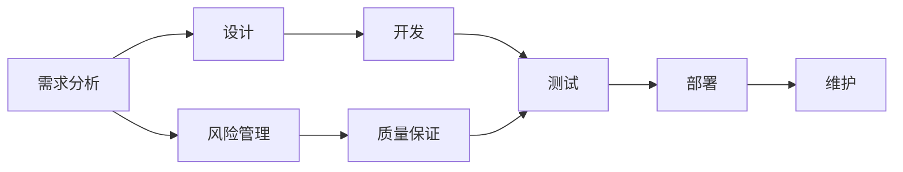

                 

## 1. 背景介绍

在当前快速变化的市场环境中，创业公司面临着严峻的质量挑战。无论是初创企业还是成熟企业，都需要通过有效的质量控制与管理，确保产品的高品质、高性能和竞争力。本文将探讨自动化创业中的质量控制与管理，通过深入分析当前质量管理趋势、自动化技术的应用以及实施策略，提供全面的解决方案。

## 2. 核心概念与联系

### 2.1 核心概念概述

在自动化创业中，质量控制与管理是确保产品和服务成功的关键。这一过程涉及多个环节，包括需求分析、设计、开发、测试、部署和维护。以下是几个核心概念：

- **自动化测试**：使用工具和平台自动执行软件测试流程，提高测试效率和准确性。
- **持续集成/持续交付（CI/CD）**：通过自动化构建、测试和部署，加速软件开发生命周期。
- **质量保证（QA）**：确保产品符合既定的质量标准和规范，避免缺陷和错误。
- **质量指标**：如代码覆盖率、缺陷密度、故障率等，用于衡量产品质量。
- **风险管理**：识别和评估项目风险，采取措施降低负面影响。

### 2.2 核心概念原理和架构的 Mermaid 流程图



该图展示了从需求分析到维护的全过程，强调了风险管理和质量保证在整个流程中的重要性。

## 3. 核心算法原理 & 具体操作步骤

### 3.1 算法原理概述

自动化质量控制与管理的核心算法原理主要包括：

- **统计质量控制**：通过分析历史数据和趋势，预测和识别潜在的质量问题。
- **模型驱动的质量改进**：利用机器学习模型分析数据，优化质量控制流程。
- **自动化测试与监控**：使用自动化工具监控代码和应用程序，发现和修复缺陷。

### 3.2 算法步骤详解

以下是自动化质量控制与管理的具体操作步骤：

1. **需求分析**：明确项目目标和需求，定义质量标准。
2. **设计阶段**：进行系统架构设计和编码规范设计。
3. **开发和测试**：通过自动化工具执行单元测试、集成测试和系统测试，确保代码质量。
4. **部署**：将经过测试的软件部署到生产环境。
5. **维护**：定期进行质量检查和性能优化。

### 3.3 算法优缺点

**优点**：
- 提高测试效率和准确性。
- 降低人为错误和遗漏。
- 增强质量控制和持续改进能力。

**缺点**：
- 需要投入大量资源和工具。
- 可能出现自动化工具和流程的瓶颈。
- 对团队素质和技能要求较高。

### 3.4 算法应用领域

自动化质量控制与管理广泛应用于软件开发、制造、医疗、金融等多个领域。在软件开发中，自动化测试和持续集成/持续交付是主流技术；在制造业，自动化测试和质量控制被广泛应用；在医疗领域，通过自动化技术确保医疗设备的安全性和可靠性；在金融行业，自动化质量控制有助于提高交易系统的稳定性和安全性。

## 4. 数学模型和公式 & 详细讲解 & 举例说明

### 4.1 数学模型构建

质量控制和管理的数学模型通常包括以下几个要素：

- **概率模型**：用于预测缺陷发生的概率。
- **优化模型**：用于优化测试和质量控制流程。
- **统计模型**：用于分析历史数据，识别趋势和异常。

### 4.2 公式推导过程

以某软件项目为例，其质量控制模型可以表示为：

$$
\text{质量指数} = \frac{\text{满足需求的软件功能数}}{\text{总功能数}} \times \frac{\text{测试通过率}}{\text{测试覆盖率}}
$$

其中，质量指数（Quality Index, QI）衡量软件的质量，满足需求的功能数和测试通过率反映了软件的功能性和可靠性，测试覆盖率则表示测试的全面性。

### 4.3 案例分析与讲解

假设某软件开发团队使用自动化工具进行质量控制，其代码覆盖率为90%，测试通过率为95%，实际运行中的故障率为2%。根据上述公式计算得到：

$$
QI = \frac{90}{100} \times \frac{95}{100} \times \frac{98}{100} = 0.9 \times 0.95 \times 0.98 = 0.8925
$$

这意味着该软件的质量指数为89.25%，表明其质量处于良好水平，但仍需进一步改进。

## 5. 项目实践：代码实例和详细解释说明

### 5.1 开发环境搭建

要实现自动化质量控制与管理，首先需要搭建一个开发环境。推荐使用Docker容器和Kubernetes集群，确保开发、测试和部署的稳定性。

### 5.2 源代码详细实现

以下是一个使用Jenkins进行持续集成/持续交付的示例：

1. **安装Jenkins**：
   ```
   sudo apt-get install jenkins
   ```

2. **安装插件**：
   - Jenkins Pipeline Plugin
   - Git Plugin
   - Maven Plugin

3. **配置Jenkins**：
   - 创建新项目，选择Pipeline模式。
   - 编写Pipeline脚本，定义测试和构建任务。

### 5.3 代码解读与分析

Pipeline脚本主要包含以下几个部分：

- **环境配置**：设置Jenkins环境变量，如Maven路径、Git仓库等。
- **构建任务**：执行Maven构建，生成测试报告。
- **测试任务**：使用Junit插件执行单元测试和集成测试。
- **部署任务**：使用Kubernetes部署应用。

### 5.4 运行结果展示

运行Pipeline脚本后，Jenkins将生成构建报告和测试报告，并通过邮件通知团队成员。此外，部署任务将自动将构建成功的应用部署到Kubernetes集群，确保高可用性和可扩展性。

## 6. 实际应用场景

### 6.1 软件开发

在软件开发中，自动化质量控制与管理至关重要。使用Jenkins和GitLab等工具，可以实现持续集成/持续交付，确保代码的持续集成和快速部署。

### 6.2 制造业

制造业中，自动化质量控制有助于提高生产效率和产品质量。使用Minitab和Stat软件，可以分析生产数据，识别质量问题和改进机会。

### 6.3 医疗设备

医疗设备需要高可靠性和安全性，通过自动化质量控制，可以确保设备的稳定运行和数据准确性。使用PLM（产品生命周期管理）软件，可以追踪设备的历史数据和维护记录。

### 6.4 金融交易

金融交易系统需要高吞吐量和低延迟，自动化质量控制可以确保系统的稳定性和安全性。使用Docker和Kubernetes，可以实现快速部署和弹性扩展。

## 7. 工具和资源推荐

### 7.1 学习资源推荐

1. **《软件测试自动化》（著者：Kyle Hilbert）**：详细介绍自动化测试工具和技术，适合软件开发者和测试工程师。
2. **《持续集成：构建高性能软件》（著者：John Willis）**：深入讲解持续集成/持续交付的最佳实践，适合项目经理和开发团队。
3. **《Jenkins: The Definitive Guide》（著者：Simon Rozenshine）**：详细说明Jenkins的配置和使用，适合Jenkins管理员和开发团队。

### 7.2 开发工具推荐

1. **Jenkins**：开源的持续集成/持续交付工具，支持多种插件和扩展。
2. **Docker**：容器化技术，确保应用的稳定性和可移植性。
3. **Kubernetes**：容器编排工具，实现应用的自动部署和扩展。
4. **Junit**：Java单元测试框架，支持多种集成方式。
5. **SonarQube**：静态代码分析工具，用于代码质量和安全性的检测。

### 7.3 相关论文推荐

1. **《软件质量保证的自动化实践》**：探讨自动化测试和持续集成在软件质量管理中的应用。
2. **《机器学习在软件质量控制中的应用》**：研究如何利用机器学习模型进行质量控制和预测。
3. **《自动化测试的未来》**：分析自动化测试的最新趋势和技术，预测未来的发展方向。

## 8. 总结：未来发展趋势与挑战

### 8.1 研究成果总结

自动化质量控制与管理已经成为软件开发生命周期中不可或缺的部分。通过自动化工具和流程，可以显著提高测试效率和质量，降低人为错误，实现持续改进。

### 8.2 未来发展趋势

1. **自动化测试和持续集成/持续交付的普及**：随着技术的进步，自动化测试和持续集成/持续交付将在更多企业和项目中得到应用。
2. **人工智能和机器学习的应用**：利用AI和ML模型进行质量预测和控制，进一步提高质量管理的准确性和效率。
3. **全生命周期的质量管理**：从需求分析到维护，实现全生命周期的质量控制和持续改进。
4. **云平台和容器化的应用**：通过云平台和容器化技术，实现应用的快速部署和弹性扩展。

### 8.3 面临的挑战

1. **技术复杂性**：自动化工具和流程的设计和实施需要较高的技术水平。
2. **数据隐私和安全**：自动化测试和监控需要处理大量数据，需确保数据隐私和安全。
3. **资源投入**：高质量的自动化解决方案需要大量资源和工具。
4. **团队协作**：需要团队成员之间的有效协作和沟通，以确保自动化流程的顺利实施。

### 8.4 研究展望

未来，自动化质量控制与管理需要进一步优化和扩展，以适应更复杂和多变的业务环境。通过引入AI和ML技术，提升质量控制的智能化和自动化水平；通过优化工具和流程，减少资源投入和提升团队协作效率；通过推动标准化和规范化，确保质量管理的统一和一致性。

## 9. 附录：常见问题与解答

**Q1: 自动化质量控制与管理的意义是什么？**

A: 自动化质量控制与管理可以显著提高测试效率和质量，降低人为错误和遗漏，确保软件和产品的高质量、高性能和竞争力。

**Q2: 如何选择合适的自动化测试工具？**

A: 选择合适的自动化测试工具需要考虑以下几个因素：
- 工具的易用性和学习成本。
- 工具的功能和扩展性。
- 工具的兼容性和集成性。

**Q3: 自动化质量控制与管理对团队有什么要求？**

A: 自动化质量控制与管理需要团队成员具备较高的技术水平和协作能力。同时，团队需要具备持续改进和优化的意识，以确保自动化流程的持续优化和改进。

**Q4: 如何处理自动化测试中的误报和漏报问题？**

A: 处理误报和漏报问题需要综合考虑以下几个方面：
- 优化测试用例和测试数据，提高测试的准确性。
- 定期评估测试覆盖率，增加关键功能的测试。
- 引入人工复审和自动化测试相结合的方式，减少误报和漏报。

**Q5: 自动化质量控制与管理如何与敏捷开发相结合？**

A: 自动化质量控制与管理与敏捷开发相结合的方式如下：
- 在每个迭代中执行自动化测试和持续集成/持续交付。
- 在迭代初期进行需求分析和设计，确保质量目标和标准的一致性。
- 在迭代末尾进行质量评估和回顾，确保质量改进和持续优化。

---

作者：禅与计算机程序设计艺术 / Zen and the Art of Computer Programming

