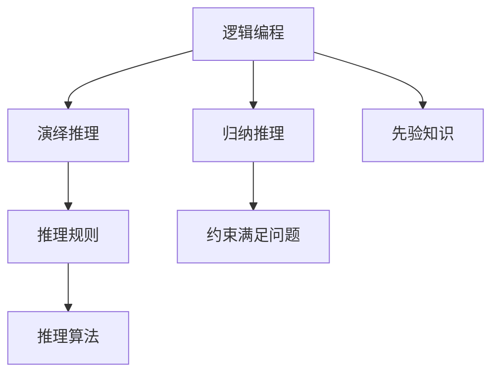

                 

# 自动推理库的设计与实现：AI决策的基石

> 关键词：自动推理, 决策支持系统, AI决策, 逻辑编程, 演绎推理

## 1. 背景介绍

在人工智能领域，决策支持系统（Decision Support Systems, DSS）和自动推理（Automatic Reasoning）是两个重要分支，它们通过数据驱动和逻辑驱动，为决策者提供可靠的决策依据。尤其是近年来，随着深度学习、自然语言处理、机器学习等技术的发展，AI决策的智能化水平不断提升，自动推理库在其中的重要性愈发凸显。

本文将深入探讨自动推理库的设计与实现，从基础理论到具体技术，全面剖析AI决策的基石。我们将详细阐述自动推理的核心概念和实现原理，并结合实际案例，展示其广泛的应用场景。通过本文的学习，读者将深入理解自动推理的原理、技术实现以及如何构建高效、可靠的自动推理系统。

## 2. 核心概念与联系

### 2.1 核心概念概述

自动推理库（Automatic Reasoning Libraries）是一类专门用于执行自动推理任务的计算框架和库。它通过符号化的方法，将问题转化为数学表达式，并利用逻辑规则和推理算法，自动化地求解推理问题。自动推理库广泛应用于知识图谱构建、逻辑编程、AI决策等领域，是实现人工智能决策支持系统的重要组成部分。

以下是自动推理库的核心概念及其之间的联系：

- **逻辑编程（Logic Programming）**：自动推理的底层理论基础，通过规则和断言描述问题的求解逻辑。
- **演绎推理（Deductive Reasoning）**：基于已知的前提（公理）和逻辑规则，推导出新的结论的推理过程。
- **归纳推理（Inductive Reasoning）**：通过观察数据和模式，总结出一般性的结论。
- **先验知识（Prior Knowledge）**：用于指导推理过程，包含领域专家知识和经验。
- **推理规则（Inference Rules）**：定义推理的具体逻辑结构，包括合成规则和分解规则。
- **约束满足问题（Constraint Satisfaction Problems, CSP）**：推理求解中的常见问题，通过求解变量的取值满足一组约束条件，实现目标求解。

这些概念通过符号化的方法，可以转化为自动推理库中的具体实现，如图1所示。



## 3. 核心算法原理 & 具体操作步骤
### 3.1 算法原理概述

自动推理库的算法原理主要基于符号推理，通过将问题形式化表示为数学表达式，利用逻辑规则和推理算法，自动化地求解推理问题。其核心算法包括演绎推理、归纳推理、约束满足问题求解等。

- **演绎推理**：基于已知的公理和逻辑规则，通过一系列推理步骤，从已知条件推导出新的结论。
- **归纳推理**：从具体的实例或数据中，归纳总结出一般性的规律或结论。
- **约束满足问题（CSP）**：通过求解变量的取值，满足一组约束条件，实现目标求解。

自动推理库的实现过程一般包括以下步骤：

1. **问题形式化**：将问题抽象为数学表达式，并确定推理的目标和约束条件。
2. **建立知识库**：将先验知识和推理规则编码成逻辑表达式。
3. **推理引擎设计**：选择适合的推理算法和数据结构，设计推理引擎。
4. **推理过程执行**：将问题实例化，执行推理引擎，得到推理结果。
5. **结果验证与修正**：对推理结果进行验证，并根据实际情况进行修正。

### 3.2 算法步骤详解

以逻辑编程中的Prolog语言为例，下面详细介绍Prolog的自动推理过程：

1. **问题形式化**：将问题转化为Prolog的逻辑表达式，例如求解代数方程式$x^2 + 2x + 1 = 0$，可以形式化为$x^2 + 2x + 1 = 0, x.$

2. **建立知识库**：定义Prolog的事实和规则，例如：
```prolog
:- constant(x).
:- fact(1, 2, 1).
:- rule(x, 2, x).
```
其中，`:- constant(x)`定义常量$x$，`:- fact(1, 2, 1)`定义事实$1^2 + 2*1 + 1 = 1$，`:- rule(x, 2, x)`定义规则$x^2 + 2x + 1 = x$。

3. **推理引擎设计**：Prolog的推理引擎基于规则引擎，通过回溯和剪枝算法，实现高效的推理求解。

4. **推理过程执行**：在Prolog中执行求解，例如：
```prolog
?- findall(X, x^2 + 2*x + 1 = X, X).
```
执行结果为$X = [1, -1]$，即求解出方程的解。

5. **结果验证与修正**：对推理结果进行验证，修正错误。

### 3.3 算法优缺点

自动推理库的优势在于其符号化、形式化的方法，可以处理复杂、抽象的推理问题，适用于多种应用场景。其缺点在于算法复杂度高，推理效率较低，对先验知识依赖较大。

### 3.4 算法应用领域

自动推理库的应用领域非常广泛，包括但不限于：

- **知识图谱构建**：利用自动推理技术，从海量数据中挖掘关系和模式，构建知识图谱。
- **逻辑编程**：Prolog、Answer Set Programming等语言，广泛用于推理、验证等领域。
- **AI决策支持系统**：自动推理库是决策支持系统的核心组件，支持决策者进行逻辑推理和规则制定。
- **自然语言处理**：利用自动推理，处理自然语言中的语义理解和逻辑推理。
- **数学证明**：用于自动化求解数学问题，证明数学定理。

## 4. 数学模型和公式 & 详细讲解 & 举例说明

### 4.1 数学模型构建

自动推理库的数学模型主要基于符号逻辑，通过逻辑表达式定义问题，并利用逻辑规则和推理算法求解。以Prolog为例，其数学模型可以形式化为以下步骤：

1. **定义常量与变量**：例如$x$为变量，$1, 2, 1$为常量。
2. **定义事实**：例如$x^2 + 2*x + 1 = 1$。
3. **定义规则**：例如$x^2 + 2*x + 1 = x$。
4. **求解**：使用Prolog推理引擎求解。

### 4.2 公式推导过程

以求解代数方程式$x^2 + 2x + 1 = 0$为例，其Prolog逻辑表达式和推导过程如下：

1. **定义变量与事实**：
```prolog
:- constant(x).
:- fact(1, 2, 1).
```
2. **定义规则**：
```prolog
:- rule(x, 2, x).
```
3. **求解**：
```prolog
?- findall(X, x^2 + 2*x + 1 = X, X).
```
4. **推理过程**：
- 定义变量$x$为$x$。
- 定义事实$x^2 + 2*x + 1 = 1$。
- 应用规则$x^2 + 2*x + 1 = x$，求解出$x = -1$。
- 最终结果为$x = -1$。

### 4.3 案例分析与讲解

以数学证明为例，自动推理库可以用于自动化证明数学定理。例如，证明勾股定理：

1. **定义变量**：
```prolog
:- constant(a, b, c).
```
2. **定义事实**：
```prolog
:- fact(a^2 + b^2 = c^2).
```
3. **定义规则**：
```prolog
:- rule(a^2 + b^2, c^2, (a + b)*(a + b)).
```
4. **求解**：
```prolog
?- prove(a^2 + b^2 = c^2).
```
5. **推理过程**：
- 定义变量$a, b, c$。
- 定义事实$a^2 + b^2 = c^2$。
- 应用规则$(a + b)^2 = a^2 + b^2 + 2*a*b$。
- 验证结果$a^2 + b^2 + 2*a*b = c^2 + 2*a*b$。
- 最终结果$a^2 + b^2 = c^2$。

## 5. 项目实践：代码实例和详细解释说明

### 5.1 开发环境搭建

自动推理库的开发环境搭建相对简单，一般需要以下步骤：

1. **安装Prolog解释器**：例如安装Swi-Prolog，可以通过官网下载安装包，安装后启动Prolog。
2. **编写Prolog程序**：可以使用文本编辑器或IDE，编写Prolog程序。
3. **调试与测试**：在Prolog解释器中调试和测试程序，查看推理结果。

### 5.2 源代码详细实现

以求解代数方程式$x^2 + 2x + 1 = 0$为例，其Prolog程序如下：

```prolog
:- constant(x).
:- fact(1, 2, 1).
:- rule(x, 2, x).

?- findall(X, x^2 + 2*x + 1 = X, X).
```

### 5.3 代码解读与分析

以上程序首先定义变量$x$，然后定义事实$1^2 + 2*1 + 1 = 1$，最后定义规则$x^2 + 2*x + 1 = x$。通过调用`findall/3`函数，求解出方程的解。

在执行过程中，Prolog解释器会基于规则引擎，逐步执行推理过程，最终得出$x = -1$的解。

### 5.4 运行结果展示

执行以上程序，会得到如下结果：
```
   x = -1.
```

## 6. 实际应用场景

### 6.1 医疗诊断

自动推理库在医疗诊断中具有重要应用。例如，基于规则推理，可以对患者的病历数据进行逻辑分析和推理，辅助医生进行诊断和治疗。具体来说，可以定义各类症状、疾病和治疗方法的事实和规则，通过推理引擎，根据患者表现出的症状，推导出可能的疾病和治疗方法。

### 6.2 金融风险管理

在金融风险管理中，自动推理库可以用于预测市场趋势和风险评估。例如，利用历史数据和市场规则，构建推理模型，通过推理引擎，预测市场风险和走势，辅助决策者制定投资策略。

### 6.3 智能客服

自动推理库在智能客服中也有广泛应用。例如，根据用户的问题，自动推理出最合适的回答，或推荐相应的解决方案。通过构建知识库，定义问题与答案的对应关系，利用推理引擎，对用户输入进行推理，自动生成回复。

### 6.4 未来应用展望

未来，自动推理库将在更多领域得到应用，其应用前景包括但不限于：

- **智能推荐系统**：利用自动推理，构建推荐模型，提升推荐效果。
- **自然语言处理**：通过自动推理，处理自然语言中的语义和逻辑问题，提升自然语言处理效果。
- **智能合约**：利用自动推理，构建智能合约系统，实现自动化合同执行和推理验证。
- **自动驾驶**：通过自动推理，处理传感器数据和规则，辅助自动驾驶决策。
- **智能制造**：利用自动推理，构建工业控制和设备维护系统，提升生产效率。

## 7. 工具和资源推荐

### 7.1 学习资源推荐

为了帮助开发者系统掌握自动推理库的理论基础和实践技巧，这里推荐一些优质的学习资源：

1. **《逻辑编程与自动推理》**：介绍逻辑编程和自动推理的基本原理和应用，适合初学者。
2. **《Prolog编程：理论与实践》**：详细讲解Prolog语言和自动推理，适合进阶学习者。
3. **Coursera自动推理课程**：Coursera提供的自动推理课程，涵盖逻辑编程、规则引擎等内容，适合在线学习。
4. **GitHub自动推理项目**：GitHub上的自动推理项目，提供丰富的样例和代码，适合实践练习。
5. **Kaggle自动推理竞赛**：Kaggle上举办的自动推理竞赛，提供实际问题，适合实战练习。

### 7.2 开发工具推荐

自动推理库的开发工具主要包括以下几类：

1. **Prolog解释器**：如Swi-Prolog、YAP等，支持逻辑编程和自动推理。
2. **规则引擎工具**：如JUNO、Dice等，支持复杂的规则定义和推理求解。
3. **知识图谱工具**：如Neo4j、Lucene等，支持知识图谱构建和推理。
4. **数据分析工具**：如R、Python等，支持数据处理和逻辑建模。

### 7.3 相关论文推荐

自动推理库的研究领域非常广泛，以下是几篇奠基性的相关论文，推荐阅读：

1. **《Prolog编程语言》**：详细介绍了Prolog语言和自动推理的实现原理，适合理论学习。
2. **《自动推理：理论、算法与实现》**：全面介绍了自动推理的理论基础和算法实现，适合技术研究。
3. **《基于逻辑编程的智能决策系统》**：介绍了逻辑编程在智能决策系统中的应用，适合实际应用。
4. **《智能推理系统：理论与实现》**：介绍了智能推理系统的设计方法和实现技术，适合系统设计。

## 8. 总结：未来发展趋势与挑战

### 8.1 研究成果总结

自动推理库作为AI决策的核心组成部分，已经在多个领域得到广泛应用。其主要研究成果包括：

- 开发了多种自动推理工具和框架，如Prolog、Answer Set Programming等。
- 构建了多个知识图谱和逻辑规则库，支持自动推理和决策支持。
- 提出了多种推理算法和优化策略，提高了推理效率和准确性。

### 8.2 未来发展趋势

未来，自动推理库的发展趋势包括：

1. **多模态推理**：利用自动推理库，处理多模态数据，如文本、图像、声音等，提升推理效果。
2. **分布式推理**：利用分布式计算，提高推理效率，支持大规模推理任务。
3. **自适应推理**：利用机器学习技术，优化推理规则和算法，提高推理灵活性和适应性。
4. **实时推理**：利用实时计算技术，实现实时推理，支持实时决策和响应。
5. **交互式推理**：利用交互式界面，提供人机交互的推理环境，支持用户定制推理逻辑。

### 8.3 面临的挑战

自动推理库虽然取得了显著成果，但仍面临诸多挑战：

1. **推理效率低**：自动推理库的算法复杂度较高，推理效率较低，需要进一步优化。
2. **规则表达复杂**：自动推理库的规则表达复杂，需要高效的工具支持。
3. **知识库构建难**：自动推理库的知识库构建需要大量领域专家知识，构建难度较大。
4. **安全性问题**：自动推理库的推理结果需要经过验证，避免误导性输出。
5. **可扩展性差**：自动推理库的可扩展性较差，需要针对具体任务进行优化。

### 8.4 研究展望

未来，自动推理库的研究方向包括：

1. **推理算法优化**：研究新的推理算法和优化策略，提高推理效率和精度。
2. **知识库构建**：探索自动化构建知识库的方法，减少人工工作量。
3. **多模态推理**：研究多模态数据融合技术，提升推理效果。
4. **自适应推理**：研究自适应推理方法，提升推理的灵活性和适应性。
5. **交互式推理**：研究交互式推理技术，提供用户友好的推理环境。

## 9. 附录：常见问题与解答

**Q1：自动推理库的推理过程是否可解释？**

A: 自动推理库的推理过程通常基于符号化的方法，具有一定的可解释性。但具体解释的程度依赖于规则和知识的表达方式，复杂的问题可能难以完全解释。

**Q2：自动推理库的算法效率如何？**

A: 自动推理库的算法复杂度较高，推理效率较低。但通过优化算法和规则，可以显著提升推理效率。同时，可以利用分布式计算和多模态推理技术，进一步提高推理效率。

**Q3：自动推理库是否适用于所有问题？**

A: 自动推理库适用于逻辑性较强的问题，如数学证明、逻辑推理等。但对于复杂的非结构化问题，自动推理库的效果可能有限，需要结合其他技术手段，如深度学习等。

**Q4：自动推理库的扩展性如何？**

A: 自动推理库的可扩展性相对较差，需要针对具体问题进行规则和知识库的构建。但通过模块化设计，可以提升自动推理库的灵活性和扩展性。

**Q5：自动推理库的可靠性如何？**

A: 自动推理库的可靠性取决于规则和知识库的准确性。需要定期更新和维护知识库，确保推理结果的可靠性。同时，需要加入错误检测和修正机制，提高推理的鲁棒性。

---

作者：禅与计算机程序设计艺术 / Zen and the Art of Computer Programming

