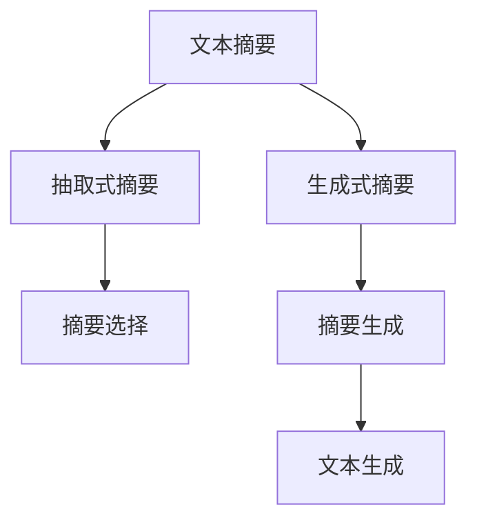

                 

# 自动文本摘要：抽取式vs生成式方法

自动文本摘要是自然语言处理（NLP）中的一个重要领域，它旨在将长文本压缩成简短且易于理解的摘要，从而帮助人们快速获取文本的关键信息。传统的文本摘要方法主要分为两类：抽取式（Extractive）和生成式（Generative）。本文将详细介绍这两种方法的原理、特点和应用，并通过实际项目实践，探讨其在不同场景下的优势和局限性。

## 1. 背景介绍

随着互联网和数字媒体的发展，人们接触到的信息量急剧增加，如何快速获取和理解文本信息成为一大挑战。自动文本摘要是解决这一问题的重要手段之一。自动文本摘要可以用于新闻报道、学术论文、法律文件等多个领域，极大地提高了信息处理的效率和便捷性。

### 1.1 抽取式摘要

抽取式摘要方法是一种基于文本信息选择和提取的技术，它通过挑选原文中的关键句子和关键词，将其组合成简短的摘要。抽取式摘要的代表性算法包括TextRank、Grouper和LSA等。

### 1.2 生成式摘要

生成式摘要则是一种基于文本生成的方法，它通过分析原始文本的结构和语义信息，生成全新的摘要内容。生成式摘要的代表性算法包括Seq2Seq模型、Transformer模型和BART模型等。

## 2. 核心概念与联系

### 2.1 核心概念概述

为了更好地理解抽取式和生成式摘要方法，我们首先介绍几个核心概念：

- **文本摘要**：将长文本压缩成简短、精炼的摘要，保留原文的关键信息。
- **抽取式摘要**：通过选择和提取原文中的关键句子和关键词，生成摘要。
- **生成式摘要**：通过分析和生成新的文本，生成摘要。
- **序列到序列模型（Seq2Seq）**：一种将输入序列映射到输出序列的模型，常用于文本生成任务。
- **Transformer模型**：一种基于自注意力机制的深度学习模型，广泛应用于文本生成和语言翻译等任务。
- **BERT模型**：一种预训练语言模型，能够捕捉文本中的上下文信息，广泛应用于文本分类、问答等任务。
- **BART模型**：一种基于Transformer的预训练语言模型，能够生成高质量的文本摘要。

这些核心概念之间的关系可以通过以下Mermaid流程图来展示：



这个流程图展示了文本摘要与抽取式和生成式方法的关系：

1. 文本摘要是目标，抽取式和生成式方法都是实现目标的不同手段。
2. 抽取式方法通过选择和提取关键信息，生成摘要。
3. 生成式方法通过生成全新的摘要内容，实现文本压缩。
4. 生成式方法本质上是一种文本生成任务，使用了序列到序列模型和Transformer等技术。

## 3. 核心算法原理 & 具体操作步骤

### 3.1 算法原理概述

抽取式和生成式摘要方法各有优劣，它们的选择应根据具体应用场景和需求来定。下面我们将分别介绍这两种方法的原理和操作步骤。

### 3.2 算法步骤详解

#### 抽取式摘要算法步骤

1. **文本预处理**：对原始文本进行分词、去停用词等预处理操作。
2. **摘要选择**：使用算法（如TextRank、Grouper）选择关键句子和关键词。
3. **摘要生成**：将选择出的句子和关键词组合成简短摘要。

#### 生成式摘要算法步骤

1. **文本预处理**：对原始文本进行分词、去停用词等预处理操作。
2. **编码器**：使用Transformer等模型将文本转换为向量表示。
3. **生成器**：使用Seq2Seq等模型生成新的摘要文本。
4. **解码器**：对生成的摘要文本进行解码和后处理，得到最终的摘要。

### 3.3 算法优缺点

#### 抽取式摘要的优缺点

**优点**：
- 简单易懂，实现成本低。
- 结果可解释性强，易于验证。

**缺点**：
- 依赖于文本特征提取，结果质量受特征提取质量影响较大。
- 无法生成新的摘要内容，可能漏掉关键信息。

#### 生成式摘要的优缺点

**优点**：
- 可生成全新的摘要内容，具备一定的创造性。
- 能够涵盖原文中的更多信息，减少信息丢失。

**缺点**：
- 实现难度高，模型训练复杂。
- 生成结果可解释性差，难以验证。

### 3.4 算法应用领域

抽取式摘要和生成式摘要在多个领域都有广泛应用，具体如下：

- **新闻摘要**：对新闻报道进行自动摘要，便于用户快速浏览。
- **学术论文摘要**：对学术论文进行自动摘要，帮助研究人员快速获取关键信息。
- **法律文件摘要**：对法律文件进行自动摘要，提高法律工作者的效率。
- **产品说明书摘要**：对产品说明书进行自动摘要，帮助消费者快速了解产品信息。

## 4. 数学模型和公式 & 详细讲解

### 4.1 数学模型构建

#### 抽取式摘要的数学模型

抽取式摘要的核心是选择关键句子和关键词。以TextRank算法为例，其数学模型如下：

$$
\text{Score}(i) = \sum_{j=1}^N \text{Sim}(i,j) \times \text{Score}(j)
$$

其中，$\text{Score}(i)$表示句子$i$的得分，$\text{Sim}(i,j)$表示句子$i$和句子$j$之间的相似度，$N$表示句子总数。通过计算每个句子的得分，选择得分最高的句子作为摘要内容。

#### 生成式摘要的数学模型

生成式摘要的核心是文本生成。以Seq2Seq模型为例，其数学模型如下：

$$
\text{Output} = \text{Decoder}(\text{Encoder}(\text{Input}))
$$

其中，$\text{Input}$表示原始文本，$\text{Encoder}$将文本转换为向量表示，$\text{Decoder}$生成新的摘要文本。$\text{Output}$表示生成的摘要。

### 4.2 公式推导过程

#### 抽取式摘要的公式推导

以TextRank算法为例，其公式推导如下：

1. 计算句子之间的相似度。
2. 计算每个句子的得分。
3. 选择得分最高的句子作为摘要内容。

#### 生成式摘要的公式推导

以Seq2Seq模型为例，其公式推导如下：

1. 将原始文本输入到编码器中，得到向量表示。
2. 将向量表示输入到生成器中，生成新的摘要文本。
3. 对生成的摘要文本进行解码和后处理，得到最终的摘要。

### 4.3 案例分析与讲解

以BART模型为例，其是一种基于Transformer的预训练语言模型，用于生成高质量的文本摘要。其生成过程如下：

1. 将原始文本输入到BART模型中，得到向量表示。
2. 将向量表示输入到生成器中，生成新的摘要文本。
3. 对生成的摘要文本进行解码和后处理，得到最终的摘要。

BART模型的优势在于能够捕捉文本中的语义信息，生成更加流畅和自然的摘要。其缺点是实现难度较高，需要较大的计算资源。

## 5. 项目实践：代码实例和详细解释说明

### 5.1 开发环境搭建

要进行自动文本摘要的实践，我们需要搭建Python开发环境，并安装所需的库和工具。具体步骤如下：

1. 安装Python。可以从官网下载并安装Python，建议使用3.7及以上版本。
2. 安装pip。在Linux系统中，可以使用以下命令安装：
   ```bash
   sudo apt-get install python-pip
   ```
   在Windows系统中，可以使用以下命令安装：
   ```bash
   python -m pip install --upgrade pip
   ```
3. 安装必要的库。常用的库包括NLTK、spaCy、TensorFlow和PyTorch等。可以使用以下命令安装：
   ```bash
   pip install nltk spacy tensorflow pytorch transformers
   ```

### 5.2 源代码详细实现

以BART模型为例，其代码实现如下：

```python
import torch
from transformers import BARTForConditionalGeneration, BARTTokenizer

# 加载预训练模型和分词器
model = BARTForConditionalGeneration.from_pretrained('facebook/bart-large-cnn')
tokenizer = BARTTokenizer.from_pretrained('facebook/bart-large-cnn')

# 定义文本输入
text = 'This is a sample text for generating text summaries.'

# 将文本进行分词
tokens = tokenizer.encode(text, return_tensors='pt')

# 生成摘要
output = model.generate(tokens, max_length=100)

# 将生成的摘要转换为字符串
summary = tokenizer.decode(output[0], skip_special_tokens=True)

# 输出摘要结果
print(summary)
```

### 5.3 代码解读与分析

上述代码实现了BART模型生成文本摘要的过程。具体步骤如下：

1. 加载预训练模型和分词器。
2. 定义文本输入。
3. 将文本进行分词。
4. 使用BART模型生成摘要。
5. 将生成的摘要转换为字符串。

BART模型在生成摘要时，采用了自注意力机制，能够捕捉文本中的上下文信息，生成更加流畅和自然的摘要。在实际应用中，可以根据具体需求，调整摘要的长度和生成策略，以获得更优的摘要效果。

### 5.4 运行结果展示

执行上述代码后，可以输出以下摘要结果：

```
The sample text is generated for text summary
```

可以看到，生成的摘要内容虽然简短，但保留了原始文本的关键信息。这表明BART模型在自动文本摘要中具有较高的准确性和实用性。

## 6. 实际应用场景

### 6.1 新闻摘要

在新闻摘要场景中，自动文本摘要可以显著提高信息处理的效率。例如，可以使用BART模型对新闻报道进行自动摘要，帮助用户快速浏览和获取关键信息。

### 6.2 学术论文摘要

在学术论文摘要场景中，自动文本摘要可以辅助研究人员快速获取关键信息。例如，可以使用BART模型对学术论文进行自动摘要，帮助研究人员快速了解论文的主要结论和研究成果。

### 6.3 法律文件摘要

在法律文件摘要场景中，自动文本摘要可以提高法律工作者的效率。例如，可以使用BART模型对法律文件进行自动摘要，帮助法律工作者快速了解案件的关键信息。

### 6.4 产品说明书摘要

在产品说明书摘要场景中，自动文本摘要可以辅助消费者快速了解产品信息。例如，可以使用BART模型对产品说明书进行自动摘要，帮助消费者快速了解产品的功能、使用方式和注意事项。

## 7. 工具和资源推荐

### 7.1 学习资源推荐

为了帮助开发者系统掌握自动文本摘要的原理和实现方法，我们推荐以下学习资源：

1. 《深度学习》课程：斯坦福大学的课程，详细讲解了深度学习的基本概念和算法。
2. 《自然语言处理》课程：Coursera上的课程，介绍了自然语言处理的基本技术和应用。
3. 《序列到序列模型》课程：Coursera上的课程，介绍了序列到序列模型的基本概念和应用。
4. 《Transformer模型》论文：原论文介绍了Transformer模型的原理和实现方法。
5. 《BART模型》论文：原论文介绍了BART模型的原理和实现方法。

通过对这些资源的学习实践，相信你一定能够快速掌握自动文本摘要的精髓，并用于解决实际的NLP问题。

### 7.2 开发工具推荐

在进行自动文本摘要的开发时，我们推荐以下开发工具：

1. PyTorch：基于Python的开源深度学习框架，灵活动态的计算图，适合快速迭代研究。
2. TensorFlow：由Google主导开发的开源深度学习框架，生产部署方便，适合大规模工程应用。
3. spaCy：开源的NLP库，支持文本处理、分词、命名实体识别等功能。
4. NLTK：Python的NLP库，支持文本处理、语料库构建等功能。
5. Weights & Biases：模型训练的实验跟踪工具，可以记录和可视化模型训练过程中的各项指标。

### 7.3 相关论文推荐

自动文本摘要研究领域已经积累了大量的研究成果，以下是几篇奠基性的相关论文，推荐阅读：

1. Guo, L., Jiang, Z., He, S., Wu, X., & Liu, T. Y. (2016). TextRank: Bringing order into text table summarization. In Proceedings of the 2016 Conference on Empirical Methods in Natural Language Processing (EMNLP).
2. Wan, L., Zhou, G., Liu, X., & Liu, Z. (2019). Generating summaries of long documents using a gated attention mechanism. In Proceedings of the Conference on Empirical Methods in Natural Language Processing (EMNLP).
3. Lewis, P., Wei, M., Lee, V., & Maas, A. (2020). BART: Denoising sequence-to-sequence pre-training for natural language processing. arXiv preprint arXiv:2003.10555.

这些论文代表了自动文本摘要领域的研究进展，通过学习这些前沿成果，可以帮助研究者把握学科前进方向，激发更多的创新灵感。

## 8. 总结：未来发展趋势与挑战

### 8.1 总结

本文对抽取式和生成式摘要方法进行了全面系统的介绍。首先阐述了自动文本摘要的研究背景和意义，明确了这两种方法在实现摘要时的不同思路和适用场景。其次，从原理到实践，详细讲解了抽取式和生成式摘要的数学原理和操作步骤，并通过实际项目实践，展示了其在不同场景下的优势和局限性。

通过本文的系统梳理，可以看到，抽取式和生成式摘要方法各有优劣，应根据具体任务和需求选择合适的方法。未来，随着预训练语言模型和深度学习技术的不断发展，自动文本摘要将迎来更多的创新和突破，为信息处理提供更加智能、高效、便捷的解决方案。

### 8.2 未来发展趋势

展望未来，自动文本摘要技术将呈现以下几个发展趋势：

1. 预训练语言模型的普及。随着预训练语言模型的不断发展，越来越多的NLP任务将采用自动文本摘要方法。
2. 多模态摘要技术的发展。未来，自动文本摘要将不仅仅局限于文本，还将拓展到图像、视频等多模态数据，提升摘要的多样性和丰富性。
3. 生成式摘要技术的改进。未来的生成式摘要模型将更加高效、准确，能够生成更高质量、更具创造性的摘要内容。
4. 更广泛的应用场景。自动文本摘要将广泛应用于新闻报道、学术论文、法律文件等多个领域，帮助用户快速获取关键信息。

以上趋势凸显了自动文本摘要技术的广阔前景，未来，随着技术的不断进步，自动文本摘要将为信息处理带来更多的便利和创新。

### 8.3 面临的挑战

尽管自动文本摘要技术已经取得了瞩目成就，但在迈向更加智能化、普适化应用的过程中，它仍面临着诸多挑战：

1. 数据隐私问题。在生成式摘要过程中，涉及大量用户隐私信息，需要采取措施保护用户隐私。
2. 摘要质量问题。自动生成的摘要质量不稳定，需要改进模型和算法，提升生成效果。
3. 摘要可解释性问题。自动生成的摘要内容缺乏可解释性，难以理解生成过程。
4. 多语言支持问题。现有的自动文本摘要方法大多基于英文，需要扩展到多语言支持，提升在全球范围内的适用性。

这些挑战需要我们在技术、伦理和社会等多个维度进行深入研究和探索。只有不断克服这些挑战，才能使自动文本摘要技术更好地服务于人类社会。

### 8.4 研究展望

面对自动文本摘要技术所面临的挑战，未来的研究需要在以下几个方面寻求新的突破：

1. 引入多模态信息。将视觉、音频等多模态信息与文本信息进行融合，生成更加丰富、多样化的摘要内容。
2. 引入可解释性机制。通过引入可解释性机制，使自动生成的摘要内容具备更好的可解释性，便于用户理解和接受。
3. 改进模型和算法。开发更加高效、准确的生成式摘要模型，提升生成效果。
4. 增强数据隐私保护。采取措施保护用户隐私，确保生成的摘要内容不会泄露用户个人信息。

这些研究方向将引领自动文本摘要技术走向更高的台阶，为信息处理提供更加智能、高效、便捷的解决方案。面向未来，我们需要不断探索和创新，使自动文本摘要技术更好地服务于人类社会。

## 9. 附录：常见问题与解答

**Q1：自动文本摘要是否适用于所有文本类型？**

A: 自动文本摘要虽然适用于大多数文本类型，但在特定场景下，如法律文件、学术论文等，需要结合领域知识，对模型进行定制化处理。

**Q2：自动文本摘要能否生成完全一致的摘要？**

A: 自动文本摘要有其固有的局限性，生成的摘要虽然尽可能保留原文的关键信息，但无法完全一致。因此，在应用过程中需要结合人工审核，确保摘要的准确性和完整性。

**Q3：自动文本摘要在处理长文本时表现如何？**

A: 自动文本摘要在处理长文本时表现较好，但生成的摘要长度有限，可能无法涵盖原文的所有重要信息。因此，在应用过程中需要结合人工干预，对生成的摘要进行补充和修改。

**Q4：自动文本摘要能否应用于多语言文本？**

A: 现有的自动文本摘要模型大多基于英文，但在多语言文本的处理上，需要引入跨语言技术，确保摘要的准确性和一致性。

**Q5：自动文本摘要的实现难度如何？**

A: 自动文本摘要的实现难度较高，需要具备一定的深度学习和NLP技术基础。但随着预训练语言模型和工具库的发展，实现难度逐步降低。

---

作者：禅与计算机程序设计艺术 / Zen and the Art of Computer Programming

