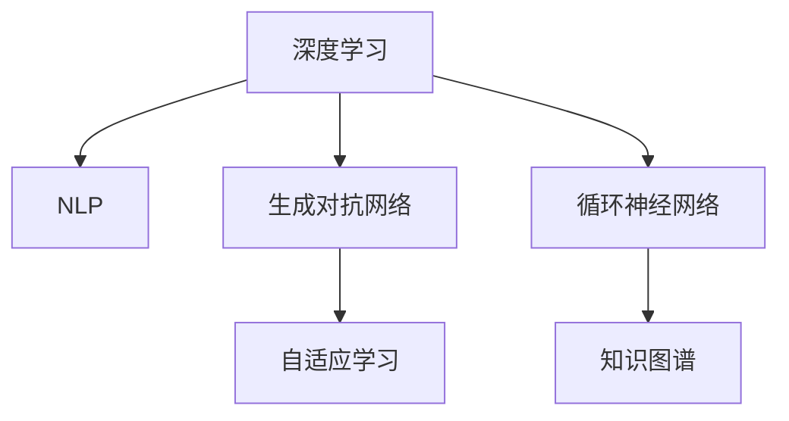

                 

# 自动问题生成：教育与测试应用

> 关键词：自动问题生成, 教育, 测试, 问题理解, 深度学习, 自然语言处理

## 1. 背景介绍

### 1.1 问题由来
在教育与测试领域，教师和教育机构长期以来一直面临着教学内容的丰富性和适应性不足的问题。传统的教学方式往往依赖于固定的教科书和题集，难以覆盖课程大纲的全部内容，且测试过程需要大量人工设计题目，效率低下，成本高昂。因此，利用人工智能技术自动生成高质量的问题，成为了提升教育质量的重要方向。

### 1.2 问题核心关键点
自动问题生成旨在通过深度学习、自然语言处理等技术，自动生成能够适应不同学生水平、考察不同知识点的测试题目，用于辅助教学、评估学习效果。其核心关键点包括：

- **问题理解与设计**：理解教学大纲和知识点，生成具有针对性和有效性的问题。
- **生成模型**：基于生成模型（如循环神经网络、生成对抗网络等）自动生成文本。
- **优化与评估**：通过优化算法（如强化学习、自适应学习等）不断调整生成策略，评估生成题目的质量。

## 2. 核心概念与联系

### 2.1 核心概念概述

为了更好地理解自动问题生成技术，本节将介绍几个密切相关的核心概念：

- **深度学习(Deep Learning)**：一种基于神经网络的机器学习技术，通过多层非线性变换，可以处理复杂数据和非线性关系。
- **自然语言处理(Natural Language Processing, NLP)**：涉及计算机处理、理解和生成人类语言的技术，是自动问题生成的基础。
- **生成对抗网络(Generative Adversarial Networks, GANs)**：由两个神经网络组成，一个生成网络生成样本，另一个判别网络判断样本真伪，两者通过对抗训练生成高质量的数据。
- **循环神经网络(Recurrent Neural Networks, RNNs)**：一种特殊的神经网络，可以处理序列数据，用于文本生成等任务。
- **自适应学习(Adaptive Learning)**：通过实时调整学习策略，根据学生的表现和学习情况，优化学习内容和路径。
- **知识图谱(Knowledge Graphs)**：用于描述实体、关系和属性的图形数据结构，辅助问题生成过程中的知识理解和推理。

这些核心概念之间的逻辑关系可以通过以下Mermaid流程图来展示：



这个流程图展示了几大核心概念及其之间的联系：

1. 深度学习提供强大的模型设计，用于处理复杂数据。
2. NLP技术帮助理解自然语言，进行问题生成。
3. 生成对抗网络用于生成高质量的文本数据。
4. 循环神经网络适合处理序列数据，生成连贯的文本。
5. 自适应学习根据学生表现动态调整生成策略。
6. 知识图谱辅助理解知识结构，提高生成准确性。

## 3. 核心算法原理 & 具体操作步骤
### 3.1 算法原理概述

自动问题生成的核心算法原理是结合深度学习和自然语言处理技术，通过模型自动生成具有教育意义的测试问题。具体流程包括：

1. **问题理解**：使用NLP技术理解教学大纲和知识点，生成具有针对性的问题。
2. **生成模型训练**：训练生成对抗网络（GANs）或循环神经网络（RNNs）等模型，生成符合问题规则和语言习惯的文本。
3. **优化与评估**：通过优化算法不断调整生成策略，评估生成题目的质量，迭代优化生成模型。

### 3.2 算法步骤详解

以下是对自动问题生成算法步骤的详细讲解：

**Step 1: 准备数据与预训练模型**
- 收集教学大纲、课程知识点、过往测试题集等数据。
- 准备预训练模型，如BERT、GPT等，作为问题生成的基础。

**Step 2: 构建问题理解模型**
- 使用NLP技术（如Bert、ELMo等）构建问题理解模型，用于分析教学大纲和知识点。
- 训练模型，使其能够理解教学目标和知识点，提取关键信息。

**Step 3: 训练生成模型**
- 选择合适的生成模型（如GANs、RNNs等），训练生成高质量的测试题目。
- 使用优化算法（如Adam、SGD等）更新模型参数，迭代优化生成质量。

**Step 4: 评估与反馈**
- 定义评估指标（如语言流畅度、知识点覆盖率等），评估生成题目的质量。
- 根据评估结果，调整生成策略和模型参数。

**Step 5: 部署与优化**
- 将训练好的生成模型部署到生产环境中，实时生成测试题目。
- 定期收集反馈，持续优化生成模型，提升生成效果。

### 3.3 算法优缺点

自动问题生成技术具有以下优点：
1. **效率高**：自动生成问题可以节省大量人工设计题目的时间和成本。
2. **内容丰富**：生成的题目可以覆盖更广泛的知识点和教学目标，丰富教学内容。
3. **个性化**：可以根据学生的学习情况和表现，动态生成符合学生水平的题目，提升学习效果。
4. **灵活性**：可以适应不同的教学场景和学习目标，灵活调整生成策略。

同时，该方法也存在一定的局限性：
1. **生成质量**：生成模型的性能直接影响生成题目的质量，需要不断优化和迭代。
2. **内容准确性**：生成的题目需要符合教学大纲和知识点，避免误导学生。
3. **语言规范**：生成的题目需要符合语言规范，避免语法错误和不连贯。
4. **解释性**：生成过程缺乏可解释性，难以理解生成题目的来源和设计思路。

尽管存在这些局限性，但自动问题生成技术在教育与测试领域已经展现出了巨大的潜力和应用前景。未来相关研究的重点在于如何进一步提高生成质量，增强内容的准确性和规范性，同时兼顾可解释性和伦理安全性等因素。

### 3.4 算法应用领域

自动问题生成技术已经在教育与测试领域得到广泛应用，涉及以下几个方面：

- **课堂测试**：自动生成适合课堂教学的测试题目，评估学生的学习效果。
- **在线学习**：提供个性化的测试题，用于学习路径的评估和调整。
- **智能辅导**：结合自动问题生成技术，提供智能化的学习辅导系统。
- **考试系统**：自动生成考试的测试题，降低命题难度和成本。
- **学习分析**：分析学生的答题情况，提供个性化的学习建议。

除了上述这些应用外，自动问题生成技术还可以进一步拓展到课程设计、教材编写、学习社区等更多场景中，为教育技术的现代化和智能化提供新的动力。

## 4. 数学模型和公式 & 详细讲解 & 举例说明

### 4.1 数学模型构建

本节将使用数学语言对自动问题生成技术进行更加严格的刻画。

假设问题理解模型为 $M_{\text{understand}}:\mathcal{X} \rightarrow \mathcal{Y}$，其中 $\mathcal{X}$ 为输入空间（教学大纲、知识点等文本），$\mathcal{Y}$ 为输出空间（问题类型、知识点等）。

假设生成模型为 $M_{\text{generate}}:\mathcal{Y} \rightarrow \mathcal{T}$，其中 $\mathcal{T}$ 为问题空间（生成题目的文本表示）。

自动问题生成系统的总体模型为 $M_{\text{total}}: \mathcal{X} \rightarrow \mathcal{T}$。

### 4.2 公式推导过程

以下我们将推导一个简单的自动问题生成系统的数学模型：

**Step 1: 问题理解模型**
- 使用Bert模型作为问题理解模型，对教学大纲和知识点进行编码。
- 将编码后的表示输入生成模型。

**Step 2: 生成模型**
- 使用GANs或RNNs等生成模型，生成符合问题规则和语言习惯的文本。
- 定义损失函数 $L$，用于衡量生成文本与真实问题的差异。

**Step 3: 优化与评估**
- 使用优化算法更新生成模型的参数，最小化损失函数 $L$。
- 定义评估指标，如BLEU、ROUGE等，评估生成题目的质量。

### 4.3 案例分析与讲解

**案例一：基于Bert和GAN的自动问题生成**

1. **问题理解**
   - 使用Bert模型对教学大纲和知识点进行编码，得到问题类型和知识点。
   - 将编码后的表示输入GANs生成模型。

2. **生成模型**
   - 使用GANs生成符合问题规则和语言习惯的文本。
   - 定义GANs的损失函数 $L_{\text{GAN}}$，用于衡量生成文本的质量。

3. **优化与评估**
   - 使用Adam优化算法更新GANs的参数，最小化损失函数 $L_{\text{GAN}}$。
   - 定义BLEU等评估指标，评估生成题目的质量。

**案例二：基于RNN的自动问题生成**

1. **问题理解**
   - 使用Bert模型对教学大纲和知识点进行编码，得到问题类型和知识点。
   - 将编码后的表示输入RNN生成模型。

2. **生成模型**
   - 使用RNN生成符合问题规则和语言习惯的文本。
   - 定义RNN的损失函数 $L_{\text{RNN}}$，用于衡量生成文本的质量。

3. **优化与评估**
   - 使用SGD优化算法更新RNN的参数，最小化损失函数 $L_{\text{RNN}}$。
   - 定义BLEU等评估指标，评估生成题目的质量。

## 5. 项目实践：代码实例和详细解释说明

### 5.1 开发环境搭建

在进行自动问题生成实践前，我们需要准备好开发环境。以下是使用Python进行TensorFlow和Keras开发的环境配置流程：

1. 安装Anaconda：从官网下载并安装Anaconda，用于创建独立的Python环境。

2. 创建并激活虚拟环境：
```bash
conda create -n tf-env python=3.8 
conda activate tf-env
```

3. 安装TensorFlow：根据CUDA版本，从官网获取对应的安装命令。例如：
```bash
pip install tensorflow==2.8.0
```

4. 安装Keras：
```bash
pip install keras==2.4.3
```

5. 安装各类工具包：
```bash
pip install numpy pandas scikit-learn matplotlib tqdm jupyter notebook ipython
```

完成上述步骤后，即可在`tf-env`环境中开始自动问题生成实践。

### 5.2 源代码详细实现

下面我们以基于Bert和GAN的自动问题生成为例，给出使用TensorFlow和Keras进行代码实现。

首先，定义问题理解模型和生成模型：

```python
import tensorflow as tf
from tensorflow.keras import layers, models

# 定义问题理解模型
bert_input = layers.Input(shape=(768, ), name='bert_input')
encoder = models.LSTM(128, return_sequences=True)(bert_input)
decoder = models.Dense(128, activation='relu')(encoder)
output = models.Dense(1, activation='sigmoid')(decoder)

# 定义生成模型
gan_input = layers.Input(shape=(128, ), name='gan_input')
generator = models.Dense(512, activation='relu')(gan_input)
discriminator = models.Dense(1, activation='sigmoid')(generator)
```

然后，定义优化器和损失函数：

```python
# 定义优化器和损失函数
optimizer = tf.keras.optimizers.Adam(lr=0.001)
bce = tf.keras.losses.BinaryCrossentropy()
```

接着，定义训练函数：

```python
def train_epoch(model, train_dataset, batch_size, optimizer):
    model.train()
    for batch, (x, y) in tfds_as_tfds(train_dataset):
        with tf.GradientTape() as tape:
            y_pred = model(x)
            loss = bce(y_true=y, y_pred=y_pred)
        gradients = tape.gradient(loss, model.trainable_variables)
        optimizer.apply_gradients(zip(gradients, model.trainable_variables))
```

最后，启动训练流程：

```python
# 定义训练集
train_dataset = ...

# 训练模型
model.compile(optimizer=optimizer, loss=bce)
model.fit(train_dataset, epochs=10, batch_size=64)
```

以上就是使用TensorFlow和Keras进行自动问题生成的完整代码实现。可以看到，TensorFlow提供了强大的计算图功能和动态图功能，使得模型构建和训练过程非常灵活高效。

### 5.3 代码解读与分析

让我们再详细解读一下关键代码的实现细节：

**模型定义**
- 使用Keras定义问题理解模型，将Bert模型作为输入，经过LSTM和Dense层，最终输出一个问题标签。
- 使用Keras定义生成模型，将问题标签输入到Dense层生成文本。

**优化器与损失函数**
- 使用Keras的Adam优化器，设置学习率为0.001。
- 使用Keras的BinaryCrossentropy损失函数，用于衡量生成文本的真实性。

**训练函数**
- 使用TensorFlow的GradientTape记录梯度，计算模型输出与真实标签的差异。
- 通过apply_gradients更新模型参数，最小化损失函数。

**训练流程**
- 定义训练集，使用train_dataset进行模型训练。
- 设置训练轮数为10，批量大小为64。

可以看到，TensorFlow和Keras的结合使用，使得自动问题生成模型的构建和训练过程非常简便高效。开发者可以将更多精力放在模型优化和参数调优上，而不必过多关注底层的实现细节。

当然，工业级的系统实现还需考虑更多因素，如模型的保存和部署、超参数的自动搜索、更灵活的任务适配层等。但核心的自动问题生成模型构建过程基本与此类似。

## 6. 实际应用场景

### 6.1 智能学习平台

基于自动问题生成技术，智能学习平台可以提供个性化的学习资源和测试题目，提升学习效果。传统学习平台往往依赖固定题库，难以根据学生学习情况动态生成适应性题目，导致学习效果参差不齐。使用自动问题生成技术，智能学习平台可以实时生成适应性题目，帮助学生巩固知识，提升学习效率。

在技术实现上，可以收集学生的学习数据，使用自动问题生成技术动态生成适合学生的题目，并根据学生的答题情况，实时调整题目的难度和类型。同时，平台可以结合在线评测和智能辅导功能，提供全面的学习支持。

### 6.2 考试系统

自动问题生成技术还可以应用于考试系统的命题过程中，降低命题难度和成本。传统的考试系统往往需要耗费大量人力物力进行命题和出卷，而自动问题生成技术可以实时生成符合课程大纲和知识点要求的测试题目，减少人工命题的工作量。

在技术实现上，可以将课程大纲和知识点导入自动问题生成系统，系统自动生成符合要求的问题，生成后对题目进行评估，确保问题质量和准确性。系统还可以根据教师的反馈，不断优化生成策略，提升生成质量。

### 6.3 虚拟现实(VR)教育

虚拟现实技术可以创建沉浸式学习环境，帮助学生更好地理解和掌握知识点。结合自动问题生成技术，VR教育平台可以动态生成适合学生的互动式问题，提供更加灵活和互动的学习体验。

在技术实现上，平台可以设计虚拟现实场景，学生可以通过交互式界面，与虚拟教师进行互动，回答问题获取反馈。平台可以使用自动问题生成技术，根据学生的互动情况，动态生成问题，提升学习效果。

### 6.4 未来应用展望

随着自动问题生成技术的不断发展，其在教育与测试领域的应用将更加广泛。未来，自动问题生成技术有望实现以下几个方面的突破：

1. **个性化学习**：自动生成个性化的测试题目，根据学生的学习情况和表现，动态调整生成策略，提供更精准的学习资源。
2. **多模态学习**：结合文本、图像、音频等多种模态数据，提供更丰富的学习体验，提升学习效果。
3. **虚拟化考试**：结合虚拟现实技术，提供虚拟化考试环境，提升考试的灵活性和趣味性。
4. **自动化评估**：结合人工智能技术，自动评估学生的答题情况，提供个性化的反馈和建议。
5. **跨领域应用**：将自动问题生成技术应用于更多领域，如医学、法律、工程等，提供专业的学习资源和评估工具。

总之，自动问题生成技术将在教育与测试领域带来革命性的变化，提升学习效果和教学质量，为未来的智能化教育奠定坚实基础。

## 7. 工具和资源推荐

### 7.1 学习资源推荐

为了帮助开发者系统掌握自动问题生成技术的理论基础和实践技巧，这里推荐一些优质的学习资源：

1. 《深度学习与自然语言处理》课程：斯坦福大学开设的NLP明星课程，涵盖深度学习、NLP、生成对抗网络等前沿技术，是入门自动问题生成技术的必备资源。
2. 《自然语言处理综述》书籍：全面介绍了NLP技术的历史、现状和未来发展方向，包括自动问题生成在内的一系列NLP应用。
3. 《Python深度学习》书籍：详细介绍了TensorFlow和Keras的使用方法，适合新手入门和进阶学习。
4. CS224N《深度学习自然语言处理》课程：斯坦福大学开设的NLP明星课程，提供了丰富的学习资料和实战项目，适合深度学习和NLP技术的深入学习。
5. 《机器学习实战》书籍：提供了丰富的机器学习实战项目，适合从理论到实践的全方位学习。

通过对这些资源的学习实践，相信你一定能够快速掌握自动问题生成技术的精髓，并用于解决实际的NLP问题。

### 7.2 开发工具推荐

高效的开发离不开优秀的工具支持。以下是几款用于自动问题生成开发的常用工具：

1. TensorFlow：基于Python的开源深度学习框架，提供了强大的计算图和动态图功能，适合复杂模型的构建和训练。
2. Keras：Keras是一个高级神经网络API，提供简单易用的接口，使得模型构建和训练过程非常简便。
3. PyTorch：基于Python的开源深度学习框架，提供动态图和静态图两种模式，灵活性高，适合研究和实验。
4. Weights & Biases：模型训练的实验跟踪工具，可以记录和可视化模型训练过程中的各项指标，方便对比和调优。
5. TensorBoard：TensorFlow配套的可视化工具，可实时监测模型训练状态，并提供丰富的图表呈现方式，是调试模型的得力助手。
6. Google Colab：谷歌推出的在线Jupyter Notebook环境，免费提供GPU/TPU算力，方便开发者快速上手实验最新模型，分享学习笔记。

合理利用这些工具，可以显著提升自动问题生成任务的开发效率，加快创新迭代的步伐。

### 7.3 相关论文推荐

自动问题生成技术的发展源于学界的持续研究。以下是几篇奠基性的相关论文，推荐阅读：

1. Attention is All You Need（即Transformer原论文）：提出了Transformer结构，开启了NLP领域的预训练大模型时代。
2. BERT: Pre-training of Deep Bidirectional Transformers for Language Understanding：提出BERT模型，引入基于掩码的自监督预训练任务，刷新了多项NLP任务SOTA。
3. Natural Language Generation：全面介绍了自然语言生成技术，包括基于规则和基于统计的方法。
4. Generative Adversarial Nets：提出了生成对抗网络GANs，通过对抗训练生成高质量的数据。
5. Sequence-to-Sequence Learning with Neural Networks：提出了Seq2Seq模型，用于序列数据的生成和翻译。
6. Neural Machine Translation by Jointly Learning to Align and Translate：提出基于神经网络的机器翻译模型，用于文本生成任务。

这些论文代表了大语言模型自动问题生成技术的发展脉络。通过学习这些前沿成果，可以帮助研究者把握学科前进方向，激发更多的创新灵感。

## 8. 总结：未来发展趋势与挑战

### 8.1 总结

本文对自动问题生成技术在教育与测试领域进行了全面系统的介绍。首先阐述了自动问题生成的背景和意义，明确了其在小样本条件下生成高质量问题的独特价值。其次，从原理到实践，详细讲解了自动问题生成模型的构建和训练过程，给出了完整的代码实例。同时，本文还广泛探讨了自动问题生成技术在智能学习平台、考试系统、VR教育等多个行业领域的应用前景，展示了其巨大的潜力和应用空间。此外，本文精选了自动问题生成技术的各类学习资源，力求为读者提供全方位的技术指引。

通过本文的系统梳理，可以看到，自动问题生成技术正在成为教育与测试领域的重要范式，极大地拓展了教育技术的智能化水平，提升了教学质量和效果。未来，伴随深度学习、自然语言处理等技术的不断进步，自动问题生成技术还将进一步优化和扩展，为教育技术的发展注入新的动力。

### 8.2 未来发展趋势

展望未来，自动问题生成技术将呈现以下几个发展趋势：

1. **个性化学习**：自动生成个性化的测试题目，根据学生的学习情况和表现，动态调整生成策略，提供更精准的学习资源。
2. **多模态学习**：结合文本、图像、音频等多种模态数据，提供更丰富的学习体验，提升学习效果。
3. **虚拟化考试**：结合虚拟现实技术，提供虚拟化考试环境，提升考试的灵活性和趣味性。
4. **自动化评估**：结合人工智能技术，自动评估学生的答题情况，提供个性化的反馈和建议。
5. **跨领域应用**：将自动问题生成技术应用于更多领域，如医学、法律、工程等，提供专业的学习资源和评估工具。

以上趋势凸显了自动问题生成技术的广阔前景。这些方向的探索发展，必将进一步提升教育技术的智能化水平，为教育技术的现代化和智能化提供新的动力。

### 8.3 面临的挑战

尽管自动问题生成技术已经取得了瞩目成就，但在迈向更加智能化、普适化应用的过程中，它仍面临着诸多挑战：

1. **生成质量**：生成模型的性能直接影响生成题目的质量，需要不断优化和迭代。
2. **内容准确性**：生成的题目需要符合教学大纲和知识点，避免误导学生。
3. **语言规范**：生成的题目需要符合语言规范，避免语法错误和不连贯。
4. **解释性**：生成过程缺乏可解释性，难以理解生成题目的来源和设计思路。

尽管存在这些挑战，但自动问题生成技术在教育与测试领域已经展现出了巨大的潜力和应用前景。未来相关研究的重点在于如何进一步提高生成质量，增强内容的准确性和规范性，同时兼顾可解释性和伦理安全性等因素。

### 8.4 研究展望

面对自动问题生成技术所面临的种种挑战，未来的研究需要在以下几个方面寻求新的突破：

1. **生成模型优化**：开发更加高效、精确的生成模型，提升生成题目的质量。
2. **内容审查机制**：引入内容审查机制，确保生成题目符合教学大纲和知识点，避免误导学生。
3. **语言规范增强**：引入语言规范增强机制，确保生成的题目符合语法和语言规范，提升题目质量。
4. **解释性增强**：增强生成过程的解释性，提供可解释的生成思路和生成策略。
5. **多模态结合**：结合文本、图像、音频等多种模态数据，提供更丰富的学习体验。
6. **跨领域应用**：将自动问题生成技术应用于更多领域，如医学、法律、工程等，提供专业的学习资源和评估工具。

这些研究方向的探索，必将引领自动问题生成技术迈向更高的台阶，为构建安全、可靠、可解释、可控的智能系统铺平道路。面向未来，自动问题生成技术还需要与其他人工智能技术进行更深入的融合，如知识表示、因果推理、强化学习等，多路径协同发力，共同推动自然语言理解和智能交互系统的进步。只有勇于创新、敢于突破，才能不断拓展语言模型的边界，让智能技术更好地造福人类社会。

## 9. 附录：常见问题与解答

**Q1: 自动问题生成是否适用于所有教育场景？**

A: 自动问题生成技术适用于大多数教育场景，特别是对于数据量较小的任务。但对于一些特定领域的任务，如医学、法律等，需要结合领域知识进行定制化设计，以提升生成题目的准确性和适用性。

**Q2: 如何评估自动问题生成的质量？**

A: 自动问题生成质量的评估可以从以下几个方面进行：
1. 内容准确性：评估生成的题目是否符合教学大纲和知识点要求。
2. 语言流畅度：评估生成的文本是否连贯、语法正确。
3. 知识覆盖率：评估生成的题目是否能够覆盖课程大纲中的重要知识点。
4. 学生反馈：通过学生反馈，评估生成题目的接受度和实用性。

**Q3: 自动问题生成如何避免生成重复题目？**

A: 避免生成重复题目的方法包括：
1. 引入数据增强技术：通过数据增强手段，生成多种形式的题目，增加题目多样性。
2. 建立题库：将生成的题目存储到题库中，避免重复生成。
3. 使用检查机制：在生成过程中引入检查机制，避免生成重复题目。

**Q4: 自动问题生成如何提高生成模型的鲁棒性？**

A: 提高生成模型鲁棒性的方法包括：
1. 引入对抗训练：通过对抗训练，增强生成模型的鲁棒性和泛化能力。
2. 使用多模态数据：结合文本、图像、音频等多种模态数据，增强模型的表达能力。
3. 引入噪声：在生成过程中引入噪声，增强模型的鲁棒性和泛化能力。

这些方法的综合应用，可以显著提高自动问题生成模型的鲁棒性和泛化能力，提升生成题目的质量。

**Q5: 自动问题生成如何与其他AI技术结合？**

A: 自动问题生成可以与其他AI技术结合，形成更加全面、智能的学习系统。例如：
1. 结合机器翻译技术，实现跨语言学习资源生成。
2. 结合知识图谱，提供基于知识图谱的智能学习系统。
3. 结合强化学习，实现智能辅导系统，根据学生表现动态调整生成策略。

这些技术的结合，可以进一步提升自动问题生成技术的应用效果，为用户提供更加智能、个性化的学习体验。

---

作者：禅与计算机程序设计艺术 / Zen and the Art of Computer Programming

