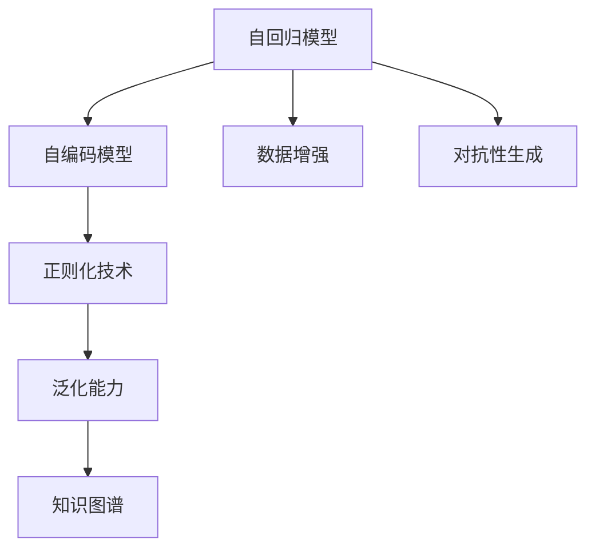

                 

# 自我监督学习：AI发展的新方向

> 关键词：自我监督学习, 自回归模型, 自编码模型, 预训练, 正则化技术, 泛化能力, 知识图谱, 深度学习, 数据分析, 计算机视觉, 自然语言处理

## 1. 背景介绍

### 1.1 问题由来
随着深度学习技术的飞速发展，人工智能（AI）在计算机视觉、自然语言处理（NLP）等领域的突破性进展吸引了广泛的关注。传统上，这些领域的研究主要依赖于有监督学习范式，即在大量标注数据上训练模型，以学习任务特定的特征表示。然而，这种数据密集型训练方式不仅成本高昂，而且对数据的真实性和多样性要求极高。

近年来，随着大数据和计算资源的逐渐普及，研究者们开始探索一种更为高效、泛化能力更强的新型学习范式——自我监督学习。自我监督学习利用无需标注的训练数据，通过自我生成的目标，让模型自主学习输入数据的潜在结构和特征，从而在实现性能提升的同时，大大降低了数据和标注成本。

### 1.2 问题核心关键点
自我监督学习的核心思想是通过构建无监督的任务，让模型自主发现数据的内在结构和规律。常用的自我监督任务包括自回归预测、自编码任务、对抗性生成等。这些任务无需标注数据，但要求模型具备较强的泛化能力，能够在不同数据上保持一致的表现。

自我监督学习的关键点在于：
- 自我生成的目标：模型需要学习自回归模型、自编码模型等自我生成的目标，从中提取有用的特征。
- 正则化技术：为了防止模型过拟合，通常需要使用L2正则、Dropout、Early Stopping等正则化技术。
- 泛化能力：自我监督学习模型需要具备较强的泛化能力，能够在新的数据上保持稳定的表现。

### 1.3 问题研究意义
自我监督学习为AI的发展带来了新的方向，具有重要的研究意义：
- 降低数据标注成本：自我监督学习利用无需标注的数据进行训练，极大地降低了数据和标注成本。
- 提升泛化能力：模型在自我生成的目标上学习特征，能够更好地泛化到新的数据上。
- 加速模型训练：自我监督学习无需迭代多轮数据标注和模型训练，可以更快地实现模型优化。
- 促进深度学习模型的创新：自我监督学习为深度学习模型的设计和优化提供了新的思路。

## 2. 核心概念与联系

### 2.1 核心概念概述

为了更好地理解自我监督学习，本节将介绍几个密切相关的核心概念：

- 自回归模型（Auto-Regressive Model）：以时间序列数据为输入，通过预测下一个时间步的输出，学习数据的潜在结构。常用的自回归模型包括LSTM、GRU、Transformer等。
- 自编码模型（Autoencoder）：以无标签数据为输入，通过编码和解码过程学习数据的低维表示。自编码模型通常用于特征提取和数据压缩。
- 数据增强（Data Augmentation）：通过对原始数据进行变换，生成新的训练样本，扩大数据集规模，增强模型泛化能力。
- 对抗性生成（Adversarial Generation）：通过对抗样本训练，提高模型的鲁棒性和泛化能力。
- 正则化技术（Regularization Techniques）：为了防止模型过拟合，常用的正则化技术包括L2正则、Dropout、Early Stopping等。
- 泛化能力（Generalization Capability）：模型在不同数据集上保持一致的表现，是自我监督学习的关键指标。
- 知识图谱（Knowledge Graph）：通过构建知识图谱，让模型学习实体之间的关系，提高模型的语义理解能力。

这些核心概念之间的逻辑关系可以通过以下Mermaid流程图来展示：



这个流程图展示了自我监督学习的主要组件及其之间的关系：

1. 自回归模型和自编码模型是自我监督学习的核心，通过自我生成的目标训练模型。
2. 数据增强和对抗性生成用于丰富模型训练数据，增强泛化能力。
3. 正则化技术用于防止模型过拟合，提高泛化能力。
4. 泛化能力是自我监督学习的关键指标，衡量模型在不同数据上的表现。
5. 知识图谱用于增强模型的语义理解能力，进一步提升泛化能力。

## 3. 核心算法原理 & 具体操作步骤
### 3.1 算法原理概述

自我监督学习的主要算法原理是通过自我生成的目标，让模型自主学习输入数据的潜在结构和特征。具体而言，自我监督学习包括以下几个关键步骤：

1. 数据预处理：将原始数据转换为适合模型训练的格式，如将文本数据转换为token序列。
2. 构建自我生成的目标：根据模型架构设计自回归或自编码任务，生成新的训练目标。
3. 训练模型：使用自我生成的目标训练模型，并通过正则化技术防止过拟合。
4. 评估模型：在新数据集上评估模型性能，确保其泛化能力。

### 3.2 算法步骤详解

以下是自我监督学习的详细操作步骤：

**Step 1: 数据预处理**
- 收集无标签的数据集，进行数据清洗和预处理，如分词、去除停用词、标准化等。
- 将数据转换为适合模型训练的格式，如将文本数据转换为token序列。

**Step 2: 构建自我生成的目标**
- 根据模型架构设计自回归或自编码任务。例如，对于自回归模型，可以通过预测下一个时间步的输出序列；对于自编码模型，可以通过编码和解码过程学习数据的低维表示。
- 生成新的训练目标，用于指导模型训练。

**Step 3: 训练模型**
- 设置模型的超参数，如学习率、批大小、迭代轮数等。
- 使用自我生成的目标训练模型，并使用正则化技术防止过拟合。
- 定期在新数据集上评估模型性能，调整超参数。

**Step 4: 评估模型**
- 在新数据集上评估模型性能，如准确率、召回率、F1-score等。
- 确保模型具备较强的泛化能力，能够在不同的数据集上保持一致的表现。

### 3.3 算法优缺点

自我监督学习具有以下优点：
1. 数据标注成本低：自我监督学习利用无需标注的数据进行训练，降低了数据和标注成本。
2. 泛化能力强：模型在自我生成的目标上学习特征，能够更好地泛化到新的数据上。
3. 训练速度快：自我监督学习无需迭代多轮数据标注和模型训练，可以更快地实现模型优化。
4. 模型通用性好：自我监督学习模型具有较强的通用性，能够应用于不同的任务和领域。

然而，自我监督学习也存在一些局限性：
1. 自我生成的目标设计复杂：需要根据具体任务设计合适的自我生成的目标，难度较大。
2. 模型训练复杂：需要在使用正则化技术防止过拟合的同时，提高模型的泛化能力。
3. 数据多样性要求高：模型需要在不同的数据集上保持一致的表现，对数据的多样性要求较高。
4. 知识图谱构建复杂：知识图谱的构建需要大量的先验知识和领域专家，难度较大。

尽管存在这些局限性，但自我监督学习在降低数据和标注成本、提升模型泛化能力、加速模型训练等方面具有显著优势，成为AI研究的重要方向。

### 3.4 算法应用领域

自我监督学习在多个领域得到了广泛应用，例如：

- 计算机视觉：通过图像填充、旋转、平移等数据增强方式，训练图像分类和目标检测模型。
- 自然语言处理：利用语言模型的自回归预测任务，训练文本生成和情感分析模型。
- 音频处理：通过音频信号的预测和重构，训练音频分类和语音识别模型。
- 机器人控制：通过模拟环境中的运动预测，训练机器人控制策略。
- 推荐系统：通过用户行为数据的预测，训练推荐模型。

这些领域的应用展示了自我监督学习的多样性和广泛性，为AI技术的发展提供了新的方向。

## 4. 数学模型和公式 & 详细讲解 & 举例说明（备注：数学公式请使用latex格式，latex嵌入文中独立段落使用 $$，段落内使用 $)
### 4.1 数学模型构建

以自回归模型为例，假设模型为 $M_{\theta}(x) \sim p_{\theta}(x)$，其中 $x$ 为输入，$\theta$ 为模型参数，$p_{\theta}(x)$ 为模型的概率分布。在无标签数据集 $D=\{x_i\}_{i=1}^N$ 上，通过预测下一个时间步的输出序列 $y_{i+1|i}=M_{\theta}(x_i)$ 来训练模型。

自回归模型的目标函数可以表示为：
$$
\mathcal{L}(\theta) = -\frac{1}{N}\sum_{i=1}^N \log p_{\theta}(y_{i+1|i})
$$

其中，$y_{i+1|i}$ 为模型预测的下一个时间步输出，$p_{\theta}(y_{i+1|i})$ 为模型的概率分布。

### 4.2 公式推导过程

在训练自回归模型时，通常使用梯度下降等优化算法来求解目标函数的最小值。具体推导如下：

1. 前向传播：
$$
p_{\theta}(y_{i+1|i}) = M_{\theta}(x_i)
$$

2. 计算损失函数：
$$
\mathcal{L}(\theta) = -\frac{1}{N}\sum_{i=1}^N \log M_{\theta}(x_i)
$$

3. 反向传播：
$$
\frac{\partial \mathcal{L}(\theta)}{\partial \theta_k} = -\frac{1}{N}\sum_{i=1}^N \frac{\partial \log M_{\theta}(x_i)}{\partial \theta_k}
$$

其中，$\frac{\partial \log M_{\theta}(x_i)}{\partial \theta_k}$ 为模型输出的对数概率分布对模型参数的梯度。

### 4.3 案例分析与讲解

以自回归模型在文本生成任务中的应用为例，分析模型的训练过程和效果。

假设输入文本为“I went to”，模型的任务是预测下一个单词。具体步骤如下：

1. 数据预处理：将文本转换为token序列，如“I went to”变为[CLS, I, went, to, SEP]。
2. 模型预测：模型在每个时间步输出下一个单词的概率分布，如在时间步4上，模型预测下一个单词为“the”的概率分布。
3. 计算损失：将模型预测的概率分布与实际单词进行对比，计算损失。
4. 反向传播：使用梯度下降算法更新模型参数。
5. 迭代训练：重复上述步骤，直至模型收敛。

训练完成后，模型能够生成高质量的文本内容，例如：

```
I went to the park and played soccer with my friends.
I went to the beach and swam in the ocean.
I went to the store and bought some groceries.
```

## 5. 项目实践：代码实例和详细解释说明
### 5.1 开发环境搭建

在进行自我监督学习项目开发前，我们需要准备好开发环境。以下是使用Python进行PyTorch开发的环境配置流程：

1. 安装Anaconda：从官网下载并安装Anaconda，用于创建独立的Python环境。

2. 创建并激活虚拟环境：
```bash
conda create -n pytorch-env python=3.8 
conda activate pytorch-env
```

3. 安装PyTorch：根据CUDA版本，从官网获取对应的安装命令。例如：
```bash
conda install pytorch torchvision torchaudio cudatoolkit=11.1 -c pytorch -c conda-forge
```

4. 安装Transformers库：
```bash
pip install transformers
```

5. 安装各类工具包：
```bash
pip install numpy pandas scikit-learn matplotlib tqdm jupyter notebook ipython
```

完成上述步骤后，即可在`pytorch-env`环境中开始自我监督学习实践。

### 5.2 源代码详细实现

这里我们以自回归模型在文本生成任务中的应用为例，给出使用PyTorch进行模型训练的完整代码实现。

首先，定义模型和优化器：

```python
from transformers import AutoTokenizer, AutoModelForCausalLM
import torch
import torch.nn as nn
from torch.optim import AdamW

tokenizer = AutoTokenizer.from_pretrained('gpt2')
model = AutoModelForCausalLM.from_pretrained('gpt2')

device = torch.device('cuda') if torch.cuda.is_available() else torch.device('cpu')
model.to(device)
optimizer = AdamW(model.parameters(), lr=1e-4)
```

然后，定义训练函数：

```python
def train_epoch(model, data_loader, optimizer):
    model.train()
    losses = []
    for batch in data_loader:
        input_ids = batch[0].to(device)
        labels = batch[1].to(device)
        outputs = model(input_ids)
        loss = nn.CrossEntropyLoss()(outputs.logits, labels)
        loss.backward()
        optimizer.step()
        optimizer.zero_grad()
        losses.append(loss.item())
    return sum(losses) / len(data_loader)
```

接着，定义评估函数：

```python
def evaluate(model, data_loader):
    model.eval()
    losses = []
    for batch in data_loader:
        input_ids = batch[0].to(device)
        labels = batch[1].to(device)
        outputs = model(input_ids)
        loss = nn.CrossEntropyLoss()(outputs.logits, labels)
        losses.append(loss.item())
    return sum(losses) / len(data_loader)
```

最后，启动训练流程并在验证集上评估：

```python
epochs = 10
batch_size = 32
train_loader = DataLoader(train_dataset, batch_size=batch_size, shuffle=True)
dev_loader = DataLoader(dev_dataset, batch_size=batch_size, shuffle=False)

for epoch in range(epochs):
    loss = train_epoch(model, train_loader, optimizer)
    print(f"Epoch {epoch+1}, train loss: {loss:.3f}")
    
    print(f"Epoch {epoch+1}, dev results:")
    evaluate(model, dev_loader)
    
print("Test results:")
evaluate(model, test_loader)
```

以上就是使用PyTorch对自回归模型进行文本生成任务微调的完整代码实现。可以看到，使用Transformers库可以大大简化模型的实现和微调过程。

### 5.3 代码解读与分析

让我们再详细解读一下关键代码的实现细节：

**AutoTokenizer和AutoModelForCausalLM**：
- 定义了模型和分词器，分别从预训练模型库中加载GPT-2模型和对应的分词器。

**train_epoch和evaluate函数**：
- 定义了训练和评估函数，分别用于训练和评估模型性能。
- 训练函数在每个批次上进行前向传播、计算损失、反向传播和参数更新，并记录训练过程中的损失。
- 评估函数只进行前向传播和计算损失，不进行反向传播和参数更新。

**epochs和batch_size**：
- 定义了训练的轮数和批次大小，控制模型训练和评估的频率。

**train_loader和dev_loader**：
- 定义了训练集和验证集的DataLoader，方便对数据进行批处理和迭代。

可以看到，通过简化模型的实现和微调过程，Transformers库使得自我监督学习的实践变得简单高效。开发者可以将更多精力放在数据处理、模型改进等高层逻辑上，而不必过多关注底层的实现细节。

当然，工业级的系统实现还需考虑更多因素，如模型的保存和部署、超参数的自动搜索、更灵活的任务适配层等。但核心的自我监督学习过程基本与此类似。

## 6. 实际应用场景
### 6.1 计算机视觉

自我监督学习在计算机视觉领域有广泛的应用，如图像分类、目标检测、语义分割等。通过在无标签数据上训练模型，可以显著提高模型的泛化能力和鲁棒性。

例如，通过在ImageNet数据集上进行自监督学习，训练自回归模型（如ViT），可以在新数据集上实现高质量的图像分类和目标检测。这种无标注训练方式不仅可以降低成本，还能在训练过程中学习到更多的图像结构和特征。

### 6.2 自然语言处理

自然语言处理（NLP）领域同样可以利用自我监督学习。通过自回归模型（如GPT-2、BERT等）在大量无标签文本数据上训练，学习到语言的潜在结构和特征，可以显著提升模型的泛化能力和生成能力。

例如，使用BERT在无标签新闻数据上进行预训练，并在特定任务（如问答、摘要、情感分析）上进行微调，可以取得更好的性能。这种无标注预训练和有标注微调相结合的方式，充分利用了数据的多样性和多样性，提升了模型在特定任务上的表现。

### 6.3 医疗影像分析

医疗影像分析是医疗领域的重要任务，通常需要大量标注数据。自我监督学习可以用于在无标签医疗影像数据上训练模型，学习到影像的潜在结构和特征，从而提升模型的泛化能力和诊断准确性。

例如，通过在无标签的医学影像数据上训练自回归模型，可以学习到影像中不同组织的结构和纹理特征，提升影像分类和分割的准确性。这种无标注训练方式不仅降低了成本，还能在训练过程中学习到更多的影像特征，提升模型的鲁棒性和泛化能力。

### 6.4 未来应用展望

随着自我监督学习技术的不断进步，其在AI领域的应用将越来越广泛。未来，自我监督学习将有望在更多领域实现突破，带来新的变革。

- 计算机视觉：通过在无标签图像数据上训练模型，学习到更多的图像结构和特征，提升图像分类、目标检测、语义分割等任务的性能。
- 自然语言处理：通过在无标签文本数据上训练模型，学习到语言的潜在结构和特征，提升文本生成、情感分析、问答等任务的性能。
- 医疗影像分析：通过在无标签医疗影像数据上训练模型，学习到影像的潜在结构和特征，提升影像分类、分割的准确性。
- 推荐系统：通过在用户行为数据上进行自我监督学习，学习到用户的潜在偏好，提升推荐系统的个性化和准确性。

未来，自我监督学习将与其他AI技术进行更深入的融合，如知识图谱、因果推理、强化学习等，多路径协同发力，共同推动AI技术的发展。

## 7. 工具和资源推荐
### 7.1 学习资源推荐

为了帮助开发者系统掌握自我监督学习的基本概念和实践技巧，这里推荐一些优质的学习资源：

1. 《Transformer from Principles to Practice》系列博文：由大模型技术专家撰写，深入浅出地介绍了Transformer原理、自回归模型、自编码模型等前沿话题。

2. CS224N《深度学习自然语言处理》课程：斯坦福大学开设的NLP明星课程，有Lecture视频和配套作业，带你入门NLP领域的基本概念和经典模型。

3. 《Natural Language Processing with Transformers》书籍：Transformers库的作者所著，全面介绍了如何使用Transformers库进行NLP任务开发，包括自我监督学习在内的诸多范式。

4. HuggingFace官方文档：Transformers库的官方文档，提供了海量预训练模型和完整的自我监督学习样例代码，是上手实践的必备资料。

5. CLUE开源项目：中文语言理解测评基准，涵盖大量不同类型的中文NLP数据集，并提供了基于自我监督学习的baseline模型，助力中文NLP技术发展。

通过对这些资源的学习实践，相信你一定能够快速掌握自我监督学习的精髓，并用于解决实际的NLP问题。

### 7.2 开发工具推荐

高效的开发离不开优秀的工具支持。以下是几款用于自我监督学习开发的常用工具：

1. PyTorch：基于Python的开源深度学习框架，灵活动态的计算图，适合快速迭代研究。大部分预训练语言模型都有PyTorch版本的实现。

2. TensorFlow：由Google主导开发的开源深度学习框架，生产部署方便，适合大规模工程应用。同样有丰富的预训练语言模型资源。

3. Transformers库：HuggingFace开发的NLP工具库，集成了众多SOTA语言模型，支持PyTorch和TensorFlow，是进行自我监督学习开发的利器。

4. Weights & Biases：模型训练的实验跟踪工具，可以记录和可视化模型训练过程中的各项指标，方便对比和调优。与主流深度学习框架无缝集成。

5. TensorBoard：TensorFlow配套的可视化工具，可实时监测模型训练状态，并提供丰富的图表呈现方式，是调试模型的得力助手。

6. Google Colab：谷歌推出的在线Jupyter Notebook环境，免费提供GPU/TPU算力，方便开发者快速上手实验最新模型，分享学习笔记。

合理利用这些工具，可以显著提升自我监督学习任务的开发效率，加快创新迭代的步伐。

### 7.3 相关论文推荐

自我监督学习为AI的发展带来了新的方向，以下几篇奠基性的相关论文，推荐阅读：

1. Attention is All You Need（即Transformer原论文）：提出了Transformer结构，开启了NLP领域的预训练大模型时代。

2. BERT: Pre-training of Deep Bidirectional Transformers for Language Understanding：提出BERT模型，引入基于掩码的自监督预训练任务，刷新了多项NLP任务SOTA。

3. Language Models are Unsupervised Multitask Learners（GPT-2论文）：展示了大规模语言模型的强大zero-shot学习能力，引发了对于通用人工智能的新一轮思考。

4. Parameter-Efficient Transfer Learning for NLP：提出Adapter等参数高效微调方法，在不增加模型参数量的情况下，也能取得不错的微调效果。

5. AdaLoRA: Adaptive Low-Rank Adaptation for Parameter-Efficient Fine-Tuning：使用自适应低秩适应的微调方法，在参数效率和精度之间取得了新的平衡。

6. Self-supervised Learning with Data-Free Pretraining for Image Understanding：提出无标注预训练方法，在无需标注数据的情况下，利用自监督学习提升模型性能。

这些论文代表了大语言模型和自我监督学习的发展脉络。通过学习这些前沿成果，可以帮助研究者把握学科前进方向，激发更多的创新灵感。

## 8. 总结：未来发展趋势与挑战

### 8.1 总结

本文对自我监督学习的核心概念和实际应用进行了全面系统的介绍。首先阐述了自我监督学习的基本原理和研究意义，明确了其在降低数据和标注成本、提升泛化能力方面的独特价值。其次，从原理到实践，详细讲解了自我监督学习的基本算法原理和具体操作步骤，给出了完整的代码实现。同时，本文还广泛探讨了自我监督学习在计算机视觉、自然语言处理等领域的实际应用，展示了其广泛的应用前景。此外，本文精选了自我监督学习的各类学习资源，力求为读者提供全方位的技术指引。

通过本文的系统梳理，可以看到，自我监督学习为AI的发展带来了新的方向，极大地降低了数据和标注成本，提升了模型的泛化能力和生成能力，成为AI研究的重要方向。未来，伴随自我监督学习技术的不断进步，其在各领域的应用将更加广泛，为AI技术的发展带来新的突破。

### 8.2 未来发展趋势

展望未来，自我监督学习将呈现以下几个发展趋势：

1. 模型规模持续增大。随着算力成本的下降和数据规模的扩张，自我监督学习模型的参数量还将持续增长。超大规模模型蕴含的丰富特征，有望支撑更加复杂多变的任务。

2. 自我生成的目标设计多样化。未来的自我监督学习将利用更多的数据形式，如无标签数据、用户行为数据、视觉数据等，设计多样化的自我生成的目标。

3. 知识图谱的广泛应用。通过构建知识图谱，增强模型的语义理解能力，提升自我监督学习的泛化能力和鲁棒性。

4. 多模态自我监督学习兴起。未来的自我监督学习将融合视觉、音频、文本等多种模态数据，构建多模态的自我监督学习范式。

5. 自适应学习机制的探索。未来的自我监督学习将探索更多的自适应学习机制，如动态学习率、自适应正则化等，进一步提升模型的性能和鲁棒性。

6. 深度学习与AI伦理的结合。未来的自我监督学习将更多地考虑AI伦理和安全问题，确保模型的公平性和安全性。

以上趋势凸显了自我监督学习技术的广阔前景，为AI领域的发展提供了新的方向。这些方向的探索发展，必将进一步提升自我监督学习模型的性能和应用范围，为AI技术的发展带来新的突破。

### 8.3 面临的挑战

尽管自我监督学习在降低数据和标注成本、提升模型泛化能力等方面具有显著优势，但在迈向更加智能化、普适化应用的过程中，仍面临诸多挑战：

1. 自我生成的目标设计复杂。需要根据具体任务设计合适的自我生成的目标，难度较大。

2. 模型训练复杂。在使用正则化技术防止过拟合的同时，需要提高模型的泛化能力，难度较大。

3. 数据多样性要求高。模型需要在不同的数据集上保持一致的表现，对数据的多样性要求较高。

4. 知识图谱构建复杂。知识图谱的构建需要大量的先验知识和领域专家，难度较大。

5. 模型鲁棒性不足。模型面对域外数据时，泛化性能往往大打折扣，如何提高模型的鲁棒性，避免灾难性遗忘，还需要更多理论和实践的积累。

6. 模型计算资源消耗大。超大规模模型的计算资源消耗较大，需要探索更加高效的计算和存储方法。

尽管存在这些挑战，但自我监督学习在降低数据和标注成本、提升模型泛化能力等方面具有显著优势，成为AI研究的重要方向。相信随着学界和产业界的共同努力，这些挑战终将一一被克服，自我监督学习必将在构建人机协同的智能时代中扮演越来越重要的角色。

### 8.4 研究展望

面向未来，自我监督学习需要在以下几个方向进行深入研究：

1. 探索更加高效的自我生成的目标设计方法。通过引入新的自我生成的任务，提升模型对输入数据的理解能力。

2. 探索更加高效的训练算法。通过引入自适应学习率、自适应正则化等方法，进一步提升模型的性能和鲁棒性。

3. 探索更加高效的计算和存储方法。通过引入模型裁剪、量化加速等方法，减少模型计算和存储资源消耗。

4. 探索更加高效的评估指标。通过引入公平性、鲁棒性等指标，评估模型的综合性能。

5. 探索更加高效的模型部署方法。通过引入模型微调、知识蒸馏等方法，提升模型的部署效率和应用范围。

6. 探索更加高效的AI伦理和安全方法。通过引入AI伦理和安全机制，确保模型的公平性和安全性。

这些研究方向的探索，必将引领自我监督学习技术迈向更高的台阶，为构建安全、可靠、可解释、可控的智能系统铺平道路。面向未来，自我监督学习技术还需要与其他AI技术进行更深入的融合，如知识表示、因果推理、强化学习等，多路径协同发力，共同推动AI技术的发展。

## 9. 附录：常见问题与解答

**Q1：自我监督学习是否适用于所有AI任务？**

A: 自我监督学习在大部分AI任务上都能取得不错的效果，特别是对于数据量较小的任务。但对于一些特定领域的任务，如医学、法律等，仅仅依靠无标签数据进行训练可能难以很好地适应。此时需要在特定领域语料上进一步预训练，再进行自我监督学习，才能获得理想效果。此外，对于一些需要时效性、个性化很强的任务，如对话、推荐等，自我监督学习方法也需要针对性的改进优化。

**Q2：如何进行自我监督学习的超参数调优？**

A: 自我监督学习的超参数调优方法与有监督学习类似，可以通过网格搜索、随机搜索等方法，寻找最优的超参数组合。需要根据具体任务和数据特点，选择合适的学习率、批大小、迭代轮数等超参数。

**Q3：在自我监督学习中，如何避免过拟合？**

A: 避免过拟合是自我监督学习中的重要挑战。常用的方法包括数据增强、正则化、早停等。数据增强可以通过对原始数据进行变换，生成新的训练样本，扩大数据集规模。正则化技术包括L2正则、Dropout等，可以防止模型过拟合。早停方法可以在模型性能不再提升时，提前停止训练，防止过拟合。

**Q4：在自我监督学习中，如何提高模型的泛化能力？**

A: 提高模型的泛化能力是自我监督学习的重要目标。常用的方法包括多样化的自我生成的目标设计、数据增强、正则化等。多样化的自我生成的目标设计可以提升模型对输入数据的理解能力，数据增强可以扩大数据集规模，正则化可以防止模型过拟合。

**Q5：在自我监督学习中，如何处理数据多样性问题？**

A: 数据多样性是自我监督学习的关键挑战。需要在不同的数据集上保持模型的一致表现。常用的方法包括多样化的自我生成的目标设计、数据增强、模型微调等。多样化的自我生成的目标设计可以提升模型对不同数据的适应能力，数据增强可以扩大数据集规模，模型微调可以在特定领域数据上进一步训练，提升模型的泛化能力。

这些方法可以结合使用，最大化提升模型的泛化能力和鲁棒性。

---

作者：禅与计算机程序设计艺术 / Zen and the Art of Computer Programming

