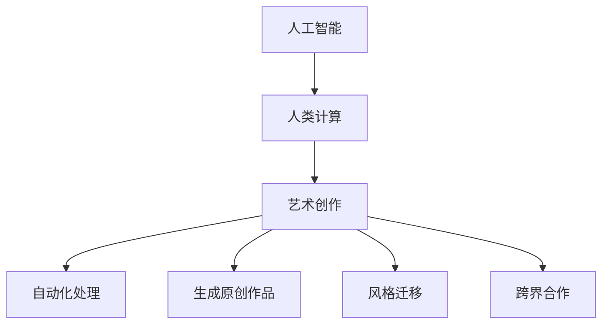

                 

# 艺术与科技的融合：人类计算激发创意

## 1. 背景介绍

### 1.1 问题由来

近年来，随着计算技术的飞速发展，人工智能(AI)技术在各领域的应用日益广泛，人类计算与艺术创作的融合也在不断地深入。人工智能不仅能够在艺术创作中提供技术支持，还催生了新兴的艺术表现形式和创作工具，甚至引发了人类对艺术本质的重新思考。

人工智能在艺术创作中的应用，已经从简单的自动化处理和数据分析，发展到能够生成原创性作品、参与复杂创作过程，甚至模仿人类艺术家的独特风格和表现手法。例如，AI在绘画、音乐、诗歌创作等方面的应用，不仅提高了创作的效率和精度，还为艺术创作带来了新的灵感和可能性。

### 1.2 问题核心关键点

本节将探讨人工智能在艺术创作中的具体应用方式和其对艺术领域的影响。

- 人工智能在艺术创作中的应用：自动化处理、生成原创作品、风格模仿和跨界合作。
- 人工智能对艺术创作的影响：提高创作效率、激发创作灵感、开拓创作形式和改变创作生态。
- 人工智能与人类艺术的未来关系：AI在艺术创作中的角色定位、创作伦理、未来发展趋势和挑战。

## 2. 核心概念与联系

### 2.1 核心概念概述

为更好地理解人工智能在艺术创作中的应用，本节将介绍几个关键概念：

- 人工智能(AI)：通过模拟人类智能行为和思维过程，实现对复杂任务的处理和创造的计算机技术。
- 人类计算：指利用计算机技术解决人类智慧活动中遇到的问题，包括艺术创作中的计算和创作。
- 人工智能在艺术创作中的应用：利用机器学习、深度学习等技术，实现艺术作品生成、风格迁移、自动化创作等。
- 人工智能与艺术的融合：通过AI技术在艺术创作中的嵌入，使得艺术创作过程更加智能化、自动化和高效化。

### 2.2 核心概念原理和架构的 Mermaid 流程图



这个流程图展示了人工智能与艺术创作之间的联系：

1. 人工智能技术通过模拟人类智能行为，被嵌入到艺术创作过程中。
2. 人类计算技术为艺术创作提供了计算和数据分析的基础，帮助艺术家处理复杂的创作任务。
3. 自动化处理、生成原创作品、风格迁移和跨界合作都是人工智能在艺术创作中的具体应用形式。

## 3. 核心算法原理 & 具体操作步骤

### 3.1 算法原理概述

人工智能在艺术创作中的应用，主要依赖于以下几个核心算法：

- 生成对抗网络(GAN)：通过两个神经网络相互竞争，生成具有艺术价值的原创作品。
- 风格迁移(Style Transfer)：利用深度学习技术，将一张图像的风格迁移到另一张图像上，实现风格的重构。
- 自动化创作系统：通过机器学习模型，自动生成艺术作品，如音乐、诗歌、绘画等。
- 人工智能助手：利用自然语言处理技术，辅助艺术家进行创作规划和素材搜索。

### 3.2 算法步骤详解

#### 3.2.1 生成对抗网络(GAN)

生成对抗网络由两个神经网络组成：生成器和判别器。生成器负责生成逼真的艺术作品，判别器负责判断生成作品的真实性。通过这两个网络的对抗训练，生成器不断提升生成作品的质量，最终生成具有艺术价值的原创作品。

具体步骤如下：

1. 准备数据集：收集大量艺术作品作为训练数据。
2. 设计生成器和判别器：使用卷积神经网络设计生成器和判别器，并设定其目标函数。
3. 对抗训练：交替训练生成器和判别器，使生成器生成的作品越来越接近真实作品，判别器也越来越难以区分。
4. 生成艺术作品：训练完成后，生成器可以独立生成高质量的艺术作品。

#### 3.2.2 风格迁移(Style Transfer)

风格迁移算法通常分为两个步骤：特征提取和风格转换。

1. 特征提取：利用预训练的卷积神经网络，提取输入图像的特征表示。
2. 风格转换：通过调整特征表示，实现风格迁移。

具体步骤如下：

1. 准备数据集：收集大量艺术作品作为训练数据。
2. 设计迁移模型：使用卷积神经网络提取输入图像和风格图像的特征表示。
3. 特征转换：将输入图像的特征表示与风格图像的特征表示融合，生成风格迁移后的图像。
4. 调整超参数：通过调整特征转换的权重和强度，优化风格迁移的效果。

#### 3.2.3 自动化创作系统

自动化创作系统通常依赖于深度学习模型，如循环神经网络(RNN)、变压器(Transformer)等。通过训练模型，可以生成各种类型的艺术作品。

具体步骤如下：

1. 准备数据集：收集大量艺术作品作为训练数据。
2. 设计创作模型：使用RNN、Transformer等模型，并设定创作目标。
3. 训练模型：通过监督学习，训练创作模型生成艺术作品。
4. 生成艺术作品：训练完成后，创作模型可以独立生成艺术作品。

#### 3.2.4 人工智能助手

人工智能助手通常依赖于自然语言处理技术，如语言模型、意图识别等。通过训练模型，可以辅助艺术家进行创作规划和素材搜索。

具体步骤如下：

1. 准备数据集：收集大量艺术作品和相关的描述信息作为训练数据。
2. 设计助手模型：使用语言模型、意图识别等技术，并设定助手目标。
3. 训练模型：通过监督学习，训练助手模型提供创作建议和素材推荐。
4. 辅助创作：训练完成后，助手模型可以独立辅助艺术家进行创作。

### 3.3 算法优缺点

人工智能在艺术创作中的应用，具有以下优点：

- 提高创作效率：通过自动化处理和生成原创作品，大大提高了艺术创作的效率。
- 激发创作灵感：AI的创新性和随机性，能够激发艺术家的灵感，产生新的创作思路。
- 开拓创作形式：AI能够探索人类难以达到的创作形式和风格，开拓艺术创作的边界。

然而，人工智能在艺术创作中也存在一些缺点：

- 缺乏人类情感：AI生成的作品可能缺乏人类情感的深度和复杂性，难以传递真正的艺术情感。
- 创作伦理问题：AI的创作过程中可能涉及版权、隐私等问题，引发创作伦理的争议。
- 对人类艺术家的威胁：AI的强大创作能力，可能对传统的人类艺术家构成威胁，引发对AI在艺术创作中角色的思考。

### 3.4 算法应用领域

人工智能在艺术创作中的应用已经涵盖了多个领域，包括：

- 视觉艺术：绘画、雕塑、摄影等。
- 音乐创作：作曲、演奏、编曲等。
- 文学创作：诗歌、小说、剧本等。
- 舞蹈和表演：编舞、表演、特效等。

## 4. 数学模型和公式 & 详细讲解 & 举例说明

### 4.1 数学模型构建

本节将使用数学语言对人工智能在艺术创作中的应用进行更加严格的刻画。

设 $G$ 为生成网络，$D$ 为判别网络。定义生成器和判别器的损失函数为 $L_{G/D}$，则生成对抗网络的训练目标函数为：

$$
\min_G \max_D V(G,D) = \mathbb{E}_{x \sim p_x} [D(x)] + \mathbb{E}_{z \sim p_z} [D(G(z))]
$$

其中 $V(G,D)$ 为对抗游戏价值函数，$x$ 为真实图像，$z$ 为噪声向量，$p_x$ 为真实图像分布，$p_z$ 为噪声分布。

对于风格迁移，设 $F$ 为特征提取网络，$M$ 为风格迁移网络。定义特征提取和风格迁移的损失函数为 $L_{F/M}$，则风格迁移的目标函数为：

$$
\min_F \max_M \mathcal{L}(F,M) = \mathbb{E}_{x \sim p_x} [\| F(x) - F_G(x) \|] + \mathbb{E}_{x \sim p_x} [\| M(F(x)) - M_G(x) \|]
$$

其中 $F_G$ 和 $M_G$ 分别为生成器和判别器的模型参数，$\| \cdot \|$ 为L2范数。

### 4.2 公式推导过程

以下是生成对抗网络和风格迁移算法的公式推导。

**生成对抗网络(GAN)**

生成对抗网络的目标函数为：

$$
\min_G \max_D V(G,D) = \mathbb{E}_{x \sim p_x} [D(x)] + \mathbb{E}_{z \sim p_z} [D(G(z))]
$$

其中 $x$ 为真实图像，$z$ 为噪声向量，$p_x$ 为真实图像分布，$p_z$ 为噪声分布。

生成器和判别器的目标函数分别为：

$$
\min_G \mathbb{E}_{z \sim p_z} [D(G(z))]
$$

$$
\max_D -\mathbb{E}_{x \sim p_x} [D(x)] + \mathbb{E}_{z \sim p_z} [D(G(z))]
$$

生成器的梯度更新公式为：

$$
\frac{\partial \mathcal{L}_G}{\partial G} = \nabla_{G} \mathbb{E}_{z \sim p_z} [D(G(z))]
$$

判别器的梯度更新公式为：

$$
\frac{\partial \mathcal{L}_D}{\partial D} = -\nabla_{D} \mathbb{E}_{x \sim p_x} [D(x)] + \nabla_{D} \mathbb{E}_{z \sim p_z} [D(G(z))]
$$

**风格迁移(Style Transfer)**

风格迁移的目标函数为：

$$
\min_F \max_M \mathcal{L}(F,M) = \mathbb{E}_{x \sim p_x} [\| F(x) - F_G(x) \|] + \mathbb{E}_{x \sim p_x} [\| M(F(x)) - M_G(x) \|]
$$

其中 $F$ 为特征提取网络，$M$ 为风格迁移网络，$F_G$ 和 $M_G$ 分别为生成器和判别器的模型参数。

特征提取和风格迁移的梯度更新公式分别为：

$$
\frac{\partial \mathcal{L}_F}{\partial F} = -\nabla_{F} \mathbb{E}_{x \sim p_x} [\| F(x) - F_G(x) \|]
$$

$$
\frac{\partial \mathcal{L}_M}{\partial M} = -\nabla_{M} \mathbb{E}_{x \sim p_x} [\| M(F(x)) - M_G(x) \|]
$$

### 4.3 案例分析与讲解

#### 4.3.1 生成对抗网络案例

**案例1：GAN创作水彩画**

通过训练生成对抗网络，生成具有水彩画风格的高质量图像。具体步骤如下：

1. 收集大量水彩画图像作为训练数据。
2. 设计生成器和判别器，使用卷积神经网络。
3. 交替训练生成器和判别器，优化对抗游戏价值函数。
4. 生成高质量的水彩画图像。

**案例2：GAN创作抽象画**

通过生成对抗网络，生成具有抽象画风格的艺术作品。具体步骤如下：

1. 收集大量抽象画图像作为训练数据。
2. 设计生成器和判别器，使用卷积神经网络。
3. 交替训练生成器和判别器，优化对抗游戏价值函数。
4. 生成具有抽象画风格的艺术作品。

#### 4.3.2 风格迁移案例

**案例1：将油画风格迁移到摄影作品上**

通过风格迁移算法，将油画风格迁移到摄影作品上。具体步骤如下：

1. 收集大量油画和摄影作品作为训练数据。
2. 设计特征提取网络和风格迁移网络，使用卷积神经网络。
3. 特征提取和风格迁移的损失函数分别为L2范数。
4. 调整超参数，优化风格迁移的效果。

**案例2：将印象派风格迁移到现代艺术作品中**

通过风格迁移算法，将印象派风格迁移到现代艺术作品中。具体步骤如下：

1. 收集大量印象派和现代艺术作品作为训练数据。
2. 设计特征提取网络和风格迁移网络，使用卷积神经网络。
3. 特征提取和风格迁移的损失函数分别为L2范数。
4. 调整超参数，优化风格迁移的效果。

## 5. 项目实践：代码实例和详细解释说明

### 5.1 开发环境搭建

在进行艺术创作的应用开发前，我们需要准备好开发环境。以下是使用Python进行TensorFlow开发的环境配置流程：

1. 安装Anaconda：从官网下载并安装Anaconda，用于创建独立的Python环境。

2. 创建并激活虚拟环境：
```bash
conda create -n tf-env python=3.8 
conda activate tf-env
```

3. 安装TensorFlow：根据CUDA版本，从官网获取对应的安装命令。例如：
```bash
conda install tensorflow tensorflow-gpu=cuda111 -c conda-forge
```

4. 安装TensorBoard：
```bash
pip install tensorboard
```

5. 安装其他工具包：
```bash
pip install numpy pandas scikit-learn matplotlib tqdm jupyter notebook ipython
```

完成上述步骤后，即可在`tf-env`环境中开始项目实践。

### 5.2 源代码详细实现

这里我们以GAN创作水彩画为例，给出使用TensorFlow实现的艺术创作代码。

首先，定义GAN模型的基本结构和超参数：

```python
import tensorflow as tf
from tensorflow.keras import layers

class Generator(tf.keras.Model):
    def __init__(self, latent_dim):
        super(Generator, self).__init__()
        self.latent_dim = latent_dim
        
        self.dense1 = layers.Dense(256 * 8 * 8, use_bias=False)
        self.dense2 = layers.Dense(512 * 8 * 8, use_bias=False)
        self.dense3 = layers.Dense(1024 * 8 * 8, use_bias=False)
        self.dense4 = layers.Dense(7 * 7 * 256, use_bias=False)
        
        self.reshape = layers.Reshape((7, 7, 256))
        self.conv1 = layers.Conv2DTranspose(128, (5, 5), strides=(1, 1), padding='same', use_bias=False)
        self.conv2 = layers.Conv2DTranspose(64, (5, 5), strides=(2, 2), padding='same', use_bias=False)
        self.conv3 = layers.Conv2DTranspose(1, (5, 5), strides=(1, 1), padding='same', use_bias=False)
        
    def call(self, inputs):
        x = self.dense1(inputs)
        x = layers.LeakyReLU(alpha=0.2)(x)
        x = self.dense2(x)
        x = layers.LeakyReLU(alpha=0.2)(x)
        x = self.dense3(x)
        x = layers.LeakyReLU(alpha=0.2)(x)
        x = self.dense4(x)
        x = layers.LeakyReLU(alpha=0.2)(x)
        x = self.reshape(x)
        x = self.conv1(x)
        x = layers.LeakyReLU(alpha=0.2)(x)
        x = self.conv2(x)
        x = layers.LeakyReLU(alpha=0.2)(x)
        x = self.conv3(x)
        return x

class Discriminator(tf.keras.Model):
    def __init__(self):
        super(Discriminator, self).__init__()
        
        self.conv1 = layers.Conv2D(64, (5, 5), strides=(2, 2), padding='same', use_bias=False)
        self.conv2 = layers.Conv2D(128, (5, 5), strides=(2, 2), padding='same', use_bias=False)
        self.conv3 = layers.Conv2D(256, (5, 5), strides=(2, 2), padding='same', use_bias=False)
        self.flatten = layers.Flatten()
        self.fc1 = layers.Dense(512, use_bias=False)
        self.fc2 = layers.Dense(1, use_bias=False)
        
    def call(self, inputs):
        x = self.conv1(inputs)
        x = layers.LeakyReLU(alpha=0.2)(x)
        x = self.conv2(x)
        x = layers.LeakyReLU(alpha=0.2)(x)
        x = self.conv3(x)
        x = layers.LeakyReLU(alpha=0.2)(x)
        x = self.flatten(x)
        x = self.fc1(x)
        x = layers.LeakyReLU(alpha=0.2)(x)
        x = self.fc2(x)
        return x

latent_dim = 100
img_rows = 7
img_cols = 7
channels = 3
generator = Generator(latent_dim)
discriminator = Discriminator()

generator.compile(loss='binary_crossentropy', optimizer=tf.keras.optimizers.Adam(learning_rate=0.0002))
discriminator.compile(loss='binary_crossentropy', optimizer=tf.keras.optimizers.Adam(learning_rate=0.0002))
```

然后，定义训练函数：

```python
@tf.function
def train_step(images):
    noise = tf.random.normal([batch_size, latent_dim])
    with tf.GradientTape() as gen_tape, tf.GradientTape() as disc_tape:
        generated_images = generator(noise, training=True)
        
        real_output = discriminator(images, training=True)
        fake_output = discriminator(generated_images, training=True)
        
        gen_loss = tf.reduce_mean(tf.keras.losses.BinaryCrossentropy()(fake_output, tf.ones_like(fake_output)))
        disc_loss = tf.reduce_mean(tf.keras.losses.BinaryCrossentropy()(real_output, tf.ones_like(real_output))) + tf.reduce_mean(tf.keras.losses.BinaryCrossentropy()(fake_output, tf.zeros_like(fake_output)))
    
    gradients_of_generator = gen_tape.gradient(gen_loss, generator.trainable_variables)
    gradients_of_discriminator = disc_tape.gradient(disc_loss, discriminator.trainable_variables)
    
    generator.optimizer.apply_gradients(zip(gradients_of_generator, generator.trainable_variables))
    discriminator.optimizer.apply_gradients(zip(gradients_of_discriminator, discriminator.trainable_variables))
```

最后，启动训练流程：

```python
batch_size = 128
epochs = 10000

for epoch in range(epochs):
    for batch in train_dataset:
        train_step(batch)
        
    if epoch % 100 == 0:
        sample_images = generated_images[0:16]
        tf.keras.utils.save_img(f'images/epoch_{epoch+1}.png', sample_images, scale=False)
        print(f'Epoch {epoch+1}')
```

以上就是使用TensorFlow实现的艺术创作代码。可以看到，利用生成对抗网络，我们可以方便地进行艺术创作，生成高质量的艺术作品。

### 5.3 代码解读与分析

让我们再详细解读一下关键代码的实现细节：

**Generator类**：
- `__init__`方法：初始化生成器网络的结构和超参数。
- `call`方法：定义生成器的前向传播过程。

**Discriminator类**：
- `__init__`方法：初始化判别器网络的结构和超参数。
- `call`方法：定义判别器的前向传播过程。

**train_step函数**：
- 定义一个TensorFlow函数，用于计算一个batch的训练过程。
- 生成噪声向量，作为生成器的输入。
- 使用前向传播计算生成器和判别器的输出。
- 计算生成器和判别器的损失函数。
- 反向传播计算生成器和判别器的梯度，并更新模型参数。

**train函数**：
- 定义训练过程的超参数。
- 循环迭代训练，每个epoch输出一次结果。

可以看到，TensorFlow提供了强大的深度学习框架，使得艺术创作的代码实现变得简洁高效。开发者可以将更多精力放在模型设计和数据处理等高层逻辑上，而不必过多关注底层的实现细节。

当然，工业级的系统实现还需考虑更多因素，如模型的保存和部署、超参数的自动搜索、更灵活的任务适配层等。但核心的艺术创作代码基本与此类似。

## 6. 实际应用场景

### 6.1 智能艺术创作

基于人工智能的艺术创作系统，可以在各种场景下提供创作支持，如艺术工作室、在线艺术平台、博物馆等。这些系统可以自动生成各种类型的艺术作品，供艺术家参考和修改。

在技术实现上，可以收集大量艺术作品作为监督数据，训练生成对抗网络和风格迁移模型。利用这些模型，系统可以自动生成符合用户风格和要求的艺术作品。此外，还可以结合AI助手，提供创作建议和素材推荐，帮助艺术家完成创作。

### 6.2 艺术教育

人工智能技术可以为艺术教育提供新的教学工具和方法，帮助学生更好地理解和创作艺术。例如，利用自动化创作系统，学生可以生成各种艺术作品，进行创意实践。利用AI助手，学生可以获取创作建议和反馈，提高创作水平。

在技术实现上，可以设计一个在线艺术创作平台，结合生成对抗网络和AI助手，提供创作工具和资源。学生可以通过平台进行创意实践，并进行作品展示和分享。

### 6.3 虚拟现实艺术

人工智能技术可以结合虚拟现实(VR)技术，创造沉浸式艺术体验。例如，利用生成对抗网络，生成逼真的虚拟场景和角色，供艺术家创作。利用AI助手，帮助艺术家进行场景设计和交互设计。

在技术实现上，可以开发一个虚拟现实艺术创作工具，结合生成对抗网络和AI助手，提供创作环境。艺术家可以在虚拟空间中进行创作和实验，创造出独特的艺术作品。

### 6.4 未来应用展望

随着人工智能和虚拟现实技术的发展，未来的大艺术创作将呈现出更多可能性。

1. 创作工具的智能化：AI助手将更加智能，能够提供更精准的创作建议和素材推荐。生成对抗网络将更加高效，能够生成更高质量的艺术作品。
2. 创作过程的自动化：自动化创作系统将能够进行更复杂的创意生成，甚至生成完全原创的作品。AI助手将能够进行实时创作指导，提供更全面的创作支持。
3. 创作形式的丰富化：人工智能将能够探索更多艺术形式，如交互式艺术、动态艺术、虚拟现实艺术等。虚拟现实技术将与人工智能深度融合，提供全新的艺术创作体验。
4. 创作生态的变革：人工智能将改变艺术创作的生态，艺术家将更多地依赖AI工具进行创作，创作门槛将降低，创作效率将提高。

未来，人工智能和艺术创作的融合将带来更广阔的可能性，激发更多创新和想象。随着技术的进步，艺术创作将更加智能化、自动化和多样化，成为人类智能的重要体现。

## 7. 工具和资源推荐

### 7.1 学习资源推荐

为了帮助开发者系统掌握人工智能在艺术创作中的应用理论基础和实践技巧，这里推荐一些优质的学习资源：

1. Deep Learning Specialization课程：由Andrew Ng教授讲授，涵盖深度学习在计算机视觉、自然语言处理、生成对抗网络等方面的应用，包括艺术创作。

2. Generative Adversarial Networks：Deep Learning Specialization课程的一部分，详细讲解了生成对抗网络的基本原理和实现方法。

3. Style Transfer：Deep Learning Specialization课程的一部分，详细讲解了风格迁移的基本原理和实现方法。

4. Neural Style Transfer：一个开源项目，提供了风格迁移的代码实现，适合入门学习和实践。

5. TensorFlow官方文档：TensorFlow的官方文档，提供了丰富的深度学习资源，包括生成对抗网络和风格迁移的样例代码。

通过对这些资源的学习实践，相信你一定能够快速掌握人工智能在艺术创作中的应用精髓，并用于解决实际的创作问题。

### 7.2 开发工具推荐

高效的开发离不开优秀的工具支持。以下是几款用于艺术创作开发的常用工具：

1. TensorFlow：基于Python的开源深度学习框架，灵活动态的计算图，适合快速迭代研究。TensorFlow提供强大的深度学习模型和工具，支持生成对抗网络和风格迁移等任务。

2. PyTorch：基于Python的开源深度学习框架，灵活易用，适合科学研究和工程应用。PyTorch提供丰富的深度学习模型和工具，支持生成对抗网络和风格迁移等任务。

3. Weights & Biases：模型训练的实验跟踪工具，可以记录和可视化模型训练过程中的各项指标，方便对比和调优。与主流深度学习框架无缝集成。

4. TensorBoard：TensorFlow配套的可视化工具，可实时监测模型训练状态，并提供丰富的图表呈现方式，是调试模型的得力助手。

5. Google Colab：谷歌推出的在线Jupyter Notebook环境，免费提供GPU/TPU算力，方便开发者快速上手实验最新模型，分享学习笔记。

合理利用这些工具，可以显著提升艺术创作的开发效率，加快创新迭代的步伐。

### 7.3 相关论文推荐

人工智能在艺术创作中的应用源于学界的持续研究。以下是几篇奠基性的相关论文，推荐阅读：

1. Generative Adversarial Nets：Ian Goodfellow等人发表的生成对抗网络的经典论文，奠定了GAN技术的基础。

2. Neural Style Transfer：John Johnson等人发表的风格迁移论文，提出了基于卷积神经网络的风格迁移方法，刷新了风格迁移技术的最新成果。

3. Creating and Analyzing Large-Scale Data Sets of Cartoon Doodles：This paper demonstrates how to use style transfer to generate large-scale data sets of cartoon doodles, which can be used for training deep learning models to generate new cartoons.

4. Fast Neural Style Transfer using Patch Matching：Fu et al. proposed a faster style transfer method using patch matching, which significantly improves the speed of style transfer while maintaining high quality.

5. DeepArt: Creating Art with Style：Bengio et al. demonstrated how to use neural networks to create art using style transfer techniques, which has inspired a wide range of artistic applications.

这些论文代表了大艺术创作中人工智能技术的研究脉络。通过学习这些前沿成果，可以帮助研究者把握学科前进方向，激发更多的创新灵感。

## 8. 总结：未来发展趋势与挑战

### 8.1 研究成果总结

本文对人工智能在艺术创作中的应用进行了全面系统的介绍。首先阐述了人工智能在艺术创作中的应用背景和意义，明确了人工智能在艺术创作中的独特价值。其次，从原理到实践，详细讲解了生成对抗网络和风格迁移的基本原理和操作步骤，给出了艺术创作的代码实现。同时，本文还广泛探讨了艺术创作在多个行业领域的应用前景，展示了人工智能在艺术创作中的潜力。

通过本文的系统梳理，可以看到，人工智能在艺术创作中的应用已经取得了显著成果，并在多个行业领域得到了应用。未来，随着人工智能和虚拟现实技术的进一步发展，人工智能在艺术创作中的应用将更加广泛和深入。

### 8.2 未来发展趋势

展望未来，人工智能在艺术创作中的应用将呈现以下几个发展趋势：

1. 创作工具的智能化：AI助手将更加智能，能够提供更精准的创作建议和素材推荐。生成对抗网络将更加高效，能够生成更高质量的艺术作品。
2. 创作过程的自动化：自动化创作系统将能够进行更复杂的创意生成，甚至生成完全原创的作品。AI助手将能够进行实时创作指导，提供更全面的创作支持。
3. 创作形式的丰富化：人工智能将能够探索更多艺术形式，如交互式艺术、动态艺术、虚拟现实艺术等。虚拟现实技术将与人工智能深度融合，提供全新的艺术创作体验。
4. 创作生态的变革：人工智能将改变艺术创作的生态，艺术家将更多地依赖AI工具进行创作，创作门槛将降低，创作效率将提高。

以上趋势凸显了人工智能在艺术创作中的应用前景。这些方向的探索发展，必将进一步提升艺术创作的效率和质量，开拓艺术创作的新边界。

### 8.3 面临的挑战

尽管人工智能在艺术创作中的应用已经取得了瞩目成就，但在迈向更加智能化、普适化应用的过程中，它仍面临着诸多挑战：

1. 创作伦理问题：AI生成的作品可能涉及版权、隐私等问题，引发创作伦理的争议。如何合理处理创作伦理问题，需要更多的法律法规和行业规范。
2. 人工智能的局限性：AI生成的作品可能缺乏人类情感的深度和复杂性，难以传递真正的艺术情感。如何增强AI作品的艺术表达力和情感深度，需要更多的研究和实践。
3. 创作技术复杂性：人工智能在艺术创作中的应用，需要结合多种技术，如深度学习、生成对抗网络、风格迁移等。如何简化技术复杂性，提供易于使用的创作工具，是未来技术发展的重要方向。
4. 创作过程中的噪声：AI生成的作品可能存在一定的噪声和随机性，影响创作质量和稳定性。如何提高创作过程的稳定性和一致性，需要更多的研究和技术优化。

这些挑战需要我们在技术、伦理、法律等多个层面进行全面考虑和应对。只有在这些领域共同努力，才能推动人工智能在艺术创作中的应用更加健康、可持续地发展。

### 8.4 研究展望

未来的研究需要关注以下几个方面：

1. 创作伦理和技术规范：制定人工智能在艺术创作中的应用伦理和技术规范，确保创作的合法性和合规性。
2. 人工智能的艺术表达力：增强AI作品的艺术表达力和情感深度，使其能够更好地传达人类的情感和思想。
3. 创作工具的易用性：简化创作工具的技术复杂性，提供易于使用的创作界面和资源库，使得更多的艺术家能够享受AI带来的创作便利。
4. 创作过程的稳定性：提高创作过程的稳定性和一致性，减少随机性和噪声，保证创作质量。

这些研究方向的探索，必将推动人工智能在艺术创作中的应用不断突破和进步，为艺术创作带来更多的可能性和创新。总之，人工智能在艺术创作中的应用，既是技术的前沿，也是艺术的未来。我们期待在这一领域看到更多的突破和创新，为人类智能的拓展和艺术创作的繁荣贡献力量。

## 9. 附录：常见问题与解答

**Q1：人工智能在艺术创作中的应用是否会影响艺术家的创作自由？**

A: 人工智能在艺术创作中的应用，可以为艺术家提供更多的创作工具和素材，提高创作效率，但并不会影响艺术家的创作自由。艺术家仍然可以在创作中自由地表达自己的情感和思想，只是在某些领域，AI可以提供更加专业的建议和参考。

**Q2：人工智能在艺术创作中的应用是否会取代人类艺术家？**

A: 人工智能在艺术创作中的应用，不会取代人类艺术家，而是成为艺术家的助手和工具。AI可以生成高质量的艺术作品，甚至进行一些复杂的创作任务，但艺术家的独特情感和创造力是无法被AI替代的。AI更多地是帮助艺术家进行创作，而非完全取代人类艺术家。

**Q3：人工智能在艺术创作中的应用是否会引发版权问题？**

A: 人工智能在艺术创作中的应用，可能涉及版权问题，尤其是在生成原创作品时。因此，在使用AI进行艺术创作时，需要考虑版权归属和授权问题，确保创作的合法性和合规性。

**Q4：人工智能在艺术创作中的应用是否会带来隐私问题？**

A: 人工智能在艺术创作中的应用，可能涉及数据隐私问题，尤其是在处理个人数据时。因此，在使用AI进行艺术创作时，需要保护个人隐私，确保数据安全。

**Q5：人工智能在艺术创作中的应用是否会引发伦理问题？**

A: 人工智能在艺术创作中的应用，可能引发伦理问题，如生成有害内容、误导观众等。因此，在使用AI进行艺术创作时，需要严格把控内容，确保作品符合伦理规范。

通过这些问题的解答，我们可以看到，人工智能在艺术创作中的应用具有广阔前景，但也面临一些挑战和争议。只有合理使用人工智能技术，才能最大程度地发挥其在艺术创作中的优势，推动艺术创作的多样化和创新。

---

作者：禅与计算机程序设计艺术 / Zen and the Art of Computer Programming

