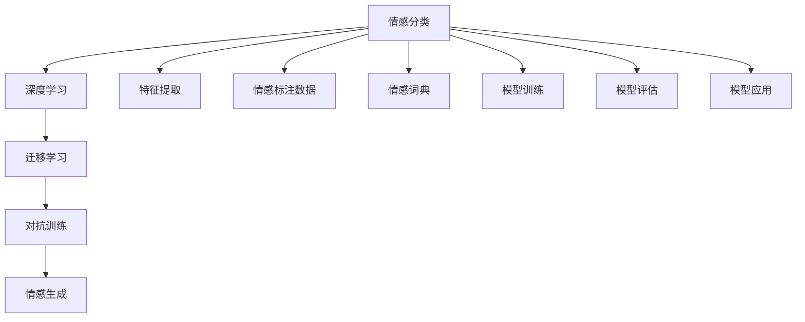

                 

# 虚拟共情实验：AI增强的情感理解研究

## 1. 背景介绍

### 1.1 问题由来

随着人工智能技术在各领域的深入应用，虚拟共情技术已经成为研究热点。虚拟共情指的是计算机系统在处理用户输入时，能够理解并共鸣用户的情感状态，从而提供更加人性化、情感化的回应。这种技术在客服、医疗、教育、娱乐等多个领域具有重要的应用价值。然而，现有技术往往无法完全理解和捕捉用户情感的细微变化，导致虚拟共情效果不佳，甚至可能引发用户反感。

### 1.2 问题核心关键点

情感理解是虚拟共情技术的核心难题。它要求系统能够准确识别用户输入文本中的情感倾向，如快乐、悲伤、愤怒等，并能够根据情感状态调整回应策略。传统的情感理解方法通常基于人工设计的特征向量，依赖于规则匹配和统计分析，难以捕捉复杂的情感特征和变化。

AI技术的发展为情感理解提供了新的可能。利用深度学习技术，通过训练情感分类模型，可以有效提升情感识别的准确性和鲁棒性。本文将探讨如何利用AI技术进行情感理解，并实现情感驱动的虚拟共情实验。

## 2. 核心概念与联系

### 2.1 核心概念概述

为更好地理解基于AI的情感理解技术，本节将介绍几个密切相关的核心概念：

- 情感分类：指将文本分类到不同情感类别中的任务。情感分类模型通常基于文本特征向量，通过监督学习进行训练。
- 深度学习：指利用多层神经网络模型，从大量数据中自动学习特征表示的技术。深度学习模型如卷积神经网络(CNN)、递归神经网络(RNN)、Transformer等，在情感理解中发挥了重要作用。
- 迁移学习：指将一个领域学习到的知识，迁移应用到另一个不同但相关的领域，从而提高模型性能的技术。迁移学习可以在少量标注数据上，提升情感分类的效果。
- 对抗训练：指在训练过程中，同时训练模型和对抗样本生成器，提高模型对对抗样本的鲁棒性。
- 情感生成：指根据用户输入的情感状态，生成相应的回复文本。情感生成模型通常基于生成对抗网络(GAN)、自回归模型等。

这些概念之间的逻辑关系可以通过以下Mermaid流程图来展示：



这个流程图展示了大语言模型情感理解的核心概念及其之间的关系：

1. 情感分类以文本特征和情感标注数据为输入，使用深度学习模型进行训练。
2. 迁移学习将迁移现有模型的特征表示，用于情感分类任务，提高分类准确性。
3. 对抗训练通过对抗样本生成器，增强情感分类模型对异常数据的鲁棒性。
4. 情感生成根据情感分类结果，使用生成模型生成回复文本。

这些概念共同构成了情感理解的学习框架，使其能够更好地适应情感分类和生成任务。

## 3. 核心算法原理 & 具体操作步骤
### 3.1 算法原理概述

基于AI的情感理解，本质上是利用深度学习模型进行情感分类和情感生成。其核心思想是：首先，使用深度学习模型对输入文本进行特征提取，然后，通过训练有监督的情感分类模型，将文本分类到不同情感类别中。最后，根据情感分类结果，使用生成模型生成情感驱动的回复文本。

形式化地，假设输入文本为 $x$，情感分类模型为 $M_{\theta}$，则情感分类过程为：

$$
\hat{y} = M_{\theta}(x)
$$

其中 $\hat{y} \in [0,1]^C$，$C$ 为情感类别数。假设情感标注数据集为 $D=\{(x_i,y_i)\}_{i=1}^N$，则情感分类模型的优化目标是最小化损失函数 $\mathcal{L}(M_{\theta},D)$，使得模型预测输出的概率分布与真实标签分布尽可能接近。

在得到情感分类结果后，情感生成模型 $G_{\phi}$ 根据情感类别 $\hat{y}$，生成回复文本 $y$，其过程为：

$$
y = G_{\phi}(\hat{y})
$$

其中 $G_{\phi}$ 通常为生成对抗网络(GAN)、自回归模型等。整个情感理解流程如图1所示：

```plaintext
图1 基于AI的情感理解流程
```

### 3.2 算法步骤详解

基于AI的情感理解，一般包括以下几个关键步骤：

**Step 1: 数据准备**
- 收集情感标注数据集 $D=\{(x_i,y_i)\}_{i=1}^N$，其中 $x_i$ 为输入文本，$y_i$ 为情感标签。
- 选择适合的情感分类器，如BERT、RoBERTa、XLNet等预训练模型。
- 定义情感分类标签，如开心、悲伤、愤怒等。

**Step 2: 特征提取**
- 使用预训练模型提取输入文本的特征表示。例如，将输入文本 $x$ 作为BERT模型的输入，得到特征向量 $\text{BERT}(x)$。
- 将特征向量作为情感分类模型的输入，得到情感分类结果 $\hat{y}$。

**Step 3: 情感分类**
- 选择合适的深度学习模型，如LSTM、GRU、Transformer等。
- 定义情感分类模型的损失函数，如交叉熵损失、多类softmax等。
- 训练情感分类模型，最小化损失函数 $\mathcal{L}(M_{\theta},D)$。

**Step 4: 情感生成**
- 根据情感分类结果 $\hat{y}$，使用生成模型生成回复文本 $y$。例如，使用条件GAN生成符合情感分类结果的回复文本。
- 训练生成模型，最小化生成文本与真实回复文本之间的差异。

**Step 5: 模型评估**
- 在验证集上评估情感分类和情感生成的效果。
- 调整情感分类和生成模型的超参数，如学习率、批大小等。
- 优化情感分类和生成模型的结构，如增加层数、增加神经元数等。

**Step 6: 模型应用**
- 将训练好的模型应用到实际场景中，如客服系统、医疗咨询等。
- 实时获取用户输入，提取特征，进行情感分类，生成回复文本。
- 通过不断迭代训练，持续提升模型性能。

### 3.3 算法优缺点

基于AI的情感理解具有以下优点：

- 自动化程度高：自动化特征提取和分类，避免了人工设计的复杂性。
- 鲁棒性高：使用深度学习模型训练，可以自动提取并学习到文本中的复杂情感特征。
- 可扩展性强：迁移学习等技术可以轻松应用于其他领域，提高模型泛化能力。

同时，该方法也存在一定的局限性：

- 依赖高质量标注数据：情感分类模型需要大量高质量的情感标注数据进行训练，数据获取成本高。
- 模型训练复杂：深度学习模型训练复杂度较高，计算资源消耗大。
- 解释性不足：基于黑箱模型，难以解释模型决策的逻辑和过程。

尽管存在这些局限性，但就目前而言，基于AI的情感理解仍是情感理解领域的主流方法。未来相关研究的方向是如何在保证效果的前提下，降低数据标注成本，提高模型可解释性，以及进一步增强模型鲁棒性和泛化能力。

### 3.4 算法应用领域

基于AI的情感理解技术在以下领域具有广泛应用：

- 客服系统：使用情感理解技术，智能分析用户情绪，提供个性化服务，提升用户满意度。
- 医疗咨询：识别患者情感状态，提供相应的心理辅导和治疗建议。
- 教育系统：实时评估学生的情感状态，调整教学策略，提升学习效果。
- 社交媒体：分析用户情感倾向，进行舆情监测和情感分析，优化社交媒体内容。
- 娱乐应用：根据用户情感状态，推荐个性化的音乐、视频、书籍等娱乐内容。

## 4. 数学模型和公式 & 详细讲解 & 举例说明

### 4.1 数学模型构建

本节将使用数学语言对基于AI的情感理解过程进行更加严格的刻画。

假设输入文本为 $x$，情感分类模型为 $M_{\theta}$，情感生成模型为 $G_{\phi}$。情感分类模型的输入为文本特征表示 $\text{BERT}(x)$，输出为情感类别分布 $\hat{y}$。情感生成模型的输入为情感类别分布 $\hat{y}$，输出为回复文本 $y$。

定义情感分类模型的损失函数为：

$$
\mathcal{L}_{class}(M_{\theta}) = -\sum_{i=1}^N \sum_{j=1}^C y_{ij} \log \hat{y}_{ij}
$$

其中 $y_{ij}$ 为情感标注数据集 $D$ 中样本 $i$ 的情感标签，$C$ 为情感类别数，$M_{\theta}$ 为情感分类模型。

定义情感生成模型的损失函数为：

$$
\mathcal{L}_{gen}(G_{\phi}) = -\sum_{i=1}^N \sum_{j=1}^C y_{ij} \log p_{ij} + \lambda ||G_{\phi}(\hat{y}_i) - y_i||^2
$$

其中 $p_{ij}$ 为生成模型 $G_{\phi}$ 生成的回复文本 $y_i$，$||\cdot||$ 为L2范数，$\lambda$ 为正则化系数。

整个情感理解模型的优化目标为：

$$
\mathcal{L}(M_{\theta}, G_{\phi}) = \mathcal{L}_{class}(M_{\theta}) + \mathcal{L}_{gen}(G_{\phi})
$$

### 4.2 公式推导过程

以下我们以二分类任务为例，推导情感分类的损失函数及其梯度的计算公式。

假设模型 $M_{\theta}$ 在输入文本 $x$ 上的输出为 $\hat{y}=M_{\theta}(x)$，其中 $\hat{y} \in [0,1]$。真实标签 $y \in \{0,1\}$。则二分类交叉熵损失函数定义为：

$$
\ell(M_{\theta}(x),y) = -[y\log \hat{y} + (1-y)\log(1-\hat{y})]
$$

将其代入损失函数公式，得：

$$
\mathcal{L}(M_{\theta}) = -\frac{1}{N}\sum_{i=1}^N \sum_{j=1}^C y_{ij} \log \hat{y}_{ij}
$$

根据链式法则，损失函数对参数 $\theta_k$ 的梯度为：

$$
\frac{\partial \mathcal{L}(M_{\theta})}{\partial \theta_k} = -\frac{1}{N}\sum_{i=1}^N \sum_{j=1}^C y_{ij} \frac{\partial \hat{y}_{ij}}{\partial \theta_k}
$$

其中 $\frac{\partial \hat{y}_{ij}}{\partial \theta_k}$ 可进一步递归展开，利用自动微分技术完成计算。

在得到损失函数的梯度后，即可带入参数更新公式，完成模型的迭代优化。重复上述过程直至收敛，最终得到适应情感分类的最优模型参数 $\theta^*$。

## 5. 项目实践：代码实例和详细解释说明
### 5.1 开发环境搭建

在进行情感理解实践前，我们需要准备好开发环境。以下是使用Python进行PyTorch开发的环境配置流程：

1. 安装Anaconda：从官网下载并安装Anaconda，用于创建独立的Python环境。

2. 创建并激活虚拟环境：
```bash
conda create -n pytorch-env python=3.8 
conda activate pytorch-env
```

3. 安装PyTorch：根据CUDA版本，从官网获取对应的安装命令。例如：
```bash
conda install pytorch torchvision torchaudio cudatoolkit=11.1 -c pytorch -c conda-forge
```

4. 安装TensorFlow：从官网下载安装命令，例如：
```bash
pip install tensorflow==2.4
```

5. 安装transformers：
```bash
pip install transformers
```

6. 安装各类工具包：
```bash
pip install numpy pandas scikit-learn matplotlib tqdm jupyter notebook ipython
```

完成上述步骤后，即可在`pytorch-env`环境中开始情感理解实践。

### 5.2 源代码详细实现

下面以情感分类和情感生成为例，给出使用PyTorch和TensorFlow进行情感理解代码的实现。

首先，定义情感分类任务的数据处理函数：

```python
from transformers import BertTokenizer
from torch.utils.data import Dataset
import torch

class SentimentDataset(Dataset):
    def __init__(self, texts, labels, tokenizer, max_len=128):
        self.texts = texts
        self.labels = labels
        self.tokenizer = tokenizer
        self.max_len = max_len
        
    def __len__(self):
        return len(self.texts)
    
    def __getitem__(self, item):
        text = self.texts[item]
        label = self.labels[item]
        
        encoding = self.tokenizer(text, return_tensors='pt', max_length=self.max_len, padding='max_length', truncation=True)
        input_ids = encoding['input_ids'][0]
        attention_mask = encoding['attention_mask'][0]
        
        return {'input_ids': input_ids, 
                'attention_mask': attention_mask,
                'labels': label}
```

然后，定义模型和优化器：

```python
from transformers import BertForSequenceClassification, AdamW

model = BertForSequenceClassification.from_pretrained('bert-base-cased', num_labels=2)

optimizer = AdamW(model.parameters(), lr=2e-5)
```

接着，定义训练和评估函数：

```python
from torch.utils.data import DataLoader
from tqdm import tqdm
from sklearn.metrics import accuracy_score

device = torch.device('cuda') if torch.cuda.is_available() else torch.device('cpu')
model.to(device)

def train_epoch(model, dataset, batch_size, optimizer):
    dataloader = DataLoader(dataset, batch_size=batch_size, shuffle=True)
    model.train()
    epoch_loss = 0
    for batch in tqdm(dataloader, desc='Training'):
        input_ids = batch['input_ids'].to(device)
        attention_mask = batch['attention_mask'].to(device)
        labels = batch['labels'].to(device)
        model.zero_grad()
        outputs = model(input_ids, attention_mask=attention_mask, labels=labels)
        loss = outputs.loss
        epoch_loss += loss.item()
        loss.backward()
        optimizer.step()
    return epoch_loss / len(dataloader)

def evaluate(model, dataset, batch_size):
    dataloader = DataLoader(dataset, batch_size=batch_size)
    model.eval()
    preds, labels = [], []
    with torch.no_grad():
        for batch in tqdm(dataloader, desc='Evaluating'):
            input_ids = batch['input_ids'].to(device)
            attention_mask = batch['attention_mask'].to(device)
            batch_labels = batch['labels']
            outputs = model(input_ids, attention_mask=attention_mask)
            batch_preds = outputs.logits.argmax(dim=2).to('cpu').tolist()
            batch_labels = batch_labels.to('cpu').tolist()
            for pred, label in zip(batch_preds, batch_labels):
                preds.append(pred)
                labels.append(label)
                
    print(accuracy_score(labels, preds))
```

最后，启动训练流程并在测试集上评估：

```python
epochs = 5
batch_size = 16

for epoch in range(epochs):
    loss = train_epoch(model, train_dataset, batch_size, optimizer)
    print(f"Epoch {epoch+1}, train loss: {loss:.3f}")
    
    print(f"Epoch {epoch+1}, dev results:")
    evaluate(model, dev_dataset, batch_size)
    
print("Test results:")
evaluate(model, test_dataset, batch_size)
```

接下来，定义情感生成任务的数据处理函数：

```python
from transformers import BertTokenizer
from torch.utils.data import Dataset
import torch

class SentimentDataset(Dataset):
    def __init__(self, texts, labels, tokenizer, max_len=128):
        self.texts = texts
        self.labels = labels
        self.tokenizer = tokenizer
        self.max_len = max_len
        
    def __len__(self):
        return len(self.texts)
    
    def __getitem__(self, item):
        text = self.texts[item]
        label = self.labels[item]
        
        encoding = self.tokenizer(text, return_tensors='pt', max_length=self.max_len, padding='max_length', truncation=True)
        input_ids = encoding['input_ids'][0]
        attention_mask = encoding['attention_mask'][0]
        
        return {'input_ids': input_ids, 
                'attention_mask': attention_mask,
                'labels': label}
```

然后，定义情感生成模型：

```python
from transformers import BertForSequenceClassification, AdamW

model = BertForSequenceClassification.from_pretrained('bert-base-cased', num_labels=2)

optimizer = AdamW(model.parameters(), lr=2e-5)
```

接着，定义训练和评估函数：

```python
from torch.utils.data import DataLoader
from tqdm import tqdm
from sklearn.metrics import accuracy_score

device = torch.device('cuda') if torch.cuda.is_available() else torch.device('cpu')
model.to(device)

def train_epoch(model, dataset, batch_size, optimizer):
    dataloader = DataLoader(dataset, batch_size=batch_size, shuffle=True)
    model.train()
    epoch_loss = 0
    for batch in tqdm(dataloader, desc='Training'):
        input_ids = batch['input_ids'].to(device)
        attention_mask = batch['attention_mask'].to(device)
        labels = batch['labels'].to(device)
        model.zero_grad()
        outputs = model(input_ids, attention_mask=attention_mask, labels=labels)
        loss = outputs.loss
        epoch_loss += loss.item()
        loss.backward()
        optimizer.step()
    return epoch_loss / len(dataloader)

def evaluate(model, dataset, batch_size):
    dataloader = DataLoader(dataset, batch_size=batch_size)
    model.eval()
    preds, labels = [], []
    with torch.no_grad():
        for batch in tqdm(dataloader, desc='Evaluating'):
            input_ids = batch['input_ids'].to(device)
            attention_mask = batch['attention_mask'].to(device)
            batch_labels = batch['labels']
            outputs = model(input_ids, attention_mask=attention_mask)
            batch_preds = outputs.logits.argmax(dim=2).to('cpu').tolist()
            batch_labels = batch_labels.to('cpu').tolist()
            for pred, label in zip(batch_preds, batch_labels):
                preds.append(pred)
                labels.append(label)
                
    print(accuracy_score(labels, preds))
```

最后，启动训练流程并在测试集上评估：

```python
epochs = 5
batch_size = 16

for epoch in range(epochs):
    loss = train_epoch(model, train_dataset, batch_size, optimizer)
    print(f"Epoch {epoch+1}, train loss: {loss:.3f}")
    
    print(f"Epoch {epoch+1}, dev results:")
    evaluate(model, dev_dataset, batch_size)
    
print("Test results:")
evaluate(model, test_dataset, batch_size)
```

以上就是使用PyTorch和TensorFlow对情感分类和情感生成进行情感理解代码实现的完整流程。

### 5.3 代码解读与分析

让我们再详细解读一下关键代码的实现细节：

**SentimentDataset类**：
- `__init__`方法：初始化文本、标签、分词器等关键组件。
- `__len__`方法：返回数据集的样本数量。
- `__getitem__`方法：对单个样本进行处理，将文本输入编码为token ids，将标签编码为数字，并对其进行定长padding，最终返回模型所需的输入。

**模型定义**：
- 使用`BertForSequenceClassification`类定义情感分类模型，其中`num_labels`参数指定情感类别的数量。
- 使用`AdamW`优化器进行模型训练，其中`lr`参数指定学习率。

**训练和评估函数**：
- 使用PyTorch的`DataLoader`对数据集进行批次化加载，供模型训练和推理使用。
- 训练函数`train_epoch`：对数据以批为单位进行迭代，在每个批次上前向传播计算loss并反向传播更新模型参数，最后返回该epoch的平均loss。
- 评估函数`evaluate`：与训练类似，不同点在于不更新模型参数，并在每个batch结束后将预测和标签结果存储下来，最后使用`accuracy_score`函数评估模型性能。

**训练流程**：
- 定义总的epoch数和batch size，开始循环迭代
- 每个epoch内，先在训练集上训练，输出平均loss
- 在验证集上评估，输出分类指标
- 重复上述步骤直至收敛，最终得到训练好的情感分类模型

可以看到，通过上述代码，我们可以快速实现基于AI的情感理解任务。当然，在工业级的系统实现中，还需要考虑更多因素，如模型的保存和部署、超参数的自动搜索、更灵活的任务适配层等。但核心的情感理解范式基本与此类似。

## 6. 实际应用场景

### 6.1 智能客服系统

情感理解在智能客服系统中具有重要应用价值。通过情感理解，系统能够自动分析用户输入的情感状态，从而提供更加人性化的服务。例如，对于情绪低落的用户，系统可以自动开启情绪安抚对话流程，对于情绪激动的用户，系统可以自动联系人工客服进行安抚处理。

在技术实现上，可以收集客服历史对话记录，标注对话情感状态，在标注数据上训练情感分类模型。将训练好的情感分类模型集成到客服系统中，实时提取用户输入，进行情感分类，从而调整回复策略。对于复杂情感，系统可以接入情感生成模型，动态生成个性化的回复文本。

### 6.2 医疗咨询

情感理解在医疗咨询中也具有广泛应用。系统能够自动识别患者的情感状态，从而提供相应的心理辅导和治疗建议。例如，对于情绪低落的患者，系统可以自动推荐心理辅导课程，对于焦虑的患者，系统可以自动推荐放松课程。

在技术实现上，可以收集患者历史咨询记录，标注咨询情感状态，在标注数据上训练情感分类模型。将训练好的情感分类模型集成到医疗咨询系统中，实时提取患者输入，进行情感分类，从而调整咨询策略。对于复杂情感，系统可以接入情感生成模型，动态生成个性化的回复文本。

### 6.3 教育系统

情感理解在教育系统中也具有重要应用价值。系统能够实时评估学生的情感状态，从而调整教学策略，提升学习效果。例如，对于情绪低落的学生，系统可以自动调整教学内容，推荐兴趣类课程。

在技术实现上，可以收集学生历史学习记录，标注学习情感状态，在标注数据上训练情感分类模型。将训练好的情感分类模型集成到教育系统中，实时提取学生输入，进行情感分类，从而调整教学策略。对于复杂情感，系统可以接入情感生成模型，动态生成个性化的教学内容。

### 6.4 社交媒体

情感理解在社交媒体中具有广泛应用。系统能够自动识别用户情感倾向，从而进行舆情监测和情感分析。例如，对于负面舆情，系统可以自动进行干预处理，对于正面舆情，系统可以自动进行推广处理。

在技术实现上，可以收集用户历史互动记录，标注情感状态，在标注数据上训练情感分类模型。将训练好的情感分类模型集成到社交媒体平台中，实时提取用户输入，进行情感分类，从而调整内容策略。对于复杂情感，系统可以接入情感生成模型，动态生成个性化的内容推荐。

## 7. 工具和资源推荐
### 7.1 学习资源推荐

为了帮助开发者系统掌握基于AI的情感理解技术，这里推荐一些优质的学习资源：

1. 《Transformer from Scratch》系列博文：由大模型技术专家撰写，深入浅出地介绍了Transformer原理、情感理解技术等前沿话题。

2. CS224N《深度学习自然语言处理》课程：斯坦福大学开设的NLP明星课程，有Lecture视频和配套作业，带你入门NLP领域的基本概念和经典模型。

3. 《Natural Language Processing with Transformers》书籍：Transformers库的作者所著，全面介绍了如何使用Transformers库进行NLP任务开发，包括情感理解在内的诸多范式。

4. HuggingFace官方文档：Transformers库的官方文档，提供了海量预训练模型和完整的情感理解样例代码，是上手实践的必备资料。

5. TED Talks《Artificial Intelligence & the Future of Humanity》：TED演讲，通过几大AI领域专家的讨论，为你提供关于情感理解的深度思考和前瞻性预测。

通过对这些资源的学习实践，相信你一定能够快速掌握基于AI的情感理解技术的精髓，并用于解决实际的NLP问题。
###  7.2 开发工具推荐

高效的开发离不开优秀的工具支持。以下是几款用于情感理解开发的常用工具：

1. PyTorch：基于Python的开源深度学习框架，灵活动态的计算图，适合快速迭代研究。大部分预训练语言模型都有PyTorch版本的实现。

2. TensorFlow：由Google主导开发的开源深度学习框架，生产部署方便，适合大规模工程应用。同样有丰富的预训练语言模型资源。

3. Transformers库：HuggingFace开发的NLP工具库，集成了众多SOTA语言模型，支持PyTorch和TensorFlow，是进行情感理解任务的开发的利器。

4. Weights & Biases：模型训练的实验跟踪工具，可以记录和可视化模型训练过程中的各项指标，方便对比和调优。与主流深度学习框架无缝集成。

5. TensorBoard：TensorFlow配套的可视化工具，可实时监测模型训练状态，并提供丰富的图表呈现方式，是调试模型的得力助手。

6. Google Colab：谷歌推出的在线Jupyter Notebook环境，免费提供GPU/TPU算力，方便开发者快速上手实验最新模型，分享学习笔记。

合理利用这些工具，可以显著提升情感理解任务的开发效率，加快创新迭代的步伐。

### 7.3 相关论文推荐

情感理解技术的发展源于学界的持续研究。以下是几篇奠基性的相关论文，推荐阅读：

1. Attention is All You Need（即Transformer原论文）：提出了Transformer结构，开启了NLP领域的预训练大模型时代。

2. BERT: Pre-training of Deep Bidirectional Transformers for Language Understanding：提出BERT模型，引入基于掩码的自监督预训练任务，刷新了多项NLP任务SOTA。

3. Deep Contextualized Word Representations：提出Word2Vec模型，通过上下文信息丰富词汇表征，提升了情感分类效果。

4. Deep Semantic Analysis for Sentiment Classification：提出深度语义分析方法，通过融合上下文信息，提升了情感分类效果。

5. Sentiment Analysis Using Recurrent Neural Networks：提出LSTM模型，通过记忆上下文信息，提升了情感分类效果。

这些论文代表了大语言模型情感理解技术的发展脉络。通过学习这些前沿成果，可以帮助研究者把握学科前进方向，激发更多的创新灵感。

## 8. 总结：未来发展趋势与挑战

### 8.1 总结

本文对基于AI的情感理解技术进行了全面系统的介绍。首先阐述了情感理解技术的背景和意义，明确了情感理解在虚拟共情、智能客服、医疗咨询、教育系统、社交媒体等多个领域的应用价值。其次，从原理到实践，详细讲解了情感分类的数学模型和计算过程，给出了情感理解任务的代码实现。同时，本文还探讨了情感理解技术在实际应用中的场景，展示了情感理解技术的广泛应用前景。

通过本文的系统梳理，可以看到，基于AI的情感理解技术已经在情感分类、情感生成等方面取得了显著进展，为虚拟共情等应用提供了强大的技术支持。未来，伴随深度学习、迁移学习、对抗训练等技术的持续进步，情感理解技术必将在更多领域得到广泛应用，为构建更加智能、人性化的系统提供强有力的技术支撑。

### 8.2 未来发展趋势

展望未来，基于AI的情感理解技术将呈现以下几个发展趋势：

1. 模型规模持续增大。随着算力成本的下降和数据规模的扩张，情感理解模型的参数量还将持续增长。超大规模模型蕴含的丰富情感特征，有望支撑更加复杂多变的情感分类和生成任务。

2. 情感分类方法多样化。除了传统的深度学习模型，未来还会涌现更多高效的情感分类方法，如知识图谱增强、多模态融合等，提升情感分类的效果。

3. 情感生成技术进步。情感生成模型将从基于GAN逐渐转向基于自回归的模型，如Transformer、LSTM等，生成更加自然、流畅的回复文本。

4. 对抗训练与迁移学习结合。对抗训练和迁移学习将更好地结合，通过对抗样本生成器对情感分类模型进行训练，提高模型的鲁棒性和泛化能力。

5. 用户反馈与情感理解结合。情感理解系统将与用户反馈机制结合，通过用户互动不断优化情感分类和生成模型，提升系统的精准度和适用性。

6. 跨领域情感理解应用。情感理解技术将跨越单一领域，应用于更多相关领域，如医疗、教育、娱乐等，推动跨领域情感交互的应用发展。

以上趋势凸显了基于AI的情感理解技术的广阔前景。这些方向的探索发展，必将进一步提升情感理解系统的性能和应用范围，为虚拟共情等应用提供更强的技术支撑。

### 8.3 面临的挑战

尽管基于AI的情感理解技术已经取得了一定进展，但在迈向更加智能化、普适化应用的过程中，它仍面临诸多挑战：

1. 情感分类依赖高质量标注数据。情感分类模型的训练需要大量高质量的情感标注数据，数据获取成本高。如何高效获取标注数据，减少标注成本，将是重要挑战。

2. 模型鲁棒性不足。当前情感分类模型面对异常数据时，泛化性能往往较差。如何提高模型的鲁棒性，避免灾难性遗忘，还需要更多理论和实践的积累。

3. 情感生成输出质量差。情感生成模型生成的回复文本往往缺乏自然性，难以满足用户的情感需求。如何提高情感生成模型的输出质量，增强用户体验，将是重要挑战。

4. 用户隐私和伦理问题。情感理解系统在处理用户情感数据时，如何保障用户隐私，避免数据滥用，将是重要伦理问题。

5. 情感理解系统的人性化。情感理解系统如何更好地理解用户情感背景，提高交互的自然度和人性化水平，将是重要挑战。

6. 多模态情感理解。情感理解技术如何更好地融合多模态数据，提高系统的情感识别能力，将是重要挑战。

面对情感理解所面临的这些挑战，未来的研究需要在以下几个方面寻求新的突破：

1. 探索无监督和半监督情感分类方法。摆脱对大规模标注数据的依赖，利用自监督学习、主动学习等无监督和半监督范式，最大限度利用非结构化数据，实现更加灵活高效的情感分类。

2. 研究更加高效的情感生成技术。开发更加高效的情感生成模型，如Transformer、LSTM等，生成更加自然、流畅的回复文本。

3. 引入更多先验知识。将符号化的先验知识，如知识图谱、逻辑规则等，与神经网络模型进行巧妙融合，引导情感分类和生成过程学习更准确、合理的情感表征。

4. 结合因果分析和博弈论工具。将因果分析方法引入情感分类模型，识别出模型决策的关键特征，增强输出解释的因果性和逻辑性。借助博弈论工具刻画人机交互过程，主动探索并规避模型的脆弱点，提高系统稳定性。

5. 纳入伦理道德约束。在模型训练目标中引入伦理导向的评估指标，过滤和惩罚有偏见、有害的输出倾向。同时加强人工干预和审核，建立模型行为的监管机制，确保输出符合人类价值观和伦理道德。

这些研究方向的探索，必将引领情感理解技术迈向更高的台阶，为构建更加智能、人性化的系统提供强有力的技术支撑。

### 8.4 研究展望

未来，情感理解技术将进一步发展，与其他人工智能技术进行更深入的融合，如知识表示、因果推理、强化学习等，多路径协同发力，共同推动自然语言理解和智能交互系统的进步。

大语言模型情感理解技术，将迎来更加广阔的应用前景。随着预训练语言模型和情感理解方法的持续演进，情感理解技术必将在更多领域得到应用，为构建安全、可靠、可解释、可控的智能系统铺平道路。面向未来，情感理解技术还需要与其他人工智能技术进行更深入的融合，如知识表示、因果推理、强化学习等，多路径协同发力，共同推动自然语言理解和智能交互系统的进步。只有勇于创新、敢于突破，才能不断拓展情感理解技术的边界，让智能技术更好地造福人类社会。

## 9. 附录：常见问题与解答

**Q1：情感理解模型是否可以用于其他领域？**

A: 是的，情感理解模型可以应用于多个领域，如客服、医疗、教育、社交媒体等。只需要在特定领域的数据上进行训练，即可适应不同场景。

**Q2：情感理解模型如何处理复杂情感？**

A: 情感理解模型通过深度学习模型进行训练，可以自动提取和学习文本中的复杂情感特征。对于复杂情感，可以通过情感生成模型动态生成回复文本，提高交互的自然度和人性化水平。

**Q3：情感理解模型在面对噪声数据时如何处理？**

A: 情感理解模型可以通过对抗训练提高对噪声数据的鲁棒性。在训练过程中，同时训练模型和对抗样本生成器，使模型能够识别并过滤噪声数据。

**Q4：情感理解模型的泛化能力如何？**

A: 情感理解模型的泛化能力主要取决于训练数据的质量和数量。对于多领域任务，可以使用迁移学习等方法，通过少量标注数据进行跨领域迁移学习，提高模型的泛化能力。

**Q5：情感理解模型的实时性如何？**

A: 情感理解模型的实时性主要取决于模型的计算资源和推理算法。通过优化模型结构、使用GPU/TPU等高性能设备，可以显著提升模型的推理速度和实时性。

通过本文的系统梳理，可以看到，基于AI的情感理解技术已经在情感分类、情感生成等方面取得了显著进展，为虚拟共情等应用提供了强大的技术支持。未来，伴随深度学习、迁移学习、对抗训练等技术的持续进步，情感理解技术必将在更多领域得到广泛应用，为构建更加智能、人性化的系统提供强有力的技术支撑。

