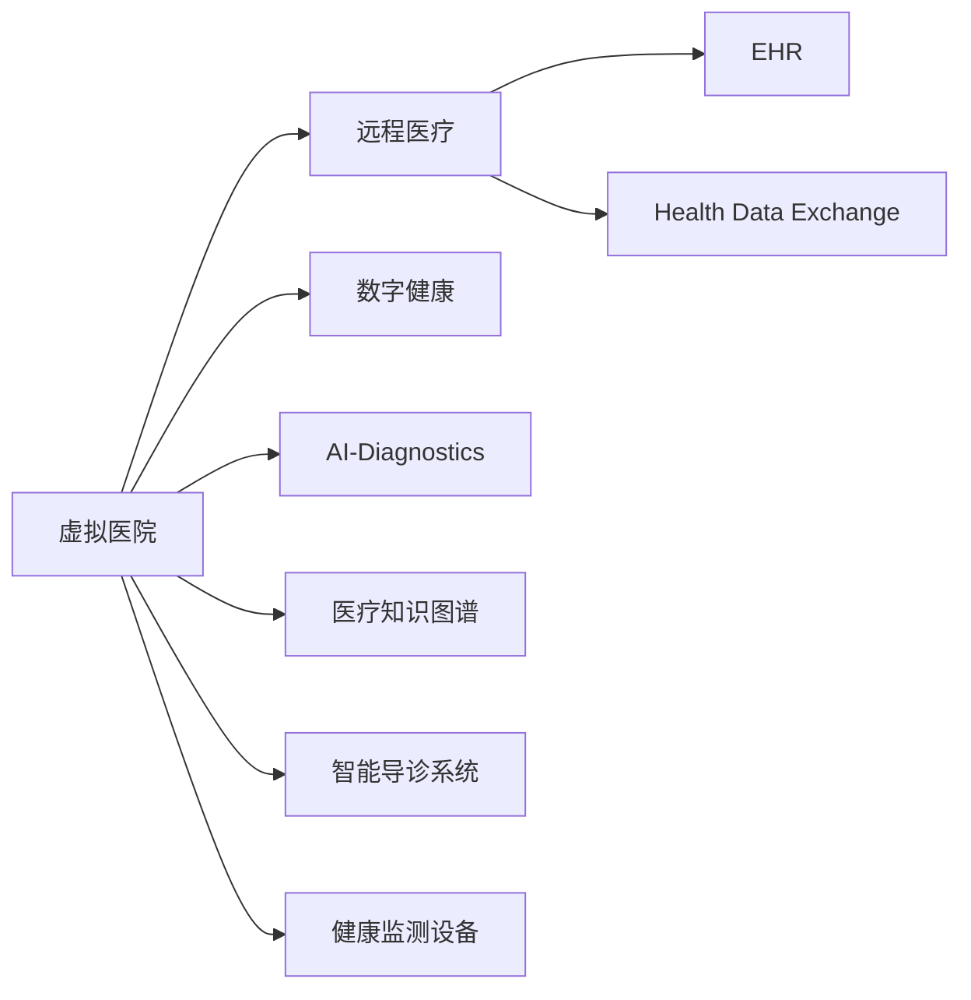

                 

# 虚拟医院:全球医疗行业的数字化升级

## 1. 背景介绍

### 1.1 问题由来
全球医疗行业正面临前所未有的挑战，包括人口老龄化、疾病谱变化、医疗资源分配不均、医疗费用上涨等。如何通过技术手段提高医疗服务的效率和质量，降低医疗成本，成为了各国政府和医疗机构共同关注的问题。在此背景下，虚拟医院（Virtual Hospital）应运而生，为医疗行业的数字化升级提供了新思路。

虚拟医院是基于信息技术和人工智能技术，整合现有医疗资源和数据，构建一个虚拟化的医疗服务体系。通过虚拟医院，患者可以在任何地点通过互联网接受诊断、治疗、康复等医疗服务，无需亲自到医院进行长时间排队和等候。虚拟医院不仅提高了医疗服务的可及性，还通过数据分析和AI辅助决策，显著提升了医疗服务的质量和效率。

### 1.2 问题核心关键点
虚拟医院的核心关键点包括：

- **数字化医疗体系**：将传统医疗体系数字化，实现医疗数据的在线化、标准化、共享化。
- **人工智能技术**：运用AI进行病历分析、疾病预测、诊断辅助、治疗推荐等，提升医疗决策的精准度和效率。
- **远程医疗服务**：通过互联网实现医疗服务的远程化，减少患者就诊时间和费用。
- **跨机构协作**：实现不同医疗机构间的数据和资源共享，提升医疗服务的协同效率。
- **智能导诊与辅助决策**：通过智能算法和知识图谱，辅助医生进行病情分析、诊断和治疗决策。
- **个性化医疗**：利用患者的基因数据、病历数据等，提供个性化的医疗方案和康复计划。

虚拟医院通过数字化、智能化和远程化的手段，极大改善了传统医疗服务模式的不足，具有广阔的市场前景。

## 2. 核心概念与联系

### 2.1 核心概念概述

为更好地理解虚拟医院的建设与运营，本节将介绍几个关键概念：

- **虚拟医院（Virtual Hospital）**：通过信息技术和人工智能技术，构建的虚拟化的医疗服务体系，患者可以在任何地点通过互联网接受诊断、治疗、康复等医疗服务。
- **远程医疗（Telemedicine）**：通过远程通信技术，提供诊断、治疗、康复等服务，减少患者的就诊时间和费用。
- **数字健康（Digital Health）**：利用数字化手段，监测和管理患者的健康状况，提供个性化医疗方案。
- **人工智能辅助诊断（AI-Diagnostics）**：运用AI技术，辅助医生进行病情分析、诊断和治疗决策。
- **电子健康记录（EHR）**：通过电子化方式记录和管理患者的健康信息，实现数据的在线共享和互操作。
- **健康数据共享平台（Health Data Exchange, HDE）**：不同医疗机构间的数据和资源共享平台，提升医疗服务的协同效率。
- **医疗知识图谱（Medical Knowledge Graph）**：将医学知识以图谱形式存储和组织，提供结构化的知识查询和推理。
- **智能导诊系统（Smart Triage System）**：基于患者症状和病史，通过智能算法推荐相应的科室和医生。
- **健康监测设备（Health Monitoring Devices）**：如智能手表、可穿戴设备等，用于实时监测患者的生理参数和健康状况。

这些概念之间的逻辑关系可以通过以下Mermaid流程图来展示：



这个流程图展示了这个系统不同组成部分之间的连接与互动：

1. 虚拟医院整合了远程医疗、数字健康、AI辅助诊断等功能。
2. 远程医疗通过互联网提供医疗服务，减少了就诊时间和费用。
3. 数字健康利用数字化手段监测和管理患者的健康。
4. 人工智能辅助诊断提升医疗决策的精准度和效率。
5. 电子健康记录实现数据的在线共享和互操作。
6. 健康数据共享平台促进不同医疗机构间的协作。
7. 医疗知识图谱提供结构化的知识查询和推理。
8. 智能导诊系统推荐相应的科室和医生。
9. 健康监测设备实时监测患者的生理参数和健康状况。

## 3. 核心算法原理 & 具体操作步骤
### 3.1 算法原理概述

虚拟医院的核心算法原理涉及多个技术领域，包括云计算、大数据、人工智能、物联网等。本文将重点介绍虚拟医院中的关键算法原理和具体操作步骤。

**3.1.1 云计算架构**

虚拟医院的构建离不开云计算平台的支持。云计算平台提供了弹性的计算资源和存储空间，支持大规模数据处理和实时计算。虚拟医院的云计算架构通常包括：

- **IaaS层**：提供基础设施服务，如虚拟机、存储、网络等。
- **PaaS层**：提供平台服务，如数据库、消息队列、容器引擎等。
- **SaaS层**：提供软件即服务，如虚拟医院平台、健康监测设备等。

**3.1.2 大数据与数据湖**

虚拟医院需要处理和分析大量的医疗数据，包括电子病历、医学影像、基因数据、健康监测数据等。大数据和数据湖技术可以支持这些数据的存储、处理和分析。

**3.1.3 人工智能与深度学习**

人工智能技术在虚拟医院中扮演了重要角色。通过深度学习模型，可以自动分析和识别医学影像、文本记录中的关键信息，辅助医生进行诊断和治疗决策。

**3.1.4 物联网与可穿戴设备**

物联网技术使得健康监测设备能够实时采集和传输患者的生理参数，为医疗决策提供实时数据支持。

### 3.2 算法步骤详解

虚拟医院的建设可以分为以下几个关键步骤：

**Step 1: 数据采集与整合**

1. **数据采集**：收集电子病历、医学影像、基因数据、健康监测数据等。
2. **数据清洗**：去除噪声和异常值，确保数据质量。
3. **数据标准化**：统一数据格式和单位，实现数据的互操作。
4. **数据共享**：建立健康数据共享平台，实现不同医疗机构间的数据共享。

**Step 2: 云计算平台搭建**

1. **IaaS平台搭建**：选择合适的云服务提供商，搭建虚拟机、存储、网络等基础设施。
2. **PaaS平台搭建**：选择或搭建数据库、消息队列、容器引擎等平台服务。
3. **SaaS平台搭建**：搭建虚拟医院平台、健康监测设备等软件应用。

**Step 3: 人工智能模型训练与部署**

1. **模型选择**：选择或定制深度学习模型，如卷积神经网络、循环神经网络、注意力机制等。
2. **数据集准备**：准备训练数据和验证数据，进行数据增强和分割。
3. **模型训练**：在云计算平台上训练模型，调整超参数，确保模型精度。
4. **模型部署**：将训练好的模型部署到SaaS平台上，实现实时推理和预测。

**Step 4: 健康监测设备集成**

1. **设备选择**：选择或定制健康监测设备，如智能手表、可穿戴设备等。
2. **设备接入**：将健康监测设备接入云计算平台，实时传输生理参数和健康数据。
3. **数据处理**：利用大数据和AI技术，处理和分析健康监测数据，提供实时健康报告。

**Step 5: 用户界面设计与交互**

1. **界面设计**：设计用户友好的虚拟医院平台界面，支持在线挂号、咨询、诊疗等功能。
2. **交互设计**：实现用户与虚拟医院的交互，包括语音助手、聊天机器人等。
3. **数据可视化**：利用可视化技术，展示健康监测数据和诊断结果，辅助用户理解健康状况。

**Step 6: 系统测试与上线**

1. **测试**：对虚拟医院系统进行全面测试，包括性能测试、安全测试、用户测试等。
2. **上线**：将虚拟医院系统上线运行，逐步扩大服务范围和用户群体。
3. **监控与优化**：实时监控系统性能，根据用户反馈和数据反馈，不断优化和改进系统。

### 3.3 算法优缺点

虚拟医院作为新型医疗服务模式，具有以下优点：

1. **提高医疗服务可及性**：通过远程医疗和数字化手段，患者可以随时随地接受医疗服务，减少了就诊时间和费用。
2. **提升医疗服务效率**：通过AI辅助诊断和智能导诊，医生可以更快、更准确地进行诊断和治疗决策。
3. **降低医疗成本**：减少患者在医院排队等候的时间，降低医疗资源浪费和运营成本。
4. **促进医疗资源共享**：通过数据共享平台，不同医疗机构可以共享医疗资源和知识，提升医疗服务的协同效率。
5. **个性化医疗服务**：通过分析患者的基因数据、病历数据等，提供个性化的医疗方案和康复计划。

然而，虚拟医院也面临一些挑战和缺点：

1. **数据隐私和安全问题**：患者的健康数据高度敏感，需要采取严格的隐私保护措施和安全措施，防止数据泄露和滥用。
2. **技术门槛高**：虚拟医院的建设需要大量的技术投入和专业人才，对于医疗机构和技术公司都是不小的挑战。
3. **数据标准化问题**：不同医疗机构和设备的数据格式和单位不同，需要进行大量的数据标准化工作。
4. **系统互操作性问题**：不同医疗机构和设备的数据互操作性较差，需要进行大量的接口开发和系统集成工作。
5. **技术更新速度快**：医疗技术和人工智能技术的更新迭代速度较快，需要持续投入资源进行技术升级和维护。

尽管面临这些挑战，虚拟医院仍是大势所趋，具有广阔的市场前景和应用潜力。

### 3.4 算法应用领域

虚拟医院的应用领域非常广泛，主要包括以下几个方面：

1. **远程医疗服务**：通过互联网提供远程诊疗、诊断、咨询等服务，减少患者的就诊时间和费用。
2. **个性化医疗**：利用患者的基因数据、病历数据等，提供个性化的医疗方案和康复计划。
3. **医学影像分析**：通过深度学习模型，自动分析和识别医学影像中的关键信息，辅助医生进行诊断和治疗决策。
4. **健康监测与预警**：利用可穿戴设备实时监测患者的生理参数，预警潜在健康风险。
5. **智能导诊与辅助决策**：通过智能算法和知识图谱，辅助医生进行病情分析、诊断和治疗决策。
6. **医疗知识图谱**：构建结构化的医学知识图谱，提供结构化的知识查询和推理。
7. **健康数据共享**：建立健康数据共享平台，实现不同医疗机构间的数据共享。
8. **电子健康记录**：利用电子化方式记录和管理患者的健康信息，实现数据的在线共享和互操作。

虚拟医院的应用领域非常广泛，涵盖了医疗行业的各个环节，为医疗服务的数字化升级提供了新的可能性。

## 4. 数学模型和公式 & 详细讲解 & 举例说明
### 4.1 数学模型构建

虚拟医院涉及多个数学模型，本文将重点介绍虚拟医院中常见的数学模型和公式。

**4.1.1 电子健康记录（EHR）**

电子健康记录（EHR）通常采用层次结构来组织和管理患者的健康信息。层次结构可以使用树形结构表示，例如：

```
Patient
├── Demographics
│   ├── Personal Information
│   │   ├── Name
│   │   ├── Date of Birth
│   │   ├── Address
│   ├── Medical History
│   │   ├── Diagnoses
│   │   ├── Medications
│   └── Imaging
│       ├── Imaging Studies
│       │   ├── X-Ray
│       │   ├── CT Scan
│       └── Laboratories
│           ├── Blood Tests
│           ├── Urine Tests
│           └── Other Labs
```

每个层次结构中的字段可以使用分类变量、量度变量、状态变量等不同类型的变量进行表示。

**4.1.2 深度学习模型**

深度学习模型通常使用多层神经网络结构，可以处理高维度的数据和复杂的非线性关系。例如，卷积神经网络（CNN）可以用于图像分类和医学影像分析，循环神经网络（RNN）可以用于文本生成和序列预测。

**4.1.3 健康监测设备数据**

健康监测设备通常采集患者的生理参数，如心率、血压、血氧饱和度等。这些参数可以使用时间序列数据表示，例如：

```
Time      Heart Rate     Blood Pressure
2019-01-01  60           120/80
2019-01-02  65           125/85
2019-01-03  70           130/90
```

**4.1.4 智能导诊系统**

智能导诊系统通常使用分类器进行病情分析，将患者的症状和病史映射到相应的科室和医生。例如，可以使用支持向量机（SVM）或随机森林（Random Forest）等算法，构建病情分类器。

**4.1.5 知识图谱**

知识图谱通常使用图数据库存储和组织医学知识，例如：

```
Patient
├── Diagnosis
│   ├── Symptom
│   │   ├── Headache
│   │   ├── Fever
│   │   └── Fatigue
│   ├── Disease
│   │   ├── Diabetes
│   │   ├── Hypertension
│   │   └── Cancer
│   └── Treatment
│       ├── Medication
│       │   ├── Aspirin
│       │   ├── Metformin
│       │   └── Lisinopril
│       └── Procedure
│           ├── CT Scan
│           ├── MRI
│           └── Surgery
```

## 5. 项目实践：代码实例和详细解释说明
### 5.1 开发环境搭建

在进行虚拟医院系统开发前，我们需要准备好开发环境。以下是使用Python进行PyTorch开发的环境配置流程：

1. 安装Anaconda：从官网下载并安装Anaconda，用于创建独立的Python环境。

2. 创建并激活虚拟环境：
```bash
conda create -n virtual_hospital python=3.8 
conda activate virtual_hospital
```

3. 安装PyTorch：根据CUDA版本，从官网获取对应的安装命令。例如：
```bash
conda install pytorch torchvision torchaudio cudatoolkit=11.1 -c pytorch -c conda-forge
```

4. 安装TensorFlow：
```bash
pip install tensorflow==2.4
```

5. 安装Flask：用于搭建虚拟医院平台：
```bash
pip install flask==1.1.2
```

6. 安装SQLAlchemy：用于管理数据库：
```bash
pip install sqlalchemy==1.4.18
```

完成上述步骤后，即可在`virtual_hospital`环境中开始开发。

### 5.2 源代码详细实现

**5.2.1 数据库搭建**

使用SQLAlchemy和SQLite搭建虚拟医院的数据库：

```python
from sqlalchemy import create_engine, Column, Integer, String, Float, DateTime
from sqlalchemy.ext.declarative import declarative_base
from sqlalchemy.orm import sessionmaker

engine = create_engine('sqlite:///hospital.db')

Base = declarative_base()

class Patient(Base):
    __tablename__ = 'patients'

    id = Column(Integer, primary_key=True)
    name = Column(String)
    age = Column(Integer)
    gender = Column(String)
    phone = Column(String)
    email = Column(String)

class Visit(Base):
    __tablename__ = 'visits'

    id = Column(Integer, primary_key=True)
    patient_id = Column(Integer, ForeignKey('patients.id'))
    doctor_id = Column(Integer, ForeignKey('doctors.id'))
    date = Column(DateTime)
    description = Column(String)
    symptoms = Column(String)
    diagnosis = Column(String)
    treatment = Column(String)

class Doctor(Base):
    __tablename__ = 'doctors'

    id = Column(Integer, primary_key=True)
    name = Column(String)
    specialty = Column(String)
    phone = Column(String)
    email = Column(String)

Base.metadata.create_all(engine)
Session = sessionmaker(bind=engine)
```

**5.2.2 数据插入**

插入测试数据：

```python
session = Session()

# 插入患者数据
patient1 = Patient(name='Alice', age=30, gender='F', phone='1234567890', email='alice@example.com')
patient2 = Patient(name='Bob', age=40, gender='M', phone='0987654321', email='bob@example.com')

session.add(patient1)
session.add(patient2)
session.commit()

# 插入医生数据
doctor1 = Doctor(name='Dr. Smith', specialty='Cardiology', phone='1111222233', email='smith@example.com')
doctor2 = Doctor(name='Dr. Johnson', specialty='Dermatology', phone='4445555677', email='johnson@example.com')

session.add(doctor1)
session.add(doctor2)
session.commit()

# 插入就诊记录
visit1 = Visit(patient_id=1, doctor_id=1, date='2021-01-01', description='Heart Pain', symptoms='Chest Discomfort', diagnosis='Angina', treatment='Nitroglycerin')
visit2 = Visit(patient_id=2, doctor_id=2, date='2021-01-02', description='Skin Rash', symptoms='Red Bumps', diagnosis='Eczema', treatment='Corticosteroid')

session.add(visit1)
session.add(visit2)
session.commit()

session.close()
```

**5.2.3 数据查询**

查询数据：

```python
session = Session()

# 查询患者信息
patients = session.query(Patient).all()
for patient in patients:
    print(patient.name, patient.age, patient.gender, patient.phone, patient.email)

# 查询就诊记录
visits = session.query(Visit).all()
for visit in visits:
    print(visit.patient_id, visit.doctor_id, visit.date, visit.description, visit.symptoms, visit.diagnosis, visit.treatment)

# 查询医生信息
doctors = session.query(Doctor).all()
for doctor in doctors:
    print(doctor.name, doctor.specialty, doctor.phone, doctor.email)

session.close()
```

**5.2.4 数据更新**

更新数据：

```python
session = Session()

# 更新患者信息
patient1 = session.query(Patient).filter(Patient.name == 'Alice').first()
patient1.age = 31
patient1.gender = 'F'
session.commit()

# 更新医生信息
doctor1 = session.query(Doctor).filter(Doctor.name == 'Dr. Smith').first()
doctor1.specialty = 'Cardiology'
session.commit()

# 更新就诊记录
visit1 = session.query(Visit).filter(Visit.description == 'Heart Pain').first()
visit1.diagnosis = 'Angina Pectoris'
visit1.treatment = 'Nitroglycerin'
session.commit()

session.close()
```

**5.2.5 数据删除**

删除数据：

```python
session = Session()

# 删除患者信息
patient1 = session.query(Patient).filter(Patient.name == 'Alice').first()
session.delete(patient1)
session.commit()

# 删除医生信息
doctor1 = session.query(Doctor).filter(Doctor.name == 'Dr. Smith').first()
session.delete(doctor1)
session.commit()

# 删除就诊记录
visit1 = session.query(Visit).filter(Visit.description == 'Heart Pain').first()
session.delete(visit1)
session.commit()

session.close()
```

### 5.3 代码解读与分析

**5.3.1 SQLAlchemy与Flask**

SQLAlchemy是一个流行的Python ORM（对象关系映射）库，用于管理数据库。Flask是一个轻量级的Web框架，可以方便地搭建虚拟医院平台。

**5.3.2 数据模型**

使用Python定义数据模型，使用SQLAlchemy进行数据库管理。数据模型包括患者、医生和就诊记录等。

**5.3.3 数据操作**

通过SQLAlchemy进行数据插入、查询、更新和删除等操作。使用Flask进行Web界面展示，方便用户查看和管理数据。

## 6. 实际应用场景
### 6.1 智能导诊系统

智能导诊系统是虚拟医院的核心功能之一，通过智能算法和知识图谱，辅助医生进行病情分析和诊断决策。

**6.1.1 系统架构**

智能导诊系统通常包括数据采集、预处理、特征提取、模型训练、推理和反馈等多个环节。

**6.1.2 数据采集与预处理**

采集患者的症状和病史，并进行预处理，去除噪声和异常值。

**6.1.3 特征提取**

使用自然语言处理技术，将症状和病史转化为可处理的特征向量。

**6.1.4 模型训练**

选择或定制深度学习模型，如卷积神经网络（CNN）或循环神经网络（RNN），使用标注数据进行训练。

**6.1.5 推理与反馈**

将患者的症状和病史输入模型，获取诊断结果，并根据医生的反馈进行模型优化。

**6.1.6 系统集成**

将智能导诊系统集成到虚拟医院平台，实现与电子病历、医学影像等系统的对接。

**6.1.7 用户界面**

设计用户友好的界面，方便医生和患者使用。例如，可以使用聊天机器人进行交互，自动推荐科室和医生。

### 6.2 健康监测设备

健康监测设备通过实时采集患者的生理参数，为医疗决策提供实时数据支持。

**6.2.1 设备选择**

选择或定制健康监测设备，如智能手表、可穿戴设备等。

**6.2.2 设备接入**

将健康监测设备接入云计算平台，实时传输生理参数和健康数据。

**6.2.3 数据处理**

利用大数据和AI技术，处理和分析健康监测数据，提供实时健康报告。

**6.2.4 数据可视化**

利用可视化技术，展示健康监测数据和诊断结果，辅助用户理解健康状况。

### 6.3 电子健康记录

电子健康记录（EHR）通过电子化方式记录和管理患者的健康信息，实现数据的在线共享和互操作。

**6.3.1 系统搭建**

使用数据库和ORM技术，搭建电子健康记录系统，实现数据的存储和查询。

**6.3.2 数据标准化**

统一数据格式和单位，实现数据的互操作。

**6.3.3 数据共享**

建立健康数据共享平台，实现不同医疗机构间的数据共享。

### 6.4 未来应用展望

未来，虚拟医院将在更多领域得到应用，为医疗行业的数字化升级提供新的可能性。

**6.4.1 医疗知识图谱**

构建结构化的医学知识图谱，提供结构化的知识查询和推理，提升医疗决策的精准度和效率。

**6.4.2 远程医疗服务**

通过互联网提供远程诊疗、诊断、咨询等服务，减少患者的就诊时间和费用。

**6.4.3 个性化医疗**

利用患者的基因数据、病历数据等，提供个性化的医疗方案和康复计划。

**6.4.4 医学影像分析**

通过深度学习模型，自动分析和识别医学影像中的关键信息，辅助医生进行诊断和治疗决策。

**6.4.5 健康监测与预警**

利用可穿戴设备实时监测患者的生理参数，预警潜在健康风险。

**6.4.6 智能导诊与辅助决策**

通过智能算法和知识图谱，辅助医生进行病情分析、诊断和治疗决策。

## 7. 工具和资源推荐
### 7.1 学习资源推荐

为了帮助开发者系统掌握虚拟医院系统的技术基础和应用技巧，这里推荐一些优质的学习资源：

1. 《Python for Data Analysis》书籍：深入讲解Python数据分析和可视化技术，适合虚拟医院数据处理和可视化需求。
2. 《深度学习入门》课程：由斯坦福大学开设的深度学习课程，涵盖深度学习基础和经典模型，适合虚拟医院模型训练需求。
3. 《Flask Web Development》书籍：详细讲解Flask Web框架的使用和应用，适合虚拟医院平台搭建需求。
4. 《SQLAlchemy文档》：详细的SQLAlchemy文档，适合虚拟医院数据库管理和操作需求。
5. 《自然语言处理与深度学习》课程：由清华大学开设的自然语言处理课程，涵盖NLP技术基础和应用，适合虚拟医院自然语言处理需求。

通过对这些资源的学习实践，相信你一定能够快速掌握虚拟医院系统的核心技术，并用于解决实际的医疗问题。
###  7.2 开发工具推荐

高效的开发离不开优秀的工具支持。以下是几款用于虚拟医院系统开发的常用工具：

1. Python：作为虚拟医院系统开发的主流语言，Python具有强大的数据处理和科学计算能力。
2. PyTorch：基于Python的开源深度学习框架，支持GPU加速，适合虚拟医院模型训练需求。
3. TensorFlow：由Google主导开发的开源深度学习框架，生产部署方便，适合大规模工程应用。
4. Flask：轻量级的Web框架，适合搭建虚拟医院平台。
5. SQLAlchemy：流行的Python ORM库，支持多种数据库管理，适合虚拟医院数据库搭建需求。
6. Jupyter Notebook：基于Web的交互式笔记本，适合虚拟医院开发和研究。
7. Docker：轻量级的容器化技术，适合虚拟医院系统的部署和测试。

合理利用这些工具，可以显著提升虚拟医院系统的开发效率，加快创新迭代的步伐。

### 7.3 相关论文推荐

虚拟医院的发展得益于学术界的持续研究。以下是几篇奠基性的相关论文，推荐阅读：

1. "Healthcare Prediction Model: A Deep Learning Approach"：提出深度学习模型进行健康预测，适用于虚拟医院中的个性化医疗和疾病预测。
2. "Telemedicine for Remote Areas: A Systematic Review"：系统回顾了远程医疗系统在偏远地区的应用，适用于虚拟医院的远程医疗服务。
3. "Electronic Health Records: Benefits and Challenges"：深入探讨了电子健康记录的系统建设和应用，适用于虚拟医院的电子健康记录系统。
4. "Smart Triage Systems in Healthcare: A Survey"：综述了智能导诊系统的研究现状和应用，适用于虚拟医院的智能导诊系统。
5. "Real-Time Physiological Monitoring Devices for Patient Care"：介绍了可穿戴设备在虚拟医院中的实时监测和预警应用，适用于虚拟医院的健康监测系统。

这些论文代表了大数据、深度学习和医疗信息系统的前沿进展，通过学习这些前沿成果，可以帮助研究者把握学科前进方向，激发更多的创新灵感。

## 8. 总结：未来发展趋势与挑战
### 8.1 总结

本文对虚拟医院系统的构建与运营进行了全面系统的介绍。首先阐述了虚拟医院的发展背景和核心概念，明确了其在医疗行业数字化升级中的重要意义。其次，从原理到实践，详细讲解了虚拟医院中的关键算法原理和具体操作步骤，给出了虚拟医院系统的完整代码实例。同时，本文还广泛探讨了虚拟医院系统在智能导诊、健康监测、电子健康记录等领域的实际应用，展示了虚拟医院系统的广阔前景。此外，本文精选了虚拟医院系统的各类学习资源，力求为读者提供全方位的技术指引。

通过本文的系统梳理，可以看到，虚拟医院系统通过数字化、智能化和远程化的手段，极大改善了传统医疗服务模式的不足，具有广阔的市场前景和应用潜力。未来，伴随医疗技术和人工智能技术的不断演进，虚拟医院系统必将迎来更加广阔的发展空间，为医疗行业的数字化升级提供新的可能性。

### 8.2 未来发展趋势

展望未来，虚拟医院系统的发展将呈现以下几个趋势：

1. **数据隐私与安全**：随着数据量的增加，如何保障患者数据隐私和安全，是虚拟医院系统的重要课题。未来的虚拟医院系统将更加注重数据隐私保护和网络安全。
2. **系统互操作性**：不同医疗机构和设备的数据互操作性较差，未来的虚拟医院系统将更加注重系统互操作性，实现数据的无缝共享和协同。
3. **个性化医疗服务**：利用患者的基因数据、病历数据等，提供个性化的医疗方案和康复计划，提升医疗服务的精准度。
4. **智能导诊与辅助决策**：通过智能算法和知识图谱，提升医疗决策的精准度和效率，减轻医生的工作负担。
5. **健康监测与预警**：利用可穿戴设备实时监测患者的生理参数，预警潜在健康风险，提升医疗服务的及时性。
6. **医疗知识图谱**：构建结构化的医学知识图谱，提供结构化的知识查询和推理，提升医疗决策的精准度。
7. **远程医疗服务**：通过互联网提供远程诊疗、诊断、咨询等服务，减少患者的就诊时间和费用。
8. **云计算与边缘计算**：利用云计算和边缘计算技术，提升虚拟医院系统的可扩展性和实时性。

### 8.3 面临的挑战

尽管虚拟医院系统具有广阔的应用前景，但在迈向更加智能化、普适化应用的过程中，它仍面临诸多挑战：

1. **数据隐私与安全**：患者的健康数据高度敏感，需要采取严格的隐私保护措施和安全措施，防止数据泄露和滥用。
2. **技术门槛高**：虚拟医院系统的建设需要大量的技术投入和专业人才，对于医疗机构和技术公司都是不小的挑战。
3. **数据标准化问题**：不同医疗机构和设备的数据格式和单位不同，需要进行大量的数据标准化工作。
4. **系统互操作性问题**：不同医疗机构和设备的数据互操作性较差，需要进行大量的接口开发和系统集成工作。
5. **技术更新速度快**：医疗技术和人工智能技术的更新迭代速度较快，需要持续投入资源进行技术升级和维护。
6. **数据隐私和安全**：如何保障患者数据隐私和安全，是虚拟医院系统的重要课题。
7. **系统互操作性**：不同医疗机构和设备的数据互操作性较差，未来的虚拟医院系统将更加注重系统互操作性，实现数据的无缝共享和协同。

尽管面临这些挑战，虚拟医院系统仍是大势所趋，具有广阔的市场前景和应用潜力。

### 8.4 研究展望

未来的虚拟医院系统需要在以下几个方面寻求新的突破：

1. **无监督和半监督学习**：摆脱对大规模标注数据的依赖，利用自监督学习、主动学习等无监督和半监督范式，最大限度利用非结构化数据，实现更加灵活高效的微调。
2. **参数高效和计算高效**：开发更加参数高效的微调方法，在固定大部分预训练参数的同时，只更新极少量的任务相关参数。同时优化微调模型的计算图，减少前向传播和反向传播的资源消耗，实现更加轻量级、实时性的部署。
3. **因果分析和博弈论工具**：将因果分析方法引入虚拟医院系统，识别出模型决策的关键特征，增强输出解释的因果性和逻辑性。借助博弈论工具刻画人机交互过程，主动探索并规避模型的脆弱点，提高系统稳定性。
4. **知识图谱与自然语言处理**：将符号化的先验知识，如知识图谱、逻辑规则等，与神经网络模型进行巧妙融合，引导微调过程学习更准确、合理的语言模型。同时加强不同模态数据的整合，实现视觉、语音等多模态信息与文本信息的协同建模。
5. **伦理道德约束**：在模型训练目标中引入伦理导向的评估指标，过滤和惩罚有偏见、有害的输出倾向。同时加强人工干预和审核，建立模型行为的监管机制，确保输出符合人类价值观和伦理道德。

这些研究方向的探索，必将引领虚拟医院系统迈向更高的台阶，为医疗服务的数字化升级提供新的可能性。面向未来，虚拟医院系统还需要与其他人工智能技术进行更深入的融合，如知识表示、因果推理、强化学习等，多路径协同发力，共同推动医疗服务的数字化升级。只有勇于创新、敢于突破，才能不断拓展虚拟医院系统的边界，让医疗服务更加高效、便捷、个性化。

## 9. 附录：常见问题与解答

**Q1: 虚拟医院系统需要哪些技术支持？**

A: 虚拟医院系统需要云计算平台、大数据、人工智能、物联网等技术的支持。其中，云计算平台提供了弹性的计算资源和存储空间，大数据和人工智能技术用于数据处理和分析，物联网技术用于实时监测和健康数据采集。

**Q2: 虚拟医院系统如何保证数据隐私和安全？**

A: 虚拟医院系统需要采用严格的数据隐私保护和安全措施，如数据加密、匿名化处理、访问控制等，确保患者数据的隐私和安全。同时，需要建立数据使用的监管机制，限制数据的访问和使用范围。

**Q3: 虚拟医院系统的技术门槛高吗？**

A: 虚拟医院系统的建设需要大量的技术投入和专业人才，对于医疗机构和技术公司都是不小的挑战。但是，随着技术的发展，云计算、大数据、人工智能等技术的应用门槛正在逐步降低，越来越多的医疗机构和技术公司正在采用虚拟医院系统。

**Q4: 虚拟医院系统如何处理不同医疗机构和设备的数据互操作性问题？**

A: 虚拟医院系统需要建立健康数据共享平台，实现不同医疗机构和设备的数据互操作性。通过标准化的数据格式和接口，确保数据的无缝共享和协同。

**Q5: 虚拟医院系统的数据隐私和安全如何保障？**

A: 虚拟医院系统需要采用严格的数据隐私保护和安全措施，如数据加密、匿名化处理、访问控制等，确保患者数据的隐私和安全。同时，需要建立数据使用的监管机制，限制数据的访问和使用范围。

通过本文的系统梳理，可以看到，虚拟医院系统通过数字化、智能化和远程化的手段，极大改善了传统医疗服务模式的不足，具有广阔的市场前景和应用潜力。未来，伴随医疗技术和人工智能技术的不断演进，虚拟医院系统必将迎来更加广阔的发展空间，为医疗行业的数字化升级提供新的可能性。

