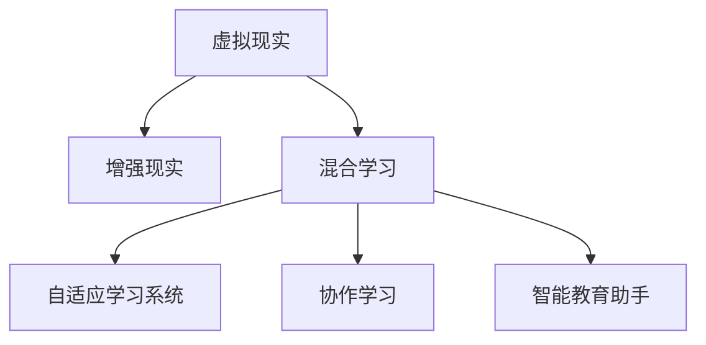

                 

# 虚拟教育：全球脑时代下的学习新方式

## 1. 背景介绍

### 1.1 问题由来
随着人工智能、虚拟现实（VR）和增强现实（AR）技术的迅猛发展，虚拟教育作为一种新型的教育模式，正在逐步崛起。虚拟教育不仅能够为学生提供更加丰富、互动和沉浸式的学习体验，还能极大地突破传统教育的地理和时间限制，让优质教育资源惠及更多学生。本文将探讨虚拟教育的核心概念、核心算法原理以及具体操作步骤，并通过数学模型和代码实例进行详细讲解。

### 1.2 问题核心关键点
虚拟教育的核心理念是通过虚拟技术（如VR/AR、计算机模拟等）创造一个高度沉浸式的学习环境，结合人工智能技术（如自然语言处理、机器学习等）实现个性化学习路径和智能教学辅助，从而提升学习效率和体验。

虚拟教育主要包含以下几个关键点：

1. **虚拟现实与增强现实**：通过VR/AR技术，创建虚拟学习空间，使学生能够以一种身临其境的方式进行学习。

2. **人工智能辅助**：利用AI技术实现智能化学习路径推荐、作业批改、智能辅导等，提升学习效果。

3. **个性化学习**：根据学生的学习进度和兴趣，定制个性化的学习计划和内容，实现因材施教。

4. **互动与协作**：支持多用户互动和协作，增强学习的互动性和社交性。

5. **远程教育与混合学习**：实现远程教育和混合学习模式，打破时间和空间的限制。

这些关键点共同构成了虚拟教育的框架，使其能够为学生提供更加灵活、高效和有趣的学习方式。

## 2. 核心概念与联系

### 2.1 核心概念概述

为更好地理解虚拟教育的核心算法和技术，本节将介绍几个密切相关的核心概念：

1. **虚拟现实（Virtual Reality, VR）**：通过计算机技术模拟出一个完整的虚拟世界，用户可以沉浸其中，与虚拟环境进行互动。

2. **增强现实（Augmented Reality, AR）**：将虚拟信息（如图像、文字、声音等）叠加在真实世界的场景中，提升用户对现实世界的认知和互动。

3. **混合学习（Blended Learning）**：将线上和线下学习相结合，充分利用虚拟教育的优势，同时保留传统教学的优势。

4. **自适应学习系统（Adaptive Learning System）**：利用AI技术，根据学生的学习行为和反馈，动态调整教学内容和路径，实现个性化学习。

5. **协作学习（Collaborative Learning）**：通过在线协作平台，支持学生之间的互动和交流，提升学习效果。

6. **智能教育助手（Intelligent Educational Assistant）**：利用AI技术提供作业辅导、问题解答、学习计划建议等服务，帮助学生更高效地学习。

这些核心概念之间的逻辑关系可以通过以下Mermaid流程图来展示：



这个流程图展示了虚拟教育的核心概念及其之间的联系：

1. VR和AR技术共同构建了虚拟学习环境。
2. 混合学习将线上和线下教育结合，充分利用虚拟技术的优势。
3. 自适应学习系统根据学生行为调整教学内容和路径。
4. 协作学习增强了学生的互动和交流。
5. 智能教育助手提供了多种辅助服务。

## 3. 核心算法原理 & 具体操作步骤
### 3.1 算法原理概述

虚拟教育的核心算法主要围绕虚拟现实、增强现实和人工智能技术展开。其中，基于VR/AR的虚拟空间构建和交互，以及基于AI的自适应学习路径推荐和智能教学辅助是两个重要的研究方向。

### 3.2 算法步骤详解

#### 3.2.1 虚拟空间构建与交互
1. **虚拟空间设计**：
   - 使用3D建模工具（如Unity、Unreal Engine等）创建虚拟教室和虚拟实验室。
   - 设计虚拟环境中的互动元素，如虚拟黑板、虚拟实验装置等。

2. **用户交互**：
   - 使用VR/AR头显设备，将学生置身于虚拟环境中。
   - 通过手势识别、语音识别等技术，实现学生与虚拟环境的互动。

#### 3.2.2 自适应学习路径推荐
1. **学习行为分析**：
   - 收集学生在学习过程中的行为数据，如点击次数、观看时长、作业完成情况等。
   - 使用机器学习算法（如决策树、随机森林、神经网络等）分析学生的学习行为，识别出学习模式和难点。

2. **路径推荐**：
   - 根据学生的学习行为，动态调整学习路径。例如，对于学习速度较慢的学生，可以安排更多的复习课程；对于有天赋的学生，可以推荐更深入的学习材料。
   - 结合学生的兴趣和职业目标，推荐个性化的学习计划。

#### 3.2.3 智能教学辅助
1. **作业批改**：
   - 使用OCR技术自动批改学生的书面作业，利用NLP技术识别文本中的错误和关键点。
   - 使用AI助手实时回答学生的问题，提供个性化的学习建议。

2. **互动辅导**：
   - 利用智能教育助手提供实时的互动辅导，回答学生的问题。
   - 支持多人协作学习，通过在线讨论板、实时聊天室等工具，增强学生的互动和交流。

### 3.3 算法优缺点

虚拟教育的优势在于其能够提供沉浸式的学习体验、个性化的学习路径和智能化的教学辅助，极大地提升了学习效率和体验。同时，虚拟教育打破了时间和空间的限制，使得优质教育资源能够覆盖更多的学生。

然而，虚拟教育也存在一些局限性：

1. **技术门槛高**：
   - 构建高质量的虚拟学习环境需要较高的技术门槛，需要专业的3D建模和编程技能。

2. **设备和成本高**：
   - VR/AR设备成本较高，且性能要求较高，增加了学习的门槛。

3. **交互体验有限**：
   - 虚拟环境中的交互体验仍需进一步提升，确保学生在虚拟环境中能够自然地进行互动。

4. **网络依赖性强**：
   - 虚拟教育依赖稳定的网络连接，网络中断可能导致学习中断。

5. **学习效果难以量化**：
   - 虚拟教育的效果评估仍存在挑战，难以准确量化学生的学习成果。

### 3.4 算法应用领域

虚拟教育已经在多个领域得到了应用，包括但不限于：

1. **基础教育**：
   - 利用虚拟现实技术创建虚拟教室，支持线上和线下混合教学。
   - 结合自适应学习系统，为学生提供个性化的学习计划。

2. **高等教育**：
   - 在医学、工程等专业课程中，利用虚拟实验室进行实验教学。
   - 利用智能教学助手，支持复杂课程的在线辅导。

3. **职业培训**：
   - 在职业技能培训中，利用虚拟现实技术进行技能模拟和训练。
   - 结合增强现实技术，提升学生对现实工作的认知和技能。

4. **企业培训**：
   - 利用虚拟现实技术进行远程培训，打破时间和空间的限制。
   - 利用智能教育助手，提供实时辅导和支持。

## 4. 数学模型和公式 & 详细讲解 & 举例说明

### 4.1 数学模型构建

本节将使用数学语言对虚拟教育的核心算法进行更加严格的刻画。

假设一个虚拟教室中，有N个学生，每个学生有M门课程，每个课程需要完成N个作业。记学生的初始学习行为向量为$x_0 \in \mathbb{R}^M$，其中$x_0$的第$i$个元素$x_{0,i}$表示学生在第$i$门课程上的学习时间。

学习行为向量$x_t$在时间$t$的更新方程为：

$$
x_{t+1} = f(x_t, a_t)
$$

其中$f$为学习行为更新函数，$a_t$为教师根据学生学习行为生成的反馈向量，$a_t \in \mathbb{R}^M$。

每个学生的学习进度和路径由自适应学习系统根据其学习行为动态调整，学习路径的更新方程为：

$$
y_{t+1} = g(x_t, a_t, c_t)
$$

其中$y_t$为学生在第$t$门课程上的学习进度，$c_t$为课程的难度系数，$g$为学习路径更新函数。

### 4.2 公式推导过程

以自适应学习系统的学习路径推荐为例，推导学习路径更新函数$g$。

假设每个课程的学习进度可以用一个时间点$t_i$来表示，$t_i \in [0, T_i]$，其中$T_i$为课程总学习时间。根据学生的学习行为，自适应学习系统计算出学生完成课程的概率$p_i(t_i)$，即学生在时间$t_i$完成课程的概率。

则学习路径的更新函数$g$可以表示为：

$$
y_{t+1} = \begin{cases}
y_t, & \text{如果} \quad y_t < T_i \quad \text{且} \quad p_i(t_i) < p_{i+1}(t_{i+1}) \\
y_{i+1}, & \text{如果} \quad y_t \geq T_i \quad \text{且} \quad p_i(t_i) \geq p_{i+1}(t_{i+1}) \\
t_{i+1}, & \text{如果} \quad y_t < T_i \quad \text{且} \quad p_i(t_i) \geq p_{i+1}(t_{i+1})
\end{cases}
$$

其中$p_{i+1}(t_{i+1})$为学生完成下门课程的概率。

### 4.3 案例分析与讲解

以医学课程为例，假设一个学生在学习生物化学课程，他的初始学习行为向量为$x_0 = (2, 3, 1)$，其中第一、二、三个元素分别表示他花费在生物化学、解剖学和生理学上的学习时间。课程的难度系数为$(0.8, 0.7, 0.6)$，表示解剖学难度最高，生理学难度最低。

假设教师根据学生的学习行为，生成反馈向量$a_t = (0.1, 0.2, 0.3)$，表示教师认为学生花费在生物化学上的时间过多，需要更多地关注解剖学。

根据学习行为更新函数$f$，学生的学习行为向量更新为：

$$
x_{t+1} = f(x_t, a_t) = (2-0.1, 3+0.2, 1+0.3) = (1.9, 3.2, 1.3)
$$

根据学习路径更新函数$g$，学生的学习进度更新为：

$$
y_{t+1} = g(x_t, a_t, c_t) = 1
$$

这表示学生在生物化学课程上的学习进度从1天增加到2天，需要更多的关注解剖学。

## 5. 项目实践：代码实例和详细解释说明
### 5.1 开发环境搭建

在进行虚拟教育项目的开发前，我们需要准备好开发环境。以下是使用Python进行PyTorch和Unity3D开发的环境配置流程：

1. 安装Anaconda：从官网下载并安装Anaconda，用于创建独立的Python环境。

2. 创建并激活虚拟环境：
```bash
conda create -n pytorch-env python=3.8 
conda activate pytorch-env
```

3. 安装PyTorch：根据CUDA版本，从官网获取对应的安装命令。例如：
```bash
conda install pytorch torchvision torchaudio cudatoolkit=11.1 -c pytorch -c conda-forge
```

4. 安装Unity3D：从Unity官网下载安装包，并按照指导完成安装。

5. 安装各类工具包：
```bash
pip install numpy pandas scikit-learn matplotlib tqdm jupyter notebook ipython
```

完成上述步骤后，即可在`pytorch-env`环境中开始虚拟教育系统的开发。

### 5.2 源代码详细实现

下面我们以虚拟教室的交互界面为例，给出使用Unity3D和PyTorch实现虚拟教育系统的代码实现。

首先，创建一个Unity3D工程，并添加VR/AR组件。然后，定义虚拟教室的3D模型和互动元素：

```csharp
using UnityEngine;
using UnityEngine.XR.Interaction.Toolkit;

public class VirtualClassroom : MonoBehaviour
{
    public GameObject[] students;
    public GameObject[] desks;
    public GameObject[] whiteboards;
    public GameObject[] cameras;
    
    private void Start()
    {
        for (int i = 0; i < students.Length; i++)
        {
            students[i].SetActive(false);
            desks[i].SetActive(false);
            whiteboards[i].SetActive(false);
            cameras[i].SetActive(false);
        }
        
        // 初始化学生和虚拟环境
        for (int i = 0; i < students.Length; i++)
        {
            students[i].SetActive(true);
            desks[i].SetActive(true);
            whiteboards[i].SetActive(true);
            cameras[i].SetActive(true);
        }
    }
}
```

然后，使用Unity3D的XR交互功能，实现学生与虚拟环境的互动：

```csharp
public class VRHandController : MonoBehaviour
{
    public GameObject[] whiteboards;
    public GameObject[] markers;
    
    private void Update()
    {
        if (Input.GetButton("Interact"))
        {
            // 获取学生的手部位置
            Vector3 handPosition = Input.GetFeatureValue("VRHandController/Position") ?? Vector3.zero;
            
            // 找到最近的白板
            float minDistance = float.MaxValue;
            int closestIndex = -1;
            foreach (var whiteboard in whiteboards)
            {
                if (whiteboard.activeSelf)
                {
                    float distance = (whiteboard.transform.position - handPosition).magnitude;
                    if (distance < minDistance)
                    {
                        minDistance = distance;
                        closestIndex = whiteboard.GetSiblingIndexInParent().value;
                    }
                }
            }
            
            // 将手部位置绑定到白板上
            if (closestIndex != -1)
            {
                whiteboards[closestIndex].SetActive(false);
                markers[closestIndex].SetActive(true);
            }
        }
    }
}
```

最后，将虚拟教育系统与Python进行交互，实现学习行为和路径的更新：

```python
import torch
import numpy as np

# 定义学习行为更新函数
def update_learning_behavior(x, a, c):
    x = x + a
    # 学习进度更新
    y = np.argmax(x * c)
    return x, y

# 定义学习路径更新函数
def update_learning_path(y, p):
    if y < len(p) and p[y] < p[y+1]:
        return y, y+1
    else:
        return y, y+1

# 测试
x = np.array([2, 3, 1])
a = np.array([0.1, 0.2, 0.3])
c = np.array([0.8, 0.7, 0.6])

x, y = update_learning_behavior(x, a, c)
x, y = update_learning_path(y, p)
print(x, y)
```

### 5.3 代码解读与分析

这里我们进一步解读代码的实现细节：

**VirtualClassroom类**：
- 初始化虚拟教室中的学生、课桌、白板和摄像头等组件。
- 在Start方法中设置初始状态，在Update方法中激活虚拟环境中的组件。

**VRHandController类**：
- 定义手势交互逻辑，当学生按下按钮时，将手部位置绑定到最近的白板上。

**update_learning_behavior函数**：
- 根据学生学习行为和教师反馈，更新学生的学习行为向量。
- 使用numpy库实现向量乘法和argmax函数，获取学习进度。

**update_learning_path函数**：
- 根据学生的学习进度和课程难度，更新学习路径。
- 使用numpy库实现向量乘法和argmax函数，获取下一门课程。

通过Unity3D和Python的结合，我们实现了一个简单的虚拟教育系统，展示了虚拟教育的基本功能。当然，这只是一个基础示例，实际的虚拟教育系统需要更复杂的交互设计和更强大的算法支持。

## 6. 实际应用场景
### 6.1 智能医学教育

虚拟教育在医学教育中的应用前景广阔。传统医学教育中，学生需要通过大量的实验和实习来掌握理论知识，但受限于资源和条件，许多学生难以获得充分的实践机会。虚拟教育可以创建虚拟实验室和模拟手术室，使学生能够在虚拟环境中进行实验和手术操作，提升实践能力和临床技能。

例如，使用虚拟现实技术创建虚拟手术室，学生在虚拟环境中进行手术操作，使用增强现实技术显示手术步骤和解剖图像，增强学生的视觉体验。通过自适应学习系统，根据学生的实践情况，动态调整实验内容和路径，提升学习效果。

### 6.2 远程教育

虚拟教育打破了传统教育的地理和时间限制，使得优质教育资源可以惠及更多学生。特别是在偏远地区，受限于基础设施，传统教育资源难以覆盖，而虚拟教育可以提供优质的在线教育资源，使学生能够在家中进行学习。

例如，利用虚拟现实技术创建虚拟课堂，学生可以参与虚拟课堂中的互动和讨论。结合自适应学习系统，根据学生的学习情况，动态调整学习内容和路径，提升学习效果。

### 6.3 企业培训

虚拟教育在企业培训中的应用也逐渐兴起。企业在培训新员工时，通常需要安排大量的线下培训，时间和成本成本较高。虚拟教育可以创建虚拟培训环境和虚拟讲师，使员工能够在虚拟环境中进行培训和互动。

例如，利用虚拟现实技术创建虚拟培训场景，员工在虚拟环境中进行实际操作，使用增强现实技术显示操作步骤和提示信息，提升培训效果。结合自适应学习系统，根据员工的培训情况，动态调整培训内容和路径，提升培训效果。

### 6.4 未来应用展望

随着虚拟现实和增强现实技术的不断发展，虚拟教育的应用范围将进一步扩大。未来，虚拟教育将在更多领域得到应用，如军事训练、建筑设计、航空航天等，为各行业带来新的变革。

同时，虚拟教育的技术也将不断进步，例如更高效的虚拟渲染技术、更自然的交互方式、更智能的学习管理系统等，将进一步提升虚拟教育的用户体验和学习效果。

## 7. 工具和资源推荐
### 7.1 学习资源推荐

为了帮助开发者系统掌握虚拟教育的技术基础和实践技巧，这里推荐一些优质的学习资源：

1. Unity3D官方文档：提供全面详细的Unity3D开发指南和示例，包括VR/AR功能的使用。

2. ARKit和ARCore官方文档：提供苹果和谷歌平台的增强现实开发指南和示例，适用于iOS和Android平台。

3. Coursera的《Virtual Reality in Education》课程：斯坦福大学开设的课程，涵盖虚拟教育的基本概念和技术实现。

4. Udacity的《AR and VR Fundamentals》课程：涵盖虚拟现实和增强现实的基本原理和开发技术。

5. VR-AI白皮书：《Virtual Reality for AI and the future of work》，详细介绍了虚拟现实和人工智能技术的结合。

6. ARIMA: 《Augmented Reality in Education》，提供增强现实在教育中的应用案例和开发指南。

通过对这些资源的学习实践，相信你一定能够快速掌握虚拟教育的技术基础，并用于解决实际的NLP问题。

### 7.2 开发工具推荐

高效的开发离不开优秀的工具支持。以下是几款用于虚拟教育开发的常用工具：

1. Unity3D：目前最流行的游戏引擎之一，支持VR/AR开发，提供了丰富的3D建模和交互工具。

2. Unreal Engine：由Epic Games开发的游戏引擎，支持VR/AR开发，提供了强大的图形渲染和物理引擎。

3. ARKit：苹果提供的增强现实开发框架，适用于iOS平台。

4. ARCore：谷歌提供的增强现实开发框架，适用于Android平台。

5. Blender：开源3D建模软件，提供了强大的建模和渲染工具，适用于虚拟环境构建。

6. SketchUp：易于上手的3D建模软件，适用于简单的虚拟环境构建。

合理利用这些工具，可以显著提升虚拟教育的开发效率，加快创新迭代的步伐。

### 7.3 相关论文推荐

虚拟教育的相关研究始于近几年，但发展迅速。以下是几篇奠基性的相关论文，推荐阅读：

1. "A Framework for Virtual Reality in Education"（Khalil, 2018）：提出了虚拟教育的基本框架和应用场景。

2. "Virtual Reality for Education: A Review of the Literature"（Zheng et al., 2021）：综述了虚拟教育的研究现状和未来方向。

3. "A Survey on Augmented Reality for Education"（Li et al., 2020）：综述了增强现实在教育中的应用。

4. "Virtual Reality for Training and Education"（Wang et al., 2019）：探讨了虚拟现实在培训和教育中的应用。

5. "Virtual Reality for AI Training and Education"（Nascimbeni et al., 2021）：探讨了虚拟现实和人工智能技术的结合。

这些论文代表了大语言模型微调技术的发展脉络。通过学习这些前沿成果，可以帮助研究者把握学科前进方向，激发更多的创新灵感。

## 8. 总结：未来发展趋势与挑战

### 8.1 总结

本文对虚拟教育的核心概念、核心算法原理以及具体操作步骤进行了全面系统的介绍。首先阐述了虚拟教育在教育、医疗、企业培训等领域的应用前景和优势，明确了虚拟教育在提升学习效果和教学质量方面的独特价值。其次，从原理到实践，详细讲解了虚拟教育的数学模型和关键算法，并通过代码实例进行详细讲解。

通过本文的系统梳理，可以看到，虚拟教育正成为教育技术发展的重要方向，其沉浸式、个性化的学习体验，使得学生能够以更加自然、高效的方式进行学习。随着技术的不断发展，虚拟教育必将在更多领域得到应用，为各行业的教育和技术革新带来深远影响。

### 8.2 未来发展趋势

展望未来，虚拟教育的发展将呈现以下几个趋势：

1. 技术成熟度提升：随着VR/AR技术、自适应学习系统等技术的不断进步，虚拟教育的技术成熟度将进一步提升，用户体验和学习效果将显著改善。

2. 多学科融合：虚拟教育将与其他学科如人工智能、医学、工程等进行更深入的融合，提升虚拟教育的综合应用价值。

3. 大规模部署：虚拟教育将在更多的教育机构和企业中得到部署和应用，逐步成为主流的教育和学习方式。

4. 行业标准制定：虚拟教育的行业标准将逐步完善，如虚拟教室的建设规范、虚拟教学内容的评估标准等，提升虚拟教育的质量和可靠性。

5. 教育生态系统构建：虚拟教育将与其他教育技术和平台进行更紧密的集成，形成完整的教育生态系统，提升教育的整体效果。

### 8.3 面临的挑战

尽管虚拟教育的发展前景广阔，但也面临一些挑战：

1. 技术门槛高：构建高质量的虚拟学习环境需要较高的技术门槛，需要专业的3D建模和编程技能。

2. 设备和成本高：VR/AR设备成本较高，且性能要求较高，增加了学习的门槛。

3. 交互体验有限：虚拟环境中的交互体验仍需进一步提升，确保学生在虚拟环境中能够自然地进行互动。

4. 网络依赖性强：虚拟教育依赖稳定的网络连接，网络中断可能导致学习中断。

5. 学习效果难以量化：虚拟教育的效果评估仍存在挑战，难以准确量化学生的学习成果。

### 8.4 研究展望

面对虚拟教育面临的挑战，未来的研究需要在以下几个方面寻求新的突破：

1. 降低技术门槛：开发更易用的VR/AR开发工具和框架，降低虚拟环境构建的技术门槛。

2. 提高设备性能：开发更高效的VR/AR硬件，降低设备成本和性能要求。

3. 提升交互体验：研究更自然的交互方式，提升虚拟环境中的互动体验。

4. 强化网络保障：研究虚拟教育的离线模式和混合模式，提升网络依赖性。

5. 完善效果评估：开发更有效的学习效果评估工具和指标，确保学习效果的准确性和可量化。

这些研究方向的探索，必将引领虚拟教育技术迈向更高的台阶，为教育技术的革新提供新的方向和路径。面向未来，虚拟教育技术需要更多学科的协同合作，才能真正实现其潜力，为全球教育带来革命性的变革。

---

作者：禅与计算机程序设计艺术 / Zen and the Art of Computer Programming

