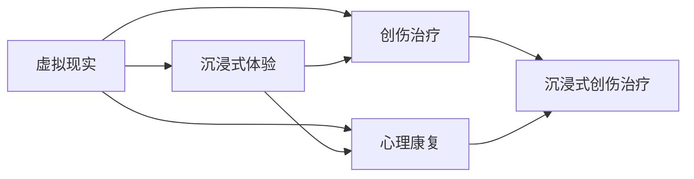

                 

## 1. 背景介绍

在当前快节奏的社会环境中，人们面临着前所未有的心理压力和创伤。这种创伤不仅影响个体的心理健康，也对社会稳定构成威胁。因此，开发一种能够有效治疗创伤的心理康复技术，具有重要的社会意义和经济价值。虚拟现实技术（Virtual Reality, VR）以其沉浸式的交互体验，为创伤治疗提供了一种全新的可能性。本文将探讨基于虚拟现实创伤治疗创业的技术原理和实现方法，为相关领域的创业者提供参考。

## 2. 核心概念与联系

### 2.1 核心概念概述

在探讨虚拟现实创伤治疗时，需要明确以下几个核心概念：

- **虚拟现实（VR）**：一种通过计算机模拟生成三维虚拟环境的技术，用户可以通过头显和手柄等设备进行交互。
- **创伤治疗**：通过各种方法减轻或消除个体经历的心理创伤的过程。
- **心理康复**：旨在恢复个体心理功能，促进心理健康和适应社会的能力。
- **沉浸式体验**：使用VR技术创造的沉浸感，使得用户在虚拟环境中能够全身心地投入。

### 2.2 核心概念原理和架构的 Mermaid 流程图



这个流程图展示了虚拟现实技术如何与创伤治疗和心理康复相结合，从而创造沉浸式创伤治疗的效果。

## 3. 核心算法原理 & 具体操作步骤

### 3.1 算法原理概述

基于虚拟现实的心理创伤治疗，核心在于创建一个安全、可控的虚拟环境，让用户在沉浸式体验中逐步面对和处理创伤经历。以下是该过程的算法原理概述：

1. **虚拟环境构建**：通过VR技术创建与现实世界相似但更安全的虚拟环境，使得用户能够在心理上感到安全。
2. **创伤再现**：在虚拟环境中再现用户经历的创伤场景，使用户能够面对而不必在现实中再次经历。
3. **情感调节**：通过虚拟环境中的情感调节技术，帮助用户控制和调节情绪反应。
4. **认知重构**：引导用户进行认知重构，改变对创伤的负面看法，建立积极的应对策略。

### 3.2 算法步骤详解

以下是虚拟现实创伤治疗的具体操作步骤：

**Step 1: 用户数据采集**
- 收集用户的基本信息，包括年龄、性别、心理状态等。
- 进行初步的心理评估，了解用户的创伤类型和程度。

**Step 2: 虚拟环境设计**
- 设计虚拟环境，模拟现实中的重要场景，如家庭、学校、工作场所等。
- 确定虚拟环境中的交互元素，如虚拟角色、物品、事件等，确保它们能够帮助用户面对和处理创伤。

**Step 3: 创伤再现与情感调节**
- 在虚拟环境中再现用户的创伤场景，但进行适当的简化或安全化处理。
- 使用情感调节技术，如呼吸调节、冥想引导等，帮助用户在再现创伤场景时保持冷静。

**Step 4: 认知重构与行为训练**
- 引导用户进行认知重构，帮助他们重新解读和理解创伤经历。
- 进行行为训练，教授用户积极的应对策略和解决问题的技能。

**Step 5: 心理评估与反馈**
- 定期进行心理评估，了解用户进展情况。
- 根据评估结果，调整虚拟环境和治疗方案，确保治疗效果。

### 3.3 算法优缺点

**优点**：
- **安全性**：用户可以在安全的虚拟环境中面对和处理创伤，减少现实生活中的创伤性刺激。
- **沉浸式体验**：通过沉浸式体验，用户能够全身心地投入治疗过程，更容易产生情感共鸣。
- **可控性**：虚拟环境中的各种元素可以设计调整，以适应不同用户和创伤类型。

**缺点**：
- **技术门槛**：创建高质量的虚拟环境和设计有效的治疗方案需要较高的技术水平。
- **用户依赖**：用户可能过度依赖虚拟环境，不利于他们在现实中的独立应对。
- **成本高**：初始设置和持续维护成本较高，可能难以在非高收入地区普及。

### 3.4 算法应用领域

虚拟现实创伤治疗可以应用于多个领域，包括但不限于：

- **军事创伤**：帮助退伍军人处理战争中的创伤经历。
- **性侵创伤**：为性侵受害者提供一个安全的环境进行康复训练。
- **灾难创伤**：帮助经历过自然灾害、交通事故等创伤的个人进行康复。
- **儿童创伤**：为经历过虐待、忽视等创伤的儿童提供心理康复。

## 4. 数学模型和公式 & 详细讲解 & 举例说明

### 4.1 数学模型构建

假设用户经历的心理创伤为 $T$，治疗过程为 $T'$，目标是找到一个最优的治疗方案 $T'$，使得治疗后的心理健康状态最大化。我们可以将心理健康的指标定义为一个函数 $H(T',T)$，表示用户在进行 $T'$ 治疗后，心理状态与初始状态 $T$ 的差异。

### 4.2 公式推导过程

根据上述定义，我们可以使用以下公式来表示治疗目标：

$$
\max_{T'} H(T',T)
$$

其中 $H(T',T)$ 可以表示为一个多变量函数，包括用户的情感状态、认知水平、行为能力等。为了简化模型，我们将其表示为一个简单的线性函数：

$$
H(T',T) = w_1(E(T',T)) + w_2(C(T',T)) + w_3(B(T',T))
$$

其中 $E(T',T)$、$C(T',T)$、$B(T',T)$ 分别表示情感状态、认知水平和行为能力的函数，$w_1$、$w_2$、$w_3$ 是权重系数。

### 4.3 案例分析与讲解

假设有一个用户经历了一次交通事故，我们希望通过虚拟现实创伤治疗来帮助他恢复心理健康。

首先，我们采集用户的心理状态数据，发现其情感状态较低，认知水平下降，行为能力受到限制。我们设计了一个虚拟环境，模拟事故发生时的场景，并在其中设计了情感调节和认知重构的元素。

在治疗过程中，用户通过虚拟环境再现事故场景，并在情感调节元素下逐渐适应。认知重构元素帮助用户重新解读事故经历，改变其负面看法，最终用户的行为能力得到恢复，心理状态显著提升。

## 5. 项目实践：代码实例和详细解释说明

### 5.1 开发环境搭建

为了进行虚拟现实创伤治疗的开发，我们需要搭建一个支持VR技术的开发环境。以下是具体的搭建步骤：

1. 安装VR开发工具，如Unity或Unreal Engine。
2. 配置VR设备，如头显、手柄等。
3. 安装必要的库和插件，如OpenXR或Oculus SDK。
4. 配置服务器和数据库，用于存储用户数据和记录治疗进展。

### 5.2 源代码详细实现

以下是一个简单的虚拟现实创伤治疗系统的代码实现示例：

```python
# 导入必要的库和模块
import numpy as np
from unitypy import UnityClient

# 创建Unity客户端
client = UnityClient("localhost", 8080)

# 连接虚拟环境
client.connect("VirtualTherapy")

# 收集用户数据
user_data = client.get_user_data()

# 设计虚拟环境
virtual_environment = client.create_virtual_environment()

# 再现创伤场景
trauma_scene = client.recreate_trauma_scene()

# 进行情感调节
emotion_regulation = client.regulate_emotions()

# 进行认知重构
cognitive_reconstruction = client.reconstruct_cognition()

# 评估治疗效果
assessment = client.assess_treatment()

# 输出评估结果
print(assessment)
```

### 5.3 代码解读与分析

上述代码展示了虚拟现实创伤治疗系统的主要功能模块。其中：

- `UnityClient`：用于连接和控制Unity虚拟环境的客户端。
- `get_user_data`：获取用户基本信息和心理状态。
- `create_virtual_environment`：设计虚拟环境，包括场景、交互元素等。
- `recreate_trauma_scene`：再现创伤场景。
- `regulate_emotions`：进行情感调节。
- `reconstruct_cognition`：进行认知重构。
- `assess_treatment`：评估治疗效果。

### 5.4 运行结果展示

运行上述代码后，虚拟环境中的场景将展示出来，用户可以身临其境地进行创伤治疗。情感调节和认知重构的效果将在用户的数据记录中体现，治疗评估结果将输出到屏幕上。

## 6. 实际应用场景

### 6.1 军事创伤治疗

在军事领域，许多退伍军人经历了战争的创伤，但难以在现实生活中获得有效的治疗。虚拟现实创伤治疗可以为他们提供一个安全的环境，帮助他们逐步面对和处理创伤经历。

### 6.2 性侵创伤治疗

性侵创伤对受害者的心理健康造成了严重的影响。虚拟现实创伤治疗可以为受害者提供一个虚拟的法庭环境，让他们重新经历并处理这段创伤经历，从而恢复心理健康。

### 6.3 灾难创伤治疗

灾难如地震、火灾等对幸存者造成了巨大的心理创伤。虚拟现实创伤治疗可以帮助幸存者重新体验灾难场景，进行情感调节和认知重构，恢复心理健康。

### 6.4 未来应用展望

随着虚拟现实技术的进步，虚拟现实创伤治疗将变得更加逼真和高效。未来，我们可以：

- **个性化定制**：根据用户的个性化需求设计虚拟环境和治疗方案。
- **实时反馈**：通过实时数据收集和分析，及时调整治疗方案。
- **多维度治疗**：结合心理治疗、行为训练等多种治疗手段，提供全面的康复服务。

## 7. 工具和资源推荐

### 7.1 学习资源推荐

为了掌握虚拟现实创伤治疗的开发技术，以下是一些推荐的学习资源：

- **Unity官方文档**：Unity是当前最流行的VR开发平台，官方文档提供了丰富的学习资料。
- **Unreal Engine教程**：Unreal Engine是另一个流行的VR开发平台，官方教程提供了详尽的开发指南。
- **心理健康知识**：了解心理健康的基础知识，有助于设计有效的虚拟环境和治疗方案。
- **VR应用案例**：研究已有的VR应用案例，借鉴其设计和实现经验。

### 7.2 开发工具推荐

以下是一些推荐的开发工具：

- **Unity**：支持VR应用的开发，拥有庞大的社区和丰富的资源。
- **Unreal Engine**：另一个流行的VR开发平台，具有强大的图形渲染能力和交互设计工具。
- **Unity VR Tools**：Unity社区提供的VR开发工具集，方便开发者快速开发VR应用。
- **Unreal Engine VR Tools**：Unreal Engine的VR开发工具集，提供丰富的开发支持。

### 7.3 相关论文推荐

以下几篇论文深入探讨了虚拟现实创伤治疗的相关技术：

- **"Virtual Reality Therapy for Post-Traumatic Stress Disorder: A Systematic Review and Meta-Analysis"**：总结了虚拟现实治疗在创伤后应激障碍中的效果。
- **"Virtual Reality Therapy for Individuals with PTSD: A Systematic Review and Meta-Analysis"**：研究了虚拟现实治疗在PTSD中的应用效果。
- **"Virtual Reality for PTSD: A Review and Analysis of Virtual Reality Therapy Studies"**：提供了虚拟现实治疗PTSD的全面综述。

## 8. 总结：未来发展趋势与挑战

### 8.1 研究成果总结

虚拟现实创伤治疗作为一项新兴的技术，已经展示出了巨大的潜力。它不仅能够提供安全、可控的治疗环境，还能通过沉浸式体验提高用户的治疗效果。然而，该技术仍面临一些挑战。

### 8.2 未来发展趋势

未来，虚拟现实创伤治疗将向以下几个方向发展：

- **技术进步**：随着VR技术的不断进步，虚拟环境的真实感和沉浸感将不断提升。
- **个性化定制**：虚拟现实创伤治疗将能够根据用户的个性化需求进行定制。
- **多学科融合**：结合心理治疗、行为训练等多种治疗手段，提供全面的康复服务。

### 8.3 面临的挑战

尽管虚拟现实创伤治疗具有巨大的潜力，但仍面临以下挑战：

- **技术门槛高**：创建高质量的虚拟环境和设计有效的治疗方案需要较高的技术水平。
- **用户依赖**：用户可能过度依赖虚拟环境，不利于他们在现实中的独立应对。
- **成本高**：初始设置和持续维护成本较高，可能难以在非高收入地区普及。

### 8.4 研究展望

未来的研究应聚焦于以下几个方面：

- **优化用户体验**：通过改进虚拟环境的交互设计和情感调节技术，提高用户的沉浸感和治疗效果。
- **提升治疗效果**：结合心理治疗、行为训练等多种治疗手段，提供全面的康复服务。
- **降低成本**：开发低成本、易于维护的虚拟现实创伤治疗系统，使其在更多地区得以应用。

## 9. 附录：常见问题与解答

**Q1: 虚拟现实创伤治疗有哪些优点？**

A: 虚拟现实创伤治疗具有以下优点：
- **安全性**：用户可以在安全的虚拟环境中面对和处理创伤，减少现实生活中的创伤性刺激。
- **沉浸式体验**：通过沉浸式体验，用户能够全身心地投入治疗过程，更容易产生情感共鸣。
- **可控性**：虚拟环境中的各种元素可以设计调整，以适应不同用户和创伤类型。

**Q2: 虚拟现实创伤治疗的缺点有哪些？**

A: 虚拟现实创伤治疗的缺点包括：
- **技术门槛高**：创建高质量的虚拟环境和设计有效的治疗方案需要较高的技术水平。
- **用户依赖**：用户可能过度依赖虚拟环境，不利于他们在现实中的独立应对。
- **成本高**：初始设置和持续维护成本较高，可能难以在非高收入地区普及。

**Q3: 如何设计虚拟环境以提高治疗效果？**

A: 设计虚拟环境时，应考虑以下因素：
- **真实性**：虚拟环境应尽可能真实，让用户感到身临其境。
- **安全性**：虚拟环境应去除可能引起创伤的场景，避免过度刺激。
- **交互性**：设计交互元素，帮助用户进行情感调节和认知重构。
- **多样性**：提供多种场景和互动方式，适应不同用户的需求。

**Q4: 虚拟现实创伤治疗的系统架构应如何设计？**

A: 虚拟现实创伤治疗的系统架构应包括：
- **前端模块**：负责用户界面设计和交互逻辑实现。
- **后端模块**：负责用户数据存储和处理，以及虚拟环境生成和交互元素设计。
- **VR模块**：负责VR设备的连接和虚拟环境的渲染。
- **治疗模块**：负责情感调节、认知重构等治疗功能。
- **评估模块**：负责用户治疗效果评估和反馈。

通过合理设计和优化系统架构，可以确保虚拟现实创伤治疗系统的稳定性和高效性，提升用户体验和治疗效果。

**Q5: 如何评估虚拟现实创伤治疗的效果？**

A: 评估虚拟现实创伤治疗效果可以从以下几个方面入手：
- **心理评估**：通过心理问卷、量表等工具评估用户的心理健康状态。
- **行为评估**：观察用户在虚拟环境中的行为表现，评估其适应能力和应对策略。
- **情感评估**：通过生理指标（如心率、皮肤电）评估用户的情绪变化。
- **满意度调查**：通过用户反馈调查，了解用户对虚拟现实创伤治疗的满意度。

综上所述，虚拟现实创伤治疗技术在心理康复领域具有广泛的应用前景，但同时也面临技术、成本和用户依赖等挑战。通过不断优化技术方案，结合心理治疗、行为训练等多种手段，未来虚拟现实创伤治疗有望成为心理康复的重要工具，为用户的心理健康提供有力保障。

---

作者：禅与计算机程序设计艺术 / Zen and the Art of Computer Programming

