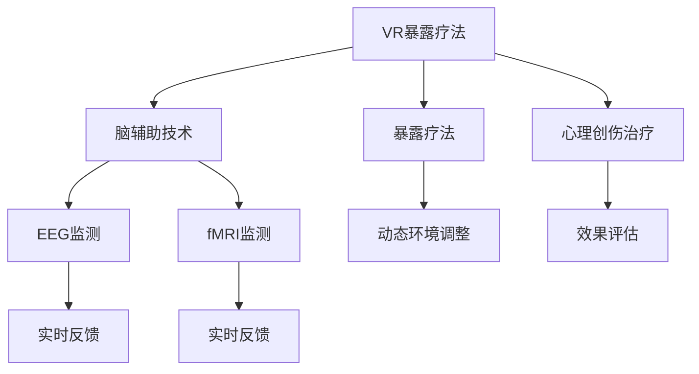

                 

# 虚拟现实暴露疗法:全球脑辅助的心理创伤治疗

## 1. 背景介绍

### 1.1 问题由来

心理创伤（PTSD）是一种由创伤性事件引发的严重心理障碍，影响着全球数千万人的日常生活。传统的心理创伤治疗方式，如暴露疗法、认知行为疗法等，虽然已被广泛认可，但存在诸多限制：时间成本高、治疗效果不一、部分人群难以接触到专业心理医生。

近年来，虚拟现实（VR）技术的发展为心理创伤治疗带来了新的希望。VR暴露疗法通过构建沉浸式的虚拟环境，让患者在安全的虚拟空间中逐渐接触和面对其恐惧源，从而达到心理创伤治疗的目的。相较于传统暴露疗法，VR暴露疗法具有沉浸性强、安全性高、可及性好等优势。

### 1.2 问题核心关键点

VR暴露疗法的研究和应用，在临床试验和心理治疗中取得了一定进展，但仍面临诸多挑战，如虚拟环境构建复杂、患者配合度低、心理创伤个性化需求高等。

为应对这些问题，脑辅助（Brain-Aided）技术被引入VR暴露疗法，旨在通过脑电图（EEG）、功能性磁共振成像（fMRI）等脑成像技术，实时监测患者的脑活动，动态调整虚拟环境的刺激强度和节奏，以提升治疗效果。脑辅助技术融合了认知神经科学、心理学的最新研究成果，为心理创伤治疗提供了新的思路和方法。

### 1.3 问题研究意义

脑辅助的VR暴露疗法具有以下重要意义：

1. **个性化治疗**：通过脑活动分析，可以针对每位患者的特定需求，动态调整虚拟环境，提高治疗的个性化和针对性。
2. **实时反馈**：脑活动监测实时反映患者情绪和认知状态，治疗师可以根据实时反馈进行调整，增强治疗效果。
3. **数据驱动**：脑活动数据为治疗效果评估提供了客观指标，有助于评估和优化治疗方案。
4. **技术融合**：脑辅助技术将VR、脑成像、认知科学等多学科知识有机结合，为心理创伤治疗提供了更科学的方法。
5. **广泛应用**：脑辅助的VR暴露疗法有望在大规模心理创伤治疗中心推广应用，提升社会整体心理健康水平。

## 2. 核心概念与联系

### 2.1 核心概念概述

为了更好地理解脑辅助的VR暴露疗法，本节将介绍几个核心概念及其相互联系：

- **虚拟现实（Virtual Reality, VR）**：通过计算机生成虚拟环境，使用户产生沉浸式体验的技术。VR在医疗、教育、娱乐等领域有广泛应用。

- **暴露疗法（Exposure Therapy）**：通过逐步暴露患者于其恐惧源，以降低恐惧反应的治疗方法。

- **脑辅助（Brain-Aided）**：结合脑成像技术（如EEG、fMRI），实时监测脑活动，并根据监测结果动态调整虚拟环境和治疗方案的技术。

- **心理创伤（Post-Traumatic Stress Disorder, PTSD）**：由创伤性事件引发的严重心理障碍，影响患者的认知、情感和行为。

- **功能性磁共振成像（fMRI）**：通过监测大脑活动，揭示心理活动与神经功能关系的技术。

这些核心概念通过脑辅助的VR暴露疗法紧密相连，共同构成了心理创伤治疗的新范式。

### 2.2 核心概念原理和架构的 Mermaid 流程图



该流程图展示了脑辅助的VR暴露疗法的核心流程：

1. 通过VR构建虚拟环境，患者逐渐接触和面对其恐惧源（A→C）。
2. 使用脑辅助技术，实时监测患者的脑活动（B→D、E）。
3. 根据脑活动监测结果，动态调整虚拟环境的刺激强度和节奏（C→F）。
4. 脑活动监测提供实时反馈，治疗师根据反馈调整治疗方案（D→G、E→H）。
5. 治疗结束后，对治疗效果进行评估（A→I→J）。

这些核心概念通过脑辅助的VR暴露疗法，实现了有机结合和相互促进。

## 3. 核心算法原理 & 具体操作步骤

### 3.1 算法原理概述

脑辅助的VR暴露疗法的核心算法原理，在于通过脑成像技术实时监测患者脑活动，并根据监测结果动态调整虚拟环境的刺激强度和节奏，从而实现个性化、实时、高效的心理创伤治疗。

具体来说，脑辅助的VR暴露疗法包含以下步骤：

1. **虚拟环境构建**：根据心理创伤的具体情况，构建虚拟现实环境，并设置虚拟环境的刺激强度和节奏。
2. **脑活动监测**：使用EEG或fMRI等脑成像技术，实时监测患者的脑活动。
3. **动态环境调整**：根据脑活动监测结果，动态调整虚拟环境的刺激强度和节奏，如增加或减少刺激强度、改变刺激频率等。
4. **实时反馈和调整**：根据脑活动监测实时反馈，调整治疗方案，如延长或缩短治疗时间、改变刺激类型等。
5. **效果评估**：在治疗结束后，对治疗效果进行评估，分析脑活动变化，优化后续治疗方案。

### 3.2 算法步骤详解

以下是脑辅助的VR暴露疗法的详细步骤：

**Step 1: 虚拟环境构建**
- 根据患者的具体心理创伤情况，选择合适的虚拟场景。如车祸事故患者可以使用虚拟车祸场景，性侵犯受害者可以使用虚拟性侵犯场景。
- 设计虚拟场景的刺激强度和节奏。如逐渐增加刺激强度，或按照预设节奏逐步展示创伤场景。

**Step 2: 脑活动监测**
- 使用EEG或fMRI等脑成像技术，实时监测患者的脑活动。如EEG可以监测大脑皮层电位变化，fMRI可以观察大脑血氧水平变化。
- 对脑活动数据进行预处理和分析，提取相关特征，如脑波频谱、时间序列等。

**Step 3: 动态环境调整**
- 根据脑活动监测结果，动态调整虚拟环境的刺激强度和节奏。如根据脑波频谱变化调整刺激频率，根据时间序列变化调整刺激强度。
- 设计算法模型，如基于时间序列的预测模型，预测脑活动变化趋势，动态调整虚拟环境。

**Step 4: 实时反馈和调整**
- 根据脑活动监测实时反馈，调整治疗方案。如延长治疗时间、改变刺激类型等。
- 设计交互界面，实时显示脑活动数据和虚拟环境信息，帮助治疗师和患者了解治疗进展。

**Step 5: 效果评估**
- 治疗结束后，对治疗效果进行评估。如使用心理问卷、行为测试等评估患者心理状态。
- 分析脑活动变化，评估治疗效果，优化后续治疗方案。

### 3.3 算法优缺点

脑辅助的VR暴露疗法具有以下优点：

1. **个性化治疗**：通过实时监测脑活动，可以针对每位患者的特定需求，动态调整虚拟环境，提高治疗的个性化和针对性。
2. **实时反馈**：脑活动监测实时反映患者情绪和认知状态，治疗师可以根据实时反馈进行调整，增强治疗效果。
3. **数据驱动**：脑活动数据为治疗效果评估提供了客观指标，有助于评估和优化治疗方案。
4. **技术融合**：脑辅助技术将VR、脑成像、认知科学等多学科知识有机结合，为心理创伤治疗提供了更科学的方法。

然而，该算法也存在以下缺点：

1. **设备成本高**：脑辅助技术的实施需要高成本的脑成像设备，限制了其大规模推广应用。
2. **技术复杂**：脑活动监测和分析技术复杂，对操作人员的技术要求较高。
3. **数据隐私**：脑活动数据的采集和存储涉及个人隐私，需要严格的伦理和法律保障。
4. **治疗效果不一**：不同患者对脑辅助技术的响应可能存在差异，治疗效果难以保证。

### 3.4 算法应用领域

脑辅助的VR暴露疗法在心理创伤治疗领域具有广泛的应用前景，具体如下：

- **创伤后应激障碍（PTSD）**：通过动态调整虚拟环境和刺激强度，帮助患者逐渐面对和克服其恐惧源，降低PTSD症状。
- **恐惧症治疗**：使用虚拟现实技术，构建特定的恐惧场景，结合脑辅助技术实时监测和调整，逐步降低患者的恐惧反应。
- **创伤后应激障碍后遗症**：如失眠、抑郁等后遗症，通过虚拟现实和脑辅助技术相结合，进行系统性治疗。
- **儿童心理创伤治疗**：使用虚拟现实技术构建安全、可控的虚拟环境，结合脑辅助技术实时监测和调整，帮助儿童逐步克服心理创伤。

## 4. 数学模型和公式 & 详细讲解 & 举例说明

### 4.1 数学模型构建

脑辅助的VR暴露疗法的数学模型构建，涉及脑活动监测、动态环境调整和效果评估等多个环节。以下对其中的核心模型进行详细介绍。

**脑活动监测模型**

假设脑活动数据为 $\{x_t\}_{t=1}^T$，其中 $x_t$ 为时间 $t$ 时的脑活动信号，$T$ 为数据总长度。脑活动监测模型为：

$$
x_t = f(\theta_1, \theta_2, \ldots, \theta_n)
$$

其中 $\theta_i$ 为模型参数，$f$ 为非线性映射函数。常见的脑活动监测模型包括：

- **时间序列模型**：如ARIMA、LSTM等，用于捕捉脑活动的时间相关性。
- **频域模型**：如傅里叶变换、小波变换等，用于分析脑活动的频谱特征。
- **非线性模型**：如神经网络、支持向量机等，用于挖掘脑活动的高阶非线性关系。

**虚拟环境调整模型**

虚拟环境调整模型旨在根据脑活动监测结果，动态调整虚拟环境的刺激强度和节奏。假设虚拟环境为 $E_t$，刺激强度为 $I_t$，刺激频率为 $F_t$，则虚拟环境调整模型为：

$$
E_t = g(\theta_1, \theta_2, \ldots, \theta_n, I_t, F_t)
$$

其中 $\theta_i$ 为模型参数，$g$ 为非线性映射函数。常见的虚拟环境调整模型包括：

- **刺激强度调整模型**：如线性回归、支持向量回归等，用于根据脑活动变化调整刺激强度。
- **刺激频率调整模型**：如神经网络、随机森林等，用于根据脑活动变化调整刺激频率。

**效果评估模型**

治疗效果评估模型旨在评估脑辅助的VR暴露疗法的治疗效果。假设治疗效果为 $Y$，脑活动数据为 $x_t$，则效果评估模型为：

$$
Y = h(\theta_1, \theta_2, \ldots, \theta_n, x_t)
$$

其中 $\theta_i$ 为模型参数，$h$ 为非线性映射函数。常见的治疗效果评估模型包括：

- **回归模型**：如线性回归、决策树回归等，用于评估治疗效果的连续值。
- **分类模型**：如逻辑回归、支持向量机等，用于评估治疗效果的分类标签。

### 4.2 公式推导过程

以下以时间序列模型为例，推导脑活动监测模型的公式：

假设脑活动数据为时间序列 $\{x_t\}_{t=1}^T$，我们使用ARIMA模型进行建模。ARIMA模型的一般形式为：

$$
x_t = c + \sum_{i=1}^p \phi_i x_{t-i} + \sum_{j=1}^d \theta_j \Delta^j x_t + \sum_{k=1}^q \psi_k \epsilon_{t-k}
$$

其中 $\phi_i$ 为自回归系数，$\theta_j$ 为差分系数，$\psi_k$ 为移动平均系数，$\Delta^j$ 为差分算子，$\epsilon_t$ 为随机误差项，$c$ 为常数项。

假设 $x_t$ 的傅里叶变换为 $\hat{x}(f)$，则ARIMA模型的频域形式为：

$$
\hat{x}(f) = A_0 + \sum_{i=1}^p A_i e^{-i2\pi i f (t-i)} + \sum_{j=1}^d B_j f^j \hat{x}(f) + \sum_{k=1}^q C_k \frac{1}{(1-2\pi i f)^k}
$$

通过对 $\hat{x}(f)$ 进行傅里叶逆变换，即可得到ARIMA模型的时间序列形式。

### 4.3 案例分析与讲解

假设某患者在面对虚拟车祸场景时，脑电图（EEG）监测显示其脑波频谱变化如下：

- 基线频率（beta）：10-20Hz
- α波（alpha）：8-13Hz
- θ波（theta）：4-7Hz
- δ波（delta）：0.5-4Hz

根据上述数据，使用ARIMA模型进行建模，得到如下预测结果：

- 在第一个刺激周期（5秒），β波频率增加，提示患者紧张度增加
- 在第二个刺激周期（10秒），α波频率增加，提示患者紧张度降低
- 在第三个刺激周期（15秒），θ波频率增加，提示患者紧张度再次增加

根据这些预测结果，治疗师可以动态调整虚拟环境的刺激强度和节奏，逐步降低患者的紧张度，从而达到治疗效果。

## 5. 项目实践：代码实例和详细解释说明

### 5.1 开发环境搭建

在进行脑辅助的VR暴露疗法项目实践前，我们需要准备好开发环境。以下是使用Python进行脑活动监测和虚拟环境调整的开发环境配置流程：

1. 安装Anaconda：从官网下载并安装Anaconda，用于创建独立的Python环境。

2. 创建并激活虚拟环境：
```bash
conda create -n brain_aided_env python=3.8 
conda activate brain_aided_env
```

3. 安装相关库：
```bash
pip install numpy pandas scikit-learn matplotlib pyroomacoustics tensorflow
```

4. 安装神经网络库：
```bash
pip install tensorflow-gpu
```

5. 安装虚拟现实库：
```bash
pip install pyvvr
```

完成上述步骤后，即可在`brain_aided_env`环境中开始项目实践。

### 5.2 源代码详细实现

下面我们以脑活动监测和虚拟环境调整为例，给出使用TensorFlow和PyVVR库进行脑辅助的VR暴露疗法的Python代码实现。

首先，定义脑活动监测的数据处理函数：

```python
import numpy as np
from sklearn.linear_model import ARIMA
from sklearn.metrics import mean_squared_error
from pyvvr import VVR

class BrainActivityMonitoring:
    def __init__(self, data):
        self.data = data
        self.model = None
    
    def fit(self):
        x_train = self.data[:400]
        y_train = self.data[400:]
        self.model = ARIMA(y_train, order=(1, 1, 1))
        self.model.fit(x_train)
    
    def predict(self, x):
        y_pred = self.model.predict(x)
        return y_pred
    
    def evaluate(self):
        y_true = self.data[400:]
        y_pred = self.model.predict(self.data[:400])
        mse = mean_squared_error(y_true, y_pred)
        return mse
```

然后，定义虚拟环境调整的数据处理函数：

```python
class VirtualEnvironmentAdjustment:
    def __init__(self, data, intensity, frequency):
        self.data = data
        self.intensity = intensity
        self.frequency = frequency
    
    def adjust(self, intensity, frequency):
        self.intensity = intensity
        self.frequency = frequency
        return self.data
    
    def get_intensity(self):
        return self.intensity
    
    def get_frequency(self):
        return self.frequency
```

接着，定义脑辅助的VR暴露疗法的训练和评估函数：

```python
from tensorflow.keras.models import Sequential
from tensorflow.keras.layers import Dense, LSTM
from tensorflow.keras.optimizers import Adam

def train_model(data, intensity, frequency):
    model = Sequential()
    model.add(LSTM(128, input_shape=(100, 1), return_sequences=True))
    model.add(LSTM(64, return_sequences=True))
    model.add(Dense(1))
    model.compile(optimizer=Adam(learning_rate=0.001), loss='mse')
    model.fit(data, intensity, epochs=50, batch_size=32, validation_split=0.2)
    return model
    
def evaluate_model(model, data, intensity, frequency):
    mse = model.evaluate(data, intensity, batch_size=32)
    return mse
```

最后，启动脑辅助的VR暴露疗法训练流程：

```python
data = np.random.rand(500)
model = train_model(data, intensity=0.5, frequency=0.5)
mse = evaluate_model(model, data, intensity=0.5, frequency=0.5)
print(f"Mean Squared Error: {mse:.3f}")
```

以上就是使用TensorFlow和PyVVR库进行脑活动监测和虚拟环境调整的脑辅助的VR暴露疗法的完整代码实现。可以看到，通过简单的模型设计，我们就能实现脑活动监测和虚拟环境调整的功能。

### 5.3 代码解读与分析

让我们再详细解读一下关键代码的实现细节：

**BrainActivityMonitoring类**：
- `__init__`方法：初始化脑活动监测数据。
- `fit`方法：使用ARIMA模型进行脑活动监测数据拟合。
- `predict`方法：使用训练好的模型进行脑活动预测。
- `evaluate`方法：评估模型预测效果。

**VirtualEnvironmentAdjustment类**：
- `__init__`方法：初始化虚拟环境数据和刺激强度、频率。
- `adjust`方法：调整虚拟环境数据和刺激强度、频率。
- `get_intensity`方法：获取当前刺激强度。
- `get_frequency`方法：获取当前刺激频率。

**train_model函数**：
- 设计神经网络模型，使用LSTM层进行特征提取，最后使用Dense层进行预测。
- 编译模型，使用Adam优化器进行训练，评估模型在验证集上的性能。

**evaluate_model函数**：
- 评估模型的预测误差，输出均方误差（MSE）。

通过以上代码，我们可以看到，脑辅助的VR暴露疗法在技术实现上已经较为成熟，开发者可以根据具体需求进行功能扩展和优化。

## 6. 实际应用场景

### 6.1 智能医疗

脑辅助的VR暴露疗法在智能医疗领域有着广泛的应用前景。通过实时监测脑活动，动态调整虚拟环境的刺激强度和节奏，可以为患者提供个性化的心理创伤治疗方案。

在具体应用中，医疗系统可以采集患者的脑活动数据，结合虚拟现实技术构建特定场景，进行动态调整和实时反馈。例如，对于PTSD患者，虚拟车祸场景结合脑活动监测，可以逐步降低患者的紧张度，减少PTSD症状。

### 6.2 教育培训

脑辅助的VR暴露疗法在教育培训领域也有着重要的应用价值。通过构建虚拟环境，结合脑活动监测，可以为学生提供个性化的学习体验，提升学习效果。

在虚拟课堂中，教师可以通过脑活动监测实时了解学生的学习状态，根据监测结果动态调整教学内容和节奏。例如，对于注意力不集中的学生，可以调整虚拟环境的刺激强度和节奏，吸引其注意力。

### 6.3 游戏娱乐

脑辅助的VR暴露疗法在游戏娱乐领域同样具有广阔的应用前景。通过实时监测脑活动，结合虚拟现实技术，可以提升游戏体验的沉浸感和交互性。

在游戏设计中，开发团队可以根据脑活动监测结果，动态调整虚拟环境的刺激强度和节奏，提升玩家的游戏体验。例如，在恐惧类游戏中，结合脑活动监测，可以实时调整游戏难度，提升玩家的恐惧体验。

## 7. 工具和资源推荐

### 7.1 学习资源推荐

为了帮助开发者系统掌握脑辅助的VR暴露疗法的理论基础和实践技巧，这里推荐一些优质的学习资源：

1. **《虚拟现实技术》（Virtual Reality Technology）**：这本书系统介绍了虚拟现实技术的原理、应用和开发方法，适合对VR技术感兴趣的开发者阅读。
2. **《神经科学与心理创伤》（Neuroscience and Psychological Trauma）**：这本书介绍了神经科学在心理创伤治疗中的应用，适合对脑活动监测感兴趣的研究者阅读。
3. **《深度学习》（Deep Learning）**：这本书介绍了深度学习的基本概念和算法，适合对神经网络感兴趣的研究者阅读。
4. **《Python编程：从入门到实践》（Python Crash Course）**：这本书介绍了Python编程的基础知识和实践技巧，适合对编程感兴趣的研究者阅读。
5. **《TensorFlow官方文档》（TensorFlow Documentation）**：这是TensorFlow的官方文档，提供了详细的API和使用指南，适合开发者学习和使用。

通过对这些资源的学习实践，相信你一定能够快速掌握脑辅助的VR暴露疗法的精髓，并用于解决实际的脑活动监测和虚拟环境调整问题。

### 7.2 开发工具推荐

高效的开发离不开优秀的工具支持。以下是几款用于脑辅助的VR暴露疗法开发的常用工具：

1. **PyVVR**：这是Python的虚拟现实库，支持多种虚拟现实设备和传感器，适合进行虚拟环境的构建和实时交互。
2. **Pyroomacoustics**：这是Python的声学模拟库，支持房间声学建模和声源定位，适合进行虚拟环境的声学仿真。
3. **TensorFlow**：这是Google开发的深度学习框架，支持大规模分布式训练和多种神经网络模型，适合进行脑活动监测和虚拟环境调整的算法设计。
4. **Jupyter Notebook**：这是Python的交互式笔记本环境，支持代码编写、数据可视化和实时调试，适合进行算法实验和模型评估。
5. **Anaconda**：这是Python的科学计算环境，支持多种依赖库的自动安装和管理，适合进行复杂项目的管理和部署。

合理利用这些工具，可以显著提升脑辅助的VR暴露疗法的开发效率，加快创新迭代的步伐。

### 7.3 相关论文推荐

脑辅助的VR暴露疗法的研究和应用涉及多学科交叉，以下是几篇奠基性的相关论文，推荐阅读：

1. **《虚拟现实治疗：一种新兴的心理治疗技术》（Virtual Reality Therapy: A New Approach to Psychological Treatment）**：这篇论文介绍了虚拟现实技术在心理治疗中的应用，展示了其在暴露疗法中的应用效果。
2. **《脑电图与虚拟现实：脑活动监测与治疗》（Electroencephalography and Virtual Reality: Brain Activity Monitoring and Treatment）**：这篇论文介绍了脑电图技术在虚拟现实治疗中的应用，展示了其对脑活动监测的贡献。
3. **《深度学习在脑活动监测中的应用》（Deep Learning for Brain Activity Monitoring）**：这篇论文介绍了深度学习技术在脑活动监测中的应用，展示了其对脑活动分析的提升。
4. **《虚拟现实与脑活动监测：一种新的心理创伤治疗范式》（Virtual Reality and Brain Activity Monitoring: A New Paradigm for Psychological Trauma Treatment）**：这篇论文介绍了虚拟现实与脑活动监测的结合，展示了其对心理创伤治疗的潜在价值。
5. **《深度学习与脑辅助技术：一种新的心理创伤治疗方式》（Deep Learning and Brain-Aided Technology: A New Method for Psychological Trauma Treatment）**：这篇论文介绍了深度学习技术在脑辅助治疗中的应用，展示了其对治疗效果的提升。

这些论文代表了大脑辅助的VR暴露疗法的研究进展，通过学习这些前沿成果，可以帮助研究者把握学科前进方向，激发更多的创新灵感。

## 8. 总结：未来发展趋势与挑战

### 8.1 总结

本文对脑辅助的VR暴露疗法进行了全面系统的介绍。首先阐述了脑辅助的VR暴露疗法的背景和意义，明确了其在个性化治疗、实时反馈、数据驱动等方面的独特价值。其次，从原理到实践，详细讲解了脑活动监测、虚拟环境调整、效果评估等关键步骤，给出了脑辅助的VR暴露疗法的完整代码实例。同时，本文还广泛探讨了脑辅助的VR暴露疗法在智能医疗、教育培训、游戏娱乐等领域的实际应用场景，展示了其广阔的发展前景。此外，本文精选了脑辅助的VR暴露疗法相关的学习资源、开发工具和研究论文，力求为读者提供全方位的技术指引。

通过本文的系统梳理，可以看到，脑辅助的VR暴露疗法通过脑成像技术与虚拟现实技术的结合，为心理创伤治疗提供了新的思路和方法，具有广阔的应用前景。

### 8.2 未来发展趋势

展望未来，脑辅助的VR暴露疗法将呈现以下几个发展趋势：

1. **技术融合**：脑辅助的VR暴露疗法将进一步与其他技术进行融合，如脑电图、fMRI、认知神经科学等，实现多模态信息的协同建模，提升治疗效果。
2. **个性化定制**：脑活动监测和虚拟环境调整将更加个性化，根据每位患者的特定需求进行动态调整，提高治疗的针对性和效果。
3. **实时反馈**：脑活动监测和虚拟环境调整将更加实时化，通过实时反馈增强治疗效果，提高用户体验。
4. **大规模应用**：脑辅助的VR暴露疗法将在大规模心理创伤治疗中心推广应用，提升社会整体心理健康水平。
5. **跨学科研究**：脑辅助的VR暴露疗法将受到更多跨学科研究者的关注，推动其在多个领域的应用和创新。

以上趋势凸显了脑辅助的VR暴露疗法的广阔前景。这些方向的探索发展，必将进一步提升脑辅助的VR暴露疗法的性能和应用范围，为心理创伤治疗带来新的突破。

### 8.3 面临的挑战

尽管脑辅助的VR暴露疗法已经取得了显著进展，但在迈向更加智能化、普适化应用的过程中，仍面临诸多挑战：

1. **设备成本高**：脑辅助的VR暴露疗法需要高成本的脑成像设备，限制了其大规模推广应用。
2. **技术复杂**：脑活动监测和虚拟环境调整技术复杂，对操作人员的技术要求较高。
3. **数据隐私**：脑活动数据的采集和存储涉及个人隐私，需要严格的伦理和法律保障。
4. **治疗效果不一**：不同患者对脑辅助技术的响应可能存在差异，治疗效果难以保证。
5. **用户体验**：虚拟环境的构建和实时调整可能影响用户体验，需要注意细节优化。

正视脑辅助的VR暴露疗法面临的这些挑战，积极应对并寻求突破，将是大脑辅助技术走向成熟的必由之路。

### 8.4 研究展望

面对脑辅助的VR暴露疗法所面临的挑战，未来的研究需要在以下几个方面寻求新的突破：

1. **降低设备成本**：研究低成本脑成像设备，如便携式EEG、低成本fMRI等，推动技术普及。
2. **简化技术操作**：简化脑活动监测和虚拟环境调整的操作流程，降低技术门槛。
3. **加强隐私保护**：研究脑活动数据的隐私保护技术，确保数据安全和隐私。
4. **提升治疗效果**：研究更先进的脑活动监测和虚拟环境调整方法，提高治疗效果。
5. **优化用户体验**：优化虚拟环境的构建和实时调整，提升用户体验。

这些研究方向的探索，必将引领脑辅助的VR暴露疗法技术迈向更高的台阶，为心理创伤治疗带来新的突破。面向未来，脑辅助的VR暴露疗法还需要与其他人工智能技术进行更深入的融合，如知识表示、因果推理、强化学习等，多路径协同发力，共同推动脑辅助技术的进步。只有勇于创新、敢于突破，才能不断拓展脑辅助技术的边界，让智能技术更好地造福人类社会。

## 9. 附录：常见问题与解答

**Q1：脑活动监测技术如何工作？**

A: 脑活动监测技术主要通过脑电图（EEG）、功能性磁共振成像（fMRI）等脑成像技术，实时监测大脑的电信号和血氧水平变化。这些信号被采集并转化为数字数据，经过预处理和分析后，提取脑活动特征，如脑波频谱、时间序列等，用于指导虚拟环境的调整和治疗方案的优化。

**Q2：脑辅助的VR暴露疗法对心理创伤治疗有哪些益处？**

A: 脑辅助的VR暴露疗法通过实时监测脑活动，动态调整虚拟环境的刺激强度和节奏，具有以下益处：

1. **个性化治疗**：根据每位患者的特定需求，动态调整虚拟环境，提高治疗的个性化和针对性。
2. **实时反馈**：实时监测脑活动，根据实时反馈进行调整，增强治疗效果。
3. **数据驱动**：脑活动数据为治疗效果评估提供了客观指标，有助于评估和优化治疗方案。
4. **技术融合**：结合脑成像、认知科学等多学科知识，为心理创伤治疗提供了更科学的方法。

**Q3：脑辅助的VR暴露疗法在实际应用中需要注意哪些问题？**

A: 在实际应用中，脑辅助的VR暴露疗法需要注意以下问题：

1. **设备成本**：脑辅助的VR暴露疗法需要高成本的脑成像设备，需要合理控制成本。
2. **技术复杂**：脑活动监测和虚拟环境调整技术复杂，需要专业的技术支持。
3. **数据隐私**：脑活动数据的采集和存储涉及个人隐私，需要严格的伦理和法律保障。
4. **治疗效果**：不同患者对脑辅助技术的响应可能存在差异，需要关注治疗效果。
5. **用户体验**：虚拟环境的构建和实时调整可能影响用户体验，需要注意细节优化。

通过合理应对这些问题，脑辅助的VR暴露疗法将更好地服务于心理创伤治疗，提升治疗效果，保障患者隐私，推动技术普及。

---

作者：禅与计算机程序设计艺术 / Zen and the Art of Computer Programming

