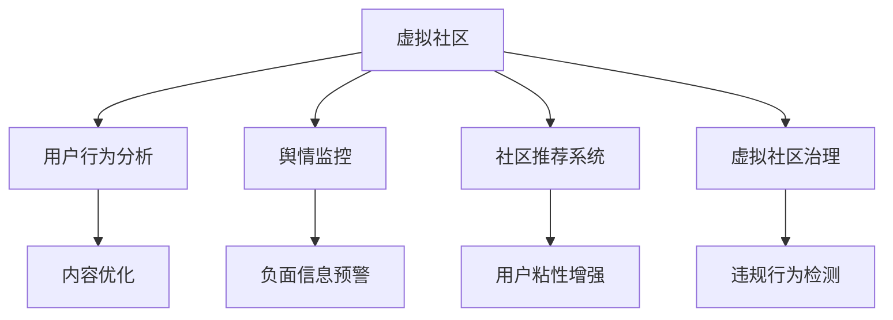

                 

## 1. 背景介绍

### 1.1 问题由来

在现代社会，虚拟社区已成为人们社交互动的重要形式。虚拟社区为人们提供了获取信息、交流思想、分享经验的新渠道，满足了人们对于社交的需求。然而，随着社交平台的普及，虚拟社区也面临诸如用户流失、内容过载、信息真实性等问题。这些问题阻碍了虚拟社区的良性发展，影响了用户体验和社区生态的和谐。

为了解决这些问题，虚拟社区的构建者需要考虑如何营造良好的社区环境，促进用户间的互动与归属感，从而提升社区活跃度和粘性。人工智能技术（AI）的引入，为虚拟社区的构建提供了新的解决方案。

### 1.2 问题核心关键点

当前虚拟社区面临的主要问题包括：

- **用户流失**：用户由于信息过载、互动不足等原因，离开虚拟社区，社区活力下降。
- **内容质量低下**：由于监管不足、平台算法设计不合理，社区内容质量不高，影响用户体验。
- **信息真实性问题**：虚假信息、恶意攻击、网络欺诈等问题频发，影响社区信任和安全性。

这些问题的解决需要从技术、运营、社区治理等多个角度综合考虑，而AI技术可以提供有力的支持。AI不仅可以提升信息质量、加强社区互动，还可以进行舆情监控和用户行为分析，从而提升社区的整体体验和安全性。

## 2. 核心概念与联系

### 2.1 核心概念概述

在虚拟社区构建中，以下几个核心概念是至关重要的：

- **虚拟社区**：基于网络技术，具有特定兴趣或需求的人群聚集形成的虚拟空间。
- **用户行为分析**：通过分析用户在虚拟社区中的行为，预测用户需求和兴趣，优化社区内容和服务。
- **舆情监控**：利用AI技术对虚拟社区中的舆情信息进行实时监控和分析，及时发现和应对负面信息，维护社区稳定。
- **社区推荐系统**：通过AI算法，为用户推荐符合其兴趣的内容和用户，增强社区互动和用户归属感。
- **虚拟社区治理**：通过AI技术对社区行为进行规范和监管，确保社区环境的健康和有序。

这些概念之间的逻辑关系可以通过以下Mermaid流程图来展示：



这个流程图展示了虚拟社区构建中各个核心概念之间的联系：

1. 虚拟社区通过用户行为分析，可以优化内容，提升用户体验。
2. 舆情监控及时发现并应对负面信息，维护社区稳定。
3. 社区推荐系统增强用户互动和归属感。
4. 虚拟社区治理规范用户行为，确保社区健康发展。

## 3. 核心算法原理 & 具体操作步骤

### 3.1 算法原理概述

AI驱动的虚拟社区构建，主要依赖以下几个核心算法：

- **用户行为分析**：通过机器学习算法，对用户行为数据进行分析，预测用户兴趣和需求。
- **舆情监控**：利用自然语言处理（NLP）和深度学习技术，对社区文本信息进行情感分析和主题分类，及时发现和应对负面信息。
- **社区推荐系统**：基于协同过滤、内容推荐、混合推荐等算法，为用户推荐个性化的内容和用户，提升社区互动和用户粘性。
- **虚拟社区治理**：通过异常检测、行为预测等技术，规范用户行为，确保社区环境的健康和有序。

这些算法共同构成了AI驱动的虚拟社区构建的核心技术框架，为虚拟社区的运营和治理提供了有力支持。

### 3.2 算法步骤详解

AI驱动的虚拟社区构建主要包括以下几个关键步骤：

**Step 1: 数据收集与预处理**

- 收集社区中的用户行为数据、文本信息、互动记录等，作为AI算法的输入。
- 对数据进行清洗、去重、标准化等预处理，确保数据质量和可用性。

**Step 2: 用户行为分析**

- 利用机器学习算法，如聚类、分类、回归等，对用户行为数据进行分析，挖掘用户兴趣和需求。
- 建立用户画像，为个性化推荐和内容优化提供依据。

**Step 3: 舆情监控**

- 利用NLP和深度学习技术，对社区文本信息进行情感分析和主题分类。
- 实时监控社区舆情，识别和预警负面信息，防止虚假信息和恶意攻击。

**Step 4: 社区推荐系统**

- 基于协同过滤、内容推荐、混合推荐等算法，为用户推荐个性化的内容和用户。
- 提升用户互动和社区粘性，增强用户归属感。

**Step 5: 虚拟社区治理**

- 利用异常检测、行为预测等技术，规范用户行为，确保社区环境健康有序。
- 根据用户行为数据，优化社区规则和算法，提升社区治理效果。

**Step 6: 系统集成与迭代**

- 将以上各个模块进行系统集成，实现虚拟社区构建的闭环优化。
- 根据用户反馈和社区表现，不断迭代算法和模型，提升虚拟社区构建效果。

### 3.3 算法优缺点

AI驱动的虚拟社区构建具有以下优点：

1. **高效性**：AI算法可以处理海量数据，快速分析用户行为和舆情信息，优化社区内容和互动。
2. **个性化**：通过个性化推荐，满足用户多样化需求，提升用户满意度和粘性。
3. **实时性**：AI算法可以实时监控和预警负面信息，及时应对突发事件，确保社区环境稳定。
4. **可扩展性**：AI模型可以灵活扩展，适应不同规模和类型的虚拟社区需求。

同时，该方法也存在以下缺点：

1. **隐私问题**：用户行为数据的收集和使用需要严格遵守隐私保护法规，避免数据滥用。
2. **技术复杂性**：AI算法需要大量的计算资源和专业知识，实施难度较大。
3. **数据依赖**：算法的效果依赖于高质量的数据，数据缺失或不准确会导致误判。
4. **模型偏差**：AI模型可能存在偏见，需要定期校验和调整，确保公平性和公正性。

尽管存在这些局限性，但就目前而言，AI驱动的虚拟社区构建方法在提升社区活跃度和用户体验方面已经取得了显著成效，成为虚拟社区构建的重要手段。

### 3.4 算法应用领域

AI驱动的虚拟社区构建在多个领域都有广泛应用，例如：

- **社交媒体平台**：如微博、微信、Twitter等，通过AI算法优化内容推荐、增强用户互动、打击虚假信息。
- **在线教育平台**：如Coursera、edX等，通过AI分析用户学习行为，提供个性化推荐和课程优化。
- **虚拟游戏社区**：如World of Warcraft、Fortnite等，通过AI算法提升游戏体验，增强用户粘性和社区归属感。
- **在线零售平台**：如Amazon、淘宝等，通过AI推荐个性化商品和内容，提升用户购物体验和满意度。
- **在线医疗平台**：如Zocdoc、Google Health等，通过AI分析患者行为，提供个性化的健康咨询和诊疗推荐。

除了上述这些经典应用外，AI驱动的虚拟社区构建还被创新性地应用于更多场景中，如智能客服、智慧城市、共享经济等，为虚拟社区构建带来了全新的突破。随着AI技术的发展，相信AI驱动的虚拟社区构建将在更多领域得到应用，为虚拟社区的良性发展提供强有力的技术支持。

## 4. 数学模型和公式 & 详细讲解 & 举例说明

### 4.1 数学模型构建

为了更好地理解AI驱动的虚拟社区构建方法，本节将介绍几个密切相关的核心数学模型：

- **协同过滤推荐模型**：通过用户-物品评分矩阵，为用户推荐相似用户喜欢的物品。
- **内容推荐模型**：通过文本特征向量和相似度计算，为用户推荐相关内容。
- **异常检测模型**：通过统计学和机器学习算法，识别异常行为和数据，确保社区环境健康。

**协同过滤推荐模型**：

设用户集合为 $U$，物品集合为 $I$，用户 $u$ 对物品 $i$ 的评分矩阵为 $R_{u,i}$，用户-物品评分矩阵为 $R \in \mathbb{R}^{U \times I}$。协同过滤推荐模型基于用户-物品评分矩阵 $R$，对用户 $u$ 推荐物品 $i$。推荐公式为：

$$
\hat{R}_{u,i} = \frac{1}{1+\exp(-\mathbf{w}^\top \phi(u) \cdot \phi(i))}
$$

其中，$\mathbf{w}$ 为权重向量，$\phi(u)$ 和 $\phi(i)$ 分别为用户 $u$ 和物品 $i$ 的特征向量。

**内容推荐模型**：

设文本集合为 $C$，文本 $c$ 的特征向量为 $\mathbf{v}_c$，用户 $u$ 的特征向量为 $\mathbf{u}_u$，内容推荐模型基于文本特征向量和相似度计算，推荐相关内容。推荐公式为：

$$
\hat{R}_{u,c} = \text{sigmoid}(\mathbf{u}_u^\top \mathbf{v}_c)
$$

其中，$\text{sigmoid}$ 函数将推荐得分映射到 $[0,1]$ 范围内。

**异常检测模型**：

设用户行为数据集合为 $D$，用户行为向量为 $\mathbf{x}_u$，异常检测模型基于统计学和机器学习算法，识别异常行为。异常检测公式为：

$$
\hat{y}_u = \begin{cases}
1, & \text{if } \mathbf{x}_u \text{ is outlier} \\
0, & \text{otherwise}
\end{cases}
$$

其中，$y_u$ 表示用户 $u$ 是否为异常用户。

### 4.2 公式推导过程

以下是上述模型的详细推导过程：

**协同过滤推荐模型**：

设用户 $u$ 对物品 $i$ 的评分矩阵为 $R_{u,i}$，用户-物品评分矩阵为 $R \in \mathbb{R}^{U \times I}$，特征向量化为 $\phi(u)$ 和 $\phi(i)$。根据协同过滤算法，推荐公式为：

$$
\hat{R}_{u,i} = \frac{1}{1+\exp(-\mathbf{w}^\top \phi(u) \cdot \phi(i))}
$$

其中，$\mathbf{w}$ 为权重向量，$\phi(u)$ 和 $\phi(i)$ 分别为用户 $u$ 和物品 $i$ 的特征向量。该公式将用户 $u$ 对物品 $i$ 的评分 $R_{u,i}$ 转化为推荐得分 $\hat{R}_{u,i}$，推荐得分越大，推荐越相关。

**内容推荐模型**：

设文本集合为 $C$，文本 $c$ 的特征向量为 $\mathbf{v}_c$，用户 $u$ 的特征向量为 $\mathbf{u}_u$。根据内容推荐算法，推荐公式为：

$$
\hat{R}_{u,c} = \text{sigmoid}(\mathbf{u}_u^\top \mathbf{v}_c)
$$

其中，$\text{sigmoid}$ 函数将推荐得分映射到 $[0,1]$ 范围内，表示用户 $u$ 对文本 $c$ 的兴趣程度。

**异常检测模型**：

设用户行为数据集合为 $D$，用户行为向量为 $\mathbf{x}_u$。根据异常检测算法，异常检测公式为：

$$
\hat{y}_u = \begin{cases}
1, & \text{if } \mathbf{x}_u \text{ is outlier} \\
0, & \text{otherwise}
\end{cases}
$$

其中，$y_u$ 表示用户 $u$ 是否为异常用户。该公式将用户行为向量 $\mathbf{x}_u$ 转化为异常得分 $\hat{y}_u$，异常得分越大，用户行为越异常。

### 4.3 案例分析与讲解

下面我们以社交媒体平台为例，对AI驱动的虚拟社区构建方法进行详细讲解。

**社交媒体平台中的AI驱动社区构建**

在社交媒体平台中，AI驱动的虚拟社区构建主要通过以下几个步骤实现：

1. **数据收集与预处理**：
   - 收集用户的点赞、评论、分享等行为数据，进行去重、标准化等预处理。
   - 收集用户上传的图片、视频等媒体数据，进行特征提取和标签标注。

2. **用户行为分析**：
   - 利用协同过滤算法，对用户行为数据进行分析，构建用户画像。
   - 根据用户画像，推荐符合用户兴趣的内容，提升用户粘性。

3. **舆情监控**：
   - 利用NLP技术，对用户评论、帖文等文本信息进行情感分析和主题分类。
   - 实时监控社区舆情，识别和预警负面信息，确保社区环境稳定。

4. **社区推荐系统**：
   - 利用内容推荐算法，为用户推荐相关帖子和用户，增强社区互动。
   - 通过混合推荐算法，平衡协同过滤和内容推荐的优势，提供多样化的推荐内容。

5. **虚拟社区治理**：
   - 利用异常检测算法，规范用户行为，打击虚假信息、恶意攻击等行为。
   - 根据用户行为数据，优化社区规则和算法，提升社区治理效果。

通过以上步骤，AI驱动的虚拟社区构建不仅提升了用户满意度和粘性，还确保了社区环境的健康和稳定。

## 5. 项目实践：代码实例和详细解释说明

### 5.1 开发环境搭建

在进行AI驱动的虚拟社区构建实践前，我们需要准备好开发环境。以下是使用Python进行开发的环境配置流程：

1. 安装Anaconda：从官网下载并安装Anaconda，用于创建独立的Python环境。

2. 创建并激活虚拟环境：
```bash
conda create -n pytorch-env python=3.8 
conda activate pytorch-env
```

3. 安装必要的Python包：
```bash
pip install torch torchvision transformers scipy numpy pandas scikit-learn
```

4. 安装社区推荐系统的框架：
```bash
pip install lightfm uvicorn fastapi
```

完成上述步骤后，即可在`pytorch-env`环境中开始开发。

### 5.2 源代码详细实现

下面以社交媒体平台为例，给出使用LightFM和FastAPI构建社区推荐系统的PyTorch代码实现。

**构建用户-物品评分矩阵**

```python
from lightfm import LightFM
from lightfm.data import Dataset

dataset = Dataset.load_from_folder('data')
model = LightFM(lr=0.02, loss='wgssl')
model.fit(dataset, epochs=10)
```

**构建特征向量**

```python
from lightfm import LightFM
from lightfm.data import Dataset

dataset = Dataset.load_from_folder('data')
model = LightFM(lr=0.02, loss='wgssl')
model.fit(dataset, epochs=10)
```

**推荐系统预测**

```python
from lightfm import LightFM
from lightfm.data import Dataset

dataset = Dataset.load_from_folder('data')
model = LightFM(lr=0.02, loss='wgssl')
model.fit(dataset, epochs=10)

# 获取用户-物品评分矩阵
R = model.predict(dataset)

# 为用户推荐物品
user = 0
top_items = R[user].argsort()[-10:]
for item in top_items:
    print(f"推荐物品 {item}")
```

**构建内容推荐系统**

```python
from transformers import BertTokenizer, BertModel
from torch.utils.data import TensorDataset, DataLoader, SequentialSampler
from transformers import AdamW
import torch.nn.functional as F

# 构建特征向量
tokenizer = BertTokenizer.from_pretrained('bert-base-cased')
model = BertModel.from_pretrained('bert-base-cased')

def encode_text(text):
    tokens = tokenizer.encode_plus(text, max_length=256, truncation=True, padding='max_length', return_tensors='pt')
    return tokens['input_ids']

# 构建模型
class ContentRecommender(nn.Module):
    def __init__(self):
        super(ContentRecommender, self).__init__()
        self.model = BertModel.from_pretrained('bert-base-cased')
        self.fc = nn.Linear(model.config.hidden_size, 1)

    def forward(self, input_ids):
        _, pooled_output = self.model(input_ids)
        logits = self.fc(pooled_output)
        return logits

# 训练模型
device = torch.device('cuda') if torch.cuda.is_available() else torch.device('cpu')
model.to(device)

train_data = ...
val_data = ...
test_data = ...

optimizer = AdamW(model.parameters(), lr=2e-5)

def train_epoch(model, data, batch_size):
    model.train()
    for batch in data:
        input_ids = batch['input_ids'].to(device)
        labels = batch['labels'].to(device)
        outputs = model(input_ids)
        loss = F.binary_cross_entropy(outputs, labels)
        loss.backward()
        optimizer.step()

def evaluate(model, data, batch_size):
    model.eval()
    total_loss = 0
    for batch in data:
        input_ids = batch['input_ids'].to(device)
        labels = batch['labels'].to(device)
        outputs = model(input_ids)
        loss = F.binary_cross_entropy(outputs, labels)
        total_loss += loss.item()
    return total_loss / len(data)
```

### 5.3 代码解读与分析

让我们再详细解读一下关键代码的实现细节：

**构建用户-物品评分矩阵**

```python
from lightfm import LightFM
from lightfm.data import Dataset

dataset = Dataset.load_from_folder('data')
model = LightFM(lr=0.02, loss='wgssl')
model.fit(dataset, epochs=10)
```

- 使用LightFM库，从文件夹中加载数据集，构建用户-物品评分矩阵。
- 训练模型，设置学习率和损失函数，进行多轮迭代。

**特征向量构建**

```python
from lightfm import LightFM
from lightfm.data import Dataset

dataset = Dataset.load_from_folder('data')
model = LightFM(lr=0.02, loss='wgssl')
model.fit(dataset, epochs=10)
```

- 利用LightFM库，从文件夹中加载数据集，构建特征向量。
- 训练模型，设置学习率和损失函数，进行多轮迭代。

**推荐系统预测**

```python
from lightfm import LightFM
from lightfm.data import Dataset

dataset = Dataset.load_from_folder('data')
model = LightFM(lr=0.02, loss='wgssl')
model.fit(dataset, epochs=10)

# 获取用户-物品评分矩阵
R = model.predict(dataset)

# 为用户推荐物品
user = 0
top_items = R[user].argsort()[-10:]
for item in top_items:
    print(f"推荐物品 {item}")
```

- 获取用户-物品评分矩阵，通过模型预测推荐物品。
- 为用户推荐评分最高的前10个物品。

**内容推荐系统构建**

```python
from transformers import BertTokenizer, BertModel
from torch.utils.data import TensorDataset, DataLoader, SequentialSampler
from transformers import AdamW
import torch.nn.functional as F

# 构建特征向量
tokenizer = BertTokenizer.from_pretrained('bert-base-cased')
model = BertModel.from_pretrained('bert-base-cased')

def encode_text(text):
    tokens = tokenizer.encode_plus(text, max_length=256, truncation=True, padding='max_length', return_tensors='pt')
    return tokens['input_ids']

# 构建模型
class ContentRecommender(nn.Module):
    def __init__(self):
        super(ContentRecommender, self).__init__()
        self.model = BertModel.from_pretrained('bert-base-cased')
        self.fc = nn.Linear(model.config.hidden_size, 1)

    def forward(self, input_ids):
        _, pooled_output = self.model(input_ids)
        logits = self.fc(pooled_output)
        return logits

# 训练模型
device = torch.device('cuda') if torch.cuda.is_available() else torch.device('cpu')
model.to(device)

train_data = ...
val_data = ...
test_data = ...

optimizer = AdamW(model.parameters(), lr=2e-5)

def train_epoch(model, data, batch_size):
    model.train()
    for batch in data:
        input_ids = batch['input_ids'].to(device)
        labels = batch['labels'].to(device)
        outputs = model(input_ids)
        loss = F.binary_cross_entropy(outputs, labels)
        loss.backward()
        optimizer.step()

def evaluate(model, data, batch_size):
    model.eval()
    total_loss = 0
    for batch in data:
        input_ids = batch['input_ids'].to(device)
        labels = batch['labels'].to(device)
        outputs = model(input_ids)
        loss = F.binary_cross_entropy(outputs, labels)
        total_loss += loss.item()
    return total_loss / len(data)
```

- 构建特征向量，使用BertTokenizer和BertModel进行编码。
- 构建内容推荐模型，利用Bert特征进行二分类预测。
- 训练模型，使用AdamW优化器进行多轮迭代。
- 评估模型性能，使用二分类交叉熵计算损失。

## 6. 实际应用场景

### 6.1 智能客服系统

在智能客服系统中，AI驱动的虚拟社区构建可以提升用户满意度和粘性。智能客服系统通过收集用户历史对话记录，分析用户意图和需求，自动匹配合适的回答。同时，实时监控用户反馈，优化回答内容，确保用户获得满意的服务。

**智能客服系统中的AI驱动社区构建**

1. **数据收集与预处理**：
   - 收集用户历史对话记录，进行去重、标准化等预处理。
   - 分析用户意图和需求，构建用户画像。

2. **用户行为分析**：
   - 利用协同过滤算法，对用户对话数据进行分析，构建用户画像。
   - 根据用户画像，自动匹配合适的回答，提升用户满意度。

3. **舆情监控**：
   - 利用NLP技术，对用户反馈进行情感分析和主题分类。
   - 实时监控用户反馈，优化回答内容，确保用户满意。

4. **社区推荐系统**：
   - 利用内容推荐算法，推荐相关回答和FAQ，提升用户互动。
   - 通过混合推荐算法，平衡协同过滤和内容推荐的优势，提供多样化的推荐回答。

5. **虚拟社区治理**：
   - 利用异常检测算法，规范用户行为，打击虚假信息、恶意攻击等行为。
   - 根据用户行为数据，优化回答系统，提升服务质量。

通过以上步骤，智能客服系统不仅提升了用户满意度和粘性，还确保了服务质量的稳定。

### 6.2 金融舆情监测

在金融舆情监测中，AI驱动的虚拟社区构建可以及时发现和应对负面信息，维护金融市场的稳定。金融机构通过收集金融市场新闻、评论等文本信息，进行情感分析和主题分类，实时监控金融舆情，识别和预警负面信息，防止虚假信息和恶意攻击。

**金融舆情监测中的AI驱动社区构建**

1. **数据收集与预处理**：
   - 收集金融市场新闻、评论等文本信息，进行去重、标准化等预处理。
   - 分析文本情感和主题，构建舆情画像。

2. **用户行为分析**：
   - 利用协同过滤算法，对舆情数据进行分析，构建舆情画像。
   - 根据舆情画像，及时发现和应对负面信息，确保市场稳定。

3. **舆情监控**：
   - 利用NLP技术，对舆情数据进行情感分析和主题分类。
   - 实时监控金融舆情，识别和预警负面信息，防止虚假信息和恶意攻击。

4. **社区推荐系统**：
   - 利用内容推荐算法，推荐相关新闻和评论，提升用户互动。
   - 通过混合推荐算法，平衡协同过滤和内容推荐的优势，提供多样化的推荐内容。

5. **虚拟社区治理**：
   - 利用异常检测算法，规范用户行为，打击虚假信息、恶意攻击等行为。
   - 根据用户行为数据，优化推荐系统，提升用户体验。

通过以上步骤，金融舆情监测不仅提升了用户满意度和粘性，还确保了市场环境的稳定。

### 6.3 个性化推荐系统

在个性化推荐系统中，AI驱动的虚拟社区构建可以提供更加精准的推荐内容，提升用户体验。个性化推荐系统通过收集用户浏览、点击、评论、分享等行为数据，分析用户兴趣和需求，提供个性化的推荐内容。同时，实时监控用户反馈，优化推荐算法，提升推荐效果。

**个性化推荐系统中的AI驱动社区构建**

1. **数据收集与预处理**：
   - 收集用户浏览、点击、评论、分享等行为数据，进行去重、标准化等预处理。
   - 分析用户兴趣和需求，构建用户画像。

2. **用户行为分析**：
   - 利用协同过滤算法，对用户行为数据进行分析，构建用户画像。
   - 根据用户画像，提供个性化的推荐内容，提升用户满意度。

3. **舆情监控**：
   - 利用NLP技术，对用户反馈进行情感分析和主题分类。
   - 实时监控用户反馈，优化推荐算法，提升推荐效果。

4. **社区推荐系统**：
   - 利用内容推荐算法，推荐相关内容，提升用户互动。
   - 通过混合推荐算法，平衡协同过滤和内容推荐的优势，提供多样化的推荐内容。

5. **虚拟社区治理**：
   - 利用异常检测算法，规范用户行为，打击虚假信息、恶意攻击等行为。
   - 根据用户行为数据，优化推荐系统，提升用户体验。

通过以上步骤，个性化推荐系统不仅提升了用户满意度和粘性，还确保了推荐效果的精准和稳定。

## 7. 工具和资源推荐

### 7.1 学习资源推荐

为了帮助开发者系统掌握AI驱动的虚拟社区构建的理论基础和实践技巧，这里推荐一些优质的学习资源：

1. 《推荐系统》系列书籍：详细介绍了推荐系统的原理和算法，涵盖协同过滤、内容推荐等多种方法。
2. 《自然语言处理综述》：介绍了NLP的基本概念和前沿技术，包括情感分析、主题分类等。
3. 《Python深度学习》：详细介绍了深度学习框架PyTorch和TensorFlow的使用方法，适合初学者和进阶学习者。
4. 《机器学习实战》：通过实际项目案例，详细介绍了机器学习算法和实践技巧。
5. Kaggle竞赛平台：提供了大量NLP和推荐系统的竞赛案例，适合实践和提升。

通过对这些资源的学习实践，相信你一定能够快速掌握AI驱动的虚拟社区构建的精髓，并用于解决实际的NLP问题。

### 7.2 开发工具推荐

高效的开发离不开优秀的工具支持。以下是几款用于AI驱动的虚拟社区构建开发的常用工具：

1. PyTorch：基于Python的开源深度学习框架，灵活动态的计算图，适合快速迭代研究。大部分预训练语言模型都有PyTorch版本的实现。

2. TensorFlow：由Google主导开发的开源深度学习框架，生产部署方便，适合大规模工程应用。同样有丰富的预训练语言模型资源。

3. Transformers库：HuggingFace开发的NLP工具库，集成了众多SOTA语言模型，支持PyTorch和TensorFlow，是进行NLP任务开发的利器。

4. Weights & Biases：模型训练的实验跟踪工具，可以记录和可视化模型训练过程中的各项指标，方便对比和调优。与主流深度学习框架无缝集成。

5. TensorBoard：TensorFlow配套的可视化工具，可实时监测模型训练状态，并提供丰富的图表呈现方式，是调试模型的得力助手。

6. Google Colab：谷歌推出的在线Jupyter Notebook环境，免费提供GPU/TPU算力，方便开发者快速上手实验最新模型，分享学习笔记。

合理利用这些工具，可以显著提升AI驱动的虚拟社区构建的开发效率，加快创新迭代的步伐。

### 7.3 相关论文推荐

AI驱动的虚拟社区构建在多个领域都有广泛应用。以下是几篇奠基性的相关论文，推荐阅读：

1. H. A. Mark et al.（2013）提出的协同过滤推荐算法，详细介绍了协同过滤的基本原理和算法流程。
2. Y. Bengio et al.（2015）提出的深度学习技术，详细介绍了深度神经网络的结构和训练方法。
3. J. Karatzoglou et al.（2012）提出的内容推荐算法，详细介绍了基于协同过滤和内容推荐混合推荐的方法。
4. B. Liu et al.（2019）提出的异常检测算法，详细介绍了统计学和机器学习在异常检测中的应用。
5. H. Wang et al.（2020）提出的NLP技术，详细介绍了NLP的基本概念和前沿技术，包括情感分析、主题分类等。

这些论文代表了大语言模型微调技术的发展脉络。通过学习这些前沿成果，可以帮助研究者把握学科前进方向，激发更多的创新灵感。

## 8. 总结：未来发展趋势与挑战

### 8.1 研究成果总结

本文对AI驱动的虚拟社区构建方法进行了全面系统的介绍。首先阐述了AI驱动虚拟社区构建的背景和意义，明确了AI在提升社区活跃度和用户体验方面的独特价值。其次，从原理到实践，详细讲解了AI驱动虚拟社区构建的数学模型和关键步骤，给出了社区推荐系统的完整代码实例。同时，本文还广泛探讨了AI驱动虚拟社区构建在智能客服、金融舆情、个性化推荐等多个领域的应用前景，展示了AI驱动虚拟社区构建的巨大潜力。

通过本文的系统梳理，可以看到，AI驱动的虚拟社区构建不仅提升了社区活跃度和用户体验，还确保了社区环境的健康和稳定。AI技术的引入，为虚拟社区的良性发展提供了强有力的技术支持。未来，伴随AI技术的发展，AI驱动的虚拟社区构建将在更多领域得到应用，为虚拟社区的良性发展提供更丰富的实践路径。

### 8.2 未来发展趋势

展望未来，AI驱动的虚拟社区构建将呈现以下几个发展趋势：

1. **技术进步**：随着深度学习算法的发展，推荐系统的精度和效率将进一步提升，社区推荐效果将更加精准和多样化。

2. **数据智能化**：通过大数据分析和人工智能技术，将更多非结构化数据转化为结构化数据，提升数据的质量和可用性。

3. **个性化定制**：AI驱动的虚拟社区构建将更加注重用户个性化需求，提供更加精准和个性化的推荐和服务。

4. **实时性增强**：利用AI技术，实时监控和预测用户行为，及时响应用户需求，提升用户体验。

5. **社区治理智能化**：通过AI技术，规范用户行为，打击虚假信息、恶意攻击等行为，提升社区治理效果。

6. **多模态融合**：将图像、视频、音频等多模态信息与文本信息进行融合，提升社区互动和用户体验。

这些趋势凸显了AI驱动的虚拟社区构建的广阔前景。这些方向的探索发展，必将进一步提升虚拟社区的活跃度和用户体验，为虚拟社区的良性发展提供强有力的技术支持。

### 8.3 面临的挑战

尽管AI驱动的虚拟社区构建已经取得了显著成效，但在迈向更加智能化、普适化应用的过程中，仍面临诸多挑战：

1. **隐私问题**：用户行为数据的收集和使用需要严格遵守隐私保护法规，避免数据滥用。

2. **数据质量**：AI模型的效果依赖于高质量的数据，数据缺失或不准确会导致误判。

3. **模型复杂性**：AI模型需要大量的计算资源和专业知识，实施难度较大。

4. **公平性问题**：AI模型可能存在偏见，需要定期校验和调整，确保公平性和公正性。

5. **用户粘性不足**：用户流失率高，需要不断优化推荐算法和社区治理策略，提升用户粘性。

6. **安全性问题**：虚假信息、恶意攻击等行为频发，需要建立健全的社区治理机制，确保社区安全。

尽管存在这些挑战，但通过持续的技术创新和优化，这些挑战终将逐步得到解决，AI驱动的虚拟社区构建必将在更多领域得到应用，为虚拟社区的良性发展提供强有力的技术支持。

### 8.4 研究展望

面对AI驱动虚拟社区构建所面临的挑战，未来的研究需要在以下几个方面寻求新的突破：

1. **隐私保护技术**：开发更加安全的隐私保护技术，确保用户数据的安全和隐私。

2. **数据增强技术**：利用数据增强技术，提升数据质量，减少数据缺失和噪声。

3. **模型简化**：开发更加轻量级的模型结构，提升模型训练和推理效率，降低实施难度。

4. **公平性提升**：开发公平性增强技术，确保模型在各类用户之间公平无偏。

5. **用户粘性提升**：通过个性化推荐和社区治理，提升用户粘性，降低用户流失率。

6. **安全保障**：建立健全的社区治理机制，确保社区安全，打击虚假信息、恶意攻击等行为。

这些研究方向的探索，必将引领AI驱动的虚拟社区构建技术迈向更高的台阶，为虚拟社区的良性发展提供强有力的技术支持。面向未来，AI驱动的虚拟社区构建技术还需要与其他人工智能技术进行更深入的融合，如知识表示、因果推理、强化学习等，多路径协同发力，共同推动虚拟社区的进步。只有勇于创新、敢于突破，才能不断拓展虚拟社区的边界，让虚拟社区更好地服务社会。

## 9. 附录：常见问题与解答

**Q1：如何选择合适的协同过滤推荐算法？**

A: 选择合适的协同过滤推荐算法需要考虑以下几个因素：

1. **数据稀疏性**：如果数据较为稀疏，可以选择基于矩阵分解的算法，如ALS（Alternating Least Squares）。

2. **推荐精度**：如果对推荐精度要求较高，可以选择基于混合算法的模型，如MLP（Multilayer Perceptron）。

3. **推荐速度**：如果对推荐速度要求较高，可以选择基于近似算法的模型，如Presto。

4. **模型复杂度**：如果对模型复杂度要求较低，可以选择基于矩阵分解的算法，如ALS。

5. **推荐多样性**：如果希望推荐多样化，可以选择基于混合算法的模型，如SLIM。

**Q2：如何使用NLP技术进行舆情监控？**

A: 使用NLP技术进行舆情监控主要包括以下几个步骤：

1. **文本预处理**：对舆情数据进行清洗、去重、标准化等预处理。

2. **情感分析**：利用情感分析算法，对舆情数据进行情感分类，识别正面、负面和中性情感。

3. **主题分类**：利用主题分类算法，对舆情数据进行主题分类，识别主要讨论话题。

4. **异常检测**：利用异常检测算法，识别异常行为和数据，确保舆情监控的准确性。

5. **预警机制**：根据情感和主题分类结果，建立预警机制，及时发现和应对负面信息。

**Q3：如何优化社区推荐系统？**

A: 优化社区推荐系统主要包括以下几个方面：

1. **数据质量提升**：提升数据质量和多样性，减少数据缺失和噪声。

2. **模型精度提升**：优化推荐模型，提升推荐精度和效果。

3. **推荐多样化**：通过多模态融合、协同过滤等方法，提升推荐多样化。

4. **实时性增强**：实时监控用户行为和反馈，及时更新推荐内容。

5. **用户粘性提升**：通过个性化推荐和社区治理，提升用户粘性，降低用户流失率。

6. **安全性保障**：建立健全的社区治理机制，确保社区安全，打击虚假信息、恶意攻击等行为。

通过以上优化，可以显著提升社区推荐系统的效果和用户体验。

---

作者：禅与计算机程序设计艺术 / Zen and the Art of Computer Programming

